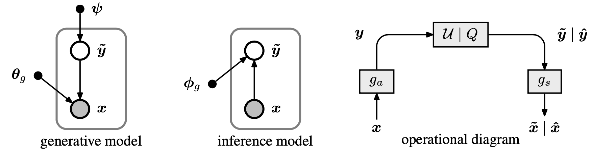
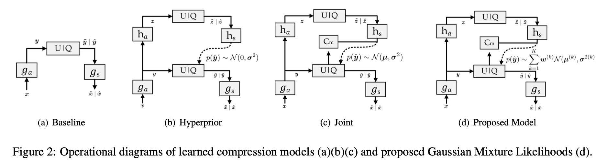
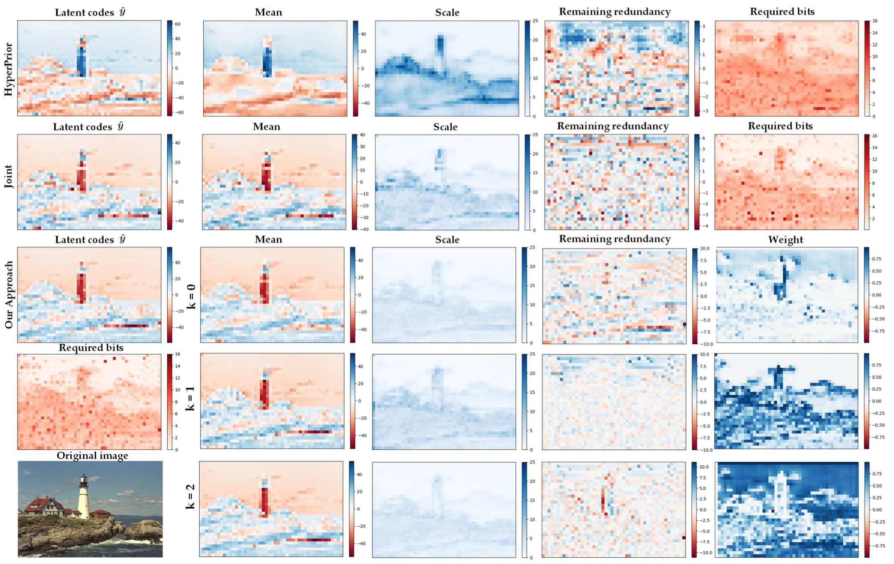
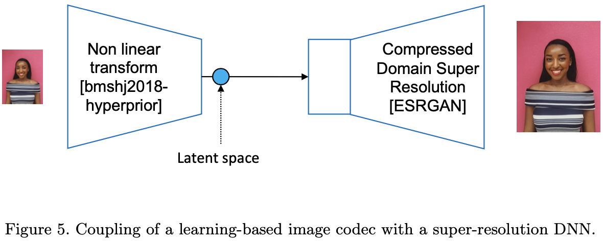
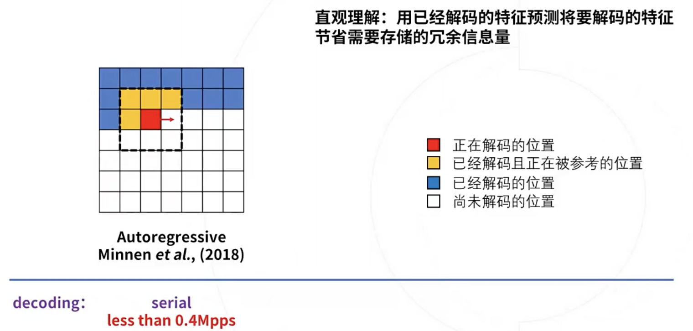
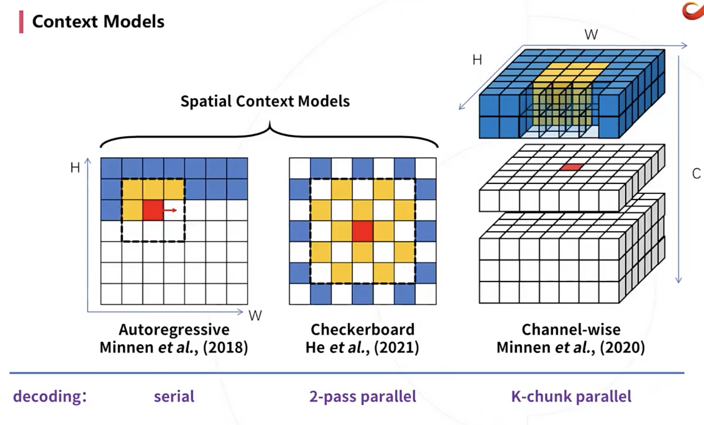
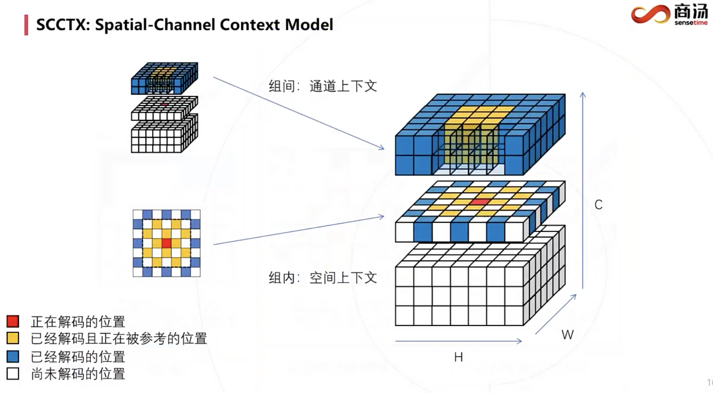
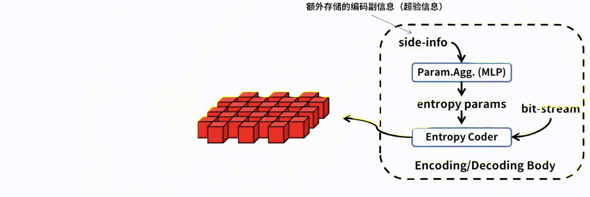

1. [2018 ICLR]
   [Variational image compression with a scale hyperprior](https://link.segmentfault.com/?enc=9MXkhfUUgDdfVcHU6VRyJQ%3D%3D.i9l6V2BfpnXFni7luYdzYVPIlw5IG6xCxuEuqKGWi01yrV4EB9HTRervDbAgi%2Fv8)

2. [2018 NIPS]
   [Joint Autoregressive and Hierarchical Priors for Learned Image Compression](https://link.segmentfault.com/?enc=oiLIBPMgNxVaaIqdzIKqJQ%3D%3D.C7upXDV10rqLRcmcIseAbhbkxj0SrRKCRQqSKxxnZW9Sq7iL8tCkHoXRiTkDD6sF)

3. [2016 ICLR]
   [Variable Rate Image Compression with Recurrent Neural Networks](https://link.segmentfault.com/?enc=ZNkt7oIug6%2FCs3TTjMdpIg%3D%3D.bybR9VTMaLmAariH%2F5J1z6Xia1dE9nTpHJzzu5iXGZpm0wRP1YAQlDjUknMk9cuK)

4. [2017 CVPR]
   [Full Resolution Image Compression with Recurrent Neural Networks](https://link.segmentfault.com/?enc=OBrs8kwf8Bxia%2Fb6Bj%2FQVw%3D%3D.pVfmWHIjNgX9m5K3TfirYPFOGRRg4%2BYNE%2FfwmK%2BZd08Om2UgZAKGV%2FsHf2EZBPsB)

5. [2019 ICCV]
   [Generative Adversarial Networks for Extreme Learned Image Compression](https://link.segmentfault.com/?enc=KZxgJI%2BGX6DjAw9QhCaarA%3D%3D.uJiAflHKIZ1ZP%2BiZuHuPcAM8YAhyCcy4D8dq%2BUEqbjCcFAEffnx3DvX0nMw6toJY)

6. [2019 MM]
   [Deep Learning-Based Video Coding: A Review and A Case Study](https://link.segmentfault.com/?enc=BNeX6GLx8c%2BLXfRUQvMRvg%3D%3D.Lo%2FaT6n65EO7I5mJ4D%2FWEKGVI9bylojwPMZ48p2Pp5I4MR6rdBA7oZrlINy5jq%2FW)

7. [2019 CVPR]
   [DVC: An End-to-end Deep Video Compression Framework](https://link.segmentfault.com/?enc=eCrGaVw%2Ff0ikOYKHsyfSow%3D%3D.1eXBe%2BoQz%2B%2Fqq%2FKr%2FOC9iRZ8gmnTcN6fomTu1Wl6SKb1E6rwVK%2B1OvCK3bgKI5di)

   [DVC博文](https://blog.zhujian.life/posts/89a466b8.html)

   [OpenDVC博文](https://blog.zjykzj.cn/posts/1da6abb8.html)

8. [2017 CVPR]
   [Optical Flow Estimation using a Spatial Pyramid Network](https://link.segmentfault.com/?enc=Ei%2B1MLp3tTlR9FtpNSMm0Q%3D%3D.ie1j1cCBg1xBtMaplK9EgDLvtjvtak9yErm1M6mKXoxBfVP7qrmiPw0ddMhp7%2By9)

9. [2019 ICCV]
   [Learned Video Compression](https://link.segmentfault.com/?enc=JHY9fyoJVv2xSydh6jC19Q%3D%3D.uoIFTWpFm1cwLhp1Jo1alf%2FylKQ7ZXkErWGjBK39KQTkZ4d%2F27IqjNz1JsBMbjptFvqEt1ic08huwhLVkFpQBbZap4kwzrQGdnkR%2FSXaMCKLEZnoYkGrjXTcODC%2B8uDfD%2Fs2%2F7dWHcxoBaWyuX1v1A%3D%3D)

10. [2022 NIPS]

   [王岩助理教授](https://air.tsinghua.edu.cn/info/1046/1555.htm)


<font color="purple">传统编码：</font>

自1948 年提出电视信号数字化设想后，图像压缩便登上了 历史的舞台。在早期编码研究中，研究重心主要集中在对信源信号的 无损压缩上，如哈夫曼编码、哥伦布编码以及算 术编码等编码方法，这一类方法又统称<font color="brown">熵编码</font>（统计冗余）。此后，变换编码（视觉冗余）和预测编码（时空域冗余）技术被分别提出。70 年代末，形成预测与变换相结合的<font color="brown">混合编码框架</font>，此后技术不断更迭，支持了更多精细化编码工具。这一框架取得了巨大的成功，形成了一系列编码标准。

<font color="purple">基于神经网络的编码：</font>

熵编码是图像压缩框架中的一个重要组成部分。根据信息论[9]编码信号所需的比特率受信息熵的限制，信息熵对应于表示信号的符号的概率分布。因此，在端到端学习图像压缩框架中嵌入熵编码组件来估计潜在表示的概率分布，并对熵进行约束来降低比特率。<font color="brown">熵编码模型提供了对所有元素的可能性的估计</font>，在熵模型中，大部分的工作都是利用算术编码对元素的符号进行无损编码。传统的图像压缩采用变换方式在配合熵编码进行图像压缩，而深度学习则是采用端到端的结构设计和不同种类的网络经过训练替代传统的固定变换方式，进而提升图像压缩。

### ICLR 2016

#### :page_with_curl:Density modeling of images using GDN

现有方法：

批量归一化（batch normalization）一旦训练完成，缩放参数通常是固定的，这就将归一化转化为数据的仿射变换。而GDN是空间自适应的，并且可能是高度非线性的

https://cloud.tencent.com/developer/article/1983313

GDN的主要贡献是引入逐点的非线性，该模块沿通道聚合信息并在每个位置缩放特征向量，表现类似于逐点注意机制。 ELIC就提出研究其他非线性变换层（如卷积残差块）作为 GDN 的替代方案。

> 卷积运算可以被BLAS库充分加速，而GDN层引入了昂贵的平方根倒数（rsqrt）

所以我觉得用SimpleGate代替也是可以的。

### ICLR 2018

#### :page_with_curl:Variational image compression with a scale hyperprior

本文思想：

本文描述了一种基于变分自动编码器（VAE）的图像压缩端到端可训练模型。 该模型结合了<font color="brown">超先验</font>以有效地捕获潜在表示（<font color="brown">latent representation</font>）中的空间依赖性。 这种超先验与辅助信息有关，这是一个几乎所有现代图像编解码器都通用的概念，但在使用人工神经网络 (ANN) 的图像压缩中很大程度上未被探索。

术语1：自编码器是一个输入和学习目标相同的神经网络，其结构分为编码器和解码器两部分。求解完成后，由编码器输出的隐含层特征h∈F，可视为输入数据X∈$\chi $的表征。


按自编码器的不同，其编码特征可以是输入数据的压缩（收缩自编码器）、稀疏化（稀疏自编码器）或隐变量模型（变分自编码器）等。

> 我理解，总之h要么Frobenius范数（元素平方的和）变小，要么变稀疏，要么维度变小但对随机噪声鲁棒。

术语2：在贝叶斯统计中，超先验是超参数上的先验分布。

<font color="purple">背景方法：</font>

与所有有损压缩方法一样，ML-based图像压缩的工作原理很简单：对通常建模为像素强度向量 $x$ 的图像进行量化，减少存储或传输所需的信息量，但同时引入误差。 通常，直接量化的不是像素强度。 相反，找到图像的替代（潜在，<font color="brown">latent</font>）表示，即其他空间 $y$ 中的向量，并且在该表示中进行量化，产生离散值向量 $\hat{y}$。 因为它是离散的，所以可以使用熵编码方法（例如算术编码（Rissanen 和 Langdon，1981））对其进行无损压缩，以创建通过信道发送的比特流。 熵编码依赖于量化表示的先验概率模型，编码器和解码器都知道该模型（<font color="brown">熵模型</font>）。

在上面提到的一类基于 ANN 的图像压缩方法中，用于压缩潜在表示的熵模型通常表示为联合分布，甚至是完全分解的分布 $p_{\hat{y}}(\hat{y}）$。 请注意，我们需要区分潜在表示 $m(\hat{y})$ 的实际边缘分布和熵模型 $p_{\hat{y}}(\hat{y})$。 虽然熵模型通常被假定为具有某种参数形式，参数适应数据，但边缘是未知分布，由编码图像的分布和用于推断潜在表示$y$的方法引出。 编解码器可以实现的最小平均代码长度，使用$ p_{\hat{y}}$ 作为它们的共享熵模型，由两个分布之间的香农信息熵给出：

​													$$R = E_{\hat{y}∼m}[− log_{2} p_{\hat{y}}(\hat{y})]$$.

> 我理解，熵模型是量化表示的先验概率模型，可知；边缘分布由输入和编码器决定，是观测的频率，未知。

请注意，如果模型分布与边际分布相同，则此熵会最小化。 这意味着，例如，当潜在表示的实际分布中存在统计依赖性时，使用完全分解的熵模型$p_{\hat{y}}(\hat{y}）$将导致次优压缩性能。

<font color="purple">现有方法：</font>

传统方法：传统压缩方法提高其压缩性能的一种方法是传输辅助信息（side information）：从编码器发送到解码器的附加信息位，这些信息对熵模型做修改，旨在减少不匹配。 这是可行的，因为特定图像的边缘分布通常与设计压缩模型的图像集合的边缘分布有很大差异。在这个方案中，希望发送的辅助信息量平均小于通过将 $p_{\hat{y}}$ 更紧密地匹配到特定图像的边缘分布，而实现的码字的减少。

传统方法手工设计的辅助信息：例如，块划分结构。

例如，JPEG (1992) 块划分是固定的 8 × 8 像素大小。 然而，一些图像结构，例如大的均匀区域，可以通过一次考虑更大的块来更有效地表示。 出于这个原因， HEVC (2013) 将图像划分为可变大小的块，并且将分块结构作为辅助信息传递给解码器。 HEVC 解码器需要首先解码辅助信息，以便它可以使用正确的熵模型来解码块表示。 由于编码器可以自由选择优化熵模型的块划分，因此该方案可用于实现更有效的压缩。

> 所以JPEG是完全分解的熵模型$p_{\hat{y}}(\hat{y}）$，而HEVC有块划分结构作为辅助信息，利用了统计依赖性。

端到端可训练模型的辅助信息：本文提出的一种体系是，熵模型参数的先验可以视为辅助信息，即latent的超先验。

<font color="purple">本文方法：</font>

2017年，本文作者Ballé 等人提出的模型，有一个完全分解的先验。

2018年的本文在它的基础上扩展了一个超先验——潜在表示的空间相邻元素往往在尺度上一起变化。

传统方法：

<font color="brown">$x$ → 参数分析变换（parametric analysis transform）$g_{a}$ → 算术编码器$AE$ → 传输压缩信号 → 算术解码器$AD$ → 参数合成变换（parametricsynthesistransform）$g_{s}$ → $\hat{x}$</font>

智能方法：

将变换 $g_{a}$ 和 $g_{s}$ 视为通用参数化函数，例如人工神经网络 (ANN)，而不是传统压缩方法中的线性变换。然后参数 $\theta_{g}$ 和 $\phi_{g}$ 封装了神经元的权重等。

写成交叉熵的形式就是：

​										$$R = E_{x∼p_{x}}[− log_{2} p_{\hat{y}}(Q(g_{a}(x,\phi _{g})))]$$.		

其中 $Q $代表量化函数，$p_{\hat{y}}$ 是熵模型。 在这种情况下，latent的边缘分布来自（未知的）图像分布 $p_{x}$ 和分析变换$g_{a}$的属性。

量化的粗糙度（步长），可以形成码率和失真的trade-off。可以将各种压缩方法视为最小化这两个量的加权和。 形式上，我们可以通过$ λ $参数化问题，$λ$ 是失真项的权重：$L=λ∗D+R$，不同的应用需要不同的权衡，因此需要不同的 $λ $值。									

为了能够使用<font color="brown">梯度下降法</font>来优化模型在变换参数（$\theta_{g}$ 和 $\phi_{g}$ ）上的性能，需要放宽问题，因为<font color="brown">由于量化，关于 $\phi_{g}$的梯度几乎处处为零。</font>

已研究的近似值包括替换量化器的梯度（Theis 等人，2017 ），以及在训练期间用加性均匀噪声替换量化器本身（Ballé 等人，2016b）。 

在这里，我们采用后一种方法，<font color="brown">训练时用加性均匀噪声，在将模型用作压缩方法时切换回实际量化。 </font>我们用$\tilde{y}$ 表示“加噪声”表示，而$\hat{y}$表示量化表示。



左图：将变换编码模型表示为<font color="purple">生成贝叶斯模型</font>，以及相应的<font color="purple">变分推理模型</font>。 节点代表随机变量或参数，箭头表示它们之间的条件依赖。 右图：显示压缩模型的操作结构的图表。 箭头表示数据流，方框表示数据的转换。 标有 U|Q的框表示在训练期间添加均匀噪声（生成$\tilde{y}$），或在测试期间进行量化和算术编码/解码（生成$\hat{y}$）。

> 变分自编码器 = 变分推理模型 + 概率生成模型

率失真损失函数：

失真：

`mse_loss = F.mse_loss(x, x_hat)`

率：

`num_pixels = N * H * W`

`bpp_loss = torch.log(y_likelihoods).sum() / (-math.log(2) * num_pixels)`

y_likelihoods，即$p_{\hat{y}}$，和latent的shape一样。

术语3：信息论

信息量，或者叫<font color="brown">自信息</font>（self-information）,其代表一个事件所能够提供信息的多少，具体计算方式为: $I(x)=−log⁡P(x)$ 。其是基于这样的想法进行信息量化的，**一个不太可能发生的事件发生了，要比一个非常可能发生的事件提供更多的信息**(概率小，log值高)。

但是，自信息只能衡量单个事件的信息量，而整个系统呈现的是一个分布因此在信息论中，使用<font color="brown">信息熵</font>来对概率分布进行量化，即$H(X)=E_{X∼P}[I(x)]=−E_{X∼P}[P(x)]$，

具体也就是$$ {\textstyle \sum_{k=1}^{N}} p_{k}log_{2}{\frac{1}{p_{k}}}$$

**信息熵**代表的是随机变量或整个系统的不确定性，熵越大，随机变量或系统的不确定性就越大。

但以上是建立在知道真实概率分布的情况下的最优策略，但实际很多情况我们的策略并不是最优。所以引入<font color="brown">交叉熵</font>，用来衡量在给定的真实分布下，使用非真实分布所指定的策略消除系统的不确定性所需要付出的努力的大小。

$$ {\textstyle \sum_{k=1}^{N}} p_{k}log_{2}{\frac{1}{q_{k}}}$$，这里$p_{k}$表示真实分布，$q_{k}$表示非真实分布

最低（最理想）的交叉熵 = 信息熵，这也是为什么在机器学习中的算法中，我们总是最小化交叉熵，因为交叉熵越低，就证明由算法所产生的策略最接近最优策略，也间接证明我们算法所算出的非真实分布越接近真实分布。

我们如何去衡量不同策略之间的差异呢？这就需要用到<font color="brown">相对熵</font>，其用来衡量两个取值为正的函数或概率分布之间的差异，即：

$$KL(f(x)||g(x))={\textstyle \sum_{x \in X}} f(x)log_{2}{\frac{f(x)}{g(x)}}$$

某个策略和最优策略之间的差异：

**相对熵 = 某个策略的交叉熵 - 信息熵**，$$ {\textstyle \sum_{k=1}^{N}} p_{k}log_{2}{\frac{1}{q_{k}}} - {\textstyle \sum_{k=1}^{N}} p_{k}log_{2}{\frac{1}{p_{k}}} = {\textstyle \sum_{k=1}^{N}} p_{k}log_{2}{\frac{p_{k}}{q_{k}}}$$

编解码用到的是，熵的本质的另一种解释：**最短平均编码长度**

> 编码方案完美时，最短平均编码长度的是多少

术语4：熵编码

如一段英文字符：AABABCABAB，A 出现了 5 次，B 出现了 4 次，C 出现了 1 次。

① 定长编码：每个符号至少需要2个bit，编码长度为 5\*2 + 4\*2 + 1\*2 = 20 bits

② 哈夫曼编码：对于出现频次更高的 A，我们可以使用更短的编码。构造哈夫曼树：  

```python
     (ABC) 
   0↙     ↘1
   A      （BC）  
        0↙     ↘1
        B       C 
   # 遵循变长编码的前缀性质，也就是任何字符，都不能成为其他字符的前缀子集
```

编码长度为 5\*1 + 4\*2 + 1\*2 = 15 bits

③ 理论的熵极限：$$ {\textstyle \sum_{k=1}^{N}} p_{k}log_{2}{\frac{1}{q_{k}}}= -0.5 * log_{2}{0.5} - 0.4 * log_{2}{0.4} - 0.1 * log_{2}{0.1} = 0.5*1 + 0.4*1.322 + 0.1*3.322 = $$ 1.361

也就是平均每个符号用 1.361 个 bit 表示。整段字符一共 10 个字母，压缩极限为 10 * 1.361 = 13.61 bits。

④ 算术编码：

```python
'''
仍是已知理想的熵模型：P(A)=0.5, P(B)=0.4, P(C)=0.1
'''

# step1: 算术编码会对0~1进行区间划分。
A:[0, 0.5), B:[0.5, 0.9), C:[0.9, 1)
# step2: AABABCABAB 的第 1 个字符为：A，那么我们选中了 A 的区间 [0, 0.5) 作为新的目标区间。
A:[0, 0.25), B:[0.25, 0.45), C:[0.45, 0.5)
# step3: 重复上述过程
当前字符	当前目标区间
A	[0, 0.5)
A	[0, 0.25)
B	[0.125, 0.225)
A	[0.125, 0.175)
B	[0.15, 0.17)
C	[0.168, 0.17)
A	[0.168, 0.169)
B	[0.1685, 0.1689)
A	[0.1685, 0.1687)
B	[0.1686, 0.16868)
# step4: 最终目标区间[0.1686, 0.16868)，二进制就是：
   [0.001010110010100...,   
    0.001010110010111...)
# 我们的诉求是进行最短压缩，所以我们要从 [0.1686, 0.16868) 选一个二进制表示最短的小数：	
    0.00101011001011
```

0.00101011001011去掉整数位和小数点后，即00101011001011，有14 bits。更为接近熵极限的13.61bits了。

算术解码就很容易了，

```python
'''
仍是已知理想的熵模型：P(A)=0.5, P(B)=0.4, P(C)=0.1
'''
A:[0, 0.5), B:[0.5, 0.9), C:[0.9, 1)
#step1: 0.00101011001011对应的小数 s = 0.16864013671875
#step2: s落在[0, 0.5)，所以第一个字符是A。
#step3: 继续划分区间A:[0, 0.25), B:[0.25, 0.45）, C:[0.45, 0.5)
s仍位于A区间，所以第二字符还是A。
#step4: 重复上述过程 
[0, 0.5) A
[0, 0.25) A 划分区间[0, 0.125), B:[0.125, 0.225）, C:[0.225, 0.25)
[0.125, 0.225) B
[0.125, 0.175) A
[0.15, 0.17) B
[0.168, 0.17) C
[0.168, 0.169) A
[0.1685, 0.1689) B
[0.1685, 0.1687) A
[0.1686, 0.16868) B                        
```

> 算术编码的压缩本质，就是在保留字符排列顺序的同时，对于更高频出现的字符，也就是概率更大的字符，赋予更大的小数区间。

哈夫曼编码采用整数进行符号编码的，不够精准。而算术编码采用小数，高频字符区间大，低频字符区间小。低频多了不确定性增加，区间切得细，需要更多码字。

<font color="brown">可以发现熵模型是相当重要的。</font>

总结：熵编码

对于量化后的特征值，还需要进行熵编码来进一步压缩。常用的熵编码方法是算术编码，重要的是设计高效的概率模型。

1.1 独立编码

由于熵编码部分可以不写到网络中，熵编码可以独立于自编码器单独设计。但是这样可以利用的信息较少，概率模型可能不够准确。假设是y的每个元素是相互独立的。

> 也译完全分解的熵模型

1.2 基于上下文的熵编码

设计一个概率模型网络，使用已经解码的信息作为网络输入，预测概率作为输出，在训练中同时训练概率模型网络和自编码器。论文[mentzer2018conditional](https://openaccess.thecvf.com/content_cvpr_2018/papers/Mentzer_Conditional_Probability_Models_CVPR_2018_paper.pdf)使用了这种方法。 `maskedconv`  称作自回归卷积的上下文模型。

1.3 基于边信息的熵编码

设计网络提取边信息，用来预测特征量化值的分布，边信息同样写入码流中。论文hyperprior使用了这种方法。

> 也译辅助信息

1.4 基于上下文和边信息的熵编码

可以同时使用两种信息（已经解码的信息+边信息）作为概率网络的输入。


### CVPR 2020

#### :page_with_curl:Learned Image Compression with GMM and attention

[code](https://github.com/LiuLei95/PyTorch-Learned-Image-Compression-with-GMM-and-Attention) 这个代码非常清楚，非常赞。而这篇论文的核心就在`means, sigmas, weights = self.entropy(phi, compressed_feature_renorm)`

我的理解很直接：

完全分解的方式，熵模型经过后处理训练后，就固定下来了。明显是次优的。

可视化发现y是可能存在多个most probable value，只用一个高斯分布也是次优的。


<font color="purple">问题发现：</font>我们发现用于率估计的准确熵模型在很大程度上影响网络参数的优化，从而影响速率失真性能。

<font color="purple">现有方法：</font>context-adaptive entropy models 上下文自适应熵模型。都是增加少量bits，希望获得更准的熵模型。

大家努力的方向：① 量化的梯度反传近似 → ② 模型结构 → ③ 上下文自适应熵模型

<font color="purple">本文方法：</font>

1. 离散高斯混合似然（Discretized Gaussian Mixture Likelihoods ）来参数化latent的分布，可以实现更准确和灵活的熵模型。

   > 高斯混合模型（Gaussian Mixture Model）

2. 加入注意力机制


算术编码器是一种接近最优的熵编码器，这使得在训练期间使用$p_{\hat{y}}(\hat{y})$作为率估计（rate estimation）成为可能。



<font color="red">(a). 基础模型：</font>

潜在表示 y的边际分布是未知的，并且没有额外的bit可用于估计$p_{\hat{y}}(\hat{y}）$。 通常使用非自适应密度模型并在编码器和解码器之间共享，也称为分解（factorized）先验。

<font color="red">(b).超先验模型：</font>

引入辅助信息$\boldsymbol{z}$来捕获latent的元素之间的空间依赖性：

$\boldsymbol{z} &=h_{a}(\boldsymbol{y}; \boldsymbol{\phi_{h}}); \\$

$\hat{\boldsymbol{z}} &= Q(\boldsymbol{z}) \\$

$p_{\hat{\boldsymbol{y}}|\hat{\boldsymbol{z}}}(\hat{\boldsymbol{y}}|\hat{\boldsymbol{z}}) &\leftarrow h_{s}(\hat{\boldsymbol{z}}; \boldsymbol{\theta_{h}})\\%(&\boldsymbol{\mu_y}, \boldsymbol{\sigma_y})$

其中$h_{a}$和$h_{s}$表示辅助的auto-encoder。 $p_{\hat{\boldsymbol{y}}|\hat{\boldsymbol{z}}}(\hat{\boldsymbol{y}}|\hat{\boldsymbol{z}})$ 是以$\hat{\boldsymbol{z}}$为条件估计的分布。 例如，bmshj2018-hyperprior这篇工作将以尺度参数 $\boldsymbol{\sigma^{2}} = h_{s}(\hat{\boldsymbol{z}}; \boldsymbol{\theta_{h}})$ 参数化的零均值高斯分布来估计 $p_{\hat{\boldsymbol{y}}|\hat{\boldsymbol{z}}}(\hat{\boldsymbol{y}}|\hat{\boldsymbol{z}})$。

<font color="red">(c).联合模型：</font>

mbt2018-mean提出了一种更准确的熵模型，该模型联合使用自回归上下文模型（在图 2（c）中表示为$C_{m}$，context model，实现应该就是`maskedconv`  [PixelCNN](https://www.codeproject.com/Articles/5061271/PixelCNN-in-Autoregressive-Models)）以及均值和尺度超先验。

为什么用context model（`maskedconv`），因为解码端只有<font color="brown">已解码的像素（上下文）</font>才能用作联合模型获得更准确的熵模型。

端到端学习的图像压缩是一种基于拉格朗日乘数的率失真优化。 损失函数是：

$\mathcal{L} = \mathcal{R(\hat{\boldsymbol{y}})} + \mathcal{R(\hat{\boldsymbol{z}})} + \lambda\cdot\mathcal{D(\boldsymbol{x}, \boldsymbol{\hat{x}})} = \mathop{\mathbb{E}}[-\log_{2}(p_{\hat{\boldsymbol{y}}|\hat{\boldsymbol{z}}}(\hat{\boldsymbol{y}}|\hat{\boldsymbol{z}}  ))] + \mathop{\mathbb{E}}[-\log_{2}(p_{\hat{\boldsymbol{z}}|\boldsymbol{\psi}}(\hat{\boldsymbol{z}}|\boldsymbol{\psi} ))]  +\lambda\cdot\mathcal{D(\boldsymbol{x}, \boldsymbol{\hat{x}})}$

其中 $λ$ 控制率失真trade-off。 不同的λ值对应不同的码率。 $D(\boldsymbol{x}, \boldsymbol{\hat{x}})$ 表示失真项。 $\hat{z}$ 没有先验，因此使用分解密度模型 $ψ$ (fac- torized density model)将$\hat{z}$编码。

<font color="red">(c).GMM模型：</font>

上面提到大量工作在解码$\hat{z}$ 之后，来模拟条件概率分布 $p_{\hat{y}}(\hat{y}|\hat{z})$。这比完全分解的熵模型$p_{\hat{y}}(\hat{y})$要准确。



图3. 使用 Kodak 数据集中的 kodim21 作为示例，可视化具有最高熵的通道的不同熵模型。第1列：量化的潜在表达$\hat{y}$；第2,3列：预测正太分布的均值和标准差；第4列：归一化的值$\frac{\hat{y}-\mu}{\sigma}$，它反映了熵模型未捕获的剩余冗余程度；第5列：可视化编码各个元素所需的比特，由$-log_2(p_{\hat{y}}(\hat{y}|\hat{z}))$计算得到。

> 好模型的目标：$\mu$接近$\hat{y}$，$\sigma$小，这样symbol所在区间的概率是最大的。$\frac{\hat{y}-\mu}{\sigma}$后，各位置分布统一转换为标准正太分布。希望这里的值越随机越好，不希望有结构性冗余。

注：第一行并不是ICLR2018的零均值模型，而是mbt2018-mean消融掉上下文模型$C_{m}$的情形。

通常，预测均值$\mu$ 接近$\hat{y}$。 复杂区域的 σ 很大，需要更多的比特来编码。 相反，平滑区域具有较小的 σ，导致所用比特较少。

> 熵模型：
>
> 根据香农定理，编码一个码字需要的最小比特数为该信息的熵，所以熵估计模型其实也可以认为是码率估计模块。
>
> 常见的参数化概率模型是高斯分布，使用均值和方差两个变量就可以对应一个完整的概率分布，也是在hyperprior和其变形结构中常用的分布类型。然而，本文发现在边缘或复杂区域，y是可能存在多个most probable value的，那么使用单个高斯就不足以准确描述变量的分布，从而作者提出了使用GMM。

作者提出使用离散GMM来对latent representation进行熵估计，这样可以对$y$提供多个最可能的均值，而每一个mixture的方差可以更小，达到的效果是实现更准确的概率模型，节约编码y所需要的比特数。


### SPIE 2021

#### Towards SR in the compressed domain of learning-based image codecs

就是原来接收端收到latent后，做解码。该工作是接收端将解码、超分用一个网络做了。这个应该可以进一步提高画质，可以试试。




### ICLR 2022

#### :page_with_curl:Entroformer: A Transformer-based Entropy Model 

有着良好的开源，主体的编解码器仍是用Balle提出的，仅熵模型的非线性转换部分使用Transformer。


熵模型是 Hyperprior+Context的联合模型。

该文还提出一个4参数的GMM，K pi / K mu / K sigma / [K coeffs]：

标准差的概率，均值，标准差，混合系数。但这种形式的互补误差函数更复杂，这也是我为什么没有看明白它的分布函数(CDF)的原因。

不过调用api的话，也好实现，这种叫做weighted bivariate normal distributions


### CVPR 2022

#### :page_with_curl:ELIC: Efficient Learned Image Compression

代码：

空间：[paper-with-code](https://paperswithcode.com/paper/checkerboard-context-model-for-efficient#code)

通道：[paper-with-code](https://github.com/tensorflow/compression/blob/master/models/ms2020.py) 这个应该比较简单，做一个通道切分就可以。

解码提速方面的文章还有：

NIPS 2020: [Improving inference for neural image compression](https://github.com/mandt-lab/improving-inference-for-neural-image-compression)

<font color="purple">1. serial</font>

2018年提出的自回归上下文模型：串行的，时间复杂度O(HW)，速度很慢。



一般来说图像编码的应用场景都对解码速度有比较严苛的要求。

<font color="purple">2. 2-pass parallel</font>



提出来2-pass棋盘方式的解码，pass 1 (anchor decoding)，pass 2 (non-anchor decoding)的时候就可以并行进行`maskedconv`了。

这里有个trade-off，就是第一遍要不要用context model。如果用了1st-pass就会比较慢，不用的话效果可能受一点影响。

<font color="purple">3. K-chunk parallel</font>

第一个通道解码后，后面通道就可以空间上并行地进行解码了，通道k\*i参考通道k\*(i-1)。

<font color="purple">4. Spatial-Channel parallel</font>



在通道分组间使用通道上下文模型，在通道分组内使用空间上下文模型。

<font color="brown">注：</font>第一个通道的1st-pass的位置是最先解码的，没法使用context model的。它们被解码后作为anchor，解码接下来的位置。



<font color="purple">5. 进一步分析优化</font>

K-chunk parallel原本分组粒度是均匀的。

注意K-chunk是这个演讲里提出来的命名方式，不同于原论文，示例是K=10。

下图可视化（通道总数C=320，K=10，10-slice evenly grouping，每组通道数32）：


类似传统编码，称这个现象为信息集中效应（Information Compaction）。


ELIC提出可以前面的分组包含的通道更少，使其信息更集中，率失真性能会更好。

另外，先解码的通道16+16+32+64已经包含主要的语义信息了，可以通过一个轻量解码器，重建低分辨率预览图。而完整解码器，重建完整分辨率的图像。


#### :page_with_curl:DPICT: Deep Progressive Image Compression Using Trit-Planes

#### :page_with_curl:Unified Multivariate GMM & Multi-codebook Quantizers

PyTorch有MultivariateNormal，可能就是看这个想到的。

#### :page_with_curl:Window-based Attention 

#### :page_with_curl:Neural Data-Dependent Transform for LIC


### ECCV 2022

#### :page_with_curl:Implicit Neural Representations for Image Compression


### 5th CLIC

#### :page_with_curl: PO-ELIC: Perception-Oriented Efficient Learned Image Coding

在作者此前发表的SOTA方法ELIC的基础上，加上了基于感知的损失函数。


### Idea:

#### 角度：

更强大的变换模块，

更精确的熵模型，

感知损失的优化。

① Back-projection：解码器将结果再压缩，要求和原来的latent比较相似。甚至可以要求熵模型相同，也就是latent得到的z相同。

这个和感知损失函数DAE有点相似，只是这里还是用的原来的编码器。

感觉直接用DAE也不是不可以。


② K-chunk context model结合网络结构设计，创造多尺度loss

③ $z_{latent}$解码后用频率作为target计算loss。但这个需要积累非常多的输入作为辅助，可能需要后期主体网络固定后finetune auto-encoder-z的时候再使用。因为主体网络和熵估计网络是互相<font color="brown">耦合</font>、影响的。 所以不将主体网络训固定，还不能去独立优化熵估计网络。

finetune后统计最大的几项，topk，作为mean。scale则越小越好。

```
mask = torch.unique(y_quant)
print(data.shape)
tmp = []
for v in mask:
    tmp.append(np.sum(data==v))
```

我认为可以用laplace分布来进行这个实验，因为最终只要z能准确复原y的分布，那概率最高的区间越集中越好。这样就是为什么GMM文章认为mean越接近越好，scale越小越好。

不成熟的思考：

- 也可以用脉冲分布（高斯分布scale→0，狄拉克分布），多脉冲分布，因为像GMM一样可能PDF存在多个极大值的。
- 但脉冲分布存在缺点：
  1. 脉冲分布不一样的好编码。不过z_latent肯定是比y小很多很多的，不然一个无损的脉冲分布，相当于传2个y了。所以到底是GMM好，还是LMM、DMM，得看hyper-autoencoder的压缩情况。
  2. 鲁棒性不一样的好，如果出现估计错误，导致严重的码字浪费。
  3. 如果脉冲可以的话，就像z_latent一样用estimate_bits了，不需要精心设计熵模型。
  4. 我们可以attention，不同区域用不同高斯数目(K)的GMM。（就是这样不太好实现，没有torch.distribution直接支持这种mixture。）

甚至拿测试集overfitting熵估计，主体网络不动。不过这样没有意义，因为比赛是先提交解码器，再才公布最终测试集。防止那网络参数过拟合的现象。


④ 使用预训练模型。

⑤ 去掉GDN，直接relu系列，加上quant内置sigmoid。

⑥ 去掉GDN，换成SimpleGate

⑦ 训练encoder+decoder时联合训练。之后单独finetune decoder，只用失真损失。stage0: loss, stage1: bpp, stage2: distortion

⑧ 我发现还挺难训练的，两个loss起相反的作用。所以我的想法是主体的编码器和熵编码部分训练bpp loss，主体的解码器训distortion loss，轮流进行。不过这样感觉也有问题，解码器输入很差，巧妇难为无米之炊。

⑨ ROI和非ROI区域，使用不同lambda。也就是在不增加复杂度的条件下有更好的率失真优化。

⑩ z_hat是建模y_hat的熵模型的。现有方法只对z的通道间学习得到不同概率，空间上是相互独立的。但如果使用checkboard模型，z_hat空间上应该要能表征pass1和pass2的像素。

可以用pixelshuffle实现，0 1 2 3，downshuffle下来1、3的通道是一种概率，0、2的通道是另一种概率。然后再upshuffle回去。

11.超先验模型和自回归上下文模型提取的特征concat时可以使用通道注意力。

12.网络插值实现可变码率？

13.bag of tricks, full of bells and whistles

14.解码端构造一个类似MPRNet的结构，就是不同分支都得到解码输出，然后粗的给精的作为注意力（预览的话只用粗的分支）。这个也可以满足不同算力的解码终端（低算力只用粗的）。

15.熵编码可以用Swin Transformer，不影响主体网络的设计

16.使用我们现在的轻量增强网络进行后处理。

17.发现用3通道的灰度图训练，最后对彩色图像进行压缩重建，也成了灰度的。说明真的学到了数据特征，也真的要注意数据的丰富性和泛化能力的问题。

18.y_hat的channel是影响不大的。通常设置128和192。如果distortion的lambda大，全零的通道就少一点。这些全零的通道算了概率后本来也不占码率。

19.通道间的熵模型的核心，比如前面通道的当前位置像素一样可以作为上下文。也就是对于这些通道来说是type B。

20.虽然现在解码每个i，j的整图都经过卷积，比较蠢。但这部分不是很核心。最后有空再优化速度。

21.soft-then-hard，先用均匀噪声学习（soft），之后固定量化的输入，只学习、微调解码器。（hard）。单纯soft的坏处是train-test mismatch，单纯hard的坏处是梯度是不对的。其实加噪的梯度也不对，因为四舍五入是和数本身相关的。但噪声是独立的。不过这个第二步finetune合理。

22.checkboard可以用pixel-shuffle代替，速度更快，并且形式更漂亮。可以作为核心创新点。checkboard 卷积有5x5的运算，但实际只使用/看到一半的元素。pixelshuffle是提升性能的重要baseline。再一个，checkboard方式的z_hat也不能简简单单的空域一样的，见⑩，导致空域一样的假设是不正确的。但用pixel-shuffle就没有这个问题，z_hat的分辨率和y_hat_anchor、y_hat_noanchor一致就ok了，单边都是y_hat的一半。

23.帧内预测相当于都放在熵模型来做。所以熵模型部分非常重要。

24.Entroformer的z也用的高斯，只不过是完全分解的。


