### 李沐团队带读系列

#### Paper-reading-principle

Pass1: 读标题，摘要，结论，方法、实验的图表 —— 得出文章是否适合自己，要不要读。Pass2: 从头到尾读。Pass3: 精读，仿佛自己从头到尾在做这个研究。

### 沈向洋带读系列

#### Ten Questions

论文十问由沈向洋博士提出，鼓励大家带着这十个问题去阅读论文，用有用的信息构建认知模型。写出自己的十问回答，还有机会在当前页面展示哦。

**Q1**论文试图解决什么问题？

**Q2**这是否是一个新的问题？

**Q3**这篇文章要验证一个什么科学假设？

**Q4**有哪些相关研究？如何归类？谁是这一课题在领域内值得关注的研究员？

**Q5**论文中提到的解决方案之关键是什么？

**Q6**论文中的实验是如何设计的？

**Q7**用于定量评估的数据集是什么？代码有没有开源？

**Q8**论文中的实验及结果有没有很好地支持需要验证的科学假设？

**Q9**这篇论文到底有什么贡献？

**Q10**下一步呢？有什么工作可以继续深入？

#### :page_with_curl: Video imprint

构造并学习一个更通用的视频时空表征。

#### :page_with_curl: Swin Transformer

**分析现有方法：**

Transformer本来是处理文本的，不需要处理不同尺度的信息的问题。

ViT对Transformer的改造很简单直接，但没考虑视觉信号的一些特点。

主要有以下挑战：

- 视觉实体变化大，在不同场景下视觉Transformer性能未必很好（所以ViT只能做做分类问题，不太适合检测、分割）
- 图像分辨率高，像素点多，Transformer基于全局自注意力的计算导致计算量较大

本工作就是希望Transformer能更好的适应视觉信号（层次性hierarchy/局部性locality/平移不变性translation invarianc）

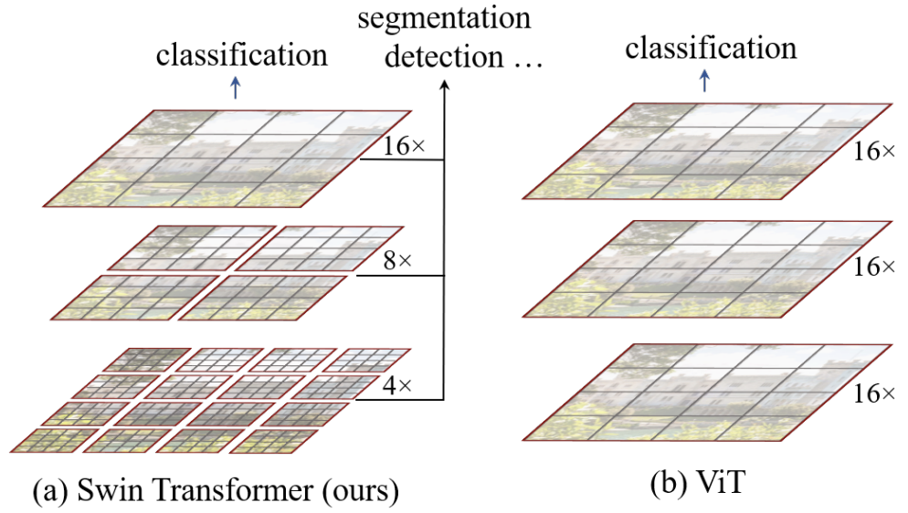

针对现有问题，提出了一种**包含滑窗操作，具有层级设计**的Swin Transformer。

**本文方法：**

用shifting window而不是sliding window。

## 画质增强

#### :page_with_curl: Multi-Stage Progressive Image Restoration

[MPRNet](https://arxiv.org/pdf/1803.05407.pdf)

CVPR 2021 *Inception Institute of AI, UAE*

**分析现有方法：**

1. encoder-decoder结构 ：<b>优：</b>更宽的上下文信息，<b>劣：</b>保持细节不足。
2. single-scale pipeline ：<b>优：</b>保持空间上的精确细节，<b>劣：</b>语义上不太可靠。

**该文观点：**

1. 在multi-stage结构中，结合encoder-decoder与single-scale pipeline，是必要的。
2. multi-stage不仅仅是上一阶段的输出，也作为下一阶段的输入。
3. 每一阶段都用上监督信息是很重要的，渐进式学习。由此，设计supervised attention module (SAM)模块。
4. 该文提出了将上一阶段特征(contextualized)传递给下一阶段。由此，设计cross-stage feature fusion (CSFF)方法。

**网络结构：**

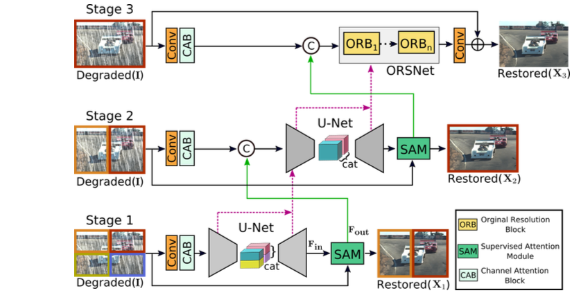


#### :page_with_curl: Pix2Pix

Image-to-Image Translation with Conditional Adversarial Networks

工作比较老了，提出了Patch-GAN。

后面有[工作](https://openaccess.thecvf.com/content_cvpr_2018/papers/Wang_High-Resolution_Image_Synthesis_CVPR_2018_paper.pdf)改进了生成器

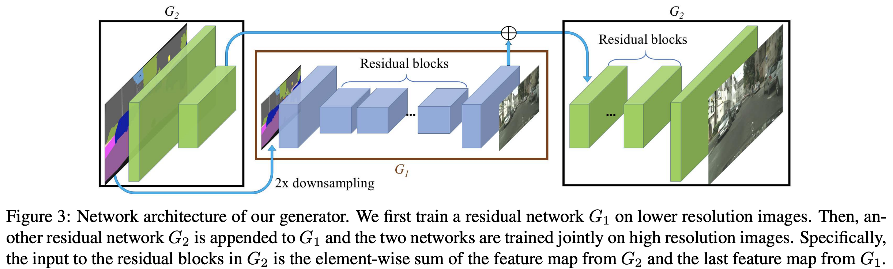


#### :page_with_curl: Series-Parallel Lookup Tables

[SPLUT]()

ECCV 2022 *Tsinghua University*

**分析现有方法：**

1. LUT通过快速内存访问代替耗时的计算，具有实用性。
2. 但是大多数现有的基于 LUT 的方法只有一层 LUT。 如果使用 n 维 LUT并且用于查询v个可能值，则 LUT 的尺寸有 v^n。 因此，通常将 v 和 n 设置为较小的值以避免无法承受的大 LUT，这严重限制了效果。


#### :page_with_curl: RAISR: Rapid and Accurate Image Super Resolution

[RAISR]()

TCI 2016 *Google*

**分析现有方法：**

1. 传统插值方法，是内容无关的线性方法，表达能力不足。
1. 全局滤波效果不如大量参数且非线性的神经网络；所以改全局为图像块内容自适应。

**该文观点：**

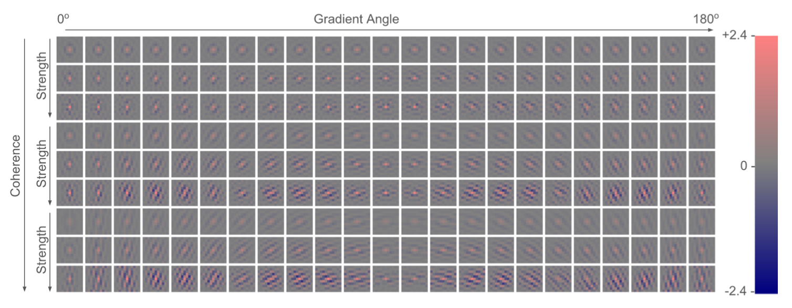

1. 倾向example-based方法，即使用外部数据集学习LR patch到HR patch的映射。

2. RAISR 背后的核心思想是通过在图像块上应用一组预先学习的过滤器来提高画质，这些过滤器由高效的散列机制选择。

   1. 过滤器是基于 LR 和 HR 训练图像块对学习的
   2. 哈希是通过估计局部梯度的统计信息来完成的。

3. 过程：

   1. 插值上采样或pixelshuffle机制，参考：edge–SR: Super–Resolution For The Masses

   2. 局部梯度的函数得到{角度, 强度, 连贯性}3个哈希表的键。最终经过散列计算得到索引值（散列意味着冲突尽可能少）

      > 用eigenvector,eigenvalue

      哈希表键是局部梯度的[函数](https://www.academia.edu/download/42362012/feng_asilomar.pdf)，哈希表条目是相应的预学习过滤器。比“昂贵”的聚类（例如 K-means、GMM、字典学习）更加高效。

      > 假如每桶有n个filter，那么可设置index = f(angle, strength, coherence)的散列函数，在f(0,0,0)=0，f(1,1,1)=n。
      >
      > 我们有trick避免冲突。

   3. 如若上采样+滤波，滤波器组只需一个(但尺寸要求较大)。如若滤波+pixelshuffle，滤波器组需要上采样倍数^2个。

      1. 上采样+滤波，会更复杂的有Pixel-Type，这是由于插值方法的特性（像素的来源不同）导致的。
      2. 滤波+pixelshuffle，不需要Pixel-Type，或者说Pixel-Type隐含在了我们有4组滤波器，即4种Type。

   4. 所有滤波器权重均由学习得到。

4. 优化点：

   1. 考虑许多上采样kernel中心对称的特性。可以减少一半冗余。
   2. 考虑使用量化。RAISR只有单层，不存在误差累积。

5. av1 CDEF 有8个方向mode，DCC就是把里面的8个方向mode简化为4个，这个方向mode，在raisr、deringing里也有机会用到。[CDEF介绍](https://blog.csdn.net/weixin_44696799/article/details/109284068)


#### :page_with_curl:Learning Steerable Function for Efficient Image Resampling

感觉这篇文章非常值得看，可以对传统插值/RAISR/SR-LUT等方法的联系和区别，有更深刻的认识。

RAISR是手工的特征，基于学习的规则。

> Engineers design everything.
>
> Engineers design features. ML models learn rules from data.
>
> DL models learn both features and rules from data.

而本文的LeRF，是采用基于学习的特征（structural priors learned by DNNs）。

解决两个问题：效率和任意倍数，efficient and continuous solution

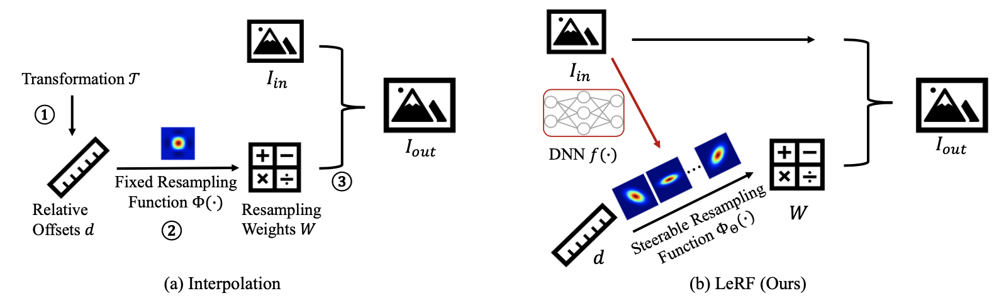

传统插值：

1. 获取相对偏移量：将变换后的目标坐标（如上采样）投影回输入图像的坐标空间，获取其支持块（their support patches）中目标像素和源像素之间的相对空间偏移量。

2. 预测重采样权重：根据相对空间偏移量，为支持块中的每个像素预测重采样权重，即重采样核。

3. 聚合像素：通过加权求和聚合源像素以获取目标像素。

本文方法：

1. 与插值中的固定重采样函数不同，我们假设一种可控重采样函数 $Φ_Θ$，由 $Θ$ 参数化。 具体来说，我们利用各向异性高斯，其中 ρ、σX 和 σY 是超参数，因此重采样函数变为 $Φ(ρ,σ_X ,σ_Y )$ 。

   从统计学的角度来看，$ρ$可以解释为二维变量与$σ_X$、$σ_Y$标准差之间的相关性。

   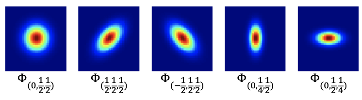

   可以看到通过调整超参数$(ρ，σ_X，σ_Y)$获得不同的方向和形状，显示其对各种局部结构的建模能力。

2. 采用深度神经网络从外部数据集学习结构先验，以预测重采样函数中的超参数 $Θ$，即这里的$(ρ,σ_X ,σ_Y )$。

3. DNN-to-LUT，采用查找表来加速。索引/键是输入图像的像素组合，值是对应的超参$(ρ,σ_X ,σ_Y )$。

   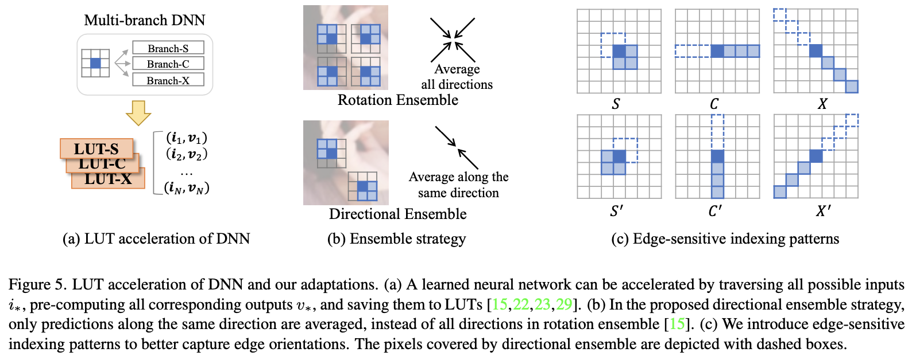

4. 不同于现有的基于 LUT 的方法，其 LUT 值是图像像素，本文的 LUT 存储反映结构特征的超参数。 因此，为了更好地提取结构先验，本文提出以下调整。

   - 定向集成策略。 我们提出了一种定向集成 (DE) 策略来替代现有基于 LUT 的方法中的旋转集成 (RE) 策略。即只做180度旋转的集成学习，这符合 $ρ$ 的学习特性。

     > 我注：90度旋转的集成，应该可以通过$ρ$ 反号来完成。得可视化观察才知道。

   - 如图5 (c) 所示，本文增加了模式“C”和“X”以及默认的“S”模式，以更好地捕捉不同方向的边缘。 例如，“C”和“C'”图案分别对垂直和水平边缘敏感。相应地，DNN 遵循多分支设计，每个分支都由一个 LUT 加速。


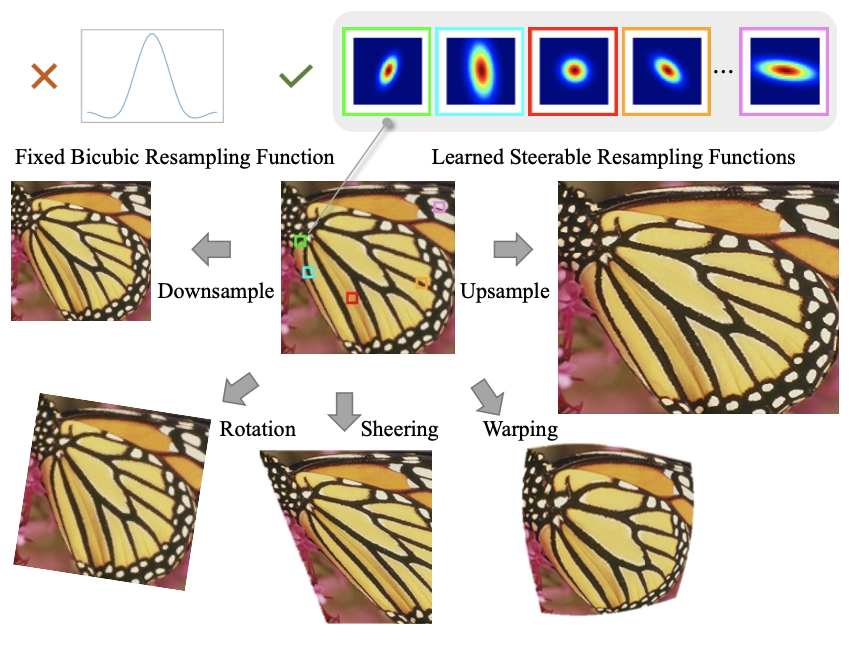


#### :page_with_curl: BLADE: Best Linear Adaptive Enhancement

**分析现有方法：**

> 深度学习：DL methods can <font color="red">trade</font> quality <font color="red">vs.</font> computation time and memory costs through considered choice of network architecture.
>
> Deep networks are hard to analyze, however, which makes failures challenging to diagnose and fix.
>
> These problems motivate us to take a lightweight, yet effective approach that is <font color="red">trainable</font> but still <font color="red">computationally simple</font> and <font color="red">interpretable</font>.

相关工作：

A Deep Convolutional Neural Network with Selection Units for Super-Resolution

**本文方法：**

我们的方法可以看作是一个浅层的双层网络，其中第一层是预先确定的，第二层是经过训练的。 我们表明，这种简单的网络结构允许推理计算效率高、易于训练、解释，并且足够灵活以在广泛的任务中表现良好。

**滤波器选择：**

我们发现结构张量分析（structure tensor analysis）是一个特别好的选择：它是稳健的、相当有效的，并且适用于我们测试过的一系列任务。 结构张量分析是局部梯度的主成分分析（PCA）

**图像结构张量：**

From the eigensystem, we define the features:

- <font color="purple">$\text{orientation} = \arctan w_2/w_1$</font>, is the predominant local orientation of the gradient;

- <font color="purple">$\text{strength} = \sqrt{\lambda_1}$</font>, is the local gradient magnitude; and

- <font color="purple">$\text{coherence} = \frac{\sqrt{\lambda_1} - \sqrt{\lambda_2}}{\sqrt{\lambda_1} + \sqrt{\lambda_2}}$</font>, which characterizes the amount of anisotropy in the local structure.


**阅读评价：**

和eSR-MAX某种意义上是等价，“This spatially-adaptive filtering is equivalent to passing image through a linear filterbank and then for each spatial position selecting one filter output”，但提前逐像素进行了模板选择，减少了计算资源的浪费。这篇文章提到，“three-dimensional index”，和我的思路是不谋而合的。

#### :page_with_curl: Fast, trainable, multiscale denoising

主要在RAISR基础上加了多尺度。

固定尺度但当遇到比较高的噪声强度时，仅仅5x5或7x7的滤波核大小，也不足以

#### :page_with_curl: Multiscale PCA for Image Local Orientation Estimation

[MS-PCA]()

**思想：**

PCA（主成分分析）+ multiscale（多尺度金字塔）进行图像局部方向估计

**主成分分析：**

PCA ① 寻找能尽可能体现差异的属性，② 寻找能够尽可能好地重建原本特性的属性。两个目标是等效的，所以PCA可以一箭双雕。这个属性我们一般称为主成分、特征。Q：为什么两个目标等效 A：假设是一个假设新的特征是线性组合的直线。

**多尺度：**


#### :page_with_curl: edge–SR: Super–Resolution For The Masses

[edge-SR]()

WACV 2022 *BOE*

**分析现有方法：**

1. 超分辨率的历史

- - 传统插值算法：linear或者bicubic上采样，在低分辨率图像上插0然后低通滤波得到，对应pytorch、tf中的反卷积(*strided transposed convolutional layer*)
  - 先进的上采样算法：利用几何原理提升质量，自适应上采样和滤波为主
  - 深度学习：用CNN的SRCNN、用ResNets的EDSR、用DenseNets的RDN、用attention的RCAN、用非局部attention的RNAN、用transformer的SwinIR等

2. FSRCNN 和 ESPCN 都在未来的 SR 研究中留下了深刻的印记，这些研究经常以低分辨率执行计算并使用pixel-shuffle layers上采样。

**该文贡献：**

提出单层架构超分，详尽比较速度-效果权衡，对单层架构中的自注意力策略的分析和解释。

**该文观点：**

传统插值的上下采样是等效于：filter–then–downsampling和upsampling–then–filter。张量处理框架则使用跨步转置卷积层实现这种上采样。

传统插值上采样图示：

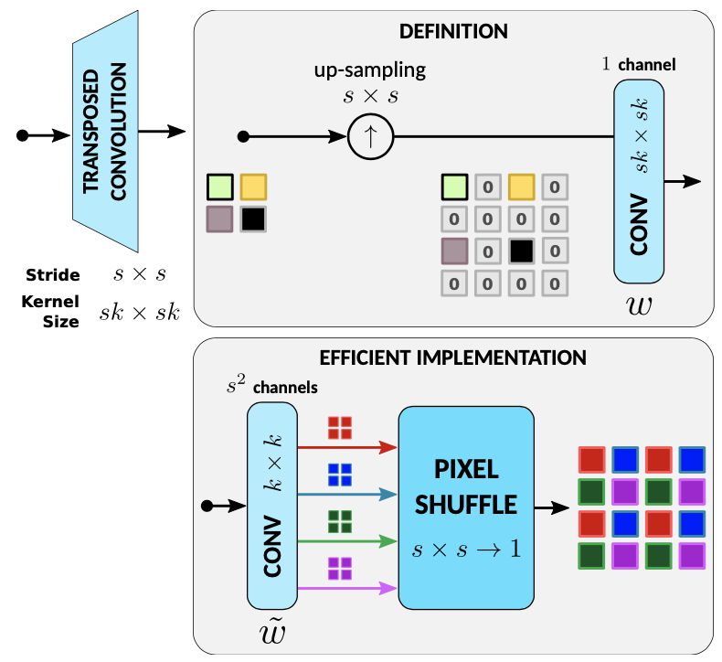

但图中的定义的升频(upscaling)显然效率低下，因为上采样(upsampling)引入了许多零，当乘以滤波器系数时会浪费资源。 一个众所周知的优化，广泛用于经典升频器的实际实现中，是将插值滤波器从图中的大小 sk×sk 拆分或解复用为 s^2 所谓的大小为 k × k 的高效滤波器。 然后，s^2 个滤波器的输出通过Pixel-Shuffle操作进行多路复用，以获得放大后的图像。

上采倍数越高，s越大，意味着实现**1**的核大小越大，或实现**2**的卷积通道数越大。

**提出模型：**

- eSR：

  卷积输出s^2个通道，最后pixel-shuffle得到超分结果。

- eSR-MAX：卷积输出C * s^2个通道，pixel-shuffle后，每C个通道取一个最大值。

  思想源自Maxout networks。

- eSR-TM：卷积输出2 * C * s^2个通道，pixel-shuffle后，前C个通道softmax，得到概率对后C个通道加权平均。

  属于自注意力，思想是Template Matching。

- eSR-TR

- eSR-CNN

**阅读评价：**

有启发意义，但实际由于硬件支持（比如耗时的softmax），并不如我们ZoomSR速度快。效果也是锯齿比较严重。另外，eSR-TM不一定得用softmax，用tanh，或者啥也不用应该也是有理由的。比如NAFNet的非线性激活就是个例子：

```python
class SimpleGate(nn.Module):
    def forward(self, x):
        x1, x2 = x.chunk(2, dim=1)
        return x1 * x2
```

#### **:page_with_curl:SamplingAug: Patch Sampling Augmentation for SISR**

[SamplingAug](https://github.com/littlepure2333/SamplingAug)

**分析现有方法：**

现有方法大多在均匀采样的 LR-HR 补丁对上训练 DNN，这使得
 他们未能充分利用图像中的一些提供有用信息的补丁。

最近去噪领域也有工作提出训练一个额外的 PatchNet 来选择更多信息的补丁样本进行去噪网络的训练，能显著提高网络性能。

**该文方法：**

启发式度量来评估每个补丁对的信息重要性，再据此进行采样。

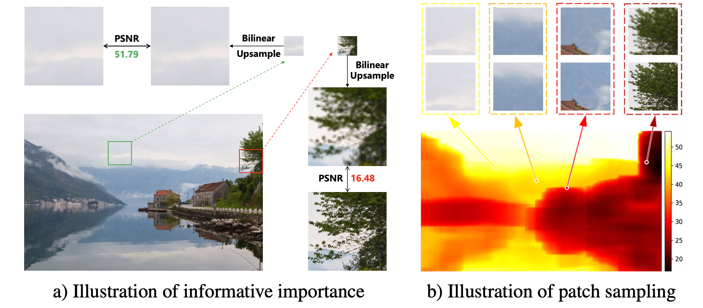

具体启发是：

能被线性函数超分的patch通常提供的重要信息更少。所以本文设计的度量方式是linearSR (如bilinear插值) 和HR之间的PSNR。

做法：

- 由于对所有overlapped patch都度量，计算复杂度会高。所以这里只对整个的积分图做linearSR。

- 考虑三种采样策略：

  1. 采样根据度量前p%的informative patches

  2. NMS(Non-Maximum Suppression)方法

     > 非极大抑制，是在重叠度较大的候选框中只保留一个置信度最高的。（Fast R-CNN中提出的）。

  3. TD(Throwing-Dart)采样策略

     > dart throwing （像一个人蒙上眼睛胡乱扔飞镖的样子）常用于渲染随机均匀的点组成的图案。每次在区域内随机选择一个点，并检查该点与所有已经得到的点之间是否存在“冲突”。若该点与某个已得到的点的最小距离小于指定的下界，就抛弃这个点，否则这就是一个合格的点，把它加入已有点的集合。重复这个操作直到获得了足够多的点。

  b、c会导致非重叠的采样，a、b、c都可以提升性能，其中策略a居然是效果最好的。说明信息量较少的样本可能对 SISR 的性能没有贡献。

- 积分图（integral image）又称总和面积表（summed area table）是一个快速且有效的对一个网格的矩形子区域中计算和的数据结构和算法。（就是junlin在面试时考我的数据结构）。

- 所有patchsize训练都会受益，不过小patchsize更明显；

  小模型的采样比例p越小效果越好，大模型的p可以稍大一点。这是由模型容量决定的；

  SamlingAug不同于<font color="brown">困难样本挖掘</font>（OHEM），OHEM只反传每个batch中最高的损失。用于SR时难以收敛。

  > Adobe的超分方法也有类似idea：
  >
  > A second key piece is that we focused our training efforts on “challenging” examples — image areas with lots of texture and tiny details, which are often susceptible to artifacts after being resized.
  
  


**阅读评价：**

2021、2022年SR领域提出多篇不同复杂度的网络处理不同难度的patch的工作，出发点一致，只是方法侧重略有不同。然而现有的inference engine对这类方法还不够友好。

而SamlingAug从训练样本的角度出发，则更为有意思一点。感觉和<font color="brown">困难样本挖掘</font>的思路有点类似，但绕了一道，不是直接SR和HR之间loss来决定是否反传。而是linearSR和HR之间的loss来决定是否反传。就成了与当前网络无关的独立因素了，避免了训练不稳定。

> 我这种思路，再结合topk的代码，还是挺好实现的。

#### :page_with_curl: Invertible Image Rescaling


#### :page_with_curl:Rate-Perception Optimized Preprocessing

RPP是b站上产线的一个编码前处理方法。

- 提出adaptive Discrete Cosine Transform (DCT) loss 
- 结合high-order degradation model
- 结合efficient lightweight network design (1080p@87FPS)
- 结合Image Quality Assessment model

#### :page_with_curl:Netflix Downsampler

https://netflixtechblog.com/for-your-eyes-only-improving-netflix-video-quality-with-neural-networks-5b8d032da09c

Netflix做点播，可以不那么在乎复杂度（相对ZOOM）。看的人多，省的带宽也多，处理片源的成本就不算什么了。

#### :page_with_curl: Pixel-Adaptive Convolutional Neural Networks

[PAC](https://suhangpro.github.io/pac/)

**分析现有方法：**

权重共享的标准卷积是content-agnostic的。这个劣势可以通过学习大量滤波器来解决，但这样做增加了待学习的参数量，需要更大的内存占用和更多的标注数据。 另一种是content-adaptive的卷积：

- 一类是使传统的图像自适应滤波器可微分，例如双边滤波器（bilateral filters ）、导向滤波器（guided image filters ）、非局部均值（non-local means ）、传播图像滤波（propagated image filtering  ），并将它们用作 CNN 的层。 这些内容自适应层通常设计用于增强 CNN 结果，但不能替代标准卷积。 
- 另一类是内容自适应网络，使用单独的子网络学习特定位置的核，该子网络预测每个像素的卷积滤波器权重。 这些被称为“动态滤波网络”（DFN），也称为交叉卷积（cross-convolution）或核预测网络（KPN）。尽管 DFN 是通用的并且可作为标准卷积层的替代品，但很难扩展到具有大量滤波器组的整个网络。

**本文方法：**

标准卷积：

$\mathbf{v}'_i = \sum_{j \in \Omega(i)} \mathbf{W}\left[\mathbf{p}_i - \mathbf{p}_j\right] \mathbf{v}_j + \mathbf{b} $  (1)

这里$\mathbf{p}_i$是像素坐标。稍微滥用了符号，本文使用$[\mathbf{p}_i - \mathbf{p}_j]$来表示2D的空间维度
偏移量的索引。公式(1)可见，权重仅取决于像素位置，因此与图像内容无关。 换句话说，权重在空间上是共享的，是image-agnostic的。

现有动态卷积：

$\mathbf{v}'_i = \sum_{j \in \Omega(i)} \mathbf{W}\left(\mathbf{f}_i - \mathbf{f}_j\right) \mathbf{v}_j + \mathbf{b}$ (2)

使卷积操作内容自适应的一种直观方法，而不仅仅是基于像素位置，是将 W 泛化为依赖于像素特征。它的缺点是 ① 计算开销(overhead)大 ② 特征f很难学。需要手动指定特征空间，例如位置和颜色特征f = (x, y, r, g, b)。③ 我们必须限制特征的维度 d（例如，< 10），因为投影的输入图像在高维空间中可能变得过于稀疏。 ④ 此外，标准卷积的权值共享带来的优势在高维滤波中消失了。

像素自适应卷积：

$\mathbf{v}'_i = \sum_{j \in \Omega(i)} K\left(\mathbf{f}_i, \mathbf{f}_j\right) \mathbf{W}\left[\mathbf{p}_i - \mathbf{p}_j\right] \mathbf{v}_j + \mathbf{b}$  (3) 

其中 K 是具有固定参数形式的核函数，例如高斯：$K(\mathbf{f}_i, \mathbf{f}_j)=\exp(-\frac{1}{2}(\mathbf{f}_i-\mathbf{f}_j)^\intercal (\mathbf{f}_i-\mathbf{f}_j))$

因为 K 具有预定义的形式，我们可以在 2D 网格本身上执行此过滤，而无需移动到更高维。 我们将上述滤波操作（等式 3）称为“像素自适应卷积”（PAC），因为标准空间卷积 W 通过内核 K 使用像素特征 f 在每个像素处进行自适应。我们将这些像素特征 f 称为“自适应特征 ”，内核 K 为“自适应内核”。 **自适应特征 f** 可以是手动指定的，例如位置和颜色特征 f = (x, y, r, g, b)，也可以是端到端学习的深度特征。

<font color="red">PAC可以看作几种广泛使用的滤波操作的泛化形式：</font>

- 标准卷积可以看作PAC的特例，$K(\mathbf{f}_i, \mathbf{f}_j) = 1$。这可以通过设置常数自适应特征 f 来实现，即$\mathbf{f}_i = \mathbf{f}_j, \forall i,j$。

- 双边滤波也可看作PAC的特例，其中W 也有固定的参数形式，例如 2D 高斯滤波器：$\mathbf{W}\left[\mathbf{p}_i - \mathbf{p}_j\right]=\exp(-\frac{1}{2}(\mathbf{p}_i-\mathbf{p}_j)^\intercal\Sigma^{-1}(\mathbf{p}_i-\mathbf{p}_j))$.

  > 双边滤波（Bilateral filter）是**一种非线性的滤波方法，是结合图像的空间邻近度和像素值相似度的一种折中处理，同时考虑空域信息和灰度相似性，达到保边去噪的目的**。

- 池化操作也可以由 PAC 建模。平均池化对应PAC的特例，

  $K(\mathbf{f}_i, \mathbf{f}_j)=1,\; \mathbf{W}=\frac{1}{s^2}\cdot\mathbf{1}$，最近提出的细节保持池化，对应$K(\mathbf{f}_i, \mathbf{f}_j)=\alpha + \left(|\mathbf{f}_i-\mathbf{f}_j|^2+\epsilon^2\right)^\lambda$

**阅读评价：**

文章提到了自注意力，说概念类似，但是PAC只关注local，不需要很高的复杂度。但比较好奇这样和空间注意力有啥区别？可能唯一区别是多了img2col。在卷积操作时起作用。

https://www.yuque.com/lart/architecture


#### :page_with_curl:Component Divide-and-Conquer for Real SR

现有方法：学习具有传统像素级损失的 SR 模型通常很容易受到平坦区域和强边缘的支配。

动机：SR的目标随着具有不同low-level图像元素的LR区域而变化，例如，平坦区域的平滑度保持、边缘的锐化以及纹理的细节增强。

> 复原难度上：纹理 > 边缘 > 平坦区域

本文：提出CDC策略的网络，提出Gradient-Weighted (GW) loss.

GW loss有点类似Focal loss，平衡了不同难度样本的学习问题。


#### :page_with_curl:GFP-GAN


#### :page_with_curl:Null-Space Learning for Consistent SR

零空间学习

#### :page_with_curl:IQA: Unifying Structure and Texture Similarity

#### :page_with_curl:Super Resolution for Compressed Screen Content Video

屏幕内容超分

现有超分失效的原因：

1. 数据gap：自然场景内容相对平滑，带有附加传感器噪声。 相比之下，屏幕内容视频可能具有锐利的边缘、高对比度的纹理和无噪声的内容。

   经过编码的屏幕内容：局部切入和截断在屏幕内容视频中很常见，这可能会由于缺少有利的参考而导致编码质量下降。

2. 其次，现有方法采用连续的相邻帧作为输入，而不考虑场景瞬间切换或局部突变。

3. 大多现有方面没有考虑压缩失真。

相关工作：

SSIM把两幅图的相似性按三个维度进行比较：亮度，对比度和结构。公式的设计遵循三个原则：对称性s(x,y)=s(y,x)、有界性s(x,y)<=1、极限值唯一s(x,y)=1当且仅当x=y。

比如，亮度相似度：$l(x,y)=\frac{2\mu_{x}\mu_{y} + C_{1}}{\mu_{x}^{2}+\mu_{y}^{2}+C_{1}} $

本文贡献：

- luminance-sharpness similarity作为loss，

  就是SSIM中亮度维度的相似度 + 提出的一个锐度的相似度。

- 网络结构主要就是利用3个输入：当前帧、前一帧、两帧差异的指数

数据有网页、游戏画面、动画和中英文文档等等。

评价：感觉从网络结构来说有些道理。

#### :page_with_curl:CUF: Continuous Upsampling Filters

Nerf的思想和上采样任务结合：将上采样内核参数化为神经场(Neural fields)。

文章内容：

神经场表示具有基于坐标的神经网络的信号，它已经在许多领域找到了应用，包括 3D 重建、视点合成等。

最近的研究调查了神经场在单图超分辨率背景下的使用（[LIIF](https://openaccess.thecvf.com/content/CVPR2021/papers/Chen_Learning_Continuous_Image_Representation_With_Local_Implicit_Image_Function_CVPR_2021_paper.pdf)和[LTE](https://github.com/jaewon-lee-b/lte)）。这些模型基于以编码器产生的潜在表示为条件的多层感知器。 虽然这种架构允许连续尺度的超分辨率，但它们需要在目标分辨率下为每个像素执行条件神经场，这使得它们不适合计算资源有限的应用程序。 此外，与亚像素卷积等经典超分架构相比，性能的提高并不能证明如此大量使用资源是合理的。

总而言之，神经领域尚未得到广泛采用，因为经典解决方案 1.实施起来更容易，2效率更高。 

在本文中，我们专注于克服这些限制，同时注意到（回归）超分辨率性能处于饱和状态（即，如果不依赖生成模型，图像质量的进一步改进似乎不太可能，而 PSNR 的微小提升不一定与主观一致）。

我们的动机假设是超分辨率卷积滤波器在空间和跨尺度上都是高度相关的。 因此，在<font color="purple">条件神经场的潜在空间中表示此类滤波器可以有效地捕获和压缩此类相关性</font>。

#### :page_with_curl:Implicit Transformer Network for Screen Content Super-Resolution

包括ITSRN和ITSRN++两篇文章。

训练集使用的SCI1K-train。

测试[数据集](https://drive.google.com/drive/folders/1uTQ2FAAUz5l-rtP35_fUhByRXxO25IFW)用到了SIQAD(20张600×800)、SCID(40张720p)、SCI1K-test。

相关工作：[Meta-SR](https://openaccess.thecvf.com/content_CVPR_2019/papers/Hu_Meta-SR_A_Magnification-Arbitrary_Network_for_Super-Resolution_CVPR_2019_paper.pdf)、 [LIIF](https://openaccess.thecvf.com/content/CVPR2021/papers/Chen_Learning_Continuous_Image_Representation_With_Local_Implicit_Image_Function_CVPR_2021_paper.pdf)和[LTE](https://github.com/jaewon-lee-b/lte)，这些工作基本都属于连续超分（任意倍数）的范畴。这个领域最近关注度比较高。

#### :page_with_curl:LAU-Net: Latitude Adaptive Upscaling Network for ODI SR

全景图像(ODI)超分

ODI 的特征：不同纬度区域具有不均匀分布的像素密度和纹理复杂度。

本文思想：提出纬度自适应的超分网络，它允许不同纬度的像素采用不同的放大因子。

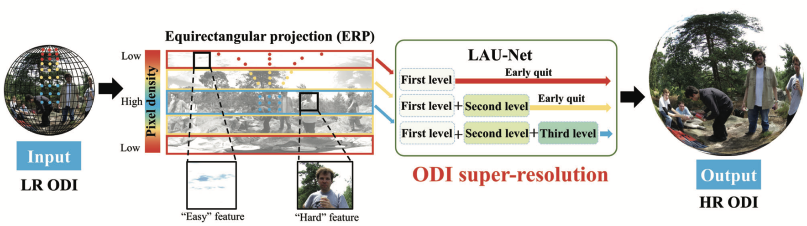

相关工作：PanoSwin: A Panoramic Shift Windowing Scheme for Panoramic Tasks

#### :page_with_curl:SwinIR

三部分：浅层特征提取+深层特征提取+图像重建

SwinIR普遍适用于各类图像复原任务，无需改动特征提取模块，对不同的任务仅仅是使用不同的重建模块。

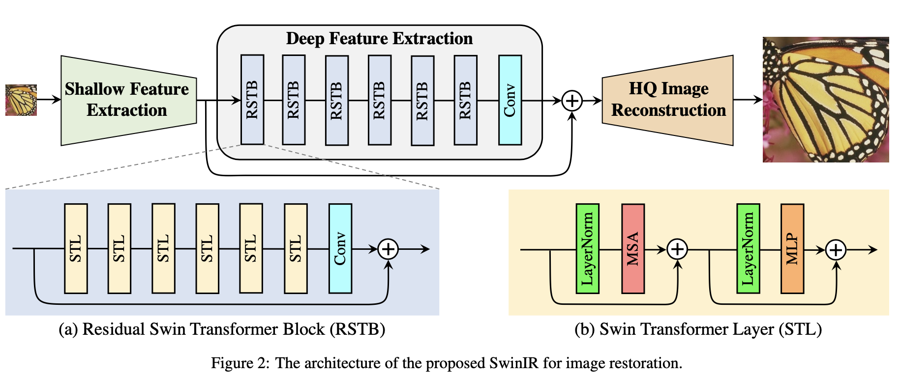

**1.浅层特征提取：**采用一层卷积，根据论文[Early Convolutions Help Transformers See Better](https://proceedings.neurips.cc/paper/2021/file/ff1418e8cc993fe8abcfe3ce2003e5c5-Paper.pdf)，得到特征$F_{0}$

**2.深层特征提取：**集联K个residual Swin Transformer blocks (RSTB)，最后接一层卷积。得到特征$F_{DF}$

>在特征提取的最后使用卷积层可以将卷积操作的归纳偏置带入基于Transformer的网络中，为后期浅层和深层特征的聚合打下更好的基础。

**3.图像重建：**聚合浅层和深层特征 $I_{RHQ} = H_{REC} (F_{0} + F_{DF} )$, 浅层特征主要包含低频，而深层特征侧重于恢复丢失的高频。 通过long skip connection，SwinIR可以将低频信息直接传递给重建模块，帮助深度特征提取模块专注于高频信息，稳定训练。 (1) 对于超分任务，使用亚像素卷积层对特征进行上采样。(2) 对于不需要上采样的任务，单层卷积就可以完成重建。另外SwinIR的输出会和低质量图像相加，形成残差学习。


#### :page_with_curl:Restormer

CVPR2022

transformer-based 通用图像复原

#### :page_with_curl:RestoreFormer

CVPR2022 (RestoreFormer), TPAMI 2023 (RestoreFormer++)

transformer-based 人脸图像复原

#### :computer:Contrast Adaptive Sharpening

对比度自适应锐化 ([CAS](https://docs.o3de.org/docs/atom-guide/features/cas/)) 是一种图像锐化技术，在决定锐化程度时会考虑局部 3x3 邻域的对比度。 高对比度样本的锐化程度远低于低对比度样本。 这有助于防止在均匀锐化的标准锐化滤镜中出现过度锐化的外观。 您可以将 CAS 与临时抗锯齿 (TAA) 结合使用，以减少 [TAA](https://docs.o3de.org/docs/atom-guide/features/taa/) 给图像带来的柔和。 

AMD的CAS和NVIDIA的Freestyle都使用的该技术，实现可参考 https://chainner.app/。

PPT&DEMO:

https://gpuopen.com/wp-content/uploads/2019/07/FidelityFX-CAS.pptx

https://www.shadertoy.com/view/wtlSWB#

#### :page_with_curl:Frequency-Assisted Adaptive Sharpening

考虑码率和质量的trade-off。

首先标注最优的锐化水平：

> Given the uncompressed video, we first sharpen it at seven levels (0.0, 0.5, 1.0, 1.5, 2.0, 2.5, 3.0) using the built-in USM function of FFmpeg [2], and then encode the sharpened videos using the HEVC/H.265 codec [3] across five CRF values (21, 24, 27, 30, 33). We define the pre- sharpening encoding process as different encoders by sharpening levels and plot the RD curves for each encoder using the bitrate and VMAF. The overall seven curves are displayed in Fig. 2 (a). Then we consider the encoder with sharpening level 0.0 as the anchor to calculate the BD-Rate of the other sharpening levels. 

#### :computer: Anime4K

这是一个热门[项目](https://bloc97.github.io/Anime4K/)

[reddit探讨](https://www.reddit.com/r/compsci/comments/cq9n8t/anime4k_a_realtime_anime_upscaling_algorithm_for/)

[Preprint](https://github.com/h5mcbox/anime4k/blob/master/Preprint.md)

现有方法：

1. 核方法，比如Bicubic或xBR是为其他内容设计，倾向于软化边缘。不适合用于动漫内容。

2. 传统的去模糊和锐化方法，会导致overshoot(过冲，之后通常发生振铃效应)，出现在边缘附近。这会分散观看者的注意力并降低图片的感知质量。

3. 基于学习的方法（例如waifu2x、EDSR等）对于实时（<30ms）应用程序来说太慢了几个数量级。

   >虽然waifu2x 或 EDSR 等算法的性能大大优于任何其他通用上采算法。
   >
   >然而，我们将利用我们的上采样算法只需要处理单一类型的内容（动画）这一事实的优势，因此我们可能有机会匹配（甚至超越）基于学习的算法。

本文方法：

Anime4K的出发点是寻找一种好的边缘细化算法，而不是寻求通用的放大算法。 与恢复纹理等小细节相比，清晰的边缘对于动漫升级更为重要。

算法实现：

主要目标是修改$LR_U$（模糊图像）直到其残差变得最薄，从而为我们提供可能的 $HR$（清晰）图像之一。

我们的算法将简单地将 $LR_U$ 及其残差作为输入，推动残差的像素，使残差线变得更细。 对于对残差执行的每个“推”操作，我们对彩色图像执行相同的操作。 残差将作为推动的指引。 这具有迭代最大化图像梯度的效果，这在数学上等同于最小化模糊，但没有传统“去模糊”和“锐化”方法中常见的过冲或振铃伪影。

伪代码：

```cpp
for each pixel on the image:
  for each direction (north, northeast, east, etc.):
    using the residual, if an edge is found:
      push the residual pixel in the current direction
      push the color pixel in the current direction
```

我们的算法用来提高性能的一个技巧是使用 sobel 滤波器来近似图像的残差，而不是使用高斯滤波器计算残差，因为计算高斯核的成本更高。 此外，最大化 sobel 梯度在数学上类似于（但不等同！）最小化残差厚度。 这种修改在目视检查中没有产生质量下降。

该算法的一个优点是它与尺度无关。 动漫可能事先被错误地放大了（双倍放大，甚至先缩小后放大），并且该算法仍然会检测到模糊边缘并对其进行细化。 因此，可以使用用户喜欢的任何算法（双线性、Jinc、xBR 甚至 waifu2x）提前对图像进行放大，然后该算法将正确地细化边缘并消除模糊。 在 900p 的动漫上运行此算法，使结果看起来像真正的 1080p 动漫。 为了获得更强的去模糊效果，我们只需再次运行该算法。 该算法迭代地锐化图像。

然而，对于 2倍 上采样，我们注意到线条通常太粗并且看起来不自然（因为模糊通常向外散布暗线，使它们变粗），因此我们为细线添加了预通道。 此通道不是算法的组成部分，如果用户希望保留粗线，则可以安全地删除它。

我们已经在 Java 和 HLSL/C 中实现了这个算法。

[Python版](https://github.com/TianZerL/Anime4KPython/blob/master/Anime4KPython/Anime4K.py)

```python
# Process anime4k
def process(self):
  for i in range(self.passes): # 迭代的遍数
    self.getGray() # 得到Y通道
    self.pushColor() # 分上下，左右，正对角，负对角，然后两侧的强弱情况，一共4x2=8种情形，判断是否执行推的操作。
    self.getGradient()
    self.pushGradient()
```

推的具体过程：

```python
def getLightest(mc, a, b, c):
            mc[R] = mc[R] * (1 - self.sc) + (a[R] / 3 + b[R] / 3 + c[R] / 3) * self.sc
            mc[G] = mc[G] * (1 - self.sc) + (a[G] / 3 + b[G] / 3 + c[G] / 3) * self.sc
            mc[B] = mc[B] * (1 - self.sc) + (a[B] / 3 + b[B] / 3 + c[B] / 3) * self.sc
            mc[A] = mc[A] * (1 - self.sc) + (a[A] / 3 + b[A] / 3 + c[A] / 3) * self.sc

'''
比如
tl tc tr
ml mc mr
bl bc br

如果
maxD = max(tc[A], mc[A], ml[A])
minL = min(mr[A], br[A], bc[A])
minL > maxD，就是正对角的下方比上方强。
此时会调用getLightest(mc, mr, br, bc)，
mc[R] = 
mc[R] * (1 - α) + (mr[R] / 3 + br[R] / 3 + bc[R] / 3) * α，
α是可调节的'推'的强度。
'''


```

总结一下

`getGray`：计算图像的灰度并将其存储到 Alpha 通道

`pushColor`：会在 Alpha 通道的灰度引导下使图像的线条变细

具体就是两侧比较的各3个像素，哪边强，当前位置就和哪边靠近。比如，左比右强，mc和左面一列的均值加权更新。

`getGradient`：计算图像的梯度并将其存储到 Alpha 通道

用的sobel滤波，快慢模式的区别仅仅是①abs和②平方和开方。

`pushGradient`：将在 Alpha 通道中的梯度引导下使图像的线条更锐利

具体操作和pushColor类似，只是引导由灰度图变为了梯度。

参数推荐：<font color="lighblue">passes=1,strengthColor=0.1,strengthGradient=0.8,fastMode=True</font>

评价：挺不错的，可以结合RAISR的统计信息分析，对部分像素使用。


#### :computer: DaltonLens

[DaltonLens](https://daltonlens.org/)是一个桌面实用程序，旨在帮助有色觉缺陷的人，尤其帮助他们解析颜色编码的图表和绘图。 它的主要特点是让用户点击一种颜色，并用相同的颜色突出显示图像的所有其他部分。 

取消抗锯齿（undo line anti-aliasing）

原因：

这对于恒定颜色区域来说很容易实现，但对于细线、小标记或文本，它实际上变得更加复杂，尤其是在背景不均匀的情况下。 原因是抗锯齿。 为了获得漂亮的线条，描边路径会与背景混合，得到折中的颜色，而不是固定不变的颜色。

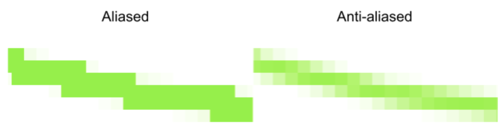 

> 锯齿图像很难分割，但正如您所见，抗锯齿图像中的颜色不再恒定。 事实上，如果笔划宽度小于 1 像素，则在抗锯齿渲染中可能根本不会出现完全相同的原始实线的颜色。 为了解决这个问题，DaltonLens 在 HSV 空间中实现了更智能的阈值处理，它更加重视色调，而不太重视饱和度和值。 当背景均匀时，此方法相当有效，但当笔触非常细或背景更复杂时，它往往会失败，并且只会突出显示前景对象的一小部分。 

价值：

虽然我们做的是抗锯齿，我们应该可以利用这套取消抗锯齿的方法，来制作成对的数据集。

#### :computer: PWLF

piecewise linear fit methods. 其实只需要三段直线，两行代码，就可以实现如下角度分类：

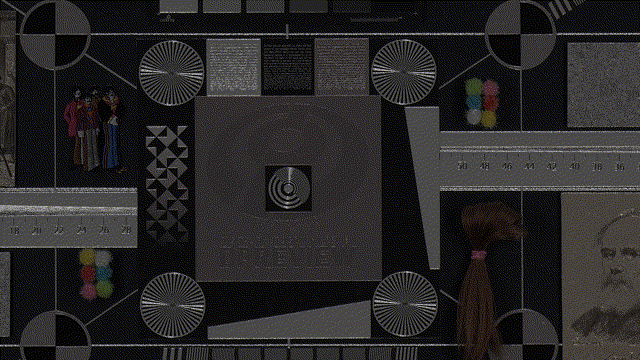

:computer: Princeton Adaptive Camera

人脸识别检测的精度反传影响相机参数。这是low level+high level一个更创新的解法。

#### :page_with_curl:Neural Preset for Color Style Transfer

文章有不错的应用价值。作者原来是专门研究半监督/自监督学习的，最近开始将自监督引入一些CV任务中，提出了MODNet和本文的Neural Preset。比较有意思的是，Neural Preset不需要fine-tuneing就能用在暗光增强、水下图像增强、去雾和图像和谐化等多个任务中。

> 术语了解：艺术风格迁移 不同于 颜色风格转换（也称写实风格迁移）。
>
> artistic style transfer：改变纹理和颜色。
>
> color style transfer (*aka* photoreal- istic style transfer)：仅改变颜色。

**现有方法**通常在实践中受到三个明显的限制：

1. 伪影（例如，扭曲的纹理或不和谐的颜色），因为它们执行基于卷积模型的颜色映射，卷积模型对图像块进行操作，对于相同像素值的输入可能具有不一致的输出。
2. 运行时内存占用巨大，它们无法处理高分辨率（例如8K）图像。
3. 它们在切换样式时效率低下，因为它们将颜色样式转换作为单阶段过程进行，每次都需要运行整个模型。

本文方法：

- 确定性神经颜色映射 (<font color="brown">DNCM</font>)：相同颜色的像素转换到相同的输出。但只需极少内存，不像3D-LUT那样耗内存。

  > 手工滤波器和3D查找表也属于确定性颜色映射。但手工滤波器功能性弱，只能处理基本的颜色调整。通过预测系数，融合LUT模板的方法，则具有大量可学习参数，难以优化。

- <font color="brown">两阶段</font>：

  第一阶段由输入建立nDNCM，用于将输入归一化到仅表示“图像内容”的空间；

  第二阶段由风格图建立sDNCM，用于将归一化图像转化到目标风格。

  **两方面好处**，①可以存储sDNCM，作为预设滤镜。②可以一次nDNCM后快速切换不同滤镜。

- 由于难以获取配对数据，使用了<font color="brown">自监督</font>学习。

  > 自监督学习（SSL）已被广泛探索用于预训练 [4、5、19、21、25、26、58–60]。 一些作品还通过 SSL [31、37、42] 解决特定的视觉任务。本文应该属于后者。

无需工程技巧，就可以在3090显卡上实时增强4K视频，且具有帧间一致性。

DNCM：

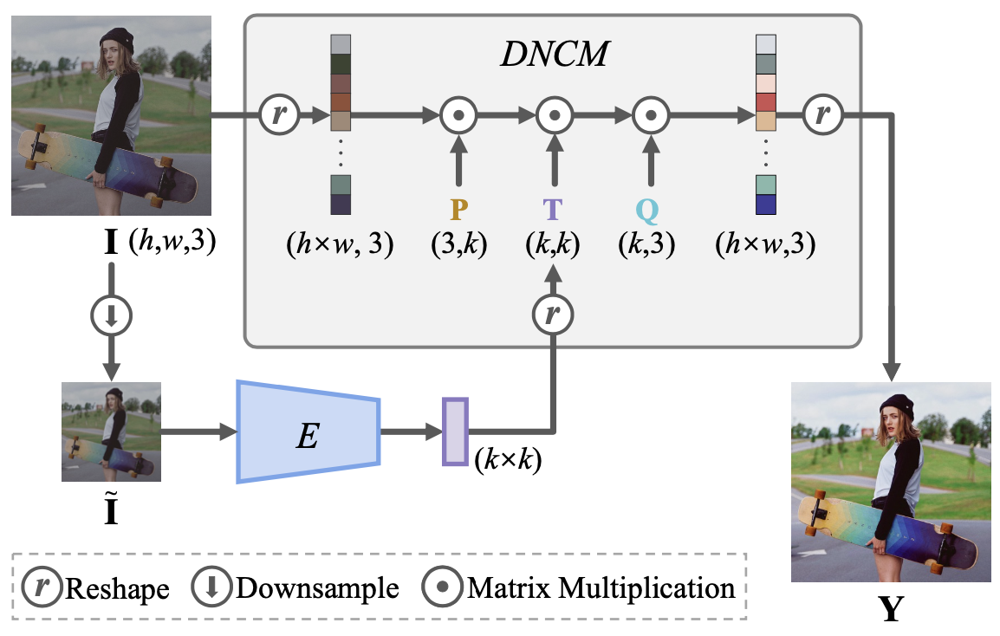

两阶段：

在两阶段的方式中，编码器 E 被修改以输出 d 和 r，它们分别用作 nDNCM 和 sDNCM 的参数。E()共享权重，但nDNCM和sDNCM有不同的投影矩阵 P 和 Q。

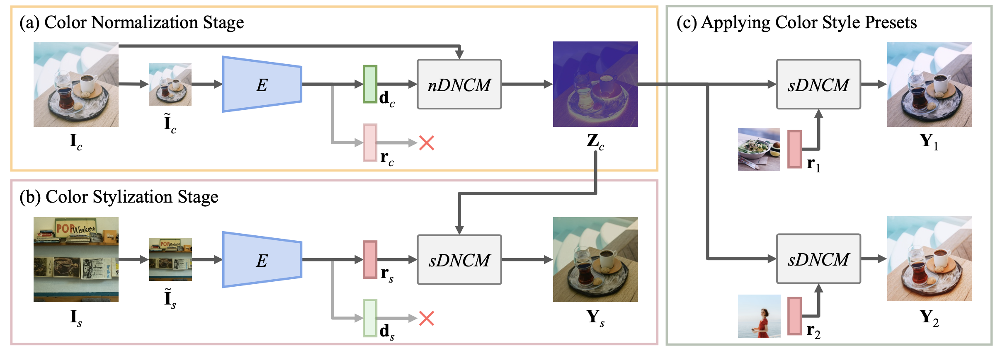

自监督：

本文提出一种自监督策略：

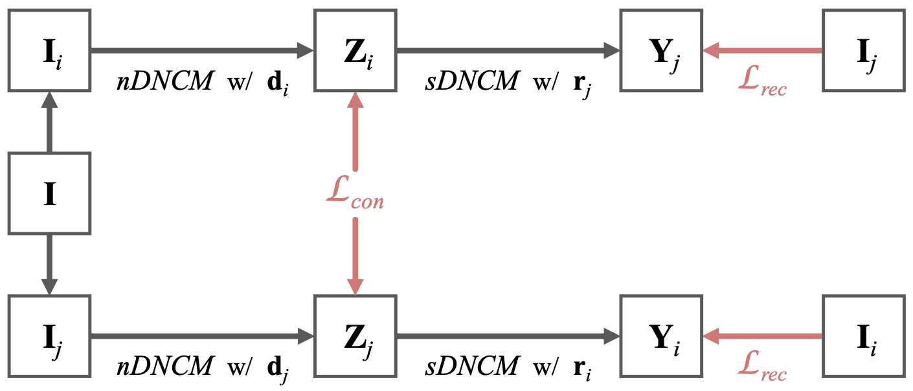

由于难以获取GT的风格化图像，我们有输入图像$I$制作两个伪风格图像。具体方式是通过对$I$色彩的扰动，获得两个不同色彩风格的数据增强样本$I_i$和$I_j$。扰动可以由色彩滤镜或LUT完成。

损失函数细节：

内容一致损失用L2，$\mathcal{L}_{con} = || \mathbf{Z}_{i} - \mathbf{Z}_{j} ||_{2}$，

风格重建损失用L1，$\mathcal{L}_{rec} = || \mathbf{Y}_{i} - \mathbf{I}_{i} ||_{1} + || \mathbf{Y}_{j} - \mathbf{I}_{j} ||_{1}$，

最终损失函数为：$\mathcal{L} = \mathcal{L}_{rec} + \lambda \, \mathcal{L}_{con}$，$\lambda$是一个可控的权重。

#### :page_with_curl:Flexible Piecewise Curves

#### :page_with_curl:Color Image Enhancement with Saturation Adjustment Method

#### :page_with_curl:ReDegNet

ECCV 2022

现有方法：现实的降质数据都是手工合成的。而真实的降质数据找不到高清ground truth。

本文方法：因为人脸的结构性信息非常强，人脸复原的效果（本文用GPEN）远远好于自然图像复原的效果。所以我们可以先复原人脸，然后再反推降质方法，应用到整张自然图像上。

## 人脸复原

#### :page_with_curl:DFDNet

ECCV 2020

后续​延伸有一篇:page_with_curl:DMDNet （TPAMI 2022）

#### :page_with_curl:GPEN

CVPR 2021

现有方法：普通DNN直接训练很难解决这个ill posed问题。基于GAN的方法，效果还可以，但有over-smooth的问题。所以本文采用先训练GAN，然后嵌入到U-shaped DNN，作为一个先验的解码器。最后finetune这个<font color="brown">GAN prior embedded DNN (GPEN)</font>。

先验解码GAN的设计：它的输入可以来自DNN不同深度的层，从而对全局结构、局部细节、背景，都能较好恢复。

核心思想：

就是先训练GAN，然后嵌入DNN一起finetune，DNN是来提供latent code的，约束生成的方向（全局结构、局部细节、背景）。

- 现有方法直接数据对训练的话，不是one-to-many问题的最优解。容易学成解空间的平均脸（和Visual Perception Global-First Theory吻合），存在over-smoothed问题。

- cGAN可以减轻上述问题，但是它难以恢复严重的人脸降质。

- GPEN的方式在有了CNN encoder提供的latent code后，就转换成了one-to-one问题。和GAN inversion方法思想类似，但GPEN里这个GAN会跟着一起finetune。一般GAN inversion里预训练的GAN会保持不变，以维持一致性，和便于人脸编辑。

  > GAN Inversion（GAN反演）是指将真实图像映射到GAN的latent space的过程。

核心贡献：

- 训练GAN并将其嵌入DNN，并且一起微调。以往的工作都没有微调这步。
- GAN模块的设计比较精巧，能更好嵌入U-shaped DNN。
- 取得了BFR的sota效果。

训练过程：

1. 使用HQ数据训练GAN。用对抗损失。
2. 使用LQ-HQ数据对，finetune GPEN。用对抗损失、L1损失、基于判别器特征的感知损失（比vgg loss更符合人脸任务需要）。最后权重是$L_A + 1 * L_C + 0.02 * L_F$。

但这篇文章代码和论文有些不一致，issue区很多人提出Inconsistencies with original paper。效果也复现不出来，能达到和GFPGAN相当的效果，但没论文里的好。

> Synthesizing Realistic Image Restoration Training Pairs: A Diffusion Approach 降质可能用的这个方法
>
> 另外用不用预训练的GAN，其实都可以。只是不用预训练GAN的话，就不符合原论文的motivation了，下面是作者的原话：
>
> In our experiments, if the degradation is not that severe, no pre-trained model can achieve comparable results, which is somewhat not consistent with the idea claimed in our paper. However, in cases where the face is severely degraded such as 64x FSR, no pre-trained model can hardly produce any clear results, while GPEN still works well.

#### :page_with_curl:GFPGAN

CVPR 2021

现有方法：

一类方法是依赖挖掘人脸特定先验，比如脸部关键点、脸部解析、脸部热力图，等等。但这些通常从输入图像中预测，因此不可避免的因为输入图像的低质量，导致预测失准。另外这些先验也缺少纹理信息。

另一类方法是依赖参考图像，包括高质量的guided faces（如GWAINet, GFRNet, ASFFNet），或者facial component dictionaries（如DFDNet）。但是高分辨率参考图像的不可获得性，限制了前者的实际应用，而dictionaries的容量也限制了后者的多样性和脸部细节的丰富性。

其实还有一类利用GAN invertion的方法（如PULSE, mGANprior, Deep Generative Prior），他们首先将低质量图像“逆向”回预训练 GAN 的latent code，然后进行昂贵的图像特定优化来重建图像。尽管结果在视觉上很逼真，但通常保真度较低，因为低维latent code不足以指导准确的复原。

本文方法：核心idea，利用Generative Facial Prior (GFP)。

> 先验隐含在预训练的人脸生成对抗网络 (GAN)模型中，例如 StyleGAN。这些人脸 GAN 能够生成多样的逼真的面孔，从而提供丰富多样的先验

过程：也是先接入pretrained GAN as prior，作为decoder，然后利用SFT模块和degradation removal模块一训练，loss用到了：

- global的对抗损失
- local的五官（eye, mouth）对抗损失
- 人脸识别特征提取器的id保持损失
- degradation removal模块专门有多尺度的restoration loss

然后训练一个degradation removal module。

> 所以我认为GPEN和GFP-GAN这两同一时期的论文，之间差异没有很大。都是建立的 预训练人脸生成网络（先验） 和 降质复原网络 的连接。分别作为decoder和encoder。

#### :page_with_curl:Codeformer

https://youtu.be/0wJezYHWA1c lipsync后面接gpen + codeformer效果很好

https://github.com/TencentARC/GFPGAN 

https://github.com/yangxy/GPEN 

https://github.com/sczhou/CodeFormer

ComfyUI整合：https://www.youtube.com/watch?v=HGB0Toul2Yw

都可以用facefusion这个项目来跑，最终效果感觉GPEN-BFR-2048效果最好，GFPGAN效果也不错，其中gfpgan1.2主要是做sharpen和噪声的抑制，保持id好一点，gfpgan1.3、1.4虽然更美观了但有点像做了美颜。codefomer、restoreformer++的效果相对略差一点。

#### :page_with_curl:PMRF

现有方法：图像复原算法的目标是在保持感知质量的同时，尽可能降低失真度。通常，这些算法会尝试 [方案1] 从后验分布中采样（比如一些基于扩散模型的方法），或者 [方案2] 优化失真损失（例如均方误差MSE）和感知质量损失（例如生成对抗网络GAN）的加权和。

本文方法：本文专注于寻找一个最优估计器，这个估计器在保持完美感知指数（即重建图像的分布与真实图像的分布完全相同）的约束下，最小化均方误差（MSE）。这是一个理论上的挑战，因为通常在降低失真度的同时，感知质量可能会受到影响。

作者引用了一个理论结果，表明可以通过<font color="brown">最优传输（optimal transport）后验均值预测（MMSE估计）</font>到真实图像的分布来构建这样的估计器。基于这个理论结果，作者介绍了一种名为后验均值校正流（Posterior-Mean Rectified Flow，简称PMRF）的算法。PMRF首先预测后验均值，然后使用一个校正流模型将结果传输到高质量的图像，这个模型近似于所需的最优传输映射。

总结来说，这篇论文提出了一个新的图像恢复算法PMRF，它基于最优传输理论，旨在在不牺牲感知质量的情况下最小化图像恢复的失真度。

理论：

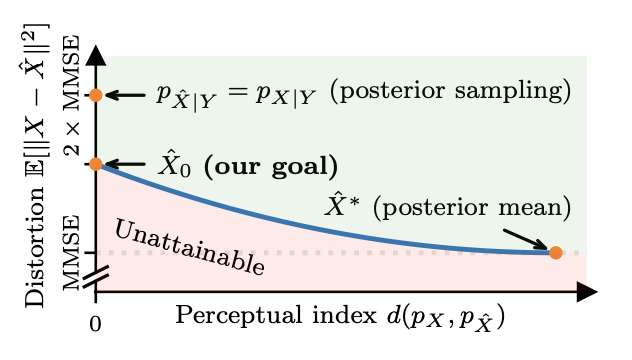

posterior sampling 和 posterior mean 是两个极端，一个posterior sampling的感知指数是完美的，但MSE一般很高，PSNR指标差。而posterior mean 的MSE，一般非常低（称作Minimum MSE，MMSE estimate），但感知质量就比较差。

而且posterior sampling 的MSE恰好是MMSE的两倍。

> 参考 CVPR2018 The perception-distortion tradeoff  这篇通过数学证明表明，降低失真度往往会牺牲感知质量，反之亦然。
>
> 然而，作者通过实验表明，对于某些度量标准（例如VGG特征之间的距离），这种矛盾的影响较小。此外，他们还展示了生成对抗网络（GANs）为解决感知-失真界限提供了一种原则性的方法，这为GANs在低级视觉任务中的成功提供了理论支持。（即现有方法的 [方案2]）

虽然现有方法里 [方案2] 挺优雅的，但实践证明不论是失真度还是感知质量，GAN都不如扩散模型，这一部分是由于GAN很难优化。 


论文中引用了Frierich等人在2021年的研究成果，该研究表明 $\hat{X}_0$ 可以通过以下两步构建：

>  NIPS2021 A theory of the distortion-perception tradeoff in wasserstein space. 

1. 首先预测后验均值 $\hat{X}∗:=E[X∣Y]$，即在给定观测数据Y的情况下，X的期望值。
2. 然后通过最优传输（optimal transport）将这个后验均值的预测结果转移到真实图像的分布上。

受到这一理论结果的启发，PMRF框架的工作流程如下：

1. 使用一个模型来近似后验均值，这个模型通过最小化重建输出和真实图像之间的MSE来实现。

2. 接着，训练一个校正流模型（rectified flow model），这个模型基于Liu等人在2023年的研究，用于预测后验均值预测和真实图像之间的直线路径的方向。

   > ICLR2023 Flow straight and fast: Learning to generate and transfer data with rectified flow.

3. 在测试时，给定一个退化的测量值，PMRF使用这样的流模型解决一个常微分方程（ODE），并以后验均值预测作为初始条件。

我觉得越来越偏理论和数学了，可能还是再结合代码看一下，直观一点。

我测了下，效果确实挺惊艳。

#### :page_with_curl:HDTR-Net

A Real-Time High-Definition Teeth Restoration

对于说话人任务，许多时候口腔的生成效果是最差的。

## 有参考的人脸复原

#### :page_with_curl:GFRNet

ECCV2018

难点分析：退化图像和引导图像通常在姿态、光照和表情上有所不同，从而使得普通CNN难以复原精细、保真的细节。

本文方法：提出了两个子网络 WarpNet 和 RecNet。WarpNet可以对齐参考图的姿态和表情，再利用RecNet复原。

> 这篇文章比较早期，所以idea现在来看很朴素。不过确实指出了需要关注的难点。

WarpNet除了接收RecNet反向传播的梯度，另外也会计算Landmark Loss（使用face alignment method TCDCN来提取）和TV Regularization（要求光流场比较平滑）。

#### :page_with_curl:GWAINet

CVPRW2019

作者提到，和GFRNet相比，主要差异就是 ① 没用Landmark Loss，认为这样不鲁棒。并且将脸部作为一个有机的整体。而不是让网络根据landmark去投机取巧地warp。 ② 增加了identity loss。 

#### :page_with_curl:ASFFNet

CVPR2020

现有的有参考人脸复原，多是只依靠一张参考图像，当引导图和退化图的姿态差异很大时，可能会出现性能下降。另外现有方法只是仅仅将引导图经过warp和退化图concat到一起，这样泛化能也较差。

本文探索利用多张参考图像的方式。

>  [!IMPORTANT]
>
> ASFFNet 由引导图选择、特征提取、MLS 对齐、AdaIN、四个 ASFF 块和重建模块组成。分别解决guidance selection, spatial alignment 和 illumination translation问题。

1. 参考图选取：在landmark set上定义的加权最小二乘 (weighted least-square) 模型。为眼睛和嘴巴等不同面部部位分配不同的可学习的权重，使所选引导图的复原效果达到最佳。。

2. 网络结构：创新地使用了multiple adaptive spatial feature fusion (ASFF)。

   1. GFRNet和GWINet对于warping subnet是必需的。但在ASFFNet里，姿态差异可以通过选择引导图得到很大程度的缓解，因此可利用移动最小二乘 (moving least-square) 在特征空间中对齐引导图和退化图。

   2. 使用AdaIN来解决光线不一致的问题。

      > GFRNet和 GWAINet采用基于连接的融合，不考虑引导和退化图像之间的光照差异和空间变化。在任意风格转换中，自适应实例归一化 (AdaIN) 已被建议用于将内容图像转换为所需的风格。Perez 等人提出了一种 FiLM 方法，从条件信息中学习特征仿射变换，以调节网络的中间特征。然而，AdaIN 和 FiLM 中的特征调制与空间无关，不足以转换和融合引导特征进行人脸恢复。对于空间自适应特征调制，Wang 等人提出了一种基于分割图的超分辨率空间特征变换 (SFT) 方法。除了超分辨率，SFT 还被用于其他视觉任务，如图像处理和妆容转换。在语义图像合成中，Park 等人提出了一种空间自适应反规范化 (SPADE) 方法，通过学习空间变换来调节激活。对于特征融合，引入了门控模块来估计用于组合不同来源特征的加权图。在这项工作中，我们同时考虑了特征转换和融合，以提高我们的 ASFFNet 的恢复性能和泛化能力。

      - AdaIN：熟悉，不解释了。
      - FilM：感觉和AdaIN类似，只是不用与IN连用。
      - SFT：比较熟悉了，做空域像素级的仿射变换。
      - SPADE：SPADE论文里承认其实和SFT类似。区别主要是应用的任务不同，文章讲故事的方式不同。在GAN的每个ResBlk里都会加SPADE层。

   3. 输入有注意力掩码。

3. 损失函数：使用MSE、Perceptual Loss、Style Loss、GAN Loss。

## 视频传输

#### :page_with_curl:Survey on Robust Image Watermarking

归纳为两类：

- single-stage-training (SST)：比如单独训练嵌入网络，单独训练提取网络。
  - Trained detection network (TDN)
  - Trained embedding network (TEN)
- double-stage-training (DST)：联合训练嵌入和提取网络。(更先进)
  - embedding model
  - detection model
  - loss function
  - attack training

#### :page_with_curl:DVMark

任务：视频不可见水印

也称作video watermarking或者video steganography（隐写、密码学）

DVMark 将消息隐藏视频中，并可得到鲁棒地恢复。 编码器网络采用封面视频和二进制消息，并生成在人眼看来相同（*imperceptible manner*）的带水印视频。 即使视频经过一系列常见的视频编辑操作，例如压缩、裁剪、颜色偏移以及用其他视频内容填充带水印的视频，我们的解码器仍然可以可靠地提取带水印的消息。

传统方法：传统的水印方法通常是针对特定类型的失真手动设计的，因此不能同时处理广泛的失真。

难点：一般存在鲁棒性和解码效率/视觉效果之间的trade-off。

本文方法：

- 端到端训练的深度学习方案
- 水印分布在多个时空尺度上
- 可微的失真层：借此获得对各种失真的鲁棒性，而不可微的失真，例如视频压缩标准，则由可微的代理（proxy）建模

#### :page_with_curl:ReDMark

使用了downshuffle，因为考虑一个像素位置存不下长度较长的水印。且转换层基本是1x1卷积，这种设计的灵感来自传统的频域加水印方法。

#### :page_with_curl:HiDDeN: Hiding Data With Deep Networks

> 动机：对抗攻击，如果一个网络可以被小的扰动愚弄而做出错误的类别预测，那么应该有可能从类似的扰动中提取有意义的信息。

最近的工作表明，深度神经网络对输入图像的微小扰动高度敏感，从而产生对抗样本。 尽管此属性通常被认为是深度神经网络的弱点，但我们探索它是否有益——神经网络可以学习使用不可见的扰动来编码大量有用的信息。 完成数据隐写/不可见水印任务。

> Keywords: steganography, steganalysis, digital watermarking
>
> 略有不同，steganography目的更多是传输信息，steganalysis是第三方破译密码，digital watermarking目的是识别图像所有权。实现的技术层面是类似的，只是前者对防破译的要求高，后者对抗攻击的要求高。

本文特点是将message膨胀成HW，再与图像特征concat。这样的好处是每个像素位置都有concat完整信息，最后的encoded图像有机会获得更佳的抗攻击能力。

**core代码：**

```python
from model.hidden import Hidden
from noise_layers.noiser import Noiser
```

本文使用的攻击更具挑战，比如一些cropout、dropout、JPEGout操作，会将一部分原图像素保留原貌。解码器就需要有能力更精细的区分哪些像素受到攻击。

> Granting the noise layer access to the cover image makes it more challenging as well. 

#### :page_with_curl:Romark: A robust watermarking system

将对抗学习中的鲁棒优化用在该任务，提升了HiDDeN效果的鲁棒性。这个概念和困难样本挖掘有点类似，针对worst-case进行优化。

#### :page_with_curl:Distortion Agnostic Deep Watermarking

Romark的进阶版。

#### :page_with_curl:A Novel Two-stage Separable Framework for Practical Blind Watermarking

刘杨和郭孟曦的一篇文章，张健等几位老师打磨以后可读性挺好。阅读下来，感觉方法确实比较实用。

现有工作：HiDDeN、ReDMark等端到端训练的框架，一般有编码器、噪声层、解码器三个组件。它的缺点是

- 不支持不可导的噪声，比如压缩
- 不方便临时增加新的噪声类别，整个网络需要重新训练
- 对于训练超参非常敏感，加入一种新的噪声，如果不调整超参，可能图像质量会下降来保证解码的准确率

>It should be emphasized that, for the images with watermarks,the distribution of decoder output M would be as close as possible to -1 and 1, while for the images without watermarks,the distribution would be close to 0, therefore we make the binary message $M\in \left \{-1, 1\right \} ^L$ instead of $ \left \{0, 1\right \} ^L$ .
>
>这里有一个思路是视频盲水印时，提取M接近全0的可以判断为没有嵌入水印的帧。甚至可以设计为early-stop。

这一段是非常重要的细节（不过这也标志着我想转十进制做的方法行不通了，尽快转变思路）。另外由于GAN训练的不稳定性，该工作还加入了谱归一化（spectral normalization）。此外该方法沿用了ReDMark提出的强度系数（S_factor），训练时设置为1，推理时可以增大或减小来调节画质-准确率的trade-off。

该工作还对深度学习的盲水印做了可解释性方面的研究。

评价：主要思想确实有道理。因为是否受攻击，更应该是解码器考虑的事情。编码器去考虑只会影响图像质量。

#### :page_with_curl:StegaStamp: Invisible Hyperlinks in Physical Photographs

本文设计了一个有趣的应用，可以称之为自然图片二维码。扫描图片就可以得到网址。幕后的技术仍是视频不可见水印。进一步，未来，增强现实 (AR) 系统可能会执行此任务，将检索到的信息与用户视图中的照片一起视觉叠加（Ren Ng真是创新力相当强）。

> *Another way to think about this is physical photographs that have unique QR codes invisibly embedded within them.* 

后续有人开发了[*1](https://github.com/JisongXie/StegaStamp_pytorch)[*2](https://github.com/Charmve/StegaStamp-plus)[*demo](https://charmve.github.io/steganography.js/examples/showcase/)，可玩性比较不错。

本文训练上比较特别的是：原作者的程序在前1500次迭代中将图像损失函数从总损失函数中去除，从而在一定程度上提高了比特精度。后面才加入图像损失。然后模型的初始化方式值得思考一下。

HiDDeN vs. StegaStamp:

1. 嵌入方式：HiDDeN是将消息膨胀后在通道维度和深度特征连接；StegaStamp是用全连接层预处理消息，再reshape和上采样到和图片一样的空间尺寸。（倾向HiDDeN）
2. 损失函数：HiDDeN是$L_M+0.7*L_I+0.001*L_G$，整个训练期间使用不变的系数；StegaStamp加入了$L_{lpips}$，特别指出一开始$L_{lpips}$、$L_I$、$L_G$的系数都设为0，直到解码达到比较高的准确率，再线性增加$L_{lpips}$、$L_I$、$L_G$的系数。（倾向StegaStamp）
3. 训练阶段：HiDDeN没有训练阶段的区别，只是攻击越难，训练总轮数越多；StegaStamp对于图像扰动/攻击，则是由易到难地慢慢增加。（倾向StegaStamp）
4. 网络结构：HiDDeN是平铺型，靠膨胀（expand）和池化来编码和解码消息；StegaStamp是U型，使用残差学习。

StegaStamp还使用了纠错码等传统方法。

#### :page_with_curl:CIN

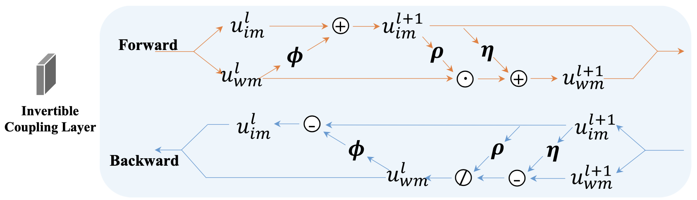

袁粒老师组的工作，结构可逆。

Q：注意FIN的代码，图像是在-1，1之间。不确定这是不是可逆网络所需要的。

A：实验观察，应该是需要的，psnr会收敛得快很多。

#### :page_with_curl:A Compact Neural Network-based Algorithm for Robust Image Watermarking

INN的损失，得用全。而且对于Cropout的攻击，损失记得调整有意义区域。二进制转其他进制，这个和我的idea差不多。

#### :page_with_curl:MBRS:Mini-Batch of Real and Simulated JPEG Compression

它的diffusion block值得仔细看看

#### :page_with_curl:CNN-Based Watermarking using DWT

2023年的文章，很好的总结了传统频域方法。[code](https://github.com/alirezatwk/Convolutional-Neural-Network-Based-Image-Watermarking-using-Discrete-Wavelet-Transform)

结合神经网络+确定性算法。我感觉分频带靠谱，只采用LL。

#### 智能编码系列

[2016~2022](./CLIC.html)

## 数字化身 / 说话人

Valse Webinar: 20241127【数字人脸生成：二维方法与三维方法】

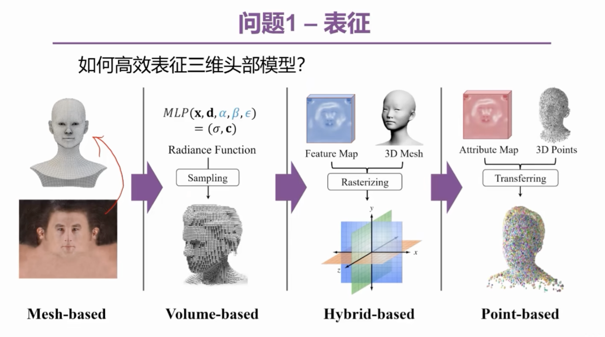

### 1. LipSync

#### :page_with_curl:人类面部重演方法综述

中国图像图形学报的一篇论文，[地址](http://www.cjig.cn/jig/ch/reader/view_abstract.aspx?file_no=20220906)

#### :page_with_curl:SyncNet

Out of time: automated lip sync in the wild

> 音视频同步对于制作者和观众来说是电视广播/电影制作中的一个问题。 在电视中，高达数百毫秒的口型同步误差并不罕见。 如果错误原因在于传输，则视频通常会滞后于音频。 这些错误通常很明显——普通观众的可检测性阈值约为 -125 毫秒（音频滞后于视频）到 +45 毫秒（音频领先于视频）。

音频：

输入音频数据是MFCC值。 这是非线性梅尔频率上声音的短期功率谱的表示。 每个时间步使用 13 个梅尔频带。 这些特征以 100Hz 的采样率计算，为 0.2 秒的输入信号提供 20 个时间步长。

视频：

视觉网络的输入格式是一系列嘴部区域的灰度图像，如图 1 所示。5 帧的输入尺寸为 111×111×5 (W×H×T)，以 25Hz 的帧率计算，为 0.2 秒的输入信号。

> 它取特征的方式值得思考下，一个是音频特征的采样率是视频帧率的4倍。另一个是SyncNet的视觉网络只输入嘴部周围，而不是下半张脸。

SyncNet原版输入是

```python
audio = torch.randn(32, 1, T=5*4, Mel=13).cuda()
video = torch.randn(32, 5, 120, 120).cuda()
```

Wav2Lip版SyncNet输入是

```python
audio = torch.randn(32, 1, Mel=80, T=16=5*16/5).cuda()
video = torch.randn(32, 3*5, 48, 96).cuda()
```

注：SyncNet原版输入是MFCC特征，而Wav2Lip版输入是Mel Spectrogram

[参考](https://blog.csdn.net/weixin_44885180/article/details/115718723)


https://github.com/Rudrabha/Wav2Lip/blob/master/audio.py#L45 实现的这个，和torchaudio.compliance.kaldi.fbank是非常类似的，基本是等价，

> 有些不一致的地方，可以通过参数调整

但kaldi用了一些trick，使得更适合ASR项目。所以只能说几乎等价，但不能做到训推不一致那种替换着用。

> https://librosa.org/doc/main/generated/librosa.stft.html 的center boolean参数值得注意，这个影响了音频特征帧数，也决定用idx:idx+step，还是是idx-radius:idx+radius。

不过训练对数据集的精度要求非常高。尤其要确保AVsync。但real-world的数据集很少有满足要求的，所以要预处理：

>- download dataset
>- convert to 25fps.
>- change sample rate to 16000hz.
>- split video less than 5s.
>- using syncnet_python to filter dataset in range [-3, 3], model works best with [-1,1].
>- detect faces.
>- train expert_syncnet with evaluation loss < 0.25 then you can stop your training
>- train wav2lip model

VoxCeleb的头文件dev_txt有如下信息：

```shell
Identity  : 	id10661
Reference : 	lSI69L4DidQ
Offset    : 	-1 # Offset is about time offset between video and audio
FV Conf   : 	17.997 # FV: Face Verification
ASD Conf  : 	6.338 # ASD: Active Speaker Detection

FRAME 	X 	Y 	W 	H
002316 	223 	80 	130 	130
002317 	223 	80 	130 	130
002318 	218 	75 	130 	130
002319 	213 	71 	130 	130
```

要针对这个Offset做一些音视频对齐的调整。

AVSync要求高，主要是负样本的选取：

wav2lip里，v差一帧：https://github.com/Rudrabha/Wav2Lip/blob/master/color_syncnet_train.py#L79   

lipgan里，mfcc差10帧，相当于v差3帧左右，https://github.com/Rudrabha/LipGAN/blob/master/train.py#L136


#### :page_with_curl:Wav2Lip

wav2lip的idea是非常自然的，和我思考的结果不谋而合。

首先是输入既有cropout掉嘴部区域的当前帧/序列（<font color="blue">desired target pose prior</font>），也需要有相同ID的完整帧/序列（<font color="blue">unsynced face input</font>）。

- cropout掉的区域选取整个下半矩形区域（cv2.rectangle），最简单高效。虽然如果是下颌区域分割出来进行mask会更精准，效果可能更好。但这样会增加复杂度。（其实根据关键点，cropout一个小patch会好收敛，但也更可能出现训练集泄漏和过拟合）用identity/sigmoid/tanh和输入的形式关系挺大。
- 其他时序的同ID序列可以提供嘴部的ID。（或许只需要同ID的下半区域，但需要一点overlap）

它的网络组成部分包括一个生成器，两个判别器。

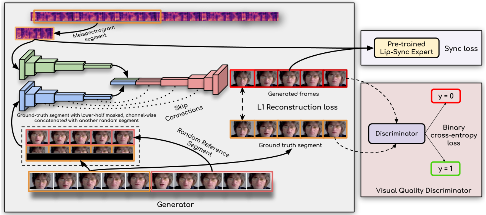

1. 判别器SyncNet：输入$T_v$时间戳的视频序列和$T_a$时间戳的音频序列，$T_a$的时间戳与$T_v$是否对齐构成了真假样本。

   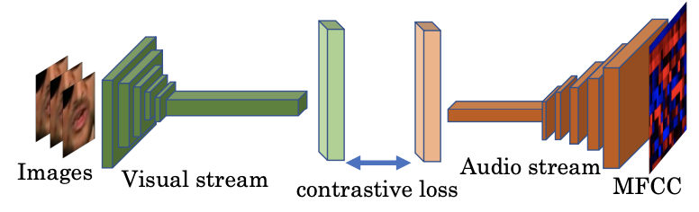

   Wav2lip对SyncNet改造，提出了expert lip-sync discriminator，①将输入灰度图改为输入彩色图，②将网络加深并加入残差跳跃连接，③使用另一种损失函数，余弦相似度+BCE。

2. 生成器LipGAN：[Towards automatic face-to-face translation](https://dl.acm.org/doi/abs/10.1145/3343031.3351066), 是Wav2lip同一作者的前序工作。

   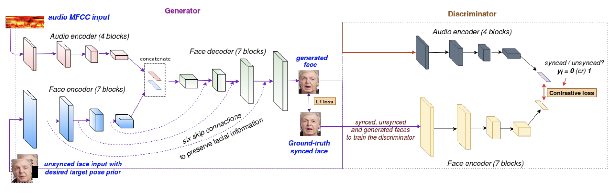

#### :page_with_curl:Wav2Lip 2.0

[paper](https://openaccess.thecvf.com/content/WACV2023/papers/Gupta_Towards_Generating_Ultra-High_Resolution_Talking-Face_Videos_With_Lip_Synchronization_WACV_2023_paper.pdf)

VQ-GAN

#### :page_with_curl:Diff2Lip

We use a PatchGAN [23] discriminator Dψ. This task requires more context than just two frames [4] but no optical flow [52].

[4] Everybody dance now.

[23]  Image-to-image translation with conditional adversarial networks.

[52] Video-to-video synthesis. [intro](https://www.youtube.com/watch?v=GrP_aOSXt5U)

#### :page_with_curl:SadTalker

CVPR2023 音频驱动说话人的SOTA

- 对3d系数中的表情系数和头部姿态分开建模，借助了Wav2Lip模型。
- 对3d系数进行人脸合成，借助了[PIRenderer](https://link.zhihu.com/?target=https%3A//github.com/RenYurui/PIRender)模型合成人脸的方式，改进在于还将3D关键点用进来。

#### :page_with_curl:Speech2Lip

ICCV2023

#### :page_with_curl:SIDGAN

ICCV 2023

提出Sync Loss和主观画质的相悖的，因为它提取的embeddings是平均的表征，最小的Sync loss并不和person-specific的嘴形、细节对齐。

本文提出shift-invariant改进版的Sync Loss，利用了polyphase sampling与contextual loss。

> 改进了SyncNet的网络结构，主要是其中的下采样层使用了自适应多相采样（adaptive polyphase sampling）

#### :page_with_curl:IP Lap

介绍了现状：*person-specific*的方法在应用上的局限，*person-generic*的方法难在保持ID的同时生成好的效果。


#### :page_with_curl:HyperLips

他们复现的DINet(R)看起来色差问题很严重。至于HyperLips本身，它提出一个很有趣的条件注入方式：

- 在自定义的动态卷积BatchConv2d内部, audio特征会进一步经过2种mlp得到$oc*ic*k*k$、$oc$的维度,用于作为卷积的weight和bias。这里注意下batch维度的处理, 设计了一个分组卷积, groups=b_i。
- 自定义的MultiSequential也挺有意思, 选择性的输入流。

可以看出来hyperlips是以wav2lip的代码基础来改的，改动后的网络结构比较有意思，但不一定高效、解决问题。

它和Wav2Lip一样，应该会遇到数据集过小就没法训练的问题（https://github.com/Rudrabha/Wav2Lip/issues/260）

#### :page_with_curl:PC-AVS

可以做到音频来自视频A，pose来自视频B，身份来自图片C，合成视频D。

使用了modulated convolution，并且比较了它相对AdaIN的优势。

> StyleGAN2用的前者，StarGAN v2用的后者。 

#### :page_with_curl:StyleSync

提出很多时候换嘴更实用：

> Under real-world scenarios like audio dubbing, one crucial need is to seamlessly alter the mouth or facial area while preserving other parts of the scene unchanged

认为通过3D转一道可能反而有误差累积。启发咱们直接使用audio。

StyleSync的mask比较有实用价值，防止模型从肌肉运动推理出口型。

#### :page_with_curl:LatentSync


mask好像推理时是根据landmark来制作更精准的。 

而训练时，只是将输入做仿射变换，进行face frontalization，然后使用这张固定的mask.png。

> [!CAUTION]
>
> 因为作者认为用landmark来获取mask，也会提供嘴唇移动的线索。

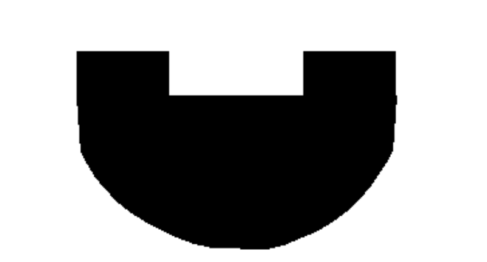

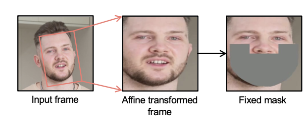

由于SyncNet的效果对于lipsync模型的训练很重要，本文细致的研究了影响SyncNet收敛的核心因素。

分析了在口型同步中的捷径学习（Shortcut Learning）问题：

因为口型同步任务经常基于嘴部重绘（inpainting）的框架。意外的是，音频条件的模型倾向于基于嘴唇周围的视觉信息（如面部肌肉、眼睛和脸颊）来预测嘴唇运动，而忽略音频信息。

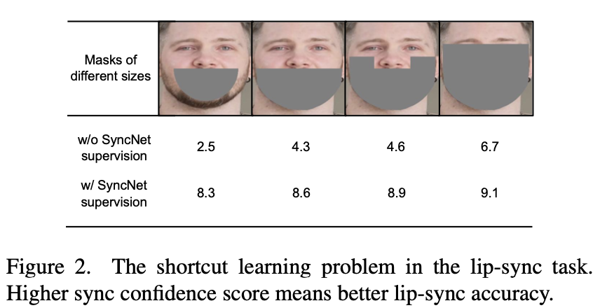

本文还提出TREPA（Temporal Representation Alignment）的方法，和我想到的temporal (gram) perceptual loss很像，只是用了更强大的预训练模型VideoMAE-v2。

#### :page_with_curl:StyleLipSync

ICCV2023

图像解码器使用了StyleGAN，提供嘴部先验。

对latent使用了滑动平均进行平滑，使得时域更稳定。

提到这几篇论文可以做person- specific finetune：`Mystyle`, `Synctalkface`, `Pivotal tuning for latent-based editing of real images`

它将ref和audio都放在旁支网络了。

使用Sync regularizer增加短视频训练对于音频的泛化性。

> fine-tuning the decoder on a short video of a single identity leads to over-fitting and losing the lip-sync generality as the generator can memorize the target video.

和我们的做法不谋而合，很容易想到。区别点只是，该工作先训general的，再finetune person-specific的，过程中加上大规模数据集的音频完成Sync regularizer。 且普通的sync loss一直都在。

#### :page_with_curl:DAE-GAN

得到一个face embedder。我觉得这是一个思路，拿预处理时间换每例处理时间，和Neural voice puppetry需要提前处理得到3D face类似。

我觉得face embedder可以和warpping net一起训练，确保只需warpping就可以得到任意想要的表情、姿态，无需无中生有。这样<font color="brown">embedded face</font>就是一个包含完整ID的没有表情/姿态的中立形式，这种形式也有利于后续的训练。

face embedder的组成也是warppingnet+attention。一个得到displacement field一个得到attention map.


#### :page_with_curl:VideoReTalking

如果是全身人像，感觉更廉价的方案是 [video-retalking](https://opentalker.github.io/video-retalking/)。

后续还有[SadTalker](https://github.com/OpenTalker/SadTalker)，[StyleSync](https://github.com/guanjz20/StyleSync_PyTorch)，[DINet](https://github.com/MRzzm/DINet)，[FaceFormer](https://github.com/EvelynFan/FaceFormer)，[CodeTalker](https://github.com/Doubiiu/CodeTalker)等新的SOTA。

产业界可以关注：

[https://aman-agarwal.com/2022/07/01/deepfake-videos-kristof-szabo-colossyan/](https://www.google.com/url?q=https://aman-agarwal.com/2022/07/01/deepfake-videos-kristof-szabo-colossyan/&sa=D&source=docs&ust=1696838688057700&usg=AOvVaw1DRSXTs2lZf5W7CNtDd8y7)

现有方法：恢复牙齿使用teeth proxy

本文方法：使用预训练的人脸解析网络，配合GFP-GAN修复牙齿

#### :page_with_curl:DINet

目前对参考图像利用比较充分的一个方法。但id的保持仍然不佳（尤其是stage4的训练之后），有很大的提升空间。

它的数据处理值得注意一下，crop人脸是根据landmark来的，主要是鼻子和嘴角的4个点，以及最下方（y值最大）的一个点。鼻子的两个点确定crop的位置。

嘴角的两点的距离确定crop的w。

鼻梁和最下方的两点的距离确定crop的h。

最终每帧的半径会取 `max(w，h) // 2`，并在此基础随机放大一点点。

位置是帧级的，半径是片段级（连续9帧），并行处理后取9帧里的最大半径。

> crop之后就保存了，没有经过reshape。所以有大有小，但ratio都是1.3。
>
> 假设w为10a的话，h是13a，嘴部是边长8a的正方形mask。 8a=64、128、256一步一步的三阶段训练。这有两方面好处。

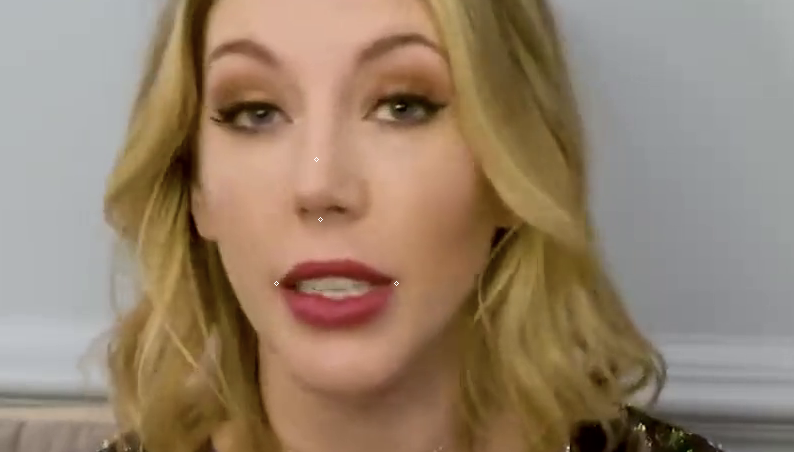

大角度用selfref，小角度不用。

Issue区很好玩，可以从卖nerfs的广告哥的主页浏览到诸多热门的lipsync模型。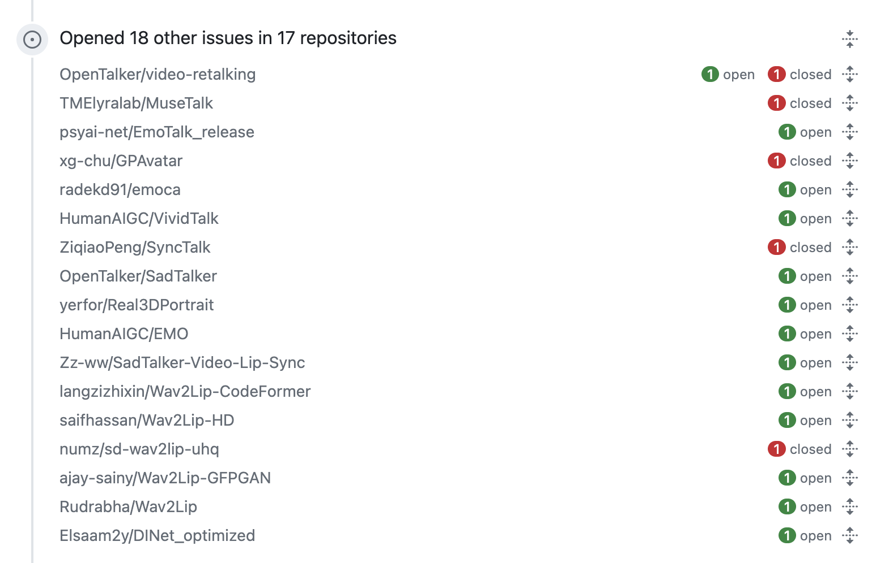

finetune时需要冻结BN，https://dl.acm.org/doi/pdf/10.1145/3503161.3547915

DINet作者设计和训练了一个版本的syncnet，这个感觉也有研究价值，它的syncnet出来不是普通的标量，而是有空间维度的，类似于patch-GAN，可能对画质有帮助。

至于开源的syncnet_pytorch是

https://github.com/joonson/syncnet_python/issues/65

AV offset: the offset between Audio and Video, -1 means the audio is faster than the video for 1 frame, +1 means the opposite;
Min dist: Min dist is the mean feature-wise distance between the audio and video at `AV offset`.
Confidence: Confidence is a score of how much closer the mean feature-wise distance is at the `AV offset` compared to other wrong offsets. Higher the confidence, more likely the sync offset is to be correct.

嘴部面积（多边形面积）：计算起来很快，比如利用[鞋带公式](https://blog.csdn.net/xza13155/article/details/112118676)。


#### :page_with_curl:KeySync

抛出一个发人深省的问题：为什么看起来音频驱动口型，比音频驱动全脸的任务“简单”，但实际在这个领域的进展更小呢？

因为隐藏一些独特的“坑”，却迟迟未被解决：

> [!IMPORTANT]
>
> 视频口型对齐任务还存在一个常被忽视的问题——**表情泄露**，即模型会无意保留原视频中的面部表情。现有方法普遍把唇形同步当作配对音视频上的重建任务，却很少关注**跨同步**场景（用不匹配的音频重新驱动视频）。因此，模型往往在跨同步时表现出严重的表情泄露，导致音视频同步性下降。这一问题尤其影响如自动配音等实际应用，因为其中音频与视频天然不匹配。

> KeySync文章的作者认为，目前驱动照片的工作发展更快，而看似更简单的视频lip-sync相对进展较慢，也是由于这些实际挑战没被攻克。

解决清晰度、表情泄漏、嘴部遮挡等实际挑战。还提出一个LipLeak的指标，来衡量嘴形受表情的影响。

> LipLeak 计算方式是：在静音音频与非静音视频的输入条件下，统计生成结果中**非静音帧**所占的比例。


#### :page_with_curl:infiniteTalk

目前看

#### :page_with_curl:MuseTalk

两阶段训练。

stage2 和 stage1主要差异（全由yaml配置指定）：

- 首先，stage2的unet由stage1预训练得到
- stage2使用dynamic_margin_crop_resize的方式剪裁人头区域，防止模型通过上半张脸推理口型。
- stage2的显存消耗更大，所以配置更小的batchsize，且使用梯度累积技术。
- stage2为多帧训练，stage1是单帧训练。
- stage2筛掉了一些小脸，注重数据质量。而stage1的筛选阈值则更宽松。
- stage2在stage1的基础上，额外增加了gan loss、mouth-gan loss 和 syncnet loss。
- stage1学习率2e5，stage2学习率5e6。

训练：

- 仍然是单帧生成的框架，只是 (b f) c h w 来支持时域损失。

- vae使用的Diffusers里的AutoencoderKL，预训练权重；

  unet使用的Diffusers里的UNet2DConditionModel，权重需要训练；

  ```python
  model_dict['vae'].requires_grad_(False)
  model_dict['unet'].requires_grad_(True)
  ```

- 如下：

  ```shell
  ./models/
  ├── musetalk # UNet2DConditionModel
  │   └── musetalk.json
  │   └── pytorch_model.bin # 由该工作训练
  ├── musetalkV15
  │   └── musetalk.json
  │   └── unet.pth # 由该工作训练
  ├── syncnet
  │   └── latentsync_syncnet.pt
  ├── dwpose
  │   └── dw-ll_ucoco_384.pth
  ├── face-parse-bisent
  │   ├── 79999_iter.pth
  │   └── resnet18-5c106cde.pth
  ├── sd-vae # AutoencoderKL
  │   ├── config.json
  │   └── diffusion_pytorch_model.bin
  # https://huggingface.co/stabilityai/sd-vae-ft-mse/tree/main
  └── whisper
      ├── config.json
      ├── pytorch_model.bin
      └── preprocessor_config.json
  ```

- 由于是单步的扩散模型，训练中timesteps永远输入的0。

- 没有训练LDM经验的同学，记得latent要通过缩放因子进行[标准化](https://github.com/huggingface/diffusers/blob/v0.34.0/src/diffusers/models/autoencoders/autoencoder_kl.py#L57C9-L63C101)。


### 2. PhotoAnimate

#### :page_with_curl:LivePortrait

https://liveportrait.github.io/

快手的工作，效果很精细。沿用了FOMM、face-vid2vid的基于隐式关键点的框架（implicit-keypoint-based framework），可达到计算复杂度和可控性的平衡。4090显卡上可以跑到12.8ms每帧。LivePortrait在视频驱动照片的领域里，确实是一个很坚实的框架。其他相似任务里，可看下是否有可借鉴之处。

回顾face vid2vid：

implicit-keypoint-based framework主要就是在source提取canonical keypoints。然后假定driving图像复用该canonical keypoints（同一个id就可以复用），便无监督地学习获得提取canonical keypoints的能力。

然后$x_s=x_{c,s}R_s(旋转)+δ_s(表情)+t_s(平移)$ 和 $x_d=x_{c,d}R_d+δ_d+t_d$。

face vid2vid也没有像FOMM那样预测每个关键点的雅可比矩阵（Jacobian），因为它认为人头的运动是比较刚性的，每个关键点局部patch的旋转与整个人头的旋转是一致的，即$J_s = R_s$。而且这样也剩下不少带宽。

> 1. 因为face vid2vid研究的应用场景是视频会议，所以不传输$J_s$可以节省带宽。
> 2. 也正因为face vid2vid的应用场景是视频会议，所以source和driving是相同id。canonical keypoints可以复用，driving不需要再提取canonical keypoints。
> 3. 相当于最后就是传输一张source图，和drving帧的紧凑表征$R_d$、$δ_d$、$t_d$（码率极低）。


创新点：

1. Landmark-guided implicit keypoints optimization.

   我们之前看FOMM的隐式关键点完全是无监督学习出来的，位置非常地不定，看不大出来语义。但LivePortrait还是给<font color="brown">一部分（10个）keypoints加上了监督</font>，用2D landmark（eye、mouth）来做监督。认为这样对驱动微表情更有利。

   另外作者在issue里也表达出全用2D landmark也可以，只是现实中2D landmark的提取会有歧义以及不稳定。这也是隐式关键点存在的价值。

   最后，用多少个隐式关键点最佳（K=?），作者也无法给出答案。

2. 图像视频数据混合训练

   因为style视频数据比较稀缺，但style图像比较丰富。所以采用了将style图像视作静态视频的训练方式，扩充了这部分数据。

3. 表情拼接与重定向（Stitching and Retargeting）

   a stitching module

   an eyes retargeting module

   a lip retargeting module

郭建珠在Valse的报告：

HeyGen是这个领域最成功的一家初创，它的方案也是2D。

> 它可能用face swapping的方式，保人脸ID。

贴回去这个操作的专业术语叫Stitching，无缝反贴。

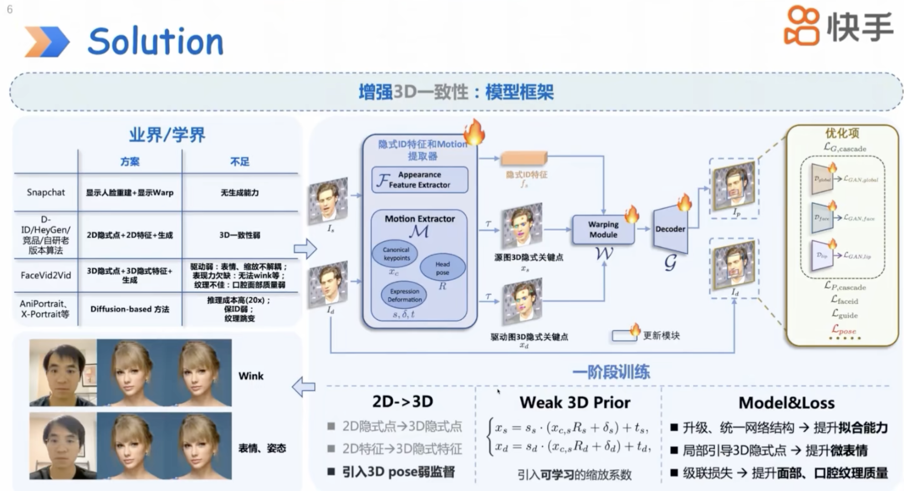

FaceVid2Vid的不足：

- 无监督学的点没法捕捉很local的细节 
- 生成质量也较弱

训练和推理：

- 除了训stitching和retargeting module，主框架训练是同id内进行的。然后推理时，如果用了其他id的驱动视频，使用相对变化进行建模。即$S_d = S_s * \frac{S_{d,i}}{S_{d,0}}$，$t_d = t_s + t_{d,i} - t_{d,0}$，$R_d = R_{d,i}R_{d,0}^{-1}R_s$

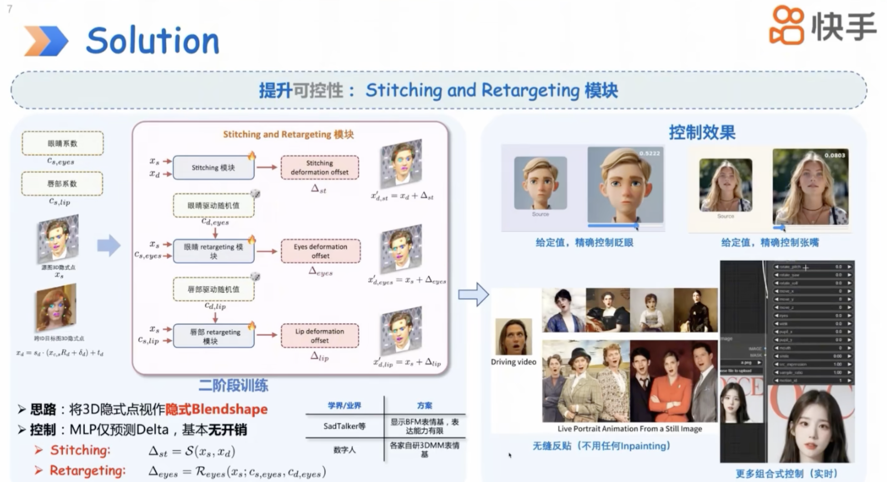

这个stitching训练还是比较麻烦的，要有一个可反传的2d landmark model。

> 我认为这里可能有口误，应该是retargeting module才是必须要可反传的2d landmark model。 因为$Condition_{eyes}, Condition_{lip}$就是眼睛、嘴唇之间的距离。

- 首先stitching、retargeting module都是只操作驱动关键点的，也就是$x_d$ 到 $x_d^{'}$。 不涉及生成器的改动。可以看到warping module和decoder都是冻结的。

  都是经过mlp处理：

  ```yaml
  stitching:
        input_size: 126 # (21*3)*2 两份隐式关键点
        hidden_sizes: [128, 128, 64]
        output_size: 65 # (21*3)+2(tx,ty)
      lip:
        input_size: 65 # (21*3)+2 源隐式关键点+源上下嘴唇间距+随机的嘴唇间距
        hidden_sizes: [128, 128, 64]
        output_size: 63 # (21*3)
      eye:
        input_size: 66 # (21*3)+3 源隐式关键点+源双眼间距元组+随机的眼部间距
        hidden_sizes: [256, 256, 128, 128, 64]
        output_size: 63 # (21*3)
  ```

- stitching module为了造出肩膀移动比较大的情形，是用了cross-id的源图像和驱动图像。与同id重建的图像做loss，且mask掉脸部区域，只对肩膀等区域做loss。

  这是当贴回效果不好时可以做的二阶段弥补训练。

- eyes/lip-retargeting modules是mask掉eyes或lip区域，对其他区域做loss保持一致。保证对眼部、嘴部参数控制$Condition_{eyes}, Condition_{lip}$时不影响其他区域。

二次开发，实时表情编辑：https://github.com/PowerHouseMan/ComfyUI-AdvancedLivePortrait；由于是MIT License，许多公司也拿去商用了，Poe/某映/某图/Cooraft等等，但需要将InsightFace用比如MediaPipe替换掉。

#### :page_with_curl:GAIA

扩散模型的数据人效果挺惊艳的，有EMO、VASA-1等文章。我们先从这篇简单一点的baseline（GAIA盖亚，Generative AI for Avatar）入手。

关键：

- 音频驱动avatar，背景保持
- 大规模数据集，16K的ID

> EMO和VASA-1也用了海量数据集，可以说“规模就是一切（scale is all you need）”

#### :page_with_curl:Diffused Heads

https://github.com/MStypulkowski/diffused-heads/tree/train

开源了训练代码，是个不错的baseline。

腾讯也开源了一个：https://github.com/tencent-ailab/V-Express

#### :page_with_curl:Everybody’s Talkin

前作Everything’s Talkin

贡献：

提出音频中身份信息的剥离，把ID-removing和Audio-to-Expression分两部做了。

#### :page_with_curl:3D Face Reconstruction

解决face images - ground truth 3D face数据的稀缺问题。

1. 本文的思路是采用弱监督学习。组合了图像级损失和感知级损失。

2. 从一组照片重建3D face，不再朴素聚合（简单地平均每张重建出来的形状）和一些启发式策略，而是基于置信度的聚合获得。另外可以利用姿势差异的互补信息更好的融合。

   置信度预测子网络也以没有标签的弱监督方式进行训练。

> 3D face shapes主流使用的3D Morphable Model (3DMM) coefficients。使用 3DMM，人脸形状 S 和纹理 T可用仿射模型（affine model）表示，即系数加权和。

<font color="brown">3D建模：</font>

$$S = S(\alpha,\beta) = \bar{S} + B_{id}\alpha + B_{exp}\beta $$

$$T = T(\delta) = \bar{T} + B_t\delta$$

$B_{id}$,  $B_{exp}$,  $B_t$分别是身份、表情和纹理PCA的基。

<font color="brown">光照建模：</font>gamma，用[球谐函数](https://zhuanlan.zhihu.com/p/351289217)表示。用来描述不同方向光照的SH基函数我们一般用到二阶或者三阶，二阶是4个系数，三阶是9个系数。三阶拓展到rgb，就是9 * 3 = 27个系数。

<font color="brown">相机建模：</font>姿态包括 angle（旋转角度）和translation（平移）。

<font color="light blue">id.gamma.tex</font> 为<font color="light blue">静态特征</font>，**身份(80)**+光照(27)+**纹理(80)**

<font color="light blue">angle.exp.trans</font> 为<font color="light blue">动态特征</font>，旋转(3)+**表情(64)**+平移(3)

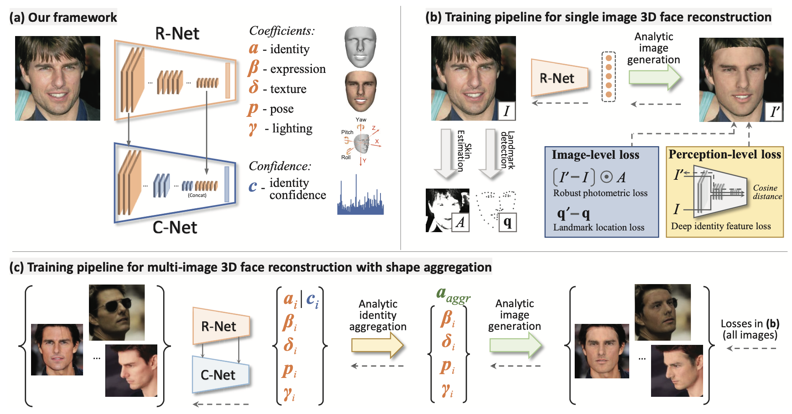

图像损失：仅面部区域的像素级损失，关键点损失

感知损失：注意使用的cosine距离

> 但是BFM用的PCA，不方便解耦来预设眼部表情。
>
> orthogonal PCA basis are widely used such as BFM [22] and FLAME [30];
>
> blendshapes, such as FaceWarehouse [9], FaceScape [53] and Feafa [52].

https://github.com/peterjiang4648/BFM_model/releases/tag/1.0 有人分享了mat文件。可以不用自行下载和matlab得到BFM.mat了。

#### :page_with_curl:SMIRK

https://github.com/sicxu/Deep3DFaceRecon_pytorch

https://github.com/georgeretsi/smirk

本文认为现有方法重建3D face效果不错，但面对微表情、极端表情、非对称表情、罕见表情时，还是有不足。提出SMIRK（Spatial Modeling for Image-based Reconstruction of Kinesics(动力学)）

现有方法大多基于可微分渲染，

> **3D Morphable Model** 是一种基于统计的方法，用一组参数去描述人脸的几何形状（shape）和外观（appearance/albedo）。
>
> 预测 3D Morphable Model (3DMM)，然后通过可微分渲染，进行自监督训练。

> [!TIP]
>
> 两种3DMM的侧重差异：
>
> - **BFM**：高保真静态人脸建模
> - **FLAME**：动态、可驱动的表情和姿态

而Smirk提出用神经渲染。简而言之，它是先只预测 head pose、identity、expression，然后单色渲染出几何。 再提供脸部稀疏的采样像素，令Image-to-Image Translator（一个UNet）重建出最终的人脸。

实际推理时，替换expression即可更改表情。

> 本文分析 可微分渲染的缺陷：
>
> 1. 联合优化 几何、相机、外表、光照 是病态的（ill-posed）优化问题。
> 2. 可微分渲染的图像 和  自然图像 有巨大的domain gap。

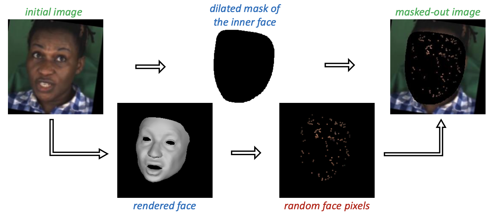

> [!NOTE]
>
> 其实Smirk思路非常简单，它只进行<font color="brown">可微单色渲染</font>。 之后再进行图像风格转换，得到重建人脸。
>
> 而不像过去的方式，还预测albedo参数，完全由参数化人脸模型（BFM、FLAME，它们也都被称为3DMM）渲染出重建人脸。
>
> 相较之下，Smirk的方法 避免了重建人脸 和 自然人脸的 domain gap，继而避免了复杂的loss设计。

#### :page_with_curl:PersonaTalk

https://github.com/sicxu/Deep3DFaceRecon_pytorch

https://github.com/georgeretsi/smirk

https://grisoon.github.io/PersonaTalk/

和Smirk思路相似，只是提供了一整套方案，如何将3dmm用到音频驱动数字人中。（不过它也是驱动单图）

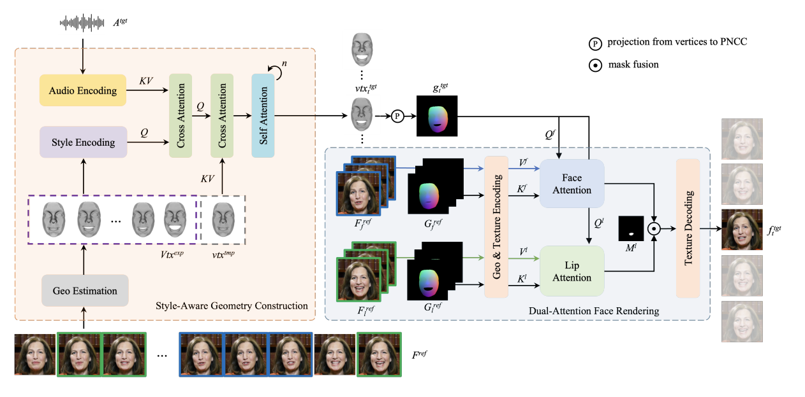

1. stage1：将一个视频片段的geometry 和 模版的geometry，作为style。再将其注入audio，得到stylized audio features，作为驱动信号。

   > 其中geometry用的[3D Face Reconstruction](https://github.com/sicxu/Deep3DFaceRecon_pytorch)提取。 但会用[Ganfit](https://github.com/barisgecer/ganfit)的思路再精炼一下它。
   >
   > 风格参考只用到<font color="brown">expression-only mesh vertices</font>（shape和pose没有用到）。

   > ---  我还没细读，估计这儿模版的geometry，就是只有id，没有expression。---
   >
   > 确实是这样，模版 geometry 就是 <font color="brown"> shape-only mesh vertices</font>。shape由整个参考片段的shape均值得到。
   >
   > 最后，GT geometry就是 <font color="brown"> shape & expression mesh vertices</font>，只是不考虑pose。

   风格感知的音频特征 再驱动 模版geometry，就可以得到口型对齐的geometry，称作目标geometry。

   不过音频驱动只生成下半张脸网格顶点，所以目标geometry的上半张脸网格顶点就是来自GT。 $𝑣𝑡𝑥_𝑡^{target} = 𝑣𝑡𝑥_𝑡^{target}[\text{𝑖𝑑𝑥}_{𝑙𝑜𝑤}]∪𝑣𝑡𝑥_t^{𝑔𝑡}[\text{𝑖𝑑𝑥}_{𝑢𝑝}]$

2. 加上head pose后再映射得到 [PNCC](https://github.com/cleardusk/3DDFA)，这个看起来是个彩色图。

   > [!NOTE]
   >
   > PNCC 是 一种特殊颜色编码的渲染结果，它包含了3D信息，
   >
   > PNCC = Projected Normalized Coordinate Code
   >
   > 它是把 3DMM 模型的标准人脸顶点坐标（归一化到一个固定范围，比如 [-1, 1]）投影到输入图像上的结果
   >
   > 换句话说：
   >
   > - 对于每个像素，PNCC 提供它在 **标准人脸模型坐标系**中的 (x, y, z) 位置
   > - 这是一种 dense correspondence（密集点对应关系）编码
   > - 看起来像一张彩色图 <font color="brown">（R=归一化X，G=归一化Y，B=归一化Z）</font>

   它是face renderer需要的表达形式。PNCC看起来挺适合用作神经网络的输入。

3. stage2：训练一个face renderer，给目标geometry 渲染出纹理。

   具体来说，有预测的口型对齐的PNCC。 然后提供ref 及其对应的PNCC。

   > 本文分了face-ref和lip-ref，表达说前者需要平滑、背景稳定，才能学到细节，后者需要丰富。 
   >
   > 二者就是采样方式不同，face-ref在一个小的窗口连续采样，lip-ref在整个视频采样 标准几何形状 $\{\alpha_t,\beta_t,0\}$，也就是排除pose的影响，并且嘴巴开合大小可以根据$\beta$排序后，均匀采样。
   >
   > 注： 在 3D 人脸建模或 3DMM 语境下，canonical geometry（规范几何）通常就是指 统一到一个标准姿态（pose）下的几何形状。

#### :computer: face3d: Python tools for processing 3D face

> 3D 人脸是非常有趣的研究领域。face3D 是一个基于 Python 的开源项目（https://github.com/YadiraF/face3d），实现了 3D 人脸研究的众多功能。它可以处理网格数据，用形变模型生成 3D 人脸，从单张二维人脸图片和关键点重建三维图像，渲染不同光照条件的人脸。
>
> face3D 非常轻量化，最开始完全是基于 Numpy 写的。但有些函数（比如光栅化）不能用向量化进行优化，在 Python 中非常慢。这部分函数作者改用 C++ 编写，没有调用 OpenCV、Eigen 等大型的库，再用 Cpython 编译以供 Python 调用。
>
> 项目作者考虑到初学者刚开始学习时应该聚焦在算法本身，同时让研究人员能够快速修改和验证他们的想法，Numpy 版本也被保留下来。此外，作者也尽量在每个函数中添加了引用的公式，以方便初学者学习基础知识、理解代码。更多的 3D 人脸研究信息，包括[论文](https://github.com/yfeng95/face3d/blob/master/3D%20Face%20Papers.md)和代码，也可以在项目Github中找到。
>
> Enjoy it :smile:

结构：

```python
# Since triangle mesh is the most popular representation of 3D face, 
# the main part is mesh processing.
mesh/             # written in python and c++
|  cython/               # c++ files, use cython to compile 
|  io.py                 # read & write obj
|  vis.py                # plot mesh
|  transform.py          # transform mesh & estimate matrix
|  light.py              # add light & estimate light(to do)
|  render.py             # obj to image using rasterization render

mesh_numpy/      # the same with mesh/, with each part written in numpy
                 # slow but easy to learn and modify

# 3DMM is one of the most popular methods to generate & reconstruct 3D face.
morphable_model/
|  morphable_model.py    # morphable model class: generate & fit
|  fit.py                # estimate shape&expression parameters. 3dmm fitting.
|  load.py               # load 3dmm data
```

shape 199, texture 199, expression 29

注释参考[1](https://zhuanlan.zhihu.com/p/611044607), [2](https://github.com/peterjiang4648/BFM_model/releases/tag/1.0), [3](https://zhuanlan.zhihu.com/p/530830577)

#### :page_with_curl:Perceptual Head Generation with Regularized Driver and Enhanced Renderer

黄哲威的工作，基于俞睿师兄的PIRenderer。PIRender总体效果挺好，但主要存在两个问题：背景扭曲 和 图像边缘失真。本工作使用了两个非常实用的方法缓解了上述问题，一个是背景分割后做滑动平均，一个是grid_sample函数使用border模式的padding。

#### :page_with_curl:PIRenderer: Controllable Portrait Image Generation

俞睿师兄的工作，旨在得到具有语义和完全分离的参数——使用三维可变形面部模型（3DMM）的参数来控制面部运动。

> 提供细粒度控制，直观且易于使用。这是FOMM等工作所不能达成的，它们阻碍了模型以直观方式编辑肖像的能力。

结合技术的先验知识，人们可以期望控制类似于图形渲染处理的照片般逼真的肖像图像的生成。

> 为了实现直观控制，运动描述符应该在语义上有意义，这需要将面部表情、头部旋转和平移表示为完全分离的变量。

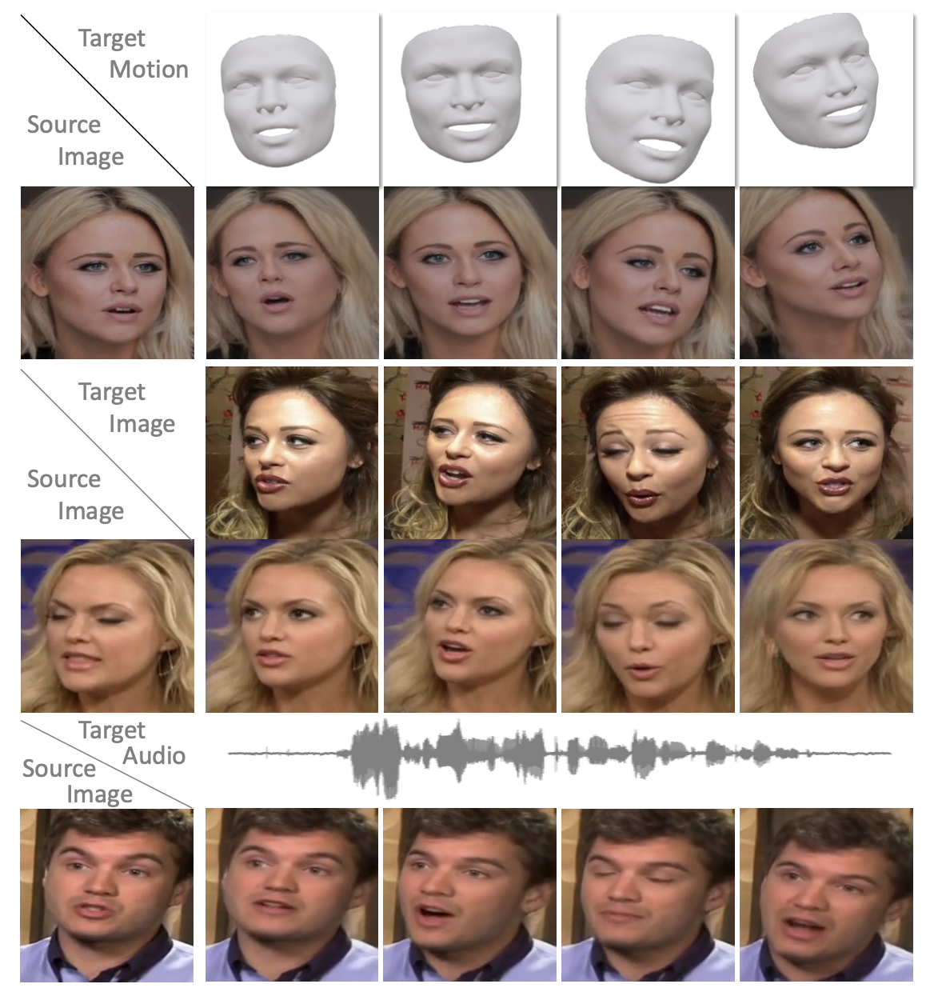

我们表明，我们的模型不仅可以通过使用用户指定的动作编辑目标图像来实现<font color="brown">直观的（top）</font>图像控制，而且还可以在<font color="brown">间接（middle）</font>肖像编辑任务中生成逼真的结果，其中目标是模仿另一个人的动作。 此外，我们通过进一步扩展模型来解决音频驱动的面部重现任务，展示了我们模型作为高效神经渲染器的潜力。 由于高层完全分离的参数化，我们可以从<font color="brown">“弱”控制音频（bottom）</font>中提取令人信服的动作。

>3DMM参数：人脸三维网格、模型在图像中的位置，以及当前人脸的形状特征参数和blendshape表情参数。（即 pose（包括旋转rotation和平移translation）, identity, expression）
>
>现在有些固定了pose和identity的应用场景，则只需要blendshape。

PIRenderer包含三部分网络：

> 0. 采用现成的 3D 人脸重建模型从真实世界的人像图像中提取相应的 3DMM 系数进行训练和评估；
>
>    注：为了缓解系数提取误差和噪声带来的影响，将具有**连续帧的窗口**的系数用作中心帧的运动描述符。

1. Mapping Network：将3DMM参数映射为隐向量（a latent vector）；
2. Warping Network：在隐向量的指导下，估计source和所需target之间的光流，并通过用估计的变形来warp源得到粗略的生成结果；
3. Editing Network：从粗略的结果到精细的生成结果。

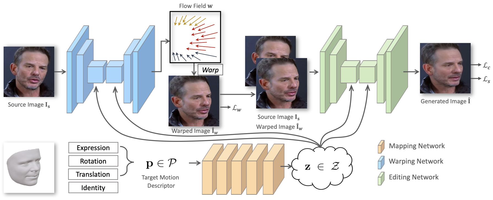

其中使用AdaIN 是比较精髓的部分，值得学习。AdaIN算子负责将 z 描述的运动注入Warping和Editing网络。AdaIN非常类似于SFT层，最早在风格迁移任务中使用。

EditingNet应该有提升空间，把画质增强里面比较适用的做法用过来。

> PIRender只需要输入3DMM中表情和姿态的系数，而不需要身份（identity）。这是由于有source image提供identity。但也因此，PIRender的训练没有引入GAN，就是想保id，GAN经常可能生成不真实的信息。

PIRender的损失函数，训练refine网络时采用了<font color="brown">VGG-style-loss</font>，也就是在vgg特征的基础上经过格拉姆矩阵后再算L1距离。

> 格拉姆矩阵（Gram matrix）：n维欧式空间中任意k个向量之间两两的内积所组成的矩阵，称为这k个向量的格拉姆矩阵(Gram matrix)。
>
> 内积判断向量a和向量b之间的夹角和方向关系
>
> - a·b>0   方向基本相同，夹角在0°到90°之间
> - a·b=0   正交，相互垂直 
> - a·b<0   方向基本相反，夹角在90°到180°之间 
>
> 所以Gram矩阵可以反映出**该组向量中各个向量之间的某种关系**。

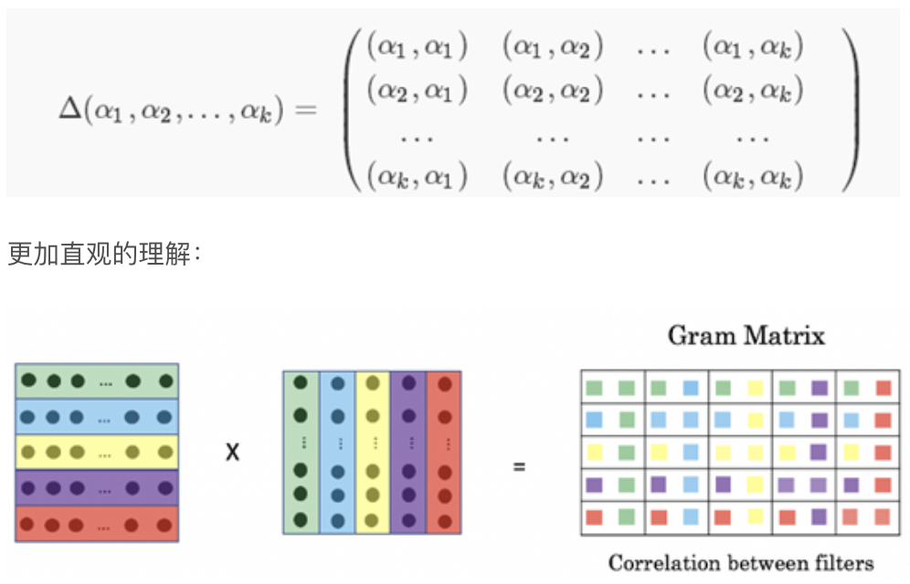

**Gram计算的实际上是两两特征之间的相关性**，哪两个特征是同时出现的，哪两个是此消彼长的等等。格拉姆矩阵用于度量各个维度自己的特性以及各个维度之间的关系。内积之后得到的多尺度矩阵中，对角线元素提供了不同特征图各自的信息，其余元素提供了不同特征图之间的相关信息。这样一个矩阵，既能体现出有哪些特征，又能体现出不同特征间的紧密程度。

>深度学习中经典的风格迁移大体流程是：
>
>1. 准备基准图像和风格图像
>2. 使用深层网络分别提取基准图像（加白噪声）和风格图像的特征向量（或者说是特征图feature map）
>3. 分别计算两个图像的特征向量的Gram矩阵，以两个图像的Gram矩阵的差异最小化为优化目标，不断调整基准图像，使风格不断接近目标风格图像
>
>关键的一个是在网络中提取的特征图，**一般来说浅层网络提取的是局部的细节纹理特征，深层网络提取的是更抽象的轮廓、大小等信息**。这些特征总的结合起来表现出来的感觉就是图像的风格，由这些特征向量计算出来的的Gram矩阵，就可以把图像特征之间隐藏的联系提取出来，也就是各个特征之间的相关性高低。
>
>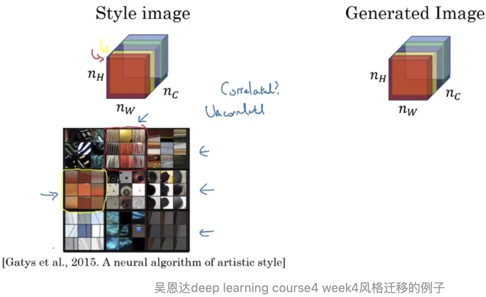

[Face3D 拓展](https://zhuanlan.zhihu.com/p/530830577)

Gram matrix扩展[1](https://blog.csdn.net/bbbeoy/article/details/108195122),[2](https://www.zhihu.com/question/49805962)

至于输出使用`nn.Sigmoid()`, `nn.Identity()`, `nn.Tanh()`, or `nn.Hardtanh`的考虑：

实验发现`nn.Identity()`即不用激活函数，似乎不如另外两种。

而$tanh(x)=\frac{1-e^{-2x}}{1+e^{-2x}} = 2*(\frac{1}{1+e^{-2x}}-1) = 2sigmoid(2x) - 1$，

它们的关系是线性关系, 所以`Tanh`和`Sigmoid`注定有很多相似点。

相似点：① 有饱和区，在输入较大或较小的区域，梯度变为0，神经元无法更新② 都有指数运算，运算量大。（基于这个原因，我考虑到更高效的`Hardtanh`）

差异点：① 首先，提到激活函数，经常会提到是否是以零为中心的。以零为中心的激活函数不会出现zigzag现象，因此相对来说收敛速度会变快。

> 当所有梯度同为正或者负时，参数在梯度更新时容易出现zigzag现象。因为梯度更新的最优方向 **不满足** 所有参数梯度正负向一致时，也就是有的参数梯度正向，有的参数梯度负向。（抛开激活函数，当参数量纲差异大时，也容易造成zigzag现象）


> zigzag现象如图所示，不妨假设一共两个参数， $w_0$ 和 $w_1$ ，紫色点为参数的最优解，蓝色箭头表示梯度最优方向，红色箭头表示实际梯度更新方向。由于参数的梯度方向一致，要么同正，要么同负，因此更新方向<font color="brown">只能为第三象限角度或第一象限角度</font>，而梯度的最优方向为第四象限角度，也就是参数 $w_0$ 要向着变小的方向， $w_1$ 要向着变大的方向，在这种情况下，每更新一次梯度，不管是同时变小(第三象限角度)还是同时变大(第四象限角度)，总是一个参数更接近最优状态，另一个参数远离最优状态，因此为了使参数尽快收敛到最优状态，出现交替向最优状态更新的现象，也就是zigzag现象。

<font color="brown">所以可以看到`tanh`从效果上是优于`sigmoid`的：</font>

优点：输出关于原点对称，0均值，因此输出有正有负，可以规避zigzag现象，另外原点对称本身是一个很好的优点，有益于网络的学习。

缺点：存在梯度消失问题，tanh的导数计算为 $\frac{4e^{2x}}{(e^{2x}+1)^2} $，取值范围为(0,1]，虽然取值范围比sigmoid导数更广一些，可以缓解梯度消失，但仍然无法避免随着网络层数增多梯度连乘导致的梯度消失问题。 

#### :page_with_curl:Responsive Listening Head Generation: A Benchmark Dataset and Baseline

生成聆听者的头部视频的任务。

任务：聆听头部生成将来自说话者的音频和视觉信号作为输入，并以实时方式提供非语言反馈（例如，头部运动、面部表情）。

本文主要是提供数据集，和尝试基于PIRender的baseline。

本文的数据集是音频采样率44100，视频帧率30。这样才是45 = curr_mfccs: 39 + rms: 3 + zcr: 3，如果手头有音频/视频帧率不满足该要求的。只要保证帧率比位44100:30即frame_n_samples = 1470即可。

> 如果采样率44100帧率30，45 = curr_mfccs: 39 + rms: 3 + zcr: 3，和本作一样
>
> 如果采样率44100帧率25，86 = curr_mfccs：78 +  rms: 4 + zcr: 4
>
> 如果采样率16000帧率25，82 = curr_mfccs：78 +  rms: 2 + zcr: 2

#### :page_with_curl:Structure-Aware Motion Transfer with Deformable Anchor Model

阿里妈妈的工作，基于FOMM。👉🏻[PR](https://blog.csdn.net/alimama_Tech/article/details/125419491)

FOMM的缺陷：

**源图像**和**驱动图像**关键点检出的对应关键点并没有指向同一个真实部位时，输出结果中这个区域的就有较强的结构模糊。另外，还有一个观察是通常这样的不匹配都源自关键点检测没有击中合理的部位，甚至都在人体/脸部以外了。

本文改进：

推理不变，训练则引入结构先验（或叫位置先验），关键点的对应点既可以通过根节点光流图计算得到，又可以通过模型直接直接预测出来。两路结果求Loss，就惩罚了不符合根节点先验约束的关键点位置预测。

效果比较：

FOMM vs. RegionMM vs. This paper

#### :page_with_curl:OmniHuman-1

基于DiT

#### :page_with_curl:GAGAvatar

基于3DGS

#### :page_with_curl:FLOAT

& LIA (Latent Image Animator)：提供motion latent space，被本文认为比pixel-based latent spaces合适。

> LIA 作为 Motion Latent Auto-encoder，将图像解耦成motion和appearance特征。

> VASA-1 也是用Megaportraits的motion latent。

 属于flow matching generative model，可以回顾下刘星超的Rectified Flow的介绍。

> [!NOTE]
>
> 本文还比较了流模型方法：
>
> - 归一化流：直接学映射函数
>
>   像修一条高速公路。你得明确规划每个路口（映射函数），并且每段必须符合标准设计（可逆、结构简单、Jacobian 可计算）。
>
> - 流匹配：学导数（vector field）
>   像使用GPS。你不关心路具体长什么样，只要告诉我每个时刻往哪个方向走（向量场），然后用 ODE 把路径积分出来，就能从出发点走到终点。

这儿使用OT（最优传输路径）的flow

基于LIA这个工作。其中附录的A.2. Improving Fidelity of Facial Components值得研究下。因为它牙齿生成效果确实不错。

评价EMO虽然效果好，但是有几大缺陷：无法支持时域一致的长视频；采样速度慢；需要依赖多种辅助的人脸先验，限制了它的多样性和运动保真度。

相关工作里Diffusion Models and Flow Matching这节写得不错。

#### :page_with_curl:DaGAN

CVPR2022

#### :page_with_curl:Thin-Plate-Spline-Motion-Model

CVPR2022

#### :page_with_curl:Inversion GAN: image2stylegan

优化类方法

#### :page_with_curl:Inversion GAN: pixel2style2pixel

encoder类方法

#### :page_with_curl:CVPR 2025 GAN相关

- DiffAugment：给判别器的输入做数据增强，来解决判别器的过拟合问题。
- 使用DINO/CLIP作为判别器，一种比较有效的方法是固定的DINO作为判别器的旁路，相当于原判别器只需要学习和DINO结果的残差。来解决GAN框架里同时训练生成器、判别器两个网络时的困难。

### T2I

这一波生成模型，对text-to-image任务的完成度相当高。

#### :page_with_curl:Visual Autoregressive Modeling

论文表示VAR在多方面超过DiT。

自回归(autoregressive, AR) 的大语言模型取得了很大的成功，其扩展性（scaling laws）和泛化性（zero-shot）是关键。

DALL-E和VQGAN使用视觉分词器（visual tokenizer）将连续图像离散化为二维词元网格，然后将其展平为一维序列以进行自回归学习，这一过程类似于语言模型中的序列建模。然而，这些模型的扩展法则尚未被充分研究，更令人沮丧的是，它们的性能明显落后于扩散模型。与大型语言模型（LLMs）取得的显著成果相比，自回归模型在计算机视觉中的潜力似乎尚未被充分释放。

自回归建模需要预先定义数据的生成顺序。这篇工作便是重新思考了图像应如何“排序”：人类通常以一种层次化的方式感知或创作图像，先把握整体结构，再逐步补充局部细节。这种多尺度、由粗到细的特性为图像提供了一种自然的“顺序”。

VAR将图像的自回归学习定义为“下一尺度预测”，与传统的“下一个词元预测”相区别。自回归过程从 1×1 的低分辨率词元图起步，并逐步向更高分辨率扩展。

VQGAN背景知识：

> [!NOTE]
>
> 📌  VQGAN 背景知识： VQGAN = VQ-VAE + GAN  
> 将图像编码为离散 latent（token），借助 GAN 增强重建质量，兼顾压缩与生成能力。
>
> ---
>
> 🔧 模型结构
>
> - **Encoder**：编码图像 $$x$$ 得到连续 latent 表征 $$z_e(x) \in \mathbb{R}^{H \times W \times D}$$
> - **Vector Quantizer**：将 $$z_e(x)$$ 映射为离散 codebook 向量 $$z_q(x)$$
> - **Decoder**：将 $$z_q(x)$$ 解码为重建图像 $$\hat{x}$$
> - **Discriminator**：判别 $$\hat{x}$$ 是否真实，提高重建质量（GAN 结构）
>
> ---
>
> 🧩 向量量化（Codebook Lookup）
>
> > 这整个过程就叫做<font color="blue">向量量化</font>。 所以这儿量化可不是我们平日理解的模型压缩里的比特量化 或 视频编码里的量化。
>
> ✅ Codebook 表示：
> $$
> e = \{ \mathbf{e}_k \}_{k=1}^K, \quad \mathbf{e}_k \in \mathbb{R}^D
> $$
>
> > 视觉模型里，可以看作与语言模型中的 Tokenizer对应
>
> ✅ 查找最近邻向量（L2 距离）：
> $$
> k^* = \arg\min_k \| \mathbf{z}_i - \mathbf{e}_k \|^2
> $$
> $$
> z_q(x)_i = \mathbf{e}_{k^*}
> $$
>
> ✅ 高效距离计算 trick：
> $$
> \| \mathbf{z} - \mathbf{e} \|^2 = \| \mathbf{z} \|^2 + \| \mathbf{e} \|^2 - 2 \cdot \mathbf{z}^\top \mathbf{e}
> $$
>
> ---
>
> 🧮 损失函数组合
> $$
> \mathcal{L} = \mathcal{L}_{\text{rec}} + \mathcal{L}_{\text{VQ}} + \mathcal{L}_{\text{GAN}}
> $$
>
> 1. **重建损失**（感知/像素）：
>    $$
>    \mathcal{L}_{\text{rec}} = \| x - \hat{x} \| + \text{Perceptual / PatchGAN Loss}
>    $$
>
> 2. **Codebook 损失**（只更新 codebook 向量，stop-gradient是指梯度截断）：
>    $$
>    \mathcal{L}_{\text{VQ}} = \| \text{sg}[z_e(x)] - e \|^2
>    $$
>
> 3. **Commitment 损失**（让 encoder 靠近 codebook）：
>    $$
>    \mathcal{L}_{\text{commit}} = \beta \cdot \| z_e(x) - \text{sg}[e] \|^2
>    $$
>
> 4. **对抗损失（GAN）**：
>    
>    - PatchGAN 判别器对 decoder 输出打分；
>    - 仅优化 decoder（非 codebook）。
>
> 注： $\mathcal{L}_{\text{VQ}}$ 与 $\mathcal{L}_{\text{commit}}$ 这两个损失的目标一致，只是作用的对象不一样，一个是影响编码器一个影响向量码本。这两个损失是 VQ 量化机制的**双向约束**，互相配合保证训练稳定，编码器和 codebook 共同适应数据分布。
>
> ---
>
> 📈 技术特点
>
> | 特点             | 说明                                                  |
> | ---------------- | ----------------------------------------------------- |
> | 离散 latent 表征 | 支持 token 化、适配 Transformer                       |
> | 高压缩能力       | encoder 输出空间维度降低，训练更高效                  |
> | 感知细节丰富     | GAN 提供对纹理与结构的额外监督                        |
> | 可组合性强       | 可作为图像 tokenizer 用于 DALL·E、VQ-Diffusion 等模型 |
>
> ---
>
> 🔁 与 VQ-VAE 区别
>
> | 模型   | 是否使用 GAN | 重建质量 | 纹理保真 | 应用方向        |
> | ------ | ------------ | -------- | -------- | --------------- |
> | VQ-VAE | ✘            | 模糊     | 差       | 表征学习 / 压缩 |
> | VQGAN  | ✔            | 细节丰富 | 高       | 图像生成 / 合成 |
>
> ---
>
> ✅ 总结关键词
>
> `离散编码` ｜ `Codebook Lookup` ｜ `L2 距离计算 Trick` ｜ `重建 + VQ + GAN Loss` ｜ `高保真图像生成

具体分析当前next-token AR模型的缺陷：

1）**数学前提的违背。** 在量化自编码器（VQVAE）中，编码器通常会生成一个图像特征图 $f$，其中每个位置 $f(i, j)$ 的特征向量彼此存在依赖关系。因此，在经过量化和展平之后，得到的词元序列$(x_1, x_2, ..., x_{h \times w})$ 仍然保留着**双向相关性**。这与**自回归模型的单向依赖假设**相矛盾——自回归模型要求每个词元 $x_t$ 只能依赖于其前缀 $(x_1, x_2, ..., x_{t-1})$。

2）**在某些零样本泛化任务中无法执行**。类似于问题1），图像自回归建模的单向性限制了其在需要双向推理的任务中的泛化能力。例如，它无法在给定图像底部的情况下预测图像的顶部部分。

3）**结构性退化**。展平操作破坏了图像特征图中固有的空间局部性。例如，令 $q(i,j)$ 表示一个 token，它与其四个相邻的邻居 $q(i±1,j)$、$q(i,j±1)$ 由于位置接近而具有较强相关性。但在被线性展开为序列 $x$ 后，这种空间关系被削弱，而单向约束进一步降低了这些相关性。

4）**低效**。使用传统的自注意力 Transformer 生成图像的 token 序列 $x = (x₁, x₂, ..., xₙ×ₙ)$ 需要 $O(n²)$ 个自回归步骤，并带来 $O(n⁶)$ 的计算开销。

提出next-scale预测的视觉自回归模型：

> token是VQVAE里量化的离散的潜在表示。

在这里，自回归单元是整个 token 映射图，而不是单个 token。其建模公式如下：


​                            $p(r_1, r_2, \ldots, r_K) = \prod_{k=1}^{K} p(r_k \mid r_1, r_2, \ldots, r_{k-1})$

其中，$r_k$ 表示第 $k$ 个尺度上的 token 映射图，包含 $h_k \times w_k$ 个 token。

> VAR里训练Multi-scale的VQVAE，我在想这儿codebook应该可以共用一个吧，如果不是，可作为一个改进点？ 
>
> 看了论文后面，就是共用的codebook。Note that a shared codebook Zis utilized across all scales, ensuring that each rk’s tokens belong to the same vocabulary [V]. 

请注意，VAR在训练时使用了**块状因果注意力掩码**（block-wise causal attention mask），以确保每个 $r_k$ 只能关注其前缀 $r_{\leq k}$。

> 就是decoder-only架构里的“下三角”注意力。

而在推理阶段，则可以使用 **kv-caching**（键值缓存）机制，此时无需使用注意力掩码。

Tokenization就是用的类似VQGAN里的结构，但是改成了多尺度，以及用了残差设计。

