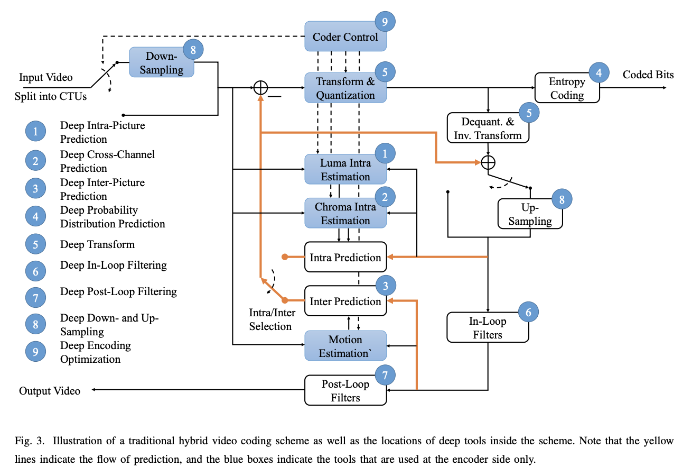

# 视频编解码

视频编码标准，是IT巨头们“跑马圈地”的游戏，想要pick助其出道。 我们需要更高效压缩标准原因可以通过Jevons悖论来解释：业界对节约煤炭研究不会降低煤炭需求，反而会因为提升了煤炭使用效率而加大对煤炭的需求。

## 综述

[使用深度神经网络的视频压缩系统的进展](https://purdueviper.github.io/dnn-coding/)

## 新一代视频编解码标准

AV1，VVC

## 深度学习辅助的混合编码框架

Liu, Dong, et al. "Deep learning-based video coding: A review and a case study." *ACM Computing Surveys (CSUR)* 53.1 (2020): 1-35.

- AI辅助块划分
- AI辅助码率控制
- AI辅助帧内预测，生成参考帧
- 基于AI前处理的，端到端编码感知优化

## 端到端视频压缩

## 利用解码信息的视频后处理

## 基于AI模型的视频质量评估

Youtube的实践：[code](https://github.com/google/uvq) | [paper](https://openaccess.thecvf.com/content/CVPR2021/papers/Wang_Rich_Features_for_Perceptual_Quality_Assessment_of_UGC_Videos_CVPR_2021_paper.pdf) | [blog](https://blog.research.google/2022/08/uvq-measuring-youtubes-perceptual-video.html?m=1)

