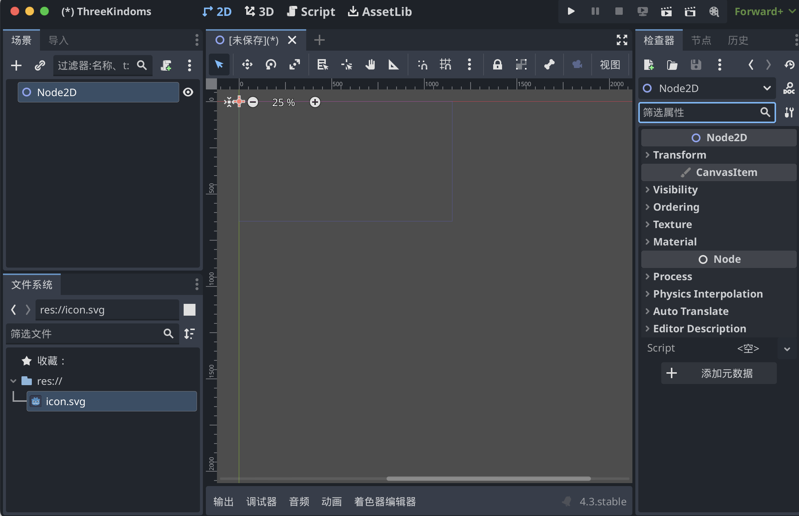
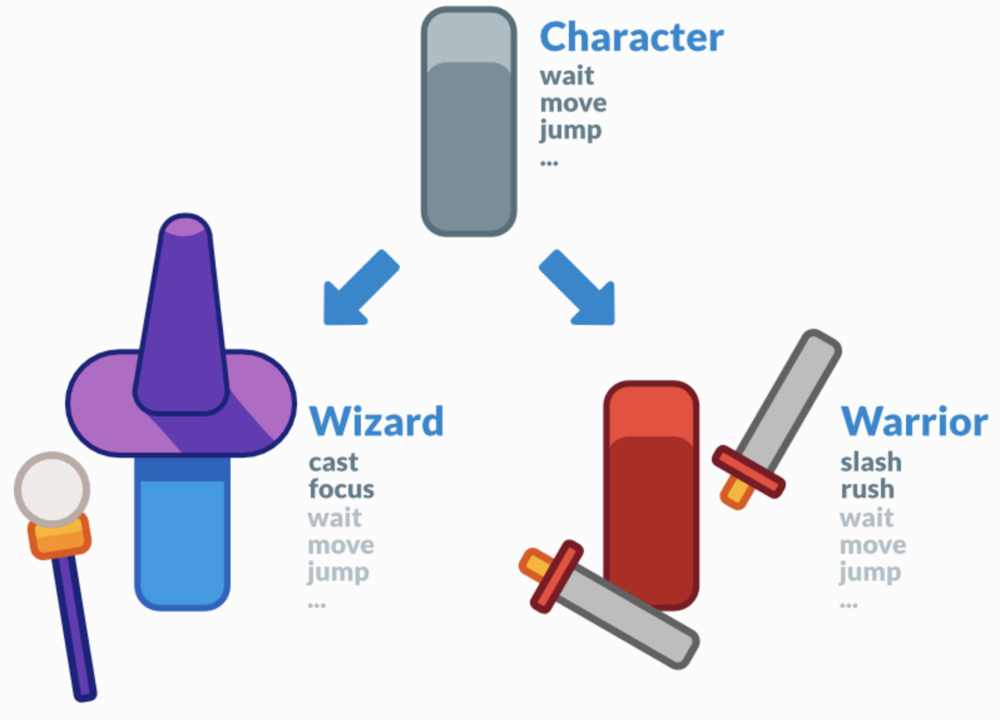
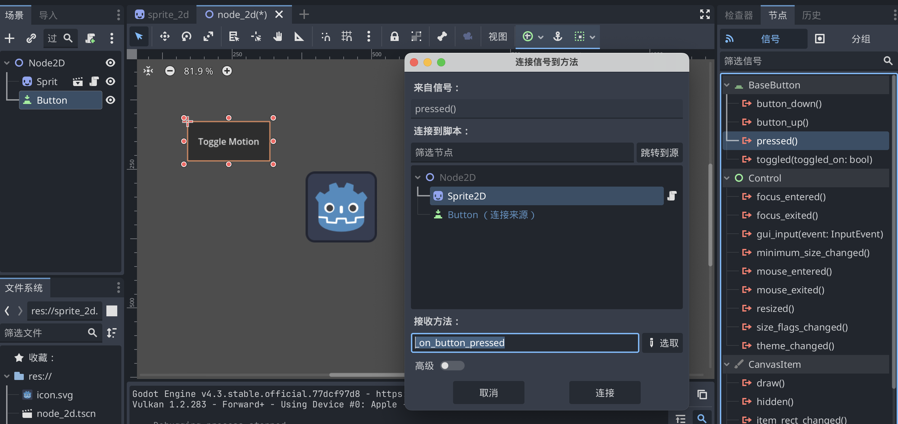

# 背景

因为Unity不稳定的商业策略，许多游戏转向开源游戏引擎Godot（戈多）。Godot给广大开发者提供一种反垄断的，能够去跟Unity、其他收费游戏引擎议价的选择空间。

<iframe src="//player.bilibili.com/player.html?isOutside=true&aid=1556446603&bvid=BV151421t7yw&cid=1648154624&p=1" scrolling="no" border="0" frameborder="no" framespacing="0" allowfullscreen="true"></iframe>

# 资源

Godot视频教程（Unity教程大神Brackeys➡️回归但是Godot）

Brackeys主页：https://www.youtube.com/@Brackeys

其他up主：[玩物不丧志的老李](https://space.bilibili.com/8618918)

Godot官网：https://godotengine.org/

Godot官方中文文档：https://docs.godotengine.org/zh-cn/4.x/

Godot官方英文文档：https://docs.godotengine.org/en/stable/

Card Game资料：youtube 搜 Godot 4.3 CARD GAME Tutorial 

# 特点

对于没有经验的开发者，使用Godot游戏引擎+GD脚本来入门，是现阶段最好的学习途径。

唯一值得考虑的缺点是，作为开源免费的游戏引擎，Godot在商业化方面做的不好，在资源和工具上提供的就比较少。对于很多不会写代码或者没有制作素材能力的开发者，如果使用Unity、Unreal，我直接就做一个插件战士，直接在资产库（asset store）里买买买，攒一个游戏就完事了。但在Godot，甚至在可预见的未来，都达不到Unity那样资产商店的规模。

其他参考资料：

[1] [Godot vs. Unity](https://blog.csdn.net/lengyoumo/article/details/132112450)

# 官方教程

## 关于

### 前言

本文档分为几个部分：

- **关于** 包含了此简介以及有关引擎，历史，许可，作者等的信息。它还包含 [常见问题](https://docs.godotengine.org/zh-cn/4.x/about/faq.html#doc-faq)。
- **入门** 包含了有关使用引擎制作游戏的所有必要信息。它从 [渐进式](https://docs.godotengine.org/zh-cn/4.x/getting_started/step_by_step/index.html#toc-learn-step-by-step) 教程开始，这应该是所有新用户的切入点。**如果你是新手，这是最好的起点！**
- **手册** 可根据需要以任何顺序阅读或参考。它包含特定功能的教程和文档。
- **贡献** 提供了向Godot贡献相关的信息 ，无论是核心引擎、文档、 demo 还是其他部分。 它描述了如何报告 bug ，如何组织贡献者工作流等。 它还包含面向高级用户和贡献者的部分， 提供有关编译引擎的信息，为编辑器做出贡献， 或开发C++模块。
- **社区** 致力于 Godot 社区的生态。它指向各种社区渠道，如 [Godot 贡献者聊天](https://chat.godotengine.org/) 和 [Discord](https://discord.gg/4JBkykG)，并包含本文档之外推荐的第三方教程和资料。
- 最后，**类参考**记录的是完整的 Godot API，另外也可以直接在引擎的脚本编辑器中查看。你可以在这里找到关于所有类、函数、信号等相关的信息。

除本文档外，你可能还会对各种 [Godot 示例项目](https://github.com/godotengine/godot-demo-projects)感兴趣。

### 特性列表

1. 平台：Godot 的目标是尽可能地独立于平台，并且可以相对轻松地 [移植到新平台](https://docs.godotengine.org/zh-cn/4.x/contributing/development/core_and_modules/custom_platform_ports.html#doc-custom-platform-ports) 。

2. 编辑器：

   - 场景树编辑器。
   - 内置脚本编辑器。
   - 支持 Visual Studio Code、VIM 等[外部文本编辑器](https://docs.godotengine.org/zh-cn/4.x/tutorials/editor/external_editor.html#doc-external-editor)。
   - GDScript [调试器](https://docs.godotengine.org/zh-cn/4.x/tutorials/scripting/debug/debugger_panel.html#doc-debugger-panel)。
   - 可视化（性能）分析器能指出在渲染管线中 CPU 与 GPU 在每个步骤花费的时间。
   - 性能监视工具，包括[自定义性能监视器](https://docs.godotengine.org/zh-cn/4.x/tutorials/scripting/debug/custom_performance_monitors.html#doc-custom-performance-monitors)。

   等等

3. 渲染：

   桌面平台默认Forward+，移动平台默认Forward Mobile，Web平台默认Compatibility。

4. 2D 图形

5. 2D 工具

6. 2D 物理

7. 3D 图形

8. 3D 工具

9. 3D 物理

10. 着色器（Shaders）

11. 编写脚本（Scripting）

    - General
    - GDScript
    - C#
    - GDExtension（C、C++、Rust、D……）

12. 音频

13. 导入（import）

14. 输入（input）

15. 导航

16. 网络

17. 国际化

18. 窗口 和 操作系统整合

19. 移动端

20. XR支持（AR和VR）

21. GUI系统

22. 动画

23. 文件格式

24. 杂项

### 系统需求

Godot编辑器的推荐配置，最低配置。导出Godot项目的推荐配置，最低配置。

**编辑器：**

- Windows、macOS、Linux、*BSD、Android（实验性）、[网页版](https://editor.godotengine.org/)（实验性）

**导出游戏：**

- Windows、macOS、Linux、*BSD、Android、iOS、Web

### 常见问题

<font color="blue">Q：</font>Godot 支持哪些编程语言？

<font color="Red">A：</font>Godot 官方支持的语言是 GDScript、C# 和 C++。如果你刚开始接触 Godot 或一般的游戏开发，推荐学习并使用 <font color="brown">GDScript</font> 语言，它是 Godot 的原生语言。虽从长远来看，脚本语言的性能往往不如低级语言，但对于原型设计、开发最小可行产品（Minimum Viable Products）以及关注上市时间（Time-To-Market）而言，GDScript 可提供一种快速、友好、能力强的游戏开发方式。

对于新语言，可以通过第三方使用 GDExtension 获得支持。

<font color="blue">Q：</font>GDScript是什么？ 为什么要使用这门语言？

<font color="Red">A：</font>GDScript 是 Godot 所集成的一门是从零开始构建的脚本语言，其目的就是用最少的代码将 Godot 的潜力最大化地发挥出来，让新手和专业开发人员都能尽可能快地利用 Godot 的优势进行开发。<font color="brown">如果你曾经用类似 Python 这样的语言写过任何东西，那么你就会对 GDScript 感到得心应手。</font>想了解关于 GDScript 的示例以及完整的功能介绍，请参阅 [GDScript 脚本指南](https://docs.godotengine.org/zh-cn/4.x/tutorials/scripting/gdscript/gdscript_basics.html#doc-gdscript)。

使用 GDScript 有不少原因，特别是你在进行原型设计时、在项目的 alpha/beta 阶段、或者项目不是 3A 大作时会用到它，但 GDScript 最突出的优势就是整体**复杂度得到降低**。

<font color="blue">Q：</font>为什么 Godot 使用 Vulkan/OpenGL 而不是 Direct3D ？

<font color="Red">A：</font>Godot 致力于实现跨平台兼容性和开放式标准。OpenGL 和 Vulkan 是几乎在所有平台上都开放且可用的技术。得益于这一设计，在 Windows 上使用 Godot 开发的项目也能在 Linux、macOS 等平台上开箱即用。

虽然我们主要专注于 Vulkan 和 OpenGL，因为它们具有开放标准和跨平台的优势，但 Godot 4.3 引入了对 Direct3D 12 的实验性支持。此举旨在提升在 Direct3D 12 广泛使用的平台（如 Windows 和 Xbox）上的性能和兼容性。然而，Vulkan 和 OpenGL 将继续作为所有平台（包括 Windows）上的默认渲染后端。

<font color="blue">Q：</font>是否能用 Godot 创建非游戏应用？

<font color="Red">A：</font>是的！Godot 具有广泛的内置 UI 系统，其较小的软件包可以使它成为 Electron 或 Qt 等框架的合适替代品。

当创建一个非游戏的应用程序时，确保在项目设置中启用 [低处理器模式](https://docs.godotengine.org/zh-cn/4.x/classes/class_projectsettings.html#class-projectsettings-property-application-run-low-processor-mode) 以减少CPU和GPU占用。

### 遵守许可证

对于MIT许可证，唯一的要求是将许可证文本包含在你的游戏或衍生项目中。

### 发布策略

Godot 的发布政策是在不断改进的。以下内容提供了大致的预期结果，但实际会发生什么取决于核心贡献者的选择，以及社区在特定时期的需求。

Godot版本：Godot 松散地遵循了[语义化版本](https://semver.org/)，采用了 `major.minor.patch` 的版本系统

> 如果你必须学习为 Godot 3.x 设计的教程，我们建议在单独的选项卡中保持 [从 Godot 3 升级到 Godot 4](https://docs.godotengine.org/zh-cn/4.x/tutorials/migrating/upgrading_to_godot_4.html#doc-upgrading-to-godot-4) 打开，以检查哪些方法已被重命名（如果你在尝试使用特定节点或在 Godot 4.x 中被重命名的方法时遇到了脚本错误的话）。

## 入门

### 前言

#### 1. Godot简介

是什么：

Godot 是一个通用的 2D 和 3D 游戏引擎，旨在支持各种项目。你可以用它来创建游戏或应用程序，然后在桌面、手机以及 Web 平台上发布。

界面：

Godot 配备了成熟的游戏编辑器，其集成工具可以满足最常见的需求。它包括代码编辑器、动画编辑器、图块地图编辑器、着色器编辑器、调试器、性能分析器等等。

编程语言：

你可以使用 [GDScript](https://docs.godotengine.org/zh-cn/4.x/tutorials/scripting/gdscript/index.html#toc-learn-scripting-gdscript) 编写游戏，它是一门专属于 Godot、紧密集成、语法轻量的语言；也可以使用 [C#](https://docs.godotengine.org/zh-cn/4.x/tutorials/scripting/c_sharp/index.html#toc-learn-scripting-c)，在游戏产业中十分流行。这两者是我们所支持的主要脚本语言。通过 GDExtension 技术，你也可以用 C 或 C++ 编写游戏玩法相关或高性能算法，而无需重新编译引擎。你可以使用这项技术在引擎中集成第三方库和其他软件开发工具包（SDK）。

#### 2. GDScript编程

为了学习GDScript，你可以使用应用程序 [Learn GDScript From Zero](https://gdquest.github.io/learn-gdscript/?ref=godot-docs)。

#### 3. Godot 关键概念

每个游戏引擎都围绕着你用来构建应用程序的抽象概念。在Godot中，游戏是一个<font color="brown">**节点树**</font>，你将这些节点组合成<font color="brown">**场景**</font>。然后，你可以将这些<font color="brown">**节点**</font>连接起来，使它们能够通过<font color="brown">**信号**</font>进行通信。

1. **场景（Scenes）**

   在 Godot 中，你把你的游戏分解成可重复使用的场景。场景可以是一个角色、一件武器、用户界面中的一个菜单、一座房子、整个关卡，或者任何你能想到的东西。Godot 的场景很灵活，既能够充当预制件（Prefab），又能够用作其他游戏引擎中的场景。

2. **节点（Nodes）**

   场景由若干**节点**组成。节点是你的游戏最小的构件，你将其排列成树状。下面是一个人物节点的例子。

   > 注意节点和场景在编辑器中看起来是一样的。当你把一棵节点树保存为场景时，它就显示为一个单一的节点，其内部结构在编辑器中是隐藏的。

   Godot 提供了丰富的基础节点类型库，你可以通过组合和扩展来建立更强大的节点。无论是 2D、3D 还是用户界面，你都可以用这些节点完成大多数事情。

3. **场景树（The scene tree）**

   游戏的所有场景都汇集在**场景树**中，字面意思是一棵场景树。由于场景是节点树，因此场景树也是节点树。但是，从场景的角度来考虑你的游戏更容易，因为它们可以代表角色、武器、门或你的用户界面。

4. **信号（Signals）**

   节点在发生某些事件时发出信号。此功能无需在代码中硬连接它们就能让节点相互通信。它为你提供了构建场景的灵活性。

   > 编程概念：信号是 Godot 版的 观察者 模式（observer pattern）。

   例如，按钮在按下时会发出信号。你可以连接到此信号以运行代码以响应此事件，例如启动游戏或打开菜单。

   其他内置信号可以告诉你两个对象何时碰撞，角色或怪物何时进入给定区域等等。你还可以针对游戏量身定制新的信号。

**总结**

节点、场景、场景树和信号是 Godot 中的四个核心概念，你将一直操纵它们。

节点是游戏最小的构建块。你把它们组合起来创建场景，再把它们组合起来并嵌套到场景树中。最后，你可以使用信号来使节点对其他节点或不同的场景树分支中的事件做出响应。

#### 4. 初识Godot编辑器

本页将向你简要介绍 Godot 的界面（interface）。我们将看看不同的主屏幕（main screens）和面板（docks），以帮助你确定自己的位置。

##### 4.1 项目管理器

启动 Godot 后，你会首先看到项目管理器窗口。你可以进行对已有项目进行管理、导入或者创建新项目等操作。

在窗口顶部，有另一个名为“资源库”的页签。当你第一次进入该页签时，会有一个“online”按钮。出于隐私原因，Godot项目管理器默认不会访问网络。若要更改此设置，请点击“online”按钮。

##### 4.2 编辑器界面

打开新建项目或者已有项目，就会出现编辑器界面。我们来看看它的主要区域。

窗口顶部默认分布着：

- 左：<font color="darkblue">主菜单（main menu）</font>
- 中：<font color="darkblue">工作区（workspace）</font>，当前活动的工作区会被高亮显示
- 右：<font color="darkblue">游玩测试按钮（playtest）</font>


> 注：macOS里菜单栏在屏幕上方，不在编辑器窗口内。

在工作区按钮下方，可以看到以标签形式打开的场景。紧挨着标签的加号（+）按钮可以向项目中添加新场景。最右侧的全屏按钮可以切换专注模式，最大化<font color="darkblue">视口（viewport）</font>的大小。

在中央，场景选择器下方是<font color="darkblue">视口（viewport）</font>，上方有工具栏，您可以在这里找到不同的工具来移动、缩放或锁定场景的节点。


视口两边停靠着面板，底部也有一个面板。

1. 左侧面板 

   1. 文件系统：会列出项目中的文件，包括脚本、图片、音频等。
   2. 场景：会列出活动场景中的节点。

2. 右侧面板

   1. 检查器：可以编辑所选节点的属性。

3. 底部面板

   底部面板包含了调试控制台、动画编辑器、混音器等。它们所占的空间非常宝贵，所以默认都是折叠状态。点击某一个就会在垂直方向展开。

   1. 



##### 4.3 主屏幕

编辑器顶部的中央有四个主屏幕按钮：2D、3D、Script、AssetLib。

- **2D 屏幕**可以用于任何类型的游戏。除了 2D 游戏，2D 屏幕也会用于界面的构建。
- 在**3D 屏幕**中，你可以操作网格、灯光、设计 3D 游戏的关卡。
- **Script 屏幕**是一个完整的代码编辑器，包含调试器、丰富的自动补全、内置代码参考手册。
- **AssetLib** 是插件、脚本、资产的仓库，这些内容是自由开源的，可以在你的项目中使用。

##### 4.4 类参考手册

Godot 自带内置的类参考手册。

要搜索类、方法、属性、常量、信号相关的信息，可以使用以下任意方法：

- 在编辑器中的任何位置按下 F1（macOS 上则是 option  + Space）。
- 点击 Script 主屏幕右上角的“搜索帮助”按钮。
- 点击“Help”菜单的“搜索帮助”。
- 选中标识符，按 Ctrl + Click (<font color="brown">Cmd + Click</font> on macOS) 
- 手册的 [Class Reference](https://docs.godotengine.org/zh-cn/4.x/classes/index.html#doc-class-reference) 里在线浏览


#### 5. 学习新特性

**充分利用类参考手册**

1. 这个类在继承结构中的位置。你可以点击顶部的链接跳转到父类，查看某个类型所继承的属性和方法。

   

2. 这个类的角色与使用概要。

3. 这个类的属性、方法、信号、枚举、场景的解释。

4. 深入介绍这个类的手册页面的链接。

**与社区共同学习**

提出问题并找到已经回答的问题的最佳地点是官方的[问答](https://ask.godotengine.org/)网站。

善于提问并提供细节：

1. 描述你的目标
2. 请分享确切的报错信息
3. 分享代码示例
4. 分享你的“场景”面板的截图
5. 分享你的游戏录像
6. 如果你在使用非稳定版本的 Godot，请说明你正在使用的版本。

**社区教程**

#### 6. Godot的设计理念

**游戏引擎各不相同，以满足不同的需求。**它们不仅提供一系列功能，而且每个引擎的设计都是独一无二的。这将导致不同工作流程和项目组织结构。这一切都源于它们各自的设计理念。

##### 6.1 面向对象的设计与组合

Godot凭借其灵活的场景系统和节点层次结构, 将面向对象设计作为其核心. 它试图远离严格的编程模式, 以提供直观的方式来构建游戏.

首先，Godot 可以让你把场景<font color="brown">**组合或聚合**</font>起来。这和嵌套的预制件是类似的。其次，你可以从任何场景<font color="brown">**继承**</font>。

> 和其他几个 3D 引擎的 Prefab（预制体）不同，场景可以通过继承来扩展。你可以创建一个 Magician（魔术师）来扩展你的 Character（角色）。在编辑器中修改 Character 后 Magician 也会更新。这样的设计可以帮你保持项目结构与设计的一致性。



另外，请注意，Godot 提供了多种不同类型的对象，称为节点（nodes），每种节点都有特定的用途。节点是树的一部分，并且总是从其父节点继承属性，一直继承到 Node 类。尽管引擎确实包含一些节点，比如父物理体（a parent physics body）将使用的碰撞形状（collision shapes），但大多数节点之间是独立工作的。

> 换句话说，Godot的节点并不像其他一些游戏引擎中的组件那样工作。

举个例子，Sprite2D 既是一个 Node2D，也是 CanvasItem 和 Node。它具备这三个父类的所有属性和特性，例如变换、绘制自定义形状的能力以及使用自定义着色器进行渲染。


##### 6.2 完善的工具集

Godot 尝试提供自己的工具来满足大多数常见需求。它拥有专门的脚本工作区、动画编辑器、瓦片地图（tilemap）编辑器、着色器编辑器、调试器、性能分析器、以及在本地和远程设备上热重载的功能等。

请注意，3D 工作区不像 2D 工作区那样有那么多工具。Godot 提供了完整的 API，可以用来扩展编辑器的功能。参见 < 6.4 Godot 编辑器是 Godot 游戏 >。

##### 6.3 开源 & 社区驱动

##### 6.4 Godot 编辑器是 Godot 游戏

Godot 编辑器是使用游戏引擎运行的，使用的是引擎自己的 UI 系统。这意味着**相同的代码**既可以用来构建游戏中的场景，又可以用来**构建插件对编辑器进行扩展。** `@tool` 注释，您可以在编辑器中运行任何游戏代码。

##### 6.5 独立的2D和3D引擎

Godot 提供了专门的 2D 和 3D 渲染引擎。因此，**2D 场景的基础单位是像素。**尽管引擎是独立的，但你还是可以在 3D 中渲染 2D、在 2D 中渲染 3D，也可以在 3D 世界中覆盖 2D sprites（二维图像） 和界面。

> [!TIP]
>
> <font color="copper">**“2D sprites”** </font>这一术语在游戏开发中有其特定的含义，主要用于描述在游戏中可交互的图像或动画元素。以下是使用“sprites”而不是“2D image”、“2D frame”或“2D picture”的几个原因：
>
> 1. **特定功能**：Sprites 通常指的是那些可以在游戏中动态渲染、移动和交互的对象，具有特定的行为和属性，而不仅仅是静态图像。
> 2. **动画支持**：Sprites 常常由一系列图像帧组成，用于创建动画效果。虽然“2D image”或“2D picture”可以指静态图像，但它们不能充分表达动态和交互的特性。
> 3. **行业标准**：在游戏开发的行业中，“sprite”成为了一个标准术语，开发者和设计师都习惯使用这个词。使用行业内的术语能够更好地沟通和理解。
> 4. **上下文关联**：Sprites 还常常与其他游戏开发概念（如碰撞检测、层级关系等）相关联，使用“sprites”能更好地与这些概念相结合。

### 渐进式教程

本系列建立在 Godot 简介的基础上，将帮助你开始使用编辑器和引擎。你将了解有关节点和场景的更多信息，使用 GDScript 编写你的第一个类，使用信号使节点相互通信等等。

#### 1. 节点与场景

在 [Godot 关键概念概述](https://docs.godotengine.org/zh-cn/4.x/getting_started/introduction/key_concepts_overview.html#doc-key-concepts-overview) 中，我们看到 Godot 游戏就是由场景构成的树状结构，而每一个场景又是一个由节点构成的树状结构。在这一节中，我们将更详细地解释这些概念，你还将创建你的第一个场景。

##### 1.1 节点

**节点是你的游戏的基本构件**。它们就像食谱里的食材。Godot 引擎包含很多种节点，可以用来显示图像、播放声音、表示摄像机等等。

所有节点都具备以下<font color="brown">特性</font>：

- 名称。
- 可编辑的属性。
- 每帧都可以接收回调以进行更新。
- 你可以使用新的属性和函数来进行扩展。
- 你可以将它们添加为其他节点的子节点。

最后一个特征很重要。**节点会组成一棵树**，这个功能组织起项目来非常强大。因为不同的节点有不同的功能，将它们组合起来可以产生更复杂的行为。

正如我们之前看到的，你可以用一个 [CharacterBody2D](https://docs.godotengine.org/zh-cn/4.x/classes/class_characterbody2d.html#class-characterbody2d) 节点、一个 [Sprite2D](https://docs.godotengine.org/zh-cn/4.x/classes/class_sprite2d.html#class-sprite2d) 节点、一个 [Camera2D](https://docs.godotengine.org/zh-cn/4.x/classes/class_camera2d.html#class-camera2d) 节点以及一个 [CollisionShape2D](https://docs.godotengine.org/zh-cn/4.x/classes/class_collisionshape2d.html#class-collisionshape2d) 节点来建立一个摄像机跟随的可玩角色。


##### 1.2 场景

当你在树中组织节点时，就像我们的角色一样，我们称之为场景构造。保存后，场景的工作方式类似于编辑器中的新节点类型，你可以在其中将它们添加为现有节点的子节点。在这种情况下，场景实例显示为隐藏其内部结构的单个节点。

> 场景可以视作我们用 基础节点 构造出的 新节点类型。

场景允许你以你想要的方式来构造你的游戏代码。你可以**组合节点**来创建自定义和复杂的节点类型，比如能跑能跳的游戏角色、生命条、可以互动的箱子等等。

> [!TIP]
>
> 本质上，<font color="brown">Godot 编辑器就是一个 **场景编辑器**</font>。它有很多用于编辑 2D 和 3D 场景以及用户界面的工具。Godot 项目中可以包含任意数量你所需要的场景。引擎只要求将其中之一设为程序的**主场景**。这是你或者玩家运行游戏时，Godot 最初加载的场景。

除了像节点一样工作之外，场景还具有以下特点：

1. 它们始终有一个根节点，就像我们示例中的“Player”一样。
2. 你可以把它们保存到你的硬盘上，以后再加载。
3. 你可以根据需要创建任意数量的场景实例。你的游戏中可以有五个或十个角色，这些角色是从角色场景中创建的。

**1.3 创建第一个场景**

**1.4 修改节点的属性**

**1.5 运行场景**

**1.6 设置主场景**

#### 2. 创建实例

上一部分中，我们了解到场景是一系列组织成树状结构的节点，其中只有一个节点是根节点。你可以将项目拆分成任意数量的场景。这一特性可以帮你将游戏拆解成不同的组件，并进行组织。

你可以创建任意数量的场景并将他们保存成扩展名为<font color="brown"> `.tscn` </font>（“text scene” 文本场景）的文件。上节课的 `label.tscn` 文件就是一个例子。我们把这些文件叫作<font color="brown">“打包的场景”（Packed Scene）</font>，因为它们将场景的内容信息进行了打包。

保存场景过后，这个场景就可以作为蓝图使用：你可以在其他场景中进行任意次数的重用。像这样从模板中复制对象被称为**实例化**。


我们在上一部分提到过，实例化场景的行为与节点类似：编辑器默认会隐藏其中的内容。实例化 Ball 之后，你只会看到 Ball 节点。请注意制作出的副本，名字是唯一的。

Ball 场景的实例最开始都和 `ball.tscn` 有相同的结构和属性。不过你也可以单独修改各个实例，比如修改反弹的方式、重量等源场景所暴露的属性。

<font color="darkgreen">**作为设计语言的场景实例**</font>

我们建议在使用 Godot 制作游戏时忽略架构代码模式，例如模型-视图-控制器 （MVC） 或实体关系图。相反，你可以从想象玩家将在游戏中看到的元素开始，并围绕它们构建代码。

例如，你可以这样拆解一个射击游戏：


另一个更复杂的开放世界类游戏的示例，这个示例包括有很多资产和嵌套元素：


对于几乎任何类型的游戏，都可以想出这样的图表。矩形表示的是从玩家角度可以在游戏中看到的实体，箭头表示的是场景之间的从属关系。

在得到这样的图之后，建议你为其中的每一个元素都创建一个场景。你可以通过代码或者直接在编辑器里将其实例化来构建你的场景树。

程序员们乐于花费大量时间来设计抽象的架构，尽力使得组件能够适用于这个架构。基于场景的设计取代了这种方法，使得开发更快、更直接，能够让你去专注于游戏逻辑本身。因为大多数游戏的组件都是直接映射成一个场景，所以使用基于场景实例化的设计意味着需要很少的其他架构代码。

<font color="brown">我们将编辑器设计成了易于程序员、设计师、艺术家使用的形式</font>。一个典型的团队开发过程会涉及 2D 或 3D 美术、关卡设计师、游戏设计师、动画师等，他们都可以用 Godot 编辑器工作。

##### **总结**

实例化（Instancing），从蓝图生成对象的过程，有许多方便的用途。通过场景，它为你提供：

- 能将你的游戏分离成可以重复利用的组件。
- 一个构建和封装复杂系统的工具。
- 一种以自然方式思考游戏项目结构的语言。

#### 3. 脚本语言

<font color="darkgreen">**脚本附加到节点并扩展其行为**</font>。这意味着脚本继承所附加节点的全部函数和属性。

> **Scripts attach to a node and extend its behavior**. This means that scripts inherit all functions and properties of the node they attach to.

例如，当玩家受到伤害时，你希望相机震动。由于此功能未内置在 Godot 中，因此你可以在该 Camera2D 节点上附加脚本并对抖动进行编程。

**可用的脚本语言**

Godot 提供了**四种游戏编程语言**：GDScript、C# 以及通过 GDExtension 技术提供的 C 和 C++。还有更多社区支持的语言，但这四个是官方所支持的语言。

你可以在一个项目中使用多种语言。例如，在团队中，你可以在 GDScript 中编写游戏逻辑，编写起来很快，然后使用 C# 或 C++ 来实现复杂的算法，最大限度地提高其性能。你也可以使用 GDScript 或 C# 来编写所有内容。这些都由你自己决定。

🔗 查看各个语言的特性以及其优缺点。

- [GDScript](https://docs.godotengine.org/zh-cn/4.x/getting_started/step_by_step/scripting_languages.html#gdscript)
- [.NET / C#](https://docs.godotengine.org/zh-cn/4.x/getting_started/step_by_step/scripting_languages.html#net-c)
- [通过 GDExtension 使用 C++](https://docs.godotengine.org/zh-cn/4.x/getting_started/step_by_step/scripting_languages.html#c-via-gdextension)

##### **总结**

脚本可附加到节点，是扩展该节点功能的代码文件。

Godot 支持四种官方脚本语言，在性能和易用性之间为你提供灵活的选择。

你可以混合使用语言，例如，用 C 或 C++ 来实现高要求算法，用 GDScript 或 C# 来编写大部分游戏逻辑。

#### 4. 创建第一个脚本

```GDScript
extends Sprite2D
```

每个 GDScript 文件都是一个隐含的类。`extends` 关键字定义了这个脚本所继承或扩展的类。本例中为``Sprite2D``，意味着我们的脚本将获得 Sprite2D 节点的所有属性和方法，包括它继承的 `Node2D`、`CanvasItem`、`Node` 等类

> [!NOTE]
>
>  GDScript 中，如果你略写了带有 `extends` 关键字的一行，那么你的类将隐式扩展自 [RefCounted](https://docs.godotengine.org/zh-cn/4.x/classes/class_refcounted.html#class-refcounted)，Godot 使用这个类来管理你的应用程序的内存。
>
> **RefCounted：**所有保持引用计数的对象的基类。[Resource](https://docs.godotengine.org/zh-cn/4.x/classes/class_resource.html#class-resource) 和许多其他辅助对象继承该类。
>
> (引擎会默认进行引用计数，在大多数情况下为你管理内存，但你也可以在需要时自行控制内存)
>
> 与其他 [Object](https://docs.godotengine.org/zh-cn/4.x/classes/class_object.html#class-object) 类型不同，**RefCounted** 保留一个内部引用计数器，以便它们在不再使用时自动释放，并且仅在那时才会如此。因此，**RefCounted** 不需要使用 [Object.free](https://docs.godotengine.org/zh-cn/4.x/classes/class_object.html#class-object-method-free) 手动释放。

```python
extends Sprite2D

# 成员变量位于脚本的顶部，在“extends”之后、函数之前。
var speed = 400
var angular_speed = PI

func _process(delta):
	rotation += angular_speed * delta
  '''
  我们定义一个名为 velocity 的局部变量，是用于表示方向和速度的2D向   量。
  Vector2.UP 指向图标上方。调用 Vector2 的 rotated()方法可以将   其进行旋转。
  Vector2.UP.rotated(rotation) 表示的是恒指向图标前方的向量。
  再与我们的 speed 属性相乘后，得到的就是用来移动节点的速度。
  '''
  var velocity = Vector2.UP.rotated(rotation) * speed
  
  # 节点的 position 里加上 velocity * delta 来实现移动。位置本   身是 Vector2 类型的，是 Godot 用于表示 2D 向量的内置类型。
	position +=  velocity * delta

```

为了移动我们的图标，我们需要在游戏循环中每一帧更新其位置和旋转。我们可以使用 `Node` 类中的虚函数 `_process()` 。如果你在任何扩展自 Node 类的类中定义它，如 Sprite2D，Godot将在每一帧调用该函数，并传递给它一个名为 `delta` 的参数，即从上一帧开始经过的时间。

> [!NOTE] 
>
> <font color="brown">**delta 时间 = 1 / 实际帧率**</font>
>
> 游戏的工作方式是每秒钟渲染许多图像，每幅图像称为一帧，而且是循环进行的。我们用每秒帧数（FPS）来衡量一个游戏产生图像的速度。大多数游戏的目标是60FPS，尽管你可能会发现在较慢的移动设备上的数字是30FPS，或者是虚拟现实游戏的90至240。
>
> 引擎和游戏开发者尽最大努力以恒定的时间间隔更新游戏世界和渲染图像，但在帧的渲染时间上总是存在着微小的变化。这就是为什么引擎为我们提供了这个delta时间值，使我们的运动与我们的帧速率无关。

> [!NOTE]
>
> 请注意 `_process()` 和 `_init()` 一样都是以下划线开头的。按照约定，这是 Godot 的虚函数，也就是你可以覆盖的与引擎通信的内置函数。

#### 5. 监听玩家的输入

在 Godot 中，你有两个主要工具来处理玩家的输入：

1. 内置的输入回调，主要是 `_unhandled_input()`。和 `_process()`一样 ，它是一个内置的虚函数，Godot 每次在玩家按下一个键时都会调用。它是你想用来对那些不是每一帧都发生的事件做出反应的工具，比如按 Space 来跳跃。要了解更多关于输入回调的信息，请参阅 [使用 InputEvent](https://docs.godotengine.org/zh-cn/4.x/tutorials/inputs/inputevent.html#doc-inputevent) 。
2. `Input` 单例。单例是一个全局可访问的对象。Godot 在脚本中提供对几个对象的访问。它是每一帧检查输入的有效工具。

我们这里将使用 `Input` 单例，因为我们需要知道在每一帧中玩家是否想转身或者移动。

```python
extends Sprite2D

var speed = 400
var angular_speed = PI

'''
如果你运行这个场景，你现在应该能够用左右方向键进行旋转，并通过按 Up 向前移动。
'''
func _process(delta):
	var direction = 0
	if Input.is_action_pressed("ui_left"):
		direction = -1
	if Input.is_action_pressed("ui_right"):
		direction = 1

	rotation += angular_speed * direction * delta

	var velocity = Vector2.ZERO
	if Input.is_action_pressed("ui_up"):
		velocity = Vector2.UP.rotated(rotation) * speed

	position += velocity * delta
```

##### 总结

总之，Godot中的每个脚本都代表一个类，并扩展了（extends）引擎的一个内置类。你的类所继承的节点类型可以让你访问一些属性，例如 `rotation` 和 `position`。还继承了许多函数，但我们在上面的例子中没有使用这些函数。。

在 GDScript 中，放在文件顶部的变量是类的属性，也称为成员变量。除了变量之外，你还可以定义函数，在大多数情况下，这些函数将是类的方法。

Godot 提供了几个虚函数，你可以定义这些函数来将类与引擎连接起来。其中包括 `_process()` ，用于每帧将更改应用于节点，以及 `_unhandled_input()` ，用于接收用户的输入事件，如按键和按钮。还有很多。

`Input` 单例允许你在代码中的任何位置对玩家的输入做出反应。 尤其是，你在 `_process()` 循环中使用它。

> [!NOTE]
>
> 虚函数是实现多态性和动态绑定的关键工具，使得面向对象编程更加强大与灵活。
>
> - 实现多态性：虚函数允许子类<font color="brown">重写</font>父类中的方法，从而在运行时根据对象的实际类型调用相应的方法。这意味着你可以通过基类指针或引用来调用派生类中的实现。
>
> - 动态绑定：通过将函数声明为虚函数，编译器在运行时决定调用哪个函数，而不是在编译时。这种动态绑定特性使得程序更加灵活和可扩展。
>
>   注：通常通过使用 **虚函数** 和 **override** 关键字来实现。

#### 6. 使用信号

##### 6.1 在编辑器中连接信号

在本课中，我们将介绍<font color="brown">信号</font>。它们是节点在发生特定事件时发出的消息，例如按下按钮。其他节点可以连接到该信号，并在事件发生时调用函数。

信号是 Godot 内置的委派机制，允许一个游戏对象对另一个游戏对象的变化做出反应，而无需相互引用。使用信号可以限制[耦合](https://zh.wikipedia.org/zh-cn/耦合性_(計算機科學))，并保持代码的灵活性。

> [!NOTE]
>
> 在计算机科学中，**delegation**（委托）是一种设计模式和机制，它允许一个对象将某些功能或任务委托给另一个对象来处理。这种方式有助于实现代码的复用、解耦和灵活性。

> [!IMPORTANT]
>
> **GDScript**：类（节点）使用 PascalCase（大驼峰命名法），变量和函数使用 snake_case（蛇形命名法），常量使用 ALL_CAPS（全大写）（请参阅 [GDScript 编写风格指南](https://docs.godotengine.org/zh-cn/4.x/tutorials/scripting/gdscript/gdscript_styleguide.html#doc-gdscript-styleguide)）。



通过编辑器的节点面板连接信号，会在脚本上面自动创建一个新的回调函数。即自动代码生成。

按照规范，我们将这些回调方法命名为 "on_node_name_signal_name"。在这里，它被命名为 "on_button_pressed"。

> [!NOTE]
>
> 如果你在使用一个外部代码编辑器（例如VS Code），可能会没有自动代码生成。在这种情况下，你需要按照下一部分阐述的方法使用信号连接代码。

单击“连接”按钮以完成信号连接并跳转到脚本工作区。你会看到新方法，并在左边距中带有<font color="green">连接图标</font>。


##### 6.2 用代码连接信号

> [!NOTE]
>
> 要使用代码来连接信号，你需要调用所需监听节点信号的 `connect()` 方法。

我们想要在场景实例化时连接信号，我们可以使用 [Node._ready()](https://docs.godotengine.org/zh-cn/4.x/classes/class_node.html#class-node-private-method-ready) 内置函数来实现这一点，当节点完全实例化时，引擎会自动调用该函数。

为了获取相对于当前节点的引用，我们使用方法 [Node.get_node()](https://docs.godotengine.org/zh-cn/4.x/classes/class_node.html#class-node-method-get-node)。我们可以将引用存储在变量中。

> [!TIP]
>
> `$` 是 `get_node()` 的简写。

```python
func _ready(): 
	var timer = get_node("Timer") # get_node() 函数会查看 Sprite2D 的子节点，并按节点的名称获取节点。
	timer.timeout.connect(_on_timer_timeout)


```

>  [!IMPORTANT]
>
> 该行读起来是这样的：我们将计时器的“timeout”信号连接到脚本附加到的节点上。当计时器发出timeout时，去调用我们需要定义的函数_on_timer_timeout()。按照惯例，我们将这些回调方法在 GDScript 中命名为“on_node_name_signal_name”。

> [!TIP]
>
> `_ready()`和`_init()`有所不同，`_init()`类似于构造函数。
>
> **1.使用 _init():**
>    实例化对象的脚本时调用，通常是在对象在内存中初始化之后（通过 GDScript 中的 Object.new() 或 C# 中的 new GodotObject）。也可以将其定义为接受参数的形式。该方法类似于大多数编程语言中的构造函数。
>
> **2.使用 _ready():**
>    当节点“就绪”时被调用，即当节点及其子节点都已经进入场景树时。如果该节点有子节点，将首先触发子节点的 _ready() 回调，稍后父节点将收到就绪通知。

##### 6.3 自定义信号

```python
extends Node2D

signal health_depleted
# 信号还可以选择声明一个或多个参数。在括号之间指定参数的名称
signal health_changed(old_value, new_value)

var health = 10

func take_damage(amount):
	var old_health = health
	health -= amount
  # 要在发出信号的同时传值，请将它们添加为 emit() 函数的额外参数
	health_changed.emit(old_health, health)
  if health <= 0:
    # 要通过代码发出信号，请调用信号的 emit() 方法
		health_depleted.emit()
```

> [!NOTE]
>
> 由于信号表示刚刚发生的事件，我们通常在其名称中使用过去时态的动作动词。

### 你的第一个2D游戏

#### 1.设置项目

设置窗口：项目 → 项目设置 → 常规 → 显示 → 窗口

##### 1.1 组织项目

在这个项目中，我们将制作 3 个独立的场景：`Player`、`Mob` 以及 `HUD`，我们将把这些场景合并成游戏的 `Main` 场景。

> [!NOTE]
>
> 我估计实际开发中的最佳实践，也是按`Player`，`Mob` ，`Main`， `HUD` 的顺序依次开发。因为`Player`可以单独调试，加上`Mob`就基本可以支撑`Main`，而`HUD`往往不耽误底层逻辑的实现。

##### 1.2 创建玩家场景

单独创建`Player`场景的好处之一是, 在游戏的其他部分做出来之前, 我们就可以对其进行单独测试.

###### 1.2.1 节点结构

一般而言，场景的根节点应该反映对象所需的功能——对象 <font color="brown">是什么</font>。

###### 1.2.2 精灵动画

子节点 `AnimatedSprite2D` 来处理我们玩家的外观和动画。

子节点 `CollisionShape2D ` 以确定玩家的“攻击框”，或者说碰撞范围。

##### 1.3 编写玩家（`Player`）代码

- 在第一个变量 `speed` 上使用 `export` 关键字，这样我们就可以在“检查器”中设置其值。对于希望能够像节点的内置属性一样进行调整的值，这可能很方便。
- `项目设置→输入映射`可以定义自定义事件，并为其分配不同的按键、鼠标事件、或者其他输入。

##### 1.4 创建敌人`Mob`

##### 1.5 游戏主场景`Main`

- 创建新场景并添加一个 [Node](https://docs.godotengine.org/zh-cn/4.x/classes/class_node.html#class-node) 节点，命名为 `Main`。（我们之所以使用 `Node` 而不是 `Node2D`，是因为这个节点会作为处理游戏逻辑的容器使用。本身是不需要 2D 功能的。）
- `@export var mob_scene: PackedScene`  来允许我们选择要实例化的 mob 场景。
- `var mob = mob_scene.instantiate()` 来实例化mob场景。
- 使用 `add_child(mob)` 将新实例添加到场景中。

##### 1.6 游戏信息显示`HUD`

- `CanvasLayer`节点可以让我们在游戏的其他部分的上一层绘制 UI 元素，这样它所显示的信息就不会被任何游戏元素（如玩家或敌人）所覆盖。
- 节点在布置位置时，可以使用“锚点预设（Anchor Preset）”进行更精确的定位。

##### 1.7 完成了

- 添加音乐子节点，在检查器中为按钮设置快捷键 等等。

你已经能够制作由玩家控制的角色、在游戏区域内随机产生的敌人、计算分数、实现游戏结束和重玩、用户界面、声音，以及更多内容。祝贺！

### 你的第一个3D游戏


## 手册

#### 0. 如何阅读Godot文档

学会如何学习。

如果说我从头学习手册，坚持很久的话，那我就是在撒谎了。理解《Godot手册》绝不是一项有趣的活动。你可能更愿意<font color="brown">根据需要逐个查阅</font>。

还有<font color="brown">类参考手册</font>，可能是会被更频繁参考的部分。

这部分通常被称为API（应用程序编程接口）

浏览任何一个类的文档时，关注三点：

- 继承层次（Inheritance Hierarchy）

- 属性（Properties）：这就是在你创建一个新的实例时属性被初始化的值。有类型和值。有时你会看到黄色的overrides标识紧挨着一个属性，指该属性的默认值与父类中定义的默认值不同。使用蛇形命名法。

- 方法（Methods）：有<font color="brown">返回类型、函数名称 和 参数列表</font>，有时还会有<font color="brown">限定符</font>。使用蛇形命名法。前置下划线名称的是虚方法（Virtual Methods），这意味着你不会像平常那样仅调用这些方法以使它们工作。Godot期望你重写它们并在其中定义自己的自定义逻辑，常见如`_ready()`和`_process()`。

  限定符：

  1. `static`：意味着你不需要该对象的实例就可以调用这个函数。意味着你可以直接在类名上调用该方法。ClassName.method()。 有的类是单例（singleton），这种情况下，整个类中的所有成员都必须直接通过类名来访问，比如`Input`，可以前往`@GlobalScope `（全局范围的常量和函数）文档页面查看所有可用单例的列表。
  2. `virtual`：它们通常存在的唯一目的是为了被重写。你只需要声明一个这样的方法，好像你在创建这个函数一样，并编写一些代码。Godot会为你处理调用它的事情。
  3. `vararg`：这基本上意味着你可以向函数传递无限数量的参数。比如`call()`，它接收一个函数名称作为参数，并且可以传递任意类型的额外参数，这些参数会被传递给该方法。
  4. `const`：这个函数不会以任何方式修改你调用它的对象。该函数执行一些操作但不会改变该实例的任何属性。

- 静态类型的方法才能ctrl+点击跳转文档。

  比如var some_node不行；var some_node: Node可以。


> [!tip]
>
> 可以用脚本下方的面板快速滚动到 类参考文档 的不同部分。（这个面板看似显而易见，但却隐藏在众目睽睽之下）
>
> 


#### 1. 最佳实践

##### 1.1 前言

本系列是最佳实践的合集，可让你在使用 Godot 时更加高效。

在 Godot 中，你在项目代码结构和拆分场景方面有很大的自由度。不同的做法有不同的优缺点，如果使用引擎的时间不够长，是很难进行权衡的。

##### 1.2 在 Godot 中应用面向对象原则

Godot 引擎主要提供了两种创建可复用对象的方式：<font color="brown">脚本和场景</font>。严格来说，这两种方式都没有真的在底层定义类。

尽管如此，在许多使用 Godot 的最佳方法中，依然涉及将面向对象的编程原则应用到游戏的脚本和场景中。这就是为什么我们需要了解如何将它们<font color="brown">视为类</font>。

###### 1.2.1 脚本在引擎中的工作原理

引擎提供了内置的类，如 [Node](https://docs.godotengine.org/zh-cn/4.x/classes/class_node.html#class-node) 。你可以使用脚本扩展这些类来创建派生类型。

这些脚本严格来说并不是类，而是一种资源，用来告知引擎在某一内置类的基础上执行一系列初始化。

Godot 的内部类可以将一个类的数据注册进一个名为 [ClassDB](https://docs.godotengine.org/zh-cn/4.x/classes/class_classdb.html#class-classdb) 的数据库，该数据库让我们可以在运行时访问类的信息。 `ClassDB` 包含有关类的信息，例如：

- 属性。
- 方法。
- 常量。
- 信号。

当对象在执行访问属性或调用方法等操作时，它就会检查 `ClassDB` 中对象和对象基类的记录，以确定对象是否支持该操作。

将脚本（script）附加到你的对象上，可以扩展 `ClassDB` 中该对象的方法、属性和信号。

###### 1.2.2 场景

场景的行为与类有很多相似之处，所以把场景看成一个类也是合理的。场景是可复用、可实例化、可继承的节点组。创建场景就类似于，有一个脚本去创建一些节点，并使用 `add_child()` 将它们添加为子节点。

我们经常为场景搭配一个带有脚本的根节点，并在脚本中使用这个场景下的节点。在这种情况下，脚本是通过使用命令式代码为场景添加行为来扩展场景的。

场景的内容有助于定义：

- 脚本可使用哪些节点。
- 它们是如何组织的。
- 它们是如何初始化的。
- 它们彼此之间有什么信号连接。

为什么这些对组织场景很重要？因为场景的实例*都是*对象。因此，许多适用于书面代码的面向对象原则也适用于场景：单一职责、封装等。

场景*就是对附着在根节点上的脚本的扩展*，所以你可以将其解释为类的一部分。

此系列最佳实践中所解释的大部分技术都建立在这一点上。

##### 1.3 场景组织

本文讨论与场景内容的有效组织相关的主题。应该使用哪些节点？应该把它们放在哪里？它们应该如何互动？

###### 1.3.1 如何有效地建立关系

当 Godot 用户开始制作自己的场景时，他们经常遇到以下问题：

他们创建了自己的第一个场景并填满内容，但随着应该把事情分解的烦人感觉开始积累，他们最终把场景的分支保存为单独的场景。可他们接着就注意到之前能够依赖的硬引用不能用了。在多个地方重用场景会出现问题，因为节点路径找不到目标，在编辑器中建立的信号连接也失效了。

要解决这些问题，必须实例化子场景，而子场景不能依赖所处环境中的详细信息。子场景应该能够保证自身创建的时候对别人如何用它没有过分的要求。

在 OOP 中需要考虑的最大的事情之一是维护目标明确、单一的类，与代码库的其他部分进行[松散的耦合](https://en.wikipedia.org/wiki/Loose_coupling)。这样可以使对象的大小保持在较小的范围内（便于维护），提高可重用性。

这些 OOP 最佳实践对场景结构和脚本使用的有*很多*意义。

<font color="brown">**应该尽可能设计没有依赖项的场景。**</font>也就是说，创建的场景应该将所需的一切保留在其内部。

如果场景必须与外部环境交互，经验丰富的开发人员会建议使用[依赖注入](https://zh.wikipedia.org/wiki/依赖注入)。该技术涉及使高级 API 提供低级 API 的依赖关系。为什么要这样呢？因为依赖于其外部环境的类可能会无意中触发 Bug 和意外行为。

要做到这一点，就必须暴露数据，依靠父级上下文对其进行初始化：

1. 连接信号。这样做极其安全，但只能用于“响应”行为，而不是启动行为。按照惯例，信号名称通常是过去式动词，如“entered”“skill_activated”“item_collected”（已进入、已激活技能、已收集道具）。

   ```python
   # Parent
   $Child.signal_name.connect(method_on_the_object)
   
   # Child
   signal_name.emit() # Triggers parent-defined behavior.
   ```

2. 调用方法。用于启动行为。

   ```python
   # Parent
   $Child.method_name = "do"
   
   # Child, assuming it has String property 'method_name' and method 'do'.
   call(method_name) # Call parent-defined method (which child must own).
   ```

3. 初始化 [Callable](https://docs.godotengine.org/zh-cn/4.x/classes/class_callable.html#class-callable) 属性。比调用方法更安全，因为不需要拥有这个方法的所有权。用于启动行为。

   ```python
   # Parent
   $Child.func_property = object_with_method.method_on_the_object
   
   # Child
   func_property.call() # Call parent-defined method (can come from anywhere).
   ```

4. 初始化 Node 或其他 Object 的引用。

   ```python
   # Parent
   $Child.target = self
   
   # Child
   print(target) # Use parent-defined node.
   ```

5. 初始化 NodePath。

   ```python
   # Parent
   $Child.target_path = ".."
   
   # Child
   get_node(target_path) # Use parent-defined NodePath.
   ```

这些选项隐藏了子节点的访问点。这反过来又使子节点与环境保持 **松耦合** （loosely coupled）。人们可以在另外一个上下文中重新使用它，而不需要对API做任何额外的改变。

> [!WARNING]
>
> 人们应该倾向于将数据保存在内部(场景内部), 尽管它对外部上下文有一个依赖, 即使是一个松散耦合的依赖, 仍然意味着节点会期望其环境中有某些条件为真。项目的设计理念应防止这种情况的发生。 如果不是这样, 代码内在的劣势将迫使开发人员使用文档, 以在微观尺度上跟踪对象关系；这就是所谓的开发地狱。依赖于开发人员查看外部文档的代码, 是很容易出问题的。
>
> 为了避免创建和维护此类文档，可以将依赖节点（上面的子级）转换为工具脚本，该脚本实现 `_get_configuration_warnings()` 。从中返回的一个非空字符串紧缩数组（PackedStringArray）将使场景停靠面板生成警告图标，其中包含上述字符串作为节点的工具提示。这个警告图标和没有定义 [CollisionShape2D](https://docs.godotengine.org/zh-cn/4.x/classes/class_collisionshape2d.html#class-collisionshape2d) 子节点时 [Area2D](https://docs.godotengine.org/zh-cn/4.x/classes/class_area2d.html#class-area2d) 节点旁出现的图标是一样的。这样，编辑器通过脚本代码自记录（self-document）场景，也就不需要在文档里记录一些与之重复的内容了。
>
> 这样的GUI可以更好地通知项目用户有关节点的关键信息. 它具有外部依赖性吗？这些依赖性是否得到满足？其他程序员, 尤其是设计师和作家, 将需要消息中的明确指示, 告诉他们如何进行配置。

###### 1.3.2 选择节点树结构


## 接下来阅读

https://github.com/Jeangowhy/opendocs/blob/main/godot.md


# 视频教程

## Slay the Spire Clone Godot 4 Tutoria
