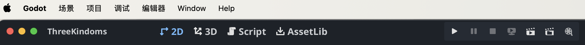
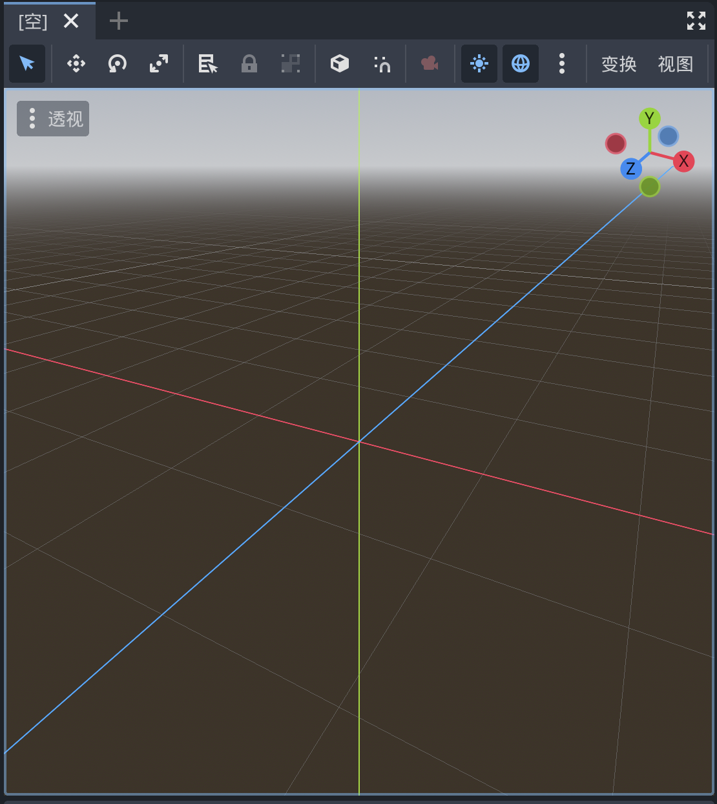
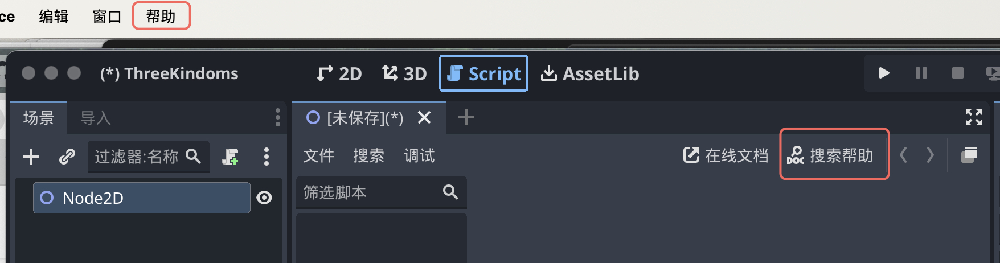

# 背景

因为Unity不稳定的商业策略，许多游戏转向开源游戏引擎Godot（戈多）。Godot给广大开发者提供一种反垄断的，能够去跟Unity、其他收费游戏引擎议价的选择空间。

<iframe src="//player.bilibili.com/player.html?isOutside=true&aid=1556446603&bvid=BV151421t7yw&cid=1648154624&p=1" scrolling="no" border="0" frameborder="no" framespacing="0" allowfullscreen="true"></iframe>

# 资料

Godot视频教程（Unity教程大神Brackeys➡️回归但是Godot）

Brackeys主页：https://www.youtube.com/@Brackeys

其他up主：[玩物不丧志的老李](https://space.bilibili.com/8618918)

Godot官网：https://godotengine.org/

Godot官方中文文档：https://docs.godotengine.org/zh-cn/4.x/

Godot官方英文文档：https://docs.godotengine.org/en/stable/

# 特点

对于没有经验的开发者，使用Godot游戏引擎+GD脚本来入门，是现阶段最好的学习途径。

唯一值得考虑的缺点是，作为开源免费的游戏引擎，Godot在商业化方面做的不好，在资源和工具上提供的就比较少。对于很多不会写代码或者没有制作素材能力的开发者，如果使用Unity、Unreal，我直接就做一个插件战士，直接在资产库（asset store）里买买买，攒一个游戏就完事了。但在Godot，甚至在可预见的未来，都达不到Unity那样资产商店的规模。

其他参考资料：

[1] [Godot vs. Unity](https://blog.csdn.net/lengyoumo/article/details/132112450)

# 官方教程

## 关于

### 前言

本文档分为几个部分：

- **关于** 包含了此简介以及有关引擎，历史，许可，作者等的信息。它还包含 [常见问题](https://docs.godotengine.org/zh-cn/4.x/about/faq.html#doc-faq)。
- **入门** 包含了有关使用引擎制作游戏的所有必要信息。它从 [渐进式](https://docs.godotengine.org/zh-cn/4.x/getting_started/step_by_step/index.html#toc-learn-step-by-step) 教程开始，这应该是所有新用户的切入点。**如果你是新手，这是最好的起点！**
- **手册** 可根据需要以任何顺序阅读或参考。它包含特定功能的教程和文档。
- **贡献** 提供了向Godot贡献相关的信息 ，无论是核心引擎、文档、 demo 还是其他部分。 它描述了如何报告 bug ，如何组织贡献者工作流等。 它还包含面向高级用户和贡献者的部分， 提供有关编译引擎的信息，为编辑器做出贡献， 或开发C++模块。
- **社区** 致力于 Godot 社区的生态。它指向各种社区渠道，如 [Godot 贡献者聊天](https://chat.godotengine.org/) 和 [Discord](https://discord.gg/4JBkykG)，并包含本文档之外推荐的第三方教程和资料。
- 最后，**类参考**记录的是完整的 Godot API，另外也可以直接在引擎的脚本编辑器中查看。你可以在这里找到关于所有类、函数、信号等相关的信息。

除本文档外，你可能还会对各种 [Godot 示例项目](https://github.com/godotengine/godot-demo-projects)感兴趣。

### 特性列表

1. 平台：Godot 的目标是尽可能地独立于平台，并且可以相对轻松地 [移植到新平台](https://docs.godotengine.org/zh-cn/4.x/contributing/development/core_and_modules/custom_platform_ports.html#doc-custom-platform-ports) 。

2. 编辑器：

   - 场景树编辑器。
   - 内置脚本编辑器。
   - 支持 Visual Studio Code、VIM 等[外部文本编辑器](https://docs.godotengine.org/zh-cn/4.x/tutorials/editor/external_editor.html#doc-external-editor)。
   - GDScript [调试器](https://docs.godotengine.org/zh-cn/4.x/tutorials/scripting/debug/debugger_panel.html#doc-debugger-panel)。
   - 可视化（性能）分析器能指出在渲染管线中 CPU 与 GPU 在每个步骤花费的时间。
   - 性能监视工具，包括[自定义性能监视器](https://docs.godotengine.org/zh-cn/4.x/tutorials/scripting/debug/custom_performance_monitors.html#doc-custom-performance-monitors)。

   等等

3. 渲染：

   桌面平台默认Forward+，移动平台默认Forward Mobile，Web平台默认Compatibility。

4. 2D 图形

5. 2D 工具

6. 2D 物理

7. 3D 图形

8. 3D 工具

9. 3D 物理

10. 着色器（Shaders）

11. 编写脚本（Scripting）

    - General
    - GDScript
    - C#
    - GDExtension（C、C++、Rust、D……）

12. 音频

13. 导入（import）

14. 输入（input）

15. 导航

16. 网络

17. 国际化

18. 窗口 和 操作系统整合

19. 移动端

20. XR支持（AR和VR）

21. GUI系统

22. 动画

23. 文件格式

24. 杂项

### 系统需求

Godot编辑器的推荐配置，最低配置。导出Godot项目的推荐配置，最低配置。

**编辑器：**

- Windows、macOS、Linux、*BSD、Android（实验性）、[网页版](https://editor.godotengine.org/)（实验性）

**导出游戏：**

- Windows、macOS、Linux、*BSD、Android、iOS、Web

### 常见问题

Q：Godot 支持哪些编程语言？

A：Godot 官方支持的语言是 GDScript、C# 和 C++。如果你刚开始接触 Godot 或一般的游戏开发，推荐学习并使用 GDScript 语言，它是 Godot 的原生语言。虽从长远来看，脚本语言的性能往往不如低级语言，但对于原型设计、开发最小可行产品（Minimum Viable Products）以及关注上市时间（Time-To-Market）而言，GDScript 可提供一种快速、友好、能力强的游戏开发方式。

对于新语言，可以通过第三方使用 GDExtension 获得支持。

Q：GDScript是什么？ 为什么要使用这门语言？

A：GDScript 是 Godot 所集成的一门是从零开始构建的脚本语言，其目的就是用最少的代码将 Godot 的潜力最大化地发挥出来，让新手和专业开发人员都能尽可能快地利用 Godot 的优势进行开发。如果你曾经用类似 Python 这样的语言写过任何东西，那么你就会对 GDScript 感到得心应手。想了解关于 GDScript 的示例以及完整的功能介绍，请参阅 [GDScript 脚本指南](https://docs.godotengine.org/zh-cn/4.x/tutorials/scripting/gdscript/gdscript_basics.html#doc-gdscript)。

使用 GDScript 有不少原因，特别是你在进行原型设计时、在项目的 alpha/beta 阶段、或者项目不是 3A 大作时会用到它，但 GDScript 最突出的优势就是整体**复杂度得到降低**。

Q：为什么 Godot 使用 Vulkan/OpenGL 而不是 Direct3D ？

A：Godot 致力于实现跨平台兼容性和开放式标准。OpenGL 和 Vulkan 是几乎在所有平台上都开放且可用的技术。得益于这一设计，在 Windows 上使用 Godot 开发的项目也能在 Linux、macOS 等平台上开箱即用。

虽然我们主要专注于 Vulkan 和 OpenGL，因为它们具有开放标准和跨平台的优势，但 Godot 4.3 引入了对 Direct3D 12 的实验性支持。此举旨在提升在 Direct3D 12 广泛使用的平台（如 Windows 和 Xbox）上的性能和兼容性。然而，Vulkan 和 OpenGL 将继续作为所有平台（包括 Windows）上的默认渲染后端。

Q：是否能用 Godot 创建非游戏应用？

A：是的！Godot 具有广泛的内置 UI 系统，其较小的软件包可以使它成为 Electron 或 Qt 等框架的合适替代品。

当创建一个非游戏的应用程序时，确保在项目设置中启用 [低处理器模式](https://docs.godotengine.org/zh-cn/4.x/classes/class_projectsettings.html#class-projectsettings-property-application-run-low-processor-mode) 以减少CPU和GPU占用。

### 遵守许可证

对于MIT许可证，唯一的要求是将许可证文本包含在你的游戏或衍生项目中。

### 发布策略

Godot 的发布政策是在不断改进的。以下内容提供了大致的预期结果，但实际会发生什么取决于核心贡献者的选择，以及社区在特定时期的需求。

Godot版本：Godot 松散地遵循了[语义化版本](https://semver.org/)，采用了 `major.minor.patch` 的版本系统

> 如果你必须学习为 Godot 3.x 设计的教程，我们建议在单独的选项卡中保持 [从 Godot 3 升级到 Godot 4](https://docs.godotengine.org/zh-cn/4.x/tutorials/migrating/upgrading_to_godot_4.html#doc-upgrading-to-godot-4) 打开，以检查哪些方法已被重命名（如果你在尝试使用特定节点或在 Godot 4.x 中被重命名的方法时遇到了脚本错误的话）。

## 入门

### 前言

#### 1. Godot简介

是什么：

Godot 是一个通用的 2D 和 3D 游戏引擎，旨在支持各种项目。你可以用它来创建游戏或应用程序，然后在桌面、手机以及 Web 平台上发布。

界面：

Godot 配备了成熟的游戏编辑器，其集成工具可以满足最常见的需求。它包括代码编辑器、动画编辑器、图块地图编辑器、着色器编辑器、调试器、性能分析器等等。

编程语言：

你可以使用 [GDScript](https://docs.godotengine.org/zh-cn/4.x/tutorials/scripting/gdscript/index.html#toc-learn-scripting-gdscript) 编写游戏，它是一门专属于 Godot、紧密集成、语法轻量的语言；也可以使用 [C#](https://docs.godotengine.org/zh-cn/4.x/tutorials/scripting/c_sharp/index.html#toc-learn-scripting-c)，在游戏产业中十分流行。这两者是我们所支持的主要脚本语言。通过 GDExtension 技术，你也可以用 C 或 C++ 编写游戏玩法相关或高性能算法，而无需重新编译引擎。你可以使用这项技术在引擎中集成第三方库和其他软件开发工具包（SDK）。

#### 2. GDScript编程

为了学习GDScript，你可以使用应用程序 [Learn GDScript From Zero](https://gdquest.github.io/learn-gdscript/?ref=godot-docs)。

#### 3. Godot 关键概念

每个游戏引擎都围绕着你用来构建应用程序的抽象概念。在Godot中，游戏是一个**节点树**，你将这些节点组合成**场景**。然后，你可以将这些**节点**连接起来，使它们能够通过**信号**进行通信。

1. **场景（Scenes）**

   在 Godot 中，你把你的游戏分解成可重复使用的场景。场景可以是一个角色、一件武器、用户界面中的一个菜单、一座房子、整个关卡，或者任何你能想到的东西。Godot 的场景很灵活，既能够充当预制件（Prefab），又能够用作其他游戏引擎中的场景。

2. **节点（Nodes）**

   场景由若干**节点**组成。节点是你的游戏最小的构件，你将其排列成树状。下面是一个人物节点的例子。

   > 注意节点和场景在编辑器中看起来是一样的。当你把一棵节点树保存为场景时，它就显示为一个单一的节点，其内部结构在编辑器中是隐藏的。

   Godot 提供了丰富的基础节点类型库，你可以通过组合和扩展来建立更强大的节点。无论是 2D、3D 还是用户界面，你都可以用这些节点完成大多数事情。

3. **场景树（The scene tree）**

   游戏的所有场景都汇集在**场景树**中，字面意思是一棵场景树。由于场景是节点树，因此场景树也是节点树。但是，从场景的角度来考虑你的游戏更容易，因为它们可以代表角色、武器、门或你的用户界面。

4. **信号（Signals）**

   节点在发生某些事件时发出信号。此功能无需在代码中硬连接它们就能让节点相互通信。它为你提供了构建场景的灵活性。

   > 编程概念：信号是 Godot 版的 观察者 模式（observer pattern）。

   例如，按钮在按下时会发出信号。你可以连接到此信号以运行代码以响应此事件，例如启动游戏或打开菜单。

   其他内置信号可以告诉你两个对象何时碰撞，角色或怪物何时进入给定区域等等。你还可以针对游戏量身定制新的信号。

**总结**

节点、场景、场景树和信号是 Godot 中的四个核心概念，你将一直操纵它们。

节点是游戏最小的构建块。你把它们组合起来创建场景，再把它们组合起来并嵌套到场景树中。最后，你可以使用信号来使节点对其他节点或不同的场景树分支中的事件做出响应。

#### 4. 初识Godot编辑器

本页将向你简要介绍 Godot 的界面（interface）。我们将看看不同的主屏幕（main screens）和面板（docks），以帮助你确定自己的位置。

##### 4.1 项目管理器

启动 Godot 后，你会首先看到项目管理器窗口。你可以进行对已有项目进行管理、导入或者创建新项目等操作。

在窗口顶部，有另一个名为“资源库”的页签。当你第一次进入该页签时，会有一个“online”按钮。出于隐私原因，Godot项目管理器默认不会访问网络。若要更改此设置，请点击“online”按钮。

##### 4.2 编辑器界面

打开新建项目或者已有项目，就会出现编辑器界面。我们来看看它的主要区域。

窗口顶部默认分布着：

- 左：主菜单（main menu）
- 中：工作区（workspace），当前活动的工作区会被高亮显示
- 右：游玩测试按钮（playtest）

> 注：macOS里菜单栏在屏幕上方，不在编辑器窗口内。

在工作区按钮下方，可以看到以标签形式打开的场景。紧挨着标签的加号（+）按钮可以向项目中添加新场景。最右侧的全屏按钮可以切换专注模式，最大化视口（viewport）的大小。

在中央，场景选择器下方是视口（viewport），上方有工具栏，您可以在这里找到不同的工具来移动、缩放或锁定场景的节点。

视口两边停靠着面板，底部也有一个面板。

1. 左侧面板 

   1. 文件系统：会列出项目中的文件，包括脚本、图片、音频等。
   2. 场景：会列出活动场景中的节点。

2. 右侧面板

   1. 检查器：可以编辑所选节点的属性。

3. 底部面板

   底部面板包含了调试控制台、动画编辑器、混音器等。它们所占的空间非常宝贵，所以默认都是折叠状态。点击某一个就会在垂直方向展开。

   1. 

##### 4.3 主屏幕

编辑器顶部的中央有四个主屏幕按钮：2D、3D、Script、AssetLib。

- **2D 屏幕**可以用于任何类型的游戏。除了 2D 游戏，2D 屏幕也会用于界面的构建。
- 在**3D 屏幕**中，你可以操作网格、灯光、设计 3D 游戏的关卡。
- **Script 屏幕**是一个完整的代码编辑器，包含调试器、丰富的自动补全、内置代码参考手册。
- **AssetLib** 是插件、脚本、资产的仓库，这些内容是自由开源的，可以在你的项目中使用。

##### 4.4 类参考手册

Godot 自带内置的类参考手册。

要搜索类、方法、属性、常量、信号相关的信息，可以使用以下任意方法：

- 在编辑器中的任何位置按下 F1（macOS 上则是 option  + Space）。
- 点击 Script 主屏幕右上角的“搜索帮助”按钮。
- 点击“Help”菜单的“搜索帮助”。
- 选中标识符，按 Ctrl + Click (Cmd + Click on macOS) 
- 手册的 [Class Reference](https://docs.godotengine.org/zh-cn/4.x/classes/index.html#doc-class-reference) 里在线浏览

#### 5. 学习新特性

**充分利用类参考手册**

1. 这个类在继承结构中的位置。你可以点击顶部的链接跳转到父类，查看某个类型所继承的属性和方法。

   

2. 这个类的角色与使用概要。

3. 这个类的属性、方法、信号、枚举、场景的解释。

4. 深入介绍这个类的手册页面的链接。

**与社区共同学习**

提出问题并找到已经回答的问题的最佳地点是官方的[问答](https://ask.godotengine.org/)网站。

善于提问并提供细节：

1. 描述你的目标
2. 请分享确切的报错信息
3. 分享代码示例
4. 分享你的“场景”面板的截图
5. 分享你的游戏录像
6. 如果你在使用非稳定版本的 Godot，请说明你正在使用的版本。

**社区教程**

#### 6. Godot的设计理念

**游戏引擎各不相同，以满足不同的需求。**它们不仅提供一系列功能，而且每个引擎的设计都是独一无二的。这将导致不同工作流程和项目组织结构。这一切都源于它们各自的设计理念。

##### 6.1 面向对象的设计与组合

Godot凭借其灵活的场景系统和节点层次结构, 将面向对象设计作为其核心. 它试图远离严格的编程模式, 以提供直观的方式来构建游戏.

首先，Godot 可以让你把场景**组合或聚合**起来。这和嵌套的预制件是类似的。其次，你可以从任何场景**继承**。

> 和其他几个 3D 引擎的 Prefab（预制体）不同，场景可以通过继承来扩展。你可以创建一个 Magician（魔术师）来扩展你的 Character（角色）。在编辑器中修改 Character 后 Magician 也会更新。这样的设计可以帮你保持项目结构与设计的一致性。

另外，请注意，Godot 提供了多种不同类型的对象，称为节点（nodes），每种节点都有特定的用途。节点是树的一部分，并且总是从其父节点继承属性，一直继承到 Node 类。尽管引擎确实包含一些节点，比如父物理体（a parent physics body）将使用的碰撞形状（collision shapes），但大多数节点之间是独立工作的。

> 换句话说，Godot的节点并不像其他一些游戏引擎中的组件那样工作。

举个例子，Sprite2D 既是一个 Node2D，也是 CanvasItem 和 Node。它具备这三个父类的所有属性和特性，例如变换、绘制自定义形状的能力以及使用自定义着色器进行渲染。

##### 6.2 完善的工具集

Godot 尝试提供自己的工具来满足大多数常见需求。它拥有专门的脚本工作区、动画编辑器、瓦片地图（tilemap）编辑器、着色器编辑器、调试器、性能分析器、以及在本地和远程设备上热重载的功能等。

请注意，3D 工作区不像 2D 工作区那样有那么多工具。Godot 提供了完整的 API，可以用来扩展编辑器的功能。参见 < 6.4 Godot 编辑器是 Godot 游戏 >。

##### 6.3 开源 & 社区驱动

##### 6.4 Godot 编辑器是 Godot 游戏

Godot 编辑器是使用游戏引擎运行的，使用的是引擎自己的 UI 系统。这意味着**相同的代码**既可以用来构建游戏中的场景，又可以用来**构建插件对编辑器进行扩展。** `@tool` 注释，您可以在编辑器中运行任何游戏代码。

##### 6.5 独立的2D和3D引擎

Godot 提供了专门的 2D 和 3D 渲染引擎。因此，**2D 场景的基础单位是像素。**尽管引擎是独立的，但你还是可以在 3D 中渲染 2D、在 2D 中渲染 3D，也可以在 3D 世界中覆盖 2D sprites（二维图像） 和界面。

> [!TIP]
>
> **“2D sprites”** 这一术语在游戏开发中有其特定的含义，主要用于描述在游戏中可交互的图像或动画元素。以下是使用“sprites”而不是“2D image”、“2D frame”或“2D picture”的几个原因：
>
> 1. **特定功能**：Sprites 通常指的是那些可以在游戏中动态渲染、移动和交互的对象，具有特定的行为和属性，而不仅仅是静态图像。
> 2. **动画支持**：Sprites 常常由一系列图像帧组成，用于创建动画效果。虽然“2D image”或“2D picture”可以指静态图像，但它们不能充分表达动态和交互的特性。
> 3. **行业标准**：在游戏开发的行业中，“sprite”成为了一个标准术语，开发者和设计师都习惯使用这个词。使用行业内的术语能够更好地沟通和理解。
> 4. **上下文关联**：Sprites 还常常与其他游戏开发概念（如碰撞检测、层级关系等）相关联，使用“sprites”能更好地与这些概念相结合。

### 渐进式教程

本系列建立在 Godot 简介的基础上，将帮助你开始使用编辑器和引擎。你将了解有关节点和场景的更多信息，使用 GDScript 编写你的第一个类，使用信号使节点相互通信等等。

#### 1. 节点与场景

在 [Godot 关键概念概述](https://docs.godotengine.org/zh-cn/4.x/getting_started/introduction/key_concepts_overview.html#doc-key-concepts-overview) 中，我们看到 Godot 游戏就是由场景构成的树状结构，而每一个场景又是一个由节点构成的树状结构。在这一节中，我们将更详细地解释这些概念，你还将创建你的第一个场景。

##### 1.1 节点

**节点是你的游戏的基本构件**。它们就像食谱里的食材。Godot 引擎包含很多种节点，可以用来显示图像、播放声音、表示摄像机等等。

所有节点都具备以下特性：

- 名称。
- 可编辑的属性。
- 每帧都可以接收回调以进行更新。
- 你可以使用新的属性和函数来进行扩展。
- 你可以将它们添加为其他节点的子节点。

最后一个特征很重要。**节点会组成一棵树**，这个功能组织起项目来非常强大。因为不同的节点有不同的功能，将它们组合起来可以产生更复杂的行为。

正如我们之前看到的，你可以用一个 [CharacterBody2D](https://docs.godotengine.org/zh-cn/4.x/classes/class_characterbody2d.html#class-characterbody2d) 节点、一个 [Sprite2D](https://docs.godotengine.org/zh-cn/4.x/classes/class_sprite2d.html#class-sprite2d) 节点、一个 [Camera2D](https://docs.godotengine.org/zh-cn/4.x/classes/class_camera2d.html#class-camera2d) 节点以及一个 [CollisionShape2D](https://docs.godotengine.org/zh-cn/4.x/classes/class_collisionshape2d.html#class-collisionshape2d) 节点来建立一个摄像机跟随的可玩角色。

##### 1.2 场景

当你在树中组织节点时，就像我们的角色一样，我们称之为场景构造。保存后，场景的工作方式类似于编辑器中的新节点类型，你可以在其中将它们添加为现有节点的子节点。在这种情况下，场景实例显示为隐藏其内部结构的单个节点。

> 场景可以视作我们用 基础节点 构造出的 新节点类型。

场景允许你以你想要的方式来构造你的游戏代码。你可以**组合节点**来创建自定义和复杂的节点类型，比如能跑能跳的游戏角色、生命条、可以互动的箱子等等。

> [!TIP]
>
> 本质上，Godot 编辑器就是一个 **场景编辑器**。它有很多用于编辑 2D 和 3D 场景以及用户界面的工具。Godot 项目中可以包含任意数量你所需要的场景。引擎只要求将其中之一设为程序的**主场景**。这是你或者玩家运行游戏时，Godot 最初加载的场景。

除了像节点一样工作之外，场景还具有以下特点：

1. 它们始终有一个根节点，就像我们示例中的“Player”一样。
2. 你可以把它们保存到你的硬盘上，以后再加载。
3. 你可以根据需要创建任意数量的场景实例。你的游戏中可以有五个或十个角色，这些角色是从角色场景中创建的。

**1.3 创建第一个场景**

**1.4 修改节点的属性**

**1.5 运行场景**

**1.6 设置主场景**

#### 2. 创建实例

上一部分中，我们了解到场景是一系列组织成树状结构的节点，其中只有一个节点是根节点。你可以将项目拆分成任意数量的场景。这一特性可以帮你将游戏拆解成不同的组件，并进行组织。

你可以创建任意数量的场景并将他们保存成扩展名为 `.tscn` （“text scene” 文本场景）的文件。上节课的 `label.tscn` 文件就是一个例子。我们把这些文件叫作“打包的场景”（Packed Scene），因为它们将场景的内容信息进行了打包。

保存场景过后，这个场景就可以作为蓝图使用：你可以在其他场景中进行任意次数的重用。像这样从模板中复制对象被称为**实例化**。

我们在上一部分提到过，实例化场景的行为与节点类似：编辑器默认会隐藏其中的内容。实例化 Ball 之后，你只会看到 Ball 节点。请注意制作出的副本，名字是唯一的。

Ball 场景的实例最开始都和 `ball.tscn` 有相同的结构和属性。不过你也可以单独修改各个实例，比如修改反弹的方式、重量等源场景所暴露的属性。

**作为设计语言的场景实例**

我们建议在使用 Godot 制作游戏时忽略架构代码模式，例如模型-视图-控制器 （MVC） 或实体关系图。相反，你可以从想象玩家将在游戏中看到的元素开始，并围绕它们构建代码。

例如，你可以这样拆解一个射击游戏：

对于几乎任何类型的游戏，都可以想出这样的图表。矩形表示的是从玩家角度可以在游戏中看到的实体，箭头表示的是场景之间的从属关系。

#### 3. 脚本语言

#### 4. 创建第一个脚本

#### 5. 监听玩家的输入

#### 6. 使用信号

### 你的第一个2D游戏

## 手册

## 贡献

## 社区

## 类参考

# 视频教程

