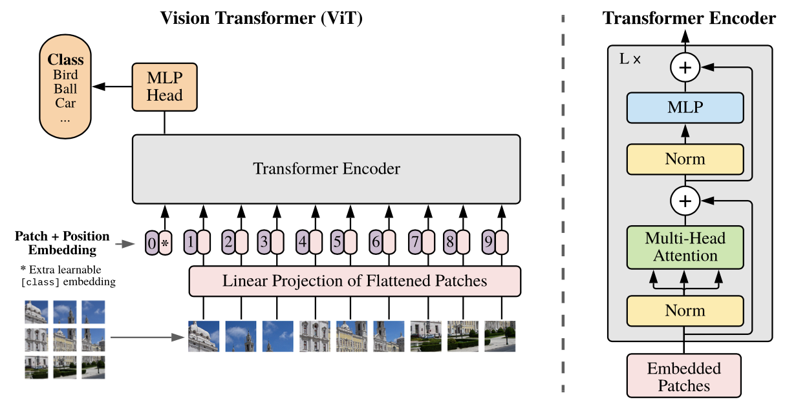

## 带注解的Transformer

[TOC]

**by** **harvardnlp**

#### 前言

“Attention is All You Need”论文本身写得很清晰，但是传统的观点认为，正确实现它相当困难。所以这里一行行讲解、实现一个PyTorch版的Transformer。

#### ViT逐行解读

[参考文献](https://blog.csdn.net/qq_42418728/article/details/120365972?spm=1001.2014.3001.5502)

自注意力

https://blog.csdn.net/qq_42418728/article/details/121723479

#### 关于落地

从落地的角度来看，transformer路还长着呢，对于Resnet的NPU级别的支持已经很成熟了，transformer中的self-attention操作涉及大量的向量乘法，要知道NPU底层硬件基本上都是针对矩阵乘法优化的，对于向量乘法效率非常低，甚至无法兼容（算子层面的硬件支持）。未来对于transformer的研究无外乎把CNN的那一套流程全部都走一遍，task创新、小型化、训练手段、数据增广等等。
