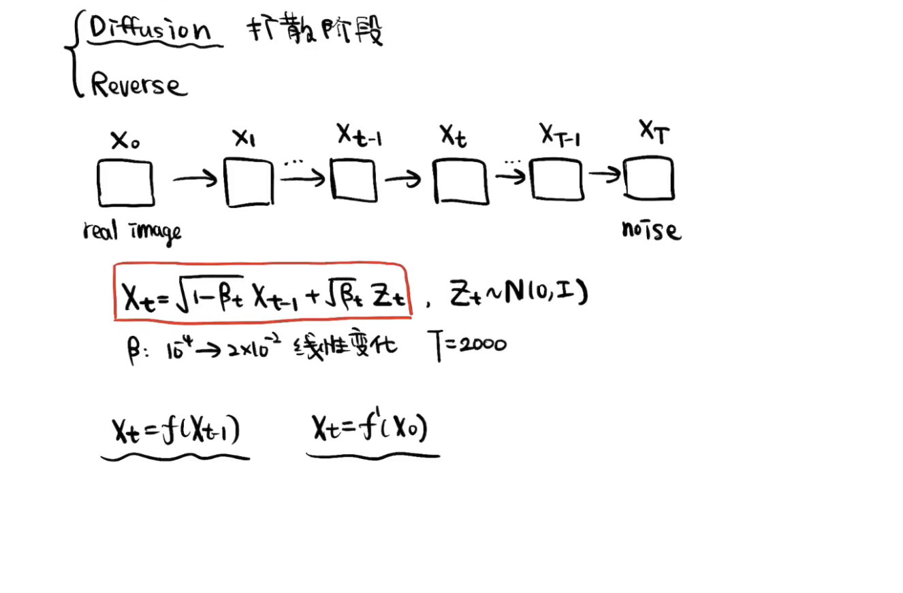
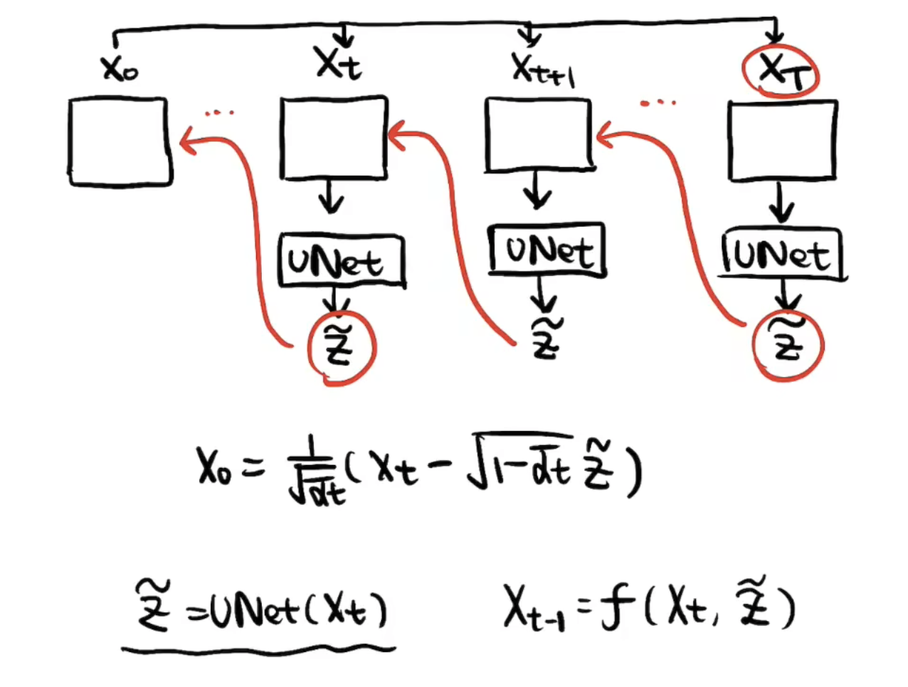
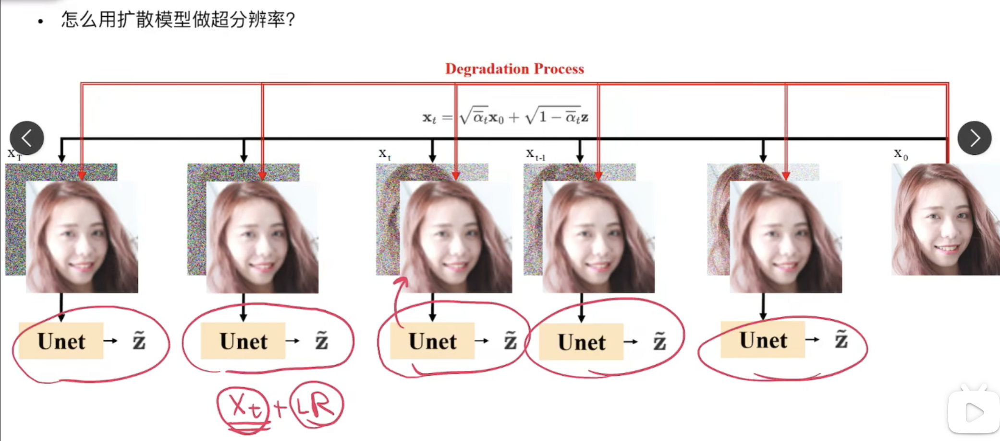
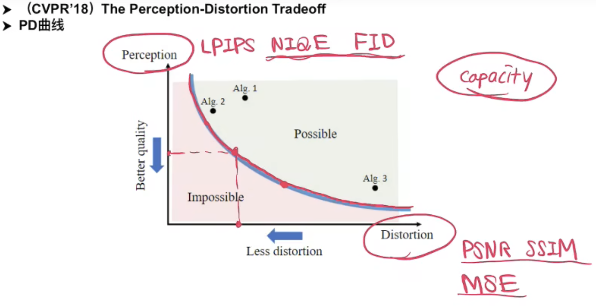
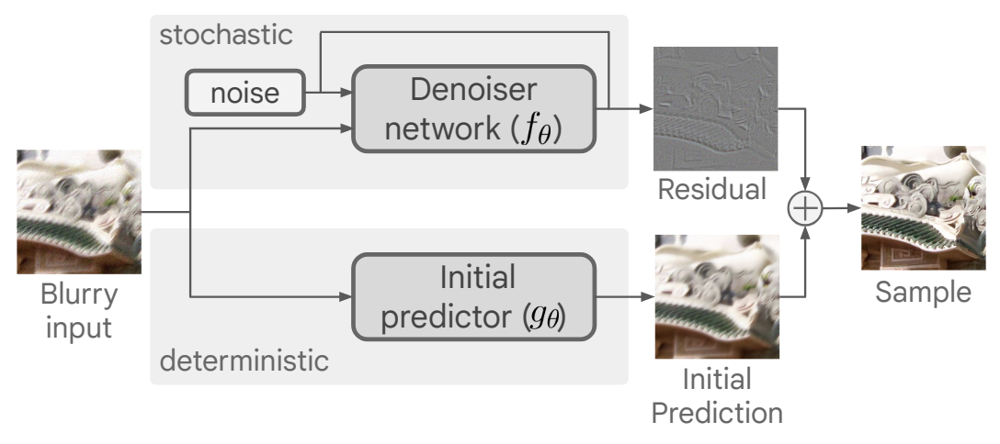
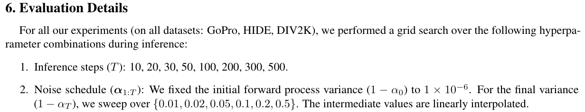
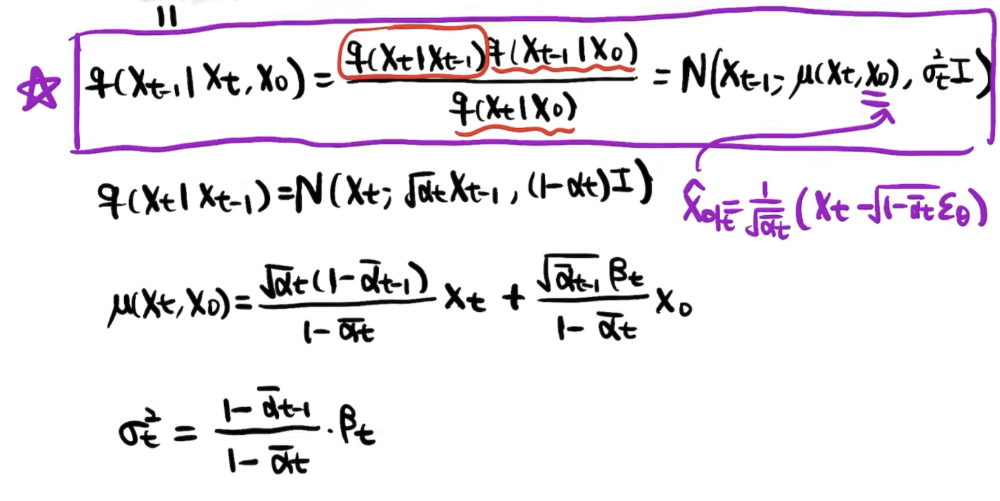

### DDPM介绍

（余济闻师弟  研究领域AIGC-related Applications & Generation Models）

#### 1-0 前置知识

1. Markov：当前位置的概率只会受前一时刻概率影响

2. 正态分布（高斯分布）叠加性 

   $E(N1+N2) = \mu_1 + \mu_2$​

   $Var(N1+N2) = \sigma^2_1 + \sigma^2_2$

3. 贝叶斯

   $P(A|B) = \frac{P(B|A)P(A)}{P(B)}$​

   给定条件C下的贝叶斯

   $P(A|B,C)=\frac{P(B|A,C)P(A|C)}{P(B|C)}$

#### 1-1 概述

扩散模型相比GAN的优势是：训练难度（调参）、训练的稳定性、损失函数的简易程度（损失的指向性、可观测性）等方面。

#### 1-2 扩散阶段



首先，$X_{t-1}$到$X_t$​的加噪公式是：

<font color="brown">$X_t = \sqrt{1-\beta_t}X_{t-1} + \sqrt{\beta_t}Z_t,$</font>    $$Z_t \sim N(0,I)$$

- 可想而知，$\beta$是逐渐变大的，因为干净图像加一点噪声就有明显变化，但后期已经被比较大的噪声扰动的图像必须加很大的噪声才能有明显变化。
- T也要足够大，才能得到完全的噪声图。

构造$X_t=f^\prime (X_0)$，希望一步加噪声，从干净图像得到$X_t$​，推导：


通过公式代入，推导一次$X_t$和$X_{t-2}$的关系，可以找到规律得到$X_t=f^\prime (X_0)$：

**<font color="blue">核心公式</font>** <font color="brown">$X_t = \sqrt{\bar{\alpha_t}} X_0 + \sqrt{1 - \bar{\alpha_t}}Z$,  $\bar{\alpha_t}=\prod_{i=1}^{t}\alpha_i$</font>

$X_t=f^\prime (X_0)$使得我们获取某一步的扩散数据变得非常方便。

> $X_T = \sqrt{\bar{\alpha_T}} X_0 + \sqrt{1 - \bar{\alpha_T}}Z$，而$X_T \approx Z$​ 是完全的噪声图。所以，实际上我们 $\beta_t$ 的设计和 $T$ 的选择需要保证$\bar{\alpha_T} \approx 0$。

逆过程再通过神经网络将噪声 $Z$ 估计出来，进行**去噪**：

$X_0 = \frac{X_t - \sqrt{1 - \bar{\alpha_t}}\tilde{Z}}{\sqrt{\bar{\alpha_t}}}$

但实际推理时，真实的reverse过程没法这么做，因为从完全的噪声图直接得到$X_0$​是困难的，步数过少的reverse也是比较模糊的。

> 重建的过程是一步一步推的，效果比较好。

#### 1-3 重建阶段（上）

前面知道，重建的公式是：$X_0 = \frac{1}{\sqrt{\bar{\alpha_t}}}({X_t - \sqrt{1 - \bar{\alpha_t}}\tilde{Z}})$​

能估计噪声 $\tilde{Z}$ 的神经网络UNet是如下的训练流程：


但是一步到位的重建的效果会差、很模糊。我们需要得到一步一步重建的公式：



#### 1-4 重建阶段（下）

上面提到我们训练了一个UNet可以将加的噪声采样估计出来。写得再准确一点呢，这个UNet的输入还有t，因为不同的$X_t$，它的噪声强度是不一样的。所以实际上是一个<font color="brown">条件去噪过程</font>。

$\tilde{Z} = UNet(X_t, t)$

虽然两个变量可以逆变换，

$X_{t-1} = \frac{1}{\sqrt{\alpha_t}}(X_t - \sqrt{1-\alpha_t}Z_{t-1→t})$ 

但可能因为这里的$Z_{t-1→t}$是$X_{t-1}$到$X_t$加的噪声，而我们训练时都是$X_0$到$X_t$直接加噪（更方便训练收敛）。UNet预测的是$\tilde{Z}_{0→t}$而不是$\tilde{Z}_{t-1→t}$，所以<font color="brown">reverse过程没法简单的进行公式逆变换。而是要推导构造出$\tilde{Z}_{0→t}$。</font>

已知

$q(X_t|X_{t-1}) \sim N(\sqrt{\alpha_t}X_{t-1}, (1-\alpha_t)I)$​​​

$q(X_{t-1}) \sim N(\sqrt{\bar{\alpha}_{t-1}}X_0, (1-\bar{\alpha}_{t-1})I)$

$q(X_t) \sim N(\sqrt{\bar{\alpha}_t}X_0, (1-\bar{\alpha}_t)I)$​

$N(\mu, \sigma^2) \propto exp(-\frac{1}{2}\frac{(x - \mu)^2}{\sigma^2})$

让我们推一下：

$q(X_{t-1}|X_t)=\frac{q(X_{t-1},X_t)}{q(X_t)}=\frac{q(X_t|X_{t-1})q(X_{t-1})}{q(X_t)}=\frac{q(X_t|X_{t-1},X_0)q(X_{t-1}|X_0)}{q(X_t|X_0)}=\frac{q(X_t|X_{t-1})q(X_{t-1}|X_0)}{q(X_t|X_0)}$

$\propto exp(-\frac{1}{2}(\frac{(X_t-\sqrt{\alpha_t}X_{t-1})^2}{1-\alpha_t} + \frac{(X_{t-1}-\sqrt{\bar{\alpha}_{t-1}}X_0)^2}{1-\bar{\alpha}_{t-1}} - \frac{(X_t-\sqrt{\bar{\alpha}_t}X_0)^2}{1-\bar{\alpha}_t}))$​

我们最希望构造出$exp(-\frac{1}{2}\frac{(x - \mu)^2}{\sigma^2})$，其中$x$是这里的$x_{t-1}$

$\propto exp(-\frac{1}{2}((\frac{\alpha_t}{\beta_t}+\frac{1}{1-\bar{\alpha}_{t-1}})x^2_{t-1} - 2(\frac{\sqrt{\alpha_t}x_t}{\beta_t}+\frac{\sqrt{\bar{\alpha}_{t-1}}x_0}{1-\bar{\alpha}_{t-1}}) x_{t-1} + C))$

$\propto exp(-\frac{1}{2}(Ax^2_{t-1} +Bx_{t-1} + C))$​

$\propto exp(-\frac{1}{2}(A(x_{t-1} +\frac{B}{2A})^2 + C'))$

$\therefore \mu=-\frac{B}{2A}, \sigma^2=\frac{1}{A}$

其中$A=\frac{\alpha_t}{\beta_t}+\frac{1}{1-\bar{\alpha}_{t-1}}， B=- 2(\frac{\sqrt{\alpha_t}x_t}{\beta_t}+\frac{\sqrt{\bar{\alpha}_{t-1}}x_0}{1-\bar{\alpha}_{t-1}})$​

<font color="brown">$\sigma^2 = \frac{1}{A} = 1/(\frac{\alpha_t-\alpha_t\bar{\alpha}_{t-1}+\beta_t}{\beta_t(1-\bar{\alpha}_{t-1})}) = \frac{\beta_t(1-\bar{\alpha}_{t-1})}{1-\bar{\alpha}_t}$​</font>

> 我们可以发现<font color="blue">方差</font>实际是由$\alpha_t$、$\beta_t$组合而来，所以方差是确定的

$\mu = -\frac{B}{2A} = -\frac{\beta_t(1-\bar{\alpha}_{t-1})}{2(1-\bar{\alpha}_t)} * - 2(\frac{\sqrt{\alpha_t}x_t}{\beta_t}+\frac{\sqrt{\bar{\alpha}_{t-1}}x_0}{1-\bar{\alpha}_{t-1}}) = \sqrt{\alpha_t}\frac{1-\bar{\alpha}_{t-1}}{1-\bar{\alpha}_t}x_t + \sqrt{\bar{\alpha}_{t-1}}\frac{\beta_t}{1-\bar{\alpha}_t}x_0$

由于$X_0$是未知的，我们继续代入$X_0 = \frac{X_t - \sqrt{1 - \bar{\alpha_t}}\tilde{Z}_{0→t}}{\sqrt{\bar{\alpha_t}}}$，只留下先验$X_t$，和UNet预测的是$\tilde{Z}_{0→t}$​：

> 前面是为了以示区分，我们后面就将$\tilde{Z}_{0→t}$简称$\tilde{Z}$

$\mu = \sqrt{\alpha_t}\frac{1-\bar{\alpha}_{t-1}}{1-\bar{\alpha}_t}X_t + \sqrt{\bar{\alpha}_{t-1}}\frac{\beta_t}{1-\bar{\alpha}_t}\frac{X_t - \sqrt{1 - \bar{\alpha_t}}\tilde{Z}}{\sqrt{\bar{\alpha_t}}}$​

$ = \sqrt{\alpha_t}\frac{1-\bar{\alpha}_{t-1}}{1-\bar{\alpha}_t}X_t + \frac{\beta_t}{(1-\bar{\alpha}_t)\sqrt{\alpha_t}}X_t - \frac{\beta_t}{\sqrt{\alpha_t} \sqrt{1-\bar{\alpha}_t}}\tilde{Z}$

$= \frac{\alpha_t -\alpha_t\bar{\alpha}_{t-1} +\beta_t}{(1-\bar{\alpha}_t)\sqrt{\alpha}_t}X_t - \frac{\beta_t}{\sqrt{\alpha_t} \sqrt{1-\bar{\alpha}_t}}\tilde{Z}$ 

$= \frac{1-\bar{\alpha}_t}{(1-\bar{\alpha}_t)\sqrt{\alpha}_t}X_t - \frac{\beta_t}{\sqrt{\alpha_t} \sqrt{1-\bar{\alpha}_t}}\tilde{Z}$

<font color="brown">$= \frac{1}{\sqrt{\alpha}_t}(X_t - \frac{\beta_t}{\sqrt{1-\bar{\alpha}_t}}\tilde{Z})$</font>

> 我们发现<font color="blue">均值</font>经过推导可以得到$X_t$和$\tilde{Z}$​的一个线性组合，一个比较简洁的形式。

总结一下，$q(X_{t-1}|X_t)$服从：

<font color="brown">$q(X_{t-1}|X_t) \sim N(\frac{1}{\sqrt{\alpha}_t}(X_t - \frac{\beta_t}{\sqrt{1-\bar{\alpha}_t}}\tilde{Z}), \frac{\beta_t(1-\bar{\alpha}_{t-1})}{1-\bar{\alpha}_t})$​</font>

即

<font color="brown">$X_{t-1} = \frac{1}{\sqrt{\alpha}_t}(X_t - \frac{\beta_t}{\sqrt{1-\bar{\alpha}_t}}\tilde{Z}) +  \sqrt{\frac{\beta_t(1-\bar{\alpha}_{t-1})}{1-\bar{\alpha}_t}}Z$</font>

> 1. 方差的部分实际上是从标准正态分布采样的
> 2. 最后$X_1$到$X_0$这步是不加后面一项噪声的。前面的$T-1$

$\tilde{Z} = UNet(X_t, t)$，$Z \sim N(0, I)$

> Tips：每一次$X_t$到$X_{t-1}$的去噪过程，还要再加一个新的噪声。这也是希望在它整个reverse过程中增加一些不确定性。实际上整个reverse过程也是想模拟一个分子热运动的布朗运动的过程：<font color="blue">每一步既有确定性的部分，也有随机的扰动</font>。

#### 1-5 整理总结

1.Diffusion（扩散阶段）

$X_t \sim N(\sqrt{\alpha_t} X_{t-1}, (1-\alpha_t)I)$​

$X_t \sim N(\sqrt{\bar{\alpha_t}} X_0, (1-\bar{\alpha}_t)I)$

$X_t = \sqrt{\alpha_t} X_{t-1} + \sqrt{1 - \alpha_t}Z_t$

$X_t = \sqrt{\bar{\alpha_t}} X_0 + \sqrt{1 - \bar{\alpha_t}}Z$​​

> $\alpha_t$都是我们预先设定好的数值，$Z_t$是我们从标准正态分布里采样的一个噪声。然后由于一步一步加噪不够高效，我们经过一番推导得到从$X_0$直接推任意$X_t$的退化公式。然后$X_t$本身也可以写成正态分布。

2.Reverse（重建阶段）

$X_{t-1} = f(X_t, UNet(X_t, t)) = f(X_t, \tilde{Z})$

$X_{t-1} = \frac{1}{\sqrt{\alpha}_t}(X_t - \frac{\beta_t}{\sqrt{1-\bar{\alpha}_t}}\tilde{Z}) +  \sqrt{\frac{\beta_t(1-\bar{\alpha}_{t-1})}{1-\bar{\alpha}_t}}Z$​

> - 推导过程的前置知识$X = \mu + \sigma Z \sim N(\mu, \sigma^2I)$​，也属于一种重参数技巧。
> - 先验 & 后验，已知 & 未知 & 估计。
> - $\mu = \sqrt{\alpha_t}\frac{1-\bar{\alpha}_{t-1}}{1-\bar{\alpha}_t}x_t + \sqrt{\bar{\alpha}_{t-1}}\frac{\beta_t}{1-\bar{\alpha}_t}x_0$​
>   - $t$越小，$\tilde{Z}_{0→t}$（对$x_0$​​的估计）是越来越准的。
>   - $x_t$和$x_0$加权，$x_t$的权重越来越小，$x_o$​的估计越来越准，其权重也越来越大。
>   - 可以把扩散过程理解为$x_T$，$\tilde{x}_{0@T}$，$\tilde{x}_{0@(T-1)}$，...，$\tilde{x}_{0@1}$的一个加权，只不过$x_T$​这个完全的噪声，它的权重非常小。


> 这里添加的扰动$\sigma_tZ$，$\sqrt{\frac{\beta_t(1-\bar{\alpha}_{t-1})}{1-\bar{\alpha}_t}}$只是适合采用的$\sigma_t$的上界，实际小一点，极端来说一直为 $0$​不扰动也是可以的。

以上的流程和公式已经比较详尽了，足以手撸DDPM的训练代码。

#### 1-6 代码实现

:warning: 注：只讲关键部分的代码实现，可以一定程度上减轻复现或者读懂代码的难度。

- 比较简单的玩具代码：https://github.com/abarankab/DDPM
- 比较实用的代码：https://github.com/Janspiry/Image-Super-Resolution-via-Iterative-Refinement

> 扩散模型实际的代码实现非常简单，进而会让人感叹为什么这样一个简单的设计能够达到这么好的生成效果。

为了复现DDPM，我们需要考虑哪些细节问题？

（1）alpha、beta这些预先定义好的参数怎么获得？

https://github.com/abarankab/DDPM/blob/main/ddpm/diffusion.py

```python
# 这个函数提供betas
def generate_linear_schedule(T, low, high):
    return np.linspace(low, high, T)
```

```python
# $alpha_t$
alphas = 1.0 - betas
# $\bar{\alpha}_t$
alphas_cumprod = np.cumprod(alphas) 
'''
partial（偏函数）：把一个函数的某些参数给固定住（也就是设置默认值），返回一个新的函数，调用这个新函数会更简单
'''
# 定义一个函数将任何的numpy array转换为pytorch tensor
to_torch = partial(torch.tensor, dtype=torch.float32)

# 接下来将各种公式里用到的各种alpha、beta相关的表达式保存起来
self.register_buffer("betas", to_torch(betas))
self.register_buffer("alphas", to_torch(alphas))
self.register_buffer("alphas_cumprod", to_torch(alphas_cumprod))

self.register_buffer("sqrt_alphas_cumprod", to_torch(np.sqrt(alphas_cumprod)))
self.register_buffer("sqrt_one_minus_alphas_cumprod", to_torch(np.sqrt(1 - alphas_cumprod)))
self.register_buffer("reciprocal_sqrt_alphas", to_torch(np.sqrt(1 / alphas)))

self.register_buffer("remove_noise_coeff", to_torch(betas / np.sqrt(1 - alphas_cumprod)))
self.register_buffer("sigma", to_torch(np.sqrt(betas)))
# 实际需要用的时候，用t对保存的向量进行索引就可以了
```

（2）训练过程？

```python
def get_losses(self, x, t, y):
        # 得到标准正态分布噪声Z
        noise = torch.randn_like(x)
				# 调用一步加噪的公式，得到X_t
        perturbed_x = self.perturb_x(x, t, noise)
        # 从X_t, t预测噪声
        estimated_noise = self.model(perturbed_x, t, y)

        if self.loss_type == "l1":
            loss = F.l1_loss(estimated_noise, noise)
        elif self.loss_type == "l2":
            loss = F.mse_loss(estimated_noise, noise)

        return loss

    def forward(self, x, y=None):
        # 输入一个batch的干净图x
        b, c, h, w = x.shape
        device = x.device
        # 得到这个batch的t
        t = torch.randint(0, self.num_timesteps, (b,), device=device)
        return self.get_losses(x, t, y)
# 经过训练得到一个条件去噪网络（这里是UNet）
```

> :thumbsup: 在这套代码展开的细节中，运用了很多python的实用的语法。

（3）推理过程？

```python
@torch.no_grad()
def remove_noise(self, x, t, y, use_ema=True):
    if use_ema:
        return (
            (x - extract(self.remove_noise_coeff, t, x.shape) * self.ema_model(x, t, y)) *
            extract(self.reciprocal_sqrt_alphas, t, x.shape)
        )
    else:
        return (
            (x - extract(self.remove_noise_coeff, t, x.shape) * self.model(x, t, y)) *
            extract(self.reciprocal_sqrt_alphas, t, x.shape)
        )

@torch.no_grad()
def sample(self, batch_size, device, y=None, use_ema=True):
    if y is not None and batch_size != len(y):
        raise ValueError("sample batch size different from length of given y")
		# X_T
    x = torch.randn(batch_size, self.img_channels, *self.img_size, device=device)
		# loop(X_t → X_{t-1})
    for t in range(self.num_timesteps - 1, -1, -1):
        t_batch = torch.tensor([t], device=device).repeat(batch_size)
        x = self.remove_noise(x, t_batch, y, use_ema)
        # 最后一步 X_1 → X_0 是不需要加扰动噪声的
        if t > 0:
            x += extract(self.sigma, t_batch, x.shape) * torch.randn_like(x)

    return x.cpu().detach()
```

> 前面提到扰动的噪声，实际比上界小一点也是可以的。$\frac{1-\bar{\alpha}_{t-1}}{1-\bar{\alpha}_t} \gt 1$，所以我们将$\sqrt{\frac{\beta_t(1-\bar{\alpha}_{t-1})}{1-\bar{\alpha}_t}}$可以简化为$\sqrt{\beta_t}$​使用，使得代码也更为简洁。

（4）UNet的结构？

https://github.com/abarankab/DDPM/blob/main/ddpm/unet.py

```python
# 一个非常典型的UNet结构
x = self.init_conv(x)

skips = [x]

for layer in self.downs:
    x = layer(x, time_emb, y)
    skips.append(x)

for layer in self.mid:
    x = layer(x, time_emb, y)

for layer in self.ups:
    if isinstance(layer, ResidualBlock):
        x = torch.cat([x, skips.pop()], dim=1)
    x = layer(x, time_emb, y)

x = self.activation(self.out_norm(x))
x = self.out_conv(x)
```

关键：`time_emb`是怎么得到的，是怎么作为条件输入的。

```python
# 1. 怎么得到的：
self.time_mlp = nn.Sequential(
            PositionalEmbedding(base_channels, time_emb_scale),
            nn.Linear(base_channels, time_emb_dim),
            nn.SiLU(),
            nn.Linear(time_emb_dim, time_emb_dim),
        ) if time_emb_dim is not None else None

time_emb = self.time_mlp(time)
# 2. 怎么作为条件的：
self.time_bias = nn.Linear(time_emb_dim, out_channels)
out += self.time_bias(self.activation(time_emb))[:, :, None, None]
# 很类似transformer里的位置编码，只不过又增加了点复杂度（activation和time_bias）
```

> x → norm/act/conv →  + time_emb → norm/act/conv + shortcut → attention → out  （这算是一种比较简单的调控，实际上你可以想到任何条件网络的控制方式都有可能能够用在这里）

### DDPM的应用

DDPM的流程图：


#### 2-1 SR3

Image Super-Resolution via Iterative Refinement（https://ar5iv.labs.arxiv.org/html/2104.07636）



相对DDPM的改动：

- 改动1：将LR作为condition，与噪声图concat之后送给UNet重建，即UNet现在是输入6通道，输出3通道
- 改动2：不再直接取$\bar{\alpha}_t$，而是取均匀分布$U[\bar{\alpha}_{t-1}, \bar{\alpha}_t]$
- 改动3：不再输入$t$给UNet，而是直接输入noise level，也就是改动2中均匀采样的值

> 个人解读：
>
> 1. UNet处似乎可以改为pixel-shuffle减少复杂度
> 2. 之前有文章认为与其隐晦地给一个 $t$，不如将噪声强度  $\bar{\alpha}_t$ 作为条件。
> 3. 改动2是为改动3作铺垫的，二者连用。从均匀分布 $U[\bar{\alpha}_{t-1}, \bar{\alpha}_t]$ 里取噪声强度，它更<font color="brown">连续</font>，也给后面我们为了推理加速设定新的 $T$​ 提供了支持。

改动2是为可以<font color="blue">任意改变采样的步数</font>铺路，不然UNet只见过离散的条件。

对于 `np.linspace(low, high, T)`，假设训练时 `low=1e-4, high=2e-2, T=2000`，推理时 我们可以设定 新的 $\beta_T$ 和 $T$，比如`low=1e-4, high=0.1, T=100`，只要最后满足$\bar{\alpha}_T \approx 0$。从`T=2000`到`T=100`推理速度快了20倍。

#### 2-2 deblur

Deblurring via Stochastic Refinement（https://openaccess.thecvf.com/content/CVPR2022/papers/Whang_Deblurring_via_Stochastic_Refinement_CVPR_2022_paper.pdf）

> Stochastic Refinement 就是指的扩散模型

提出问题：目前的图像去模糊问题主要是deterministic的方法，重建的视觉质量不好

提出解决方案：1. 提出一个新框架，基于条件扩散模型 2. 同时也提出一个有效的predict-and-refine的方法，并给出扩散模型在PD曲线上遍历的方法



> 以前的经验和分析得出，在模型能力（size）一定的情况下，它的Perception和Distortion的指标是有trade-off的。

- 改进1：predict and refine策略，实际上就是扩散模型的$x_0$​不再是原图，而是原图和predictor的残差。

  > 由于学残差相对容易，Denoiser（UNet）可以设计得更轻量。
  >
  > 这篇文章补充材料就提到initial predictor和denoiser结构是一样的，只是base channel不一样，前者是64，后者是32。参数量上前者约26M，后者约7M。

  

- 改进2：Sample averaging：由于每一次的采样具有随机性，所以可以多重建几次，然后取平均。这是一种比较简单的self-ensemble的方法。

- 改进3：Traversing the PD curve：采样的步数越多，则主观质量越好，反之则客观质量越好。

  

- 改进4：训练时使用小patch，测试时用整张图。很多low-level模型训练都是这么做。

#### 2-3 DDIM

Denoising Diffusion Implicit Models（https://ar5iv.labs.arxiv.org/html/2010.02502）

回顾DDPM（去噪扩散概率模型）：

> 在 DDPM 中，生成过程被定义为马尔可夫扩散过程的反向过程，在逆向采样过程的每一步，模型预测噪声。



DDIM（去噪扩散隐式模型）：

> DDIM 的作者发现，扩散过程并不是必须遵循马尔科夫链， 在之后的基于分数的扩散模型以及基于随机微分等式的理论都有相同的结论。 基于此，DDIM 的作者重新定义了扩散过程和逆过程，并提出了一种新的采样技巧， 可以大幅<font color="brown">减少采样</font>的步骤，极大的提高了图像生成的效率，代价是牺牲了一定的多样性， 图像质量略微下降，但在可接受的范围内。

DDIM用待定系数法推导：

回到$q(X_{t-1}|X_t,X_0)=\frac{q(X_t|X_{t-1},X_0)q(X_{t-1}|X_0)}{q(X_t|X_0)}$​

假设$q(X_{t-1}|X_t,X_0)$为任意满足上述等式的分布

待定系数

设：$q(X_{t-1}|X_t,X_0) \sim N(kX_0 + mX_t, \sigma^2I)$​,

$X_{t-1} = kX_0 + mX_t + \sigma Z_t, Z_t \sim N(0, I)$​

$\because X_t = \sqrt{\bar{\alpha}_t} X_0 + \sqrt{1 - \bar{\alpha}_t}Z$

（DDIM论文里的$\alpha_t$、$\beta_t$符号和DDPM里区别很大，我们还是调整一致）

$\therefore X_{t-1} = kX_0 + m(\sqrt{\bar{\alpha}_t} X_0 + \sqrt{1 - \bar{\alpha}_t}Z_t) + \sigma Z$

$= (k + m\sqrt{\bar{\alpha}_t})X_0 + m\sqrt{1 - \bar{\alpha}_t}Z_t + \sigma Z$​

$= (k + m\sqrt{\bar{\alpha}_t})X_0 + {Z}', {Z}' \sim N(0,m^2(1-\bar{\alpha}_t)+\sigma^2)$

$\because X_{t-1} = \sqrt{\bar{\alpha}_{t-1}} X_0 + \sqrt{1 - \bar{\alpha}_{t-1}}Z_{t-1}$

$\therefore k + m\sqrt{\bar{\alpha}_t} = \sqrt{\bar{\alpha}_{t-1}} $ 和 $m^2(1-\bar{\alpha}_t)+\sigma^2 = 1 - \bar{\alpha}_{t-1}$​

求得：$m = \frac{\sqrt{1 - \bar{\alpha}_{t-1} - \sigma^2}}{\sqrt{1 - \bar{\alpha}_t}}$ 和 $k = \sqrt{\bar{\alpha}_{t-1}} - \sqrt{1 - \bar{\alpha}_{t-1} - \sigma^2}\frac{\sqrt{\bar{\alpha}_t}}{\sqrt{1 - \bar{\alpha}_t}}$​

$\therefore q(X_{t-1}|X_t,X_0) \sim N((\sqrt{\bar{\alpha}_{t-1}} - \sqrt{1 - \bar{\alpha}_{t-1} - \sigma^2}\frac{\sqrt{\bar{\alpha}_t}}{\sqrt{1 - \bar{\alpha}_t}})X_0 + \frac{\sqrt{1 - \bar{\alpha}_{t-1} - \sigma^2}}{\sqrt{1 - \bar{\alpha}_t}}X_t, \sigma^2I)$$\sim N((\sqrt{\bar{\alpha}_{t-1}} - \sqrt{1 - \bar{\alpha}_{t-1} - \sigma^2}\frac{\sqrt{\bar{\alpha}_t}}{\sqrt{1 - \bar{\alpha}_t}})(\frac{X_t - \sqrt{1 - \bar{\alpha_t}}\tilde{Z}_\theta}{\sqrt{\bar{\alpha_t}}}) + \frac{\sqrt{1 - \bar{\alpha}_{t-1} - \sigma^2}}{\sqrt{1 - \bar{\alpha}_t}}X_t, \sigma^2I)$​

$\sim N(\sqrt{\bar{\alpha}_{t-1}}(\frac{X_t - \sqrt{1 - \bar{\alpha_t}}\tilde{Z}_\theta}{\sqrt{\bar{\alpha_t}}}) + \sqrt{1 - \bar{\alpha}_{t-1} - \sigma^2}\tilde{Z}_\theta, \sigma^2I)$​

<font color = "brown">$X_{t-1} = \sqrt{\bar{\alpha}_{t-1}}(\frac{X_t - \sqrt{1 - \bar{\alpha_t}}\tilde{Z}_\theta}{\sqrt{\bar{\alpha_t}}}) + \sqrt{1 - \bar{\alpha}_{t-1} - \sigma^2}\tilde{Z}_\theta + \sigma^2 Z$</font>

> DDIM仅用待定系数法假设满足$q(X_{t-1}|X_t,X_0)=\frac{q(X_t|X_{t-1},X_0)q(X_{t-1}|X_0)}{q(X_t|X_0)}$，没有任何其他强假设。推导过程中也没有用到$q(X_t|X_{t-1})$。
>
> DDIM 可以看做是 DDPM 的扩展， DDPM 是 DDIM 的一个特例

因为DDIM不是马尔可夫假设，所以不需要严格遵守$X_t \to  X_{t-1}$​​​

$s = t-1, z = t$

$\therefore X_s = \sqrt{\bar{\alpha}_s}(\frac{X_k - \sqrt{1 - \bar{\alpha_k}}\tilde{Z}_\theta}{\sqrt{\bar{\alpha_k}}}) + \sqrt{1 - \bar{\alpha}_s - \sigma^2}\tilde{Z}_\theta + \sigma^2 Z$

$s < k, k \le T, s和k不需要连续$

由于推导中$\sigma^2$全程没有用到，所以神奇的是$\sigma$取任何值，等式都成立。

### 其他优秀博客

[科学空间 生成扩散模型漫谈-系列](https://spaces.ac.cn/archives/9119)


