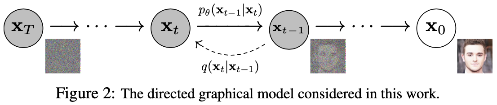
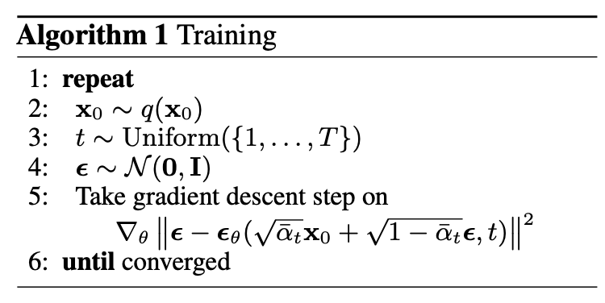
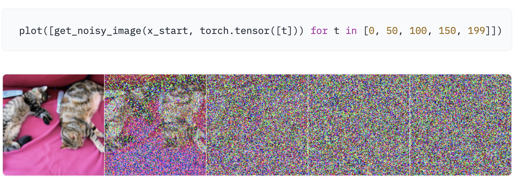
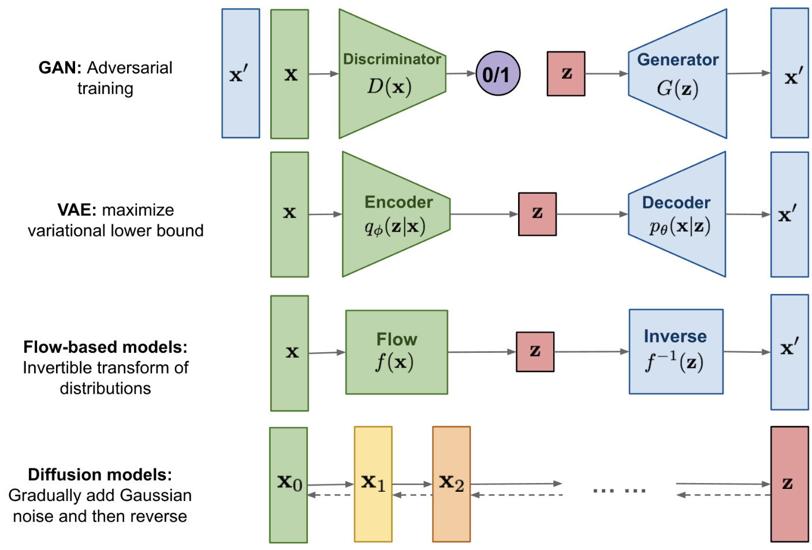
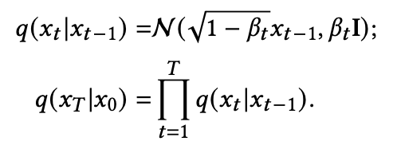
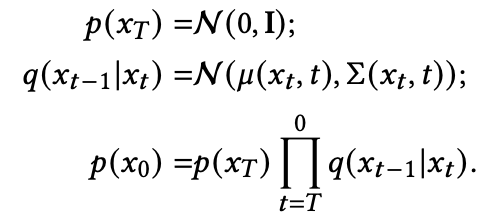

# DDPM

[The Annotated Diffusion Model](https://huggingface.co/blog/annotated-diffusion)

在这篇博文中，我们将更深入地研究去噪扩散概率模型（也称为 DDPM、扩散模型、基于分数的生成模型或简称为自编码器），因为研究人员已经能够使用它们进行高质量的条件(or 非条件)图像/音频/视频生成。 

我们将重温 (Ho et al., 2020) DDPM的原始论文，基于 Phil Wang 的[实现](https://github.com/lucidrains/denoising-diffusion-pytorch)在 PyTorch 中逐步实现它——(原论文为TensorFlow 实现)。 

> 请注意，生成建模的扩散思想实际上已经在 (Sohl-Dickstein et al., 2015) 中引入。 然而，直到 (Song et al., 2019)（斯坦福大学），和之后的(Ho et al., 2020)（谷歌大脑）才独立改进了该方法。

请注意，扩散模型有多种[视角](https://twitter.com/sedielem/status/1530894256168222722?s=20&t=mfv4afx1GcNQU5fZklpACw)解读。 在这里，我们采用离散时间（潜在变量模型）视角，但有必要理解其他视角。

好吧，让我们开始吧！


### 一.什么是扩散模型

如果将（去噪）扩散模型与其他生成模型（例如归一化流、GAN 或 VAE）进行比较，它并没有那么复杂：它们都将噪声从一些简单的分布转换为数据样本。 这也是神经网络学习从纯噪声开始逐渐对数据进行去噪的情况。

具体来说包括 2 个过程：

1. 我们选择的固定（或预定义）前向扩散过程 $q$，逐渐将高斯噪声添加到图像中，直到最终得到纯噪声。
2. 学习到的反向去噪扩散过程 $p_θ$，其中训练神经网络从纯噪声开始逐渐对图像进行去噪，直到最终得到实际图像。



由 $t$ 索引的前向和反向过程都发生在一定数量的有限时间步长 $T$内（DDPM 作者使用 $T=1000$）。 你从$t=0$开始，在那里你采样了一个真实的图像$\mathbf{x}_0$，来自您的数据分布（假设是来自 ImageNet 的***猫***图像），前向过程在每个时间步 $t$从高斯分布中采样一些噪声，这些噪声被添加到前一个时间步的图像中。 给定足够大的$T$和在每个时间步适宜地添加噪声，您最终会通过在$t=T$处得到所谓的各向同性高斯分布。

### 二.数学形式

因为需要损失函数来定义优化目标，所以我们以更公式化的方式解读扩散过程。

#### 1.前向扩散过程：$q(x_{t}∣x_{t−1})$

基本上，每个新（稍微嘈杂的）图像$\mathbf{x}_t$都是从具有 $\mathbf{\mu}_t = \sqrt{1 - \beta_t} \mathbf{x}_{t-1} $与$\sigma^2_t = \beta_t$ 的<font color="brown">条件高斯分布</font>中提取的。可以通过$\mathbf{x}_{t}=\sqrt{1−β_{t}}*\mathbf{x}_{t-1}+\sqrt{β_t}*ϵ$，其中$\mathbf{\epsilon} \sim \mathcal{N}(\mathbf{0}, \mathbf{I})$实现，两种形式是等价的。

> 这是添加的信号相关噪声。

请注意，$β_{t}$ 在每个时间步长 $t$ 都不是常数（因此也有下标）——事实上，它定义了一个所谓的<font color="brown">“方差表（variance schedule）”</font>，它可以是线性的、二次的、余弦的，等等，我们将进一步看到 （有点像学习率表）。

> 感觉和GDN（广义分歧归一化）有点像。

如果方差表设置得合适，$\mathbf{x}_T$可以是完全的高斯噪声。

> 如果我们知道条件分布$p(\mathbf{x}_{t-1}∣\mathbf{x}_{t})$，然后我们可以反向运行这个过程：通过采样一些随机的高斯$\mathbf{x}_T$，然后不断去噪，最终得到一个真实分布的样本$\mathbf{x}_0$。
>
> 然而，我们不知道 $p(\mathbf{x}_{t-1}∣\mathbf{x}_{t})$。这很棘手，因为它需要知道所有可能图像的分布才能计算这个条件概率。因此，我们将利用<font color="brown">神经网络</font>。

#### 2.反向扩散过程：$p_{\theta}(x_{t-1}∣x_{t})$

我们将利用神经网络来近似（学习）反向的条件概率分布，我们称之为 $p_\theta (\mathbf{x}_{t-1} | \mathbf{x}_t)$, 其中 $θ$ 是神经网络的参数，通过梯度下降更新。

如果我们假设这个逆向过程也是高斯分布，那么回想一下任何高斯分布都由 2 个参数定义：均值$\mu_\theta$和方差$\Sigma_\theta$

我们可以将该过程参数化为：

$p_\theta (\mathbf{x}_{t-1} | \mathbf{x}_t) = \mathcal{N}(\mathbf{x}_{t-1}; \mu_\theta(\mathbf{x}_{t},t), \Sigma_\theta (\mathbf{x}_{t},t)$，

其中均值和方差也以噪声水平 $t$为条件。

因此，我们的神经网络需要学习/表示均值和方差。 然而，DDPM 作者决定保持方差固定，让神经网络只学习（表示）均值 $\mu_\theta$。

> 后续有论文也学习方差$\Sigma_\theta$。

### 三.定义目标函数

（通过重参数化均值）

为了导出目标函数来学习反向过程的均值$\mu_\theta$，作者观察到 $q$ 和 $p_\theta$ 的组合可以看作是变分自动编码器 ([VAE](https://arxiv.org/abs/1312.6114))。 因此，<font color="brown">变分下界</font>（也称为 ELBO）可用于最小化关于GT数据样本 $\mathbf{x}_0$ 的负对数似然（关于 ELBO 的详细信息，我们参考 VAE 论文）。 事实证明，这个过程的 ELBO 是每个时间步 t 的损失总和，$ L = L_0 + L_1 + ... + L_T$ .

通过前向$q$和后向过程$p_\theta$的构建，损失的每一项（$L_0$除外）实际上是**2个高斯分布**之间的KL散度，可以明确地写成关于均值的$l2$损失！

如 Sohl-Dickstein 等人所示，构造正向过程 $q$ 的直接结果是我们可以以 $\mathbf{x}_0$ 为条件在任意噪声水平下对 $\mathbf{x}_t$ 进行采样（因为高斯的和 也是高斯分布）。 这非常方便：我们不需要重复应用 $q$ 来对 $\mathbf{x}_t$ 进行采样。我们有：

​	                                  $q(\mathbf{x}_t | \mathbf{x}_0) = \cal{N}(\mathbf{x}_t; \sqrt{\bar{\alpha}_t} \mathbf{x}_0, (1- \bar{\alpha}_t) \mathbf{I})$

也就是$T$步的$q$实际一步到位。其中 $\alpha_t := 1 - \beta_t$ ，$ \bar{\alpha}_t := \Pi_{s=1}^{t} \alpha_s$。

> 我们认为这个等式有着“nice property”。 
>
> 1. 这意味着我们可以对高斯噪声进行采样并对其进行适当缩放，并将其添加到 $\mathbf{x}_0$ 中以直接得到 $\mathbf{x}_t$。 请注意，$\bar{\alpha}_t$ 是已知 方差表$\beta_t$ 的函数，因此也是已知的并可以预先计算。 然后，这允许我们在训练期间优化损失函数 $L$ 的随机项（或者换句话说，在训练期间随机采样 $t$ 并优化 $L_t$）。
>
> 2. 如 Ho 等人所示，此属性的另一个优点 是可以（经过一些数学运算后）重新参数化均值以使神经网络学习（预测）在噪声水平 $t$ 添加的噪声（通过网络 $\mathbf{\epsilon}_\theta (\mathbf{x}_t, t)$ )。
>
>    这意味着我们的神经网络成为噪声预测器，而不是均值预测器。 均值可以计算如下：
>    
>    $\mathbf{\mu}_\theta(\mathbf{x}_t, t) = \frac{1}{\sqrt{\alpha_t}} \left( \mathbf{x}_t - \frac{\beta_t}{\sqrt{1- \bar{\alpha}_t}} \mathbf{\epsilon}_\theta(\mathbf{x}_t, t) \right)$

如此：

$\tilde\mu_t(x_t, x_0):= \frac{\sqrt{\bar\alpha_{t-1}}\beta_t}{1-\bar\alpha_t}x_0 + \frac{\sqrt{\alpha_t}(1-\bar\alpha_{t-1})}{1-\bar\alpha_t}x_t$

$\tilde\beta_t := \frac{1-\bar\alpha_{t-1}}{1-\bar\alpha_t}\beta_t$

最终的目标函数 $L_t$ 就会看起来如下：

$\| \mathbf{\epsilon} - \mathbf{\epsilon}_\theta(\mathbf{x}_t, t) \|^2 = \| \mathbf{\epsilon} - \mathbf{\epsilon}_\theta( \sqrt{\bar{\alpha}_t} \mathbf{x}_0 + \sqrt{(1- \bar{\alpha}_t) } \mathbf{\epsilon}, t) \|^2$. 

这里, $\mathbf{x}_0$是初始（真实的、未损坏的）图像，我们看到固定前向过程给出的直接噪声水平 $t$ 样本。 $\mathbf{\epsilon}$ 是在时间步长 $t$ 采样的纯噪声，而 $\mathbf{\epsilon}_\theta (\mathbf{x}_t, t)$ 是我们的神经网络。 神经网络使用真实和预测高斯噪声之间的简单均方误差 (MSE) 进行优化。

训练算法现在可以总结如下：



换句话说：

1. 我们从真实未知且可能复杂的数据分布 $q(\mathbf{x}_0)$ 中随机抽取样本 $\mathbf{x}_0$
2. 我们在 $1$ 和 $T$ 之间均匀采样噪声水平 $t$ （即随机时间步长）
3. 我们从高斯分布中采样一些噪声，并在 $t$ 级通过该噪声破坏输入（使用上面提到的“nice property”）
4. 神经网络被训练为根据损坏的图像 $\mathbf{x}_t$（即根据已知时间表 $\beta_t$ 应用于$ \mathbf{x}_0$的噪声）预测此噪声

实际上，所有这些都是在批量数据上完成的，因为人们使用随机梯度下降来优化神经网络。

### 四.神经网络

神经网络需要在特定时间步长处接收噪声图像并返回预测噪声。 请注意，预测噪声是与输入图像具有相同大小/分辨率的张量。 所以从技术上讲，网络接收和输出相同形状的张量。 我们可以为此使用哪种类型的神经网络？

这里通常使用的与自动编码器非常相似，您可能还记得典型的“深度学习入门”教程。 自动编码器在编码器和解码器之间有一个所谓的“瓶颈”层。 编码器首先将图像编码成称为“瓶颈”的较小隐藏表示，然后解码器将该隐藏表示解码回实际图像。 这迫使网络只在瓶颈层保留最重要的信息。

在架构方面，DDPM 作者选择了<font color="brown"> U-Net</font>。 这个网络，像任何自动编码器一样，中间有一个瓶颈，确保网络只学习最重要的信息。 重要的是，它在编码器和解码器之间引入了残差连接，极大地改善了梯度流（受 ResNet [He et al., 2015] 启发）。

### 五.网络模块

#### 0.位置嵌入

由于神经网络的参数跨时间共享（噪声水平），作者受 Transformer 的启发，采用正弦<font color="brown">位置向量（position embeddings）</font>对 $t$ 进行编码。 这使得神经网络“知道”它在哪个特定时间步长（噪声水平）运行。

SinusoidalPositionEmbeddings 模块将形状为 (batch_size, 1) 的张量作为输入（即一批中几个噪声图像的噪声水平），并将其转换为形状为 (batch_size, dim) 的张量，其中 dim 是图像的维数 位置嵌入。 然后将其添加到每个残差块中，我们将进一步介绍。

```Python
class SinusoidalPositionEmbeddings(nn.Module):
    def __init__(self, dim):
        super().__init__()
        self.dim = dim

    def forward(self, time):
        device = time.device
        half_dim = self.dim // 2
        embeddings = math.log(10000) / (half_dim - 1)
        embeddings = torch.exp(torch.arange(half_dim, device=device) * -embeddings)
        embeddings = time[:, None] * embeddings[None, :]
        # embeddings shape [batchsize, 1, dim//2]
        embeddings = torch.cat((embeddings.sin(), embeddings.cos()), dim=-1)
        # embeddings shape [batchsize, 1, dim]
        return embeddings
```

#### 1.残差块

接下来，我们定义 U-Net 模型的核心构建块。 DDPM 作者采用了 Wide ResNet 块（Zagoruyko 等人，2016 年），但 Phil Wang 已将标准卷积层替换为“权重标准化”版本，该版本与组归一化结合使用效果更好（参见（Kolesnikov 等人， 2019）了解详情）。

#### 2.注意力模块

接下来，我们定义注意力模块，DDPM 作者将其添加到卷积块之间。这里使用了两种注意力变体：一种是常规的多头自注意力（在 Transformer 中使用），另一种是[线性注意力变体](https://github.com/cmsflash/efficient-attention)（Shen 等人，2018），是non-local模块的直接替代品。

#### 3.组归一化

DDPM 作者将 U-Net 的卷积层/注意力层与组归一化（GN）交织在一起。 下面，我们定义了一个 PreNorm 类，它将用于在注意力层之前应用 groupnorm。请注意，关于在 Transformers 中该在注意力之前还是之后应用归一化一直存在争议。

### 六.条件U-Net

现在我们已经定义了所有构建块（位置嵌入、残差块、注意力和组归一化），是时候定义整个神经网络了。 回想一下网络 $\mathbf{\epsilon}_\theta(\mathbf{x}_t, t)$ 的工作是接收一批噪声图像及其各自的噪声水平，并输出添加到输入中的噪声。 更正式地说：

<font color="green">网络将一批形状为 (batch_size, num_channels, height, width) 的噪声图像和一批形状为 (batch_size, 1) 的噪声水平作为输入，并返回一个形状为 (batch_size, num_channels, height, width) 的张量</font>

网络构建如下：

- 首先，在一批噪声图像上应用卷积层，并为噪声水平计算位置嵌入
- 接下来，应用一系列下采样阶段。 每个下采样阶段由 2 个 ResNet 块 + groupnorm + attention + 残差连接 + 一个下采样操作组成
- 在网络的中间，再次应用 ResNet 块，与注意力交错
- 接下来，应用一系列上采样阶段。 每个上采样阶段由 2 个 ResNet 块 + groupnorm + attention + 残差连接 + 一个上采样操作组成
- 最后，应用一个 ResNet 块和一个卷积层。

最终，神经网络层层叠叠，就好像它们是乐高积木一样（但了解它们的工作原理很重要）。

### 七.定义前向扩散过程

前向扩散过程在多个时间步长 $T$ 中逐渐向真实分布的图像添加噪声。 这是根据<font color="brown">方差表</font>发生的。 最初的 DDPM 作者采用了线性表：

> We set the forward process variances to constants increasing linearly from $\beta_1 = 10^{−4}$ *to* $\beta_T = 0.02$.

然而，在 (Nichol et al., 2021) 中表明，使用余弦方差表可以获得更好的结果。

下面，我们为 $T$ 时间步定义了各种<font color="red">scheduler</font>（稍后我们将选择一个）。

```python
def cosine_beta_schedule(timesteps, s=0.008):
    """
    cosine schedule as proposed in https://arxiv.org/abs/2102.09672
    """
    steps = timesteps + 1
    x = torch.linspace(0, timesteps, steps)
    alphas_cumprod = torch.cos(((x / timesteps) + s) / (1 + s) * torch.pi * 0.5) ** 2
    alphas_cumprod = alphas_cumprod / alphas_cumprod[0]
    betas = 1 - (alphas_cumprod[1:] / alphas_cumprod[:-1])
    return torch.clip(betas, 0.0001, 0.9999)

def linear_beta_schedule(timesteps):
    beta_start = 0.0001
    beta_end = 0.02
    return torch.linspace(beta_start, beta_end, timesteps)
```

首先，让我们使用 $T=300$ 时间步长的线性方差表，并定义我们需要的 $\beta_t $相关的各种变量，例如方差的累积乘积 $\bar{\alpha}_t$ 。 下面的每个变量都是一维张量，存储从 $t$ 到 $T$ 的值。 重要的是，我们还定义了一个提取函数，它将允许我们为一个batch的索引提取适当的 $t$ 的索引。

```python
timesteps = 300

# define beta schedule
betas = linear_beta_schedule(timesteps=timesteps)

# define alphas 
alphas = 1. - betas
alphas_cumprod = torch.cumprod(alphas, axis=0)
alphas_cumprod_prev = F.pad(alphas_cumprod[:-1], (1, 0), value=1.0)
sqrt_recip_alphas = torch.sqrt(1.0 / alphas)

# calculations for diffusion q(x_t | x_{t-1}) and others
sqrt_alphas_cumprod = torch.sqrt(alphas_cumprod)
sqrt_one_minus_alphas_cumprod = torch.sqrt(1. - alphas_cumprod)

# calculations for posterior q(x_{t-1} | x_t, x_0)
posterior_variance = betas * (1. - alphas_cumprod_prev) / (1. - alphas_cumprod)

# 提取函数
def extract(a, t, x_shape):
    batch_size = t.shape[0]
    out = a.gather(-1, t.cpu())
    return out.reshape(batch_size, *((1,) * (len(x_shape) - 1))).to(t.device)
```

$\beta_t$ （betas）,  $\bar{\alpha}_t$ （alphas）,  $\frac{1.0}{\sqrt{\alpha}}$（sqrt_recip_alphas）, 

$\sqrt{\bar{\alpha}_t}$ （sqrt_alphas_cumprod）,  $\sqrt{1-\bar{\alpha}_t}$（sqrt_one_minus_alphas_cumprod） , 

$\frac{\sqrt{\bar\alpha_{t-1}}\beta_t}{1-\bar\alpha_t}$（posterior_variance）, 

这些全是T个元素的一维向量。

> torch.cumprod 和 torch.cumsum很熟悉，一个累乘一个累加。

我们将用一张猫的图像来说明如何在扩散过程的每个时间步<font color="brown">添加噪声</font>。

- 首先，图片转tensor，并且转到[-1,1]的范围，即/255 * 2 - 1，这确保了神经网络逆向过程从标准正态先验 $p(\mathbf{x}_T)$开始。

- 定义前向扩散过程

  ```python
  # forward diffusion (using the nice property)
  def q_sample(x_start, t, noise=None):
      if noise is None:
          noise = torch.randn_like(x_start)
  
      sqrt_alphas_cumprod_t = extract(sqrt_alphas_cumprod, t, x_start.shape)
      
      sqrt_one_minus_alphas_cumprod_t = extract(
          sqrt_one_minus_alphas_cumprod, t, x_start.shape
      )
  
      return sqrt_alphas_cumprod_t * x_start + sqrt_one_minus_alphas_cumprod_t * noise
  ```

  提取函数`extract` 配合 `sqrt_alphas_cumprod_t * x_start + sqrt_one_minus_alphas_cumprod_t * noise` 这段代码，就是一步到位的得到噪声图像<font color="brown"> $  \sqrt{\bar{\alpha}_t} \mathbf{x}_0 + \sqrt{(1- \bar{\alpha}_t) } \mathbf{\epsilon}$</font>

  让我们在一个特定的噪声水平/时间步$t$测试一下：

  ```python
  def get_noisy_image(x_start, t):
    # add noise
    x_noisy = q_sample(x_start, t=t)
  
    # turn back into PIL image
    noisy_image = reverse_transform(x_noisy.squeeze())
  
    return noisy_image
  ```

  `get_noisy_image(x_start, t)`就可以得到一个加噪图像，$  \sqrt{\bar{\alpha}_t} \mathbf{x}_0 + \sqrt{(1- \bar{\alpha}_t) } \mathbf{\epsilon}$：

  

- 这意味着我们现在可以定义给定模型的损失函数如下：

  ```python
  def p_losses(denoise_model, x_start, t, noise=None, loss_type="l1"):
      if noise is None:
          noise = torch.randn_like(x_start)
  
      x_noisy = q_sample(x_start=x_start, t=t, noise=noise)
      predicted_noise = denoise_model(x_noisy, t)
  
      if loss_type == 'l1':
          loss = F.l1_loss(noise, predicted_noise)
      elif loss_type == 'l2':
          loss = F.mse_loss(noise, predicted_noise)
      elif loss_type == "huber":
          loss = F.smooth_l1_loss(noise, predicted_noise)
      else:
          raise NotImplementedError()
  
      return loss
  ```

  denoise_model 将是我们上面定义的 U-Net。 我们将在真实噪声和预测噪声之间使用 Huber 损失。

- 最后，[-1,1]范围的tensor转回图片，即(+1)/2 * 255。

### 八.定义数据集及DataLoader

这里我们定义了一个常规的 PyTorch 数据集。 数据集仅包含来自真实数据集的图像，如 Fashion-MNIST、CIFAR-10 或 ImageNet，线性缩放至 [−1, 1]]。

每个图像都resize为相同的大小。 有趣的是，图像也会随机水平翻转。 

> 来自论文：我们在 CIFAR10 的训练过程中使用了随机水平翻转； 我们尝试了使用翻转和不使用翻转的训练，发现翻转可以稍微提高样本质量。

在这里，我们使用 [🤗 Datasets 库](https://huggingface.co/docs/datasets/index)从中心轻松加载 Fashion MNIST 数据集。 该数据集由已经具有相同分辨率（即 28x28）的图像组成。

### 九.采样

由于我们将在训练期间从模型中采样（以便跟踪进度），因此我们在下面定义了代码。 采样在论文中总结为算法 2：


通过反向扩散过程从扩散模型生成新图像：我们从 $T$ 开始，我们从高斯分布中采样纯噪声，然后使用我们的神经网络逐渐对其进行去噪（使用它学到的条件概率），直到我们在时间步 $t = 0$ 结束。 如上所示，我们可以通过使用我们的噪声预测器插入均值的重参数化来导出稍微去噪的图像 $\mathbf{x}_{t-1 }$。 记住方差是提前知道的。

理想情况下，我们最终会得到一张看起来像是来自真实数据分布的图像。

下面的代码实现了这一点：

```python
@torch.no_grad()
def p_sample(model, x, t, t_index):
    betas_t = extract(betas, t, x.shape)
    sqrt_one_minus_alphas_cumprod_t = extract(
        sqrt_one_minus_alphas_cumprod, t, x.shape
    )
    sqrt_recip_alphas_t = extract(sqrt_recip_alphas, t, x.shape)
    
    # Equation 11 in the paper
    # Use our model (noise predictor) to predict the mean
    model_mean = sqrt_recip_alphas_t * (
        x - betas_t * model(x, t) / sqrt_one_minus_alphas_cumprod_t
    )

    if t_index == 0:
        return model_mean
    else:
        posterior_variance_t = extract(posterior_variance, t, x.shape)
        noise = torch.randn_like(x)
        # Algorithm 2 line 4:
        return model_mean + torch.sqrt(posterior_variance_t) * noise 

# Algorithm 2 (including returning all images)
@torch.no_grad()
def p_sample_loop(model, shape):
    device = next(model.parameters()).device

    b = shape[0]
    # start from pure noise (for each example in the batch)
    img = torch.randn(shape, device=device)
    imgs = []

    for i in tqdm(reversed(range(0, timesteps)), desc='sampling loop time step', total=timesteps):
        img = p_sample(model, img, torch.full((b,), i, device=device, dtype=torch.long), i)
        imgs.append(img.cpu().numpy())
    return imgs

@torch.no_grad()
def sample(model, image_size, batch_size=16, channels=3):
    return p_sample_loop(model, shape=(batch_size, channels, image_size, image_size))
```

论文公式11：$\mu_\theta(x_t, t)$（模型均值） = $\frac{1}{\sqrt{\alpha_t}}(x_t - \frac{\beta_t}{\sqrt{1-\bar\alpha_t}}\epsilon_\theta(x_t, t))$

因为我们的模型是预测噪声，但从$x_t$到$x_{t-1}$，需要的是<font color="brown">**$x_{t-1} = \mu_\theta + \sigma_tz$**</font>

> :eyes: <font color="red">记住</font>扩散过程中的噪声是条件噪声，也就是<font color="red">信号相关噪声</font>。所以它的均值$\mu_\theta$是和$x_t$相关的，虽然$\sigma_t$是固定的。

上面的代码是原始实现的简化版本。 我们发现与使用clipping的更复杂的原始实现一样有效。

#### 采样（推理阶段）

要从模型中采样，我们只需要使用上面定义的采样函数：

```python
# sample 64 images
samples = sample(model, image_size=image_size, batch_size=64, channels=channels)
```

我们还可以观看去噪过程的 gif：

```python
import matplotlib.animation as animation

random_index = 53

fig = plt.figure()
ims = []
for i in range(timesteps):
    im = plt.imshow(samples[i][random_index].reshape(image_size, image_size, channels), cmap="gray", animated=True)
    ims.append([im])

animate = animation.ArtistAnimation(fig, ims, interval=50, blit=True, repeat_delay=1000)
animate.save('diffusion.gif')
plt.show()
```


看起来该模型能够生成漂亮的 T 恤（分辨率28×28）！

### 十.后续阅读

请注意，DDPM 论文表明扩散模型是（非）条件图像生成的一个有前途的方向。 截止今日，它已经（极大地）得到了改进，最显着的是用于<font color="brown">文本条件图像生成</font>。 下面，我们列出了一些重要的（但远非详尽的）后续工作：

- Improved Denoising Diffusion Probabilistic Models ([Nichol et al., 2021](https://arxiv.org/abs/2102.09672))：发现学习条件分布的方差（除了均值）有助于提高性能
- Cascaded Diffusion Models for High Fidelity Image Generation ([Ho et al., 2021](https://arxiv.org/abs/2106.15282))：介绍了级联扩散，它包含多个扩散模型的管道，这些模型生成分辨率不断提高的图像，用于高保真图像合成
- Diffusion Models Beat GANs on Image Synthesis ([Dhariwal et al., 2021](https://arxiv.org/abs/2105.05233))：表明扩散模型可以通过改进 U-Net 架构以及引入 分类指导
- Classifier-Free Diffusion Guidance ([Ho et al., 2021](https://openreview.net/pdf?id=qw8AKxfYbI))：通过使用单个神经网络联合训练条件和无条件扩散模型，表明您不需要分类器来指导扩散模型
- Hierarchical Text-Conditional Image Generation with CLIP Latents (DALL-E 2) ([Ramesh et al., 2022](https://cdn.openai.com/papers/dall-e-2.pdf))：使用先验将文本标题转换为 CLIP 图像嵌入，然后扩散模型将其解码为图像
- Photorealistic Text-to-Image Diffusion Models with Deep Language Understanding (ImageGen) ([Saharia et al., 2022](https://arxiv.org/abs/2205.11487))：表明将大型预训练语言模型（例如 T5）与级联扩散相结合非常适合文本到图像合成

请注意，此列表仅包括撰写本文时（即 2022 年 6 月 7 日）之前的重要作品。

目前看来，扩散模型的主要（也许是唯一）缺点是它们需要多次前向传播才能生成图像（对于 GAN 等生成模型而言并非如此）。 然而，[正在进行的研究](https://arxiv.org/abs/2204.13902) [主页](https://qsh-zh.github.io/deis/)可以在少至 10 步的去噪步骤中生成高保真图像。

其他：

综述

https://arxiv.org/pdf/2209.00796.pdf

https://arxiv.org/pdf/2209.04747.pdf

应用

https://cloud.tencent.com/developer/article/2090159 （扩散模型+EbSynth）

https://imagen.research.google/ （值得留意的是 扩散模型生成 + 超分，是个很不错的思路）

https://github.com/lllyasviel/ControlNet （ControlNet）

https://www.youtube.com/watch?v=B-uojHRr7HE （安卓运行Stable Diffusion）

# 扩散模型综述

参考曾面试的候选人的一篇调研。

## 横向比较：

- GANs 生成对抗网络：

  > 采用生成器合成图像和鉴别器来区分真图像和假图像。

- ARs 自回归模型：

  > 逐像素生成图像，就像在 NLP 中下一个单词预测任务一样。

- flows 流模型：

  > 使用可逆函数 𝑓 将输入图像编码为潜在变量，并通过反向 𝑓 解码潜在变量。

- VAEs 变分自动编码器：

  > 将输入图像编码为遵循高斯分布的潜在变量。

- DMs 扩散模型：

  > 逐步学习将潜在变量解码为图像。 在每一步中，新的潜在变量都从依赖于当前潜在变量的高斯分布中采样。

  

## 纵向比较：

### DDPM

**前向过程：**

> DDPM 将给定图像$𝑥_0 $逐步编码为高斯噪声$𝑥_𝑇$，这被称为前向过程。

**反向过程：**

:warning:这里$p(x_{t-1}|x_t)$误写为$q(x_{t-1}|x_t)$

> 解码阶段，也是一个反向过程，逆向进行。在这个过程中，𝜇和Σ通过神经网络建模。
>
> 反向过程从 $\cal{N}(0,\mathbf{I})$ 开始。 在每一步中，根据当前噪声图像 $𝑥_𝑡$ 推导高斯分布。 (𝑡 − 1) 步图像是从新分布中采样的。 因此，图像合成过程实际上转化为去噪过程，正如名称：去噪扩散模型。

在反向过程中，𝜇 和 Σ 应该通过神经网络推断。 然而，在前向过程中，细心的读者应该注意到，$𝑞(𝑥_T|𝑥_0)$实际上是一系列已知高斯分布$\cal{N}(\sqrt{1-{\beta}_t} \mathbf{x}_{t-1}, \beta_t\mathbf{I})$的组合。因此，$𝑞(𝑥_T| 𝑥_0)$也是已知的高斯分布：

​				                                     	$\alpha_t=1 - \beta_t$ ,

​                                                         $\bar{\alpha}_t= \Pi_{s=1}^{t} \alpha_s$ ,

​                                        $q(\mathbf{x}_t | \mathbf{x}_0) = \cal{N}(\sqrt{\bar{\alpha}_t} \mathbf{x}_0, (1- \bar{\alpha}_t) \mathbf{I})$ .

**训练：**训练损失很简单：

​                         $\| \mathbf{\epsilon} - \mathbf{\epsilon}_\theta(\mathbf{x}_t, t) \|^2 = \| \mathbf{\epsilon} - \mathbf{\epsilon}_\theta( \sqrt{\bar{\alpha}_t} \mathbf{x}_0 + \sqrt{(1- \bar{\alpha}_t) } \mathbf{\epsilon}, t) \|^2$

> $𝐸$ 是一个噪声估计器，通常是一个由 $𝑡$ 调节的 U-Net。 𝐸旨在预测高斯噪声𝜖。


 
