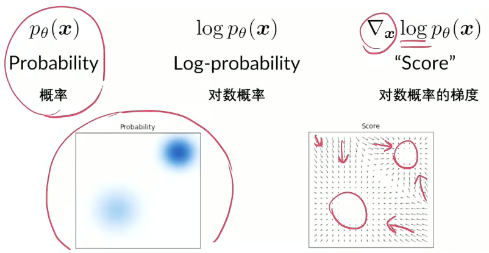
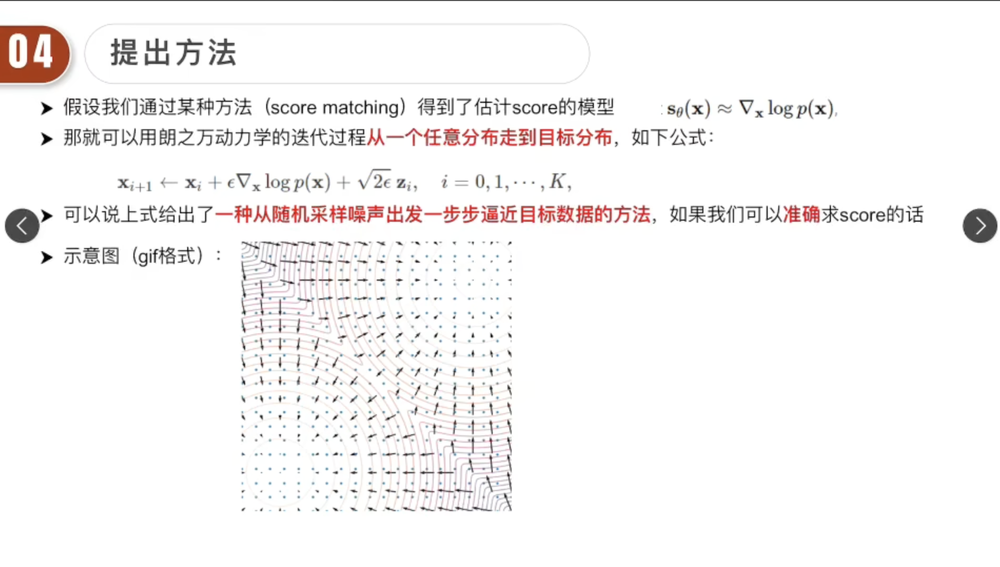
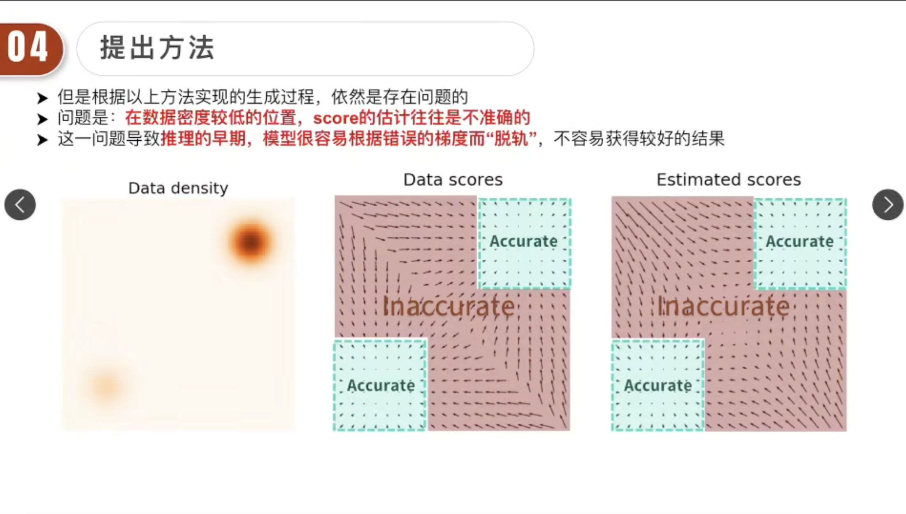
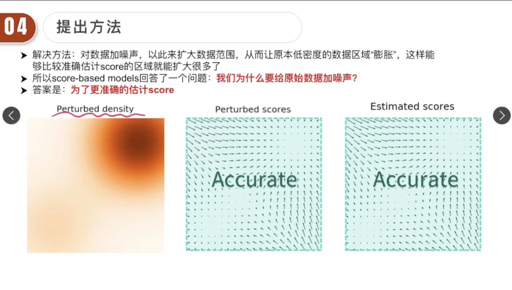
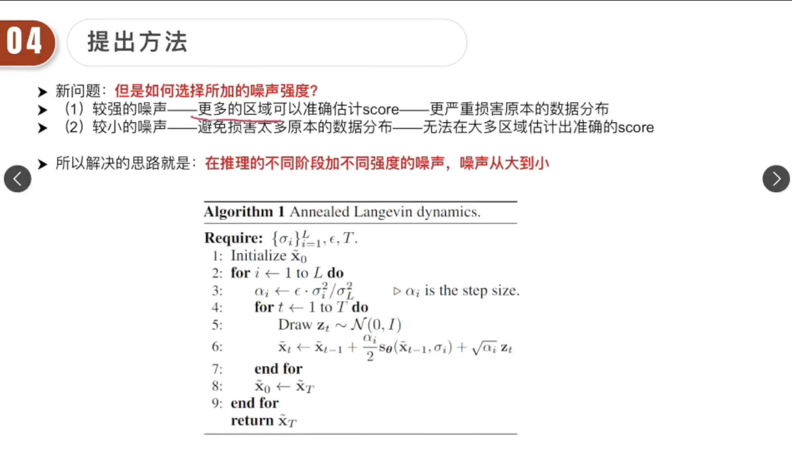
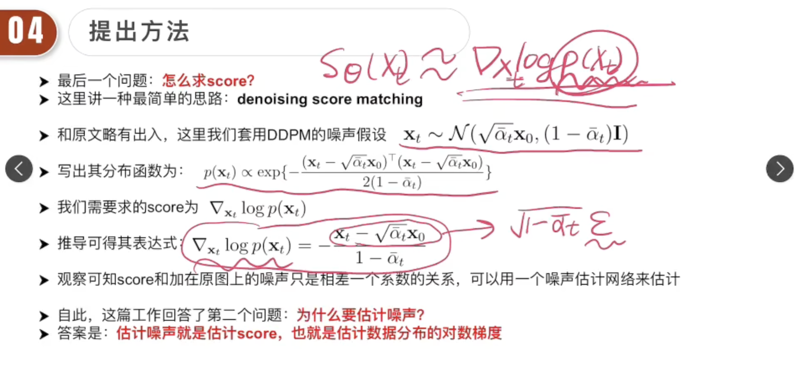

### Score-based model介绍

> 扩散模型可以分别溯源到score-based model（其实出现得更早）和DDPM，形成了两个分支 。偏理论的follow score-based的多一点，偏应用的follow DDPM的多一点。而它们本质上是一样的。

推荐阅读：[3Blue1Brown微分方程](https://youtu.be/p_di4Zn4wz4?si=2aGDZHHgebxb12XH)

#### 3-1 Score-based Model

《Generative Modeling by Estimating Gradients of the Data Distribution》

《通过预测 数据分布的梯度 构建一个生成模型》

这儿 数据分布的梯度 就是我们说的score。
Score-bade Model核心就是score，怎样预测score，怎样利用score做生成。

摘要里这句话提出问题、解决问题：

> Because gradients can be ill-defined and hard to estimate when the data resides on low-dimensional manifolds, we perturb the data with different levels of Gaussian noise
>
> 低密度区域的梯度很难预测，所以对数据进行扰动，学习扰动之后的数据分布，梯度估计就比较准了。

提出方法：

score-based model不是直接学习概率分布，而是学习score。

它这个算法是一共L*T步，L代表级别，每个级别内步长和噪声强度是固定的。

其实T=1时，它就和DDPM完全一样了。

> [!TIP] 
>
> **总结与收获**
>
> 解释了很多针对扩散模型中做法的疑惑
>
> Q1：为什么要在原始的数据上加噪声？A1：因为要更准确的估计score。
>
> Q2：为什么仅仅用去噪模型能达到生成效果？A2：因为估计噪声就是估计score，估计score就是估计数据分布的梯度，获得梯度就能一步一步靠近目标数据的分布。

#### 3-2 SDE

用 随机微分方程 的数学工具 将 以DDPM为代表 和 以Score-based Model为代表 的 这两类模型进行了理论上的统一。 

### Score-based model的应用

