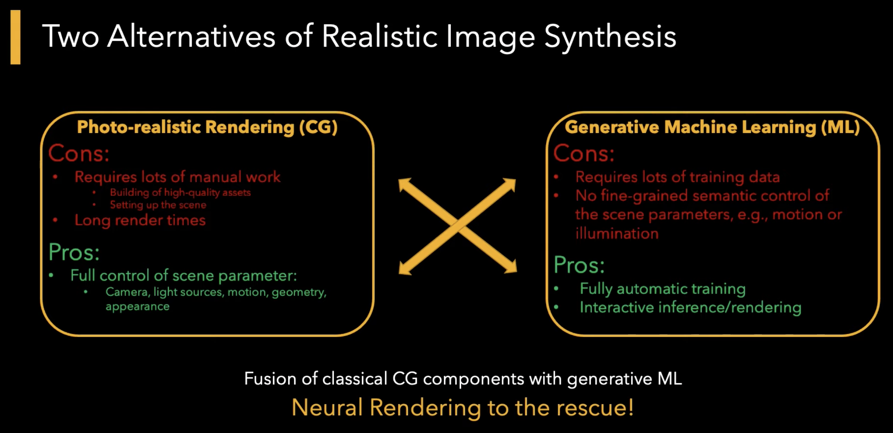
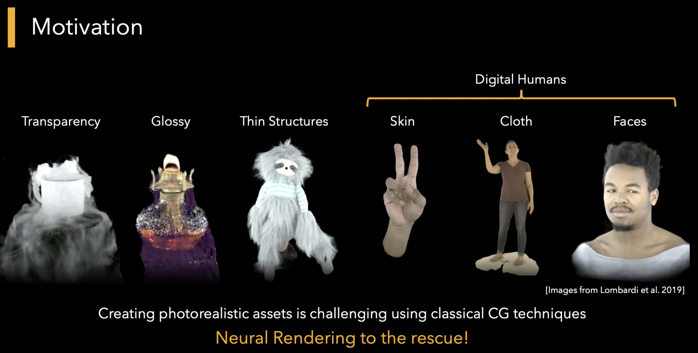
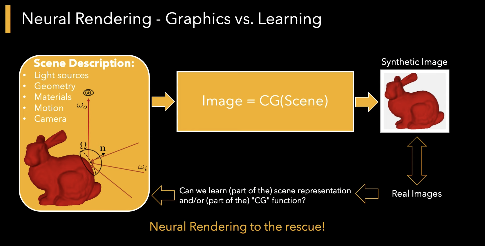
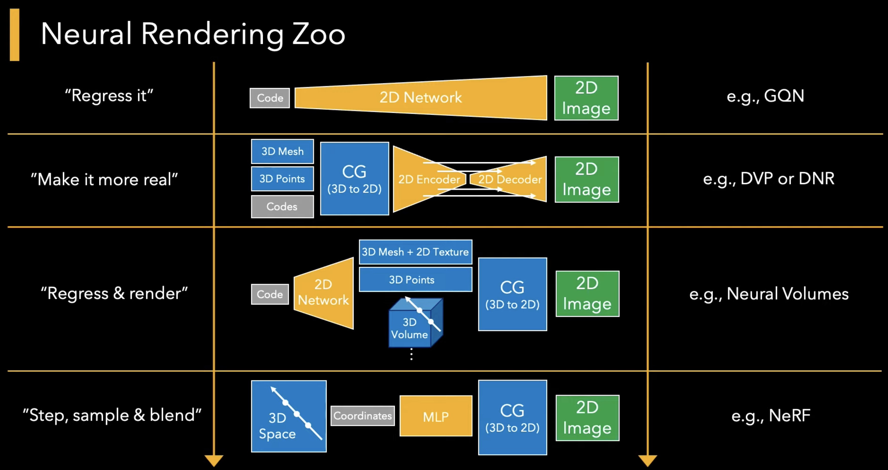

[Main Page](https://github.com/weihaox/awesome-neural-rendering)

## 神经渲染简介

神经渲染是一个快速新兴的领域，它将生成机器学习技术与计算机图形学的物理知识相结合，例如，通过将可微渲染集成到网络训练中。

Ayush Tewari et. al. 将神经渲染定义为

> 深度图像或视频生成方法，可以显式或隐式控制场景属性，例如照明、相机参数、姿势、几何、外观和语义结构。

典型的神经渲染方法输入某些场景条件（例如，视点、照明、布局等）下相对应的图像，从中构建“神经”场景表示，并在新颖的场景属性下“渲染”该表示以合成 新颖的图像。

CVPR 2020 教程将神经渲染定义为

> 神经渲染是一类新型的深度图像和视频生成方法，可以显式或隐式控制场景属性，例如照明、相机参数、姿势、几何、外观和语义结构。 它将生成机器学习技术与计算机图形学的物理知识相结合，以获得可控且逼真的输出。

给定高质量的场景规格，经典渲染方法可以为各种复杂的现实世界现象渲染逼真的图像。 此外，渲染使我们能够对场景的所有元素——相机视点、照明、几何图形和材质进行明确的编辑控制。 

然而，构建高质量的场景模型，特别是直接从图像构建，需要大量的手动工作，而从图像进行自动场景建模是一个开放的研究问题。 另一方面，深度生成网络现在开始根据随机噪声或根据某些用户规范（例如场景分割和布局）生成视觉上引人注目的图像和视频。 然而，它们还不允许对场景外观进行细粒度控制，并且不能始终处理场景属性之间复杂的、非局部的 3D 交互。 相比之下，神经渲染方法有望将这些方法结合起来，以实现从输入图像/视频中可控地、高质量地合成新图像。

## 相关综述和课程

**[Advances in Neural Rendering.](https://arxiv.org/abs/2111.05849)** Eurographics State-of-the-Art Report 2022.

**[State of the Art on Neural Rendering.](https://arxiv.org/abs/2004.03805)** Eurographics 2020.

**[Advances in Neural Rendering.](https://arxiv.org/abs/2111.05849)** ACM SIGGRAPH 2021 Courses.

**[CVPR 2020 tutorial on Neural Rendering.](https://www.neuralrender.com/)** on Youtube

**[A Systematic Survey of Generative 3D-aware Image Synthesis.](https://arxiv.org/abs/2210.14267)**

**[Differentiable Rendering: A Survey.](https://arxiv.org/abs/2006.12057)**

**[NeRF: Neural Radiance Field in 3D Vision, A Comprehensive Review.](https://arxiv.org/abs/2210.00379)**

**[Nerfstudio: A Modular Framework for Neural Radiance Field Development.](https://docs.nerf.studio/en/latest/)** 

## 细分方向

- 逆渲染（去渲染）
- 神经重渲染
- 可微渲染

## SIGGRAPH 2021 课程

什么是神经渲染？
神经渲染是一类新兴的深度学习图像和视频生成方法，可以控制场景属性，例如照明、相机参数、姿势、几何、外观和语义结构。 它将机器学习技术与计算机图形学的物理知识相结合，以获得可控且逼真的场景模型。

我将在本课程中学到什么？
本课程涵盖了去年神经渲染方面的进展。 我们将首先介绍与神经渲染相关的机器学习和计算机图形学基础知识。 接下来，我们将介绍许多重要的神经渲染方法的最先进技术，这些方法适用于新颖的视图合成、语义照片处理、面部和身体重演、重打光、自由视点视频以及为虚拟和增强现实远程呈现创建逼真的头像等应用。 最后，我们将讨论该技术的伦理影响和开放性的研究问题。

### 介绍

**Fundamentals** *Michael Zollhöfer*

### 生成对抗网络

Loss Functions Jun-Yan Zhu

GANs with 3D Control Ayush Tewari

### 神经场景表达

Neural Scene Representations Gordon Wetzstein

### 视点合成

**Introduction** *Vincent Sitzmann*

**Neural Volumetric Rendering** *Ben Mindenhall*

Fast Rendering of NeRFs Lingjie Liu

Towards Instant 3D Capture Dan Goldman

Deformable NeRFs Keunhong Park

### 重打光

Relightable and Editable Neural Rendering Zexiang Xu

Total Relighting Sergio Orts-Escolano

Relightable NeRFs Pratul Srinivasan

### 构图场景表达

Compositional Scene Representations Michelle Guo

### 自由视点视频

Overview of NeRFs for General Dynamic Scenes Edgar Tretschk

Efficient Neural Rendering of Dynamic Humans and Scenes Stephen Lombardi

Neural Rendering for Dynamic Performance Capture Rohit Pandey

### 面部和身体渲染

Neural Rendering of Faces and Bodies Justus Thies

Neural Rendering and Video-based Animation of Human Actors Christian Theobalt

Neural Rendering for Animatable Avatars Tomas Simon

### 总结

Open Challenges Ohad Fried

Discussion on Ethical Implications (only live) Maneesh Agrawala