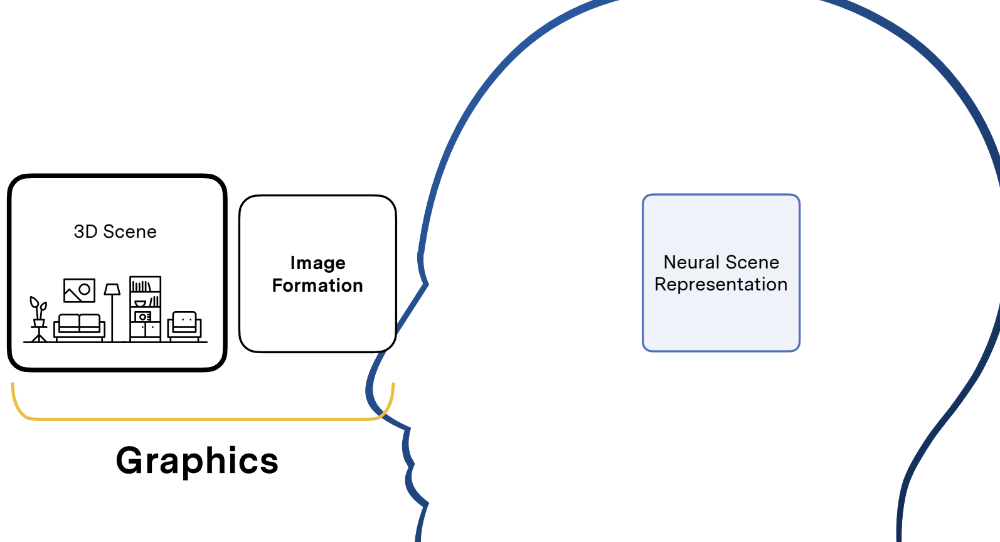
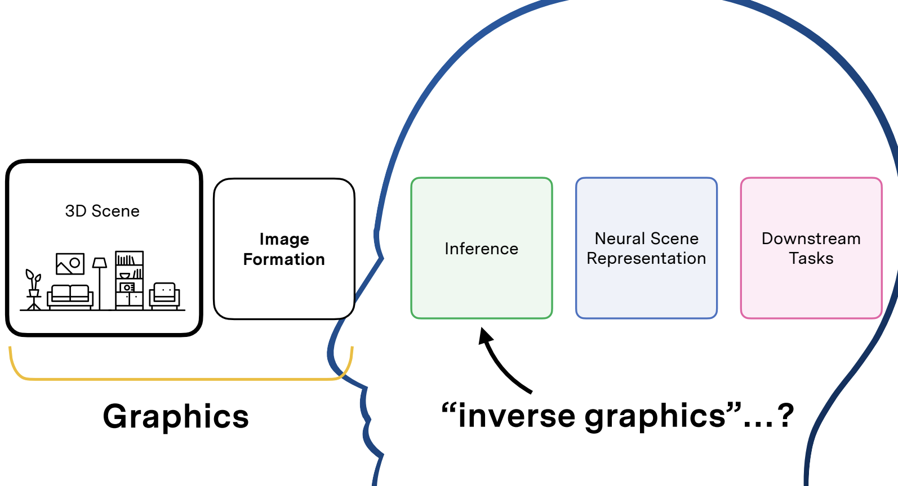

# 资源

https://github.com/MrNeRF/awesome-3D-gaussian-splatting

Blog Posts

- [3DGS Introduction](https://huggingface.co/blog/gaussian-splatting) - HuggingFace guide
- [Implementation Details](https://github.com/kwea123/gaussian_splatting_notes) - Technical deep dive
- [Mathematical Foundation](https://github.com/chiehwangs/3d-gaussian-theory) - Theory explanation
- [Capture Guide](https://medium.com/@heyulei/capture-images-for-gaussian-splatting-81d081bbc826) - Image capture tutorial

Talks

- [Gaussian Splats: Ready for Standardization?](https://www.youtube.com/watch?v=0xdPpKSkO3I) - Metaverse Standards Forum 1/28/2025
- [Unity Integration Guide](https://www.youtube.com/watch?v=pM_HV2TU4rU&t=5298s) - Metaverse Standards Forum 5/6/2025

Video Tutorials

- [Getting Started (Windows)](https://youtu.be/UXtuigy_wYc)
- [Gaussian Splats Town Hall - Part 2](https://youtu.be/5_GaPYBHqOo)
- [Two-Minute Explanation](https://youtu.be/HVv_IQKlafQ)
- [Jupyter Tutorial](https://www.youtube.com/watch?v=OcvA7fmiZYM)
- [MIT教程](https://www.scenerepresentations.org/courses/2023/fall/inverse-graphics/)

# MIT 6.S980 

逆向图形学中的机器学习

# 📚 课程大纲

## 模块 0：介绍

### 📘 课程导论

 📅 9月7日（周四）  

- 学习目标  
- 如何理解我们所处的环境？  
- 将计算机视觉看作逆向图形学（Inverse Graphics）  
- 3D 的不同定义方式  

在过去，我们总是使用手工制作的3D表示。但深度学习的教训是，我们真的想使用从先验数据中学习的算法，来构建我们与之交互的任何表示形式，3D也不例外。

人脑会将视网膜的图像形成（image formation，这正是计算机图形学通常研究的内容），在经过一定处理后以3D表示在脑海呈现。

但从视网膜上的图像到你周围世界的3D表示的过程，是个黑匣子，我们称之为推理（inference）。

这个inference过程也是这门课名称的由来——逆图形（Inverse Graphics）机器学习。

> [!NOTE]
>
> 它之所以称为逆图形学是因为它反转了图形学管道，图形学是从3D场景到图像。

最后有一些下游任务，Vincent老师想说服大家的是：实际上任何需要视觉的任务，都应该在3D表示上执行，不然从根本上说都是有缺陷的。 这是一个立场非常鲜明的观点。

---

## 模块 1：图像生成基础

### 📘 图像形成 

📅 9月12日（周二）  

- 小孔成像模型  
- 刚体变换与相机姿态  
- 投影图像生成  
- 相机使用约定  

现有方法：

**SfM & SLAM**

> [!NOTE]
>
> **SfM（Structure from Motion）** 是一种通过分析多张图像（通常来自移动摄像头）来恢复三维场景结构的方法。
>
> 它是**计算机视觉中的三维重建技术**，从多视图几何（Multiple View Geometry）演化而来，关键点包括特征匹配、相机位姿估计、三维点重建和 bundle adjustment（捆绑优化）。
>
> SfM 是 SLAM 的离线版本（不依赖传感器、以视觉为主）
>
> SLAM 是 SfM 的在线实时扩展，增加了传感器融合与闭环检测

小知识：《Building Rome in a Day》这篇文章的标题取得特别好，是大规模 SfM（大规模城市级三维重建）的开山之作。是SfM 从“研究室”走向“现实世界”的标志性论文。

### 📘 多视图几何 

📅 9月14日（周四）  

- 多视图图像中3D信息的编码方式  
- 对极几何（Epipolar Geometry）  
- 束束调整（Bundle Adjustment）  

---

## 模块 2：三维场景表示与神经渲染

📘 课程取消 📅 9月19日（周二）  
- 因讲者出差取消课程

### 📘 场景表示 I：2.5D 与单目深度预测

- 表面表示：点云、深度图、网格  
- 单目深度预测  
- 双目深度预测  
- 自监督的单目深度与自运动预测  

### 📘 场景表示 II：表面与离散场表示  

- 体素网格  
- 连续表示：神经场  
- 混合离散-连续表示  
- 几何参数化方式  
- 表示方式的优劣比较（运行时间、内存等）  

### 📘 场景表示 III：神经场与混合表示 

- 渲染方程  
- 辐射度  
- 材质  
- 光传输的真实感层级  

### 📘 光传输 

📅 10月3日（周二）  

- 渲染方程  
- 辐射度  
- 材质  
- 光传输的真实感层级  

### 📘 可微渲染 I 

📅 10月5日（周四）  

- 球体追踪  
- 体积渲染  
- 光场渲染  
- 可微渲染与反向图形学  

📘 学生假期 📅 10月10日（周二）

### 📘 可微渲染 II 

📅 10月12日（周四）  

- 高斯溅射（Gaussian Splatting）  

---

## 模块 3：表示学习、潜变量模型与自动编码

### 📘 基于先验的重建 I

 📅 10月17日（周二）  

- 神经网络作为基于先验的推理模型  
- 自动编码与表示学习  
- 自动解码  

### 📘 基于先验的重建 II 

📅 10月19日（周四）  

- 全局与局部条件建模  
- 从图像直接推理3D场景  
- 极线推理与体积渲染  

### 📘 基于先验的重建 III

 📅 10月24日（周二）  

- 光场表示  
- 光场渲染下的极线推理  
- 基于注意力的推理与条件建模  
- 基于梯度的元学习  
- 对比学习方法：DiNO 等  

### 📘 如何进行科研 

📅 10月26日（周四）  

- 选题建议  
- Heilmeier 问题清单  
- 项目提案的标准  
- 发表与研究的意义  
- 为什么科研有趣？  

### 📘 去除相机姿态 

📅 10月31日（周二）  

- 学习推理相机姿态与三维场景  
- RUST、FlowCam 等方法  

### 📘 无条件与文本条件生成模型 

📅 11月2日（周四）  

- 3D 场景生成模型  
- 3D GAN  
- 3D 扩散模型  

### 📘 条件概率模型 

📅 11月7日（周二）  

- 条件图像下的3D场景分布采样  

## 模块 4：运动与物体性

### 📘 动态场景表示 I 

📅 11月9日（周四）  

- 光流（Optical Flow）  
- 场景流（Scene Flow）  
- 光流估计算法  
- 场景流估计算法  

### 📘 动态场景表示 II 

📅 11月14日（周二）  

- 将运动建模为场景表示的一部分  

---

## 模块 5：几何深度学习

### 📘 表示论与对称性 

📅 11月16日（周四）  

- 泛化问题  
- 表示论简介：  
  - 群（Groups）  
  - 表示（Representations）  
  - 群作用（Group actions）  
  - 等变性（Equivariance）与不变性（Invariance）  
- 重要的对称群：  
  - 旋转  
  - 平移  
  - 缩放  

### 📘 如何进行学术报告 

📅 11月21日（周二）  

- 讲座内容未详细列出（仅提供指导）

📘 感恩节假期 📅 11月23日（周四）  
- 假期，无课程安排  