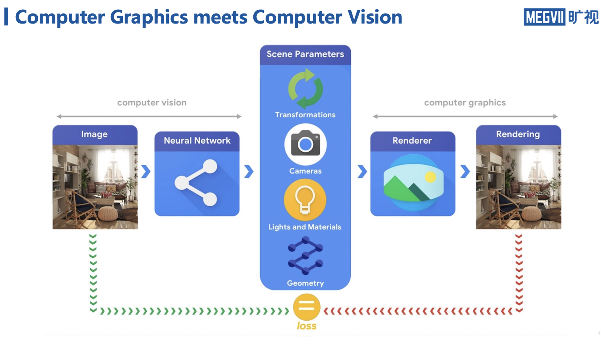
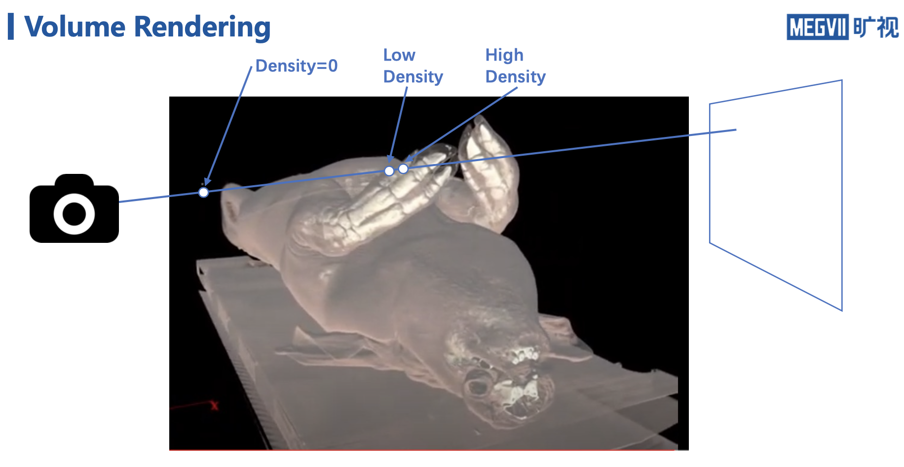
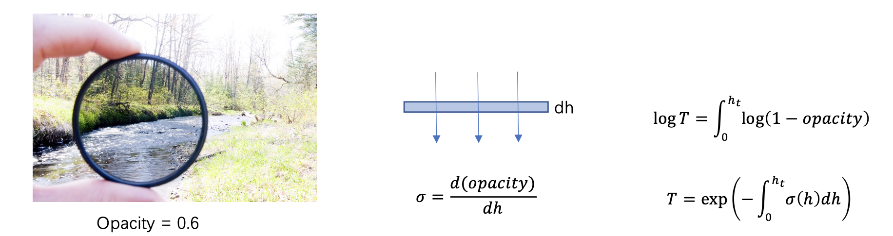
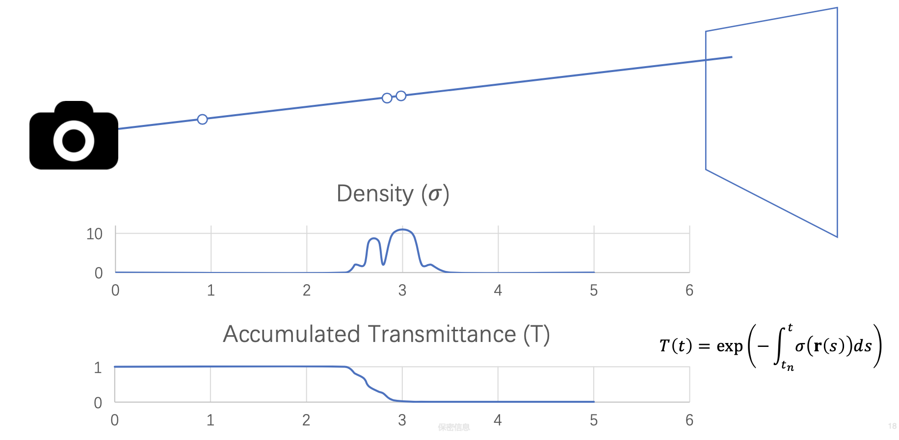
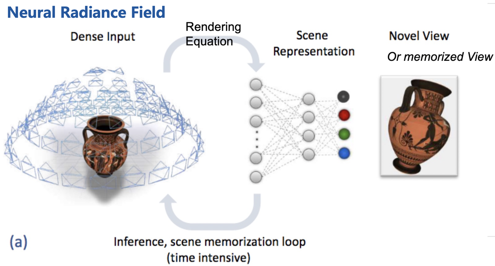
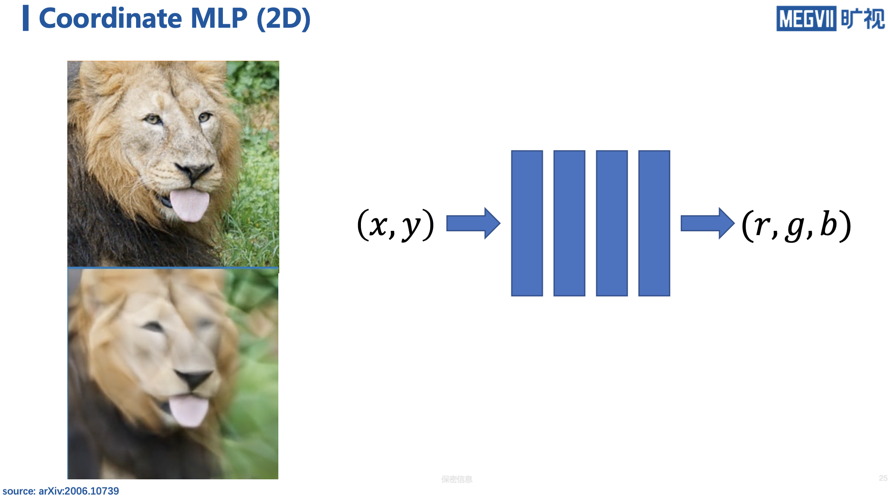
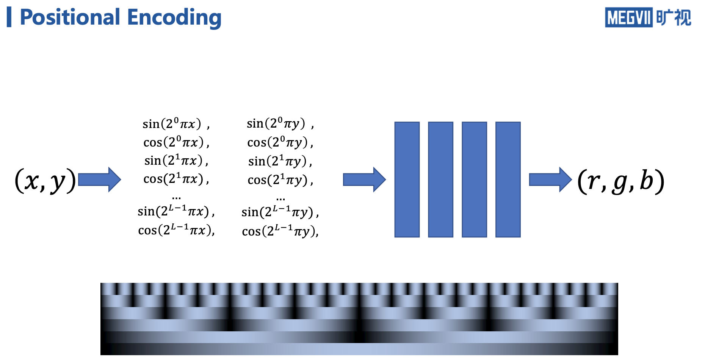
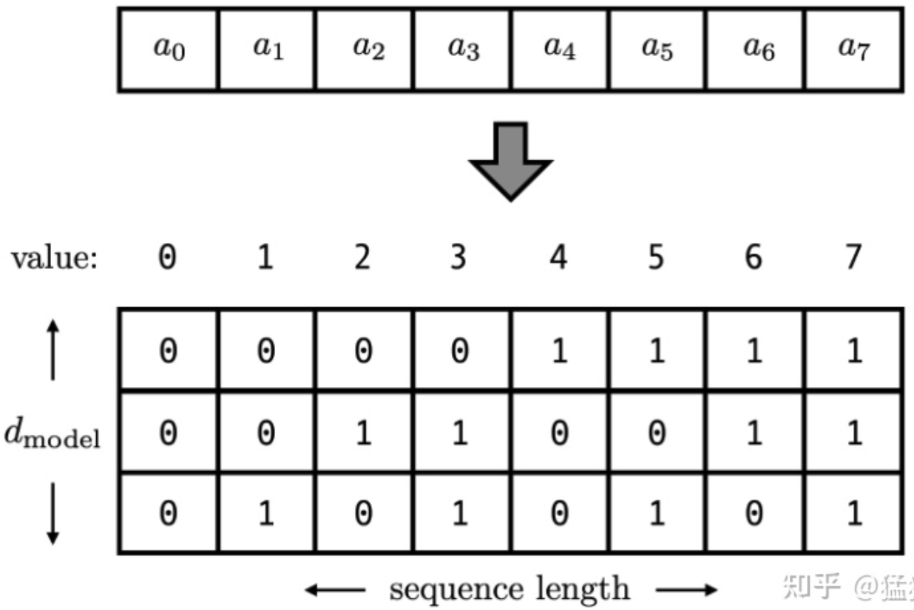
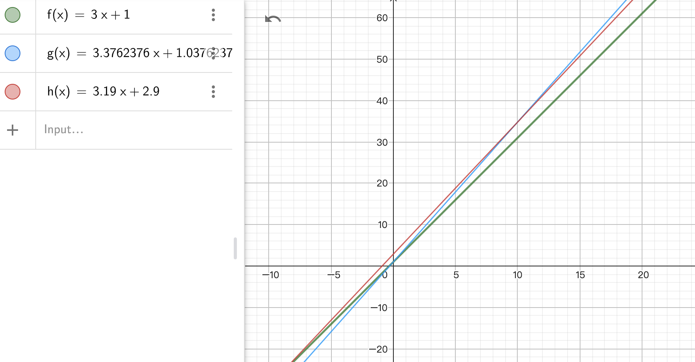

## NeRF原理理解

### 通俗版

核心逻辑：无非就是camera pose作为输入，real image作为输出监督，从而得到一个场景的隐式表示。

### 自学版

[youtube link](https://www.youtube.com/watch?v=TQj-KUQophI&t=6s)

[bilibili link](https://www.bilibili.com/read/cv23979250?spm_id_from=333.999.0.0)

#### 一.概念

NeRF是视角生成算法，从少数相片（real camera）中学习生成新视角（virtual camera）。

可以实现5D的神经辐射场（照射野），其中3维用来表示我们在哪，2维表示我们看向哪。

> 3 dimensions for location and 2 for view direction.  

对应神经网络的输入也就是这5个维度，输出是图片。

#### 二.难点

主要是那些稍许改变视角，就会大幅变化的事物：

- non-Lambertian材质：无光泽的物体比较简单，因为它们从不同方向看都是相似的。而有光泽的物体就难多了，因为视角变化时它们的表面也会大幅变化，基本是训练数据中没见过的。
- 遮挡：需要学习到准确的深度信息。

#### 三.知识系统

##### 1.概览



计算机视觉输入是一张图片，然后通过各种方法，来了解和认识这张图片。

计算机图形学的目标则恰恰相反，已经对一个场景有认识了，然后想通过渲染获得图片。

##### 2.应用

- 渲染
- 导出其他格式，比如mesh
- 参与其他的计算机视觉任务，比如已有场景建模，再做深度估计、目标检测、反求观测者位置（iNeRF）

##### 3.体积渲染

在NeRF里可微的渲染很重要，而我们介绍的工作用到的都是可微的体积渲染（Volume Rendering）



猪骨密度>猪脂肪/皮肤>空气，这里把密度再理解为透光率：





光路可逆，这里假设相机接收光，或者发射光是一样的结论。某束光线沿直线传播，透射比（transmittance）就会在经过猪骨头时大幅下降。

体积渲染最后时用离散的采样点代替了连续的积分。

##### 4.NeRF之位置编码



神经网络形成了场景表示。

###### 4.1 Coord MLP



其实在NeRF之前，NIPS2020的一篇[论文](https://proceedings.neurips.cc/paper/2020/file/55053683268957697aa39fba6f231c68-Paper.pdf)有这样一种尝试：

希望通过一个神经网络，就是由全连接层和非线性函数组成，建模一张图片的表示：坐标到rgb的映射关系。相当于背下来了这张图。

但是直接这种<font color="brown">背图片</font>，大概只能恢复成下方图片的样子，很糊，还有很多三角形的artifacts（大概是因为非线性函数用的ReLU，如果换一种非线性函数，会是另一种风格）。

> 一般的神经网络，如果没有经过专门设计，只能学到一些非常低频的信息。



解决办法是引入对坐标的编码（<font color="brown">positional encoding</font>）。

> 我们需要这样一种位置表示方式，满足于：
> （1）它能用来表示一个token在序列中的绝对位置
> （2）在序列长度不同的情况下，不同序列中token的相对位置/距离也要保持一致
> （3）可以用来表示模型在训练过程中从来没有看到过的句子长度。


###### 4.2 PE of Transformer

> Transfomer里input = input_embedding + positional_encoding，这里，input_embedding是通过常规embedding层，将每一个token的向量维度从vocab_size映射到d_model，由于是相加关系，自然而然地，这里的positional_encoding也是一个d_model维度的向量。（在原论文里，d_model = 512）
>
> 直觉上，位置编码的高冗余特征实际是一种纠错编码，靠高度冗余保证位置信息在多个信息通道上稳定灌入网络而不至于被网络抛弃。

直观地想法是用d_model长度的二进制编码位置。



但这样编码出来的位置向量，处在一个离散的空间中，不同位置间的变化是不连续的。

所以我们相当用周期函数（sin）来表示位置：

$PE_t = [sin(\frac{1}{2^0}t),sin(\frac{1}{2^1}t),...,sin(\frac{1}{2^{i-1}}t),...,sin(\frac{1}{2^{d_{model}}-1}t)]$

但$y＝sin(ωx＋θ)+K$的周期$T=2\pi/ω$，如果我们频率$f=1/T$偏大，引起波长偏短，则不同t下的位置向量可能出现重合的情况。比如在下图中(d_model = 3），图中的点表示每个token的位置向量，颜色越深，token的位置越往后，在频率偏大的情况下，位置响亮点连成了一个闭环，靠前位置（黄色）和靠后位置（棕黑色）竟然靠得非常近：


为了避免这种情况，我们尽量将函数的波长拉长。一种简单的解决办法是同一把所有的频率都设成一个非常小的值。因此在transformer的论文中，采用了 $\frac{1}{10000^{i/(d_{model}-1)}}$这个频率。

总结一下，到这里我们把位置向量表示为：

$PE_t = [sin(ω_0t),sin(ω_1t),...,sin(ω_{i-1}t),...,sin(ω_{d_{model}-1}t)]$，其中$ω_i=\frac{1}{10000^{i/(d_{model}-1)}}$，频率被调到非常小（只用看最右边的，最小频率足够小了，周期=10000，而机器翻译一般最大输入文本词量也不超过5000）。

> Attention is all you need文章里表示，他们也尝试了sequence2sequence里基于学习的位置编码，但最终发现几乎是等价的。
>
> **从方法的可理解性上**，Learned Positional Embedding更加易于理解。**从参数维度上**，使用Sinusoidal Position Encoding不会引入额外的参数。

那现在我们对位置向量再提出一个要求，**不同的位置向量是可以通过线性转换得到的**。这样，我们不仅能表示一个token的绝对位置，还可以表示一个token的相对位置，即我们想要：

$PE_{t+\bigtriangleup t}=T_{\bigtriangleup t}*PE_t$

1. 绝对位置0的编码是固定的：PE(p=0)=(0,1,0,1,.....) ，所以谁都知道想参考句首的信息应该怎么办

2. 固定的相对距离，位置编码的相似度是固定的：DotProduct(PE(i), PE(i+k)) = DotProduct(PE(j), PE(j+k)) for any i,j,k

3. 位置编码的相似度随着距离的变化单调变化，如DotProduct(PE(i), PE(i+k1)) > DotProduct(PE(i), PE(i+k2)) for any k1<k2

4. 任意两个位置编码之间都可以用一个线性变化互相求得。

   $\begin{aligned}PE_{pos+k,2i} &= \sin(\omega_i pos + \omega_i k) \\ &= \cos(\omega_i pos)\sin(\omega_i k) + \sin(\omega_i pos)\cos(\omega_i k) \\ &= (PE_{pos,2i+1})\mu  + (PE_{pos,2i})\nu \\ &= (PE_{pos,2i}, PE_{pos,2i+1})(\nu, \mu)\end{aligned}$

   

   $\begin{aligned}PE_{pos+k,2i+1} &= \cos(\omega_i pos + \omega_i k) \\ &= \cos(\omega_i pos)\cos(\omega_i k) - \sin(\omega_i pos)\sin(\omega_i k) \\ &= (PE_{pos,2i+1})\nu  - (PE_{pos,2i})\mu \\ &= (PE_{pos,2i}, PE_{pos,2i+1})(-\mu, \nu)\end{aligned}$

   

   把上面的式子变为矩阵形式：

   $\begin{pmatrix}
     PE_{pos+k,2i} \\
     PE_{pos+k,2i+1}
   \end{pmatrix} = \begin{pmatrix}
     \nu & \mu \\
     -\mu & \nu
   \end{pmatrix} \times \begin{pmatrix}
     PE_{pos,2i} \\
     PE_{pos,2i+1}
   \end{pmatrix} = \begin{pmatrix}
     \cos & \sin \\
     -\sin & \cos
   \end{pmatrix} \times \begin{pmatrix}
     PE_{pos,2i} \\
     PE_{pos,2i+1}
   \end{pmatrix}$​

   **由sin/cos构成的这个矩阵是个标准的二维旋转矩阵!**

   PE这里用“角度”替代了“距离”来表述“差异”

   > 记得线性代数里是如何表述高维向量之间的差异么？两个矢量的[点积](https://www.zhihu.com/search?q=点积&search_source=Entity&hybrid_search_source=Entity&hybrid_search_extra={"sourceType"%3A"answer"%2C"sourceId"%3A2931272773})，反映了cos(angle)的大小，也就等价于反映了angle的大小，也就等价于反映了两个矢量的相似度（差异程度）。

   

   PE沿着position滑动，就变成了矢量沿着单位圆匀速转动而已。

   这个精巧的设计满足了transfomer里对Positional Encoding的几项要求：

   1. dimension的范围可以自由改变，向右追加或者减少频率更慢的轮子
   2. position的范围可以自由改变，增大或者减小轮子的半径
   3. 字间距离单位不受position范围的变化而变化，每个轮子的转速恒定
   4. 这么多速度不一的轮子，可以组合出很多唯一的编码

   最后Word Embedding + Position Embedding当作attention的输入，PE+WE很类似于在通过傅立叶变换在频域里添加水印的过程。

   >**这样的编码方案下，Attention就具备了考虑位置的能力。既能搞定长程依赖，也能搞定短程依赖，所以Attention is all you need!**

   >你可以把一个输入的句子拆开成每个token，把每个单独的token看成图里的一个node。如果只有attention机制但是没有PE的话，相当于是在每个node之间都连了边，连成了一张全连接图。所以只看输入输出的句子的话，实际上整个句子（Graph）所携带的信息和每个词（node）的顺序是无关的。因此我们要加入PE来让整个输入的信息是order variant的。并且这个PE需要具有<font color="brown">平移不变性，单调性和对称性</font>。

   > 2017年Attention is all you need paper里用的sinusoidal PE是用了三角函数的周期性来实现这三个性质的。后面其实还有了PE的很多变种，比如BERT就直接通过学习来实现adaptive encoding了（learnable PE）。

参考：[1](如何理解Transformer论文中的positional encoding，和三角函数有什么关系？ - 猛猿的回答 - 知乎 https://www.zhihu.com/question/347678607/answer/2301693596), [2](https://zhuanlan.zhihu.com/p/621307748), [3](哪位大神能讲一下Transformer的Positional embedding为什么有用？ - Olivia的回答 - 知乎 https://www.zhihu.com/question/385895601/answer/1924217518), [4-en-source](https://kazemnejad.com/blog/transformer_architecture_positional_encoding/#the-intuition), [5-收音机类比](https://zhuanlan.zhihu.com/p/644616193)

$PE(pos, k)=\left \{ 
\begin{array}{rcl}
\sin(\omega_i pos) & & k=2i\\ 
\cos(\omega_i pos) & & k=2i+1\\ 
\end{array}
\right .$,  其中$\omega_i=\frac{1}{10000^{2i/d_{model}}}$

<font color="brown">和傅立叶变换的区别和相似：</font>

把PE的颜色恢复成三维空间的波形幅度后，它就非常接近傅立叶变换里的多列波形图，这两张图有些区别，这个傅立叶变换图中波的频率是从最右列向最最左列逐渐降低，而上面的PE图则是频率从最左列向最右列逐渐降低，另外，傅立叶变换图里的每条波的幅度范围不同，而PE里都是相同的。


**PE性质验证代码：**

```python
def pe(p, d):
    e = [.0] * d
    for i in range(d//2):
        e[2 * i] = math.sin(p / 10000 ** (2 * i / d))
        e[2*i+1] = math.cos(p / 10000 ** (2 * i / d))
    return e


d = 64; el=[]
for p in range(0,d*2):
    e = pe(p, d)
    el += [e]
    e = [f"{x:+.2f}" for x in e]
    print(f"d={d} p={p:2d} e={e}")

#el的元素是每个位置的位置向量e
for i,ei in enumerate(el):
    sl = []
    #ei和位置间隔1~12的位置向量的相似度
    for j,ej in enumerate(el[i+1:i+12]):
        s = sum([xi*xj for xi,xj in zip(ei,ej)])
        sl += [s]
    sl = [f"{s:+.2f}" for s in sl]
    print(f"i={i:2d} sl={sl}")
```

<font color="darkblue">你可以用这段代码反推一下，如果不用sin和cos交替来表示位置会怎么样，如果频率设置大了会怎么样。</font>

最终位置编码可视化出来是（序列长度p_max为50，位置编码维度d_model为128）：


> 越往右的位置，频率越小，波长越长，所以不同的t对最终的结果影响不大。

**Transformer中有两个关键的基础组件：1. Multi-Head Attention， 2. Positional Encoding。**

Multi-Head Attention给予了Transfomer以捕获长程依赖（Long-range dependencies）和内容依赖的能力。Positional Encoding给予了Transfomer捕获短程依赖和位置依赖的能力。由于Positional Encoding也是被合并到Embeding中之后通过Multi-Head Attention起作用的，所以Transfomer的论文，题为*Attention is All You Need*。

4.1之 **论文解读** | Fourier Features Let Networks Learn High Frequency Functions in Low Dimensional Domains [*](https://zhuanlan.zhihu.com/p/452324858) 

和NeRF是同一批作者。

首先理解傅里叶变换：

<video src="./d223de46-23a7-11eb-95ec-fe27a5b7ef44.mp4"></video>

理解神经正切核(neural tangent kernel)：

一句话总结：<font color="brown">NTK衡量的是，在使用SGD优化参数下，其对应的随机到样本 $x^′$ ，在参数更新非常一小步 $ \eta$ 后， $f(x)$ 的变化。</font>

比如$f(x) = \theta_1x + \theta_2$, 初始化参数$\theta_1=3$, $\theta_2=1$，

和$f(x) = \theta_1x + 10*\theta_2$, 初始化参数$\theta_1=3$, $\theta_2=0.1$，

看起来二者初始化时对于某个样本的Loss一样，但SGD优化参数后，f(x)的变化是不一样的：

假设有一个样本是 (x,y)=(10,50)，学习率0.1，使用squared error loss : 

$((10*3+1) - 50 )^2$求导 = 2*(31 - 50) = -38

更新后的f(10) = 31 - 0.1*38 = 34.8，且根据求导关系，$\theta_1$更新的变化比 $\theta_2$大十倍。

$(3+10*\delta)*10+1+\delta=34.8, \delta=0.03762376$

新的$\theta_1=3.3762376$, $\theta_2=1.03762376$，如下图：


而$f(x) = \theta_1x + 10*\theta_2$，初始化参数$\theta_1=3$, $\theta_2=0.1$，则根据$(3+10*\delta)*10+10*(0.1+10*\delta)=34.8, \delta=0.019$，

新的$\theta_1=3.19$, $\theta_2=0.29$，如下图：


GeoGebra作图：



也就是说，NTK对参数是敏感的。

再来举一个小型神经网络的例子，同样的，在样本点 (x,y)=(10,50) 更新这么一个函数，我们得到函数的变化为：


显然，我们发现，在靠近0附近它的变化是很小的，而在10附近它的变化是很大的，之前说过，NTK就是刻画这种变化的，因此，我们可以把NTK画出来：


（这里把NTK除以NTK在10处的值，有点像normalize，只是为了scale一下y，方便观察。）

值得一提的是，虽然样本是 $x=10$ 的点，但是变化最大的地方其实是在 $x=7$ 的地方。

那如果我们不停的更新参数会怎样？以下是更新15次的图：


显然，随着参数的变化，kernel大小也在变化，而且越来越平滑，这意味着<font color="brown">函数在每个取值下的变化越来越一致</font>。

NTK的形式把loss function的作用和NN结构的作用分离开了，NN的结构贡献给了NTK。

现在正式阅读这篇==Coord MLP==:

在实验中，MLP总是倾向于学习更光滑的结果，很难复原高频细节。这种现象有理论解释，那就是网络自身的谱偏置（spectral bias）。

标准MLP的学习过程可以用一个带neural tangent kernel（NTK）的kernel regression[1]来刻画。而NTK理论揭示了，MLP它所对应的kernel有一个性质，那就是随着频率增加，它会快速下降[2]。这一性质阻止了MLP去学习到一个高频信号。

> [1]对于MLP的NTK，<font color="brown">它的特征值会随着频率的变大而迅速衰减，这意味着高频信号的特征值小</font>，故而在每次参数更新中受到的惩罚小，收敛很慢很慢，甚至几乎学不出来。
>
> [2] 我其实并不知道这直观地意味着什么，但我猜想和上面NTK的性质有关系？NTK会趋向平滑，一个smooth的NTK或许很难最终塑造出抖动很厉害、很sharp的函数。

这篇文章则主要在讲如何<font color="brown">克服谱偏置</font>，提出了一种将网络input从低维map到高维的一种方式，让MLP在不增加容量的情况下也能够学好高频信号。

设计原则：

- 让kernel的带宽可调（减缓spectral falloff）
- 让NTK在定义域内shift-invariant（也就是只和点点之间的差有关，而不关心点的绝对坐标）

傅里叶变换方法可以同时满足这两个目标。

首先，它的kernel function可以变换成只和Δv有关的函数，证明了这种mapping方式是shift-invariant。

因为 $\cos(\alpha-\beta) = \cos \alpha \cos \beta + \sin \alpha \sin \beta$, 核函数可以映射为:

$k_\gamma(v_1, v_2) = \gamma(v_1)^T \gamma(v_2)  = \sum_{j=1}^m a_j^2 \cos\left(2 \pi \mathbf b_j^T\left(v_1 - v_2 \right) \right) = h_\gamma(v_1 - v_2)$

   $ \textrm{where } h_\gamma(v_\Delta) \triangleq \sum_{j=1}^m a_j^2 \cos(2 \pi \mathbf b_j^T v_\Delta) \, .$

其次，通过调整变换中的参数a（ $a_j = 1/j^p$ ）和b（$b_j = j$ ），可以调节kernel的带宽。

###### 4.3 PE of NeRF


同研究Coord MLP得到的结论类似，没有应用Positional Encoding时辐射场渲染结果看起来更“糊”。

PE把这些坐标投射到高维空间变成高维空间的basis，满足了平移不变性，单调性和对称性。

##### 5.NeRF

参考[1](https://zhuanlan.zhihu.com/p/622380174)

对于NeRF，直观地看，输入是五维（3维表示位置，2维表示视角or入射光线角度or经纬度）。重建颜色和密度。


但我们不希望密度受视角的影响，一般的材料没有这种性质；（也不希望视角太多地影响颜色）：


所以$(\theta, \phi)$只通过一层网络影响$(r,g,b)$

采样也是采用了由粗到精的方式降低成本：


##### 6.Plenoxels

无需网络，既得益于方法创新，也得益于工程上的CUDA优化。

体素+球面谐波系数（只用到金字塔的前三层）


体素中每一项不是常规的存rgb+$\delta$，而是存rgb上的球面谐波系数（以及密度），可视化就是下面这27个球：


这个和NeRF的区别就类似于SRCNN和SRLUT的区别。

中间非整数坐标的体素也是通过三线性插值（Trilinear Interpolation）得到。

> 镜面反射、金属的高光学不了，但一般有材质感的反射效果都还是可以学出来的。

存储时，体素剪枝：密度为0的点（如空气），和光线射到该点时能量很弱的点（如物体内部），可以被剪枝掉。

#### 四.改进的工作