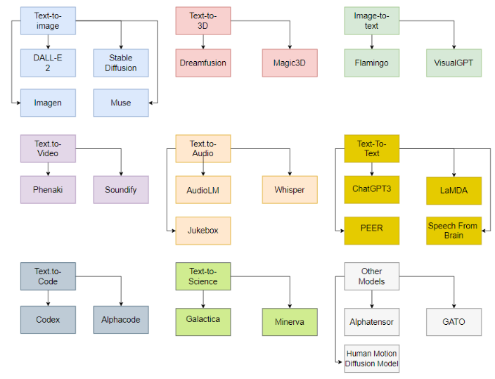
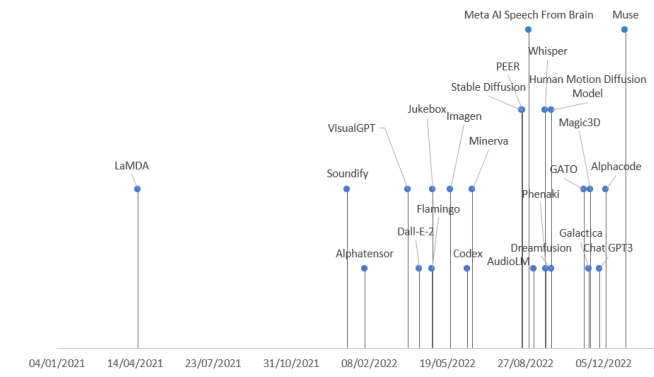
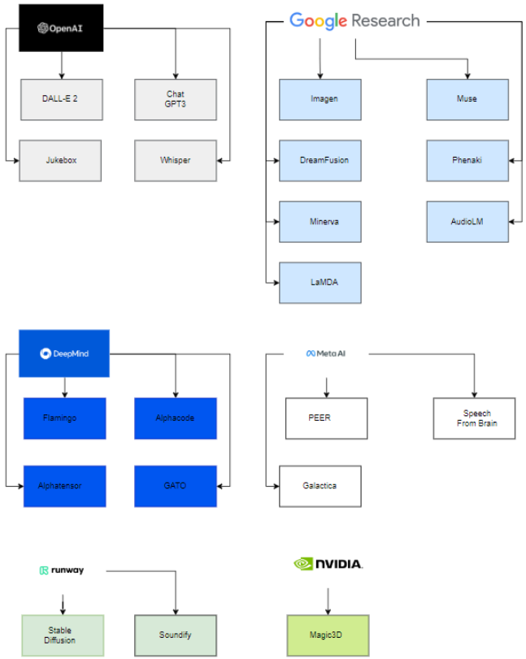

AIGC即AI Generated Content，*是*指利用人工智能技术来生成内容，被认为是继UGC、PGC之后的新型内容生产方式。AI绘画、AI写作等都属于*AIGC*的分支。

由于AI技术能对高维概率分布进行建模，从这个意义上，AIGC的应用可以从不同的多媒体输入格式（例如文本）生成逼真的不同的多媒体格式（例如视频，音频或文本）。

我们将当前的AIGC模型组织成一个分类法，其类别代表每种多媒体输入和输出数据类型之间的主要映射，发现了9个类别：

- Text-to-image
- Text-to-3D
- Image-to-text
- Text-to-video
- Text-to-audio
- Text-to-text
- Text-to-code
- Text-to-science
- Other models

下图按发布日期涵盖AIGC模型。 除了 2021 年发布的 LaMDA 和 2023 年发布的 Muse 之外，所有模型都在 2022 年发布。

有趣的是，这些模型的背后只有6家公司。因为为了能够估计这些模型的参数，必须拥有强大的计算能力以及数据科学和数据工程方面技术精湛、经验丰富的团队。

参考文献：[A SOTA Review of large Generative AI models](https://arxiv.org/pdf/2301.04655.pdf)
