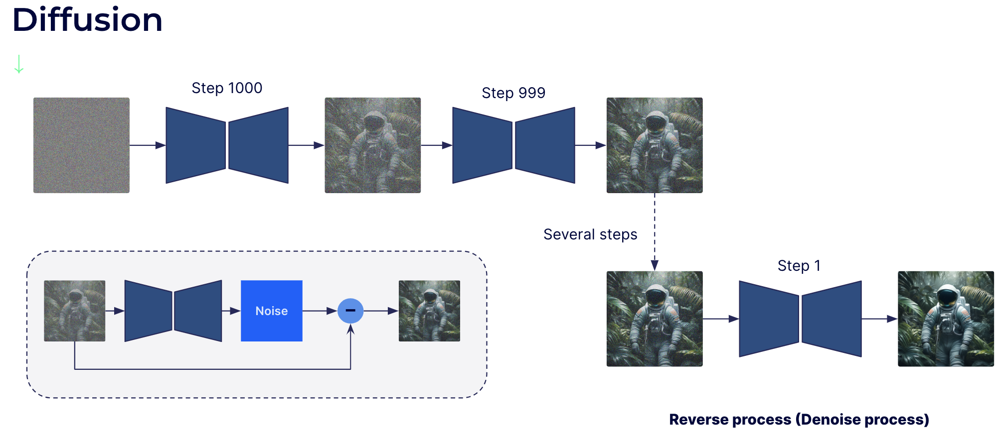
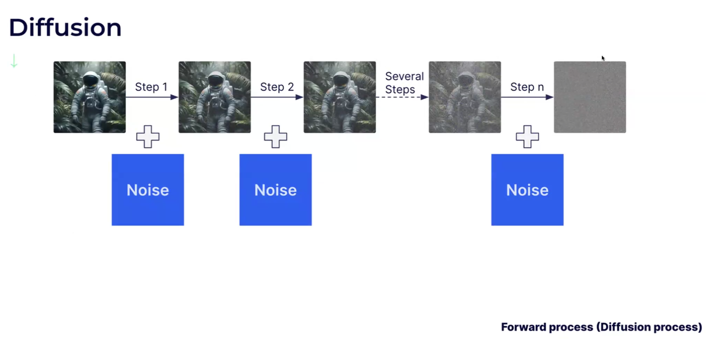
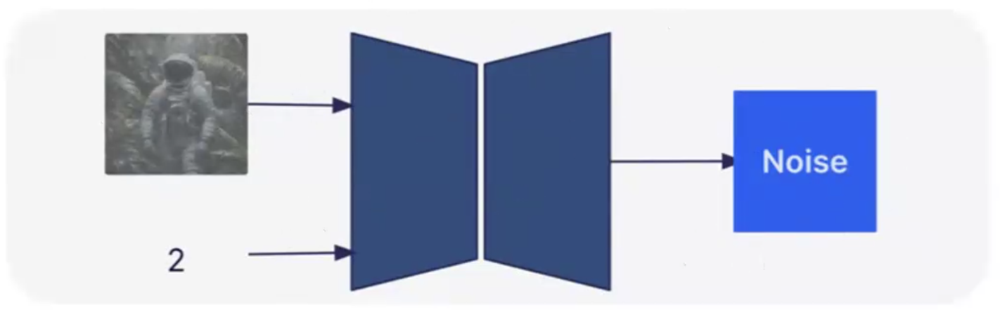
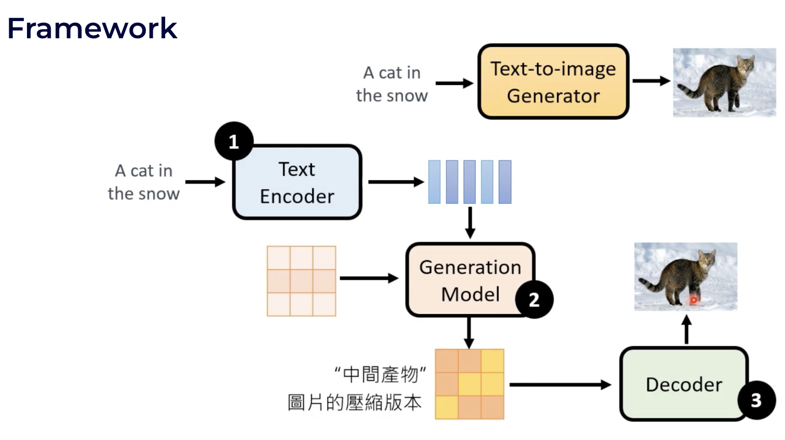
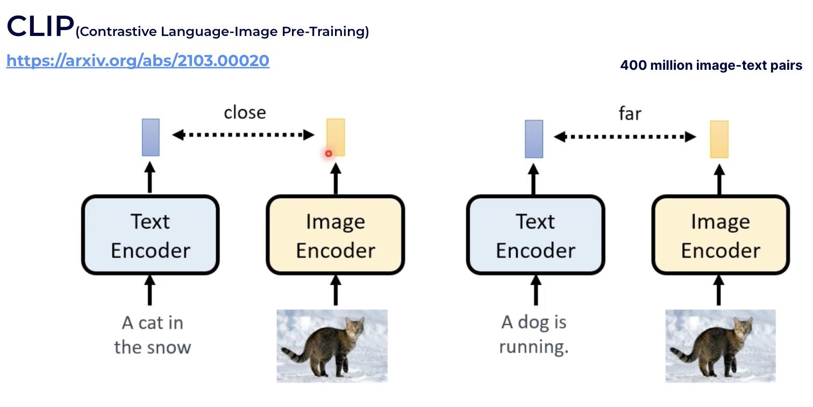
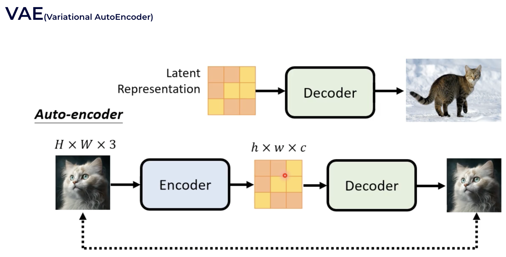

按论文的进化顺序来介绍

#### DDPM

DDPM是比较早的diffusion模型，奠定了基础框架，主要做生成任务，不涉及跨模态。

可以看到生成任务是通过去噪完成的，在N个step里渐步地预测噪声，来进行去噪。这在扩散模型里也称为逆过程（去噪过程）。

> 它的速度比较慢，比现在的stable diffusion慢很多，因为它是直接在图像空间的一个降噪。

至于step怎么取，论坛里基于数学推导和经验，贡献了五花八门不少的sampler。一般是递减的，也有复杂、经过精巧设计的。

> sampler是预测降噪比较好的一组steps。例如

正向过程是逐步地加高斯噪声。

逆过程降噪如果一步一步会很慢，所以网络也接收step的一个编码，可以理解成降噪的强度：

> 1. training：最终训练的过程便是 GT + t step noise 和 t 作为输入，和 GT形成数据对。t在1000 (max)以内随机选取。
> 2. inference：纯噪声 和 1000 (max )step 输入网络，并不能一次得到理想的图像。这与其他的优化过程类似，1步很可能只能到一个局部最优点。大部分sampler都需要20～50步。
> 3. about sampler：比如sampler是[1000, 800, 700, 660, ...]，每步输入的step是[200, 100, 40, ...]的一个编码，逐步去噪。步长一般由大到小。
> 4. 目前大部分sampler都是纯基于数学规则的，并没有自适应性，这也是由于没有很好的图像质量评价。但这也是未来一个很好的研究方向。

#### Latent Diffusion Models

是Stable Diffusion主要基于的论文，在跨模态和降低复杂度方面有贡献。它的训练数据集是LAION，大小有5.85B。

它的文生图模型主要分为三部分：

1. text encoder，目前就是CLIP系列
2. generation model，就是用的扩散模型
3. (VAE) decoder，从压缩形态还原高清图片
4. 一般工程上CLIP text encoder是frozen的不会去动它，SD generation model可以finetune，VAE则可以重新设计和训练。

**text encoder (CLIP)**

是OpenAI的工作，text-visual 多模态领域很多都用到CLIP的能力。

**VAE** 

图像压缩部分。和DDPM生成图片不同，SD中的扩散模型是生成latent space（VAE encoder得到的紧凑压缩空间）的表征。最后再经过VAE decoder得到图片。

> 1. SD的扩散过程是用cross attention来在text embedding的条件下，从纯噪声生成latent space。
> 2. 不同版本的SD，SD/SD2.0/SDXL主要是模型参数量上有差距。
> 3. 谷歌的Imagen和OpenAI的DallE，和SD结构上略有不同。但它们的组成部分中，CLIP和扩散模型也是必需的。
>    1. Imagen的扩散过程不是在latent space，而是直接生成64x64的低分辨率图像，再经过两个做超分的扩散模型。
>    2. DallE的扩散过程也不是在latent space，而是生成CLIP里的img embedding，再经过(diffusion model based) img decoder得到图片。
> 4. SD受关注，主要是由于它是开源的。DallE效果也很好，它有些trick比如prompt生成器，从用户输入的粗糙的prompt得到一个高质量prompt。（我的idea：结合Q-Align和AGI-IQA的模型来训练prompt生成器）

#### SDXL

对latent diffusion models效果上进行优化，比较有代表性的落地的工作。

1. 结构上，对扩散模型中UNet的transformer blocks的数目进行了调整。增加了参数量。

2. text encoder利用了两个版本的CLIP，将text embedding concat在一起。文本的编码能力更强。

3. 原先SD的扩散过程相当于有两个条件：step和text embedding。最终经过VAE decoder生成图像都是512x512的（那时训练集是固定crop成512x512的）。但这满足不了大多数用户需求。SDXL将img size也作为条件加入，支持生成给定分辨率的图。进一步也可以把crop的参数作为条件加入。

   > size和step类似，也是用postion embedding。

#### Sampler

https://www.youtube.com/watch?v=ZnzoSkRFrQc

第一类 - 老派采样器

- ~~DDIM、PLMS~~（SD第一版就提出的最早的采样算法，已过时）

- Euler a、Euler、Heun、LMS、LMS Karras 都是经典的ODM求解器 ，只保留介绍最经典的代表即可，最稳妥是Euler和Euler a。

  - 其中Euler简单直接，不容易出错
  - Heun是Euler的改进算法，画质更好但速度慢一倍
  - LMS是线性多步法，理论上不错但实测没Euler稳定，容易出色块

- Euler & Euler a

  - （Euler a）a代表祖先采样器，画面不能收敛。

    > 这一类祖先采样器，在每一步采样步骤中，都会向图像添加随机噪声。于是每一步采样的画面都会有一点点随机性。随着采样步骤的增加，它的画面或多或少会有一些变化，这就是不收敛。

  - （Euler）可收敛则表示随着采样步数的增加，最终会趋向于一个固定的定性画面。

    > 收敛的好处是画面稳定，向着目标画面生成。
    >
    > 不收敛的好处为画面带来一些随机的细节。

第二类 - DPM采样器

根据2022年发布的DPM算法，也是用得最多的采样器。此后stable diffusion绝大部分都是DPM算法。

- 

