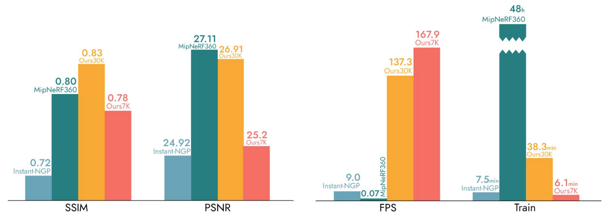
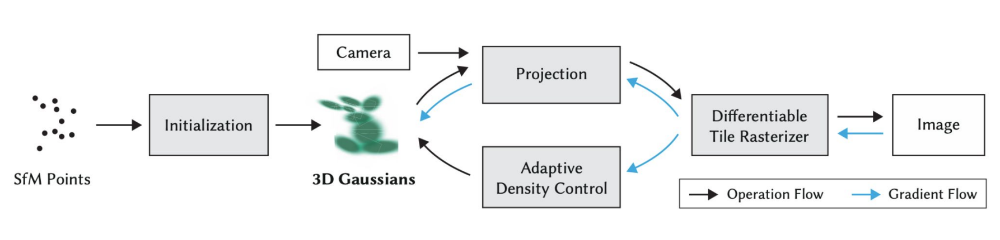
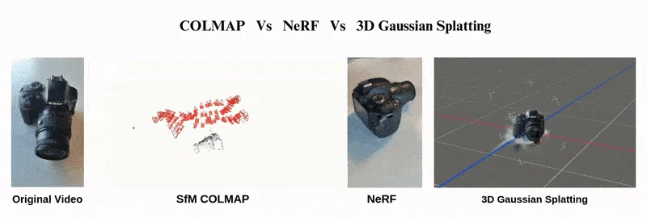
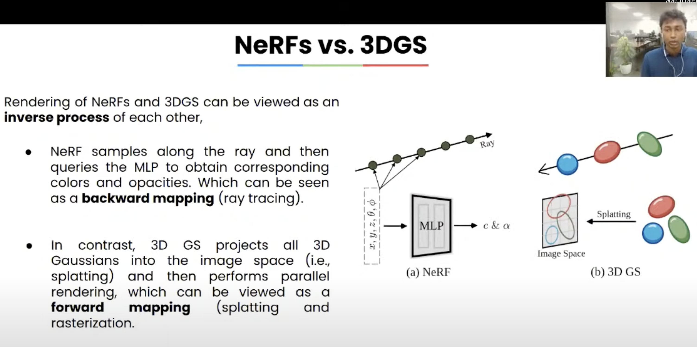
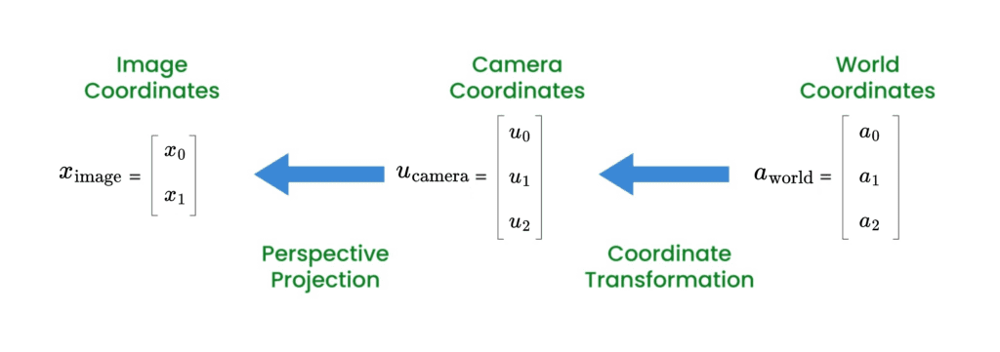
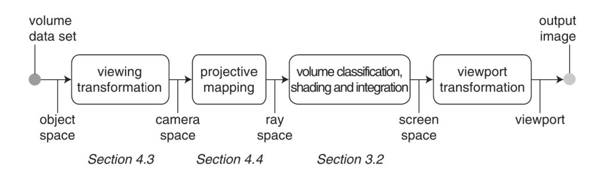
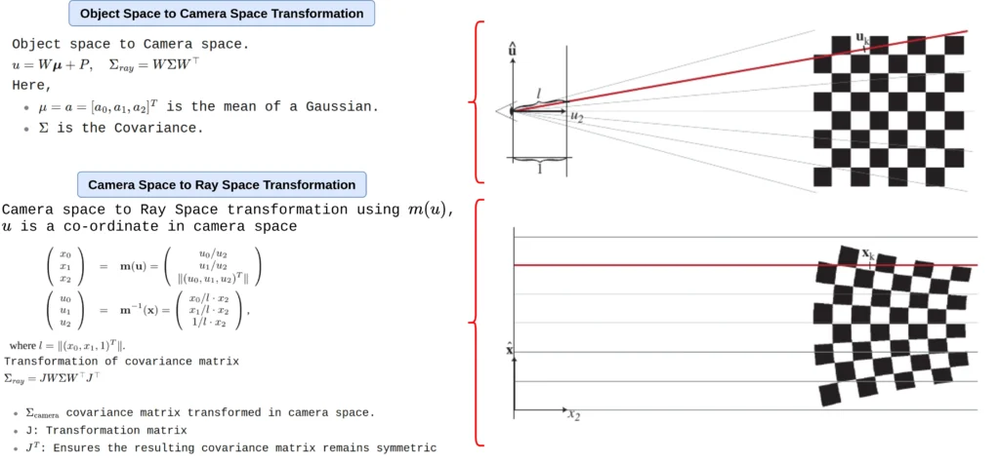
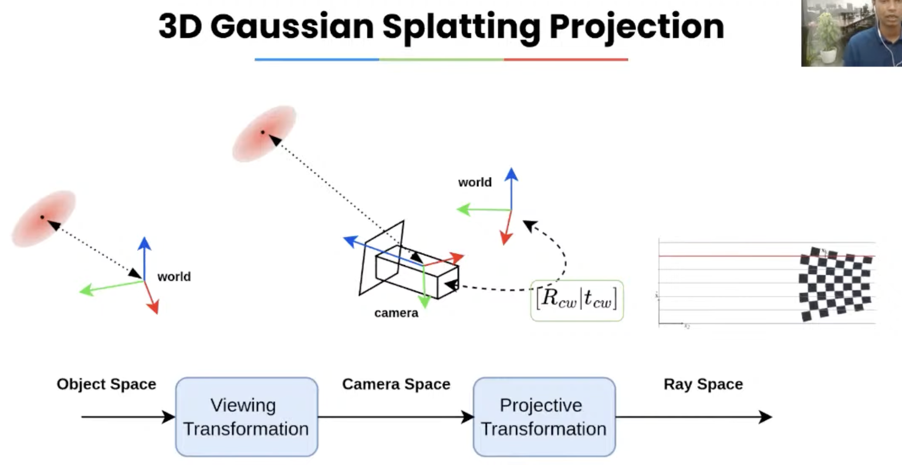
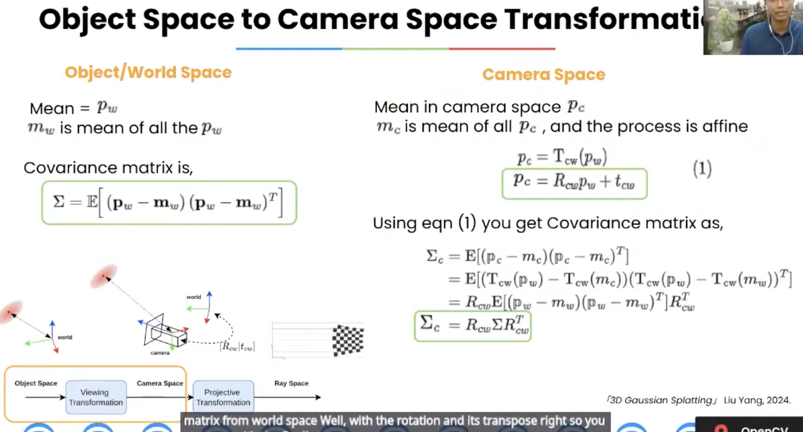

## 资源

https://3dgstutorial.github.io/ 

ppt: https://3dgstutorial.github.io/

[3DGS (3D Gaussian Splatting) 原理介绍](https://www.bilibili.com/video/BV1o4UUYbEdW/?share_source=copy_web&vd_source=f26f3b6f5d88e251cea5e8fa6c584e4a)

https://github.com/MrNeRF/awesome-3D-gaussian-splatting

3dgs历程：https://www.youtube.com/watch?v=DjOqkVIlEGY

精读：https://learnopencv.com/3d-gaussian-splatting/ 配套代码：https://github.com/spmallick/learnopencv/tree/master/3D-Gaussian-Splatting-Code/

## 3D GS原理理解

### NeRF到3D GS的演变

#### 简要回顾NeRF原理

- 由相机内参c2w和随机采样的像素pixels确定一条射线$r(t)=o+td$，沿射线采样
- 将采样点$x_i$的位置信息$(x, y, z)$和视角方向信息$(\theta, \varphi)$编码
- 输入神经网络【隐式辐射场】中预测采样点$x_i$的颜色与体密度信息
- 通过体渲染得到沿该射线$r(t)$可观测的最终颜色
- 根据渲染图与真实图的误差，梯度下降更新，优化神经网络参数

#### Point-NeRF：NeRF与<font color="brown">点云</font>的初遇

1. 神经点云：

   为每个点赋予**神经特征**，该特征代表对周围局部3D场景几何和外观的编码，CNN提取。

2. 体渲染过程：

   射线采样点周边搜索半径r内的点的**特征融合**，得到的特征解码得到采样点的颜色和体密度。

3. 自适应点云的生长和剔除：

   在射线具有**最高不透明度的位置**且周围没有点的情况下添加新点；每10k迭代，基于点位于物体表面的概率，设定阈值剔除无用点

#### Plenoxels：无神经网络NeRF+球谐函数

基于稀疏体素网格表示场景，每个体素格点存储体密度和球谐函数系数，

射线采样点的颜色值和体密度，由其所在体素网格的八个格点 三线性插值计算。

**球谐函数**:

简称SH函数，可以看成球坐标系中的傅里叶级数，可用于拟合球面分布，例如光强，记录空间中某个点从不同方向看过去的不同颜色。阶数越高，拟合能力越强。

#### 3D Gaussian Splatting的简要介绍

3D Gaussian Splatting（3D高斯泼溅）

使用大量的3D高斯基元来表示场景，可视作<font color="brown">参数化点云</font>，每个基元有位置，大小，方向，颜色信息（球谐函数系数）和不透明度等信息。

渲染速度有很大优势：




### 3D GS原理介绍

#### 3D GS框架图介绍



3D GS高斯椭球形状为什么受协方差矩阵控制？

3D GS高斯椭球如何从3D空间投影到2D空间？

3D GS基于图像块（Tile）的光栅化图像渲染


#### 技术回顾

##### 0-摄影测量、NeRF 与 3D 高斯泼溅的对比

基于多视角的三维重建一直是三维视觉与图形领域的长期难题！它的目标是根据从不同视角拍摄的一组二维图像来生成场景的三维表示。

经典的解决方案是 **摄影测量（Photogrammetry）**。
 然而在 2020 年，**Neural Radiance Fields（NeRF）** 出现，提供了一种更具真实感与更强鲁棒性的替代方案。
 尽管 NeRF 推动了巨大进步，但它仍然存在一些限制，例如：

- 渲染速度慢
- 存在伪影 / 浮点噪声（floaters）
- 难以有效重建较大规模场景
- 等等

最终，在 2023 年，**3D Gaussian Splatting** 被提出，并成功解决了 NeRF 面临的许多问题。



##### 1-摄影测量

这一问题最初通过三维计算机视觉方法来解决，例如 **运动推断结构（SfM）**、**多视图立体（MVS）** 和 **稠密重建**。这些方法通常是基于特征点的：它们从输入图像中提取特征点，然后要么在整个图像序列中跟踪这些点，要么在新图像中重新提取特征点并尝试与先前关键帧（key-frames）中的特征进行匹配。

这些特征点随后用于计算 **本质矩阵（Essential Matrix）**，以推求相机位姿，然后再通过**三角测量（Triangulation）**获得场景的三维点。

摄影测量虽然具有**最高的几何精度**，但也存在一些缺点：

- 渲染速度较慢
- 难以处理反光或透明表面
- 在缺乏纹理的区域精度下降
- 重建点云中可能出现离群点（outliers）

我们也有一篇关于 [视觉 SLAM](https://learnopencv.com/monocular-slam-in-python/) 的详细文章和代码示例，它与 SfM 和 MVS 在思路上非常相似。

> [!NOTE]
>
> 相机轨迹 + 稀疏/稠密三维点云 = SfM(离线、多视角图像集)
>
> 稠密点云 / 网格 = MVS(已知相机位姿 + 图像)
>
> 实时相机/机器人位姿 + 可用的地图 = SLAM(连续传感器数据: 相机/IMU/LiDAR)
>
> SfM、MVS、SLAM之间的联系：
>
> - **SfM 得到相机位姿和稀疏点**
> - **MVS 在此基础上做稠密重建**
> - **SLAM 在实时条件下做类似 SfM 的事情**
>
> ```
>         SfM                  MVS
>   (相机位姿 + 稀疏点云)  →   (稠密重建)
> 				 ↑
>      SLAM（实时做 SfM，并形成可用地图）
> 
> ```

##### 2-NeRF (神经辐射场)

Neural Radiance Field（NeRF）用于三维重建和新视角合成。它是一个非常优雅的思想：使用一个**简单的 MLP 神经网络**结合 体渲染（volumetric rendering）技术来生成三维场景。
 NeRF 的核心基于 场景参数化 的概念。

尽管 NeRF 能生成**高度逼真的图像**并具有良好的几何精度，但它在处理**大规模场景**时会遇到困难，并且**渲染速度较慢**。

我们有一篇完整的文章专门介绍 [NeRF](https://learnopencv.com/annotated-nerf-pytorch/)，其中详细讲解了它的内部机制和 PyTorch 实现代码。

##### 3-3D高斯泼溅

3D Gaussian Splatting 是一种基于光栅化（Rasterization）的渲染方法，它能够在仅有少量输入图像的情况下，实现场景的**实时、照片级真实感渲染**。与传统光栅化使用三角网格不同，3DGS 使用**数以百万计的三维高斯分布**来表示场景。

整个过程通常如下：

1. **初始化高斯**：
    利用 **运动推断结构（SfM）** 生成的稀疏点云，初始化一组 3D 高斯分布。
2. **自适应密度控制（Adaptive Density Control）**：
    通过优化阶段不断调整高斯的数量、大小和位置，使其更好地拟合场景几何与外观。
3. **可微分的基于 Tile 的光栅化器（Tile-based Differentiable Rasterizer）**：
    用于高效渲染这些高斯，同时使训练过程可端到端优化。其训练速度可与最新的辐射场方法相媲美。

训练完成后，系统便可以对高度细节化、视觉效果逼真的 3D 场景进行**实时探索与交互**。

>  [!NOTE]
>
> 如果“**自适应密度控制**”、“**基于 Tile 的光栅化器**”等术语暂时不清楚，也不用担心——我们会在接下来的章节中详细解释这些概念 :)

#### 3D GS概览

##### 概览

3D 高斯点渲染（3D Gaussian Splatting）提出了一种基于光栅化（rasterization-based）的重建辐射场的方法。该方法既能得到高品质的重建效果，又具有显著的速度和性能优势，甚至适用于移动设备。我们不再需要在质量与速度之间做妥协，这一事实促使从业者构建大量工具和应用。3DGS（3D Gaussian Splatting）也已被集成到 Unity、Unreal、three.js 和 NeRFStudio 等框架中。此外，利用 3DGS 展开的大量研究已经发表，涵盖不同主题：动态与人体重建、SLAM、三维生成模型（3D Generative Models）等许多方向。在本教程中，我们将首先解释 3DGS 及其为何迅速风靡研究界，接着给出在研究场景中使用若干有用工具的实用建议，并讨论该研究领域的进展。

> [!NOTE]
>
> **3D Gaussian Splatting（3DGS）**：想象把三维空间里的物体用大量小的、带有模糊边界的“高斯云点”（每个点像小模糊球）表示。渲染时把这些云点投影到图像上并混合，得到最终画面。
>
> **基于光栅化（rasterization-based）**：光栅化是一种从几何（点、线、三角形）快速生成像素图像的传统渲染方法，常用于实时渲染（比如游戏）。这里意味着 3DGS 使用类似游戏中那种把东西快速变成像素的方法来做重建，而不是更慢的逐光线跟踪方法。
>
> **重建辐射场（radiance field）**：辐射场可以理解为“从任意位置和方向看，场景应当发出怎样的光”，也就是能合成新视角图像的隐式场表示。NeRF（神经辐射场）就是这类概念的典型代表。
>
> **整体意思**：这句说的是 3DGS 提出用“高斯云点 + 光栅化”的方式来重建那种能合成新视角图像的光照／颜色场。

> [!TIP]
>
> **传统光栅化**：会计算每个三角形在屏幕上的位置（即透视投影），确定其覆盖的像素范围，并为这些像素记录颜色、深度等属性，存入 Z-buffer。当新的三角形绘制到同一像素时，比较深度值，只保留距离相机更近的那个。最终，再根据 Z-buffer 中的光照、材质、法线等信息计算每个像素的最终颜色。
>
> **3DGS 中的光栅化：**同样会计算每个高斯体在屏幕上的位置（即透视投影），但 3DGS 不使用传统的“硬性遮挡”式 Z-buffer。由于高斯体是半透明、具有体积感的元素，多个高斯在重叠时，其颜色会**按深度连续混合（blending）**，而不是“前者覆盖后者”。渲染时，3DGS 会根据每个高斯的颜色、透明度和深度等属性，对它们进行深度排序与 α 混合，逐层累积，得到最终像素颜色。
>
> 简而言之，传统光栅化强调表面可见性（只渲染最前方的几何），而 3DGS 的光栅化强调体积累积效应（所有高斯对最终颜色都有贡献）。与传统渲染依赖“材质 + 灯光”模型不同，3DGS 直接学习场景的整体外观，也就是辐射场本身。基础版的 3DGS 不需要显式的光照、材质或法线信息，因为大多数数据集的光照条件是固定的；不过，一些扩展变体会在此基础上进一步显式建模光照或表面属性。

对于熟悉传统计算机图形学的人来说，NeRF 从概念上更接近光线追踪（ray tracing）技术，而 3DGS 概念上更接近光栅化（rasterization）技术。前者backward mapping，基于光线追踪的体积采样。后者forward mapping，一批高斯体进行 $\alpha$混合，基于光栅化的体积投影。 



##### 要点

3D Gaussian Splatting（3DGS）的实现包含许多关键且精细的步骤，理解这些步骤对于掌握其工作原理非常重要。其核心内容包括：

- 将三维高斯投影到二维图像平面上
- 优化高斯，使其能够精确表达场景
- 对三维高斯进行自适应密度控制
- 将高斯在二维图像平面上进行高效渲染
- 使用球谐函数（Spherical Harmonics）实现视角相关的外观表示

| 术语                                | 总结                                                 |
| ----------------------------------- | ---------------------------------------------------- |
| **投影**                            | 决定高斯在屏幕上的二维形状和位置                     |
| **渲染**                            | 决定如何把高斯真正画到图像上                         |
| **优化高斯**                        | 优化每个高斯的参数以拟合真实场景                     |
| **密度控制**                        | 增减高斯数量以提高场景模型质量与效率                 |
| **球谐函数（Spherical Harmonics）** | 让高斯的颜色与亮度随观察视角变化而改变，使画面更真实 |

我们将对这篇3DGS论文进行详细的梳理，依次讲解上述关键点，并带你一步一步推导相关公式和计算过程。

让我们开始深入探索吧！

#### 3D GS要点详解

##### 投影

通常，三维数据主要有三种常用的表示方式：点云（point clouds）、网格（meshes）和体素网格（voxel grids）。在这些表示中，传统的光栅化方法通常基于网格进行渲染，而网格一般使用三角形作为基本元来表示三维场景。然而，对于像头发、毛发、烟雾这类具有**体积细节（volumetric details）**的对象，用三角形来表现往往困难重重；并且传统光栅化方法在处理大型或高精细网格时，会占用大量的内存和计算资源。

为了解决这些问题，作者需要一种既**可微分（differentiable）**、又能够支持**高速渲染**的基本表示元件（primitive）。作者选择了 **3D 高斯（Gaussian）** 作为场景表示，它由一个三维协方差矩阵 $\Sigma$ 定义，并以均值 $\mu$ 为中心。这些高斯不仅是可微分的，还可以方便地投影到二维，形成 **2D splats（斑点）**，并通过高效的 **α-混合（alpha-blending）** 实现渲染。


##### 传统渲染管线

**传统的图像生成（Traditional Image Formation）**

假设我们已经使用 **3D 高斯分布（3D Gaussians）** 表示了三维场景。 
那么，接下来我们该如何从这个三维场景生成一张二维图像（渲染）呢？ 
其实，这个过程与 **传统的图像成像原理** 类似，主要包括以下步骤：  

<p align="center">
  
  <br>
  <b>Figure 5:</b> Traditional Image Formation
</p>

---

**1. 坐标变换（Coordinate Transformation）**

这一步是将点从 **世界坐标系（world/object space）** 转换到 **相机坐标系（camera space）**。 
该变换由 <font color="brown">**外参矩阵（extrinsic matrix）**</font>完成，其中 $R$ 表示旋转矩阵，$T$ 表示平移向量。 
它们一起描述了相机与世界之间的线性（仿射）变换关系。  

设：  
- $a_{\text{world}} = [a_0, a_1, a_2]$：世界坐标系中的一点  
- $u_{\text{camera}} = [u_0, u_1, u_2]$：对应的相机坐标系中的点  

它们的关系为（仿射变换）：  

$$
u_{\text{camera}} = E_{\text{world}}^{\text{camera}} \, a_{\text{world}} = R a_{\text{world}} + T
$$

---

**2. 相机投影（Camera Projection）**

接下来是将三维的相机坐标（camera space）投影到二维的图像坐标（screen/image space）。 
这个变换由 <font color="brown">**内参矩阵（intrinsic matrix）** $K$ </font>实现。  

矩阵 $K$ 由 **焦距（focal length）** 与 **光学中心（optical center）** 组成：  

$$
c_x = W / 2, \quad c_y = H / 2
$$

其中 $W, H$ 分别为图像的宽和高。  


通过该投影矩阵，就可以将 3D 空间中的点映射到相机平面的 2D 像素坐标上。  

---

是不是很简单？ 
实际上，**3D Gaussian Splatting** 也是基于非常相似的成像管线来工作的。 
接下来我们看看它是如何应用这一过程的！

##### 仿射变换矩阵

> [!NOTE]
>
> ###### 🧭 仿射变换矩阵中的 R：旋转、缩放、剪切的几何意义与分解
>
> | 维度          | 变换矩阵 | 向量         | 能表示的变换           |
> | ------------- | -------- | ------------ | ---------------------- |
> | 2D            | 2×2      | (x, y)       | 旋转、缩放、剪切       |
> | 2D (齐次坐标) | 3×3      | (x, y, 1)    | 旋转、缩放、剪切、平移 |
> | 3D            | 3×3      | (x, y, z)    | 旋转、缩放、剪切       |
> | 3D (齐次坐标) | 4×4      | (x, y, z, 1) | 旋转、缩放、剪切、平移 |
>
> 1️⃣ 仿射变换结构
>
> 在齐次坐标中：
>
> $$
> T =
> \begin{bmatrix}
> R & t \\
> 0 & 1
> \end{bmatrix}
> $$
>
> - $R$：3×3 线性部分（旋转 + 缩放 + 剪切）  
> - $t$：平移向量
>
> ---
>
> 2️⃣ R 矩阵的几何意义
> $$
> R =
> \begin{bmatrix}
> | & | & | \\
> r_1 & r_2 & r_3 \\
> | & | & |
> \end{bmatrix}
> $$
>
> 每一列 $r_i$：表示原坐标轴在新空间的方向与长度。
>
> 🌀 旋转（Rotation）
>
> - 若 $R^T R = I$ 且 $\det(R)=1$：表示纯旋转  
> - 各轴保持垂直、长度不变（刚体绕原点旋转）
>
> 例子：绕z轴的二维旋转：
> $$
> R_z(\theta)=
> \begin{bmatrix}
> \cos\theta & -\sin\theta & 0\\
> \sin\theta & \cos\theta & 0\\
> 0 & 0 & 1
> \end{bmatrix}
> $$
>
> ###### 📏 缩放（Scaling）
> - 对角矩阵表示独立缩放：
>
> $$
> R=
> \begin{bmatrix}
> s_x & 0 & 0\\
> 0 & s_y & 0\\
> 0 & 0 & s_z
> \end{bmatrix}
> $$
>
> - 改变轴长度，不改变方向
>
> 🔶 剪切（Shear）
>
> - 非对角元素非零时表示剪切（改变轴间夹角）
>
> $$
> R=
> \begin{bmatrix}
> 1 & k_{xy} & 0\\
> 0 & 1 & 0\\
> 0 & 0 & 1
> \end{bmatrix}
> $$
>
> ---
>
> 3️⃣ 已知 R，如何分解出旋转、缩放、剪切
>
> 目标：
>
> $$
> R = R_{\text{rot}} \cdot R_{\text{shear}} \cdot R_{\text{scale}}
> $$
>
> 或常用极分解形式：
>
> $$
> R = R_{\text{rot}} \cdot S
> $$
>
> 其中 $S$ 含缩放 + 剪切。
>
> ✅ 极分解（Polar Decomposition）
> $$
> S = \sqrt{R^T R}, \quad R_{\text{rot}} = R S^{-1}
> $$
> - $R_{\text{rot}}$：旋转矩阵  
> - $S$：对称矩阵（缩放+剪切）
>
> ✅ 奇异值分解（SVD）
> $$
> R = U \Sigma V^T
> $$
> - $U, V$：正交矩阵（旋转）  
> - $\Sigma$：对角矩阵（缩放）
>
> 取：
>
> $$
> R_{\text{rot}} = U V^T,\quad R_{\text{scale}} = \Sigma
> $$
>
> ✅ QR / RQ 分解
> $$
> R = R_{\text{rot}} \cdot R_{\text{upper}}
> $$
> - $R_{\text{rot}}$：旋转  
> - $R_{\text{upper}}$：上三角矩阵（缩放+剪切）  
> 常用于相机标定。
>
> ---
>
> 4️⃣ 伪代码：
>
> 如何分解$R$：
> $$
> R =
> \begin{bmatrix}
> a_{11} & a_{12} & a_{13} \\
> a_{21} & a_{22} & a_{23} \\
> a_{31} & a_{32} & a_{33}
> \end{bmatrix}
> $$
>
> ```python
> # Step 1: 提取列向量
> x = [a11, a21, a31]
> y = [a12, a22, a32]
> z = [a13, a23, a33]
> 
> # Step 2: 计算缩放（scale）
> s_x = ||x||
> x = x / s_x
> 
> # Step 3: 计算剪切（shear_xy）
> shear_xy = dot(x, y)
> y = y - shear_xy * x
> s_y = ||y||
> y = y / s_y
> shear_xy = shear_xy / s_y
> 
> # Step 4: 计算剪切（shear_xz, shear_yz）
> shear_xz = dot(x, z)
> shear_yz = dot(y, z)
> z = z - shear_xz * x - shear_yz * y
> s_z = ||z||
> z = z / s_z
> shear_xz = shear_xz / s_z
> shear_yz = shear_yz / s_z
> 
> # Step 5: 计算旋转矩阵
> R_rot = [x, y, z]  # 每一列是单位方向向量
> ```
>
> `R_rot`：旋转矩阵（正交）
>
> `s_x, s_y, s_z`：缩放因子
>
> `shear_xy, shear_xz, shear_yz`：剪切量
>
> ---
>
> 5️⃣ 总结表
>
> | 成分 | 数学特征          | 几何意义 |
> | ---- | ----------------- | -------- |
> | 旋转 | 正交矩阵 $R^TR=I$ | 改变方向 |
> | 缩放 | 对角矩阵          | 改变长度 |
> | 剪切 | 上三角非对角项    | 改变夹角 |
> | 平移 | 向量 $t$          | 改变位置 |
>
> ---
>
> 🧠 **要点**
> - $R$ 同时编码旋转、缩放、剪切；单看元素无法直接区分。  
> - 常用分解方法：**极分解（Polar）**、**SVD**、**RQ/QR**。  
> - 实践中优先用极分解或 SVD 来分离旋转与形变（缩放/剪切）。


##### 高斯泼溅中的3D 到 2D 的投影

###### 视角变换

假设我们需要将一个三维高斯分布  $ \mathcal{N}(x, \Sigma) $ 投影到二维空间。

如前文所述，第一步是 **仿射变换**：

$$
\phi(x) = W a + P
$$

其中：

- $W$ 是一个 $3 \times 3$ 的旋转矩阵（rotation matrix）
- $P$ 是一个 $1 \times 3$ 的平移向量（translation vector）

这个变换会将三维空间中的点：

$$
\mathbf{a} = [a_0, a_1, a_2]^T
$$

从 **物体坐标系（object space）** 映射到 **相机坐标系（camera space）**。

对于高斯分布，有以下对应关系：

<font color="brown">$a \sim \mathcal{N}(\mu, \Sigma) \rightarrow \phi(a) \sim \mathcal{N}(W \mu + P, W \Sigma W^T)$</font>

这里：

- $u = \phi(a) = [u_0, u_1, u_2]^T$，表示相机坐标系中的三维点  
- $\Sigma_{\text{camera}} = W \Sigma W^T$，表示在相机空间中经过仿射变换后的协方差矩阵  

在完成这个变换之后，并不会立刻进行相机投影（Camera Projection）。  
在此之前，还会有一个中间步骤，称为 **光线空间变换（Ray Space Transformation）**，记为 $m(u)$。 

>   [!IMPORTANT] 
>
> 请注意：这一步仍然是 **3D → 3D 的映射**。

这种前向渲染（Forward Rendering）流程最早由论文 **“EWA Volume Splatting”** 引入， 其中 **EWA** 指的是 *Elliptical Weighted Average*（椭圆加权平均）。

###### 投影变换

<p align="center">
  
  <br>
  <b>Figure 6:</b> Forward Rendering Pipeline from Paper “EWA Volume Splatting”
</p>

EWA Volume Splatting 这篇论文引入了一个额外的空间（坐标系），称为 **光线空间（Ray Space）**。
 在这个坐标系中，所有<font color="brown">光线都被对齐为与某一坐标轴平行</font>，从而使得沿光线方向进行<font color="brown">积分</font>变得更加容易。

<p align="center">
  
  <br>
  <b>Figure 7:</b> Object Space to Ray Space Transformation
</p>
可以看到，这里的 **Ray Space（光线空间）变换是非线性的**，  
因为它涉及将相机坐标的水平与垂直分量分别除以深度：

- $x_0 = u_0 / u_2$
- $x_1 = u_1 / u_2$

正由于这种除法操作，这个映射不再是线性的，因此我们 **无法直接应用仿射变换的规则**。

为了解决这个问题，我们在均值点 $\mathbf{u}_k$ 附近 
对映射 $\mathbf{m}(\mathbf{u})$ 进行 **一阶泰勒展开（first-order Taylor expansion）**， 从而对其进行线性化处理。

$\mathbf{m}_{\mathbf{u}_k}(\mathbf{u})
= \mathbf{x}_k + \mathbf{J}_{\mathbf{u}_k} \, (\mathbf{u} - \mathbf{u}_k)$

$\mathbf{J}_{\mathbf{u}_k}
= \frac{\partial \mathbf{m}}{\partial \mathbf{u}}(\mathbf{u}_k), \quad x_k = m(u_k)$


###### 线性化投影：泰勒展开与雅可比矩阵

当从相机坐标 $u=[u_0,u_1,u_2]^T$ 映射到光线空间 $m(u)$ 时，由于该变换包含非线性除法：

- $x_0 = \frac{u_0}{u_2}$
- $x_1 = \frac{u_1}{u_2}$

因此 **不能直接对高斯应用仿射变换规则**。

为处理高斯在非线性函数下的投影，我们对 $m(u)$ 在均值点 $u_k$ 处进行一阶泰勒展开，将其近似为局部线性变换：

$$
m_{u_k}(u) = x_k + J_{u_k} \,(u - u_k)
$$

其中：

- $x_k = m(u_k)$ 为映射后的中心点  
- $J_{u_k}$ 为雅可比矩阵：

$$
J_{u_k} = \frac{\partial m}{\partial u}(u_k)
$$

为什么需要这个公式？

高斯经过线性变换时仍然保持高斯性质； 但 **非线性变换会破坏高斯形式**。

为了继续把 3D 高斯投影为 2D 高斯，需要将非线性函数 $m(u)$ 在局部区域**线性化**。 
一阶泰勒展开正是最常用的线性化方法：
$$
f(x) \approx f(a) + f'(a)(x-a)
$$

在多维情况下，导数变为 **雅可比矩阵**（Jacobian）。
$$
J =
\begin{bmatrix}
\frac{\partial x_0}{\partial u_0} & \frac{\partial x_0}{\partial u_1} & \frac{\partial x_0}{\partial u_2} \\
\frac{\partial x_1}{\partial u_0} & \frac{\partial x_1}{\partial u_1} & \frac{\partial x_1}{\partial u_2} \\
\frac{\partial x_2}{\partial u_0} & \frac{\partial x_2}{\partial u_1} & \frac{\partial x_2}{\partial u_2}
\end{bmatrix}
$$

> [!NOTE]
>
> 雅可比矩阵的意义
>
> 雅可比矩阵 $J$ 是多变量函数的梯度推广，描述函数在局部的 **线性变化率**。  
>
> 若 $m(u)$ 是从 $\mathbb{R}^3 \to \mathbb{R}^3$ 的映射，则雅可比为 $3\times 3$ 矩阵：
>
> - 第 $i$ 行表示输出分量 $m_i$
> - 第 $j$ 列表示对输入 $u_j$ 的偏导
>
> 因此 $J$ 表示在点 $u_k$ 附近，输出如何随输入线性变化。  
> 用于把非线性变换近似为局部的线性变换，从而可以继续对高斯分布做协方差变换。

协方差矩阵在 Ray Space 中的变换  

（Covariance Matrix Transformation in Ray Space）

我们已经理解了：一个三维点（均值）在经过 Ray Space 的投影映射后是如何变化的。 
那么问题来了：**协方差矩阵（Covariance Matrix）如何变化？** 
也就是说：从 Camera Space 映射到 Ray Space 时，高斯分布的形状如何被变换？

接下来通过几个步骤说明这一点。

1. 从 3D 到 2D 的高斯投影  

   二维投影会把一个 **3D 高斯分布** 转换成 **2D 高斯分布**。 
   投影后的协方差矩阵为：

$$
\Sigma' = J \, \Sigma_{\text{camera}} \, J^T
$$

2. 代入从三维物体空间到相机空间的变换  

   已知相机空间中的协方差是：

$$
\Sigma_{\text{camera}} = W \Sigma W^T
$$

其中：  
- $W$：从物体空间到相机空间的旋转矩阵  
- $\Sigma$：原始 3D 高斯的协方差矩阵  

代入可得投影后的协方差：
$$
\Sigma' = J \,(W \Sigma W^T)\, J^T
$$


- $$\Sigma_{\text{camera}}$$ 表示从物体空间变换到相机空间后的协方差矩阵。
- **J**：用于将光线空间变换到屏幕空间的变换矩阵。
- **J^T**：用于确保最终得到的协方差矩阵保持对称（协方差矩阵的重要性质）。

总结一句话

高斯分布在坐标变化下的协方差变换遵循：

$$
\Sigma' = A \Sigma A^T
$$

在 3D Gaussian Splatting 中，这个 $A$ 对应的是：

$$
A = J W
$$

即：先从物体坐标 → 相机坐标，再从相机坐标 → 光线坐标

总结：

- 光线空间变换 $m(u)$ 是非线性的  
- 高斯无法直接应用非线性变换  
- 使用一阶泰勒展开将 $m(u)$ 线性化  
- 雅可比矩阵提供局部的线性近似  
- 线性化后可以用线性高斯变换规则继续计算协方差与投影

这种方法使 3D Gaussian Splatting 可以在非线性投影下仍保持渲染的解析性与可微性。


> [!NOTE]
>
> 泰勒展开解释（Taylor Expansion Explained）
>
> 这里简单回顾一下泰勒展开和雅可比矩阵。
>
> **泰勒展开（Taylor expansion）** 是一种用于将非线性函数在某个特定点 \( x = a \) 附近进行 **线性近似** 的数学工具。 
> 它通过使用函数在该点的导数（高阶导数）构成的一系列项，来构建对原函数的近似表达。
>
> <font color="brown">$f(x) \approx f(a) + {f}'(a)(x-a)$</font>
>
> - $f(a)$：函数在点 **a** 处的取值，是泰勒近似中的常数项。
> -  ${f}'(a)(x − a)$：线性项，表示当 **x** 在 **a** 附近变化时，函数的变化趋势。
>
> 这实际上形成了一条在 \(x = a\) 处与函数相切的直线，使其成为一个局部近似，并且当 \(x\) 接近 \(a\) 时效果很好。


由于这个设计，我们不需要像 NeRF 那样在每条光线上进行点采样。

>  [!NOTE]
>
> EWA 体素散射（volume splatting）论文中提到：
>
> “高斯在仿射映射和卷积下是闭合的，沿某一个坐标轴对三维高斯积分会得到二维高斯。”
>
> 因此，如果我们跳过 $\Sigma'$ 的第三行和第三列，就可以得到一个 $2 \times 2$ 的方差矩阵（$\hat{\Sigma'}$），它的结构和性质与从平面点及法向量开始得到的结果相同。

当我们**沿某个坐标轴（通常是视线方向 z 轴）积分**或者忽略这一轴时，相当于投影到 2D 屏幕空间：
$$
\Sigma' =
\begin{pmatrix}
a & b & c \\
b & d & e \\
c & e & f
\end{pmatrix}
\quad \Longleftrightarrow \quad
\hat{\Sigma'} =
\begin{pmatrix}
a & b \\
b & d
\end{pmatrix}
$$
总结

从光线空间到屏幕空间的最终变换，则负责生成最终的渲染图像，包括深度（depth）、颜色（color）以及光照（shading）。

###### 协方差矩阵的必要性质

| 性质              | 直观含义                        | 为什么协方差矩阵必须满足 |
| ----------------- | ------------------------------- | ------------------------ |
| **对称**          | (X) 和 (Y) 的相关程度与顺序无关 | Cov(X,Y) = Cov(Y,X)      |
| **正半定（PSD）** | 任意线性组合的方差不会是负数    | 方差永远 ≥ 0             |

因此协方差矩阵 **必须同时具备对称性 + 正半定性**，否则就不再是一个合法的协方差矩阵。

> [!TIP]
>
> - 早期中文数学教材 也称之为 半正定
> - 若一个对称矩阵所有特征值 ≥ 0，则它是正半定（PSD）。

**3D 高斯到椭球**

 协方差矩阵只有在正半定（PSD, Positive Semi-Definite）的情况下才具有物理意义。然而，在优化协方差矩阵 (Σ\SigmaΣ) 以在辐射场中表示 3D 高斯时，作者使用了梯度下降的方法。这种方法会使得确保矩阵保持有效变得具有挑战性，因为更新步骤和梯度很容易生成无效的协方差矩阵。那么，我们如何表示 Σ\SigmaΣ，才能在优化过程中保证它始终保持正半定呢？”

为了解决这个问题，作者将 3D 高斯表示为一个 **3D 椭球**，因为 3D 高斯的协方差矩阵 Σ\SigmaΣ 编码了形状、大小和朝向，这些信息共同定义了 3D 空间中的一个椭球。其中：

1. Σ\SigmaΣ 的特征值决定了椭球主轴的长度；
2. Σ\SigmaΣ 的特征向量决定了这些主轴在 3D 空间中的朝向。

#### 3D GS技术解读

一个三维高斯（3D Gaussian）由一个三维协方差矩阵 $\Sigma$ 定义，并以点（均值）$\mu$ 为中心。

可学习的参数包括：

1. 均值（Mean）
2. 各向异性协方差（Anisotropic Covariance）
3. 不透明度（Opacity）
4. 球谐系数（Spherical Harmonic, SH coefficients）

深入理解 3D 高斯溅射

3D 高斯溅射是一种**光栅化（rasterization）技术**，它使用数百万个高斯分布来表示场景，而不是使用三角形。

主要步骤包括：

#####  **步骤 1：初始化（Initialization）**

无论我们从运动结构中找到什么点云，我们用它作为初始化。我们所做的就是使高斯的均值等于点的坐标。

#####  **步骤 2：优化（Optimization）**

自适应密度控制（Adaptive Density Control）——动态调节高斯的数量与分布密度。

优化目标：

- 控制高斯数量，防止密度过高；
- 自适应地删除冗余高斯或分裂新高斯；
- 保持视觉质量不变的情况下优化渲染效率。

它本质上是一个 **密度正则化 + 动态采样平衡** 过程。

具体操作：

1. Pruning（剪枝）：移除不重要或冗余的高斯。

2.  Densification（增密）：在场景细节不足或几何结构复杂区域**增加高斯数量**。分为克隆和拆分两种方式。

   

   **触发条件**

   - 欠重建：局部渲染误差或该高斯的梯度（对 loss 的贡献）持续较高 → 标记为需要克隆。
   - 过重建：单个高斯的空间尺度（variance）远大于邻域平均、或该高斯在多个视图投影时覆盖范围异常、或边界贡献下降 → 标记为需要拆分。
   - 剪枝：opacity 很低且梯度/贡献几乎为零，或长期不被采样/不贡献像素 → 删除。

   **实现细节**

   - Clone（克隆）：复制参数（position, scale, orientation, color, alpha），给子副本加小扰动（位置 jitter、尺度小缩放、颜色微扰），在之后的优化中允许它们独立更新。
   - Split（拆分）：把一个高斯分成 2（或更多）个子高斯，通常子高斯初始继承父参数但把尺度调小、位置做双向小偏移；也可以把父的权重按比例分配到子高斯上。
   - Prune（剪枝）：安全地删除前请做平滑策略（比如标记、延迟删除若干步，以免误删短暂不贡献的高斯）。

> [!NOTE]
>
> 这儿自适应密度控制的优化方法，属于一种Heuristic（启发式方法） = 一种帮助我们发现或解决问题的经验性方法。
>
> 它并不保证最优解、完美性或严格证明的正确性，
>  但在复杂、搜索空间巨大或无解析解的情况下，
>  **能“比较快地找到一个够好的解”。**


#####  **步骤 3：光栅化（Rasterization）**

得到渲染图像，可以用于和GT计算损失。

3D立体图形（Gaussians）如何投影到2D平面（camera plane）上？

3D高斯泼溅投影 取自 《EWA volume splatting》这篇文章。

> [!NOTE]
>
> "Gaussians are closed under affine mappings and convolution, and integrating a 3D Gaussian along one coordinate axis results in a 2D Gaussian."  —— EWA （Elliptical Weighted Average） volume splatting
>
> “高斯函数在仿射变换和卷积运算下是封闭的，并且将一个三维高斯在某一坐标轴上积分后，得到的结果仍然是一个二维高斯。” —— EWA（基于椭圆加权平均的）体积溅射

这体现了高斯分布在积分/投影运算下的**封闭性（closure property）**：
 积分或投影不会破坏其高斯形态，只是维度降低。这个性质非常重要：

- 每个 3D 高斯在被投影到 2D 图像平面时（相当于沿视线方向积分）会变成一个 **2D 高斯**；
- 因此可以用解析的二维高斯来表示它在屏幕上的光照/颜色分布，而不必进行数值采样。

👉 这就是 3D Gaussian Splatting 能高效渲染的理论基础之一。

> 高斯分布的有趣之处，在于它们在数学上如此优美。通常，无论你对高斯函数做什么，最终得到的仍然是高斯函数。



###### 步骤3.1 世界坐标系 到 相机坐标系

首先，从物体坐标 通过视图转换，本质上是一次仿射变换（乘旋转分量，加平移分量），转换到相机坐标下。



高斯分布就是由均值（位置）和协方差（分布）表示。

均值（$p_w \to p_c$）和协方差（$\sum \to \sum_c$）就都转换过来了。最后的公式很简单：

① <font color="brown">$p_c = R_{cw}p_w + t_{cw}$</font>

② <font color="brown">$\sum_c = R_{cw}\sum R_{cw}^T$</font>，这儿都是3x3的矩阵。

###### 步骤3.2 相机坐标系 到 光线坐标系

在相机坐标系（Camera Space）下，每个点 $p_c = (x, y, z)$ 都是在相机前方的三维空间中。
 渲染时，我们要把这个点投影到屏幕上的某个像素（也就是光线方向）。

为了更好地表示这种沿视线方向的投影过程，我们引入了一个中间坐标系——**Ray Space（光线空间）**

它的设计目的是：

- 把一个三维高斯的空间分布分解为：

  沿光线方向的分量；

  在屏幕平面上（垂直于光线）的分量；

- 这样可在光线方向上解析积分，得到投影后的  2D 协方差。

从相机空间到光线空间，是一个非线性变换（non-affine transformation）。


 **步骤 4：损失计算与更新（Loss Calculation & Updation）**

计算渲染图像和GT之间的损失，根据损失计算梯度，然后


#### 3D GS代码实践
