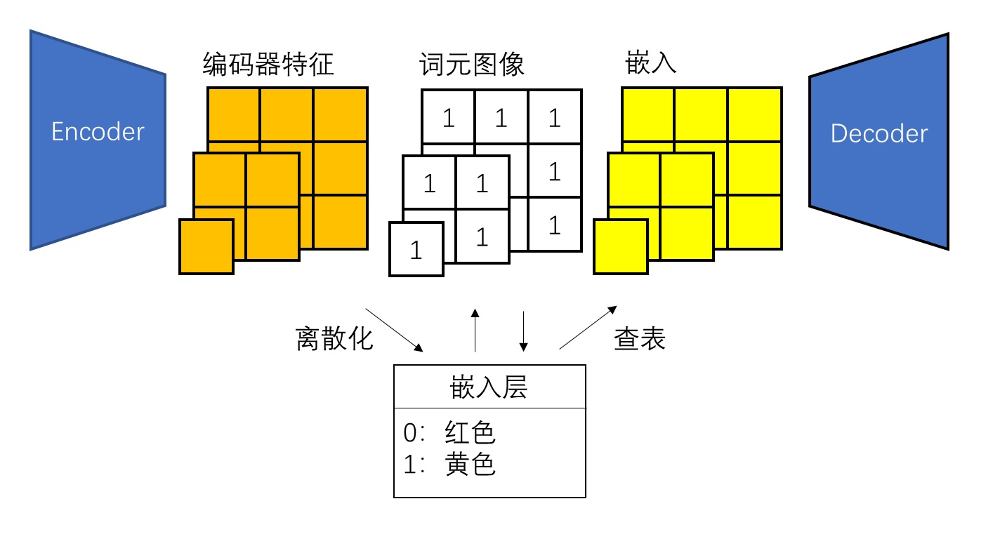

摘自 https://zhouyifan.net/2024/12/21/20241218-VAR/

#### VAE

回顾VAE

```python
def forward(self, x):
    encoded = self.encoder(x)
    encoded = torch.flatten(encoded, 1)
    mean = self.mean_linear(encoded)
    logvar = self.var_linear(encoded)
    eps = torch.randn_like(logvar)
    std = torch.exp(logvar / 2)
    z = eps * std + mean
    x = self.decoder_projection(z)
    x = torch.reshape(x, (-1, *self.decoder_input_chw))
    decoded = self.decoder(x)

    return decoded, mean, logvar
```

VAE一般是类似UNet的结构（不带跳跃连接）。编码器的输出是一个可学习的正态分布，即 正态分布的对数方差`logvar` 和 均值`mean` 由学习得到。

> 如果不做分布的约束，latent 只是一个记忆存储，而不是“分布”。 不同样本的 latent 向量可能分布在 latent 空间的各个角落，毫无规律。
>
> 只有 latent 空间连续且平滑，才能保证插值时不会跳到无效区域。

最后求loss时，除了图像的重建误差，就是该正态分布和标准正态分布的KL散度了。

```python
def loss_fn(y, y_hat, mean, logvar):
    recons_loss = F.mse_loss(y_hat, y)
    # 这是KL散度的特殊情形，高斯对高斯，所以有解析解，计算效率高：
    kl_loss = torch.mean(
        -0.5 * torch.sum(1 + logvar - mean**2 - torch.exp(logvar), 1), 0)
    loss = recons_loss + kl_loss * kl_weight
    return loss
```

$1 + logvar - mean^2 - torch.exp(logvar)$ 就是 $1+\log{σ_i^2}−μ_i^2−σ_i^2$，

最小化时，会让 $\mu \rightarrow 0$，$\sigma \rightarrow 1$，latent 分布接近标准正态 $N(0, I)$，

同时避免 σ² → 0，保证 latent 空间的连续性与多样性。

#### VQVAE/ VQGAN

VQGAN 背景知识： VQGAN = VQ-VAE + GAN  
将图像编码为离散 latent（token），借助 GAN 增强重建质量，兼顾压缩与生成能力。

---

🔧 模型结构

- **Encoder**：编码图像 $$x$$ 得到连续 latent 表征 $$z_e(x) \in \mathbb{R}^{H \times W \times D}$$
- **Vector Quantizer**：将 $$z_e(x)$$ 映射为离散 codebook 向量 $$z_q(x)$$
- **Decoder**：将 $$z_q(x)$$ 解码为重建图像 $$\hat{x}$$
- **Discriminator**：判别 $$\hat{x}$$ 是否真实，提高重建质量（GAN 结构）

---

🧩 向量量化（Codebook Lookup）

> 这整个过程就叫做<font color="blue">向量量化</font>。 所以这儿量化可不是我们平日理解的模型压缩里的比特量化 或 视频编码里的量化。

✅ Codebook 表示：
$$
e = \{ \mathbf{e}_k \}_{k=1}^K, \quad \mathbf{e}_k \in \mathbb{R}^D
$$

> 视觉模型里，可以看作与语言模型中的 Tokenizer对应

✅ 查找最近邻向量（L2 距离）：
$$
k^* = \arg\min_k \| \mathbf{z}_i - \mathbf{e}_k \|^2
$$

$$
z_q(x)_i = \mathbf{e}_{k^*}
$$

✅ 高效距离计算 trick：
$$
\| \mathbf{z} - \mathbf{e} \|^2 = \| \mathbf{z} \|^2 + \| \mathbf{e} \|^2 - 2 \cdot \mathbf{z}^\top \mathbf{e}
$$

---

🧮 损失函数组合
$$
\mathcal{L} = \mathcal{L}_{\text{rec}} + \mathcal{L}_{\text{VQ}} + \mathcal{L}_{\text{GAN}}
$$

1. **重建损失**（感知/像素）：
   $$
   \mathcal{L}_{\text{rec}} = \| x - \hat{x} \| + \text{Perceptual / PatchGAN Loss}
   $$

2. **Codebook 损失**（只更新 codebook 向量，stop-gradient是指梯度截断）：
   $$
   \mathcal{L}_{\text{VQ}} = \| \text{sg}[z_e(x)] - e \|^2
   $$

3. **Commitment 损失**（让 encoder 靠近 codebook）：
   $$
   \mathcal{L}_{\text{commit}} = \beta \cdot \| z_e(x) - \text{sg}[e] \|^2
   $$

4. **对抗损失（GAN）**：

   - PatchGAN 判别器对 decoder 输出打分；
   - 仅优化 decoder（非 codebook）。

注： $\mathcal{L}_{\text{VQ}}$ 与 $\mathcal{L}_{\text{commit}}$ 这两个损失的目标一致，只是作用的对象不一样，一个是影响编码器一个影响向量码本。这两个损失是 VQ 量化机制的**双向约束**，互相配合保证训练稳定，编码器和 codebook 共同适应数据分布。

---

📈 技术特点

| 特点             | 说明                                                  |
| ---------------- | ----------------------------------------------------- |
| 离散 latent 表征 | 支持 token 化、适配 Transformer                       |
| 高压缩能力       | encoder 输出空间维度降低，训练更高效                  |
| 感知细节丰富     | GAN 提供对纹理与结构的额外监督                        |
| 可组合性强       | 可作为图像 tokenizer 用于 DALL·E、VQ-Diffusion 等模型 |

#### 图像自回归生成

自回归（Autoregressive）是一种直观易懂的序列生成范式：给定序列前 个元素，模型输出第 个元素；把新元素添加进输入序列，再次输出第 个元素……。以下是文本自回归生成的一个示例：

```
（空）→ 从 
 从 → 从前
 从前 → 从前有
 从前有 → 从前有座
 从前有座 → 从前有座山
```

具体来说，模型的输出并不是下一个元素**应该**是什么，而是下一个元素**可能**是什么。也就是说，模型的输出是下一个元素的概率分布。

自回归生成仅适用于有顺序的序列数据。为了用自回归生成图像，我们需要做两件事：1）把图像拆分成一个个元素；2）给各个元素标上先后顺序。为此，最简单的做法是将图像拆成像素，并从左到右，从上到下依次生成像素。比如的经典自回归图像生成模型 PixelCNN。

为了加速 PixelCNN，可以借助图像压缩网络——自编码器，压缩出来的图像被称为隐图像（latent image）。

由于PixelCNN是预测类别分布，所以需要离散隐图像，这儿用到向量量化（vector quantization, VQ）操作。

综上，我们先训练自编码器 VQGAN，我们再把训练集的所有图像都转成隐图像，让 PixelCNN 学习生成隐图像。

#### 从词元预测到尺度预测

上述的传统图像自回归生成都是采用下一个词元预测策略：

- 将图像用自编码器拆成离散词元。
- 从左到右、从上到下按顺序逐个生成词元。

尽管通过自编码器的压缩，要生成的词元数已经大大减少，但一个个去生成词元还是太慢了。为了改进这一点，VAR 提出了一种更快且更符合直觉的自回归生成策略：

- 将图像用自编码器拆成多尺度的离散词元。比如，原来一张隐图像的大小为$16 \times 16$ ，现在我们用一系列尺度为$1 \times 1, 2 \times 2, ..., 16 \times 16$ 的由词元构成的图像来表示一张隐图像。
- 从最小的词元图像开始，从小到大按尺度生成词元图像。

在这种策略下，我们也得修改自编码器：多尺度残差量化自编码器

#### 多尺度残差VQVAE



最简单的做法是完全不修改编码器和解码器，还是让它们输入输出最大尺度的图片。只有在中间的向量量化部分，我们才把这些图片下采样：


VAR 用了一种更加高级的做法：用残差金字塔来表示这些隐空间特征。

参考 *Autoregressive Image Generation using Residual Quantization* 这篇，

拉普拉斯金字塔里：残差 = 复原 - 退化

这儿，我们将 退化定义为下采样+量化，复原定义为上采样+卷积

> 退化 定义 为下采样+量化，而不仅仅是下采样。这样可以降低量化的误差，提升 VQVAE 的重建精度。


这种做法不仅能高效地将特征拆解成多个尺度，还有一个额外的好处：原来 VQVAE 仅对最大尺度的特征做向量量化，量化后的误差会很大；而 VAR 把向量量化引入的误差分散到多尺度量化中，巧妙地降低了量化的误差，提升了 VQVAE 的重建精度。

> 我看RQ-VAE里设置了较大的 `codebook_size` （词表大小），和较小的`embedding_dim` （每个嵌入向量的维度）。 背后的动机可能是：用大量 code 来覆盖细节，减少单个 code 的容量，促进更精细的空间划分。

#### 下一尺度自回归生成

把图像压缩成多尺度词元图像后，剩下的事就很简单了。我们只需要把所有词元拆开，拼成一维词元序列，之后用 Transformer 在这样的序列上训练即可。由于现在模型的任务是下一尺度预测，模型会一次性输出同尺度各词元的概率分布，而不是仅仅输出下一个词元的。这样，尽管序列总长度变长了，模型的整体生成速度还是比以前快。

同时，随着预测目标的变更，自注意力的掩码也变了。现在同尺度的词元之间可以互相交换信息，只是前一尺度的词元看不到后面的词元。

> 但是博客的博主认为 下一尺度的词元 同时采样，有点不对劲，有缺陷。
>
> 同一个尺度的词元图像$r_k$的每个词元的分布并行生成，是认为每张词元图像的概率等于所有词元的概率的乘积，词元的分布之间是独立的。 
>
> $p(r_k \mid r_1, r_2, \cdots, r_{k-1}) = \prod_{I_k}^{i=1}p(r_k^i\mid r_1, r_2, \cdots, r_{k-1}) $，$r_k^i$表示第$k$个尺度的第$i$个词元，$I_k$ 为第$k$个尺度的词元总数。
>
> 但实际并非如此，会产生误差，理论上会导致图像出现不连贯的地方。
>
> 但是，为什么 VAR 的输出结果那么正常呢？博主认为两项设计提升了图像的连续性：
>
> - VAR 的自编码器使用了向量量化操作。这个操作会让解码器的输入总是合理的，解码器也总是会输出连贯的图像。
> - 在生成一个新尺度的图像时，模型输入会被初始化成之前尺度的图像的 bicubic 上采样。bicubic 采样保证了词元嵌入之间的连续性。
>
> 不过我认为一方面并行生成提高速度，是值得的。另一方面视作一种超分，这是常见做法。

