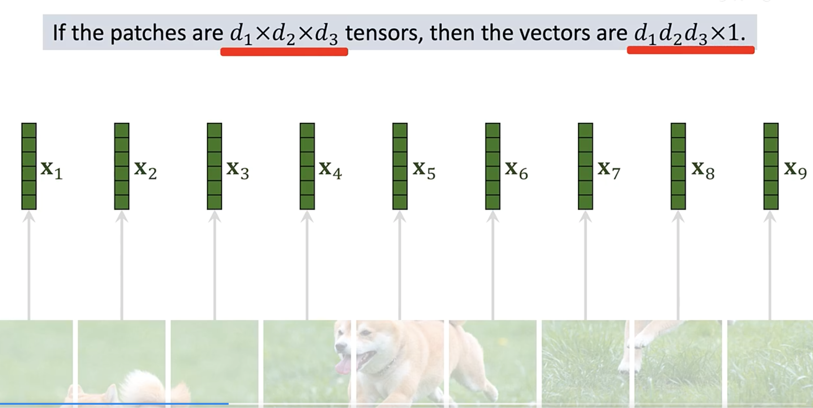
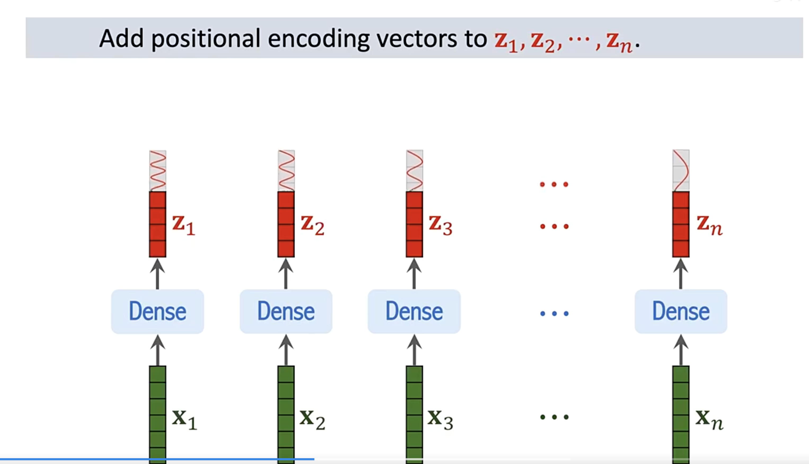
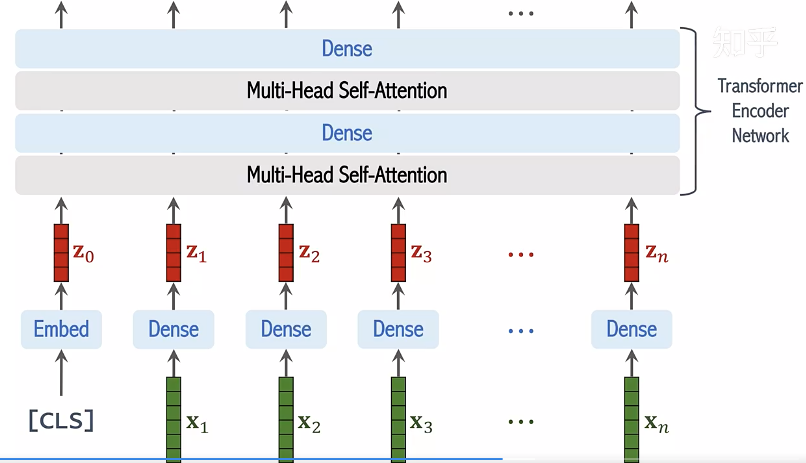
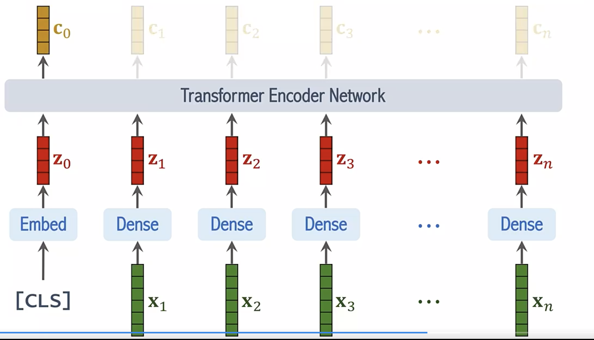
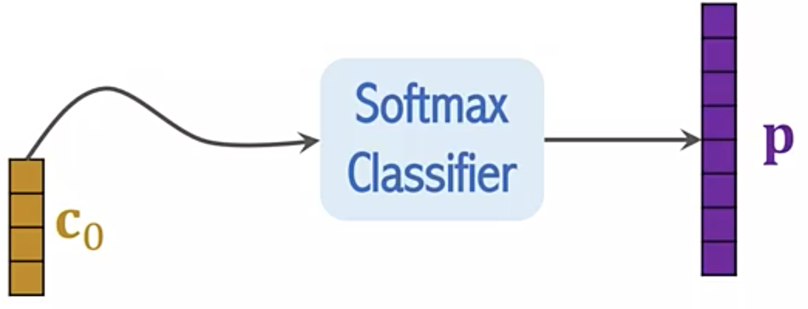
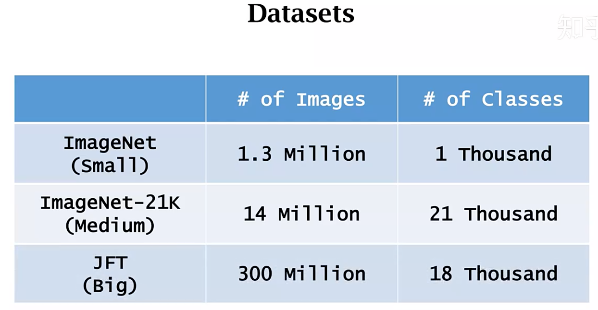
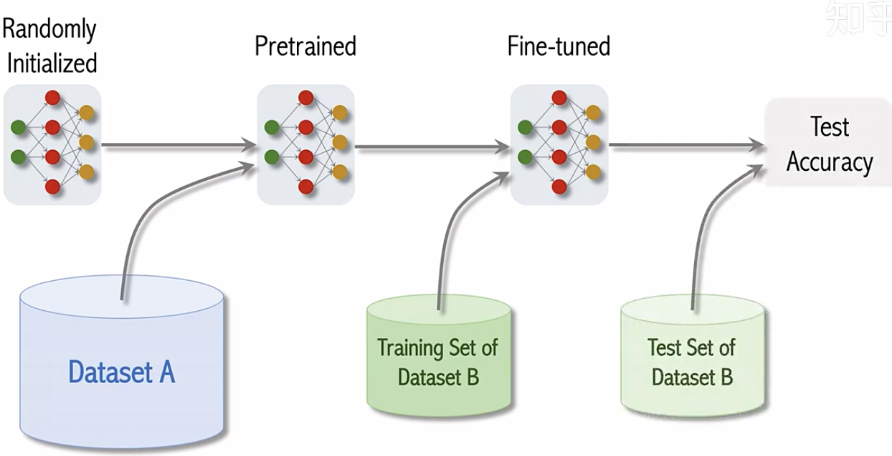
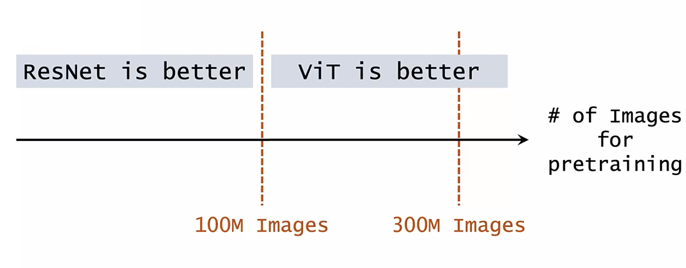

# Transformer

[TOC]

## 自注意力机制与Transformer

#### 自注意力机制(Self-Attention Mechanism)

- 输入：长度为$l$, 特征维度为$d$的输入序列$X \in R^{l \times d}$

- 目标：对序列中的每一个元素$X_{i} \in R^{d}$以一定权重从其他元素处聚合信息

- 计算方式：

  - 将输入序列通过线性变换转换为三个不同的序列$Q, K, V \in R^{l \times d}$

  - 计算索引序列(query)和键序列(key)之间的注意力系数$ S \in R^{l \times l} $

    ​                 $ S = QK^{T} / \sqrt{d} $

  - 使用softmax对注意力系数进行归一化

    ​				$ P = softmax(S) $

  - 使用归一化的注意力系数对值序列(value)进行加权求和，得到输出$ Y = PV $

- 公式：

​					$ Attention(Q, K, V) = softmax(\frac{QK^{T}}{\sqrt{d}})V$

#### 多头自注意力(Multi-Head Self-Attention)

- softmax计算使归一化注意力系数只在个别部分有高响应

- 为增加多处信息的聚合能力，提出多头自注意力机制

- 计算过程

  - 序列$Q, K, V \in R^{l \times d}$被分为$h$组$\{Q_{i}\}_{i=1}^{h}$, $\{K_{i}\}_{i=1}^{h}$, $\{V_{i}\}_{i=1}^{h}$，每组特征维度为$d_{i} = d / h$
  - 每组$Q_{i}$, $K_{i}$, $V_{i}$分别计算自注意力
  - 结果沿特征维度拼接后经过线性变换$W^{0}$，得到输出

- 公式：

   		$ MHAttention(Q, K, V) = Concat(head_{1}, ..., head_{h}) W^{0}$

  ​						$ head_{i} = Attention(Q_{i}, K_{i}, V_{i})$

#### Transformer

- 编码器：交替堆叠多头自注意力层和MLP层（或称为前馈网络，FFN）
- 解码器：类似编码器，但在每个多头自注意力层后插入一个多头交叉注意力层，其索引序列(query)来自自注意力层的输出，而键序列(key)和值序列(value)来自编码器的输出。

大模型应用：

Transformer由Encoder、Decoder构成，其中的基础模块称作encoder block和decoder block。

语言模型里GPT-2、GPT-3用到了decoder block（GPT-2用36），Bert则是用了encoder block(24个)。

[Jay Alammar](http://jalammar.github.io/)

# Vistion Transformer

[TOC]

## Transformer在CV上的应用前景

研究方向主要两个：

1. **作为convolution的补充**

   

2. **替代convolution：**ViT中不同的query是share key set的，这会使得内存访问非常友好而大幅度提速。一旦解决了速度问题，self-attention module在替代conv的过程中就没有阻力了。

   注：ViT是2020年10月挂在Arxiv上，2021年发表。

   

ViT的特性：

1. long range带来的全局特性：

   从浅层到深层，都比较能利用全局的有效信息。multi-head机制保证了网络可以关注到多个discriminative parts，其实每一个head都是一个独立的attention。

   

2. 更好的多模态融合能力：

   CNN擅长的是解构图像的信息，卷积核就是以前传统数字图像处理中的滤波操作。而Transformer中，不需要保持H*W*C的feature map结构。就类似position embedding，只要你能编码的信息，都可以非常轻松地利用进来。

   

3. Multiple tasks能力。

   

4. 更好的表征能力。

   

   总体而言，Transformer是NLP给CV的一个输出，我们可以去学习Transformer的长处，至于未来是否会替换CNN，或者Transformer与CNN共存，甚至互相弥补，这个还是靠整个学界去决定。CV的任务很多很难，无论是CNN还是Transformer都不会是CV的终点，保持学习、保持接纳、保持探究。

​														这里的xi到zi是都是共享参数的全连接层。

​						                          transformer encoder的输出中，有用的是向量c0。

Transformer的缺点：

需要大量的数据进行训练。ViT论文里研究了三个数据集，其中JFT甚至有3亿张图片。可惜JFT是谷歌私有的一个数据集，不对外公开。

实验结果表示，如果用ImageNet（small）预训练，ViT表现不如ResNet。用ImageNet-21K（medium），ViT表现与ResNet相当。只有在使用JFT数据集后，ViT才超越了ResNet。

而且实验的迹象表明，即便是3亿张图片的JFT也不够大，继续增大数据集，ViT的优势还会进一步增大。反观ResNet，预训练的数据量是1亿还是3亿张图片时区别不大。

