# 流匹配 和 扩散模型

[MIT 6.S184](https://youtu.be/GCoP2w-Cqtg?si=uDdnmfEIZhUb1jxc)

这门课：Flow/Diffusion模型的理论与实践

- 理论：第一性原理，必要而最少量的数学知识 ODE、SDE
- 实践：如何实现

## 第零章 学习资源

https://diffusion.csail.mit.edu/

网站包括幻灯片，以及三个实验，以及[课堂笔记](https://arxiv.org/pdf/2506.02070)。

## 第一章 利用随机微分方程的Gen AI

### 第一节：从生成到采样

我们将图像/视频/蛋白质表示为向量

 $z_{图像}\in R^{H \times R \times 3} $，$z_{视频}\in R^{T \times H \times R \times 3} $，$z_{分子结构}\in R^{N \times 3} $（N个原子有3坐标）。

一张图像的“好”程度 ≈ 它在数据分布下的可能性有多高

> 学术一点的说法：图像的质量可以近似等同于它在数据分布中的似然性

生成就是从数据分布中采样

数据分布一般用概率密度函数$p_{data}$表示。

数据集包含了数据分布中有限个数的样本：$z_1,...,z_N \sim p_{data}$

条件生成指的是从条件分布中采样：$z \sim p_{data}(\cdot \mid y)$，比如 $y$ 是提示词。意味着给定这个提示，数据的分布是什么。这是我们最感兴趣的课题。

生成模型将初始分布（例如高斯分布）中的样本转换为数据分布中的样本。

$x \sim p_{init}$  ➡️  $Generative Model$  ➡️  $z \sim p_{data}$

### 第二节 流模型与扩散模型

#### 2.1 流模型

###### 2.1.1 基本术语和概念

流的基本对象：轨迹（Trajectory）、向量场（Vector Field）、常微分方程（ODE）

1. 轨迹：$X: [0, 1] \to \mathbb{R}^d, \quad t \mapsto X_t$ 

> [!NOTE]
>
> $\to$ 表示函数的定义域和值域之间的映射关系；
>
> $\mapsto$ 表示具体给定一个元素映射到另一个元素；
>
> 轨迹终点 $X_1$ 落在真实数据分布上。

2. 向量场：$u: \mathbb{R}^d \times [0,1] \to \mathbb{R}^d, \quad (x, t) \mapsto u_t(x)$

> [!NOTE]
>
> **笛卡尔积**在这里的作用是“构造一个联合空间”，就像编程里写`def f(x: Vector, t: float)-> Vector:`，数学中我们不能写两个参数名，所以就把它们**打包成一个二元组 $(x, t)$**，而这个“打包”的空间就是 $\mathbb{R}^d \times [0,1]$。

3. 常微分方程：描述轨迹上的条件

$X_0 = x_0 \;(初始条件)$ 沿着向量场指定的方向前进。

$\frac{d}{dt}X_t = u_t(X_t)$ （ODE）

轨迹的导数或速度 是由 $X_t$ 当前所在位置的向量 $u_t(X_t)$ 给出的。

> [!TIP]
>
> 也许我们中的一些人听说过ODE在工程和物理学中是力学的基础。但“流”这个术语不太常见。流是遵循ODE的轨迹的集合。
>
> 本质上是我们收集大量针对不同初始条件的解决方案，然后将它们全部收集到一个函数中，并称之为流。

4. 流：$\psi: \mathbb{R}^d \times [0,1] \to \mathbb{R}^d, \quad (x_0, t) \mapsto \psi_t(x_0)$

> **流** $\psi$是所有不同起点 $x_0$ 的轨迹集合，即整个系统的“流动结构”。

我们希望对于每个初始条件$x_0$，轨迹$\psi_t(x_0)$都是下面这个ODE的解：

$\psi_0(x_0) = x_0$

$\frac{d}{dt}\psi_t(x_0) = u_t(\psi_t(x_0))$

所以：

- ODE由向量场（VF）定义。
- 轨迹是ODE的解。
- 流则是各种初始条件的轨迹的集合。

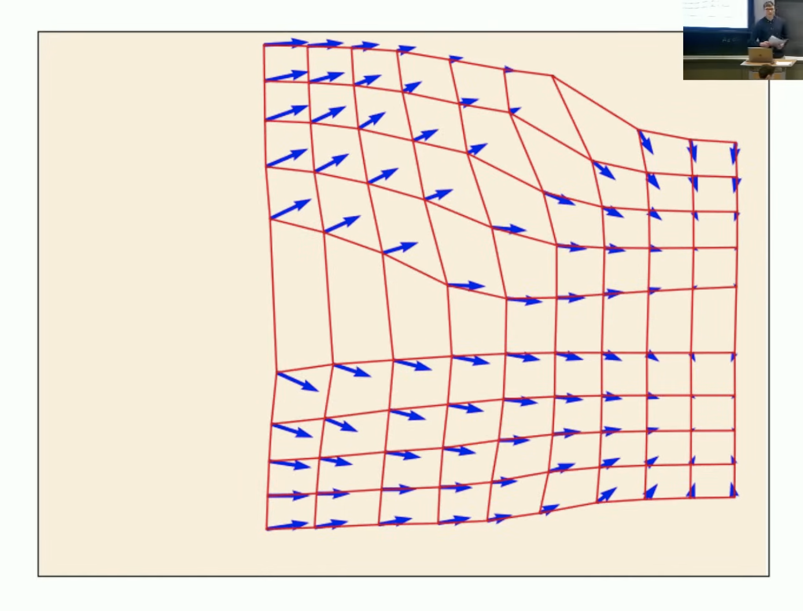

> 图示红色网格是轨迹，蓝色箭头是向量场。

###### 2.1.2 定理

ODEs 解的存在性与唯一性定理

**定理（皮卡–林德勒夫定理）**：
如果向量场 $u_t(x)$ 是连续可微的，且其导数有界，那么下面这个常微分方程（ODE）：$X_0 = x_0\:, \quad \frac{d}{dt}X_t = u_t(X_t)$ 

存在唯一解。换句话说，流映射是存在的。更一般地说，只要向量场是 **Lipschitz 连续的**，结论仍然成立。

> **Lipschitz 连续**是一种比连续更强，比可微略弱的函数光滑性条件，在分析和微分方程中非常重要。

> [!TIP]
>
> 在机器学习实际应用中，常微分方程（ODE）或流（flow）的问题通常都存在**唯一解**。
>
> 你上过的大多数课程中，这已经被隐式假设了。

###### 2.1.3 示例：线性ODE

**Flow-based 模型是在学习一个确定性的（deterministic）向量场，间接决定轨迹。轨迹由向量场通过常微分方程生成。**

简单的线性向量场：$u_t(x) = -\theta x \; (\theta > 0)$

断言：流由下式给出：$\Psi_t(x_0) = e^{-\theta t} x_0$

> - 断言（Claim）在数学中表示一个待证明的断言、结论或命题。
> - $\psi$ 发音为 /saɪ/ 或 /psaɪ/

证明：

1. 初始条件：

   $\Psi_t(x_0) = e^{0} x_0 = x_0$

2. ODE：

   $\frac{d}{dt}\Psi_t(x_0) = \frac{d}{dt}(e^{-\theta t} x_0) = -\theta e^{-\theta t}x_0 = -\theta \psi_t(x_0) = u_t(\psi_t(x_0))$

不同初始条件的轨迹：

$y$轴表示初始条件。轨迹呈指数级趋近于零。

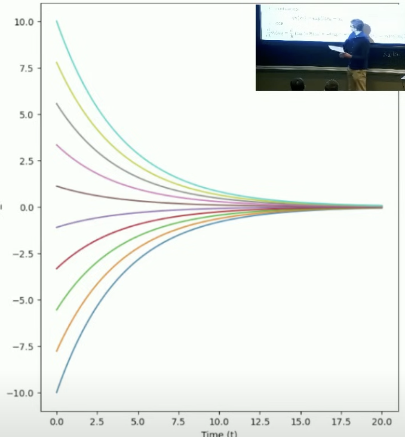

###### 2.1.4 ODE数值模拟——欧拉法

不幸的是，在大多数情况，这并不容易，你不能只是手动找到ODE的解。

我们需要做的是模拟它。

<a name="algorithm1">算法1</a>：欧拉法模拟ODE

输入：向量场$u_t$，初始条件$x_0$，步数$n$

1. 设 $t = 0$

2. 设步长 $h = \frac{1}{n}$

3. 设 $X_0 = x_0$

4. 对 $i = 1, \cdots, n-1$ 循环：

   ​	$X_{t+h} = X_t + hu_t(X_t)$

   ​	更新$t$为$t+h$

5. 结束循环

6. 返回轨迹：$X_0, X_h, X_{2h}, \cdots, X_1$

> [!TIP]
>
> 这是sampling的算法（生成的过程），比较简单。困难的是$u_t^\theta$训练的部分。

###### 2.1.5 生成模型

1. 流模型：$p_{init} \xrightarrow{\text{ODE}} p_{data}$

2. 神经网络：将向量场变成一个神经网络。

​                $u_t^\theta : \mathbb{R}^d \times [0, 1] \to \mathbb{R}^d$，$\theta$ 是网络参数

3. 随机初始条件：由于ODE是确定性的，所以还不能生成整个分布。但我们可以使初始条件随机化。

   $X_0 \sim p_{init}$

4. 常微分方程：

   $\frac{d}{dt}X_t = u_t^\theta(X_t)$

5. 目标：

   $X_1 \sim p_{data}$

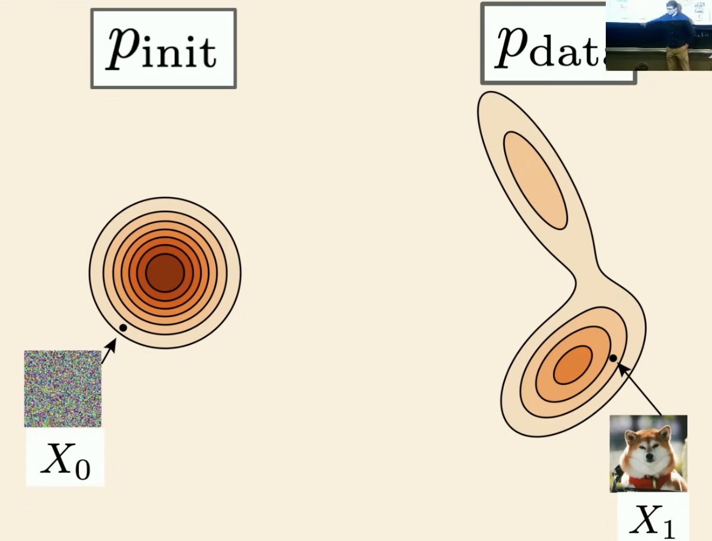

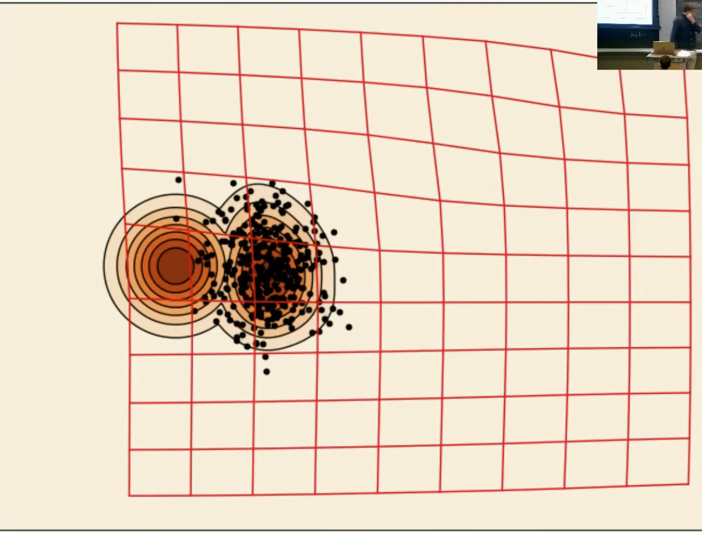

后面我们会学到，这幅图描述就是用高斯概率路径的边际向量场进行基于欧拉法的ODE数值模拟。

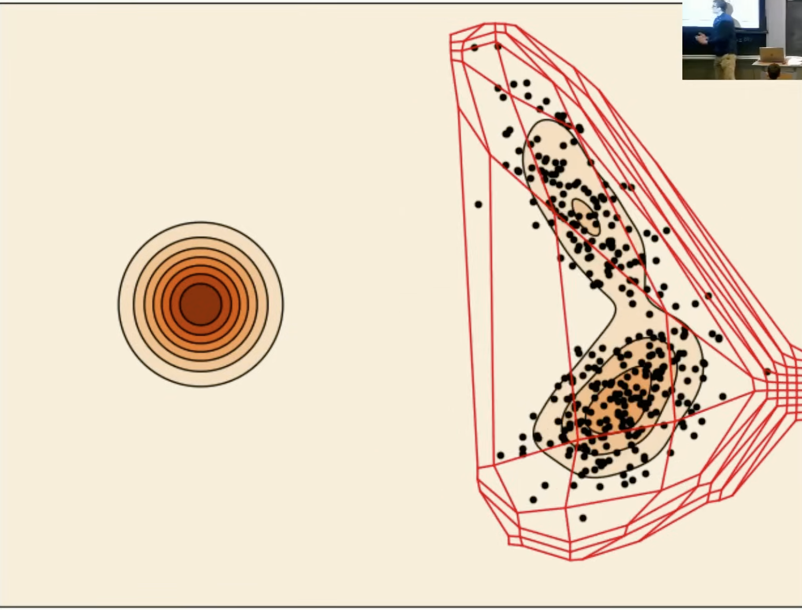

#### 2.2 扩散模型

扩散模型本质上扩展了我们刚才讨论过的想法，但采用随机微分方程。

###### 2.2.1 基本术语和概念

扩散模型的基本对象：随机过程（Stochastic process）、向量场（Vector Field）、常微分方程（ODE）

1. 随机过程：扩散模型的解是随机的轨迹，也称为随机过程。

$X_t, \; (0 \le t \le 1)$  是随机变量

$X: [0, 1] \to \mathbb{R}^d, \quad t \mapsto X_t$ ，但此时可以从$X$中抽取样本，所以$X$本身是随机的。这些轨迹的集合更像是它们发生的可能性。

2. 向量场：$u: \mathbb{R}^d \times [0,1] \to \mathbb{R}^d, \quad (x, t) \mapsto u_t(x)$

3.  扩散系数：$\sigma: [0,1] \to \mathbb{R}_{\ge 0}, \quad t \mapsto \sigma_t$，由它向ODE注入随机性。

3. 随机微分方程：

$X_0 = x_0 \;(初始条件)$ 

$dX_t = \underbrace{u_t(X_t)dt}_{\text{ODE}} + \underbrace{\sigma_tdW_t}_{stochastic/noise}$ （SDE）

表示： $X_t$ 随时间演化，它的变化由两个部分组成：

1. **确定性部分**：它会朝着一个“向量场”或“趋势” $u_t(X_t)$ 的方向走（ODE）。
2. **随机部分**：它还会叠加一些“不可预测的扰动”——这些扰动由布朗运动 $dW_t$ 产生，并通过一个缩放因子 $\sigma_t$ 控制其强度。

$W_t$ 表示布朗运动，在数学中通常被建模为一个 Wiener 过程（维纳过程）。

4. 布朗运动：

随机过程：$W： (W_t)_{t \ge 0}$，$W_t \in \mathbb{R}^d$，可以是任何维度的

1. 初始化为0：$W_0 = 0$
2. 高斯增量：$W_t - W_s\sim \mathcal{N}(0, (t-s)I_d), \;(0\le s\le t)$
3. 独立的增量：$W_{t_1} - W_{t_0}, \cdots, W_{t_n} - W_{t_{n-1}}$，$0 \le t_0 \lt t_1 \lt \cdots \lt t_n$ 都是互相独立的，视为随机变量

这个独特属性，使得它在任何地方都不可微。

但我们在研究依赖于求导的微分方程。

5. 符号$dX_t$：

由于维纳过程不可微，我们换种表达：

$\frac{d}{dt}X_t = u_t(X_t)$

$ \Leftrightarrow \quad \lim_{h \to 0} \frac{X_{t+h} - X_t}{h} = u_t(X_t)$

$ \Leftrightarrow \quad \frac{X_{t+h} - X_t}{h} = u_t(X_t) + R_t(h)$

$ \Leftrightarrow \quad X_{t+h} = X_t + hu_t(X_t) + hR_t(h)$

这里 $R_t(h)$ 是误差项，且 $\lim_{h \to 0} R_t(h) = 0$。这儿想作是泰勒近似。

$dX_t = u_t(X_t)dt + \sigma_tdW_t$

$ \Leftrightarrow \quad X_{t+h} = X_t + hu_t(X_t) + \sigma_t(W_{t+h} - W_t) +hR_t(h)$

| ODE            | SDE                         |
| -------------- | --------------------------- |
| 解是轨迹       | 解是随机过程，或说随机轨迹  |
| 由向量场定义。 | 由向量场 和 扩散系数 定义。 |

###### 2.2.2 定理

SDEs 解的存在性与唯一性定理

如果向量场 $u_t(x)$ 是连续可微的，且其导数有界，并且扩散系数是连续的，那么下面这个随机微分方程

$X_0 = x_0, \quad dX_t = u_t(X_t)dt + \sigma_tdW_t$ 

存在唯一解。

###### 2.2.3 SDE数值模拟——欧拉-丸山法

算法2：从一个SDE采样（欧拉-丸山法，Euler-Maruyama method）

输入：向量场$u_t$，步数$n$，扩散系数$\sigma_t$

1. 设 $t = 0$

2. 设步长 $h = \frac{1}{n}$

3. 设 $X_0 = x_0$

4. 对 $i = 1, \cdots, n-1$ 循环：

   ​        从标准 $d$-维正态分布中采样 $\epsilon \sim \mathcal{N}(0, I_d)$

   ​	$X_{t+h} = X_t + hu_t(X_t) + \sigma_t \sqrt{h}\epsilon$

   > [!NOTE]
   >
   > $\sqrt{h}\epsilon\sim \mathcal{N}(0, hI_d)$，噪声的方差为$h$。

   ​	更新$t$为$t+h$

5. 结束循环

6. 返回轨迹：$X_0, X_h, X_{2h}, \cdots, X_1$

###### 2.2.4 示例：奥-乌过程

Ornstein–Uhlenbeck (OU) 过程是一个**均值回复型的随机过程**，是布朗运动（随机游走）的扩展。它经常用来建模那些**会在长期内回到某个平衡值附近波动**的系统。

$dX_t = -\theta X_t dt + \sigma dW_t$

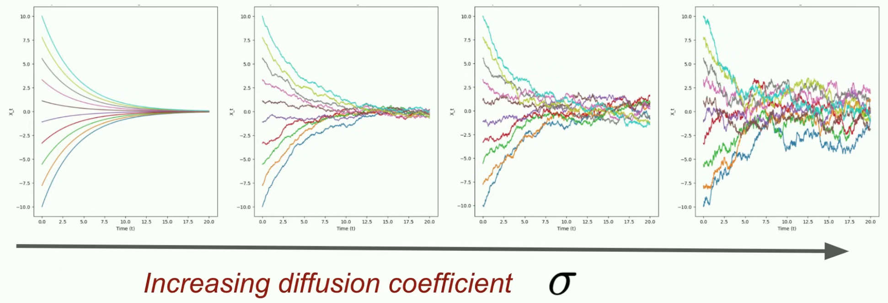

###### 2.2.5 生成模型

1. 扩散模型：$p_{init} \xrightarrow{\text{SDE}} p_{data}$

2. 神经网络：是向量场，此处和流模型一样。

​                $u_t^\theta : \mathbb{R}^d \times [0, 1] \to \mathbb{R}^d$，$\theta$ 是网络参数

3. 扩散系数：

   $\sigma_t$ （大多数情况下它是固定的）

4. 随机初始条件：

   $X_0 \sim p_{init}$

5. 常微分方程：

   $dX_t = u_t^\theta(X_t)dt + \sigma_tdW_t$

6. 目标：

   $X_1 \sim p_{data}$

## 第二章 构建训练目标

回顾：

### 第一节 训练模型

不经过训练，模型的产出“毫无意义” → 我们需要训练向量场 $u_t$

训练 = 找到一组参数，使得：

$\underbrace{X_0 \sim p_{init}}_{\text{从一个初始分布开始，}}$，$\underbrace{dX_t = u_t^\theta(X_t)dt}_{\text{沿着向量场进行演化，}}$   能得到 $\underbrace{X_1 \sim p_{data}}_{\text{最终点的分布 = 数据分布}}$

在回归或分类任务中，训练目标是标签。

但在这里：没有标签 : (

我们必须推导出一个训练目标。

### 第二节 构建训练目标

**目的**：推导一个用于训练我们模型的训练目标的公式。

这一节的课程将是技术上最具挑战性的一节！接下来的课程会轻松很多很多。

你不必理解推导过程，但一定要理解以下公式：

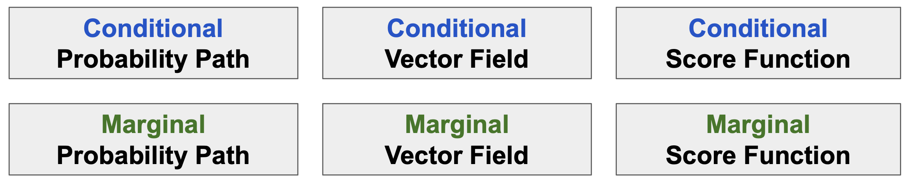

三个条件对象，三个边际对象的公式：

- 条件和边际的概率路径
- 条件和边际的向量场
- 条件和边际的得分函数

#### 2.1 条件和边际概率路径

###### 2.1.1 关键术语

- “Conditional” = “针对单个数据点”
- “Marginal” = “跨数据点分布”

Conditional（条件的） 强调的是在某个特定数据点条件下的情况。

Marginal（边际的） 是指考虑整个数据的整体分布，不针对单点。

:mag: [“边际”](#marginal)

###### 2.1.2 概率路径

概率路径： 从噪声到数据的路径。（噪声和数据的逐步插值）

狄拉克分布（ Dirac distribution）：$z \in \mathbb{R}^d$,  $\delta_z: X \sim \delta_z \Rightarrow X = z$

> 这是最简单的一种分布。它是一种**确定性分布**（deterministic distribution）：它在 $x = z$ 处“无限高”，在 $x \ne z$ 的地方为 0，积分为 1。
>
> 你可以把它看成一个“浓缩在一个点 $z$ 上的概率分布”，所有质量都集中在 $z$​，没有任何扩散或随机性。从 狄拉克分布中采样的结果就是 $z$ 本身，毫无随机性。

> [!TIP]
>
> 一开始，大家尝试寻找“从噪声变成数据”的最优路径，比如在纯粹的神经常微分方程（neural ODEs）^[1]^ 中，是不去指定中间过程（即路径上的中间分布）的，人们只是希望模型自己找到一条最佳路径。但扩散模型的一个关键思想，就是**明确地指定从噪声到数据的演化路径**。
> 而实际上，扩散模型这样 **选择一种路径并坚持使用，是完全可行的**——因为这样可以带来可扩展的训练流程。
>
> [1] Chen, Ricky TQ, et al. "Neural ordinary differential equations." *Advances in neural information processing systems* 31 (2018).

###### 2.1.3 条件概率路径 $p_t(\cdot \mid z)$

条件概率路径：$p_t(\cdot \mid z)$

1. $p_t(\cdot \mid z)$ 是$\mathbb{R}^d$上的概率分布
2. $p_0(\cdot \mid z) = p_{init}$
3. $p_1(\cdot \mid z) = \delta_z$

###### 2.1.4 例子 —— 高斯概率路径

$p_t(\cdot \mid z) = N(\alpha_t z, \beta_t^2 I_d)$

$\alpha_t$ 和 $\beta_t$ 是所谓的噪声调度器（noise schedulers） 

- $\alpha_0 = 0$，$\alpha_1 = 1$ 
- $\beta_0 = 1$，$\beta_1 = 0$ 
- 比如常见可以设计为 $\alpha_t = t$，$\beta_t = 1 - t$

容易得到，它满足条件概率路径 $p_t(\cdot \mid z)$的三点要求。

如下图可视化：

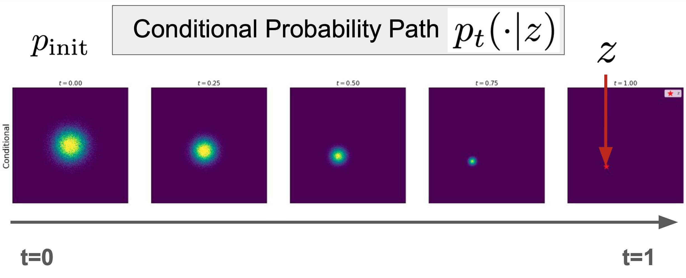

###### 2.1.5 边际概率路径 $p_t$

边际概率路径：$p_t$

$z \sim p_{data}, \; x \sim p_t(\cdot \mid z) \Rightarrow \underbrace{x \sim p_t}_{\text{forget z}}$

> 通过条件概率路径 + 数据分布 可以推出 边际概率路径。即：
>
> **流模型中时刻  $t$ 的边际分布是对所有初始数据 $z$ 的条件分布 $p_t(X \mid z)$ 的加权平均**，权重由初始数据的分布 $p_{\text{data}}(z)$ 决定。

1. $p_t(X) = \int p_t(x|z)p_{data}(z)dz$
2. $p_0 = p_{init}$
3. $p_1 = p_{data}$

如下图可视化：

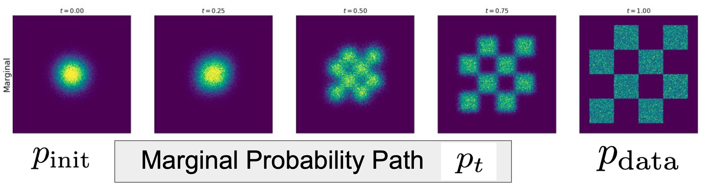

###### 2.1.6 概率路径小结

条件概率路径 $p_t(\cdot \mid z)$，由 $p_{init}$ 和 一个数据点 $z$ 插值，例子是高斯概率路径$N(\alpha_t z, \beta_t^2 I_d)$，$\alpha_t$从0到1，$\beta_t$从1到0。

边缘化得到

边际概率路径$p_t$，由 $p_{init}$ 和 $p_{data}$ 插值，有公式 $p_t(x) = \int p_t(x| z)p_{data}(z)dz$。

> [!NOTE]
>
> 公式 $p_t(X) = \int p_t(x|z)p_{data}(z)dz$ 
>
> 把 $z$ 给“边缘化掉”了（marginalized out）——所以叫它“边际分布”。
>
> 在概率论中，“**边际**”这个词来自于一个常见的操作 —— **从联合分布或条件分布中通过积分“边缘化掉”一些变量**，只保留我们关心的部分。 

| 术语                   | 含义                          | 举例                               |
| ---------------------- | ----------------------------- | ---------------------------------- |
| 条件概率 $p(x \mid z)$ | 给定 $z$，$x$ 的分布          | 先挑定一个初始点，观察它的演化路径 |
| 联合概率 $p(x, z)$     | $x$ 和 $z$ 同时出现的概率     | 所有起点与终点对的联合分布         |
| **边际概率 $p(x)$**    | 不关心 $z$ 时，$x$ 的总体分布 | 所有起点演化后的“总体效果”         |

> [!TIP]
>
> <a name="marginal">“边际”</a>这个词来自表格“边缘”的历史传统，而不是因为它本身有什么边的含义。从语义角度来说确实不够直观，但它已经成为标准术语。你记住“边际 = 去掉另一个变量后，留下的总概率”就可以了。
>
> | 性别 / 吸烟 | 吸烟 (Yes)        | 不吸烟 (No)       | 总计（边缘） |
> | ----------- | ----------------- | ----------------- | ------------ |
> | 男 (Male)   | 30/100 = **0.30** | 20/100 = **0.20** | **0.50**     |
> | 女 (Female) | 10/100 = **0.10** | 40/100 = **0.40** | **0.50**     |
> | **总计**    | **0.40**          | **0.60**          | **1.00**     |
>
> 如果你觉得难记，大可以在心里把它当作“总分布”或“全局分布”来理解，也没问题 。

#### 2.2 条件和边际向量场

###### 2.2.1 条件向量场

>   [!NOTE]
>
> 我们希望有一个ODE，能沿着条件概率路径，从噪声到单个数据点，即 $p_{init} \overset{\text{$p_t(\cdot \mid z)$}}{\underset{\text{ODE}}{\longrightarrow}} \delta_z$ 

形式化（公式化）表达：

$u_t^{target}(x|z)$，（ $\substack{0 \le t \le 1 \\ x,z \in \mathbb{R}^d}$ ） 

满足

$X_0 \sim p_{init},\quad \frac{d}{dt}X_t = u_t^{target}(x_t|z) \Rightarrow  X_t \sim p_t(\cdot \mid z)$   $(0 \le t \le 1)$

###### 2.2.2 例子——条件高斯向量场

$u_t^{target}(x|z) = (\dot{\alpha_t} - \frac{\dot{\beta_t}}{\beta_t}\alpha_t)z+ \frac{\dot{\beta_t}}{\beta_t}x$， 

> - $\dot{}$ 在物理中常用于表示时间导数，如速度$\dot{x}$，所以 $\dot{\alpha_t}=\frac{d}{dt}\alpha_t$
> - 这个向量场很简单，就是 $x$ 和 $z$ 的某种加权组合。

这个向量场能沿着高斯概率路径 $p_t(\cdot \mid z) = N(\alpha_t z, \beta_t^2 I_d)$ 从噪声到数据点。

可视化为下图：

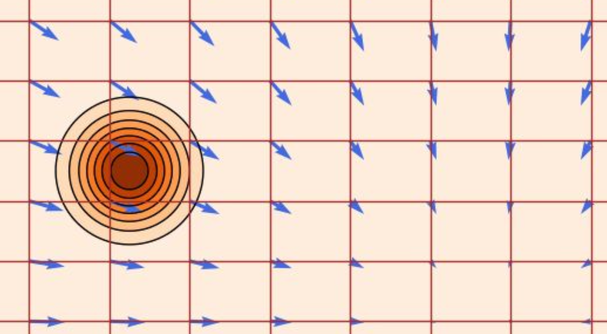

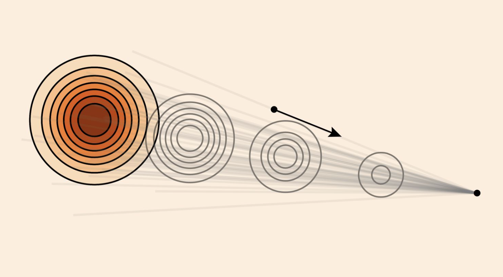

###### 2.2.3 边际向量场 & 定理（边缘化技巧）

边际向量场：

$u_t^{target}(x) = \int u_t^{target}(x|z) \frac{p_t(x|z)p_{data}(z)}{p_t(x)}dz$

$\frac{p_t(x|z)p_{data}(z)}{p_t(x)}$ 这个比率，本质上是给定$x$，采用$z$的后验概率，即$p_t(z|x)$。

> [!IMPORTANT]
>
> 这儿要理解一下，边际概率路径是条件概率路径按 $p(z)$ 加权，描述数据在（$t$时刻）空间中的整体分布，反映“在哪儿”更可能出现。
>
> 向量场描述“怎么走”的方向和速度，是动态且带方向性的。由于当前位置 $x$ 下不同初始条件导致的向量场差异较大，向量场需按后验概率 $p(z \mid x)$ 加权，才能准确反映当前点的运动趋势。

这样的边际向量场

<a name="theorem">满足</a>

$X_0 \sim p_{init}, \quad \frac{d}{dt}X_t = u_t^{target}(x_t) \Rightarrow X_t \sim p_t \quad (0 \le t \le 1)$  $ \Rightarrow X_1 \sim p_{data}$

> [!TIP]
>
> 回顾这些边际对象的公式，可以看到研究 条件对象 只是工具，都是为了构建 边际对象 的公式。

$第一行 \xrightarrow{ 边缘化 }第二行$：

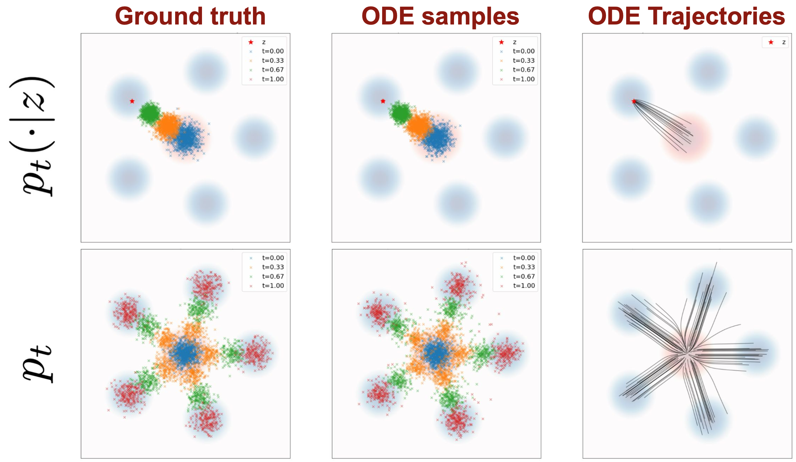

###### 2.2.4 连续性方程（延伸知识，用于证明边际向量场的边缘化）

给定：$X_0 \sim p_{init}, \quad \frac{d}{dt}X_t = u_t(X_t)$ 

沿着概率路径 $X_t \sim p_t \quad (0 \le t \le 1)$  （边际是$p_t$）

等价于说：

连续性方程 $\frac{d}{dt}p_t(x) = -div(p_tu_t)(x)$ 成立。（该PDE成立）

$p_t$在$x$处的时间导数 是由 $p_t u_t$（$流量=浓度\times速度$）的负散度给出的。

>  [!NOTE]
>
> 可以理解为 概率密度的变化，取决于该点的负的净流出量。（散度衡量的是**净流出量** 。用于描述 流体是否在某处发散或聚集，正散度表示发散，负散度表示汇聚。）。
>
> 换句话说， **流出越多，密度下降越快**。

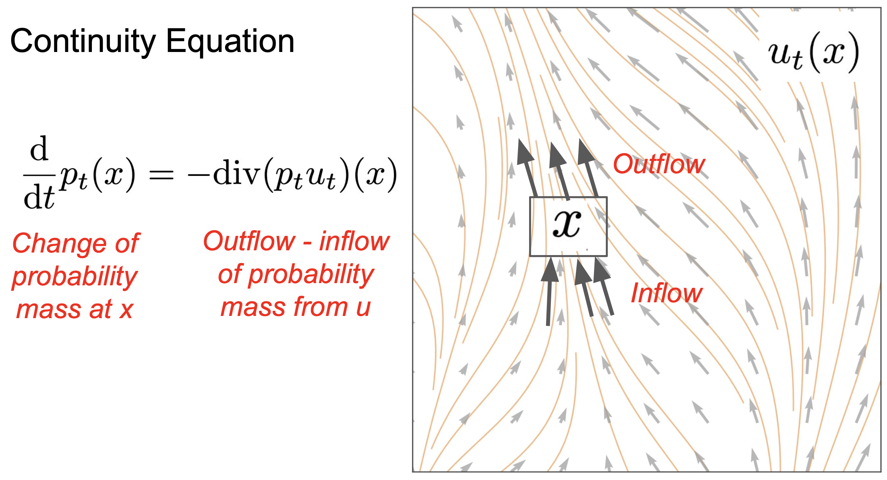

> [!CAUTION]
>
> 向量场的散度是描述流体“是否在某处发散或聚集”；
>
> 散度：$\operatorname{div}(v_t)(x) = \sum_{i=1}^d \frac{\partial (v_t)_i(x)}{\partial x_i}$
>
> 而KL散度是描述两个分布“偏离有多大”。从数学形式和语义来看，它们是两个完全不同的工具。
>
> 仅仅因为字面的 “偏离/发散” 符合描述，而使用了相同的术语词汇。

证明：

$\frac{d}{dt}p_t(x) = \frac{d}{dt}\int p_t(x|z)p_{data}(z)dz = \int \frac{d}{dt}p_t(x|z)p_{data}(z)dz $

$= \int -div(p_t(\cdot\mid z)u_t^{target}(\cdot\mid z))(x)p_{data}(z)dz$

$= -div(\int p_t(x\mid z)u_t^{target}(x\mid z)p_{data}(z))dz$

$= -div(p_t(x)\int u_t^{target}(x\mid z)\frac{p_t(x\mid z) p_{data}(z)}{p_t(x)})dz$

$= -div(p_t u_t^{target})(x)$

> [!TIP]
>
> 其实就是利用连续方程：
>
> $\frac{d}{dt}p_t(x|z) = -div(p_t(\cdot|z)u_t^{target}(\cdot|z))(x)$
>
> $\frac{d}{dt}p_t(x) = -div(p_tu_t)(x)$ 
>
> 的定义
>
> ，在推导过程中，得到的$u_t^{target}(x) = \int u_t^{target}(x|z) \frac{p_t(x|z)p_{data}(z)}{p_t(x)}dz$

###### 2.2.5 向量场小结

条件向量场 $u_t^{target}(x \mid z)$，其ODE沿着条件路径，例子是条件高斯向量场$(\dot{\alpha_t} - \frac{\dot{\beta_t}}{\beta_t}\alpha_t)z+ \frac{\dot{\beta_t}}{\beta_t}x$

边缘化得到

边际向量场$u_t^{target}(x)$，其ODE沿着边际路径，有公式 $u_t^{target}(x) = \int u_t^{target}(x|z) \frac{p_t(x|z)p_{data}(z)}{p_t(x)}dz$

#### 2.3 条件和边际得分函数（扩散模型）

###### 2.3.1 条件和边际得分

条件得分：

$\nabla_x \log p_t(x|z)$，即条件概率路径的对数似然的梯度

边际得分：

$\nabla \log p_t(x)$，即边际概率路径的对数似然的梯度

公式：根据链式法则

$\nabla \log p_t(x) = \frac{\nabla p_t(x)}{p_t(x)} = \frac{\nabla \int p_t(x|z)p_{data}(z)dz}{p_t(x)}$

$= \frac{ \int \nabla p_t(x|z)p_{data}(z)dz}{p_t(x)} = \int \nabla \log p_t(x|z) \frac{ p_t(x|z)p_{data}(z)}{p_t(x)}dz$，发现又是构造出后验概率加权积分的形式。

> $\because \nabla \log p_t(x|z) = \frac{\nabla p_t(x|z)}{p_t(x|z)}$

###### 2.3.2 例子——高斯得分

一个高斯概率路径对应的高斯得分：

$\nabla_x \log p_t(x|z) = -\frac{x - \alpha_t z}{\beta_t^2}$

> 由正太分布的概率密度函数
>
> $p(x) = \frac{1}{(2\pi)^{d/2} |\Sigma|^{1/2}} \exp\left( -\frac{1}{2}(x - \mu)^\top \Sigma^{-1} (x - \mu) \right)$
>
> 代入  $\boldsymbol{\Sigma} = \beta_t^2 \mathbf{I}$
>
> $p(\mathbf{x}) = \frac{1}{(2\pi \beta_t^2)^{d/2}} \exp\left( -\frac{1}{2\beta_t^2} \left\| \mathbf{x} - \alpha_t \mathbf{z} \right\|^2 \right)$
>
> 推导得到。

###### 2.3.3 定理（SDE扩展的技巧）

对于任意$\sigma_t \ge 0$，

$X_0 \sim p_{init}, \quad dX_t = [u_t^{target}(X_t) + \frac{\sigma_t^2}{2}\textcolor{blue}{\nabla \log p_t(x_t)}]dt + \sigma_tdW_t$

> [!NOTE]
>
> 得分函数 本质上就是 我们需要应用的校正项。
>
> **得分函数校正了“随机扩散轨迹”的方向**，让它向数据靠近。

$ \Rightarrow X_t \sim p_t \quad (0 \le t \le 1) \Rightarrow X_1 \sim p_{data}$

:mag: [流模型](#theorem) 其实就能达到这个目标，所以现在50%的模型都纯流模型。所以我们优先掌握流模型，扩散模型只是其扩展。

> 流模型是基础。  扩散模型更多像一种实践经验，在流模型基础上，通过实验发现加各种扩散系数的噪声，生成效果是否会改善。

#### 2.4 总结

后续课程会学习到：

模型训练 就是 训练 $u_t^{target}$ 这个对象，或$\nabla \log p_t(x)$这个对象。

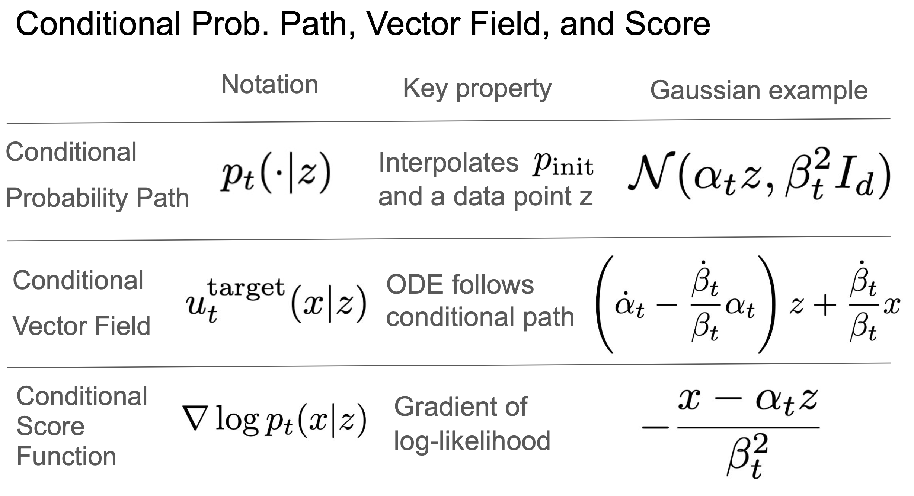

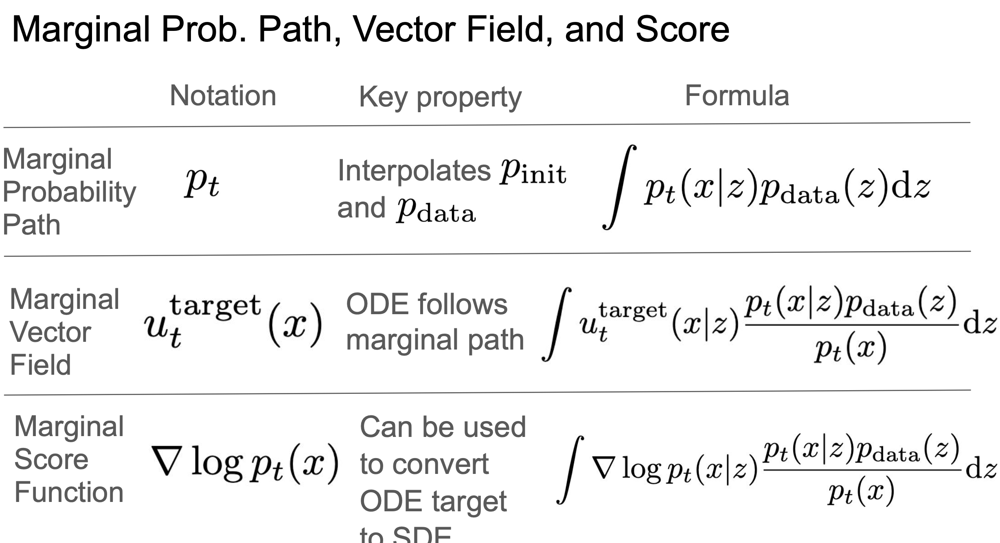

## 第三章 训练流模型和扩散模型

回顾：

>  [!NOTE]
>
> 知识小灶：
>
> - 归一化流：直接学映射函数
>
>   像修一条高速公路。你得明确规划每个路口（映射函数），并且每段必须符合标准设计（可逆、结构简单、Jacobian 可计算）。
>
> - 流匹配：学导数（vector field）
>   像使用GPS。你不关心路具体长什么样，只要告诉我每个时刻往哪个方向走（向量场），然后用 ODE 把路径积分出来，就能从出发点走到终点。

#### 3.1 训练算法

我们将 边际向量场、边际得分函数 转化为 两种算法：流匹配 与 得分匹配。

这将是训练算法，用于学习这两个对象。

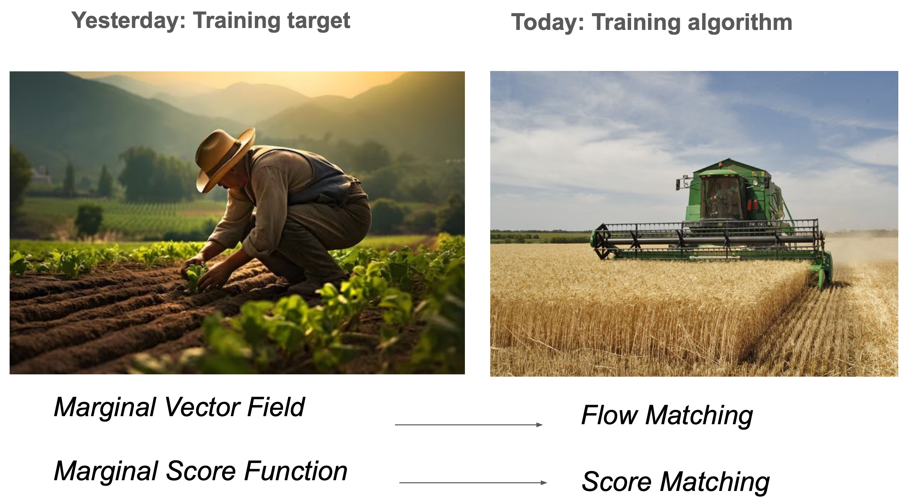

#### 3.2 流匹配

$u_t^\theta$  ($\theta$: parameters)

目标

$u_t^\theta \approx u_t^{target}$

###### 3.2.1 流匹配损失

$L_{fm} (\theta)= \mathbb{E}[\left \|  u_t^\theta(x) - u_t^{target}(x)\right \|^2 ]$，

> ✓ Minimizer ✗ Tractable
>
> 为什么不易处理呢？ 因为我们无法评估这一点，边际向量场是一个（边缘化）积分，批量进行计算很困难。

$t \sim \mathcal{U}(0, 1)$，$t$ 在 $[0, 1]$ 区间均匀采样。

$z \sim p_{data}$，$z$ 通过dataloader从数据集中随机采样。

$x \sim p_t(\cdot \mid z)$，$x$ 从条件概率路径采样。

> [!NOTE]
>
> 这里流匹配损失函数很直观，就是两个对象之间的均方误差。取期望值就是在所有采样样本$(x, t)$上做`torch.mean`，这是平时实现损失函数常用的。

###### 3.2.2 条件流匹配损失

$L_{cfm} (\theta)= \mathbb{E}[\left \|  u_t^\theta(x) - u_t^{target}(x \mid z)\right \|^2 ]$，

> ? Minimizer ✓ Tractable
>
> 最小化这个对象是否有意义？因为条件向量场不是真的有用，我们不想生成单个数据点，而是想生成整个数据分布。
>
> 但接下来我们会证明，最小化条件流匹配损失，能够达到我们的目标。

$t \sim \mathcal{U}(0, 1)$，$z \sim p_{data}$，$x \sim p_t(\cdot \mid z)$

###### <a name="Theorem4"> 3.2.3 定理</a>

 $L_{fm}(\theta) = L_{cfm}(\theta) + C$ ，for $C \lt 0$ independent of $\theta$

> [!TIP]
>
> $C$ 是与$\theta$无关的常数，不会影响梯度下降方向。从 **优化角度**来看，优化 $L_{cfm}(\theta)$ 与优化 $L_{fm}(\theta)$ 是等价的

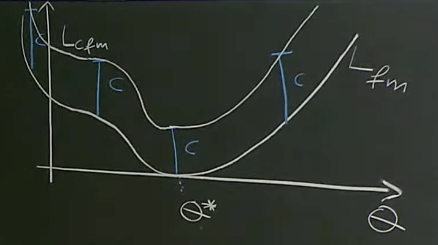

$\theta$ 的值不重要，我们不关心神经网络具体参数值什么，重要的是最小化器（Minimizer），我们记为 $\theta^*$。

$\Rightarrow$ ①  对于 $L_{cfm}$ 的最小化器 $\theta^*$：$u_t^{\theta^*} = u_t^{target}$

$\Rightarrow$ ②  $\nabla_\theta L_{cfm}(\theta) = \nabla_\theta L_{fm}(\theta)$

​	$\Rightarrow$  SGD（随机梯度下降）是相同的。

###### 3.2.4 算法（通用）

算法3：流匹配训练过程（通用）

输入：一个样本 $z \sim p_{data}$ 数据集，神经网络 $u_t^{\theta}$

对每个最小批次（mini-batch）的数据循环：

​	采样$z \sim p_{data}$

​	采样$t \sim \mathcal{Unif}_{[0, 1]}$

​	采样 $x \sim p_t(\cdot \mid z)$

​	计算损失 $L (\theta)= \left \|  u_t^\theta(x) - u_t^{target}(x \mid z)\right \|^2$

​      （选择一种优化器）梯度下降更新模型参数

循环结束

> [!NOTE]
>
> - 流和扩散模型的强大之处就在于只需要最小化简单的均方误差。例如，GANs会有一个最小最大优化程序，比这复杂得多。
> - 这儿条件概率路径 $p_t(\cdot \mid z)$、条件向量场$u_t^{target}(x \mid z)$ 如上节课讲的，是我们选择的一组，它可以完成我们想要的工作。这是一个设计选择，也有很多其他选择，接下来的课程我们实际上会看到一组新的选择。

###### 3.2.5 例子——高斯概率路径的$L_{cfm}$

回顾：

$p_t(\cdot \mid z) = N(\alpha_t z, \beta_t^2 I_d)$，

$u_t^{target}(x|z) = (\dot{\alpha_t} - \frac{\dot{\beta_t}}{\beta_t}\alpha_t)z+ \frac{\dot{\beta_t}}{\beta_t}x$

继续推：

$\varepsilon\sim \mathcal{N}(0, I_d) \Rightarrow \alpha_tz + \beta_t\varepsilon \overset{\text{define}}{=} x \sim p_t(\cdot \mid z)$

$\Rightarrow$

$L_{cfm} (\theta)= \mathbb{E}[\left \|  u_t^\theta(x) - (\dot{\alpha_t} - \frac{\dot{\beta_t}}{\beta_t}\alpha_t)z - \frac{\dot{\beta_t}}{\beta_t}x \right \|^2 ]$

> $t \sim \mathcal{U}(0, 1)$，$z \sim p_{data}$，$x\sim \mathcal{N}(\alpha_t z, \beta_t^2 I_d)$
>
> 代入 $x = \alpha_tz + \beta_t\varepsilon$  再做些代数：

$= \mathbb{E}[\left \|  u_t^\theta(\alpha_tz + \beta_t\varepsilon) - (\dot{\alpha_t} - \frac{\dot{\beta_t}}{\beta_t}\alpha_t)z - \frac{\dot{\beta_t}}{\beta_t}(\alpha_tz + \beta_t\varepsilon) \right \|^2]$

$ = \mathbb{E}[\left \|  u_t^\theta(\alpha_tz + \beta_t\varepsilon) - (\dot{\alpha_t}z + \dot{\beta_t}\varepsilon) \right \|^2 ]$

对于指定的条件路径的实例： $\alpha_t = t, \quad \beta_t = 1-t$，

> [!TIP]
>
> Cond OT path
>
> 选择的 $\alpha_t = t, \quad \beta_t = 1-t$ 这样一条路径有特定的名称，就是所谓的条件最优传输路径（ Conditional Optimal Transport path）。

有：$\dot{\alpha_t} = 1, \dot{\beta_t} = -1$

$\therefore L_{cfm} (\theta)= \mathbb{E}[\left \|  u_t^\theta(tz + (1 - t)\varepsilon) - (z -\varepsilon) \right \|^2 ] $

> 非常简单吧，无法想象一个更简单的训练算法了。

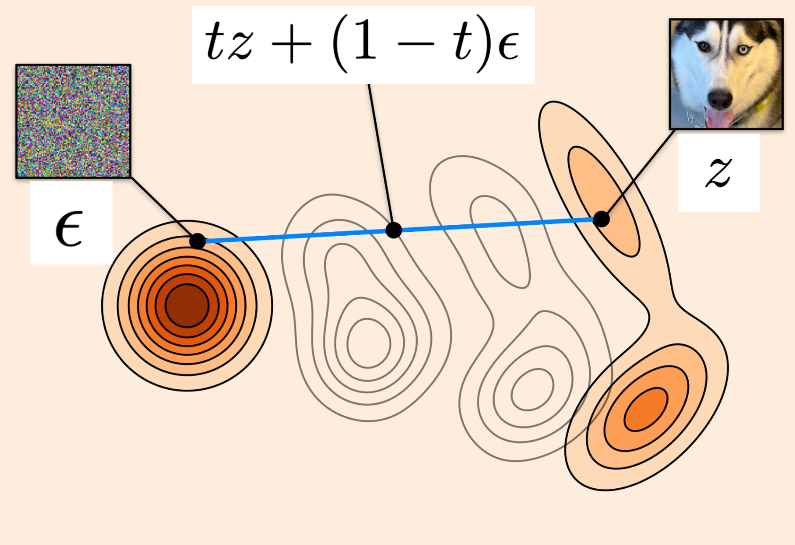

###### 3.2.6 算法（OT）

**Flow Matching Training for CondOT path**

<a name="algorithm4">算法4</a>：流匹配训练过程（最优传输路径）

输入：一个样本 $z \sim p_{data}$ 数据集，神经网络 $u_t^{\theta}$

对每个最小批次（mini-batch）的数据循环：

​	采样$z \sim p_{data}$

​	采样$t \sim \mathcal{Unif}_{[0, 1]}$

​	采样噪声 $\varepsilon \sim \mathcal{N}(0, I_d)$

​	设 $x = tz + (1-t)\varepsilon$

​	计算损失 $L (\theta)= \left \|  u_t^\theta(x) - (z - \varepsilon)\right \|^2$

​      （选择一种优化器）梯度下降更新模型参数

循环结束

> [!IMPORTANT]
>
> 让我们欣赏下该算法的简单：
>
> 我们在$z$ 和 $\varepsilon$ 之间的直线上取一个点，我们将其插入神经网络，然后神经网络本质上会学习预测数据和噪声两点之间的差异$z - \epsilon$。

> [!TIP]
>
> 思考：为了训练更稳定，采样$t$可以随训练进度动态调整，从接近1 → 接近0 的分布。因为$t=0$时只能访问噪声的信息，$t=1$时可以访问完整的数据点。所以随着时间推移，你将需要预测同样的东西，但是拥有的信息是不同的。
>
> 物理直觉：
>
> 本质上是在预测给定噪声、数据点和路径，在这条路径上的某个地方，你需要预测当前的速度。但在直线路径（OT）中，速度只是一个差值，两点间的向量。
>
> 而扩散模型走的是非直线，就像一些所谓的方差保持路径或方差爆炸路径。 

这可不是什么奇特的、太简单的算法，MovieGen（Meta）、Stable Diffusion 3（Stability AI）就是用的该[算法](#algorithm4)。

###### 3.2.7 证明

对[定理](#Theorem4)：$L_{fm}(\theta) = L_{cfm}(\theta) + C$ 的证明：

$\left\| a -b   \right\|^2 = \left\| a \right\|^2 - 2a^Tb + \left\| b \right\|^2$,   $(a,b \in \mathbb{R}^d)$

$L_{fm} (\theta)= \mathbb{E}[\left \|  u_t^\theta(x) - u_t^{target}(x)\right \|^2 ] =\mathbb{E}[\left \|  u_t^\theta(x) \right\|^2 -2u_t^\theta(x)^Tu_t^{target}(x) + \left \| u_t^{target}(x)\right \|^2 ]$

$L_{cfm} (\theta)= \mathbb{E}[\left \|  u_t^\theta(x) - u_t^{target}(x \mid z)\right \|^2 ] =\mathbb{E}[\left \|  u_t^\theta(x) \right\|^2 -2u_t^\theta(x)^Tu_t^{target}(x \mid z) + \left \| u_t^{target}(x \mid z)\right \|^2 ]$

> 然后  $\left \| u_t^{target}(x)\right \|^2$ 和 $\left \| u_t^{target}(x \mid z)\right \|^2$ 是和 $\theta$ 无关的常数，可以消掉，$\left \|  u_t^\theta(x) \right\|^2$ 项相同，也可以消掉。

  转变成了证明  $2u_t^\theta(x)^Tu_t^{target}(x)$ 与 $2u_t^\theta(x)^Tu_t^{target}(x\mid z)$ 的期望相同。 在课堂笔记中，对此进行了详细证明，这儿的点积是线性的，这里就略过了。

###### 3.2.8 采样算法

我们如何从刚刚训练好的流模型中采样（生成对象）呢？

参加[算法1 ](#algorithm1)ODE数值模拟——欧拉法

> [!TIP]
>
>  问：人们是否使用欧拉法？
>
> 答：最初是的，但现在人们最想要最小化神经网络的预测次数，也就是数值模拟中有多少步。所以关心效率时，人们通常使用高阶ODE求解器。
>
> - Euler 方法（欧拉法）是最基本的 ODE 数值求解器之一，属于一阶（first-order）ODE solver。
> - “higher-order” 指的是方法的收敛阶（order of accuracy），也就是它逼近真实解的速度。

#### 3.3 得分匹配

回顾：

边际得分函数：

$\nabla \log p_t(x) = \int \nabla \log p_t(x|z) \frac{ p_t(x|z)p_{data}(z)}{p_t(x)}dz$，是后验概率加权积分的形式。

定理（SDE扩展的技巧）：

对于任意$\sigma_t \ge 0$，

$X_0 \sim p_{init}, \quad dX_t = [u_t^{target}(X_t) + \frac{\sigma_t^2}{2}\textcolor{blue}{\nabla \log p_t(x_t)}]dt + \sigma_tdW_t$

>  [!NOTE]
>
> 得分函数 本质上就是 我们需要应用的校正项。
>
> **得分函数校正了“随机扩散轨迹”的方向**，让它向数据靠近。

$ \Rightarrow X_t \sim p_t \quad (0 \le t \le 1) \Rightarrow X_1 \sim p_{data}$

###### 3.3.1 得分匹配损失

得分匹配网络：

$s_t^\theta$  ($\theta$：parameters )

目标： 

$s_t^\theta \approx \nabla \log p_t$

由于边际得分函数和边际向量场的（边缘化）公式非常类似，这儿的推导也是类似的，即将证明：$\mathcal{L}_{sm}(\theta) = \mathcal{L}_{dsm}(\theta) + C$

> [!NOTE]
>
> 人们习惯将条件得分匹配损失，称作去噪得分匹配损失。实则是一回事。

###### 3.3.2 去噪得分匹配损失

$L_{sm} (\theta)= \mathbb{E}_{t,z,x}[\left \|  s_t^\theta(x) - \nabla \log p_t(x) \right \|^2 ]$，

> ✓ Minimizer ✗ Tractable

$L_{dsm} (\theta)= \mathbb{E}_{t,z,x}[\left \|  s_t^\theta(x) - \nabla \log p_t(x \mid z) \right \|^2 ]$，

> ? Minimizer ✓ Tractable

###### 3.3.3 定理

$\mathcal{L}_{sm}(\theta) = \mathcal{L}_{dsm}(\theta) + C$，for $C \lt 0$ independent of $\theta$

$\Rightarrow$ ①  对于 $\mathcal{L}_{dsm}$ 的最小化器 $\theta^*$：$s_t^{\theta^*} = \nabla \log p_t(x)$

$\Rightarrow$ ②  $\nabla_\theta \mathcal{L}_{dsm}(\theta) = \nabla_\theta L_{sm}(\theta)$

​	$\Rightarrow$  SGD（随机梯度下降）是相同的。

###### 3.3.4 算法（通用）

算法5：得分匹配训练过程（通用）

输入：一个样本 $z \sim p_{data}$ 数据集，得分网络 $s_t^{\theta}$

对每个最小批次（mini-batch）的数据循环：

​	采样$z \sim p_{data}$

​	采样$t \sim \mathcal{U}_{[0, 1]}$

​	采样 $x \sim p_t(\cdot \mid z)$

​	计算损失 $\mathcal{L} (\theta)= \left \|  s_t^\theta(x) - \nabla \log p_t(x \mid z)\right \|^2$

​      （选择一种优化器）梯度下降更新模型参数

循环结束

###### 3.3.5 例子——高斯概率路径的$\mathcal{L}_{dsm}$

回顾：

$\nabla_x \log p_t(x|z) = -\frac{x - \alpha_t z}{\beta_t^2}$

$\varepsilon \sim \mathcal{N}(0, I_d) \Rightarrow x = \alpha_t z + \beta_t \varepsilon \sim \mathcal{N}(\alpha_t z, \beta_t^2 I_d)$

继续推：

$\mathcal{L}_{dsm}(\theta) = \mathbb{E}_{t \sim Unif,z \sim p_{data},x \sim p_t(\cdot \mid z)}[\left \|  s_t^\theta(x) + \frac{x - \alpha_t z}{\beta_t^2} \right \|^2 ]$

$= \mathbb{E}_{t \sim Unif,z \sim p_{data},x \sim p_t(\cdot \mid z)}[\left \|  s_t^\theta(\alpha_t z + \beta_t \varepsilon) + \frac{\varepsilon}{\beta_t} \right \|^2 ]$

> [!TIP]
>
> 现在你应该理解，为什么它被称为 去噪得分匹配，是因为被发现对于高斯概率路径，我们只是学习预测用于破坏数据点的噪声。

###### 3.3.6 算法（高斯概率路径）

**Score Matching Training for Gaussian probability path**

算法6：得分匹配训练过程（高斯概率路径）

输入：一个样本 $z \sim p_{data}$ 数据集，得分网络（或称 噪声预测器） $s_t^{\theta}$ 

输入：Schedulers $\alpha_t$, $\beta_t$ with $\alpha_0 = \beta_1 = 0$, $\alpha_1 = \beta_0 = 1$

对每个最小批次（mini-batch）的数据循环：

​	采样$z \sim p_{data}$

​	采样$t \sim \mathcal{Unif}_{[0, 1]}$

​	采样噪声 $\varepsilon \sim \mathcal{N}(0, I_d)$

​	设 $x = \alpha_tz + \beta_t \varepsilon$

​	计算损失 $L (\theta)= \left \|  s_t^\theta(x_t) + \frac{\varepsilon}{\beta_t} \right \|^2$

​      （选择一种优化器）梯度下降更新模型参数

循环结束

> [!NOTE]
>
> 值得一提的是，对于较小的$\beta_t$，$\frac{\varepsilon}{\beta_t}$在数值上是不稳定的。所以对于$t$接近1时，损失可能不稳定。
>
> 扩散模型研发的早期就意识到这点，并且有一些技巧可以解决。在课堂笔记里有介绍。  但得分匹配是在扩散模型之前就提出的，那时人们反对这种匹配具有高方差。

问答：

> [!NOTE]
>
> 问：我们能否避免同时学习它们（流匹配网络 和 得分匹配网络）？
>
> 答：其实我稍后会讲到这个。答案是肯定的。
>
> 原则上，对于一般情况，你必须同时学习它们。
>
> 但是，在最重要的特定的高斯概率路径，我们可以将它们相互转换。
>
> 但即使你必须同时学习它们，请记住，我们可以将它们放在同一个网络中，也就是为一个图像的每个像素制作两个输出，所以它的计算成本不会那么高。

###### 3.3.7 采样算法

扩散模型的随机采样：

我们将训练好的新网络插入到SDE：

$X_0 \sim p_{init}, \quad dX_t = [u_t^{target}(X_t) + \frac{\sigma_t^2}{2}\textcolor{blue}{\nabla \log p_t(x_t)}]dt + \sigma_tdW_t$

$\downarrow$ 插入 表示向量场的网络 和 得分网络

$X_0 \sim p_{init}, \quad dX_t = [u_t^{\theta}(X_t) + \frac{\sigma_t^2}{2}s_t^{\theta}(x_t)]dt + \sigma_tdW_t$

经过训练 $\Rightarrow X_t \sim p_t$

###### 3.3.8 去噪扩散模型（DDMs）

**术语**

去噪扩散模型 = 高斯概率路径$\mathcal{N}(\alpha_t z, \beta_t^2I_d)$（我们的标准例子）的扩散模型

通用术语中 Terminology（by many people）

去噪扩散模型 = 扩散模型

> 也就是说，许多人提到扩散模型，就是指的这个特定的实例。人们会用不同的方式谈论同一件事。
>
> 当和你的同事交谈时，他们会用一种完全不同的语言，不要感到困惑。这并不奇怪，因为算法是通过许多不同的方式发现的。

**特殊性质**

向量场和得分函数 可以 相互转换。 所以同一个网络即可完成 流匹配 和 得分匹配。

$\because$ 向量场 和 得分函数 都是 $x$ 和 $z$ 的某种加权

$\lambda_1 z + \lambda_2 x$，$\lambda_1' z + \lambda_2' x$

经过代数，就能得出它们能相互转换：

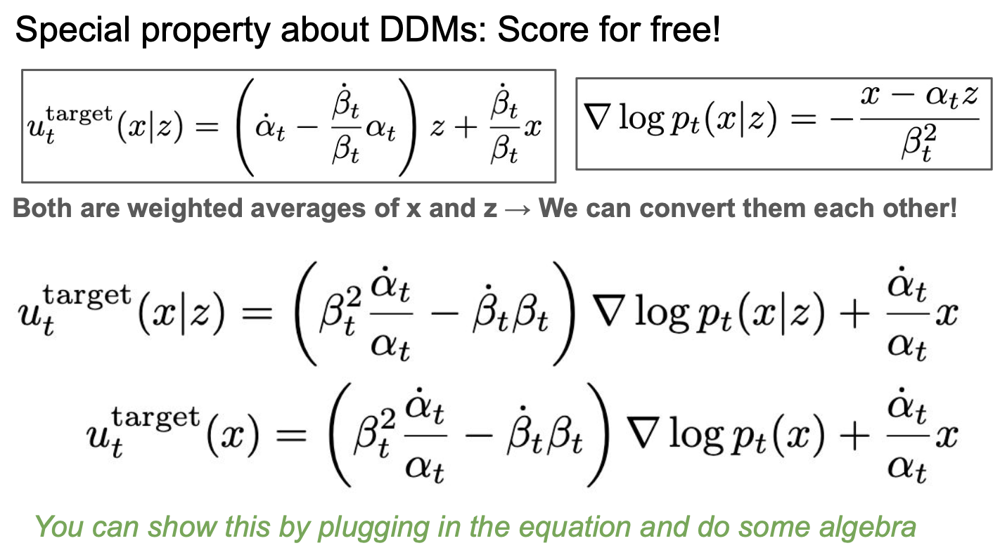

训练后的边际向量场 可以转换为 得分网络，反之亦然。

即，得分是免费获取的。

> [!TIP]
>
> 所以第一代的扩散模型文章，只讨论 得分匹配。 因为它们隐式地依赖于高斯概率路径的去噪扩散模型。然后可以将东西相互转换。

**总结**

我们在这里得到一个完整的端到端训练和采样算法。我们有一个通用的模型，可以从数据分布中生成样本。

下周的课程将更加注重应用，我们将讨论针对特定应用可以做出的具体选择：

- 神经网络架构，即$u_t^{\theta}$、$s_t^{\theta}$这些函数具体是什么
- 基于提示词的条件
-  图像生成器 或 视频生成器
- 其他应用：机器人技术、蛋白质设计

我们可以将任意分布相互转换，任意的 $p_{init}$ 和 $p_{data}$，所以我们不仅仅是关心去噪扩散模型（DDMs）。因为DDMs总是从某种高斯噪声作为 $p_{init}$ 开始。

但可能还有其他情况，你的初始分布要有趣得多，而且有很多人在探索这一点。

在图像空间、音频空间以及科学领域，许多时候，你的初始分布本身就很有意义，例如：

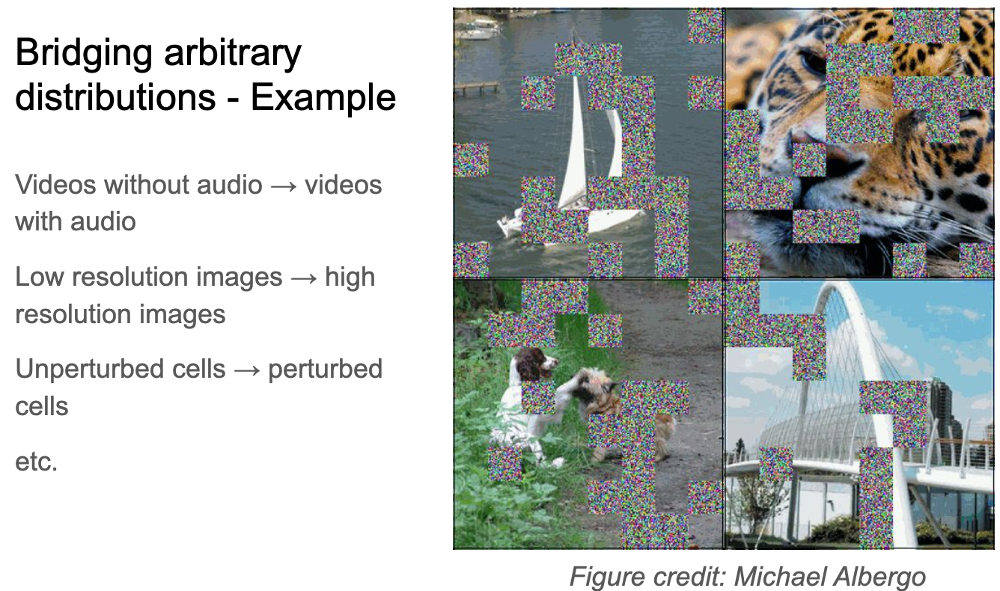

> 我觉得可以预测转换域的东西，定义清楚这个转换，是光流？是高频残差？等等。 有意义的输入则作为参考信息。

## 第四章 构建一个图像生成器

为了避免混乱，本章只以流模型为例，进行介绍。但所讲述的内容都可扩展到扩散模型。

议程：

1. 将生成模型框架从 无条件生成 延伸到 有条件生成。
2. 开发用于条件采样的无分类器引导（classifier-free guidance）方法。
3. 讨论图像生成这一典型案例中的架构选择，并综述当前主流模型。

#### 4.1 条件生成和引导

无条件 也可以 称作 无引导（Unguided）

有条件 也可以 称作 有引导（Guided）

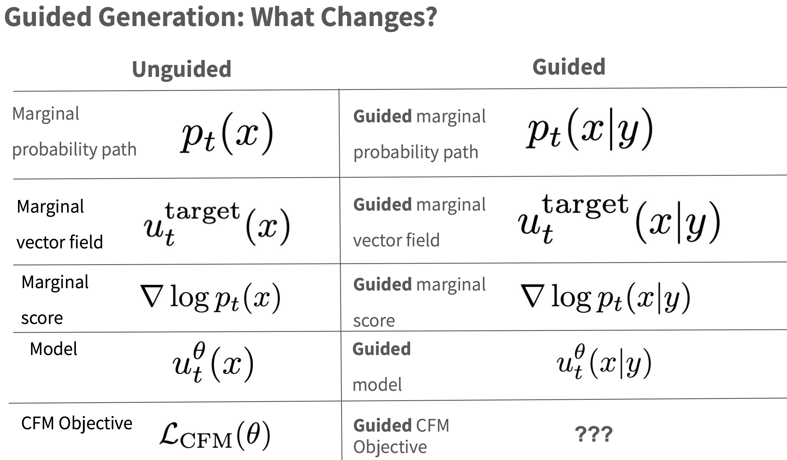

###### 4.1.1 有引导的条件匹配目标函数 $\mathcal{L}_{cfm}^{guided}$

观察：当 $y$ 固定时，我们实际退化为无引导生成：

> 此时 $y$ 可以理解为 超参数。 

$\mathcal{L}_{cfm}^{guided}(\theta ; y) =\mathbb{E}_{\square}[\left \|  u_t^\theta(x) - u_t^{target}(x \mid z)\right \|^2 ]$，

$\square = \textcolor{blue}{z \sim p_{data}(z \mid y)}, t \sim \mathcal{U}[0,1), x \sim p_t(x\mid z)$

观察：当让 $y$ 变化时：

$\mathcal{L}_{cfm}^{guided}(\theta) =\mathbb{E}_{\square}[\left \|  u_t^\theta(x) - u_t^{target}(x \mid z)\right \|^2 ]$，

$\square = \textcolor{red}{(z, y) \sim p_{data}(z, y)}, t \sim \mathcal{U}[0,1), x \sim p_t(x\mid z)$

###### 4.1.2 无分类器引导（CFG）

| 名称                                          | 定义                                                         | 是否使用条件？ | 是否用分类器？ |
| --------------------------------------------- | ------------------------------------------------------------ | -------------- | -------------- |
| **无引导生成** (*unconditional generation*)   | 不提供任何条件，模型自由生成样本                             | ❌ 否           | ❌ 否           |
| **有引导生成** (*conditional generation*)     | 提供条件（如文本、类别）来控制生成                           | ✅ 是           | ✅ / ❌          |
| **有分类器引导** (*classifier guidance*)      | 使用独立的分类器来引导生成趋向目标类别                       | ✅ 是           | ✅ 是           |
| **无分类器引导** (*classifier-free guidance*) | 不使用分类器，而是训练一个能同时进行有/无条件生成的模型，在推理时人为混合 | ✅ 是           | ❌ 否           |

**无引导生成**：用于评估模型的基础能力；或生成多样化样本；

**有引导生成**：

- **有分类器引导**：早期的方法，但需要训练或提供外部分类器；

  **用另一个分类器告诉模型“图像像不像 $y$”**，然后往“更像 $y$”方向走。

  - 本质：**用分类器给的方向来指导生成**
  - 实现：要给图像打分，然后反向传播出“变得更像 y”的梯度
  - 缺点：**慢，要用梯度反传，还要额外训练一个分类器**

- **无分类器引导**：现代主流方法，易实现且效果好。

  **用模型自己预测“有条件”和“没条件”两种方向，然后人为混合**，走向更像 y 的方向。

  - 本质：**用模型自己两个版本的预测结果做“加权”**

  - 实现：直接：

    $\tilde{u}(x \mid y) = (1-w)u(x \mid \emptyset) + w u(x \mid y)$

  - 优点：**快！只用一个模型，不用分类器也不用反传梯度**

> [!TIP]
>
> 问：为什么不能对有分类器引导也这么加权？
>
> 答：因为它的“引导方向”是用分类器反传出来的梯度（方向），**不是一个完整的预测向量场**，你没法跟另一个向量直接相加。
>  而 classifier-free guidance 是两个完整的模型输出，当然可以直接加。
>
> - **无分类器引导（Classifier-Free Guidance）** 是一种 **启发式方法**，通过**线性组合**模型在**有条件**与**无条件**下的预测结果，来构造一个引导向量场，以实现条件控制。
>
> - **有分类器引导（Classifier Guidance）** 是一种 **理论驱动的方法**，直接利用一个额外分类器 $C(x)$ 对条件概率 $p(y \mid x)$ 的梯度 $\nabla_x \log p(y \mid x)$，来增强模型生成结果对条件 $y$ 的符合
>
> - 相当于对于 $\nabla_x \log p(x \mid y) = \nabla_x \log p(x) +  w \nabla_x \log p(y \mid x)$，
>
>   有分类器引导的$w \nabla_x \log p(y \mid x)$是实际反向传播分类器获得的。而无分类器引导里只是推导过程中的一个式子，可以继续拆解、推导。

###### 4.1.3 CFG推导

$\log p(x \mid y) = \log p(x) + \log p(y \mid x) - \log p(y)$ 

对两边求导有：

$\nabla_x \log p(x \mid y) = \nabla_x \log p(x) + \nabla_x \log p(y \mid x) - \underbrace{\nabla_x \log p(y)}_{\text{= 0}}$

其中

$\nabla_x \log p(x)$ 是**无条件（边际）数据分布**的对数梯度，

$\nabla_x \log p(y \mid x)$是**条件信息（如分类器）提供的额外梯度**。

实际操作中，直接用上式做采样，往往会弱化条件的引导效果，所以提出了引入一个超参数 $w$ 调节条件梯度的强度：

$\nabla_x \log p(x \mid y) = \nabla_x \log p(x) +  w \nabla_x \log p(y \mid x)$

$= \nabla_x \log p(x) + w(\underbrace{\nabla_x \log p(y)}_{=0} + \nabla_x \log p(x \mid y) - \nabla_x \log p(x))$

$= \nabla_x \log p(x) + w \nabla_x \log p(x \mid y) - w \nabla_x \log p(x)$

$= (1 - w)\nabla_x \log p(x) + w \nabla_x \log p(x \mid y)$

> 因为 $p(y)$ 与 $x$ 无关，对 $x$ 的梯度是0。

> [!NOTE]
>
> $\nabla_x$ 读作：“对 $x$ 的梯度” 或 “在 $x$ 方向上的梯度”。
>
> 符号 $\nabla_x \log p(x)$ 通常称为得分函数（score function），也叫对数梯度。它描述“朝着高概率区域改变 $x$ 的方向和速率的向量”。

$\therefore \tilde{u}_t(x\mid y) = (1 - w)u_t^{target}(x) + wu_t^{target}(x \mid y)$

推出 无分类器引导（classifier-free guidance）的 核心思想在向量场形式上的表达。

> 我们用有条件和无条件的向量场按比例加权，得到一个“折中”方向，来引导采样过程。

- $w = 0$：完全不考虑条件，相当于 **无引导生成**。
- $w = 1$：完全使用有条件引导，相当于普通 **条件生成**。
- $w > 1$：**放大条件影响力**，常用于生成更契合提示的样本

###### 4.1.4 CFG训练

观察：我们可以将无引导的向量场视为没有任何条件的情况。
 但“没有条件”也是一种条件：

$u_t^{target}(x) = u_t^{target}(x\mid y = \emptyset)$

我们现在可以训练一个单一模型 $u_t^{\theta}(x \mid y)$，其中 $y \in \mathcal{Y} \cup \{\emptyset\}$，通过重复使用$\mathcal{L}_{cfm}^{guided}(\theta)$，并偶尔将 $y$ 设为 $\emptyset$：

$\mathcal{L}_{cfm}^{CFG}(\theta) =\mathbb{E}_{\square}[\left \|  u_t^\theta(x) - u_t^{target}(x \mid z)\right \|^2 ]$，

$\square = (z, y) \sim p_{data}(z, y), \textcolor{red}{\text{with prob.} \eta , y \leftarrow \emptyset}, t \sim \mathcal{U}[0,1), x \sim p_t(x\mid z)$

###### 4.1.5 CFG采样

每一步都调用模型两次（无条件 & 有条件），计算量是原来的两倍。但是工程上有些优化方法。

