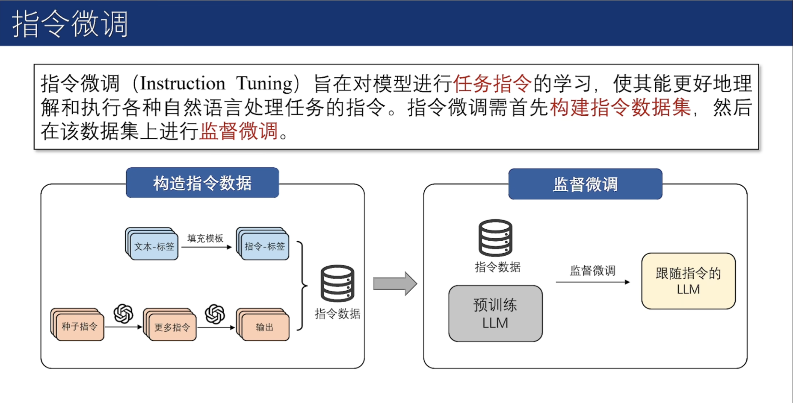

https://github.com/ZJU-LLMs/Foundations-of-LLMs

[浙江大学-大模型原理与技术](https://www.bilibili.com/video/BV1PB6XYFET2/)

[3Blue1Brown - Transformers (how LLMs work) explained visually | DL5](https://youtu.be/wjZofJX0v4M?si=YwW-fv3x2w6n5iQQ)

毛玉仁

## 第零章 语言模型基础

#### 00 序言

**语言之于智能**：在认知层面，语言与智能紧密相连，语言是智能的载体。

**如何建模语言**：将语言建模为一系列词元（Token）组成的序列数据。其中，词元是不可再拆分的最小语义单位。

**语言模型**：语言模型旨在预测一个词元或词元序列出现的概率。现有语言模型通常基于规则、统计或学习来构建。

`{我，为，什么，要，选，这，门，课}` → 语言模型 → 0.66666


语言模型的概率预测与<font color="seablue">上下文</font>和<font color="seablue">语料库</font>息息相关。

上下文

{这，课，好，难，`我，为，什么，要，选，这，门，课`} → 语言模型 → 0.9

{这，课，好，简，单，`我，为，什么，要，选，这，门，课`} → 语言模型 → 0.2

语料库

普通话语料库：`{我，为，什么，要，选，这，门，课}` → 语言模型 → 0.6

四川话语料库：

`{我，为，什么，要，选，这，门，课}` → 语言模型 → 0.2

`{我，为，啥子，要，选，这，门，课}` → 语言模型 → 0.6

综合以上两点，我们可以用条件概率的链式法则对语言模型的概率进行建模。

**条件概率链式法则**

设词元序列为$\{w_1, w_2, ..., w_N\}$，其概率可由条件概率的链式法则进行计算。

$P(\{w_1, w_2, ..., w_N\}) = P(w_1) \cdot P(w_2|w_1) \cdot  P(w_3|w_1,w_2) ... P(w_N|w_1,w_2, ... , w_{N-2}, w_{N-1})$

**n-阶马尔科夫假设**

当前状态只与<font color="seablue">前面n个状态</font>有关。

对序列$\{w_1, w_2, ..., w_N\}$，当前状态$w_N$出现的概率只与前n个状态$\{w_{N-n},... ,w_{N-1}\}$有关，即：

$P(w_N|w_1,w_2, ... , w_{N-1}) \approx P(w_N|w_{N-n},... ,w_{N-1})$


#### 01 基于统计的语言模型

###### 1.1 n-grams 语言模型

n-grams 语言模型中的n-gram 指的是长度为n 的词序列。n-grams 语言模型通过依次统计文本中的n-gram 及其对应的(n-1)-gram 在语料库中出现的相对频率来

计算文本$w_{1:N}$ 出现的概率。

> 经典的n-grams语言模型，被工业界沿用至今。


n-grams语言模型中，<font color="brwon">n为变量</font>，当n=1时，称之为<font color="brwon">unigram</font>，其不考虑文本的上下文关系。当n=2时，称之为<font color="brwon">bigrams</font>，其对前一个词进行考虑。当n=3时，称之为<font color="brwon">trigrams</font>，其对前两个词进行考虑。以此类推。

bigrams的例子：


虽然“长颈鹿脖子长”并没有直接出现在语料库中，但是bigrams 语言模型仍可以预测出“长颈鹿脖子长”出现的概率有 2/15。由此可见，n-grams具备<font color="brwon">对未知文本的泛化能力</font>。

###### 1.2 n-grams中的n

$P_{trigrams}(长颈鹿, 脖子, 长) = \frac{C(长颈鹿, 脖子, 长)}{C(长颈鹿, 脖子)} = 0$

n的选择会影响n-grams模型的<font color="brwon">泛化性能</font>和<font color="brwon">计算复杂度</font>。实际中n通常<font color="brwon">小于等于5</font>。

泛化性：在n-grams 语言模型中，<font color="brwon">n 代表了拟合语料库的能力与对未知文本的泛化能力之间的权衡</font>。当n 过大时，语料库中难以找到与n-gram 一模一样的词序列，可能出现大量“零概率”现象；在n 过小时，n-gram 难以承载足够的语言信息，不足以反应语料库的特性。

计算量：随着n的增大，n-gram模型的参数呈指数级增长。假设语料库中包含1000个词汇，则unigram的参数量为1000，而bigrams的参数量则为1000*1000。

**n-grams中的统计学原理**

n-grams语言模型是在n阶马尔可夫假设下，对语料库中出现的<font color="brwon">长度为n的词序列出现概率</font>的<font color="brwon">极大似然估计</font>。

###### 1.3 n-grams语料及数据

n-gram的效果与语料库息息相关。Google在2005年开始Google Books Library Project项目，试图囊括自现代印刷术发明以来的全世界所有的书刊。其提供了unigram到5-gram的数据。

**n-grams的应用**

n-gram不仅在输入法、拼写纠错、机器翻译等任务上得到广泛应用。其还推动了Culturomics（文化组学）的诞生。

**n-grams的缺点**

n-gram因为观测长度有限，无法捕捉长程依赖。此外，其是逐字匹配的，不能很好地适应语言的复杂性。


#### 02 基于学习的语言模型

###### 2.0 学习与统计的区别

统计：设计模型，描摹已知。

学习：找到模型，预测未知。


###### 2.1 机器学习的过程

机器学习的过程：在某种<font color="brwon">学习范式</font>下，基于<font color="brwon">训练数据</font>，利用<font color="brwon">学习算法</font>，从受<font color="brwon">归纳偏置</font>限制的<font color="brwon">假设类</font>中选取可以达到<font color="brwon">学习目标</font>的假设，该假设可以<font color="brwon">泛化</font>到未知数据上。

假设类：


归纳偏置：


学习范式：


学习目标：


损失函数：


学习算法：

1阶优化：目前最常用的梯度下降。

0阶优化：对梯度进行模拟，用估计出来的梯度来对模型进行优化。


泛化误差：


泛化误差界的公式来自<font color="brwon">概率近似正确</font>（PAC，Probably Approximately Correct）理论。

PAC Learning为机器学习提供了对机器学习方法进行定量分析的理论框架，可以为设计机器学习方法提供理论指导。

> Leslie Valiant由该理论，获得2010年图灵奖。


###### 2.2 机器学习的发展历程


#### 03 RNN与Transformer

###### 3.1 RNN

RNN 是一类<font color="brwon">网络连接中包含环路的神经网络的总称</font>。


RNN 在串行输入的过程中，前面的元素会被循环编码成<font color="brwon">隐状态</font>，并<font color="brwon">叠加到当前的输入上面</font>。是在时间维度上嵌套的复合函数。

在训练RNN时，涉及大量的矩阵联乘操作，容易引发<font color="brwon">梯度衰减</font>或<font color="brwon">梯度爆炸</font>问题。

**LSTM**

为解决经典RNN的梯度衰减/爆炸问题，带有<font color="brwon">门控机制</font>的LSTM被提出。

LSTM将经典RNN中的通过复合函数传递隐藏状态的方式，解耦为<font color="brwon">状态累加</font>。隐藏状态通过<font color="brwon">遗忘门</font>、<font color="brwon">输入门</font>来实现合理的状态累加，通过<font color="brwon">输出门</font>实现合理整合。

- LSTM中采用遗忘门来适度忘记“往事”。
- LSTM中采用输入门来对“新闻”进行选择性聆听。
- 将“往事”与“新闻”相加得到当前状态。
- LSTM采用输出门，考虑“人情世故”，将当前状态适度输出。

GRU为降低LSTM的计算成本，GRU将遗忘门与输入门进行合并。

###### 3.2 Transformer


​                                    左边是Encoder模块，右边是Decoder模块

典型的支持<font color="brwon">并行输入</font>的模型是Transformer，其是一类基于注意力机制的<font color="brwon">模块化</font>构建的神经网络结构。

两种主要模块

**(1) 注意力模块**

注意力模块负责对<font color="brwon">上下文</font>进行通盘考虑。

注意力模块由自<font color="brwon">注意力层</font>、<font color="brwon">残差连接</font>和<font color="brwon">层正则化</font>组成。


**(2) 全连接前馈模块**

全连接前馈模块占据了Transformer近三分之二的参数，掌管着Transformer模型的<font color="brwon">记忆</font>。

1. 注意力层


说白了是加权输出的机制，而权重是通过$W_q$、$W_k$两个矩阵学出来的。

<font color="brwon">加权平均</font>：原值是$v$，权重是当前位置的$q$和上下文的$k$的相似度。

> 袁粒老师的比喻
>
> —— 想在京东买一件女式的红色大衣
>
> **Q、K、V的解释：** 
> Q：输入的查询词：“女式”、“红色”、“大衣”；K：搜索引擎根据输入Q提供K（颜色、种类等），根据Q与K的相似程度匹配到最终搜索到的商品V。

2. 层正则化与残差连接

层正则化用以加速神经网络训练过程并取得更好的泛化性能；引入残差连接可以有效解决梯度消失问题。

> 残差连接加在LN前叫pre-LN，加在LN后叫post-LN。不同的模型里，两种加法性能各有优劣。

**自回归 vs. Teacher Forcing**

自回归面临着错误级联放大和串行效率低两个主要问题。为了解决上述两个问题，Teacher Forcing在语言模型预训练过程中被广泛应用。


###### 3.3 训练RNN/Transformer的过程


但Teacher Forcing的训练方式将导致<font color="brwon">曝光偏差</font>（Exposure Bias）：训练模型的过程和模型在推理过程存在差异。其易导致<font color="brwon">模型幻觉</font>问题。

#### 04 语言模型采样与评测

###### 4.1 语言模型的采样

语言模型每轮预测输出的是一个概率向量。我们需要<font color="brwon">根据概率值从词表中选出本轮输出的词元</font>。选择词元的过程被称为<font color="brwon">采样</font>。

两类主流的采样方法可以总结为 

(1). 概率最大化方法

最大化$P(w_{N+1:N+M}) = \prod_{i=N}^{N+M-1} P(w_{i+1}|w_{1:i}) = \prod_{i=N}^{N+M-1}o_i(w_{i+1})$

假设生成M个词元，概率最大化方法的搜索空间为$M^D$，是<font color="brwon">NP-Hard问题</font>。

- 贪心搜索法

  贪心搜索在每轮预测中都选择概率最大的词

  

- 波束搜索法

  波束搜索在每轮预测中都先保留b个可能性最高的词，在结束搜索事，得到M个集合。找出最优组合使得联合概率最大。

  

但概率最大的文本通常是<font color="brwon">最为常见的文本</font>。这些文本会略显平庸。用于生成代码还行。但在开放式文本生成中，贪心搜索和波束搜索都容易生成一些<font color="brwon">“废话文学”</font>——重复且平庸的文本。 

(2). 随机采样方法

在每轮预测时，其先选出<font color="brwon">一组</font>可能性高的候选词，然后按照其概率分布进行随机采样。

- Top-k采样方法

  在每轮预测中都选取K个概率最高的词作为本轮的候选词集合。

  缺点：受候选词分布的方差的影响，方差大时可能“胡言乱语”，方差小时，候选集不够丰富。

- Top-P采样方法：

  Top-P设定阈值p来对候选集进行选取。

**Temperature机制**

Top-K采样和Top-P采样的随机性由语言模型输出的概率决定，不可自由调整。但在<font color="brwon">不同场景</font>中，我们<font color="brwon">对于随机性的要求可能不同</font>。引入Temperature机制可以对解码随机性进行调节。


Temperature越高随机性越高。可以看到T无穷大时，会变成概率为$\frac{1}{K} $或$\frac{1}{|S_p|} $的均匀分布。反之，T趋近于0时，也会将概率值大的输出通过指数放缩得更大，再归一化。

###### 4.2 语言模型评测

（1）内在评测：测试文本通常由与预训练中所用的文本独立同分布的文本构成，不依赖于具体任务。

<font color="brwon">困惑度（Perplexity）</font>，$PPL(s_{test})=P(w_{1:N})^{-\frac{1}{N}}=\sqrt[N]{\prod_{i=1}^{N}\frac{1}{P(w_i|w_{<i})} } $

困惑度减小也意味着熵减，意味着模型“胡言乱语”的可能性降低。

（2）外在评测：测试文本通常包括该任务上的问题和对应的标准答案，其依赖于具体任务。

- 基于统计指标的评测

  <font color="brwon">BLEU </font>(BiLingual Evaluation Understudy)：计算n-gram匹配精度的一种指标

  

  示例：“大语言模型”翻译成英文，生成的翻译为“big  language models”，而参考文本为“large language models”。

  当n=1时，$Pr(g_1)=\frac{2}{3}$。

  当n=2时，$Pr(g_2)=\frac{1}{2}$。

  当N=2时，$BLEU = \sqrt{\frac{1}{2}\cdot\frac{2}{3}}=\sqrt{\frac{1}{3}}$ 

  

- 基于语言模型的评测

  从语义理解的层面进行评测

  1. 基于上下文词嵌入：上下文词嵌入（Contextual Embeddings）向量的相似度。

  2. 基于生成模型：直接利用提示词工程引导LLM输出评测分数。属于无参评价。

     

###### 4.3 语言模型的应用

- 直接应用

  语言模型输出的概率值可以直接应用于输入法、机器翻译、对话等任务。

- 间接应用

  语言模型中间产出的文本嵌入可以应用于实体识别、实体检测、文本检索等任务。

## 第壹章 大语言模型架构

#### 10 模型架构概览

**涌现能力**：实验发现<font color="brwon">新能力</font>随着<font color="brwon">模型规模</font>提升<font color="brwon">凭空自然涌现</font>出来，因此将其称为<font color="brwon">涌现能力</font>（Emergent Abilities），例如上下文学习、逻辑推理和常识推理等能力。

**扩展法则**：GPT系列模型的性能提升，有着一系列关于<font color="brwon">模型能力与参数/数据规模之间的定量关系</font>作为理论支撑，即<font color="brwon">扩展法则</font>（Scaling Law）。其中以OpenAI提出的Kaplan-McCandlish法则以及DeepMind提出的Chinchilla法则最为著名。

**模型基础**：Transformer灵活的并行架构为<font color="brwon">训练数据和参数的扩展</font>提供了<font color="brwon">模型基础</font>，推动了本轮大语言模型的法则。

> [!NOTE]
>
> 如上一章所述Transformer是模块化的模型

###### 1.1 基于Transformer的三种架构

在<font color="brwon">Transformer</font>的基础上衍生出了<font color="brwon">三种主流模型架构</font>。

> [!TIP]
>
> - **纯 Encoder 模型**（例如 BERT），又称自编码 (auto-encoding) Transformer 模型；
> - **纯 Decoder 模型**（例如 GPT），又称自回归 (auto-regressive) Transformer 模型；
> - **Encoder-Decoder 模型**（例如 BART、T5），又称 Seq2Seq (sequence-to-sequence) Transformer 模型。

- Encoder-only架构

  只选用Transformer中的<font color="brwon">Encoder部分</font>，代表模型为BERT系列。

  

- Encoder-Decoder架构

  同时选用Transformer中的<font color="brwon">Encoder和Decoder部分</font>，代表模型为T5、BART等。

  

- Decoder-only架构

  只选用Transformer中的<font color="brwon">Decoder部分</font>，代表模型为GPT和LLaMA系列。

  

###### 1.1（加餐-理论）

https://transformers.run/c1/transformer/

标准的 Transformer 模型主要由两个模块构成：

- **Encoder（左边）：**负责理解输入文本，为每个输入构造对应的语义表示（语义特征）；

- **Decoder（右边）：**负责生成输出，使用 Encoder 输出的语义表示结合其他输入来生成目标序列。

  

这两个模块可以根据任务的需求而单独使用：

- **纯 Encoder 模型：**适用于只需要理解输入语义的任务，例如句子分类、命名实体识别；
- **纯 Decoder 模型：**适用于生成式任务，例如文本生成；
- **Encoder-Decoder 模型**或 **Seq2Seq 模型：**适用于需要基于输入的生成式任务，例如翻译、摘要。

**<font color="brwon">原始结构</font>**

Transformer 模型本来是为了翻译任务而设计的。在训练过程中，<font color="brwon">Encoder 接受源语言的句子</font>作为输入，而 <font color="brwon">Decoder 则接受目标语言的翻译</font>作为输入。在 Encoder 中，由于翻译一个词语需要依赖于上下文，因此注意力层可以访问句子中的所有词语；而 Decoder 是顺序地进行解码，在生成每个词语时，注意力层只能访问前面已经生成的单词。

例如，假设翻译模型当前已经预测出了三个词语，我们会把这三个词语作为输入送入 Decoder，然后 Decoder 结合 Encoder 所有的源语言输入来预测第四个词语。

> 实际训练中为了加快速度，会将整个目标序列都送入 Decoder，然后在注意力层中通过 Mask 遮盖掉未来的词语来防止信息泄露。例如我们在预测第三个词语时，应该只能访问到已生成的前两个词语，如果 Decoder 能够访问到序列中的第三个（甚至后面的）词语，就相当于作弊了。

其中，<font color="brwon">Decoder 中的第一个注意力层关注 Decoder 过去所有的输入，而第二个注意力层则是使用 Encoder 的输出</font>，因此 Decoder 可以基于整个输入句子来预测当前词语。这对于翻译任务非常有用，因为同一句话在不同语言下的词语顺序可能并不一致（不能逐词翻译），所以出现在源语言句子后部的词语反而可能对目标语言句子前部词语的预测非常重要。

> 在 Encoder/Decoder 的注意力层中，我们还会使用 Attention Mask 遮盖掉某些词语来防止模型关注它们，例如为了将数据处理为相同长度而向序列中添加的填充 (padding) 字符。

**<font color="brwon">Transformer家族</font>**


**Encoder 分支**

纯 Encoder 模型只使用 Transformer 模型中的 Encoder 模块，也被称为<font color="brwon">自编码</font> (auto-encoding) 模型。在每个阶段，注意力层都可以访问到原始输入句子中的所有词语，即具有“双向 (Bi-directional)”注意力。

纯 Encoder 模型通常通过破坏给定的句子（例如随机<font color="brwon">遮盖</font>其中的<font color="brwon">词语</font>），然后让模型进行重构来进行预训练，最适合处理那些需要理解整个句子语义的任务，例如句子分类、命名实体识别（词语分类）、抽取式问答。

BERT 是第一个基于 Transformer 结构的纯 Encoder 模型。

**Decoder 分支**

纯 Decoder 模型只使用 Transformer 模型中的 Decoder 模块。在每个阶段，对于给定的词语，注意力层只能访问句子中位于它之前的词语，即只能迭代地基于已经生成的词语来逐个预测后面的词语，因此也被称为<font color="brwon">自回归</font> (auto-regressive) 模型。

纯 Decoder 模型的预训练通常围绕着<font color="brwon">预测</font>句子中<font color="brwon">下一个单词</font>展开。纯 Decoder 模型适合处理那些只涉及文本生成的任务。

对 Transformer Decoder 模型的探索在在很大程度上是由 [OpenAI](https://openai.com/) 带头进行的。

**Encoder-Decoder 分支**

Encoder-Decoder 模型（又称 <font color="brwon">Seq2Seq</font> 模型）同时使用 Transformer 架构的两个模块。在每个阶段，Encoder 的注意力层都可以访问初始输入句子中的所有单词，而 Decoder 的注意力层则只能访问输入中给定词语之前的词语（即已经解码生成的词语）。

Encoder-Decoder 模型可以使用 Encoder 或 Decoder 模型的目标来完成预训练，但通常会包含一些更复杂的任务。例如，T5 通过随机<font color="brwon">遮盖</font>掉输入中的<font color="brwon">文本片段</font>进行预训练，训练目标则是预测出被遮盖掉的文本。Encoder-Decoder 模型适合处理那些需要根据给定输入来生成新文本的任务，例如自动摘要、翻译、生成式问答。


###### 1.2 三种架构对比


#### 10'（加餐-实践）

##### 10.1 Attention

###### Scaled Dot-product Attention


形式化表示为：

$Attention(Q, K, V) = softmax(\frac{QK^T}{\sqrt{d_k}})V$

```python
'''
手工实现 Scaled Dot-product Attention
'''

# 文本分词, 并转换为词向量：
from torch import nn
from transformers import AutoConfig
from transformers import AutoTokenizer

model_ckpt = "bert-base-uncased"
tokenizer = AutoTokenizer.from_pretrained(model_ckpt)

text = "I really like eating McDonald"
inputs = tokenizer(text, return_tensors="pt", add_special_tokens=False)
print(inputs.keys())
print(inputs.input_ids)

config = AutoConfig.from_pretrained(model_ckpt)
token_emb = nn.Embedding(config.vocab_size, config.hidden_size)
print(token_emb)

inputs_embeds = token_emb(inputs.input_ids)
print(inputs_embeds.size())

# 创建 query、key、value 向量序列, 并且使用点积作为相似度函数来计算注意力分数：
import torch
from math import sqrt

Q = K = V = inputs_embeds # Self-Attention
dim_k = K.size(-1)
scores = torch.bmm(Q, K.transpose(1,2)) / sqrt(dim_k)
print(scores.size())

# 这里Q、K的序列长度都为5，因此生成了一个5x5的注意力分数矩阵，接下来就是应用 Softmax 标准化注意力权重：
import torch.nn.functional as F

weights = F.softmax(scores, dim=-1)
print(weights.sum(dim=-1))

# 最后将注意力权重与V序列相乘：
attn_outputs = torch.bmm(weights, V)
print(attn_outputs.shape)
```

打印输出：

```shell
dict_keys(['input_ids', 'token_type_ids', 'attention_mask'])
tensor([[1045, 2428, 2066, 5983, 9383]])
Embedding(30522, 768)
torch.Size([1, 5, 768])

torch.Size([1, 5, 5])

tensor([[1., 1., 1., 1., 1.]], grad_fn=<SumBackward1>)
torch.Size([1, 5, 768])
```

```python
'''
至此实现了一个简化版的 Scaled Dot-product Attention。可以将上面这些操作封装为函数
'''
def scaled_dot_product_attention(query, key, value, query_mask=None, key_mask=None, mask=None):
    dim_k = query.size(-1)
    scores = torch.bmm(query, key.transpose(1, 2)) / sqrt(dim_k)
    if query_mask is not None and key_mask is not None:
        mask = torch.bmm(query_mask.unsqueeze(-1), key_mask.unsqueeze(1))
    if mask is not None:
        # Fills elements of self tensor with value where mask is True
        scores = scores.masked_fill(mask == 0, -float("inf"))
    weights = F.softmax(scores, dim=-1)
    return torch.bmm(weights, value)
```

>  [!NOTE]
>
> 上面的代码还考虑了 $Q,K,V$ 序列的 Mask。填充 (padding) 字符不应该参与计算，因此将对应的注意力分数设置为 −∞，这样 softmax 之后其对应的注意力权重就为 0 了（e−∞=0）。

注意！上面的做法会带来一个问题：当 Q 和 K 序列相同时，注意力机制会为上下文中的<font color="brwon">相同单词分配非常大的分数（点积为 1）</font>，而在实践中，<font color="brwon">相关词往往比相同词更重要</font>。例如对于上面的例子，只有关注“eating”才能够确认“McDonald”的含义。

因此，多头注意力 (Multi-head Attention) 出现了！

###### Multi-head Attention

多头注意力首先通过线性映射将 $Q,K,V$ 序列映射到特征空间，每一组线性投影后的向量表示称为一个头，然后在每组映射后的序列上再应用 Scaled Dot-product Attention：


每个注意力头负责关注某一方面的语义相似性，多个头就可以让模型同时关注多个方面。因此与简单的 Scaled Dot-product Attention 相比，Multi-head Attention 可以捕获到更加复杂的特征信息。

形式化表示为：

$head_i = Attention(QW^Q_i, KW^K_i, VW^V_i) $

$MultiHead(Q, K, V) = Concat(head_1, ..., head_h)$

其中 $W_i^Q∈R^{d_k×\tilde{d}_k},W_i^K∈R^{d_k×\tilde{d}_k},W_i^V∈R^{d_v×\tilde{d}_v}$是映射矩阵，$h$ 是注意力头的数量。最后，将多头的结果拼接起来就得到最终 m×hd~v 的结果序列。所谓的“多头” (Multi-head)，其实就是多做几次 Scaled Dot-product Attention，然后把结果拼接。

```python
'''
下面我们首先实现一个注意力头：
'''
from torch import nn

class AttentionHead(nn.Module):
    def __init__(self, embed_dim, head_dim):
        super().__init__()
        self.q = nn.Linear(embed_dim, head_dim)
        self.k = nn.Linear(embed_dim, head_dim)
        self.v = nn.Linear(embed_dim, head_dim)

    def forward(self, query, key, value, query_mask=None, key_mask=None, mask=None):
        attn_outputs = scaled_dot_product_attention(
            self.q(query), self.k(key), self.v(value), query_mask, key_mask, mask)
        return attn_outputs
```

每个头都会初始化三个独立的线性层，负责将 Q,K,V 序列映射到尺寸为 `[batch_size, seq_len, head_dim]` 的张量，其中 `head_dim` 是映射到的向量维度。

>  [!NOTE]
>
> 实践中一般将 `head_dim` 设置为 `embed_dim` 的因数，这样 token 嵌入式表示的维度就可以保持不变，例如 BERT 有 12 个注意力头，因此每个头的维度被设置为 768/12=64。

最后只需要拼接多个注意力头的输出就可以构建出 Multi-head Attention 层了（这里在拼接后还通过一个线性变换来生成最终的输出张量）：

```python
class MultiHeadAttention(nn.Module):
    def __init__(self, config):
        super().__init__()
        embed_dim = config.hidden_size
        num_heads = config.num_attention_heads
        head_dim = embed_dim // num_heads
        self.heads = nn.ModuleList(
            [AttentionHead(embed_dim, head_dim) for _ in range(num_heads)]
        )
        self.output_linear = nn.Linear(embed_dim, embed_dim)

    def forward(self, query, key, value, query_mask=None, key_mask=None, mask=None):
        x = torch.cat([
            h(query, key, value, query_mask, key_mask, mask) for h in self.heads
        ], dim=-1)
        x = self.output_linear(x)
        return x
```

这里使用 BERT-base-uncased 模型的参数初始化 Multi-head Attention 层，并且将之前构建的输入送入模型以验证是否工作正常：

```python
from transformers import AutoConfig
from transformers import AutoTokenizer

model_ckpt = "bert-base-uncased"
tokenizer = AutoTokenizer.from_pretrained(model_ckpt)

text = "time flies like an arrow"
inputs = tokenizer(text, return_tensors="pt", add_special_tokens=False)
config = AutoConfig.from_pretrained(model_ckpt)
token_emb = nn.Embedding(config.vocab_size, config.hidden_size)
inputs_embeds = token_emb(inputs.input_ids)

multihead_attn = MultiHeadAttention(config)
query = key = value = inputs_embeds
attn_output = multihead_attn(query, key, value)
print(attn_output.size())
```

##### 10.2 Transformer Encoder

回忆一下上一章中介绍过的标准 Transformer 结构，Encoder 负责将输入的词语序列转换为词向量序列，Decoder 则基于 Encoder 的隐状态来迭代地生成词语序列作为输出，每次生成一个词语。

其中，Encoder 和 Decoder 都各自包含有多个 building blocks。下图展示了一个翻译任务的例子：


可以看到：

- 输入的词语首先被转换为词向量。由于注意力机制无法捕获词语之间的位置关系，因此还通过 positional embeddings 向输入中添加位置信息；
- Encoder 由一堆 encoder layers (blocks) 组成，类似于图像领域中的堆叠卷积层。同样地，在 Decoder 中也包含有堆叠的 decoder layers；
- Encoder 的输出被送入到 Decoder 层中以预测概率最大的下一个词，然后当前的词语序列又被送回到 Decoder 中以继续生成下一个词，重复直至出现序列结束符 EOS 或者超过最大输出长度。

###### The Feed-Forward Layer

Transformer Encoder/Decoder 中的前馈子层实际上就是两层全连接神经网络，它单独地处理序列中的每一个词向量，也被称为 position-wise feed-forward layer。常见做法是让第一层的维度是词向量大小的 4 倍，然后以 GELU 作为激活函数。

```python
class FeedForward(nn.Module):
    def __init__(self, config):
        super().__init__()
        self.linear_1 = nn.Linear(config.hidden_size, config.intermediate_size)
        self.linear_2 = nn.Linear(config.intermediate_size, config.hidden_size)
        self.gelu = nn.GELU()
        self.dropout = nn.Dropout(config.hidden_dropout_prob)

    def forward(self, x):
        x = self.linear_1(x)
        x = self.gelu(x)
        x = self.linear_2(x)
        x = self.dropout(x)
        return x
```

将前面注意力层的输出送入到该层中以测试是否符合我们的预期：

```python
feed_forward = FeedForward(config)
ff_outputs = feed_forward(attn_output)
print(ff_outputs.size())
```

至此创建完整 Transformer Encoder 的所有要素都已齐备，只需要再加上 Skip Connections 和 Layer Normalization 就大功告成了。

###### Layer Normalization

Layer Normalization 负责将一批 (batch) 输入中的每一个都标准化为均值为零且具有单位方差；Skip Connections 则是将张量直接传递给模型的下一层而不进行处理，并将其添加到处理后的张量中。

向 Transformer Encoder/Decoder 中添加 Layer Normalization 目前共有两种做法：


- **Post layer normalization**：Transformer 论文中使用的方式，将 Layer normalization 放在 Skip Connections 之间。 但是因为梯度可能会发散，这种做法很难训练，还需要结合学习率预热 (learning rate warm-up) 等技巧；
- **<font color="brwon">Pre</font> layer normalization**：目前<font color="brwon">主流</font>的做法，将 Layer Normalization 放置于 Skip Connections 的范围内。这种做法通常训练过程会更加稳定，并且不需要任何学习率预热。

本章采用第二种方式来构建 Transformer Encoder 层：

```python
class TransformerEncoderLayer(nn.Module):
    def __init__(self, config):
        super().__init__()
        self.layer_norm_1 = nn.LayerNorm(config.hidden_size)
        self.layer_norm_2 = nn.LayerNorm(config.hidden_size)
        self.attention = MultiHeadAttention(config)
        self.feed_forward = FeedForward(config)

    def forward(self, x, mask=None):
        # Apply layer normalization and then copy input into query, key, value
        hidden_state = self.layer_norm_1(x)
        # Apply attention with a skip connection
        x = x + self.attention(hidden_state, hidden_state, hidden_state, mask=mask)
        # Apply feed-forward layer with a skip connection
        x = x + self.feed_forward(self.layer_norm_2(x))
        return x
```

同样地，这里将之前构建的输入送入到该层中进行测试：

```python
encoder_layer = TransformerEncoderLayer(config)
print(inputs_embeds.shape)
print(encoder_layer(inputs_embeds).size())
```

结果符合预期！至此，本章就构建出了一个几乎完整的 Transformer Encoder 层。

###### Positional Embeddings

前面讲过，由于注意力机制无法捕获词语之间的位置信息，因此 Transformer 模型还使用 Positional Embeddings 添加了词语的位置信息。

Positional Embeddings 基于一个简单但有效的想法：**<font color="brwon">使用与位置相关的值模式来增强词向量。</font>**

1. 如果预训练数据集足够大，那么最简单的方法就是让模型自动学习位置嵌入。[code](https://transformers.run/c1/attention/#positional-embeddings)
2. **绝对位置表示**：使用由调制的正弦和余弦信号组成的静态模式来编码位置。 当没有大量训练数据可用时，这种方法尤其有效；
3. **相对位置表示**：在生成某个词语的词向量时，一般距离它近的词语更为重要，因此也有工作采用相对位置编码。

下面将所有这些层结合起来构建完整的 Transformer Encoder：

```python
class TransformerEncoder(nn.Module):
    def __init__(self, config):
        super().__init__()
        self.embeddings = Embeddings(config)
        self.layers = nn.ModuleList([TransformerEncoderLayer(config)
                                     for _ in range(config.num_hidden_layers)])

    def forward(self, x, mask=None):
        x = self.embeddings(x)
        for layer in self.layers:
            x = layer(x, mask=mask)
        return x
```

##### 10.3 Transformer Decoder

Transformer Decoder 与 Encoder 最大的不同在于 Decoder 有<font color="brwon">两个注意力子层</font>。

**Masked multi-head self-attention layer**（<font color="brwon">自注意力模块</font>）：确保在每个时间步生成的词语仅基于过去的输出和当前预测的词，否则 Decoder 相当于作弊了；

**Encoder-decoder attention layer**（<font color="brwon">交叉注意力模块</font>）：以解码器的中间表示作为 queries，对 encoder stack 的输出 key 和 value 向量执行 Multi-head Attention。通过这种方式，Encoder-Decoder Attention Layer 就可以学习到如何关联来自两个不同序列的词语，例如两种不同的语言。 解码器可以访问每个 block 中 Encoder 的 keys 和 values。

与 Encoder 中的 Mask 不同，Decoder 的 Mask 是一个下三角矩阵：

```python
seq_len = inputs.input_ids.size(-1)
mask = torch.tril(torch.ones(seq_len, seq_len)).unsqueeze(0)
print(mask[0])
```

```shell
tensor([[1., 0., 0., 0., 0.],
        [1., 1., 0., 0., 0.],
        [1., 1., 1., 0., 0.],
        [1., 1., 1., 1., 0.],
        [1., 1., 1., 1., 1.]])
```

这里使用 PyTorch 自带的 `tril()` 函数来创建下三角矩阵，然后同样地，通过 `Tensor.masked_fill()` 将所有零替换为负无穷大来防止注意力头看到未来的词语而造成信息泄露：

```python
scores.masked_fill(mask == 0, -float("inf"))
```

本章对 Decoder 只做简单的介绍，如果你想更深入的了解可以参考 Andrej Karpathy 实现的 [minGPT](https://github.com/karpathy/minGPT)。

> [!TIP]
>
> 本章的所有代码已经整理于 Github：
> https://gist.github.com/jsksxs360/3ae3b176352fa78a4fca39fff0ffe648


由于各自<font color="brwon">独特的模型设计</font>以及<font color="brwon">注意力矩阵</font>上的差异，在同等参数规模下，这三种架构的模型在<font color="brwon">适用任务</font>上也都各有倾向。

#### 11 基于Encoder-only架构的大语言模型

Encoder-only架构中的<font color="brwon">双向注意力机制</font>允许模型充分考虑序列中的<font color="brwon">前后文信息</font>，捕捉<font color="brwon">丰富的语义和依赖关系</font>。但由于<font color="brwon">缺少解码器组件</font>，无法直接输出序列。

适合：判别任务，如情感识别。

#### 12 基于Encoder-Decoder架构的大语言模型

Encoder-Decoder架构通过添加解码器来基于<font color="brwon">编码器输出的上下文表示</font>逐步生成输出序列。但解码器的加入也造成的训练和推理成本的增加。

适合：既适合判别任务，也适合生成任务。但计算量大幅提升，不利于参数扩展。

Encoder-Decoder架构主要包含<font color="brwon">编码器</font>和<font color="brwon">解码器</font>两部分：


#### 13 基于Decoder-only架构的大语言模型

大规模预训练数据的加持使得Decoder-only架构的模型能够<font color="brwon">生成高质量、连贯的文本</font>。但是缺乏编码器提供的双向上下文信息，这一架构在<font color="brwon">理解复杂输入</font>数据时存在一定局限性。

适合：生成任务，如对话问答。


Decoder-only架构去除了Transformer中的编码器部分，其<font color="brwon">简单的架构设计</font>和<font color="brwon">强大的可扩展性</font>，使得Decoder-only架构被广泛应用于大规模语言模型。

> 不仅去除了编码器，由此解码器中也不需要交叉注意力模块了。

CloseAI的GPT闭源，Meta的LLaMA开源。

**<font color="brwon">GPT系列：</font>**

GPT-1：《Improving Language Understanding by Generative Pre-Training》

GPT-2：《Language Models are Unsupervised Multitask Learners》

GPT-3：《Language Models are Few-Shot Learners》，GPT-3涌现出良好的上下文学习（In-Context Learning, ICL）能力。

GPT-3的一系列衍生模型，其中最具启发意义的是有良好指令跟随能力的InstructGPT模型：《Training language models to follow instructions with human feedback》

往后就闭源了。

ChatGPT（GPT-3.5）：标志着一种新的服务模式LLMaaS（LLM as a Service）的出现。GPT模型也开始走向闭源。

GPT-4：更好理解复杂语境、生成连贯文本。还引入对图文双模态的支持。

GPT-4o：继续提升模型性能和用户体验。比GPT4便宜很多，但成本、响应速度、延迟、多模态处理和多语言支持能力都比较好。


**<font color="brwon">LLaMA系列：</font>**

推动力大语言模型的“共创”。

GPT系列的升级主线聚焦于模型规模与预训练预料的同步提升（KM法则），而LLaMA则在模型规模上保持相对稳定，更专注于提升预训练数据的规模与质量（Chinchilla法则）。


#### 14 Mamba原理

###### Tranformer并非完美


**Mamba的原理**


<font color="brwon">选择状态空间模型（Selective State Space Model）</font> 所用的是控制论里面的知识。

**第一部分：状态空间模型（State Space Model，SSM）**

> n阶系统用n个1阶系统进行矩阵表达。

阅读[1]：https://blog.csdn.net/v_JULY_v/article/details/134923301

阅读[2]：https://newsletter.maartengrootendorst.com/p/a-visual-guide-to-mamba-and-state

状态方程：$h(t) = Ah(t-1) + Bx(t)$

输出方程：$y(t) = Ch(t) + Dx(t)$ 

> [!NOTE]
>
> $Dx(t)$ 可以视为跳跃连接，可被简化掉。


**第二部分：从SSM到S4、S4D的升级之路**

零阶保持 能够令连续SSM转变为离散SSM，使得不再是函数$x(t)$到$y(t)$，而是序列到序列$x_k$到$y_k$。


**循环结构表示：方便快速推理**

$y2 = Ch2 = C(\bar{A}h_1+\bar{B}x2) = ... = C\bar{A}^2\bar{B}x_0 + C\bar{A}\bar{B}x_1 + C\bar{B}x_2$

有没有眼前一亮？如此，便可以RNN的结构来处理。


**卷积结构表示：方便并行训练**

$y2 = C\bar{A}^2\bar{B}x_0 + C\bar{A}\bar{B}x_1 + C\bar{B}x_2$

可以视为：


由于其中三个离散参数A、B、C都是常数，因此我们可以预先计算左侧向量并将其保存为卷积核，这为我们提供了一种使用卷积超高速计算$y$的简单方法：

> 这儿A、B、C都是 时不变。但这样


所以两全其美的办法是，**推理用RNN结构，训练用CNN结构**：


总之，这类模型可以非常高效地计算为递归或卷积，在序列长度上具有线性或近线性缩放。


## 第贰章 Prompt工程

#### 20 Prompt工程简介

任务大一统：LLM处理下游任务时，从“<font color="brwon">预训练-微调-预测</font>”范式，转向灵活的“<font color="brwon">预训练-提示（prompt）预测</font>”范式。

Prompt：用于<font color="brwon">指导</font>生成式AI模型<font color="brwon">执行特定任务</font>的输入<font color="brwon">指令</font>。

Prompt的基本元素：


Prompt工程：<font color="brwon">设计和优化</font>prompt。常见的Prompt工程技术包括 <font color="brwon">上下文学习</font>、<font color="brwon">思维链</font>等。

#### 21 上下文学习

上下文学习（In-Context Learning，ICL）是大语言模型一种新的学习范式，它通过<font color="brwon">构造特定的Prompt</font>，来使得语言模型理解并学习下游任务。相比于传统的监督微调，其<font color="brwon">不需要更新模型参数</font>，可以快速适应下游任务。

> [!NOTE]
>
> 上下文学习 通过<font color="brwon">任务说明，演示示例</font>等信息<font color="brwon">引导模型输出</font>，快速适应新任务，使语言模型即服务成为可能。

按照示例数量的不同，上下文学习可以分为三类：<font color="brwon">零样本（Zero-shot）</font>、<font color="brwon">单样本（One-shot）</font>和<font color="brwon">少样本（Few-shot）</font>


通常情况下，<font color="brwon">少样本性能>单样本性能>零样本性能</font>；模型越大，差异越明显。

演示示例选择的两个主要依据是<font color="brwon">相似性</font>和<font color="brwon">多样性</font>。

#### 22 思维链

> [!TIP]
>
> 在心理学中，System-1任务和System-2任务分别代表两种不同的思维方式所处理的任务类型。
>
> System-1（Intuition & instinct）：快速、自动且无意识。
>
> System-2（Rational thinking）：缓慢，需要集中注意力和耗费精力。

在<font color="brwon">标准提示</font>下的现象：

- 面对System-1问题，如常识问答、情感分类、意图识别等，随规模变大，大模型性能显著提升。
- 面对System-1问题，如<font color="brwon">复杂数学计算</font>、<font color="brwon">逻辑推理</font>等，大模型性能提升缓慢甚至停滞不前。出现"<font color="brwon">Flat Scaling Curves</font>"现象。

<font color="brwon">思维链</font> (Chain-of-Thought, CoT) 通过在提示中<font color="brwon">嵌入一系列中间推理步骤</font>，引导大语言模型模拟人类解决问题时的思考过程，以提升模型处理System2任务的能力。

CoT可以归纳为三种模式：按部就班、三思后行和集思广益


**<font color="darkgreen">按部就班模式</font>**

强调逻辑的<font color="brown">连贯性</font>和步骤的<font color="brown">顺序性</font>。该模式下，模型像是遵循一条预设的路径，每一步都紧密依赖于前一步的结论。

代表性方法：

- CoT：人工编写大量CoT示例，费时费力。
- Zero-Shot CoT：通过简单的提示，如“Let's think step by step”. 展现与原始少样本CoT相媲美的性能。简单实用。
- Auto CoT：在Zero-Shot CoT的基础上，仍然用K-Means在问题库里筛选相关的样本作为示例。

**<font color="darkgreen">三思后行模式</font>**

为了解决按部就班模式的不足，三思后行模式在决策过程中融入<font color="brown">审慎</font>和<font color="brown">灵活性</font>。该模式下，模型在每一步会停下来评估当前的情况，判断是否需要调整方向。

- Tree of Thoughts：ToT从拆解、衍生、评估、搜索四个角度构造思维树。比如算24点，用提示衍生“可能的下一步”、评估“评估一下给出的数字能否凑到24点（可以、可能、不可能）”

**<font color="darkgreen">集思广益模式</font>**

通过<font color="brown">汇集</font>多种不同的观点和方法来优化决策过程。

- Self-Consistency：引入<font color="brown">多样性的推理路径</font>并从中选择<font color="brown">最一致的答案</font>。可以与其他CoT方法<font color="brown">兼容</font>，共同作用于模型的推理过程。简单好用。
- Universal Self-Consistency：利用大语言模型本身来选择最一致答案，显著拓宽了Self-Consistency的使用场景。

> [!TIP]
>
> 三种思维链模式都是作用于<font color="brown">模型推理侧</font>，OpenAI尝试在<font color="brown">训练</font>和推理时深度融合思维链技术，并提出了GPT-o1。它在回答问题前会<font color="brown">花费更多时间来思考</font>，擅长处理<font color="brown">科学</font>、<font color="brown">编程</font>、<font color="brown">数学</font>等领域的复杂问题。
>
> GPT-o1相比GPT-4o，常识（System-1）能力持平，但推理（System-2）能力更胜一筹。但是GPT-o1的<font color="brown">推理运行开销</font>显著高于GPT-4o。

GPT-o1没有公开技术细节。我们猜测GPT-o1训练的关键在于从<font color="brown">“结果监督”</font>转为<font color="brown">“过程监督”</font>。训练时，利用大规模强化学习增强模型生成优质思维片段能力；测试时，利用大规模搜索采样可能的思维片段，并利用奖励模型指导生成。

#### 23 Prompt技巧

结合Prompt<font color="brown">技术</font>（上面两节所介绍） 和 Prompt<font color="brown">技巧</font>，能够引导模型生成更加精准、符合预期的内容，进一步提升大语言模型在实际应用中的表现。

1. 编写规范的Prompt是与大语言模型进行有效沟通的基础。

   一个标准规范的Prompt通常由任务说明，上下文，问题，输出格式这几个部分中的一个或几个组成。

   1. 任务说明：明确的动词（判断、分类），具体的名词（积极/消极、Yes/No），简洁明了。
   2. 上下文：丰富且清晰，如背景信息、演示示例或对话历史，避免冗余或不必要的信息。
   3. 输出格式：对于确保模型输出的可用性至关重要。
   4. 排版要清晰

   

2. 合理归纳提问。提问的质量直接影响到信息触达的效率和深度。

   1. 复杂问题拆解：将问题分解为更小、更易于理解的子问题，并引导模型逐一回答。
   2. 追问：深入追问 或 扩展追问 或 反馈追问

3. 善用CoT：

   1. 适时使用CoT：思维链能显著增强模型的推理能力，但在决定何时使用CoT时，需要对任务类别、模型规模以及模型能力三方面因素进行考虑。
   2. 灵活使用CoT：按部就班、三思后行、集思广益

4. 善用心理暗示：

   1. 角色扮演：为大语言模型设定一个详尽的角色
   2. 情景带入：示例：想象你在90年代的街头，放学的小朋友们围成一圈，手中玩着弹珠和卡片，欢声笑语中流露出纯真的快乐。小浣熊干脆面给我们带来的快乐有什么？ 

5. Prompt长度压缩问题：[LLMLingua](https://arxiv.org/abs/2310.05736) 是一个经过充分训练的小型语言模型，能迭代地检测并提出Prompt中的非必要Token，最小化损失的同时，实现最高20倍的压缩率。

#### 24 相关应用

我们可以通过精心设计的Prompt，激活大语言模型的内在潜力，而不需要对模型进行微调。因此Prompt工程已经在垂域任务、数据增强、智能代理等多个领域发挥出卓越的性能。

1. **自然语言接口**：利用精心设计的Prompt引导大模型，实现自然语言接口，让我们能够用自然语言与计算机交流，简化人机交互，提高效率和用户体验。

   例如：Text-to-SQL（如C3）、代码生成（如AlphaCodium）

2. 大模型支撑的**数据合成**：利用大语言模型强大的思维能力、指令跟随能力，来合成高质量数据的方法已成为当前研究的热点议题。

   例如：Self-Instruct、Evol-Instruct

3. 大模型增强的**搜索引擎**：利用Prompt工程技术，引导大模型理解用户的查询意图，提供更加个性化和精准的搜索结果。

   例如：Microsoft Copilot

4. 大模型赋能的**智能体**：经典的智能体通常由大语言模型基座和四大模块组成，分别是配置模块（profile）、记忆模块（memory）、计划模块（planning）和行动模块（action）。

   例如：GPT researcher（单智能体）、HuggingGPT（单智能体），MetaGPT（多智能体 ）、斯坦福小镇（多智能体 ）

   

5. 大模型驱动的**具身智能**：大语言模型是AGI的重要基石与智慧引擎，机器人是大语言模型走向真实世界的<font color="brown">物理载体</font>。通过机器人的实体感知和行动能力，将LLM的强大语言理解和生成能力转化为实际的物理交互，实现从虚拟智能到具身智能到跨越。

   例如：VoxPoser（给定自然语言指令，LLM生成控制机械臂的代码）、Alter3（生成动作代码 + 人类反馈与记忆训练动作）

## 第叁章 参数高效微调

#### 30 参数高效微调简介

**下游任务适配：预训练模型难以直接适配到下游任务。**

比如，经过续写任务预训练的 Qwen2.5-1.5B 倾向于续写或复读一句话。

虽然，利用上下文学习可以让Qwen2.5-1.5B回答得更好，但是上下文学习也存在几点不足：性能有限、人力成本高、推理效率低。

**指令微调：为了保证下有任务性能，语言模型需要定制化调整以完成下游任务适配。**

比如，经过指令微调的Qwen2.5-1.5B-<font color="brown">Instruct</font>就能够听从人类指令并回答问题。

###### 指令微调




> 回顾上一章节的Self-Instruct、Evol-Instruct

监督微调（SFT）：基于构造的指令数据集，对大模型进行监督微调。对于现有大语言模型，通常以自回归（+Teacher Forcing）方式进行训练。

###### 全量监督微调的挑战

全量微调需要更新所有模型参数。面临：

- GPU内存不足
- 全量微调效率低

###### 参数高效微调

为了解决全量微调的问题，参数高效微调（Parameter-Efficient Fine-Tuning，PEFT）避免更新全部参数，在保证微调性能的同时，<font color="brown">减少更新的参数数量</font>和<font color="brown">计算开销</font>。

PEFT技术主要有三方面优势：<font color="brown">计算效率</font>、<font color="brown">存储效率</font>以及<font color="brown">适应性强</font>

> 适应性强，是指在大部分任务上性能匹配或超过全量微调基线。这是由于全量微调可能有过拟合的，而PEFT对假设空间做了一定限制，泛化好一点。

主流PEFT方法可分为三类：<font color="brown">参数附加方法</font>、<font color="brown">参数选择方法</font>、<font color="brown">低秩适配方法</font>。


#### 31 参数附加方法

<font color="brown">参数附加方法</font>通过增加并训练<font color="brown">新的附加参数或模块</font>对大语言模型进行微调。参数附加方法按照附加位置可以分为三类：<font color="brown">加在输入</font>、<font color="brown">加在模型</font> 以及 <font color="brown">加在输出</font>。

###### 加在输入


###### 加在模型

###### 加在输出

#### 32 参数选择方法

#### 33 低秩适配方法

#### 34 参数高效微调的应用

## 第肆章 模型编辑

## 第伍章 检索增强生成