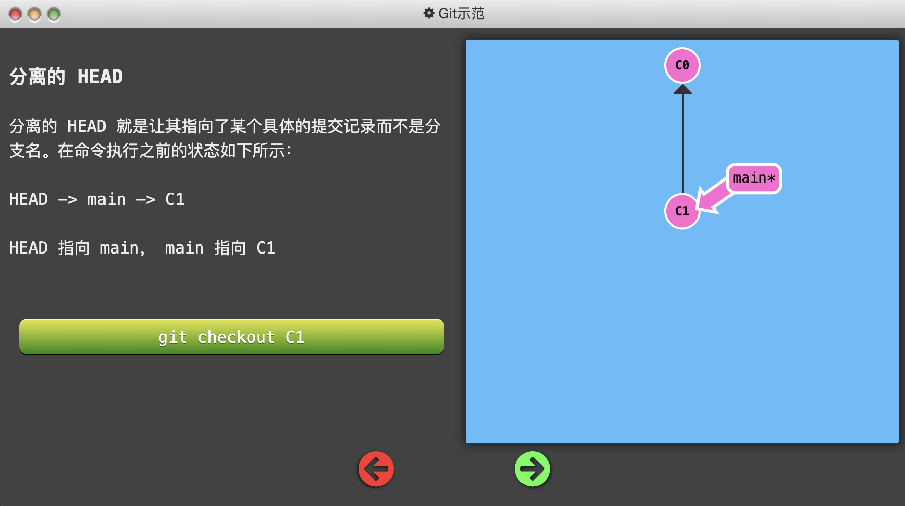

[TOC]


#### 基础篇

循序渐进地介绍 Git 主要命令

###### 1 : Git Commit

> Git 仓库中的提交记录保存的是你的目录下所有文件的快照，就像是把整个目录复制，然后再粘贴一样，但比复制粘贴优雅许多！
>
> Git 希望提交记录尽可能地轻量，因此在你每次进行提交时，它并不会盲目地复制整个目录。条件允许的情况下，它会将当前版本与仓库中的上一个版本进行对比，并把所有的差异打包到一起作为一个提交记录。
>
> Git 还保存了提交的历史记录。这也是为什么大多数提交记录的上面都有父节点的原因 —— 我们会在图示中用箭头来表示这种关系。对于项目组的成员来说，维护提交历史对大家都有好处。
>
> 关于提交记录太深入的东西咱们就不再继续探讨了，现在你<font color="brown">可以把提交记录看作是项目的快照。提交记录非常轻量</font>，可以快速地在这些提交记录之间切换！

示例：

```shell
# 提交记录
git commit
```


###### 2 : Git Branch

> Git 的分支也非常轻量。它们只是简单地指向某个提交纪录 —— 仅此而已。所以许多 Git 爱好者传颂：
>
> ```
> 早建分支！多用分支！
> ```
>
> 这是因为即使创建再多的分支也不会造成储存或内存上的开销，并且按逻辑分解工作到不同的分支要比维护那些特别臃肿的分支简单多了。
>
> 在将分支和提交记录结合起来后，我们会看到两者如何协作。现在只要记住使用分支其实就相当于在说：“<font color="brown">我想基于这个提交以及它所有的父提交进行新的工作。</font>”

示例：

- 在 Git 2.23 版本中，引入了一个名为 git switch 的新命令，最终会取代 git checkout，因为 checkout 作为单个命令有点超载（它承载了很多独立的功能）。

```shell
# 创建分支
git branch <your-branch-name>
# 切换分支
# （Git2.23版本中，引入了git switch，因为checkout有点超载）
git checkout <your-branch-name>
# 创建分支的同时切换到新分支
git checkout -b <your-branch-name>
```


###### 3 : Git Merge

> 太好了! 我们已经知道如何提交以及如何使用分支了。接下来咱们看看如何将两个分支合并到一起。就是说我们新建一个分支，在其上开发某个新功能，开发完成后再合并回主线。
>
> 咱们先来看一下第一种方法 —— `git merge`。在 Git 中合并两个分支时会<font color="brown">产生一个特殊的提交记录，它有两个父节点</font>。翻译成自然语言相当于：“我要把这两个父节点本身及它们所有的祖先都包含进来。”
>
> 通过图示更容易理解一些，咱们到下一页看一下。


示例：

```shell
# 合并分支
#（将bugFix合到当前分支）
git merge bugFix
```


###### 4 : Git Rebase 

> 第二种合并分支的方法是 `git rebase`。Rebase 实际上就是取出一系列的提交记录，“复制”它们，然后在另外一个地方逐个的放下去。
>
> Rebase 的优势就是可以创造更线性的提交历史，这听上去有些难以理解。如果只允许使用 Rebase 的话，代码库的提交历史将会变得异常清晰。
>
> 咱们还是实际操作一下吧……


#### 高级篇

要开始介绍 Git 的超棒特性了，快来吧！

###### 1 : 分离HEAD

> **在提交树上移动**
>
> 在接触 Git 更高级功能之前，我们有必要先学习在你项目的提交树上前后移动的几种方法。
>
> 一旦熟悉了如何在 Git 提交树上移动，你驾驭其它命令的能力也将水涨船高！
>
> **HEAD**
>
> 我们首先看一下 “HEAD”。 HEAD 是一个对当前检出记录的符号引用 —— 也就是指向你正在其基础上进行工作的提交记录。
>
> HEAD 总是指向当前分支上最近一次提交记录。大多数修改提交树的 Git 命令都是从改变 HEAD 的指向开始的。
>
> HEAD 通常情况下是指向分支名的（如 bugFix）。在你提交时，改变了 bugFix 的状态，这一变化通过 HEAD 变得可见。分离的 HEAD 就是让其指向了某个具体的提交记录而不是分支名。




> 想完成此关，从 `bugFix` 分支中分离出 HEAD 并让其指向一个提交记录。
>
> 通过哈希值指定提交记录。每个提交记录的哈希值显示在代表提交记录的圆圈中。


###### 2 : 相对引用(^)

> 通过指定提交记录哈希值的方式在 Git 中移动不太方便。在实际应用时，并没有像本程序中这么漂亮的可视化提交树供你参考，所以你就不得不用 `git log` 来查查看提交记录的哈希值。
>
> 并且哈希值在真实的 Git 世界中也会更长（译者注：基于 SHA-1，共 40 位）。例如前一关的介绍中的提交记录的哈希值可能是 `fed2da64c0efc5293610bdd892f82a58e8cbc5d8`。舌头都快打结了吧...
>
> 比较令人欣慰的是，Git 对哈希的处理很智能。你只需要提供能够唯一标识提交记录的前几个字符即可。因此我可以仅输入`fed2` 而不是上面的一长串字符。

> 正如我前面所说，通过哈希值指定提交记录很不方便，所以 Git 引入了相对引用。这个就很厉害了!
>
> 使用相对引用的话，你就可以从一个易于记忆的地方（比如 `bugFix` 分支或 `HEAD`）开始计算。
>
> 相对引用非常给力，这里我介绍两个简单的用法：
>
> - 使用 `^` 向上移动 1 个提交记录
> - 使用 `~<num>` 向上移动多个提交记录，如 `~3`


###### 3 : 相对引用2(~)

> 如果你想在提交树中向上移动很多步的话，敲那么多 `^` 貌似也挺烦人的，Git 当然也考虑到了这一点，于是又引入了操作符 `~`。
>
> 该操作符后面可以跟一个数字（可选，不跟数字时与 `^` 相同，向上移动一次），指定向上移动多少次。咱们还是通过实际操作看一下吧


> **强制修改分支位置**
>
> 你现在是相对引用的专家了，现在用它来做点实际事情。
>
> 我使用相对引用最多的就是移动分支。可以直接使用 `-f` 选项让分支指向另一个提交。例如:
>
> ```
> git branch -f main HEAD~3
> ```
>
> 上面的命令会将 main 分支强制指向 HEAD 的第 3 级父提交。


###### 4 : 撤销变更

> 在 Git 里撤销变更的方法很多。和提交一样，撤销变更由底层部分（暂存区的独立文件或者片段）和上层部分（变更到底是通过哪种方式被撤销的）组成。我们这个应用主要关注的是后者。
>
> 主要有两种方法用来撤销变更 —— 一是 `git reset`，还有就是 `git revert`。接下来咱们逐个进行讲解。

> **Git Reset**
>
> `git reset` 通过把分支记录回退几个提交记录来实现撤销改动。你可以将这想象成“改写历史”。`git reset` 向上移动分支，原来指向的提交记录就跟从来没有提交过一样。
>
> 让我们来看看演示：


> **Git Revert**
>
> 虽然在你的本地分支中使用 `git reset` 很方便，但是这种“改写历史”的方法对大家一起使用的远程分支是无效的哦！
>
> 为了撤销更改并**分享**给别人，我们需要使用 `git revert`。来看演示：


**git reset**：reset用于回退版本，可以遗弃不再使用的提交。执行遗弃时，需要根据影响的范围而指定不同的参数，可以指定是否复原索引或工作树内容。

- --mixed(默认)：默认的时候，只有暂存区变化

- --hard参数：如果使用 --hard 参数，那么工作区也会变化

- --soft：如果使用 --soft 参数，那么暂存区和工作区都不会变化

**git revert**：在当前提交后面，新增一次提交，抵消掉上一次提交导致的所有变化，不会改变过去的历史，主要是用于安全地取消过去发布的提交

**区别：**主要如下

- git revert是用一次新的commit来回滚之前的commit，git reset是直接删除指定的commit
- git reset 是把HEAD向后移动了一下，而git revert是HEAD继续前进，只是新的commit的内容和要revert的内容正好相反，能够抵消要被revert的内容
- 在回滚这一操作上看，效果差不多。但是在日后继续 merge 以前的老版本时有区别


#### 移动提交记录

自由修改提交树

> **整理提交记录**
>
> 到现在我们已经学习了 Git 的基础知识 —— 提交、分支以及在提交树上移动。 这些概念涵盖了 Git 90% 的功能，同样也足够满足开发者的日常需求
>
> 然而, 剩余的 10% 在处理复杂的工作流时(或者当你陷入困惑时）可能就显得尤为重要了。接下来要讨论的这个话题是“整理提交记录” —— 开发人员有时会说“我想要把这个提交放到这里, 那个提交放到刚才那个提交的后面”, 而接下来就讲的就是它的实现方式，非常清晰、灵活，还很生动。
>
> 看起来挺复杂, 其实是个很简单的概念。

###### 1 : Git Cherry-pick

> 本系列的第一个命令是 `git cherry-pick`, 命令形式为:
>
> - `git cherry-pick <提交号>...`
>
> 如果你想将一些提交复制到当前所在的位置（`HEAD`）下面的话， Cherry-pick 是最直接的方式了。我个人非常喜欢 `cherry-pick`，因为它特别简单。
>
> 咱们还是通过例子来看一下！


###### 2 : 交互式 rebase

> 当你知道你所需要的提交记录（**并且**还知道这些提交记录的哈希值）时, 用 cherry-pick 再好不过了 —— 没有比这更简单的方式了。
>
> 但是如果你不清楚你想要的提交记录的哈希值呢? 幸好 Git 帮你想到了这一点, 我们可以利用交互式的 rebase —— 如果你想从一系列的提交记录中找到想要的记录, 这就是最好的方法了
>
> 咱们具体来看一下……

> 交互式 rebase 指的是使用带参数 `--interactive` 的 rebase 命令, 简写为 `-i`
>
> 如果你在命令后增加了这个选项, Git 会打开一个 UI 界面并列出将要被复制到目标分支的备选提交记录，它还会显示每个提交记录的哈希值和提交说明，提交说明有助于你理解这个提交进行了哪些更改。
>
> 在实际使用时，所谓的 UI 窗口一般会在文本编辑器 —— 如 Vim —— 中打开一个文件。 考虑到课程的初衷，我弄了一个对话框来模拟这些操作。


#### 杂项

Git 技术、技巧与贴士大集合

###### 1 : 只取一个提交记录

###### 2 : 提交的技巧 #1

###### 3 : 提交的技巧 #2

###### 4 : Git Tag

###### 5 : Git Describe
