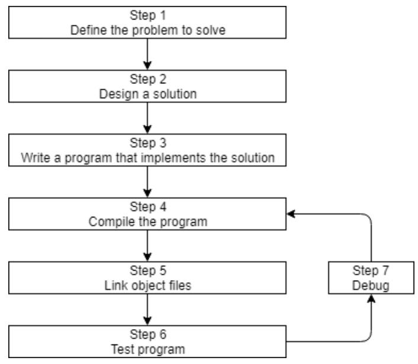
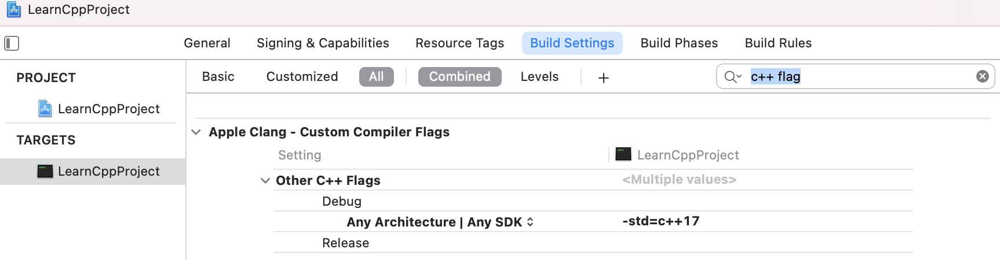
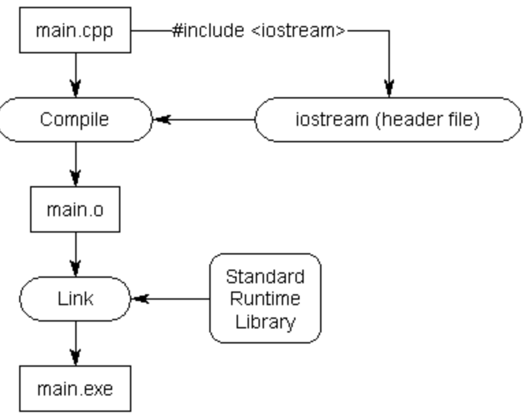
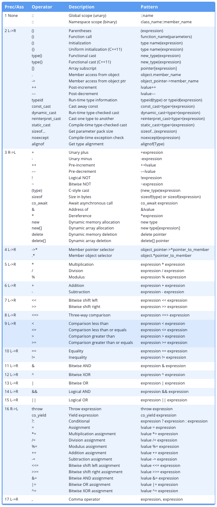
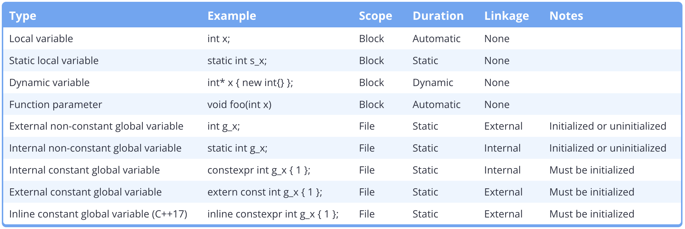

## 介绍与起步学习

#### 0.1 关于本教程

**课程组织：**

本章会介绍C++的方方面面，它是如何诞生的。接下来的第一章会广泛但浅显地学习C++最基础的概念。后面的章节再深入这些概念，或者引入新的概念。

**课程的学习目标：**

学C++这门语言的同时，学习编程的思想和方法。

通过大量清晰、简洁的代码例子，实践所学的概念。避免*magic hand wave*，就是说跳跃到让学生一头雾水。也有一些练习用的程序，可以自己尝试，再对比参考答案。

最重要的，编程得开心。这才是来到一个正确位置的心态。

#### 0.2 关于编程语言(PL)

机器码 → 汇编语言 → 高级语言

高级语言翻译成计算机能运行的机器码，有两种主要方式：编译 & 解释

**编译器：**可以读入源码，产生一个可执行程序。早期的时候，编译器很简单，产生的机器码没有优化、很慢。现在，编译器已经能产出优化得非常好的机器码了，甚至比程序员写的汇编更加好。

**解释器：**不需要编译一个可执行程序。更加灵活，但效率较低，因为每次执行都需要解释一次。

传统的C/C++/Pascal都是编译型的，而一些“脚本”语言比如Perl/JS倾向于解释型，而有的语言比如Java，会混合使用二者。

#### 0.3 关于C和C++

C和Unix的命运息息相关。当初创造C语言是为了重写Unix（原本是汇编语言版的），增加可移植性，让它可以编译在各种机器上。

C++也诞生于贝尔实验室。1998年被标准化，03年进行了一次大的更新，之后有四个年份也进行了大的更新 (**C++11**, C++14, C++17, 和C++20) 。尤其是C++11被视为一个新的baseline版本，之后便是三年一更。

C和C++的设计哲学：相信开发者。

**C++擅长什么：**

```
C++ 在需要高性能和精确控制内存和其他资源的情况下表现出色。以下是一些最有可能用 C++ 编写的常见应用程序类型：
Video games
Real-time systems (e.g. for transportation, manufacturing, etc…)
High-performance financial applications (e.g. high frequency trading)
Graphical applications and simulations
Productivity / office applications
Embedded software
Audio and video processing
Artificial intelligence and neural networks
```

有一位德国人说：AI is a resource eater before the lord, as we germans say.

https://ai.stackexchange.com/questions/6185/why-does-c-seem-less-widely-used-than-python-in-ai

其中C++主要是用在 Keras, Torch, TensorFlow等框架的底层。

#### 0.4 关于C++开发



#### 0.5 关于编译器，链接器和库

也就是上面的<font color="red">Step 4~7</font>

**Step 4** 编译源码

做两件事：① 查错（不符合C++语法的），② 翻译为机器码（并保存在目标文件*name.o* 或 *name.obj*）

**Step 5** 链接目标文件和库

在编译器产生一个或多个目标文件之后，链接器做三件事：

① 链接这些目标文件，合并为一个单一的可执行程序

② 链接器还可以链接库文件。库文件指一些为了**复用**而事先打包好的预编译代码的集合。比如标准库（**Standard Library**）。

一般来说，标准库不用你操心，只要你用到了其中任何一部分，链接器将自动连上。

但之后我们会学习链接其他的库，和如何自己制作库。

③ 确保跨文件的倚赖都是正确的。

**更高阶的：**

有些复杂的项目，会使用makefile，这是一种描述如何build程序的文件（比如编译哪个、链接哪个）。

**Step 6 & 7** 测试和调试

所以步骤3/4/5/7都用到了软件：编辑器、编译器、链接器、调试器。有一类把它们集成到一起的软件包叫做**IDE**。

#### 0.6 安装IDE

#### 0.7 编译你的第一个程序

项目是一个容器，包含了产生一个程序所需的所有文件，也有IDE编译和链接的配置，甚至上次打开项目时的状态。**一个项目对应一个程序。**

但项目文件一般是针对<font color="red">特定IDE</font>的。所以用另一个IDE时要重新创建。

本教程里都属于控制台程序，就是可以从操作系统的控制台运行的。没有用户交互界面(GUI)。

默认情况下，许多IDE会在新建项目时，也将项目加入到一个工作区或解决方案中（"workplace" or "solution"）。

工作区或解决方案是一种容器，包含一个或多个相关的项目。比如一款游戏，如果分为单人版和多人版两个程序，它们应该作为同一个工作区的两个项目。

但这个教程里，我们还是基本建议为每个程序建立新的工作区。减少不必要的程序出错的可能。

#### 0.8 C++常见的一点问题

#### 0.9 编译的配置

build configuration（配置）是指一个项目的设置的集合，它决定了IDE如何生成你的项目。

比如包括：可执行文件叫什么？什么路径去找库文件或其他代码？调试信息是否保留？编译器要多大力气优化你的程序？等等

一般你可以用默认的，除非有特定的需求去修改它。

新建项目时，IDE会建立两种配置：**debug配置**和**release配置**。

前者会关闭所有优化，但保留所有调试信息，所以很大、很慢，但有助于调试。前者会被设置为默认配置。

**Xcode**

Choose **Product** -> **Scheme** -> **Edit Scheme**. Change the `Build Configuration` under the `Info` tab.

#### 0.10 编译的扩展

编译器的扩展**compiler extensions**. 指的是标准的规则之外，每个编译器的特别行为(compiler-specific behaviors)。

这部分可能导致与C++标准，或者其他编译器不兼容的程序。

而这些扩展又不是必要的，我们建议关掉这些编译扩展。

#### 0.11 配置你的编译器：warning和error的层级

抛出错误，会不通过编译。抛出警告，不会停止编译，还是因为“相信开发者”的哲学。但我们应当习惯将每一个警告也解决掉。

warning是可以定制层级的。

#### 0.12 配置你的编译器：选择语言标准

一般编译器会默认的标准不会是最新的。

C++98, C++03, C++11, C++14, C++17, C++20, etc… 都可以选。

- c++1x = C++11
- c++1y = C++14
- c++1z = C++17
- c++2a = C++20
- c++2b = C++23

在某一代标准还没结束时，会暂时使用类似c++2a的名称。一般我们会选择早于最新标准一、两代的标准，比如C++20出来后，就倾向使用C++14和C++17。

这样一方面编译器还要一段时间针对最新标准打磨优化，另一方面前两代的标准在不同平台的兼容性和支持度也更高。



## C++基础学习

#### 1.1 程序的语句和结构

1.语句

就和自然语言是由语句构成一样，C++也是由语句构成。大多语句都以分号<font color="red">；</font>结尾。

在高级语言中一条语句往往可以编译为多条机器指令。

2.函数和主函数

在C++中，语句通常组成函数。一个函数是许多语句顺序执行的集合。每个C++都有一个特殊的函数，称作主(**main**)函数。

```c++
/*预处理指令，告诉编译器要用到iostream(标准库的一部分)的内容*/
#include <iostream> 
/*函数头*/
int main()
{
  /*函数体*/
  /*<<将Hello,world传递给控制台*/
   std::cout << "Hello world!";
   return 0;
}
```

#### 1.2 注释

1.单行注释：**//**   

2.多行注释：**/***  和  ***/ ** 不能嵌套，不然 /* 只会匹配左数出现的第一个 */ 导致错误

小tips：

- At the library, program, or function level, use comments to describe *what*.
- Inside the library, program, or function, use comments to describe *how*.
- At the statement level, use comments to describe *why*.

① 好的注释是解释why，而不是描述what。前者表达你的思想、决策，后者只能说明你的代码易读性差，要重新书写。当然对于初学者或者出于教学目的，可以写what型的注释。

② 更好的实践是用更长的变量名称，让它表达自己的含义，即**self documenting code**。

③ 注释掉代码：这个也是常用的做法。不过如果遇到需要嵌套使用多行注释时，也可以考虑使用 **#if 0** 预处理语句，后面会讲到。

#### 1.3 介绍对象和变量

前面提到语句构成函数，来运行产生结果。那结果怎么来的呢？必然要操纵（读、改、写）数据。**数据**就是一切可以被计算机移动、处理或存储的信息。

所有计算机都有内存，称作**RAM**。存在内存里的数据也叫值。一些老的语言，比如Apple Basic，是可以直接存取某某号内存的。但在C++中，是不允许直接访存的，而是间接地用一个对象（object）。它是一个内存区域，包括了值和属性。

即：

Apple Basic：*go get the value stored in mailbox number 7532.*

C++：*go get the value stored by this object*.

意味着我们可以使用对象来存储和检索值，而不用操心到底是放在哪一号内存里。

**对象**可以被命名或者未命名。一个被命名的对象被称作**变量**，它的名字也叫标识符。在我们的程序里大多数对象都是这种变量。

对象在程序运行期间会被实例化，也就是创建并分配内存地址；一个被实例化的对象称作**实例**。

**数据类型**告诉编译器，变量将存储什么类型的值。除了内置的类型，C++也支持用户定义的类型。这是C++强大的原因之一。所以我们介绍了变量的三个很基础的要素： 标识符，类型 和 值

#### 1.4 变量的分配和初始化

把定义（**define**）和分配（**assign**）一起做，就称作初始化（**initialize**）。

```c++
int a; // no initializer
int b = 5; // initializer after equals sign
int c( 6 ); // initializer in parenthesis
int d { 7 }; // initializer in braces
```

其中使用赋值运算符的，也称作拷贝初始化（**copy initialization**），这个很熟悉，是沿袭C语言而来的；

其中使用圆括号的，称作直接初始化（**direct initialization**）；

其中使用花括号的，称作大括号初始化（**list initialization** (also sometimes called **uniform initialization** or **brace initialization**））。

> 简单的数据类型，使用拷贝初始化就ok了，但复杂的数据类型，还是直接初始化效率更高。不过直接初始化不支持列表类型，所以提出列表初始化这样一个统一的形式。

最佳实践建议：

① 只要有机会就使用大括号初始化。不过另一方面对于单独的分配而言，C++只有拷贝分配，没有所谓的直接分配和大括号分配。

② 创建变量时就做初始化。除非故意，最好还是别只定义一个未分配的变量。

#### 1.5 介绍iostream

io库是C++标准库的一部分。

std::cout << 

还可以多个 << 连用，把一串控制台输出连起来，如：

```cpp
int x{ 5 };
std::cout << "x is equal to: " << x;
```

std::endl

换行。\n 也是换行，而且效率更高。因为endl多一个刷新输出的工作，而这个不是必要的，并且cout也会做这个工作。

std::cin >>

从键盘得到的输入必须存在一个变量中。还可以多个 >> 连用，接收多个输入，中间由空格相隔，如：

```cpp
std::cin >> x >> y; // get two numbers and store in variable x and y respectively
```

C++ I/O库不支持一种不需要按回车就能从键盘接收输入的方式。不过一些第三方库有实现这个函数功能。

小**tips**：<<、>>并不难记，它们表明了数据的传递方向。

#### 1.6 未初始化的变量和未定义的行为

不像其他编程语言，C++并不会自动初始化一个给定的值（比如0）。未初始化意味着，默认的值会变成所分配内存里本来存的一些无用（garbage）的值。

历史渊源：

早期计算机速度很慢，由于初始化每个变量会影响速度，而且大多时候这些变量的初始值是会被写覆盖的。所以C语言默认就不进行初始化了（C++继承了这点）。当然，以现在计算机的性能已经几乎不用考虑这点资源消耗，除非你在需要极致优化的时候故意这么做。

未定义的行为(**UB**)指执行结果没有被C++语言定义的行为，未初始化变量就是其中一种。它可能出现许多症状，比如：

程序每次运行结果不定；程序崩溃；有的编译器可以正常编译，有的却不行；你修改代码一个不相干的地方，却影响了执行结果；等等

所以务必要避免**未定义行为**。

#### 1.7 关键字和如何命名标识符

C++ 20 有92个关键字，也称保留字。

标识符的命名**规则**：① 不能是关键字 ② 由字母、数字、下划线组成 ③ 首位只能是字母或下划线 ④ 大小写敏感

标识符的命名**习惯**：① 变量的首位用小写字母 ② 函数的首位用小写字母，接着蛇形或**驼峰**命名法 ③ 用户定义的类型（如结构体、类、枚举）首位采用大写字母

<font color="red">注1：</font>不过如果你要在一个现有代码上进行工作，更好地还是延续这份代码的命名风格，而不是生硬地照搬之前的习惯。

<font color="red">注2：</font>避免用下划线开头的标识符，这一般是留给操作系统、库和编译器用的。

<font color="red">注3：</font>令标识符有含义，并且琐碎的、不重要的标识符用短一点的名字如*i*；广泛用到的标识符用长一点的、描述性的名字如*openFileOnDisk*；

<font color="red">注3’：</font>避免使用缩略词，虽然能减少你写代码的时间，但是易读性会大大降低，令你更难维护。**代码被读的次数会比写的次数多。**IDE的自动补全照样可以帮你写快。

> Code is read more often than it is written, the time you saved while writing the code is time that every reader, including the future you, wastes when reading it. 

#### 1.8 空格和格式

空格是用来组成格式的。包括了spaces，tabs 和 newlines。

编译器会无视空格，所以我们称C++是空格无关（independent）的语言。

如果一个很长的语句被分为多行，操作符应该放在前面：

```cpp
std::cout << 3 + 4
    + 5 + 6
    * 7 * 8;
```

漂亮的写法：

```cpp
cost          = 57;
pricePerItem  = 24;
value         = 5;
numberOfItems = 17;
```

养成好习惯（second nature）

Code -> Preferences -> Keyboard Shortcuts 可以找到VS Code关于**auto-format**的快捷键，Mac上默认是 Option/ALT + Shift + F.

#### 1.9 字面量，操作符

在计算机科学中，**字面量（literals）**就是指这个量本身，比如字面量3。也就是指3。字面量是相对变量常量等定义的。

string x=“ABC” 意思是把字面量”ABC” 赋值给变量 x。const string y=”cbd”. 意思是把字面量”cbd” 赋值给了常量y。字面量，即自己描述自己的量。

有的**操作符（operators）**是一个符号（+、*、=），有的是多个符号（>>、==），有的是词语（new、delete、throw）。按操作数个数，又可以分为一元、二元、三元操作符。

#### 1.10 表达式

表达式是字面量、变量、操作符和显式函数调用的组合，这个组合应当输出一个值。

#### 1.11 程序

不要试图一次写完。可以写一部分，编译通过，再添加一部分代码。也不是一次写得漂亮，写完能正常工作后，再进行优化。

#### 1.x 第一章总结

## 函数和文件

#### 2.1 函数的介绍

前面介绍过一个函数是许多语句顺序执行的集合。但这个定义没有提供函数的用处，这里更新一下定义：**函数是设计用于完成特定工作的可复用语句序列。**

```cpp
return-type identifier() // 函数头
{
// Your code here 括号连同里面的代码称为函数体
}
```

函数不能嵌套定义，即函数不可以在另一个函数里定义。

小tips：词语“foo”常用来占位作为一个不重要、讲解概念用的函数的名称，它本身没有啥意义。

<font color="red">**可复用**</font>既是定义也是目的。<font color="red">Follow the DRY best practice: “don’t repeat yourself”.</font> 

#### 2.2 函数的返回值

返回值不一定是字面量，**可以是任何表达式。**但要与你的返回值类型吻合，不然造成未定义行为了。

当函数不需要返回值时，使用返回值类型void，然后就不要写return语句。

main函数的返回值也称作状态码，因为它能反映程序有没有成功执行。一般返回**0**表示正常运行。

C++不允许显式地调用main()函数。

#### 2.3 函数的参数

形参 parameter 实参 argument  

当函数被调用时，所有形参会被创建为变量，并且实参的值会传递给形参。

#### 2.4 局部

函数的形参和定义在函数体中的变量，都称作局部变量。

```cpp
int add(int x, int y) // function parameters x and y are local variables
{
    int z{ x + y }; // z is a local variable too
    return z;
} // z, y, and x destroyed here
```

大多数时候，局部变量是在进入函数时创建，在离开函数时销毁。但有的特别的编译器可以决定更早创建和更晚销毁（注：但不会改变后文提到的local scope），来达到优化的目的。

```cpp
#include <iostream>

void doSomething()
{
    std::cout << "Hello!\n";
}

int main()
{
    int x{ 0 }; // x's lifetime begins here

    doSomething(); // x is still alive during this function call

    return 0;
} // x's lifetime ends here
```

**Local scope 局部范围**

一个标识符的范围 决定了源码中这个标识符在哪处可以访问到。

这是编译时就确定的属性，如果尝试在该范围外用到某个标识符，便会报错。

好习惯：最好在尽可能接近要使用的地方定义局部变量。

#### 2.5 函数的用处

Organization、Reusability、Testing、Extensibility、Abstraction

#### 2.6 前向声明

**前向声明**（**Forward Declaration**），是指声明标识符(表示编程的实体，如数据类型、变量、函数)时还没有给出完整的定义。

因为：如果函数B调用函数A，那编译器必须要先知道A是什么，所以A要先定义。但如果A和B相互调用咋办（循环依赖）？→ 前向声明

前向声明函数时，只需要函数原型：返回值、名字、形参，不需要函数体，直接分号结束。

```cpp
int add(int x, int y); // forward declaration of add() (using a function prototype)
int add(int, int); // valid function prototype
```

而且可以不用写形参的名字（但习惯上还是会写，为了易读性）

前向声明函数是最常见的，也可以用于变量、用户定义的数据类型。语法有一点差别，在之后的章节会介绍。

<font color="red">**冷知识：**</font>所有的定义也是声明。

声明能满足编译器，但光只是声明不能满足链接器。

定义能满足编译器（所以它也是声明）、链接器。

对于变量，如`int x;`，就既是定义也是声明。

> 我们平时语境下说的声明就是纯粹的声明 pure declarations，不是定义，不能满足链接器的。

只能**一处定义**，可以多处声明（但多处是冗余的）。

对于同一标识符、不同参数的函数，是视为不同函数的。遇到这种情况不叫重复定义，不会报错的。这个叫**重载**。

#### 2.7 包含多个文件的程序

大型程序都会包含多个文件，得以更好地组织和复用。

面对多文件的项目代码，IDE会很方便。

1. 用前向声明，不同文件里的函数就能够互相调用。
2. 不同的文件是独立编译的，不存在先后顺序。
3. 文件要加到项目里才算。

#### 2.8 命名空间

前面提过，不同的文件是独立编译的。

但是在链接的时候，如果有同名的函数，就会报错。哪怕都编译通过了。只能**一处定义**。

**命名冲突**大多发生在函数和全局变量上。

**命名空间**（namespace）可以解决这个问题。某个命名空间声明的标识符，不会被误认为是声明在另一个范围的同名标识符。

**The global namespace**

在C++中，任何没有定义在一个类、函数或命名空间中的标识符，会被认为是在全局命名空间。比如main函数就通常在全局命名空间。

**The std namespace**

起初发明C++语言时，标准库是在全局命名空间的，不需要使用std::。可想而知，带了非常多的麻烦。就改成了现在的样子。

使用方式1：

```cpp
#include <iostream>

int main()
{
    std::cout << "Hello world!"; // when we say cout, we mean the cout defined in the std namespace
    return 0;
}
```

*std::cout* 可以念做 “the *cout* that lives in namespace *std*“

使用方式2：

```cpp
#include <iostream>

using namespace std; // this is a using directive telling the compiler to check the std namespace when resolving identifiers with no prefix

int main()
{
    cout << "Hello world!"; // cout has no prefix, so the compiler will check to see if cout is defined locally or in namespace std
    return 0;
}
```

不推荐使用方式2，那就重蹈覆辙，C++语言发明之处的那些麻烦又要经历一遍。最糟糕的是现在不报错，未来在用C++新版时却报错，仅仅因为标准新增了几个标识符。

#### 2.9 预处理

在编译之前，其实还进行了一个称作**translation**的操作。而translation中最值得注意的是它涉及到了预处理**preprocessor**。预处理指令都以#开头。

预处理也是短暂地在内存中进行的，它并不会改变原来的代码文本。

常见的预处理指令（他们许多和C++的语法不同）：

- **Includes**

  语法示例：

  ```c++
  #include <iostream>
  ```

  作用：#include指令将该处替换为具体文件的内容。几乎都是用于头文件。

  

- **Macro defines**

  语法示例：

  ```cpp
  #define identifier substitution_text
  #define identifier
  ```

  作用：

  Function-like macros比较危险，尽量不使用，而且普通函数都能取代它，这里就不讨论了。

  Object-like macros with substitution text这里的标识符一般全用大写字母，预处理后全部被替换文本。如`#define MY_NAME "Alex"` 。它过去被作为常数（constant variables）的一种便捷的替代方法。除了一些遗留代码，现在基本不这么用了。

  Object-like macros without substitution text会将标识符替换成空白，也就是去掉这个内容。在接下来介绍的**Conditional compilation**中可以发挥特别的用处。

  <font color="red">Tips:</font>

  宏指令只替换C++代码中的标识符，不会替换其他预处理指令出现的该标识符。

  

- **Conditional compilation**

  语法示例：

  ```cpp
  #include <iostream>
  
  #define PRINT_JOE
  
  int main()
  {
  #ifdef PRINT_JOE
      std::cout << "Joe\n"; // if PRINT_JOE is defined, compile this code
  #endif
  
  #ifdef PRINT_BOB
      std::cout << "Bob\n"; // if PRINT_BOB is defined, compile this code
  #endif
    
  #ifndef PRINT_BOB
      std::cout << "Bob\n"; // if PRINT_BOB is not defined, compile this code
  #endif
  
      return 0;
  }
  ```

  可以控制哪些部分编译，哪些部分不编译。

  #ifdef PRINT_BOB与#ifndef PRINT_BOB也可以写成 

  #if defined(PRINT_BOB)与#if !defined(PRINT_BOB)

  **#if 0**也属于条件编译的预处理指令，它可以当作一种特殊的注释方式。避免了多重注释不能嵌套的问题。

  ```cpp
  #include <iostream>
  
  int main()
  {
      std::cout << "Joe\n";
  
  #if 0 // Don't compile anything starting here
      std::cout << "Bob\n";
      /* Some
       * multi-line
       * comment here
       */
      std::cout << "Steve\n";
  #endif // until this point
  
      return 0;
  }
  ```

最后，预处理都会在编译之前结束，宏指令的标识符则会被丢弃。所以一个文件里定义的宏指令，另一个文件是感知不到的。

#### 2.10 头文件

**Headers**

当程序越来越大，文件越来越多。需要前向声明的函数就会非常冗长。

有没有一种方法，就是**将前向声明都放在一个位置**，然后任何要用到的地方引用它就好？

这就是C++中第二种最常见的文件：**头文件**（后缀.h，也有.hpp或无后缀的，如`iostream`）

头文件帮助我们省下了很多打重复代码的精力。



**最佳实践：**

① 头文件一般不要出现函数和变量的定义，以免日后违背“一处定义”的问题。

② 源代码一般都会#include它自个儿的头文件。这样编译器能在编译时就发现问题，而不是链接时才发现。

比如

something.h:

```cpp
int something(int); // return type of forward declaration is int
```

something.cpp:

```cpp
#include "something.h"

void something(int) // error: wrong return type
{
}
```

就能在编译时发现问题了。

③ 虽然include的头文件很可能会include其他头文件。这样“传递”声明。但还是建议显式地include所有需要的头文件，而不是倚赖传递。

**Q: I didn’t include <someheader.h> and my program worked anyway! Why?**

这种情形是可能发生的，就是当头文件“传递”声明发生时。但这可能导致某个程序在你的机器能运行，但在别人的机器无法运行。

**冷知识一**

为什么既有尖括号（#include <iostream>），又有双引号（#include "add.h"）的形式。

因为出现头文件的位置，既可能是项目路径（current directory），又可能是系统环境（include directories）。尖括号 vs双引号 可以更好地引导编译器去哪儿寻找头文件。

尖括号用于非用户编写的头文件，编译器会直截了当去include directories找。双引号用于用户编写的头文件，编译器会先在include directories找。

> Use double quotes to include header files that you’ve written or are expected to be found in the current directory. Use angled brackets to include headers that come with your compiler, OS, or third-party libraries you’ve installed elsewhere on your system.

**冷知识二**

为什么标准库的头文件没有.h后缀？

其实同时存在无后缀的iostream和iostream.h的头文件，但二者不是一回事。 这是由于历史原因，起初所有的标准库头文件都有.h后缀。但在进入美国国标时，更规范地要求函数在std命名空间，以免和用户定义的函数冲突。

此时如果重写标准库的代码，一些旧的程序就没法运行了。为了解决这个问题，新使用了无后缀的头文件，所有在std命名空间的函数在这里声明。而那些旧的程序仍然可以使用.h后缀的头文件，而不需要重写。

此外，许多继承自C语言的库，还会给出一个c前缀，比如stdlib.h变为cstdlib。同样地，这部分库也被移到了std命名空间。

**关于include其他路径下的头文件**

```cpp
#include "headers/myHeader.h"
#include "../moreHeaders/myOtherHeader.h"
```

上面这种写相对路径的不是良好的办法。万一改动文件结构，就没法用了。

更好的措施是：设置编译器、IDE的环境路径或者叫搜索路径。*include path* or *search directory*

**关于include各种头文件的顺序**

如果头文件写得规范，每个都有齐全的声明，那么主程序include的顺序就不成问题，任何顺序都没事。

但如果写得不规范，出现互相倚赖，就需要调整顺序了。不过发现这类错误是好事情，我们可以fix掉，而不是留有隐患。

所以<font color="red">最佳实践</font>推荐这么排序：

1. 和源码成对的头文件
2. 项目的其他头文件
3. 第三方头文件
4. 标准库头文件

这样当用户定义的头文件需要倚赖第三方或标准库头文件时，可以很快发现编译错误并且fix。

#### 2.11 重复定义的问题

还是上节提到的**最佳实践：**① 头文件一般不要出现函数和变量的定义，以免日后违背“一处定义”的问题。

比如：

square.h:

```cpp
// We shouldn't be including function definitions in header files
// But for the sake of this example, we will
int getSquareSides()
{
    return 4;
}
```

geometry.h:

```cpp
#include "square.h"
```

main.cpp:

```cpp
#include "square.h"
#include "geometry.h"

int main()
{
    return 0;
}
```

就会出问题，这预处理后相当于：

```cpp
int getSquareSides()  // from square.h
{
    return 4;
}

int getSquareSides() // from geometry.h (via square.h)
{
    return 4;
}

int main()
{
    return 0;
}
```

**头文件保护符**

好消息是我们可以利用头文件保护符（**header guard**）的机制来避免上面的问题。标准库的头文件全加上了它。

头文件保护符属于条件编译的指令，写法如下：

```cpp
#ifndef SOME_UNIQUE_NAME_HERE
#define SOME_UNIQUE_NAME_HERE

// your declarations (and certain types of definitions) here

#endif
```

很多编译器也都支持#pragma once，来作为头文件保护符，就一行，更为简单。但这不是标准里的，所以保险起见还是用#ifndef。

```cpp
#pragma once

// your code here
```

<font color="red">**#ifndef**</font> 

当SOME_UNIQUE_NAME_HERE已经定义过，编译器就会忽略它，避免重复定义。如果没定义过，就可以给它定义。

**大写字母+下划线**：一般SOME_UNIQUE_NAME_HERE会直接写为该头文件的名称，对整个头文件预防重复定义。格式是全大写，且标点或空格改为下划线。

例如square.h:

```cpp
#ifndef SQUARE_H
#define SQUARE_H

int getSquareSides()
{
    return 4;
}

#endif
```

但头文件保护符只能防止同一个文件内不要出现重复定义，你在a.cpp和main.cpp分别定义同一个函数，仍然会导致编译成功、链接失败。所以最终还是希望能遵守<font color="red">**最佳实践**</font>，不要在头文件里定义东西。

#### 2.12 设计第一个程序

在很多方面，编程就像做建筑。一开始需要蓝图。

① **Define your goal** 

② **Define requirements** 

③ **Define your tools, targets, and backup plan** 

④ **Break hard problems down into easy problems** 

⑤ **Figure out the sequence of events** 

实现也是先框架后细节的。

① **Outlining your main function** ② **Implement each function** ③ **Final testing**

#### 2.x 第二章总结

## 调试程序

bug、软件错误是非常常见的。关键是我们用什么方法去处理它。

学会找到和解决bug是成为一名出色程序员的重要技能。

#### 3.1 语法和语义错误

编程具有挑战，而C++又是一个古怪的语言。二者放一起，能出现的bug会是五花八门。

主要分为两类：**语法错误**，**语义错误**（也叫逻辑错误）

语法错误容易排查，编译器会指明。虽然现代的高级编译器可以检查出个别类型的语义错误，但大部分的语义错误是没法检查出的。毕竟编译器设计的初衷就是解析语法，而不是程序的意图。

除了特别简单的语义错误能一眼看出来，大部分是没法轻松目测出来的。<font color="red">**调试**</font>技术就显现出了用处！

#### 3.2 调试的过程

bug的出现一般有这么个简单前提：

> Something that you thought was correct, isn’t. 

找到问题根源 ➡️ 尝试理解问题 ➡️ 确定解决办法 ➡️ 修复问题 ➡️ 重新测试

#### 3.3 调试的战略

方式一：检查代码

但遇到复杂的项目时，方式一难度大、效率低，并且很枯燥。

方式二：通过运行来诊断：

- 重现问题：你首先要亲眼看一下错误的发生
- 收集信息，缩小范围：比如根据错误类型，甚至根据直觉
- 反复进行上面的过程

#### 3.4 调试的基本战术（手动篇）

战术1:  注释掉代码

战术2:  查看调用次数、顺序，在函数的开头print函数名。

<font color="red">注：</font>这里print得用std::cerr，因为std::cout是有缓冲的，也就是在你希望它输出，到它实际输出有时间间隔。如果这中间程序挂掉了，就会误导你。而std::cerr是无缓冲的（只是性能差点，但debugging的时候咱们不在意性能）。

战术3:  输出变量的值 

<font color="red">注：</font>也使用std::cerr

> 但这种输出语句来调试不太好，除非是手头没有称手的debugger。它的弊端是 调试语句 ① 让代码更杂乱 ② 让输出更杂乱 ③ 调试完毕要手动删除，也没法复用 ④ 需要编辑代码，有时误编辑带来新的bug。
>

#### 3.5 调试的进阶战术（自动篇）

上一章讲到一些调试的方法，会带来些麻烦。调试语句要手动加和删。

**1.** 使用预处理指令

更好的办法是配合预处理指令，让程序自动判断用不用调试语句：

```cpp
#include <iostream>

#define ENABLE_DEBUG // comment out to disable debugging

int getUserInput()
{
#ifdef ENABLE_DEBUG
std::cerr << "getUserInput() called\n";
#endif
	std::cout << "Enter a number: ";
	int x{};
	std::cin >> x;
	return x;
}

int main()
{
#ifdef ENABLE_DEBUG
std::cerr << "main() called\n";
#endif
    int x{ getUserInput() };
    std::cout << "You entered: " << x;

    return 0;
}
```

就可以通过是否注释*#define ENABLE_DEBUG* 这行来决定调试与否了。

**2. **使用日志

这是很常用的方法，好处也多多。

有很多第三方的日志工具，使用哪种取决于我们自己啦，这里以plog为例：

```cpp
#include <iostream>
#include <plog/Log.h> // Step 1: include the logger headers
#include <plog/Initializers/RollingFileInitializer.h>

int getUserInput()
{
	PLOGD << "getUserInput() called"; // PLOGD is defined by the plog library

	std::cout << "Enter a number: ";
	int x{};
	std::cin >> x;
	return x;
}

int main()
{
	plog::init(plog::debug, "Logfile.txt"); // Step 2: initialize the logger

	PLOGD << "main() called"; // Step 3: Output to the log as if you were writing to the console

	int x{ getUserInput() };
	std::cout << "You entered: " << x;

	return 0;
}
```

而且开启、关闭也很方便：

```cpp
plog::init(plog::none , "Logfile.txt"); // plog::none eliminates writing of most messages, essentially turning logging off
```

这样就关闭logger了。很多logger都提供了不同模式、档位，来减少甚至停止向日志输出内容。

#### 3.6 使用集成调试器（integrated debugger）

上面3.4～3.5节的方法都是假设我们没法暂停一个运行的程序。但现代IDE提供了我们<font color="red">**调试器**</font>，打破这一假设。

##### 3.6.0 调试器（debugger）

调试器：一种能  控制另一个程序的执行过程和检查另一个程序的状态  的程序。

##### 3.6.1 单步调试（Stepping）

是允许我们逐语句执行的功能。它包含以下一些命令：

**Step into**

按程序的正常执行顺序，运行下一条语句。如果该语句包含一个函数调用，则会在这个被调用函数的开头停下。

而且你会看到某种标记，用来指示要运行的下一行。（注：调用函数，和返回，会指示两次。）

**Step over**

不会进入调用的函数一行行执行，而是直接执行完整个函数。

它可以帮忙在debug时跳过那些你认为没问题或者不感兴趣的函数。

**Step out**

会直接执行当前函数的剩余未执行部分，然后在函数返回的位置停下。

它可以帮忙在debug时跳过那些你认为没问题或者不感兴趣，但是不小心step into进去的函数。

**Step back**

一般来说单步调试只能前进不能后退。点快、错过了，只能从头来，细心一点。

但现在有些调试器比如Visual Studio企业版，能支持返回上一个状态。不过开启这个功能是有代价的，要额外存一份独立的程序状态。大多数调试器都还不支持。

##### 3.6.2 运行和断点（Running and breakpoints）

对于大型项目，只靠单步调试，那想到达想调试的位置是遥遥无期的。

有些IDE支持在代码行右键<font color="red">“Run to cursor”</font>，来到达想调试的位置。

调试器中也有<font color="red">“continue”</font>命令继续运行，直到下一处触发调试的地方（如断点）。（注：从开头开始，可以用<font color="red">“start”</font>）

<font color="red">Breakpoints</font>是一种特殊的记号，可以告诉调试器在调试模式下时，到达某个位置时停止执行程序。和Run to cursor的效果很像，就是更方便点：

①一次执行内重复调用某个有断点的函数，每次都能触发  ②能一直存在，直到手动取消

还有个jumping操作比较高级灵活而少见，它是通过右键<font color="red">“set next statement ”</font>。比如可以用于反复执行同一个函数，如果你想观察多次的话。

##### 3.6.3 跟踪变量（Watching variables）

不用改变代码，就能去观察变量值

观察窗口（watch window）：可以向窗口添加你希望持续观察的变量。

有的IDE是在进入调试模式时，直接就有这个窗口。如果没有就要在菜单里找了。如Visual  Studio的*debug menu > Windows > Watch*

有的IDE是手动添加想观察的变量，Xcode是自动按出现顺序把变量加入观察。而选择local variables可以马上看到所有局部变量目前的值。

##### 3.6.4 调用堆栈（The call stack）

调用栈可以清晰地看到，目前的函数执行到哪儿了，函数返回时是回到哪儿（行号）继续执行。

#### 3.7 如何尽早发现语义问题

有些语义bug可能一时没发觉，潜藏很深。潜藏时间越长，之后debug越费力。

我们该如何避免？

1. 不制造错误
   - 遵从最佳实践
   - 不要在疲倦的时候编程
   - 了解常见的坑
   - 保持程序逻辑简单
   - 不要让单一函数太复杂
   - 尽量用标准库，而不是造轮子
   - 充分的注释
2. 重构函数

​		**重构**（refactoring）：改变代码结构，<font color="red">但不改变行为</font>、作用。使得程序更易维护。

​		有时为了加新功能，会把一个函数的代码越加越复杂，易读性变差。这时就可以重构，把函数拆分		为几个简单些的函数。

​		Tips：函数是越短越好，尽量10行以内，5行以内更佳。如果一个函数还要滚动条来上下翻阅，那		可读性会大大降低。

3. 防御性编程的简单介绍

   错误可能不是你造成的，而是用户以你未预料的方式使用程序。比如你要求输整数，用户却输入字母。除非你每个case都预料到，并加入错误处理。

​		防御性编程就是如何检测到这些用户行为，并且提示用户正确使用。

4. 尽早发现错误
   - 一边编程，一边运行

   - 写测试函数，它多次调用待测试的函数，涵盖了多种测试用例，有一些corner case. 这就是最原始的单元测试（现在有很多第三方库做单元测试）。

   - 约束技术：一些额外的代码，来检查是否违反某些假设或预期。一般是用*assert*和*static_assert*，第七章我们会详细介绍。

   - 有的程序被专门设计用来检查程序员常犯的错误。被称为[静态分析工具](https://en.wikipedia.org/wiki/List_of_tools_for_static_code_analysis#C,_C++)（也叫*linters*）。

     中大型项目非常建议使用一个静态分析工具。

     > 其实你已经有一个这样的工具——你的编译器！比如现代编译器就能提示语法错误，警告没有初始化变量。可以参考0.11节，设置一个合适的warning层级。
     >
     > 另外，Visual Studio 2019里也集成来一个静态分析工具。Build > Run Code Analysis on Solution (Alt+F11).

#### 3.x 第三章总结

## 基本数据类型

#### 4.1 基本数据类型的介绍

**比特、字节和内存地址**

比特是内存的最小单元，一个字节有8比特，并且每个字节会有一个内存地址去找到它。

**数据类型**

因为数据只是一串比特，我们用“数据类型”来告诉编译器怎么解读内存里的数据。

**基础数据类型**

C++内置支持的数据类型，称作基础类型。

| Types                                                        | Category             | Meaning                                          | Example |
| :----------------------------------------------------------- | :------------------- | :----------------------------------------------- | :------ |
| float double long double                                     | Floating Point       | a number with a fractional part                  | 3.14159 |
| bool                                                         | Integral (Boolean)   | true or false                                    | true    |
| char wchar_t char8_t (C++20) char16_t (C++11) char32_t (C++11) | Integral (Character) | a single character of text                       | ‘c’     |
| short int long long long (C++11)                             | Integral (Integer)   | positive and negative whole numbers, including 0 | 64      |
| std::nullptr_t (C++11)                                       | Null Pointer         | a null pointer                                   | nullptr |
| void                                                         | Void                 | no type                                          | n/a     |

注：1.很多现代语言将string（字符串）作为基础类型，但C++没有，而是将它作为混合类型（compound type） 2.可以看到许多新的基础类型会有后缀<font color="green">_t</font>

#### 4.2 void

void意味着无类型。最主要就是在 <font color="green">不返回值的函数</font> 的返回类型那儿使用。还有个比较高级的void pointer，在第十章介绍指针时会介绍。

#### 4.3 占字节数

**对象的占字节数**

编译器根据数据类型，很清楚对象是几个字节。

每种类型占多少字节，我们也应该非常清楚。虽然现代计算机的内存比较大，有时内存的影响被忽略了。但有些程序需要用到大量的对象或数据（比如一个需要渲染数百万个多边形的游戏），这时数据类型的取舍就相当重要。

<font color="red">Key insight</font>：不过写程序还是优先专注写维护性好的代码，至于优化，当益处非常明显时，再进行。

C++只规定了每种基础类型至少占多少字节，实际占多少是根据编译器或计算机架构决定的。为了更好的兼容性，你最好假设占字节数就是指定的最小值。

**sizeof操作符**

可以查看数据类型或变量的占字节数

```cpp
#include <iostream>

int main()
{
    std::cout << "bool:\t\t" << sizeof(bool) << " bytes\n";
    std::cout << "char:\t\t" << sizeof(char) << " bytes\n";
    std::cout << "wchar_t:\t" << sizeof(wchar_t) << " bytes\n";
    std::cout << "char16_t:\t" << sizeof(char16_t) << " bytes\n";
    std::cout << "char32_t:\t" << sizeof(char32_t) << " bytes\n";
    std::cout << "short:\t\t" << sizeof(short) << " bytes\n";
    std::cout << "int:\t\t" << sizeof(int) << " bytes\n";
    std::cout << "long:\t\t" << sizeof(long) << " bytes\n";
    std::cout << "long long:\t" << sizeof(long long) << " bytes\n";
    std::cout << "float:\t\t" << sizeof(float) << " bytes\n";
    std::cout << "double:\t\t" << sizeof(double) << " bytes\n";
    std::cout << "long double:\t" << sizeof(long double) << " bytes\n";

    return 0;
}
```

顺便一提... 不是说占用内存越小的类型，处理起来越快。这并不总是正确的，CPU通常被优化处理某一特定大小的数据（比如32位）。与之匹配的数据类型可能处理得更快。比如32位机器上，一个4字节的int会比2字节的short或者1字节的char处理起来更快。

冷知识：sizeof函数返回值的类型叫std::size_t，它本身占字节数也可以通过sizeof(std::size_t)看到。所以不论多大的对象，占字节数不能超过std::size_t所能表示的最大值。

#### 4.4 有符号整数

```cpp
signed long int li; //这种写法是不好的
long li； //这样就可以，因为①默认是有符号数，②画蛇添足加个int不容易辨别，眼花误删了前面的long还容易出bug。
```

所以还是用shorthand（速记）的写法，不要画蛇添足。

n-bit有符号整数的范围是-(2^n-1) to (2^n-1) -1，一共2^n种值。

超出范围，就会发生<font color="red">**溢出**</font>，导致未定义行为。

还有整数相除，结果会丢掉小数部分。

#### 4.5 无符号整数，以及为何尽量避免它们

```cpp
unsigned int ui;
unsigned long ul;
```

n-bit无符号整数的范围是0 to (2^n) -1，还是一共2^n种值。

16-bit无符号数的上溢：65536会变成0，下溢：-1会变成65535。以此类推。

很多游戏开发史上有些bug就和无符号数溢出有关。比如文明系列的甘地老是第一个使用核弹的，以前就谣传是因为甘地的好斗性在某些选项加成后，会变成负数。结果下溢为一个很大的数了。（不过最近作者出面澄清不是因为这个）

> 作者举例了很多，来阐述避免使用无符号数的原因。所以包括谷歌都提倡不要用无符号数，这是最佳实践。哪怕你真的只使用正数。

#### 4.6 定宽整数和size_t

为什么int占的字节数不是固定的。这要追溯到C语言，那时电脑很慢，而性能尤为重要，所以设计成了这种不固定的形式。让编译器可以选择目标计算机上性能最好的位数。

但对于现代标准，这个就有点蛋疼，因为你编程时假设的用4字节，那在高于它的机器上就浪费，低于它的机器上就溢出。所以C99和C++11也定义了定宽整数。

```cpp
#include <cstdint> // for fixed-width integers
```

| Name          | Type            | Range                                                   | Notes                                                        |
| :------------ | :-------------- | :------------------------------------------------------ | :----------------------------------------------------------- |
| std::int8_t   | 1 byte signed   | -128 to 127                                             | Treated like a signed char on many systems. See note below.  |
| std::uint8_t  | 1 byte unsigned | 0 to 255                                                | Treated like an unsigned char on many systems. See note below. |
| std::int16_t  | 2 byte signed   | -32,768 to 32,767                                       |                                                              |
| std::uint16_t | 2 byte unsigned | 0 to 65,535                                             |                                                              |
| std::int32_t  | 4 byte signed   | -2,147,483,648 to 2,147,483,647                         |                                                              |
| std::uint32_t | 4 byte unsigned | 0 to 4,294,967,295                                      |                                                              |
| std::int64_t  | 8 byte signed   | -9,223,372,036,854,775,808 to 9,223,372,036,854,775,807 |                                                              |
| std::uint64_t | 8 byte unsigned | 0 to 18,446,744,073,709,551,615                         |                                                              |

① 但这个有弊端，比如固定了32位，那在64位机器上就不快了。

② 由于C++规定的疏忽，大多数编译器会把std::int8_t和std::uint8_t当做char类型来看待，这会导致在某些系统上可能出错，所以避免使用这俩。

③ <font color="red">最佳实践</font>：根据正确性优于速度，宁可编译出错不要运行出错 的立场，建议：使用定宽整数。然后在遇到没法编译的平台时，再进行迁移。

#### 4.7 科学计数法

易读性大大增加，并且方便比较大小。

#### 4.8 浮点数

**意义：**有助于记录很大或很小的数字。

| Category       | Type        | Minimum Size | Typical Size       |
| :------------- | :---------- | :----------- | :----------------- |
| floating point | float       | 4 bytes      | 4 bytes            |
|                | double      | 8 bytes      | 8 bytes            |
|                | long double | 8 bytes      | 8, 12, or 16 bytes |

```cpp
int x{5}; // 5 means integer
double y{5.0}; // 5.0 is a floating point literal (no suffix means double type by default)
float z{5.0f}; // 5.0 is a floating point literal, f suffix means float type

//不过要记得，字面量和变量的类型要匹配，不然一个本没必要的强制转换就会发生。
```

```cpp
#include <iomanip> // for output manipulator std::setprecision()
std::cout << std::setprecision(16);
std::cout << 3.33333333333333333333333333333333333333f <<'\n'; // f suffix means float
```

std::setprecision()函数可以调整cout输出的精度。

outputs: 3.333333253860474  可以看到有很大误差，所以最佳实践建议使用double。

这是由于十进制和二进制的差异，比如1/10，我们看似很简单的0.1，在二进制时就是0.00011001100110011... <font color="red">并且当精度大于有效数字的位数时，仍然会出现凑整误差。</font>

**舍入（rounding）误差：**当数字没法精确存储时，就会出现。往往没法避免，所以不要假设浮点型数字是精密的。

> 在金融或者货币数据上，要非常谨慎地使用浮点型。

而且这个误差有时还难以发觉，因为cout时是被截断的，隐藏了末尾的误差。

**NaN 和 Inf**

还有两类特别的浮点型：Inf表示无穷大，可正可负。NaN表示不是数。（IEEE 754格式下）

```cpp
#include <iostream>

int main()
{
    double zero {0.0};
    double posinf { 5.0 / zero }; // positive infinity
    std::cout << posinf << '\n';

    double neginf { -5.0 / zero }; // negative infinity
    std::cout << neginf << '\n';

    double nan { zero / zero }; // not a number (mathematically invalid)
    std::cout << nan << '\n';

    return 0;
}
```

不同平台的记号不一样，Xcode里是**inf**，**-inf**，**nan**

#### 4.9 布尔型

存储布尔型的变量实际用的也是整数1（true）和0（false）。

cout时也会是1或0。除非加上std::cout << std::boolalpha; 对于cin也是如此，使用std::cin >> std::boolalpha;

布尔型也经常作为函数的返回值类型，被频繁地用到。

#### 4.10 if语句

```cpp
if (condition1)
    statement1;
else if (condition2)
    statement2;
else
    statement3;
```

condition是值为布尔型的表达式。如果不是布尔型，则会强制转换为布尔型。

#### 4.11 字符型（Chars）

也是作为整数来存储，解释的时候则参照ASCII码，范围时0～127。比如65是‘A’，97是‘a’。

**初始化字符**

```cpp
char ch2{ 'a' }; 
```

也可以用对应ascii的整数来初始化，但不建议。

```cpp
#include <iostream>

int main()
{
    std::cout << "Input a keyboard character: "; // assume the user enters "abcd" (without quotes)

    char ch{};
    std::cin >> ch; // ch = 'a', "bcd" is left queued.
    std::cout << "You entered: " << ch << '\n';

    // Note: The following cin doesn't ask the user for input, it grabs queued input!
    std::cin >> ch; // ch = 'b', "cd" is left queued.
    std::cout << "You entered: " << ch << '\n';

    return 0;
}
```

```
Input a keyboard character: abcd
You entered: a
You entered: b
```

cin时输入多了字符，会暂时放在缓存里，等下次调用cin时再被取出来。

**转义字符**

“\” + 字母或数字

| Name            | Symbol     | Meaning                                                      |
| :-------------- | :--------- | :----------------------------------------------------------- |
| Alert           | \a         | Makes an alert, such as a beep                               |
| Backspace       | \b         | Moves the cursor back one space                              |
| Formfeed        | \f         | Moves the cursor to next logical page                        |
| Newline         | \n         | Moves cursor to next line                                    |
| Carriage return | \r         | Moves cursor to beginning of line                            |
| Horizontal tab  | \t         | Prints a horizontal tab                                      |
| Vertical tab    | \v         | Prints a vertical tab                                        |
| Single quote    | \’         | Prints a single quote                                        |
| Double quote    | \”         | Prints a double quote                                        |
| Backslash       | \</td>     | Prints a backslash.                                          |
| Question mark   | \?         | Prints a question mark. No longer relevant. You can use question marks unescaped. |
| Octal number    | \(number)  | Translates into char represented by octal                    |
| Hex number      | \x(number) | Translates into char represented by hex number               |

单引号一般用于字符，双引号用于字符串。按照这种最佳实践，编译器也优化些。

<font color="red">小知识：</font>char16_t, char32_t是用来支持UTF-16、UTF-32的，而不是ASCII。可以用来支持更多语言的字符。本课程里用不着，除非当你计划对程序做兼容或者本地化（比如汉化）时，再去学习。 

#### 4.12 类型转换和静态转换

大多情况下，C++很乐意把一种基础类型的值转为另一种基础类型。

这种编译器帮忙转换的情形，称作**隐式转换**。

比如我们常说的强制转换，

```cpp
char c;
std::cin >> c;
int ascii{ c };
```

有些转换是安全的，比如int→double；但有些转换会造成值的改变，比如double→int，就会出现警告甚至报错。

**显式转换：**

如果我们有意去转换（如double→int，明知会丢掉小数部分）。对于情形，C++提供了显式转换，使用**静态转换（static_cast）操作符**。

语法是：

```cpp
static_cast<new_type>(expression)
```

注：记得之前提到过的 ② 由于C++规定的疏忽，大多数编译器会把std::int8_t和std::uint8_t当做char类型来看待，这会导致在某些系统上可能出错，所以避免使用这俩。最好显式转换为别的整数类型。

比如

```cpp
#include <cstdint>
#include <iostream>

int main()
{
    std::cout << "Enter a number between 0 and 255: ";
    std::int8_t myint{};
    std::cin >> myint;

    std::cout << "You entered: " << static_cast<int>(myint);

    return 0;
}
```

输出：

```
Enter a number between 0 and 255: 35
You entered: 51
```

因为51是ASCII码的"3"。

#### 4.13 字符串std::string

字符串用得太频繁了，很多现代编程语言都将其作为基础类型。但C++将其作为复合类型，定义在标准库中，而不是作为语言的核心。

所以使用字符串首先需要包含它的头文件：

```cpp
#include <string> // allows use of std::string

std::string myName {}; // empty string
```

如果用std::cin来输入字符串，它会只读到第一个空格那儿。

所以建议用**std::getline()**函数，来读完整的字符串。它有俩参数，一个是cin一个是字符串。

```cpp
std::getline(std::cin >> std::ws, name); // read a full line of text into name
```

Q：std::ws是什么鬼？

A：4.8节我们讲了std::setprecision()，是输出格式的操作函数。这里，**std::ws**则是输入格式操纵函数，用于告诉cin忽略任何前导空格，如上一次cin后的回车'\n'。

不过如果用 提取操作符 >> 自动就会忽略前导空格，只是std::getline不用std::ws就没法忽略前导空格。

**字符串长度**

例myName是一个字符串，使用myName.length() 而不是 length(myName)，因为length()不是一个正常的独立函数，而是myName的成员函数。

返回是无符号整数，如果想赋值给int，应该做静态转换：

```cpp
int length = static_cast<int>(myName.length());
```

#### 4.14 字面量常量

常量的值是不会改变的，C++中有两种常量：<font color="purple">字面量常量，符号常量</font>。

字面量常量通常简称 **字面量**，指：直接写在代码里的值。

字面量的类型是通过它本身推测出来的。

**后缀 —** 整数默认是int，浮点数默认是double，如果想指定其他的，可以加后缀：

| Data Type | Suffix                                    | Meaning            |
| :-------- | :---------------------------------------- | :----------------- |
| int       | u or U                                    | unsigned int       |
| int       | l or L                                    | long               |
| int       | ul, uL, Ul, UL, lu, lU, Lu, or LU         | unsigned long      |
| int       | ll or LL                                  | long long          |
| int       | ull, uLL, Ull, ULL, llu, llU, LLu, or LLU | unsigned long long |
| double    | f or F                                    | float              |
| double    | l or L                                    | long double        |

不然会有警告：

```cpp
float f { 4.1 }; // warning: 4.1 is a double literal, not a float literal
```

**前缀 —** 数字默认是十进制，如果想指定其他进制，可以加前缀：

| Prefix | Meaning                                                      |
| ------ | ------------------------------------------------------------ |
| 0      | 八进制（很少用）                                             |
| 0x     | 十六进制（由于正好两位表示一个字节，常用来表示内存地址或内存里的值） |
| 0b     | 二进制（C++14开始支持，并且可以用<font color="red">**'**</font>分隔符，来方便阅读） |

**C++14分隔符**

```cpp
#include <iostream>

int main()
{
    int bin { 0b1011'0010 };  // assign binary 1011 0010 to the variable
    long value { 2'132'673'462 }; // much easier to read than 2132673462

    return 0;
}
```

**打印十进制、八进制、二进制**

默认打印十进制，std::dec（回到打印十进制时可以用）, std::oct, and std::hex，如:

```cpp
#include <iostream>
std::cout << std::hex << x << '\n'; // hexadecimal
```

std::cout没有内置打印二进制，需要另一个标准库

```cpp
#include <bitset> // for std::bitset
std::bitset<8> bin2{ 0xC5 }; //需要告诉std::bitset使用多少位二进制，编译时就得确定。打印输出11000101
```

#### 4.15 符号常量

符号常量，就是有名字的常量。有时定义一些值没法更改的变量，也是很有用的。

比如重力加速度 9.8 m/s^2

只需要在变量类型前（这种更符合英文形容词放前面的习惯）or后加上 <font color="red">const</font> 关键词

```cpp
const double gravity { 9.8 };  // preferred use of const before type 
int const sidesInSquare { 4 }; // okay, but not preferred
```

- 符号常量必须定义时初始化，之后无法更改值。Note that const variables can be initialized from other variables (including non-const ones)

- 符号常量作为函数参数，

  ```cpp
  #include <iostream>
  
  void printInt(const int x)
  {
      std::cout << x;
  }
  
  int main()
  {
      printInt(5); // 5 will be used as the initializer for x
      printInt(6); // 6 will be used as the initializer for x
  
      return 0;
  }
  ```

​		将函数参数设置为 const 会获得编译器的帮助，以确保该参数的值不会在函数内部发生更改。这也没违反上一条，因为函数调用时就会隐式地通过实参初始化。

​		一般这个没啥用，因为函数的参数本来就是一份copy，在函数结束时会销毁。但有种特殊情况可以用到，后面章节会提到。

- 有runtime和compile-time的符号常量，编译器会对后者进行优化。

- 为了更有针对性，C++11引入了**constexpr**关键字，保证为compile-time的符号常量

  所以新的最佳实践是：compile-time的符号常量用<font color="purple">constexpr</font>，runtime的符号常量用<font color="purple">const</font>

- 正常命名符号常量就好（有些程序员喜欢全大写，有些喜欢加个前缀'k'），它除了不能改变值，其他和变量别无二致。

- 为什么不用预处理器宏#define，而用符号常量？

  - 因为预处理的常量，在debug时只能看到名称，没法看到替代的值。不方便debug。
  - 有可能名称冲突（这也是为啥宏名字用全大写）。
  - 宏不遵循作用域的规则。

- magic数字就是没有意义或者被多次使用（因为每次使用的含义到底是不是一样的，改动时要做判断很麻烦）的字面量，通常是数字。 这种也属于“hard-coded”的数字，我们应该避免使用它，而是用符号常量来赋予其意义。

  ```cpp
  ❌
  const int maxStudents{ numClassrooms * 30 };
  setMax(30);
  
  🙆
  const int maxStudentsPerClass { 30 }; // now obvious what 30 is
  const int totalStudents{ numClassrooms * maxStudentsPerClass };
  
  const int maxNameLength{ 30 };
  setMax(maxNameLength); // now obvious this 30 is used in a different context
  ```

#### 4.x 第四章总结

## 运算符

#### 5.1 运算符的优先级和（左右）结合性

我们经常会遇到多个操作符的复合表达式，所以得理解各个操作符的作用和作用顺序。

作用顺序就是由优先级决定的；

如果优先级相同，则由结合性决定，左到右还是右到左。



最佳实践：对于一些比较复杂的表达式，还是使用括号来梳理优先级，增加可读性。哪怕技术上没必要如此。

⚠️：操作符有优先级，但作为操作数的各表达式孰先孰后是不定的。

```cpp
#include <iostream>

int getValue()
{
    std::cout << "Enter an integer: ";

    int x{};
    std::cin >> x;
    return x;
}

int main()
{
    std::cout << getValue() + (getValue() * getValue()); // a + (b * c)
    return 0;
}
```

比如这样一个例子，依次输入1，2，3。结果会是多少，得看编译器了。所以最佳实践是避免这样的歧义。

#### 5.2 算术运算符

一元的正负号，二元的加减乘除余，赋值操作符。

其中除法特别一点，只要任一个操作数是浮点数，结果就会是浮点数。所有操作数是整数，结果是整数（丢弃小数部分）所以当希望得到浮点数结果时，可以灵活使用 static_cast 静态转换。

```cpp
int x{ 7 };
int y{ 4 };

std::cout << "int / int = " << x / y << '\n';
std::cout << "double / int = " << static_cast<double>(x) / y << '\n';
```

#### 5.3 取余和幂指运算

**取余**运算的操作数必须是整数，且可以是负数。x % y的符号总和x一致。

因为**幂指**运算可以通过位异或来实现，C++没有专门包括一个幂指运算符。

```cpp
#include <cmath>
double x{ std::pow(3.0, 4.0) }; // 3 to the 4th power
```

不过输入输出得是double类型，可能有精度丢失。

可以自己实现一版整数型的幂指函数，不过稍不注意就会溢出哦：

```cpp
#include <cstdint> // for std::int_fast64_t

// note: exp must be non-negative
std::int_fast64_t pow(int base, int exp)
{
    std::int_fast64_t result{ 1 };
    while (exp)
    {
        if (exp & 1)
            result *= base;
        exp >>= 1;
        base *= base;
    }

    return result;
}
```

#### 5.4 自增和自减运算

**自增1和自减1**使用很频繁，于是形成了内置的运算符。

| Operator                           | Symbol | Form | Operation                                      |
| :--------------------------------- | :----- | :--- | :--------------------------------------------- |
| Prefix increment (pre-increment)   | ++     | ++x  | Increment x, then return x                     |
| Prefix decrement (pre-decrement)   | ––     | ––x  | Decrement x, then return x                     |
| Postfix increment (post-increment) | ++     | x++  | Copy x, then increment x, then return the copy |
| Postfix decrement (post-decrement) | ––     | x––  | Copy x, then decrement x, then return the copy |

①前缀方式先自增/自减，再计算表达式。后缀方式计算表达式用的原值，即copy，再自增/自减。

②前缀方式返回的是一个引用形式；后缀方式则要开辟另外的空间。

所以最佳实践，建议用前缀方式，一来性能好，二来直观，不容易出现奇怪的问题。

**副作用（side effects）**

一个函数或表达式如果存在超过它生命的影响，则被称为有副作用的。

三个side effects的例子：

```cpp
x = 5; // the assignment operator modifies the state of x
++x; // operator++ modifies the state of x
std::cout << x; // operator<< modifies the state of the console
```

side effects也会造成无法预期的结果（二义性文法）：

```cpp
int value{ add(x, ++x) }; // is this 5 + 6, or 6 + 6?
// It depends on what order your compiler evaluates the function arguments in
```

C++没有规定实参表达的顺序。这些问题通常可以通过确保在给定语句中使用不超过一次的任何具有副作用的变量来避免。

#### 5.5 逗号和条件运算符

**逗号运算符**

| Operator | Symbol | Form | Operation                             |
| :------- | :----- | :--- | :------------------------------------ |
| Comma    | ,      | x, y | Evaluate x then y, returns value of y |

可以方便的在一个表达式里做分步的计算。

不过要留心的是，逗号表达式具有最低的优先级，甚至低于赋值运算。所以用的时候记得酌情加上括号。

这使得逗号运算符的使用有些危险，大多数程序员根本不使用逗号运算符。

在几乎所有情况下，使用逗号运算符编写的语句最好写成单独的语句。 例如：

z = (x, y) 可以写成 x; z = y;

**条件运算符**

| Operator    | Symbol | Form          | Operation                                                    |
| :---------- | :----- | :------------ | :----------------------------------------------------------- |
| Conditional | ?:     | c ? x : y     | If c is nonzero (true) then evaluate x, otherwise evaluate y |
|             |        | ((c) ? x : y) | 如左式，因为优先级低，一般也要用括号来保证正确性。           |

一度是C++里唯一的三元运算符，所以提到三元运算符一般指的它。相比if-else表达式，?:运算符

①可以帮助压缩代码，而不损失易读性。

②用于一些必须是表达式的位置。

但它不应该用于替代复杂的 if/else 语句，因为它很快就会变得不可读且容易出错。

#### 5.6 关系运算符和浮点数比较

| Operator               | Symbol | Form   | Operation                                                |
| :--------------------- | :----- | :----- | :------------------------------------------------------- |
| Greater than           | >      | x > y  | true if x is greater than y, false otherwise             |
| Less than              | <      | x < y  | true if x is less than y, false otherwise                |
| Greater than or equals | >=     | x >= y | true if x is greater than or equal to y, false otherwise |
| Less than or equals    | <=     | x <= y | true if x is less than or equal to y, false otherwise    |
| Equality               | ==     | x == y | true if x equals y, false otherwise                      |
| Inequality             | !=     | x != y | true if x does not equal y, false otherwise              |

非常直观易懂，这些运算符得到的值都是布尔型 true (1), or false (0).

但是对于**浮点数比较**，是比较麻烦的：

因为浮点数不是精确的，会有小的舍入误差。在4.8节我们做过介绍。如果两个操作数非常接近，就容易出现意料不到的比较结果。尤其是==和!=风险最大，因为哪怕最小的舍入误差就会导致错误的返回。

所以我们应该避免对浮点数进行==或!=的运算。

不过可以自己实验函数来完成**浮点数比较**：

```cpp
#include <algorithm> // std::max
#include <cmath> // std::abs

// return true if the difference between a and b is within epsilon percent of the larger of a and b
bool approximatelyEqual(double a, double b, double epsilon)
{
    return (std::abs(a - b) <= (std::max(std::abs(a), std::abs(b)) * epsilon));
}
```

该方法由[Donald Knuth](https://en.wikipedia.org/wiki/Donald_Knuth)在著作中实现，（判断浮点相等）查看两个数字是否几乎相同。 如果它们“足够接近”，那么我们称它们为相等。 用于表示“足够接近”的值传统上称为 epsilon。 Epsilon 通常定义为一个小的正数（例如 0.00000001，有时写为 1e-8）。

Donald Knuth的方法里epsilon 不再是绝对数，而是一个相对于 a 或 b 很小的正数。

```cpp
// return true if the difference between a and b is less than absEpsilon, or within relEpsilon percent of the larger of a and b
bool approximatelyEqualAbsRel(double a, double b, double absEpsilon, double relEpsilon)
{
    // Check if the numbers are really close -- needed when comparing numbers near zero.
    double diff{ std::abs(a - b) };
    if (diff <= absEpsilon)
        return true;

    // Otherwise fall back to Knuth's algorithm
    return (diff <= (std::max(std::abs(a), std::abs(b)) * relEpsilon));
}
```

在这个算法中，我们首先检查 a 和 b 是否接近一个绝对的epsilon，它处理 a 和 b 都接近于零的情况。 absEpsilon 参数应设置为非常小的值（例如 1e-12）。 如果失败了，那么我们就回退到使用相对 epsilon 的 Knuth 算法。

#### 5.7 逻辑运算符

有时我们需要同时测试多个条件，比如彩票的6个数字全部正确。逻辑运算符允许我们形成复合条件语句。

| Operator    | Symbol | Form     | Operation                                       |
| :---------- | :----- | :------- | :---------------------------------------------- |
| Logical NOT | !      | !x       | true if x is false, or false if x is true       |
| Logical AND | &&     | x && y   | true if both x and y are true, false otherwise  |
| Logical OR  | \|\|   | x \|\| y | true if either x or y are true, false otherwise |

**回忆下真值表~**

**回忆下德摩根定律（De Morgan's law）~**

**注：**

① !的优先级很靠前；

② &&和||会有短路现象，即左操作符足以得到结果时，不计算右操作符的值；

③ 不要混淆逻辑运算符（如&&）和位运算符（如&）；

④ &&的优先级比||高，最佳实践还是加上括号，增强代码易读性；

④ C++没有异或，但异或可以用关系运算符!=来模仿。

```cpp
if (a != b) ... // a XOR b, assuming a and b are Booleans
```

请注意，上述 XOR 模式仅在操作数是布尔值（不是整数）时才有效。 如果您需要一种与非布尔操作数一起使用的逻辑 XOR 形式，您可以将它们静态转换为布尔型：

```cpp
if (static_cast<bool>(a) != static_cast<bool>(b) != static_cast<bool>(c) != static_cast<bool>(d)) ... // a XOR b XOR c XOR d, for any type that can be converted to bool
```

#### 5.x 第五章总结

## 位操作（可选章节）

#### O.1 通过 std::bitset 进行位标志和位操作

#### O.2 位运算符

#### O.3 使用位运算符和位掩码进行位操作

#### O.4 二进制和十进制之间的转换

## 范围，期间和链接

#### 6.1 复合语句（块）

复合语句又称作块，由{起，}止，中间可以是多条语句。而编译器将其视作一个单独的语句对待。

- 函数体就是一种复合语句。条件语句也经常和复合语句搭配。

- 复合语句可以嵌套使用，但嵌套深度不建议超过3层（出于易读性和可维护性的考虑）。

  代码过长的函数或者嵌套过深的复合语句，都是最好进行重构的。

#### 6.2 用户定义的命名空间 和 范围操作

第2.8节我们介绍了命名冲突和命名空间的概念，这个概念主要是为了避免标识符冲突，编译器没法消除歧义。比如：

foo.cpp:

```cpp
// This doSomething() adds the value of its parameters
int doSomething(int x, int y)
{
    return x + y;
}
```

goo.cpp:

```cpp
// This doSomething() subtracts the value of its parameters
int doSomething(int x, int y)
{
    return x - y;
}
```

main.cpp:

```cpp
#include <iostream>

int doSomething(int x, int y); // forward declaration for doSomething

int main()
{
    std::cout << doSomething(4, 3) << '\n'; // which doSomething will we get?
    return 0;
}
```

这么运行就会报错：goo.cpp:3: multiple definition of `doSomething(int, int)'; foo.cpp:3: first defined here

避免冲突的一个方式是修改函数名，但更好的方式是将函数放入您自己的命名空间中（默认是global namespace）。 出于这个原因，标准库被移到了 std 命名空间中。

**定义自己的命名空间（user-defined namespaces）**

C++ 允许我们通过<font color="red"> namespace</font> 关键字定义自己的命名空间，也叫用户定义的命名空间。  由 C++（如global namespace）或库（如std namespace）提供的不被视为用户定义的命名空间。:heavy_exclamation_mark:命名空间标识符通常不大写。

上面的例子就可以重写为：

foo.cpp:

```cpp
namespace foo // define a namespace named foo
{
    // This doSomething() belongs to namespace foo
    int doSomething(int x, int y)
    {
        return x + y;
    }
}
```

goo.cpp:

```cpp
namespace goo // define a namespace named goo
{
    // This doSomething() belongs to namespace goo
    int doSomething(int x, int y)
    {
        return x - y;
    }
}
```

这时默认的global namespace就没有doSomething了。只有用户定义的命名空间有。

**使用域解析运算符 (::) 访问命名空间**

> :: 是作用域符，是运算符中等级最高的，它分为三种:
>
> 1)global scope(全局作用域符），用法（::name)
> 2)class scope(类作用域符），用法(class::name)
> 3)namespace scope(命名空间作用域符），用法(namespace::name)
> 他们都是左关联（left-associativity)，他们的作用都是为了更明确的调用你想要的变量。

**scope resolution operator (::)**

有两种不同的方法可以告诉编译器使用哪个版本的 doSomething()，通过作用域解析操作符，或者通过 using 语句（我们将在本章后面的课程中讨论）。

示例 main.cpp:

```cpp
#include <iostream>

int main()
{
    std::cout << foo::doSomething(4, 3) << '\n'; // use the doSomething() that exists in namespace foo
    std::cout << goo::doSomething(4, 3) << '\n'; // use the doSomething() that exists in namespace goo
    return 0;
}
```

输出：

```shell
7
1
```

范围解析运算符很棒，因为它允许我们显式选择我们想要查看的命名空间，因此没有潜在的歧义。

**使用域解析运算符 (::) 时不带前缀**

`::doSomething();` 不带前缀时是在默认的global namespace。这个例子与我们直接调用 `doSomething();` 相同，因此在这种情况下使用范围解析运算符是多余的。 

但有一种情况下，(::)不带前缀是有必要的：在命名空间内如果不加(::)，编译器将首先尝试在同一命名空间中找到匹配的声明。如果没有找到匹配的将依次检查每个嵌套的命名空间，直到global namespace。

```cpp
#include <iostream>

void print() // this print lives in the global namespace
{
	std::cout << " there\n";
}

namespace foo
{
	void print() // this print lives in the foo namespace
	{
		std::cout << "Hello";
	}

	void printHelloThere()
	{
		print(); // calls print() in foo namespace
		::print(); // calls print() in global namespace
	}
}

int main()
{
	foo::printHelloThere();

	return 0;
}
```

```shell
Hello there
```

所以这种情况下，如果指定用全局命名空间，需要用到无前缀的(::)运算符。

> 对了，不要混淆函数的块作用域 vs. 命名空间。函数没有隐式命名空间，但函数和命名空间都为其中声明的标识符提供范围区域。所以哪怕main函数里的变量也没有默认命名空间，不能用::。
>
> 在函数内声明的名称具有块作用域。 在命名空间内声明的名称具有命名空间范围。
>


**允许多个命名空间块**

在多个位置（跨多个文件或同一文件中的多个位置）声明命名空间块是合法的。 命名空间内的所有声明都被视为命名空间的一部分。

标准库广泛使用了这个特性，因为每个标准库头文件都在该头文件中包含的命名空间 std 块中包含其声明。 否则整个标准库必须在一个头文件中定义！

请注意，此功能还意味着您可以将自己的功能添加到 std 命名空间。 这样做在大多数情况下会导致未定义的行为，因为 std 命名空间有一个特殊的规则，禁止用户代码的扩展。

**嵌套命名空间**

```cpp
#include <iostream>

namespace foo
{
    namespace goo // goo is a namespace inside the foo namespace
    {
        int add(int x, int y)
        {
            return x + y;
        }
    }
}

int main()
{
    std::cout << foo::goo::add(1, 2) << '\n';
    return 0;
}
```

因为命名空间 goo 在命名空间 foo 内，所以我们以 foo::goo::add 的形式访问 add。

从 C++17 起，嵌套命名空间也可以这样声明：`namespace foo::goo`

**命名空间别名**

因为嵌套命名空间中键入变量或函数的完整名称可能会很痛苦，所以 C++ 允许您创建**命名空间别名**，暂时将一长串命名空间缩短为更短的名称：

```cpp
#include <iostream>

namespace foo::goo
{
    int add(int x, int y)
    {
        return x + y;
    }
}

int main()
{
    namespace active = foo::goo; // active now refers to foo::goo

    std::cout << active::add(1, 2) << '\n'; // This is really foo::goo::add()

    return 0;
} // The active alias ends here
```

命名空间别名的一个优点：如果您想将 foo::goo 中的功能移动到不同的位置，您只需更新活动别名以反映新的目的地，而不必查找/替换命名空间里的每个实例。

:warning:<font color="red">值得注意的是，C++ 中的命名空间最初并不是为了实现信息层次结构而设计的——它们主要是作为一种防止命名冲突的机制而设计的。 通常，您应该避免深度嵌套的命名空间。</font>

最佳实践：

Q: 什么时候应该使用命名空间？

A: 在应用程序中，命名空间可用于将特定于应用程序的代码与以后可重用的代码（例如数学函数）分开。 例如，数学函数可以进入一个命名空间（例如 math::）/ 另一个语言和本地化功能（例如 lang::）。

当您编写要分发给其他人的库或代码时，也请始终将您的代码放在命名空间中，减少发生命名冲突的可能性。

#### 6.3 局部变量

在第 2.5 节，我们介绍了局部变量，它们是定义在函数内部的变量（包括函数参数）。我们将在本节和接下来的课程中探索局部变量的属性。

**局部变量具有块作用域**

局部变量具有块作用域，这意味着它们从定义的地方到定义它们的块的末尾都在范围(*in scope*)内。

> 相关内容：6.1节

```Cpp
int max(int x, int y) // x and y enter scope here
{
    // assign the greater of x or y to max
    int max{ (x > y) ? x : y }; // max enters scope here

    return max;
} // max, y, and x leave scope here
```

**范围内的所有变量名必须是唯一的**

**局部变量具有自动的持续时间**

**嵌套块中的局部变量**

```cpp
#include <iostream>

int main()
{ // outer block

    int x { 5 }; // x enters scope and is created here

    { // nested block
        int y { 7 }; // y enters scope and is created here

        // x and y are both in scope here
        std::cout << x << " + " << y << " = " << x + y << '\n';
    } // y goes out of scope and is destroyed here

    // y can not be used here because it is out of scope in this block

    return 0;
} // x goes out of scope and is destroyed here
```

**局部变量没有链接**

> Scope and linkage may seem somewhat similar. However, scope defines where a single declaration can be seen and used. Linkage defines whether multiple declarations refer to the same object or not.
>
> 范围和联系可能看起来有些相似。 但是，范围定义了可以看到和使用单个声明的位置。 链接定义多个声明是否引用同一个对象。

后续课程会介绍链接(Linkage)

**变量应在被用到的最小的范围内定义**

有助于释放内存，增加程序可读性

> **Best practice**
>
> Define variables in the most limited existing scope. Avoid creating new blocks whose only purpose is to limit the scope of variables.

**<font color="red">Q</font>:**  变量的作用域*scope*、持续时间*duration*和生命周期*lifetime*有什么区别？ 默认情况下，局部变量有什么样的范围和持续时间（以及这些是什么意思）？

A variable’s scope determines where the variable is accessible. Duration defines the rules that govern when a variable is created and destroyed. A variable’s lifetime is the actual time between its creation and destruction.

#### 6.4 全局变量

在函数之外声明的变量称为全局变量。

**声明和命名全局变量**

1. 按照惯例，全局变量声明在文件的顶部，仅仅在includes之下。 

2. 按照惯例，许多开发人员给全局变量标识符加上<font color="red">“g”</font>或<font color="red">“g_”</font>前缀来表示它们是全局的。（Best practice）
3. 或者更好的是，将它们放在命名空间中，以减少命名冲突。
4. 更更好的方式，不如“封装”变量，提供外部全局“访问函数”来处理变量。 这些功能可以确保正确使用（例如，进行输入验证、范围检查等）并方便底层更新。 

例4:

```cpp
namespace constants
{
    constexpr double gravity { 9.8 }; // has internal linkage, is accessible only by this file
}

double getGravity() // this function can be exported to other files to access the global outside of this file
{
    // We could add logic here if needed later
    // or change the implementation transparently to the callers
    return constants::gravity;
}
```

**全局变量具有文件范围和静态持续时间**

文件范围*file scope*：也称global scope或global namespace scope，意味着全局变量从声明点到声明它们的文件末尾都是可见的。

静态持续时间*static duration*：全局变量在程序启动时创建，在程序结束时销毁。 这称为静态持续时间。 具有静态持续时间的变量有时称为静态变量。

**全局变量初始化**

与默认未初始化的局部变量不同，具有静态持续时间的变量默认为零初始化(zero-initialized)。

```cpp
int g_x;       // no explicit initializer (zero-initialized by default)
int g_y {};    // zero-initialized
int g_z { 1 }; // initialized with value
```

**常量全局变量**

就像局部变量一样，全局变量也可以是常量。 与所有常量一样，必须初始化常量全局变量。

后面课程会讨论跨文件的常量全局变量。

#### 6.5 名称隐藏

**(Variable shadowing or name hiding)**

##### 局部变量的名称隐藏

```cpp
#include <iostream>

int main()
{ // outer block
    int apples { 5 }; // here's the outer block apples

    { // nested block
        // apples refers to outer block apples here
        std::cout << apples << '\n'; // print value of outer block apples

        int apples{ 0 }; // define apples in the scope of the nested block

        // apples now refers to the nested block apples
        // the outer block apples is temporarily hidden

        apples = 10; // this assigns value 10 to nested block apples, not outer block apples

        std::cout << apples << '\n'; // print value of nested block apples
    } // nested block apples destroyed


    std::cout << apples << '\n'; // prints value of outer block apples

    return 0;
} // outer block apples destroyed
```

输出

```shell
5
10
5
```

在嵌套块内部时，无法直接访问外部块的隐藏变量。

##### 全局变量的名称隐藏

类似于嵌套块中的变量可以隐藏外部块中的变量，与全局变量同名的局部变量将在局部变量在范围内的任何位置隐藏全局变量。

```cpp
#include <iostream>
int value { 5 }; // global variable

void foo()
{
    std::cout << "global variable value: " << value << '\n'; // value is not shadowed here, so this refers to the global value
}

int main()
{
    int value { 7 }; // hides the global variable value until the end of this block

    ++value; // increments local value, not global value

    std::cout << "local variable value: " << value << '\n';

    foo();

    return 0;
} // local value is destroyed
```

输出

```shell
local variable value: 8
global variable value: 5
```

但前面的课程介绍过，我们可以通过不带前缀的::来指定使用全局变量，而非同名的局部变量。

##### 避免名称隐藏

一般建议避免名称隐藏，有些编译器会报warning。如果所有全局名称都使用“g_”前缀，很容易避免全局变量的名称隐藏。

#### 6.6 内部链接

链接是标识符的属性。

我们前面第6.3节提到了，**“标识符的链接决定了该名称的其他声明是否引用同一个对象”**，并且我们讨论了局部变量如何没有链接<font color="red">no linkage</font>。而全局变量和函数标识符可以具有内部链接<font color="red">internal linkage</font>或外部链接<font color="red">external linkage</font>。我们将在2节中分别介绍。

可以在单个文件中看到和使用具有内部链接的标识符，但不能从其他文件访问它（即，它不暴露给链接器）。 这意味着如果两个文件具有具有内部链接的同名标识符，则这些标识符将被视为独立的。

##### 内部链接的全局变量

内部链接的全局变量有时也称为内部变量。

为了使非常量全局变量成为内部变量，我们使用 static 关键字。

```cpp
static int g_x; // non-constant globals have external linkage by default, but can be given internal linkage via the static keyword

const int g_y { 1 }; // const globals have internal linkage by default
constexpr int g_z { 2 }; // constexpr globals have internal linkage by default

int main()
{
    return 0;
}
```

一个文件不会知道另一个文件的内部变量的存在。

**For advanced readers**

The use of the `static` keyword above is an example of a **storage class specifier**, which sets both the name’s linkage and its storage duration (but not its scope). The most commonly used `storage class specifiers` are `static`, `extern`, and `mutable`. The term `storage class specifier` is mostly used in technical documentations.

`static`, `extern`, 和 `mutable` 都是和存储有关的关键字。

**单一定义规则和内部对象**

在不同文件中定义的内部对象（和函数）被认为是独立的实体（即使它们的名称和类型相同），因此不违反单一定义规则。 每个内部对象只有一个定义。

##### 内部链接的函数

由于<font color="red">内部链接是标识符的属性</font>，所以对于全局变量还是函数没有差别。

```cpp
// This function is declared as static, and can now be used only within this file
// Attempts to access it from another file via a function forward declaration will fail
static int add(int x, int y)
{
    return x + y;
}
```

#### 6.7 外部链接和变量的前向声明

具有外部链接的标识符可以从定义它的文件和其他代码文件（通过前向声明）看到和使用。 从这个意义上说，具有外部链接的标识符是**真正的“全局”**！

##### 外部链接的全局变量

为了使常量全局变量成为外部变量，我们使用 extern 关键字。

a.cpp:

```cpp
int g_x { 2 }; // non-constant globals are external by default

extern const int g_y { 3 }; // const globals can be defined as extern, making them external
extern constexpr int g_z { 3 }; // constexpr globals can be defined as extern, making them external (but this is useless, see the note in the next section) 因为编译器需要知道 constexpr 变量的值（在编译时）。 而此时没有进行链接，如果该值是在其他文件中定义的，则编译器无法查看在该其他文件中定义的值。所以外部文件中constexpr的前向声明是not allowed的。
int main()
{
    return 0;
}
```

前向声明时，则都要使用extern关键字。

> Note that the `extern` keyword has different meanings in different contexts. In some contexts, `extern` means “give this variable external linkage”. In other contexts, `extern` means “this is a forward declaration for an external variable that is defined somewhere else”. 

main.cpp:

```cpp
#include <iostream>

extern int g_x; // this extern is a forward declaration of a variable named g_x that is defined somewhere else
extern const int g_y; // this extern is a forward declaration of a const variable named g_y that is defined somewhere else

int main()
{
    std::cout << g_x << '\n'; // prints 2

    return 0;
}
```

:warning: 如果你想定义一个未初始化的非常量全局变量，不要使用 extern 关键字，否则 C++ 会认为你正在尝试对变量进行前向声明。

##### 外部链接的函数

`by default`

前向声明时，不需要使用extern关键字。因为编译器能够根据您是否提供函数体来判断您是定义新函数还是进行前向声明。 而变量的前向声明确实需要 extern 关键字来帮助区分变量定义和变量前向声明（它们在其他方面看起来相同）。

```cpp
// non-constant
int g_x; // variable definition (can have initializer if desired)
extern int g_x; // forward declaration (no initializer)

// constant
extern const int g_y { 1 }; // variable definition (const requires initializers)
extern const int g_y; // forward declaration (no initializer)
```

##### 文件范围与全局范围

术语“文件范围”和“全局范围”容易引起混淆，这部分是由于它们被非正式地使用的方式。 从技术上讲，在 C++ 中，所有全局变量都有“文件范围”，而链接属性控制它们是否可以在其他文件中使用。

非正式地，术语“文件范围”更常用于具有内部链接的全局变量，而“全局范围”则用于具有外部链接的全局变量（因为它们可以在整个程序中使用，并带有适当的前向声明）。

#### 6.7+ 复习

**范围，期间和链接**

Scope determines where a variable is accessible. Duration determines when a variable is created and destroyed. Linkage determines whether the variable can be exported to another file or not.

回顾几个概念

**1.声明**

　　 一个声明将一个名称引入一个作用域;

　　 在c++中，在一个作用域中重复一个声明是合法的 

　　 以下都是声明： 

```cpp
int foo(int,int); *//函数前置声明* 
typedef int Int; *//typedef 声明* 
class bar; *//类前置声明* 
extern int g_var; *//外部引用声明* 
class bar; *//类前置声明* 
typedef int Int; *//typedef 声明* 
extern int g_var; *//外部引用声明* 
friend test; *//友员声明* 
using std::cout; *//名字空间引用声明*
friend test; *//友员声明* 
using std::cout; //名字空间引用声明*
int foo(int,int); *//函数前置声明*
```

在同一个作用域中你可以多次重复这些声明。 

有两种声明不能重复，那就是类成员函数及静态数据成员的声明

```cpp
class foo 
　　 { 
　　 	static int i; 
　　 	static int i;//不可以 
　　 public: 
　　 	int foo(); 
　　 	int foo();//不可以 
　　 };
```

**2.定义**

　　 一个定义提供一个实体(类型、实例、函数)在一个作用域的唯一描述。

　　 在同一作用域中不可重复定义一个实体。

　　 以下都是定义。

```cpp
		int y;
　　 class foo {...};
　　 struct bar {...};
　　 foo* p;
　　 static int i;
　　 enum Color{RED,GREEN,BLUE};
　　 const double PI = 3.1415;
　　 union Rep{...};
　　 void test(int p) {};
　　 foo a;
　　 bar b;
```

**3.编译单元**

当一个c或cpp文件在编译时，预处理器首先递归包含头文件，形成一个含有所有 必要信息的单个源文件,这个源文件就是一个编译单元。这个编译单元会被编译成为一个与cpp文件名同名的目标文件(.o或是.obj)。连接程序把不同编译单元中产生的符号联系起来，构成一个可执行程序。

**4.自由函数**

如果一个函数是自由函数，那么这个函数不是类的成员函数，也不是友元函数。

**5.内部连接和外部连接**

**内部连接**：如果一个名称对于它的编译单元来说是局部的，并且在连接时不会与其它编译单元中的同样的名称相冲突，那么这个名称有内部连接(注：有时也将声明看作是无连接的，这里我们统一看成是内部连接的)。

**以下情况有内部连接:**
　　 a)所有的声明
　　 b)名字空间(包括全局名字空间)中的静态自由函数、静态友元函数、静态变量的定义,const常量定义
　　 c)enum定义
　　 d)inline函数定义(包括自由函数和非自由函数)
　　 e)类的定义
　　 f)union的定义

**外部连接**: 在一个多文件程序中，如果一个名称在连接时可以和其它编译单元交互，那么这个名称就有外部连接。
**以下情况有外部连接:**
　　 a)类非inline函数总有外部连接。包括类成员函数和类静态成员函数
　　 b)类静态成员变量总有外部连接。
　　 c)名字空间(包括全局名字空间)中非静态自由函数、非静态友元函数及非静态变量

#### 6.8 为什么（非常量）全局变量是邪恶的

如果您要向一位资深程序员请教关于良好编程实践的一条建议，经过一番思考，最有可能的答案是“避免使用全局变量！”。 并且有充分的理由：全局变量是该语言中历史上被滥用最多的概念之一。 尽管它们在小型学术项目中可能看起来无害，但在大型学术项目中往往会出现问题。

新程序员经常想使用大量的全局变量，因为它们很容易使用，尤其是当涉及到对不同函数的多次调用时（通过函数参数传递数据是一种痛苦）。 但是，这通常是一个坏主意。 许多开发人员认为应该完全避免使用非常量全局变量！

但在我们讨论原因之前，我们应该澄清一下。 当开发人员告诉你全局变量是邪恶的时，他们通常并不是在谈论所有的全局变量。 他们大多在谈论非常量全局变量。

**为什么（非常量）全局变量是邪恶的**

到目前为止，非常量全局变量危险的最大原因是它们的值可以被任何调用的函数更改，并且程序员没有简单的方法知道这会发生。 简而言之，全局变量使程序的状态不可预测，单看一个函数，不step into另一个函数，无法预测结果。局部变量更安全，因为其他函数不能直接影响它们。

```cpp
#include <iostream>
int g_mode; // declare global variable (will be zero-initialized by default)
void doSomething()
{
    g_mode = 2; // set the global g_mode variable to 2
}
int main()
{
    g_mode = 1; // note: this sets the global g_mode variable to 1.  It does not declare a local g_mode variable!
    doSomething();
    // Programmer still expects g_mode to be 1
    // But doSomething changed it to 2!
    if (g_mode == 1)
    {
        std::cout << "No threat detected.\n";
    }
    else
    {
        std::cout << "Launching nuclear missiles...\n";
    }
    return 0;
}
```

其他麻烦：不方便debug，大项目另人崩溃（比如您可能会发现 g_mode 在您的程序中被引用了 442 次），使程序模块化程度/灵活性降低。

恰恰违背了最佳实践“变量应在被用到的最小的范围内定义”

最佳实践：尽可能使用局部变量而不是全局变量。

**A joke**

What’s the best naming prefix for a global variable?

Answer: //

:laughing: C++ jokes are the best.

**全局变量的初始化顺序问题**

**何处用（非常量）全局变量是好的**

没有很多。 但有些个例，它们的使用可能比替代方案更好。

一个很好的例子是日志文件，您可以在其中转储错误或调试信息。 将其定义为全局可能是有意义的，因为您可能在程序中只有一个日志，并且它可能会在您的程序中的任何地方使用。

值得一提的是，std::cout 和 std::cin 对象被实现为全局变量（在 std 命名空间内）。

> 根据经验，对全局变量的任何使用都应至少满足以下两个标准： 变量在您的程序中代表的东西应该只有一个，并且它的使用应该在整个程序中无处不在。
>
> 许多新程序员错误地认为某些东西可以作为全局实现，因为现在只需要一个。 例如，您可能认为因为您正在实施单人游戏，所以您只需要一个玩家。 但是当您想要添加多人模式（对战或热座）时会发生什么？

#### 6.9 跨多个文件共享全局常量（使用内联变量）

##### 方式一：头文件定义constexpr

有一些全局常量是各个文件中保持一致的，比如不变的π，可调整的重力系数。实现这一目的最常用的方法：

① 创建一个头文件包含这些常量

② 在该头文件里定义一个命名空间

③ 在命名空间中添加所有常量（得是constexpr）

④ 在用到常量的文件里#include上述头文件

例如constant.h

```cpp
#ifndef CONSTANTS_H
#define CONSTANTS_H

// define your own namespace to hold constants
namespace constants
{
    // constants have internal linkage by default
    constexpr double pi { 3.14159 };
    constexpr double avogadro { 6.0221413e23 };
    constexpr double myGravity { 9.2 }; // m/s^2 -- gravity is light on this planet
    // ... other related constants
}
#endif
```

由于#include都是写在文件开头，因为常量的定义也会在此处，而不是某个函数里。所以它们会被视为全局变量。

（对了，这里<font color="red">不会导致重复定义</font>，因为常量是没有外部链接的）

但上述方式有缺点：

每个文件都include这些常量，编译时产生了大量重复代码：

- 更改单个常量值需要重新编译每个包含它的文件，这可能会导致大型项目的重建(rebuild)时间过长。
- 如果常量本身很大并且无法优化掉，会占用大量内存。

> 头文件保护符（**header guard**）只用于防止单个文件发生重复included。而不能针对此处的情况

##### 方式二：头文件声明extern const

可以避免方式一的一些问题。因为只需要初始化一次。 在此方法中，我们将在 .cpp 文件中定义常量（以确保定义仅存在于一个位置），并在头文件中提出声明（将被其他文件include）。

constants.cpp:

```cpp
#include "constants.h"

namespace constants
{
    // actual global variables
    extern const double pi { 3.14159 };
    extern const double avogadro { 6.0221413e23 };
    extern const double myGravity { 9.2 }; // m/s^2 -- gravity is light on this planet
}
```

constants.h:

```CPP
#ifndef CONSTANTS_H
#define CONSTANTS_H

namespace constants
{
    // since the actual variables are inside a namespace, the forward declarations need to be inside a namespace as well
    extern const double pi;
    extern const double avogadro;
    extern const double myGravity;
}

#endif
```

由于这里用了命名空间，所以"g_"前缀是不必要的。

在方式二里，符号常量只在constants.cpp 中实例化一次。所有用到这些常量的地方都会链接到该实例。所以任何更改，只需重新编译constants.cpp 这一个文件。

但这个方式的缺点是常量除了在constants.cpp 里是compile-time的，在其他文件中使用都是runtime的。因此① 不能用于需要compile-time常量的上下文中，比如用于设置array sizes。 ② 因为编译时(compile-time)常量通常可以比运行时(runtime)常量更优化，这些常量可能缺乏优化。

##### 方式一&方式二

由于方式一、二各有缺点，我们可以结合二者，在constant.h中部分常量用方式一定义，部分用方式二声明。

##### 方式三：内联变量（C++17引入）

在 C++ 中，术语内联已经演变为“允许多个定义”。 因此，内联变量是允许在多个文件中定义而不违反一个定义规则的变量。 内联全局变量默认具有外部链接。

链接器会将变量的所有内联定义合并为单个变量定义（从而满足一个定义规则）。

内联变量有两个必须遵守的主要限制：

- 内联变量的所有定义必须相同（否则，将导致未定义的行为）。
- 内联变量定义（不是前向声明）必须存在于使用该变量的任何文件中。

constants.h:

```cpp
#ifndef CONSTANTS_H
#define CONSTANTS_H

// define your own namespace to hold constants
namespace constants
{
    inline constexpr double pi { 3.14159 }; // note: now inline constexpr
    inline constexpr double avogadro { 6.0221413e23 };
    inline constexpr double myGravity { 9.2 }; // m/s^2 -- gravity is light on this planet
    // ... other related constants
}
#endif
```

main.cpp:

```cpp
#include "constants.h"

#include <iostream>

int main()
{
    std::cout << "Enter a radius: ";
    int radius{};
    std::cin >> radius;

    std::cout << "The circumference is: " << 2.0 * radius * constants::pi << '\n';

    return 0;
}
```

和方式一比，方式三能减少占内存，但仍然是需要每个文件重新编译。所以对于经常变动的常量，建议还是取个子集放头文件，使得include的文件少一些。

综上，方式三 > 方式一 > 方式二。

最佳实践：C++17，倾向于用方式三。

#### 6.10 静态局部变量

“static”是 C++ 语言中最令人困惑的术语之一，很大程度上是因为静态在不同的上下文中具有不同的含义。

在之前的课程中，我们介绍了全局变量具有静态持续时间（static duration），这意味着它们在程序启动时创建并在程序结束时销毁。

我们还讨论了 static 关键字如何提供全局标识符内部链接（internal linkage），这意味着标识符只能在定义它的文件中使用。

##### 静态局部变量

在本课中，我们将探讨静态关键字在应用于局部变量时的用法：

在局部变量上使用 static 关键字会将其持续时间从自动持续时间（automatic duration，定义时创建，退出块时销毁）更改为静态持续时间。 这意味着该变量现在在程序开始时创建，并在程序结束时销毁（就像全局变量一样）。 结果，静态变量即使在超出范围后仍将保留其值！

普通局部变量：

```cpp
#include <iostream>

void incrementAndPrint()
{
    int value{ 1 }; // automatic duration by default
    ++value;
    std::cout << value << '\n';
} // value is destroyed here

int main()
{
    incrementAndPrint();
    incrementAndPrint();
    incrementAndPrint();

    return 0;
}
```

输出2,2,2

静态局部变量：

第一次定义初始化后，之后的调用里定义会被跳过。所以不会发生重复初始化。（注：没有显式初始化的静态局部变量会默认进行zero初始化）

```cpp
#include <iostream>

void incrementAndPrint()
{
    static int s_value{ 1 }; // static duration via static keyword.  This initializer is only executed once.
    ++s_value;
    std::cout << s_value << '\n';
} // s_value is not destroyed here, but becomes inaccessible because it goes out of scope

int main()
{
    incrementAndPrint();
    incrementAndPrint();
    incrementAndPrint();

    return 0;
}
```

输出2,3,4

和对全局变量用"g\_"前缀类似，静态局部变量一般用"<font color="red">s\_</font>"前缀。

静态局部变量最常用的场景是用于产生唯一ID号。比如僵尸游戏里的僵尸或者渲染里的某个三角。

```cpp
int generateID()
{
    static int s_itemID{ 0 };
    return s_itemID++; // makes copy of s_itemID, increments the real s_itemID, then returns the value in the copy
}
```

第一次调用此函数时，它返回 0。第二次，它返回 1。每次调用它时，它返回一个比上次调用时大一的数字。 您可以将这些编号指定为对象的唯一 ID。 因为 s_itemID 是一个局部变量，它不能被其他函数“篡改”。

静态变量提供了全局变量的一些好处（它们在程序结束之前不会被销毁），同时将它们的可见性限制在块范围内。 即使您定期更改它们的值，这也使它们使用起来更安全。

##### 静态局部常量

静态局部变量可以设为 const。 好处是当您有一个需要使用 const 值的函数，但创建或初始化对象是昂贵的（例如，您需要从数据库中读取值），您在使用静态局部常量时只需创建和初始化一次，就可在调用函数时多次重用它。

但**最佳实践**是：避免使用静态局部变量，除非该变量永远不需要重置。

> Quiz time
>
> Q:  What effect does using keyword `static` have on a global variable? What effect does it have on a local variable?
>
> A:  When applied to a global variable, the static keyword defines the global variable as having internal linkage, meaning the variable cannot be exported to other files.
>
> When applied to a local variable, the static keyword defines the local variable as having static duration, meaning the variable will only be created once, and will not be destroyed until the end of the program.

#### 6.11 范围，期间和链接的总结

Scope, duration, and linkage summary

范围：标识符的范围决定了可以在源代码中访问标识符的位置。

- 块范围 block (local) scope
- 文件范围 file (global) scope

期间：变量的持续时间决定了它何时被创建和销毁。

- 自动持续时间 automatic duration
- 静态持续时间 static duration
- 动态持续时间 dynamic duration：由程序员请求创建和销毁。

链接：标识符的链接确定标识符的多个声明是否引用同一实体（对象、函数、引用等）。

- 无链接 no linkage
- 内部链接 internal linkage
- 外部链接 external linkage



存储类说明符：

| Specifier    | Meaning                                                      | Note                |
| :----------- | :----------------------------------------------------------- | :------------------ |
| extern       | static (or thread_local) storage duration and external linkage |                     |
| static       | static (or thread_local) storage duration and internal linkage |                     |
| thread_local | thread storage duration                                      |                     |
| mutable      | object allowed to be modified even if containing class is const |                     |
| auto         | automatic storage duration                                   | Deprecated in C++11 |
| register     | automatic storage duration and hint to the compiler to place in a register | Deprecated in C++17 |


#### 6.12 Using声明(✔︎安全)和using指令(✗不推荐)

你可能已经在很多教科书和教程中看到过这个程序：

```cpp
#include <iostream>
using namespace std;

int main()
{
    cout << "Hello world!\n";
    return 0;
}
```

一些较旧的 IDE 还将使用类似的程序自动填充新的 C++ 项目（因此您可以立即编译某些内容，而不是从空白文件开始）。

如果你看到这个，运行。 您的教科书、教程或编译器可能已过时。 在本课中，我们将探讨原因。

首先，对现成的大型项目添加std::会比较繁琐，并且牺牲易读性。所以这里使用了 `using statements`. 但让我们了解两个术语：

1. 限定名称 Qualified and unqualified names

   限定名称是包含关联范围的名称。大多数情况，名称通过使用范围解析运算符 (::) 的<font color="purple">**命名空间进行限定**</font>。 例如：

   ```cpp
   std::cout // identifier cout is qualified by namespace std
   ::foo // identifier foo is qualified by the global namespace
   ```

   For advanced readers:

   名称也可以使用范围解析运算符 (::) 由<font color="purple">**类名限定**</font>，或使用成员选择运算符 (. 或 ->) 由<font color="purple">**类对象限定**</font>。 例如：

   ```cpp
   class C; // some class
   
   C::s_member; // s_member is qualified by class C
   obj.x; // x is qualified by class object obj
   ptr->y; // y is qualified by pointer to class object ptr
   ```

   非限定名称是不包含范围限定符的名称。 例如， cout 和 x 是非限定名称，因为它们不包括关联的范围。

2. Using声明 Using declarations

   一种减少重复输入 std:: 的方法是使用 using 声明语句。 using 声明允许我们使用非限定名称（没有范围）作为限定名称的别名。

   可以理解为告诉编译器<font color="red">**“在用...”**</font>

   ```cpp
   #include <iostream>
   
   int main()
   {
      using std::cout; // this using declaration tells the compiler that cout should resolve to std::cout
      cout << "Hello world!\n"; // so no std:: prefix is needed here!
      return 0;
   } // the using declaration expires here
   ```

   请注意，每个名称都需要一个单独的 using 声明（例如，一个用于 std::cout，一个用于 std::cin，等等……）。using声明通常被认为是安全且可接受的（在函数内部使用时）。

3. Using指令 Using directives

   另一种简化事情的方法是使用 using 指令。 将所有标识符从命名空间导入到 using 指令的范围内。

   就是我们开头的那段程序，using 指令 `using namespace std;` 告诉编译器将 std 命名空间中的所有名称导入当前作用域（在本例中为函数 main()）。 然后当我们使用非限定标识符 cout 时，它将解析为导入的 std::cout。

   Using指令是为旧的pre-namespace 代码库提供的解决方案，这些代码库使用非限定名称来实现标准库功能。 不必手动将每个非限定名称更新为限定名称（这是有风险的），可以将单个 using 指令（`using namespace std;` ）放在每个文件的顶部，从而所有已移动的名称 到 std 命名空间仍然可以非限定地使用。         

Using指令的问题

（a.k.a为什么应该避免用 `using namespace std;` ）

在现代 C++ 中，与风险相比，using指令通常没有什么好处（仅仅节省一些打字）。 比如，造成歧义的风险：

```cpp
#include <iostream> // imports the declaration of std::cout

int cout() // declares our own "cout" function
{
    return 5;
}

int main()
{
    using namespace std; // makes std::cout accessible as "cout"
    cout << "Hello, world!\n"; // uh oh!  Which cout do we want here?  The one in the std namespace or the one we defined above?

    return 0;
}
```

编译不会通过。我们应该要么：

```cpp
std::cout << "Hello, world!\n"; // tell the compiler we mean std::cout
```

要么使用using声明：

```cpp
using std::cout; // tell the compiler that cout means std::cout
cout << "Hello, world!\n"; // so this means std::cout
```

这样就没问题了。 虽然您不太可能编写名为“cout”的函数，但 std 命名空间中有数百个（如果不是数千个）其他名称正等待与您的名称发生冲突。“count”, “min”, “max”, “search”, “sort”, 仅举几例。

即使 using 指令今天不会导致命名冲突，它也会使您的代码更容易受到未来冲突的影响。 例如，如果您的代码包含用于随后更新的某个库的 using 指令，则更新后的库中引入的所有新名称现在都是与现有代码命名冲突的候选者。

甚至会带来些更隐蔽的问题，比如可编译，但逻辑错误。

最后，由于没有明确的作用域前缀，读者更难分辨哪些函数是库的一部分，哪些是程序的一部分。使得代码不方便梳理。

综上，带来问题有四：① 当下冲突  ② 未来冲突  ③ 隐蔽bug  ④ 不便梳理

Using声明和using指令也根据所处位置有block范围和file范围。

> **Best practice**
>
> Prefer explicit namespaces over `using statements`. Avoid `using directives` whenever possible. `Using declarations` are okay to use inside blocks.

相关内容：using 关键字也用于定义类型别名，这些别名与 using 语句无关。 我们将在第 8.6 课中介绍类型别名。

#### 6.13 内联函数

inline 的同义词是 in-place

假如我们想实现某个离散的任务，写代码时有两种选择：

- 将代码编写为现有函数的一部分（称为“就地”或“内联”编写代码）。
- 创建一个新函数（可能还有子函数）来处理任务。

写为函数有很多潜在好处：易读、易用、易维护更新、易复用。

但是，使用函数的一个缺点是每次调用函数时都会产生一定的性能开销（performance overhead）。 这个汇编里面都学过，一般来说大型和复杂任务的函数，调用开销通常微不足道。但一些小型函数，开销成本可能大于实际执行函数代码所需的时间！

##### 内联扩展

幸运的是，C++ 编译器有一个技巧可以用来避免这种开销成本：内联扩展是一个函数调用被调用函数定义中的代码替换的过程。

```cpp
#include <iostream>

inline int min(int x, int y) // hint to the compiler that it should do inline expansion of this function
{
    return (x < y) ? x : y;
}

int main()
{
    std::cout << min(5, 6) << '\n';
    std::cout << min(3, 2) << '\n';
    return 0;
}
```

除了消除函数调用开销之外，内联扩展还可以让编译器更有效地优化生成的代码——例如，因为表达式` ((5 < 6) ? 5 : 6) `现在是编译时常量， 编译器可以进一步优化 main() 中的第一条语句为 `std::cout << 5 << '\n';`。

但如果 **内联扩展** 比 **函数调用** 需要更多的指令，那么每次内联扩展都会导致可执行文件变大。较大的可执行文件往往速度较慢（由于不适合缓存）。

所以关于函数是否会从内联中受益的决定，要综合考虑调用的相对开销、函数大小以及其他优化。一般来说，内联扩展最适合简单、简短的函数（例如，不超过几条语句），尤其是多次执行单个函数调用的情况（例如循环内的函数调用）。

##### 内联函数

每个函数都属于以下三个类别之一，当调用函数时：

(1) 必会扩展。
(2) 可能扩展（大多数函数在此类别中）。
(3) 无法扩展。

符合条件扩展其函数调用的函数称为内联函数。

大多数函数都属于“可能”类别：如果这样做是有益的，可以扩展它们的函数调用。 对于此类中的函数，**现代编译器将评估每个函数和每个函数调用**，以确定该特定函数调用是否会从内联扩展中受益。 编译器可能决定不扩展给定函数的函数调用、扩展部分函数调用或扩展所有函数调用。

##### 内联关键字(✗)

从历史上看，编译器要么没有能力确定内联扩展是否有益，要么不太擅长。 出于这个原因，C++ 提供了关键字 inline，它旨在用作对编译器的提示，程序员判断函数将从内联扩展中受益。

但是，在现代 C++ 中，不再使用 inline 关键字来请求内联扩展函数。这有很多原因：

- 使用 inline 请求内联扩展是过早优化的一种形式，滥用实际上可能会损害性能。
- inline 关键字只是一个提示——编译器完全可以忽略内联函数的请求。如果您尝试内联冗长的函数，这很可能是结果！编译器还可以自由地执行不使用 inline 关键字作为其正常优化集的一部分的函数的内联扩展。
- inline 关键字是在错误的粒度级别定义的。我们在函数声明中使用 inline 关键字，但内联扩展实际上是根据函数调用确定的。扩展某些函数调用可能是有益的，而扩展其他函数调用可能是有害的，并且没有语法可以影响这一点。

现代优化编译器通常非常擅长确定哪些函数应该内联——在大多数情况下比人类更好。结果，编译器可能会忽略或贬低您对内联函数所做的任何请求。

最佳实践：不使用inline关键字进行内联函数请求。

inline关键字的现代用法：

> 在前面的章节中，我们提到不应该在头文件中实现函数（带有外部链接），因为当这些头文件包含在多个 .cpp 文件中时，函数定义将被复制到多个 .cpp 文件中。然后这些文件将被编译，链接器会抛出一个错误，因为它会注意到你已经多次定义了同一个函数，这违反了单一定义规则。
>
> 在第 6.9 课——跨多个文件共享全局常量（使用内联变量）中，我们注意到在现代 C++ 中，<font color="red">内联概念已经演变为具有新的含义：程序中允许多个定义</font>。对于函数和变量都是如此。因此，如果我们将一个函数标记为内联，那么该函数允许有多个定义（在不同的文件中），只要这些定义相同。
>
> 为了进行内联扩展，编译器需要能够在调用函数的任何位置看到内联函数的完整定义。因此，内联函数通常定义在头文件中，可以将它们#include 到任何需要查看函数完整定义的代码文件中。

最佳实践：避免对函数使用 inline 关键字，除非您有特定的、令人信服的理由这样做。

#### 6.14 常量函数

##### 常量函数

```cpp
#include <iostream>

// int greater(int x, int y) 原本的形式
constexpr int greater(int x, int y) // now a constexpr function
{
    return (x > y ? x : y);
}

int main()
{
    constexpr int x{ 5 };
    constexpr int y{ 6 };
    // We'll explain why we use variable g here later in the lesson
    constexpr int g { greater(x, y) }; // will be evaluated at compile-time 
  // 函数调用 greater(x, y) 将在编译时(compile-time)而不是运行时(runtime)进行评估！
    std::cout << g << " is greater!\n";
    return 0;
}
```

constexpr 函数是一个函数，它的返回值可以在编译时(compile-time)计算。 要使函数成为 constexpr 函数，我们只需在返回类型前使用 constexpr 关键字。 

当函数调用在编译时求值时，编译器会计算函数调用的返回值，然后用返回值替换函数调用。所以在我们的例子中，对greater(x, y)的调用将被函数调用的结果替换，即整数值6。换句话说，编译器将编译这个：

```cpp
...
constexpr int g { 6 }; // greater(x, y) evaluated and replaced with return value 6
...
```

**为了符合条件进行编译时评估，函数必须具有 constexpr 返回类型并且不调用任何非 constexpr 函数。 此外，对函数的调用必须具有 constexpr 实参。**

注：因为 constexpr 函数可以在编译时求值，所以编译器必须能够在调用函数的所有位置看到 constexpr 函数的完整定义。所以<font color="brown">constexpr函数是隐式内联（inline）的</font>。

如果传的不是constexpr实参，constexpr函数也能正常运行，只不过退化为runtime的函数，得到一个non-constexpr类型的返回值。

##### 啥时候constexpr函数在编译时评估

您可能会认为 constexpr 函数会尽可能在编译时进行评估，但不幸的是，情况并非如此。

根据 C++ 标准，如果在需要常量表达式的地方使用返回值，则必须在编译时评估符合编译时评估条件的 constexpr 函数。 否则，编译器可以在编译时或运行时自由地评估函数。让我们看几个案例：

```cpp
#include <iostream>

constexpr int greater(int x, int y)
{
    return (x > y ? x : y);
}

int main()
{
    constexpr int g { greater(5, 6) };            // case 1: evaluated at compile-time
    std::cout << g << " is greater!\n";

    int x{ 5 }; // not constexpr
    std::cout << greater(x, 6) << " is greater!\n"; // case 2: evaluated at runtime

    std::cout << greater(5, 6) << " is greater!\n"; // case 3: may be evaluated at either runtime or compile-time

    return 0;
}
```

这也是为什么我们倾向写成case 1。因此，最好将 constexpr 函数视为“可以在常量表达式中使用”的函数，而不是“将在编译时评估”的函数。

##### 立即函数

C++20 引入了关键字 consteval，用于表示函数必须在编译时求值，否则会导致编译错误。 这样的函数称为立即函数。

```cpp
#include <iostream>

consteval int greater(int x, int y) // function is now consteval
{
    return (x > y ? x : y);
}

int main()
{
    constexpr int g { greater(5, 6) };            // ok: will evaluate at compile-time
    std::cout << greater(5, 6) << " is greater!\n"; // ok: will evaluate at compile-time

    int x{ 5 }; // not constexpr
    std::cout << greater(x, 6) << " is greater!\n"; // error: consteval functions must evaluate at compile-time

    return 0;
}
```

最佳实践：如果你有一个函数由于某种原因（例如性能）必须在编译时运行，请使用 consteval。

综上，constexpr和consteval函数差不多，但constexpr更灵活，返回值不是常量时也能退化为运行时评估。consteval更强制，一定在编译时评估。

#### 6.15 匿名和内联命名空间

[可选章节](https://www.learncpp.com/cpp-tutorial/unnamed-and-inline-namespaces/)

C++ 支持至少值得了解的两种命名空间变体。

匿名（unnamed、anonymous）命名空间，可以起到和static类似的作用，使得标识符为内部链接。

内联（inline）命名空间，可以起到默认命名空间的作用，通常用于版本兼容。

#### 6.x 第六章总结

我们在本章中介绍了很多知识。干得好，你做得很好！

复合语句或块是一组零个或多个语句，编译器将其视为单个语句。块以 { 符号开始，以 } 符号结束，要执行的语句位于其间。块可以在任何允许使用单个语句的地方使用。块的末尾不需要分号。块通常与 if 语句结合使用以执行多个语句。

用户定义的命名空间是您为自己的声明定义的命名空间。由 C++（如global命名空间）或库（如命名空间 std）提供的命名空间不被视为用户定义的命名空间。

您可以通过范围解析运算符 (::) 访问命名空间中的声明。范围解析运算符告诉编译器应在左侧操作数的范围内查找由右侧操作数指定的标识符。如果没有提供左操作数，则假定为全局命名空间。

局部变量是在函数中定义的变量（包括函数参数）。局部变量具有块作用域，这意味着它们从定义点到定义它们的块的末尾都在作用域内。局部变量具有自动存储持续时间，这意味着它们在定义点创建并在定义它们的块结束时销毁。

在嵌套块中声明的名称可以隐藏（shadow or name hide）外部块中的同名变量。 应该避免这种情况。

全局变量是在函数之外定义的变量。全局变量具有文件范围，这意味着它们从声明点到声明它们的文件末尾都是可见的。全局变量具有静态持续时间，这意味着它们在程序启动时创建，并在程序结束时销毁。尽可能避免对静态变量进行动态初始化。

标识符的链接确定该名称的其他声明是否引用同一对象。局部变量<font color="brown">没有链接</font>。可以在单个文件中看到和使用具有<font color="brown">内部链接</font>的标识符，但不能从其他文件访问。可以从定义它的文件和其他代码文件（通过前向声明）看到和使用具有<font color="brown">外部链接</font>的标识符。

尽可能避免使用非常量全局变量。 const 全局变量通常被认为是可以接受的。如果您的编译器支持 C++17，则对全局常量使用内联变量。

局部变量可以通过 static 关键字赋予静态持续时间。

Using 语句（包括 using 声明和 using 指令）可用于避免必须使用显式命名空间限定标识符。这些通常应该避免。

内联函数最初的设计目的是要求编译器用函数代码的内联扩展替换您的函数调用。您不需要为此使用 inline 关键字，因为编译器通常会为您确定这一点。在现代 C++ 中，inline 关键字用于将函数从单一定义规则中排除，允许将其定义导入到多个代码文件中。内联函数通常在头文件中定义，因此可以将它们#included 到任何需要它们的代码文件中。

constexpr 函数是一个函数，它的返回值可以在编译时计算。要使函数成为 constexpr 函数，我们只需在返回类型前使用 constexpr 关键字。

C++20 引入了关键字 consteval，用于表示函数必须在编译时求值，否则会导致编译错误。这样的函数称为立即函数。

最后，C++ 支持未命名的命名空间，它隐含地将命名空间的所有内容视为具有内部链接。 C++ 还支持内联命名空间，它为命名空间提供了一些原始版本控制功能。

## 控制流和错误处理

#### 7.1 控制流介绍

当程序运行时，CPU 在 main() 的顶部开始执行，执行一些语句（默认按顺序），然后程序在 main() 的末尾终止。 CPU 执行的特定语句序列称为程序的执行路径（或简称路径）。

**straight-line**程序，每次运行时都采用相同的路径。

但很多时候，我们并不想要straight-line的程序。C++提供了许多控制流语句：允许改变语句执行路径。

当控制流语句导致执行点变为非顺序语句时，这称为分支（**branching**）。

流控制语句的类别

| Category               | Meaning                                                      | Implementated in C++ by          |
| :--------------------- | :----------------------------------------------------------- | :------------------------------- |
| Conditional statements | Conditional statements cause a sequence of code to execute only if some condition is met. | If, switch                       |
| Jumps                  | Jumps tell the CPU to start executing the statements at some other location. | Goto, break, continue            |
| Function calls         | Function calls are jumps to some other location and back.    | Function calls, return           |
| Loops                  | Loops tell the program to repeatedly execute some sequence of code zero or more times, until some condition is met. | While, do-while, for, ranged-for |
| Halts                  | Halts tell the program to quit running.                      | std::exit(), std::abort()        |
| Exceptions             | Exceptions are a special kind of flow control structure designed for error handling. |                                  |

在本章之前，你可以让一个程序做的事情的数量是相当有限的。 能够控制程序的流程（尤其是使用循环）使许多有趣的事情成为可能！

This is where the real fun begins. So let’s get to it!

#### 7.2 & 7.3 if语句和块

条件语句是指定是否应执行某些关联语句的语句。

快速回顾4.10节

true_statement 和 false_statement 只能是单个语句，或者复合语句（块，被视为单个语句）。而单个语句是否应该显式地包含在块中，程序员社区内部存在争论。

单个语句放在块中的好处：① 方便后续增加代码（语句），② 方便该语句注释掉（comment out）时不影响下一句

单个语句放在块中的坏处：影响了代码可读性，垂直间距变大，一次看到的行数少了。

一个中间的替代方案是将单行放在与 if 或 else 相同的行上。

最佳实践：

考虑将与 if 或 else 相关联的单个语句放在块中（尤其是在您学习时）。 更有经验的 C++ 开发人员有时会忽略这种做法，而倾向于更紧密的垂直间距。

##### 隐式块

编译器会隐式地给if statement或else statement加块，

比如：

```cpp
if (condition)
    true_statement;
else
    false_statement;
```

在编译器看来实际是：

```cpp
if (condition)
{
    true_statement;
}
else
{
    false_statement;
}
```

为什么提到这点？

大多数时候，这无关紧要。 然而，新程序员有时会尝试做这样的事情：

```cpp
#include <iostream>
int main()
{
    if (true)
        int x{ 5 };
    else
        int x{ 6 };
    std::cout << x << '\n';
    return 0;
}
```

这种情况编译器会报错，标识符x没有定义。因为x是块范围的，在std::cout这行根本访问不到x。

##### 常见的条件语句错误

1. **悬挂的else语句 (Dangling else)：**

   else 语句与同一块中最后一个未匹配的if 语句配对。在嵌套if语句时，不清楚这一点，很容易写出bug。所以建议内层if语句写在块里。

2. **重构if语句 (Flattening nested)**:

   ① 增加else if ② 通过逻辑运算符更改、组合新的条件。

3. **空语句 (Null statements):**

   和python的pass类似，Cpp里就是一个分号。它们可能会无意中给新的（或粗心的）程序员带来问题：

   *不小心在 if 语句的末尾加上了一个分号（这是一个常见的错误，因为分号结束了许多语句）。 这个不起眼的错误是可以编译的，但会导致错误的逻辑。*

4. **条件里的==操作符和=操作符：**

   关系运算符和赋值，可别粗心混淆了。不然也是可以编译成功，但结果谬以千里（会将赋的值强转为bool型，即0为false，非0为true）。

#### 7.4 switch语句基础

尽管可以将许多 if-else 语句链接在一起，但这既难以阅读又效率低下。

因为根据一组不同的值测试变量或表达式的相等性是常见的，所以 C++ 提供了另一种条件语句，称为 switch 语句，专门用于此目的。

```cpp
#include <iostream>

void printDigitName(int x)
{
    switch (x)
    {
        case 1:
            std::cout << "One";
            return;
        case 2:
            std::cout << "Two";
            return;
        case 3:
            std::cout << "Three";
            return;
        default:
            std::cout << "Unknown";
            return;
    }
}

int main()
{
    printDigitName(2);
    std::cout << '\n';

    return 0;
}
```

switch 语句背后的想法很简单：计算一个表达式（有时称为条件）以产生一个值。 如果表达式的值等于任何  **case 标签** 后的值，则执行匹配的 case 标签后的语句。 如果找不到匹配的值并且存在 **默认标签** ，则执行默认标签之后的语句。

case标签后接常量表达式。


与原来的 if 语句相比，switch 语句的优点是<font color="brown">只对表达式求值一次</font>（使其更高效），而且 switch 语句还让读者更清楚地知道在每种情况下测试相等性的都是同一个表达式 。

最佳实践1：当有选择时，优先使用 switch 语句而不是 if-else 链。

最佳实践2：将default标签放在switch块的最后。

最佳实践3：标签下的每组语句都应该以 break 语句或 return 语句结束。 

switch的条件只允许整数（或枚举）类型。（原因是switch 语句被设计为高度优化的。 从历史上看，编译器实现 switch 语句的最常见方式是通过跳转表——而跳转表仅适用于整数值。）

#### 7.5 switch落空和作用域

在上节中，我们提到标签下的每组语句都应该以 break 语句或 return 语句结束。

在本节中，我们将探讨原因，并讨论一些有时会绊倒新程序员的switch作用域问题。

**落空（Fallthrough）**

程序从匹配的标签后的第一句语句开始执行，直到：

- switch块的块尾

- 其他控制流语句（典型如break或return）

  break退出块，return退出函数

- 其他中断，比如操作系统关闭了程序，比如宇宙爆炸..

值得注意的是，遇到另一个case标签并不是终止条件之一

——因此，如果没有中断或返回，执行将溢出到后续cases。

这可能不是我们想要的！

**<u>当执行从标签下的语句流向后续标签下的语句时，这称为落空。</u>**许多编译器和代码分析工具会将<font color="brown">落空</font>记为警告(warning)。

**[[fallthrough]]属性**（C++17），用于故意落空

> 属性是一种现代 C++ 特性，它允许程序员向编译器提供一些关于代码的附加数据。 要指定一个属性，属性名称放在双硬括号之间。 属性不是语句——相反，它们几乎可以在与上下文相关的任何地方使用。

[[fallthrough]] 属性修改一个 null 语句以表明 fallthrough 是有意的（并且不应触发任何警告）

```cpp
#include <iostream>

int main()
{
    switch (2)
    {
    case 1:
        std::cout << 1 << '\n';
        break;
    case 2:
        std::cout << 2 << '\n'; // Execution begins here
        [[fallthrough]]; // intentional fallthrough -- note the semicolon to indicate the null statement
    case 3:
        std::cout << 3 << '\n'; // This is also executed
        break;
    }
    return 0;
}
```

该程序会依次打印 2, 3

**顺序case标签**

如果流向下一个case标签，而其下没有语句。就不算落空。

因此，我们可以“堆叠”case标签以使所有这些case标签在之后共享同一组语句。 这不被视为落空，不需要[[fallthrough]]。

例子：

```cpp
bool isVowel(char c)
{
    return (c=='a' || c=='e' || c=='i' || c=='o' || c=='u' ||c=='A' || c=='E' || c=='I' || c=='O' || c=='U');
}
```

可以提高其效率，写为：

```cpp
bool isVowel(char c)
{
    switch (c)
    {
        case 'a': // if c is 'a'
        case 'e': // or if c is 'e'
        case 'i': // or if c is 'i'
        case 'o': // or if c is 'o'
        case 'u': // or if c is 'u'
        case 'A': // or if c is 'A'
        case 'E': // or if c is 'E'
        case 'I': // or if c is 'I'
        case 'O': // or if c is 'O'
        case 'U': // or if c is 'U'
            return true;
        default:
            return false;
    }
}
```

**switch case的作用域**

前面提到if条件之后只能有一个语句，并且该语句被认为是隐式在块内。

但对于 switch 语句，标签后面的语句的作用域都是 switch 块，并不创建隐式块。

> 这意味着 switch 内的所有语句都是同一作用域的一部分。

```cpp
switch (1)
{
    int a; // okay: definition is allowed before the case labels
    int b{ 5 }; // illegal: initialization is not allowed before the case labels

    case 1:
        int y; // okay but bad practice: definition is allowed within a case
        y = 4; // okay: assignment is allowed
        break;

    case 2:
        int z{ 4 }; // illegal: initialization is not allowed if subsequent cases exist
        y = 5; // okay: y was declared above, so we can use it here too
        break;

    case 3:
        break;
}
```

仅仅定义是compile time的，初始化是runtime的。

:warning:除了最后一个case，都不允许初始化变量。（因为可能会跳过初始化程序，这会使变量未初始化）。在第一个case之前也不允许初始化，因为这些语句永远不会被执行，因为switch无法到达它们。

如果一个case需要定义和/或初始化一个新变量，最佳实践是在case语句下方的显式块中这样做：

```cpp
switch (1)
{
    case 1:
    { // note addition of explicit block here
        int x{ 4 }; // okay, variables can be initialized inside a block inside a case
        std::cout << x;
        break;
    }
    default:
        std::cout << "default case\n";
        break;
}
```

> Best practice：If defining variables used in a case statement, do so in a block inside the case.

Quiz time: 使用switch语句实现一个可以做四则运算的计算器。

#### 7.6 Goto语句

在 C++ 中，无条件跳转是通过 goto 语句实现的，跳转到的点通过使用语句标签来标识，例子：

```cpp
#include <iostream>
#include <cmath> // for sqrt() function

int main()
{
    double x{};
tryAgain: // this is a statement label
    std::cout << "Enter a non-negative number: ";//语句标签后面必须接语句。（正如其名称：statement label）
    std::cin >> x;

    if (x < 0.0)
        goto tryAgain; // this is the goto statement

    std::cout << "The square root of " << x << " is " << std::sqrt(x) << '\n';
    return 0;
}
```

运行结果：

```shell
Enter a non-negative number: -4
Enter a non-negative number: 4
The square root of 4 is 2
```

语句标签有着函数作用域（不同于以往提到的块作用域和文件作用域）。

跳转有两个主要限制：

- 你只能在单个函数的范围内跳转（你不能从一个函数中跳到另一个函数中）
- 如果你forward跳转，你不能跳过初始化的变量，却仍使用它。
- 如果你backward跳转，可以跳过初始化的变量，只不过它会重新初始化。

最佳实践：避免使用 goto

> 在 C++（以及其他现代高级语言）中避免使用 goto。著名的计算机科学家Dijkstra 在一篇论文中阐述了避免 goto 的理由，该论文名为 Go To Statement Considered Harmful。 goto 的主要问题是它允许程序员任意跳转代码。这创造了“意大利面条代码”。意大利面条代码的执行路径类似于一碗意大利面条（所有这些都是纠结和扭曲的），因此很难遵循此类代码的逻辑。
>
> 正如 Dijkstra 有点幽默地说，“程序员的素质是他们生成的程序中 go to 语句密度的递减函数”。

几乎任何使用 goto 语句编写的代码都可以使用 C++ 中的其他构造（例如 if 语句和循环）更清晰地编写。一个值得注意的例外是当您需要退出嵌套循环而不是整个函数时——在这种情况下，跳转到循环之外可能是最干净的解决方案。

#### 7.7 循环和while语句

循环

循环是控制流结构，它允许一段代码重复执行，直到满足某些条件。 循环为编程增加了很大的灵活性。

##### while语句

while 语句（也称为 while 循环）是 C++ 提供的三种循环类型中最简单的一种：

```cpp
while (condition)
    statement;
```

只要条件评估为真，while 语句就会一直循环。

```cpp
#include <iostream>
// Write a program that prints out the letters a through z along with their ASCII codes.
int main()
{
    char myChar{ 'a' };
    while (myChar <= 'z')
    {
        std::cout << myChar << ' ' << static_cast<int>(myChar) << '\n';
        ++myChar;
    }
    return 0;
}
```

最佳实践

支持 while(true) 用于有意的无限循环。比如：在连续运行并为 Web 请求提供服务的 Web 服务器应用程序中，这种循环很常见。

##### 循环变量

通常，我们希望循环执行一定次数。 为此，通常会使用循环变量，也称为计数器。

> 循环变量通常被赋予简单的名称，例如 i、j 或 k。但这样不利于搜索，代码中有大量的这些字母。出于这个原因，一些开发人员更喜欢如 iii、jjj 或 kkk，作为循环变量名称。一个更好的主意是使用“真实的”变量名称，例如 count，或者一个可以提供更多关于您正在计数的内容的名称（例如 userCount）。

循环变量应该几乎总是有符号的，因为无符号整数会导致意想不到的问题。 因为无符号数永远不会是负数，有时--count并且在条件里和零做比较判断，循环不会终止（无限循环）。

> Best practice: Loop variables should be of type (signed) int.

Tips：

- 每 N 次迭代做一些事情，可以通过对循环变量取余（模运算符）轻松完成
- 嵌套循环记得在尽可能小的范围内声明您的变量的原则

#### 7.8 Do while语句

while 循环会预先评估条件，但有时我们希望语句至少执行一次

```cpp
do
    statement; // can be a single statement or a compound statement
while (condition);
```

do while 语句是一种循环结构，其工作方式与 while 循环类似，但该语句始终至少执行一次。 语句执行后，do-while 循环检查条件。 如果条件评估为真，则执行路径跳回到 do-while 循环的顶部并再次执行它。

在实践中，do-while 循环并不常用。提倡优先选用 while 循环。

> Best practice: Favor while loops over do-while when given an equal choice.

#### 7.9 For语句

**C++ 中使用最多的循环语句是 for 语句。** 当我们有一个明显的循环变量时，最好使用 for 语句（也称为 for 循环），因为它可以让我们<font color="green">轻松简洁地定义、初始化、测试和更改循环变量的值。</font>

```cpp
for (init-statement; condition; end-expression)
   statement;
```

等价于下面的while语句：

```cpp
{ // note the block here
    init-statement; // define variables used in the loop
    while (condition)
    {
        statement; 
        end-expression; // used to modify the loop variable prior to reassessment of the condition
    }
} // variables defined inside the loop go out of scope here
```

1. init-statement通常用于变量定义和初始化。这些变量具有“loop scope”，实际上只是块范围的一种形式，表示这些变量从定义点到循环语句结束都存在。
2. 对于每次循环迭代，都会评估condition。
3. end-expression通常用于递增或递减 init 语句中定义的循环变量。在计算完 end-expression 之后，执行返回到第二步（并且再次计算condition）。

> 有经验的程序员喜欢 for loops，因为它们是使用计数器执行循环的一种非常紧凑的方式，其中包含有关循环变量、循环条件和计数更新的所有必要信息预先呈现。 这有助于减少错误。

- Off-by-one问题：新手经常遇到循环多了一次或少一次的问题，最常见原因是使用了错误的关系运算符。

- Omitted表达式：可以编写省略任何或所有表达式的 for 循环。

  省略部分：

  ```cpp
  #include <iostream>
  //没有让for循环进行初始化和递增，而是手动完成。
  int main()
  {
      int count{ 0 };
      for ( ; count < 10; ) // no init-statement or end-expression
      {
          std::cout << count << ' ';
          ++count;
      }
  
      std::cout << '\n';
  
      return 0;
  }
  ```

  省略所有：

  ```cpp
  //和while(true)一样是无穷循环，但while(true)可读性更好。
  for (;;)
      statement;
  ```

- 多个计数器：

  虽然 for 循环通常只迭代一个变量，但处理多个变量也是支持的。 

  程序员可以在 init-statement 中定义多个变量，并可以使用逗号运算符来更改 end-expression 中多个变量的值：

  ```cpp
  for (int x{ 0 }, y{ 9 }; x < 10; ++x, --y)
  ```

  这是 C++ 中唯一一处 *同一语句定义多个变量，且使用逗号运算符* 被认为是可接受的做法。

- 嵌套for循环

- 计数器避免无符号变量（再次提醒）

> 最佳实践：当有明显的循环变量时，更喜欢 for 循环而不是 while 循环。当没有明显的循环变量时，优先使用 while 循环而不是 for 循环。

#### 7.10 Break和continue

##### Break

```cpp
break; // exit the loop
```

switch语句那节介绍到了break语句：**break退出块**，return退出函数。

break可以与多种类型的控制流语句一起使用：

1. breaking a switch：可以防止落空到后续的cases。
2. breaking a loop：可以提前结束循环。 

break 语句终止 switch 或循环，并在 switch 或循环之后的第一个语句处继续执行。 return 语句终止循环所在的整个函数，并在调用函数的位置继续执行。

##### Continue

```cpp
continue; // go to next iteration
```

continue 语句提供了一种方便的方法来结束当前迭代（iteration）而不终止整个循环（loop）。

continue 语句通过使当前执行点跳转到当前循环的底部来工作。

在 for 循环的情况下，for 循环的end-expression仍然在 continue 之后执行（因为这发生在循环体结束之后）。

但将 continue 语句与 while 或 do-while 循环一起使用时要<font color="deep yellow">小心</font>，它们的计数器的值是在循环体内手动更改的。如果end-expression被跳过，那么可能会变得无限循环！

>许多教科书告诫读者不要在循环中使用 break 和 continue，这既是因为它会导致执行流程跳来跳去，也因为它会使逻辑流程更难遵循。
>
>但是，明智地使用 break 和 continue 可以通过减少嵌套块的数量来帮助使循环更具可读性，并减少对复杂循环逻辑的需求。
>
>Best practice: Use break and continue when they simplify your loop logic.

#### 7.11 中止语句（Halts，提前退出程序）

我们将在本章中介绍的最后一类流控制语句是中止。 中止是终止程序的流控制语句。 在 C++ 中，中止是作为函数（而不是关键字）实现的。

回顾一下程序正常退出时会发生什么：

1. 当 main() 函数返回时（通过到达函数末尾或通过 return 语句）
2. 首先，因为我们要离开函数，所以所有局部变量和函数参数都被销毁（像往常一样）。
3. 接下来，调用一个名为 std::exit() 的特殊函数，并将 main() 的返回值（`状态码，status code`）作为参数传入。 

那么什么是std::exit()？

##### std::exit()函数

`std::exit()` 是一个导致程序正常终止的函数。 正常终止意味着程序以预期的方式退出。 请注意，术语`正常终止`并不意味着程序是否成功（这就是`状态码`的用途）。 例如，假设您正在编写一个程序，您希望用户在其中键入要处理的文件名。 如果用户输入了无效的文件名，您的程序可能会返回一个非零`状态码`来指示失败状态，但它仍然会正常终止。

`std::exit() `执行许多清理功能。 首先，具有静态存储持续时间的对象被销毁。 然后，如果使用了任何文件，则会进行一些其他杂项文件清理。 最后，随着传递给 std::exit() 的参数用作状态码，控制权返回给操作系统。

##### 显式调用 std::exit()

虽然在函数 main() 结束时隐式调用 std::exit()，但也可以显式调用 std::exit() 以在程序正常终止之前停止程序。 当 std::exit() 以这种方式调用时，您将需要包含 cstdlib 头文件。

示例：

```cpp
#include <cstdlib> // for std::exit()
#include <iostream>

void cleanup()
{
    // code here to do any kind of cleanup required
    std::cout << "cleanup!\n";
}

int main()
{
    std::cout << 1 << '\n';
    cleanup();
    std::exit(0); // terminate and return status code 0 to operating system
    // The following statements never execute
    std::cout << 2 << '\n';
    return 0;
}
```

关于显式调用 std::exit() 的一个重要注意事项：std::exit() 不会清理任何局部变量（在当前函数中，或在调用堆栈上的函数中）。 因此，通常最好避免调用 std::exit()。

>:warning: 警告：std::exit() 函数不会清理当前函数中的局部变量或调用堆栈。

##### std::atexit()函数

因为 std::exit() 会立即终止程序，所以您可能希望在终止之前手动进行一些清理。 在这种情况下，清理意味着关闭数据库或网络连接、释放您分配的任何内存、将信息写入日志文件等......

在上面的示例中，我们调用函数 cleanup() 来处理我们的清理任务。 但是，记住在每次调用 exit() 之前手动调用清理函数会增加程序员的负担。

为了解决这个问题，C++ 提供了` std::atexit() `函数，它允许您指定一个函数，该函数将在程序终止时通过 std:exit() 自动调用。

> Related content: We discuss passing functions as arguments in lesson [12.1 -- Function Pointers](https://www.learncpp.com/cpp-tutorial/function-pointers/).

示例：

```cpp
#include <cstdlib> // for std::exit()
#include <iostream>

void cleanup()
{
    // code here to do any kind of cleanup required
    std::cout << "cleanup!\n";
}

int main()
{
    // register cleanup() to be called automatically when std::exit() is called
    std::atexit(cleanup); // note: we use cleanup rather than cleanup() since we're not making a function call to cleanup() right now
    std::cout << 1 << '\n';
    std::exit(0); // terminate and return status code 0 to operating system
    // The following statements never execute
    std::cout << 2 << '\n';
    return 0;
}
```

对于高级读者：在多线程程序中，调用 std::exit() 可能会导致程序崩溃（因为调用 std::exit() 的线程将清除其他线程仍可访问的静态对象）。 出于这个原因，C++ 引入了另一对功能类似于 std::exit() 和 std::atexit() 的函数，称为` std::quick_exit() `和 `std::at_quick_exit()`。

##### std::abort和std::terminate

C++ 包含另外两个与中止相关的函数。

`std::abort() `函数会导致您的程序异常终止。 异常终止意味着程序有某种异常的运行时错误，程序无法继续运行。 例如，尝试除以 0 将导致异常终止。std::abort() 不进行任何清理。

`std::terminate() `函数通常与异常一起使用（我们将在后面的章节中介绍异常）。 尽管可以显式调用 std::terminate，但在未处理异常时（以及在其他一些与异常相关的情况下），它更经常被隐式调用。 默认情况下，std::terminate() 调用 std::abort()。

<font color="brown">**什么时候应该使用中止？**</font>

简短的回答是<font color="brown">“几乎从不”</font>。 销毁局部对象是 C++ 的一个重要部分（尤其是当我们进入类时），上述函数都没有清理局部变量。 异常是处理错误情况的更好、更安全的机制。

> 最佳实践：只有在没有安全方法从主函数正常返回时才使用暂停。 如果您尚未禁用异常，则更喜欢使用异常来安全地处理错误。

#### 7.12 测试代码简介

如果您编写是只运行一次并被丢弃的程序，或者完全线性的、不接受任何输入的程序，那它运行一次产生正确的答案，就OK了。

但更有可能的是，您编写了一个打算多次运行的程序，该程序使用循环和条件逻辑，并接受某种用户输入。 您可能已经编写了可以在其他未来程序中重用的函数。 您可能经历了一些范围蔓延（**scope creep**），您添加了一些最初没有计划的新功能。 也许您甚至打算将此程序分发给其他人（他们可能会尝试您没有想到的事情）。 在这种情况下，您确实应该验证您的程序是否像您认为的那样在各种条件下工作——这需要一些<font color="deepyellow">主动测试</font>。

> 软件验证（也称为软件测试）是确定软件在所有情况下是否按预期工作的过程。

- 在测试中要学会运用<font color="deepyellow">数学归纳法</font>的思想。

- 运用<font color="deepyellow">单元测试</font>：单独测试一小部分代码以确保“单元”的特定行为是正确的。这和很多大型制造业是类似的，先测试组件再组装整机测试。

  > Best practice: Write your program in small, well defined units (functions or classes), compile often, and test your code as you go.

  有些第三方的单元测试框架旨在帮助简化编写、维护和执行单元测试的过程。

- 在编写程序时进行<font color="deepyellow">非正式测试</font>。 在编写了一个代码单元（一个函数、一个类或其他一些离散的代码“包”）之后，您可以编写一些代码来测试刚刚添加的单元，然后在测试通过后擦除临时的测试代码，继续编程。 

- <font color="deepyellow">保存测试代码</font>，尽管编写临时测试代码快速简便，但某些时候您可能希望稍后再次测试相同的代码。例如，您可以将测试代码移动到 testXXX() 函数中，而不是擦除临时测试代码：

- <font color="deepyellow">自动化测试</font>，手动的方式依赖于您在运行时手动验证结果。 这要求您记住预期答案是什么。我们可以通过编写一个包含测试和预期答案的测试函数来做得更好。

  ```cpp
  // returns the number of the test that failed, or 0 if all tests passed
  int testVowel()
  {
      if (isLowerVowel('a') != true) return 1;
      if (isLowerVowel('q') != false) return 2;
      return 0;
  }
  ```

- <font color="deepyellow">集成测试</font>，一旦您的每个单元都经过单独测试，就可以将它们集成到您的程序中并重新测试以确保它们被正确集成。 集成测试往往更复杂。

#### 7.13 代码覆盖率

上面介绍了how to 测试，这里介绍what kind of 测试，即测试的设计

**代码覆盖率**：用于描述在测试时执行了多少源代码。 有许多不同的指标用于代码覆盖率。 我们将介绍一些主流的。

1. 语句覆盖率：指代码中由测试例程执行的语句的百分比。

2. 分支覆盖率：指已执行的分支的百分比，每个可能的分支单独计数。

   ```cpp
   int foo(int x, int y)
   {
       int z{ y };
       if (x > y)
       {
           z = x;
       }
       return z;
   ```

   比如这个程序， foo(1, 0) 的调用提供了 100% 的语句覆盖率并执行了 x > y 的用例，但只提供了 50% 的分支覆盖率。

   最佳实践：以代码的 100% 分支覆盖率为目标。

3. 循环覆盖率：也非正式地称为 `0,1,2 test`，说如果你的代码中有循环，你应该确保它在迭代 0 次，1 次和 2 次时正常工作。 如果它适用于 2 次迭代的情况，它应该适用于所有大于 2 的迭代。因此这三个测试涵盖了所有可能性（因为循环不能执行负数次）。

**测试不同类别的输入**：

在编写接受参数的函数或接受用户输入时，请考虑不同类别的输入会发生什么。 在这种情况下，我们使用术语“类别”来表示具有相似特征的一组输入。

> Best practice: Test different categories of input values to make sure your unit handles them properly.

#### 7.14 C++ 中的常见语义错误

在第 3.1节，我们介绍了语法错误和语义错误。语义错误可能会导致大多数与未定义行为相同的症状，例如导致程序产生错误的结果、导致不稳定的行为、损坏程序数据、导致程序崩溃——或者它们可能根本没有任何影响。

在编写程序时，几乎不可避免地会出现语义错误。 

- 您可能仅通过使用该程序就会注意到其中的一些：例如，如果您正在编写一个迷宫游戏，并且您的角色能够穿墙而过。 

- 测试你的程序（7.12——代码测试简介）也可以帮助发现语义错误。

- 了解哪种类型的语义错误最常见，您就可以多花一点时间来确保在这些情况下一切都是正确的：

  1. 条件逻辑错误：当程序员错误地编写条件语句或循环条件的逻辑时，就会发生条件逻辑错误。

  2.无限循环

  3.差一(Off-by-one)错误：循环执行次数过多或次数过少。

  4.不正确的运算符优先级：使用显式括号来避免这些类型的错误。

  5.浮点类型的精度问题：第5.6节提到过舍入误差。

  6.整数除法：除数和被除数是整数的话，就是python里的`//`。

  7.常见的条件语句错误：第7.3节提到过，悬挂else、空语句、需要使用复合语句未使用

#### 7.15 检测和处理错误

第 7.14节，介绍的多是C++ 新手在使用该语言时遇到的常见 C++ 语义错误。

但是程序中的大多数错误并不是由于无意中滥用语言特性而导致的——相反，大多数错误的发生是由于程序员做出的<font color="brown">错误假设</font>和/或<font color="brown">缺乏适当的错误检测/处理</font>。

**<font color="brown">假设错误</font>**通常发生在三个关键位置：

1. 当一个函数返回时，程序员可能假设被调用的函数是成功的，而实际上它并没有成功。
2. 当程序接收到输入（来自用户或文件）时，程序员可能会假设输入的格式正确并且在语义上有效，但事实并非如此。
3. 当一个函数被调用时，程序员可能会假设参数在语义上是有效的，而实际上它们不是。

所以不应该只测happy path，也应该计划和测试sad path。第 3.7节，我们将防御性编程定义为尝试预测软件可能被最终用户或开发人员滥用的所有方式的做法。

<font color="brown">**错误检测/处理**</font>：我们将讨论函数内部的错误处理策略（出现问题时该怎么做）。

- 在函数内处理错误
- 将错误传回给调用者处理
- 停止程序
- 抛出异常

1.处理函数内的错误

如果可能，最好的策略是在发生错误的同一函数中从错误中恢复，这样就可以在不影响函数外部的任何代码的情况下涵盖和更正错误。 这里有两个选项：重试<font color="brown">（retry）</font>直到成功，或者取消<font color="brown">（cancel）</font>正在执行的操作。

如果错误是由于程序无法控制的原因而发生的，程序可以重试直到成功。 例如，如果程序需要互联网连接，而用户失去了连接，程序可能会显示警告，然后使用循环定期重新检查互联网连接。 或者，如果用户输入了无效输入，程序可以要求用户重试，并循环直到用户成功输入有效输入。第7.16节会给出实例。

另一种策略是忽略错误和/或取消操作。 例如：

```cpp
void printDivision(int x, int y)
{
    if (y != 0)
        std::cout << static_cast<double>(x) / y;
    else
        std::cerr << "Error: Could not divide by zero\n";
}
```

2.将错误传回给调用者

比如，将具有 void 返回类型的函数，改为返回指示成功或失败的布尔值。

再比如，如果函数不会用到完整范围的返回值，则可以使用正常情况下不可能发生的返回值来指示错误。

但比如，如果函数需要完整范围的返回值，则无法使用返回值来指示错误（因为调用者无法判断返回值是有效值还是错误值）。 在这种情况下，第9.5节讲解的`out parameter`可能是一个可行的选择。

这样，调用者可以检查返回值以查看函数是否由于某种原因而失败。

3.致命错误

如果错误严重到程序无法继续正常运行，则称为不可恢复错误（也称为致命错误）。 在这种情况下，最好的办法是终止程序。 

- 如果您的代码位于 `main() `或直接从 `main()` 调用的函数中，最好的做法是让 `main() `返回一个非零状态代码。 
- 然而，如果你深入到一些嵌套的子函数中，可能不方便或不可能将错误一直传播回 `main()`。 在这种情况下，可以使用中止语句`halt statement`（例如 `std::exit()`）。

```cpp
double doDivision(int x, int y)
{
    if (y == 0)
    {
        std::cerr << "Error: Could not divide by zero\n";
        std::exit(1);
    }
    return static_cast<double>(x) / y;
}
```

4.抛异常

因为将错误从函数返回给调用者是很复杂的，C++ 提供了一种完全<font color="brown">独立</font>的方法将错误返回给调用者：<font color="brown">`异常(exceptions)`</font>。

基本思想是，当发生错误时，**“抛出”异常**。 如果当前函数没有**“捕获”错误**，函数的调用者就有机会捕获错误。 如果调用者没有捕获错误，则调用者的调用者有机会捕获错误。 <font color="brown">错误逐渐向上移动调用堆栈，直到它被捕获并处理</font>（此时执行正常继续），或者直到 main() 无法处理错误（此时程序因异常错误而终止）。

> 相当于整个调用栈的任何环节都有“捕获”错误和处理的机会。
>
> 第20章会专门介绍异常处理。

#### 7.16 std::cin 和处理无效输入

一个编写良好的程序将预测用户将如何滥用它，并优雅地处理这些情况。这样的程序被认为是健壮（robust）的。

在本课中，我们以用户通过 std::cin 输入无效文本为例，向您展示一些处理这些情况的不同方式。

**cin的工作原理：**用户输入会先进入输入<font color="brown">缓冲区</font>，`>>` 从输入缓冲区中提取尽可能多的数据到变量中，无法提取的任何数据则留在缓冲区中供下一次提取。

```cpp
int x{};
std::cin >> x;
// 如果用户输入“5a”，5将被提取，转换为整数，并赋值给变量x。 “a\n”将留在输入缓冲区中以供下一次提取。
```

**验证输入：**检查用户输入是否符合程序预期的过程称为输入验证。

> Let the user enter whatever they want into a string, then validate whether the string is correct, and if so, convert the string to the final variable format.

一些图形用户界面和高级文本界面可以让您在用户输入时（逐个字符）验证输入。 一般来说，程序员会提供一个验证函数，接受用户目前已经输入的输入，如果输入有效则返回true，否则返回false。 每次用户按下一个键时都会调用此函数。 如果验证函数返回 true，则用户刚刚按下的键被接受。 如果验证函数返回 false，则用户刚刚输入的字符将被丢弃（并且不会显示在屏幕上）。 使用此方法，您可以确保用户输入的任何输入都保证有效，因为任何无效的击键都会被立即发现并丢弃。 不过，std::cin 不支持这种验证方式。

> Let the user enter whatever they want, let std::cin and operator>> try to extract it, and handle the error cases.

大多数情况下，我们让 std::cin 和提取运算符完成复杂的工作。 在这种方法下，我们让用户输入他们想要的任何内容，让 std::cin 和 operator>> 尝试提取它，并在失败时处理后果。 

##### 四则运算代码例

`void printResult(double x, char operation, double y)`

4种错误：

- 输入提取成功，但输入对程序没有意义（例如，输入“k”作为数学运算符）。
- 输入提取成功，但用户输入了额外的输入（例如，输入“*q hello”作为您的数学运算符）。
- 输入提取失败（例如，尝试在数字输入中输入“q”）。
- 输入提取成功，但用户溢出了一个数值。

因此，为了使我们的程序健壮，每当我们要求用户输入时，理想情况下我们应该确定上述每种情况是否可能发生，如果是，则编写代码来处理这些情况。

```cpp
#include <iostream>
#include <limits>

// std::cin.ignore(100, '\n')可以从缓冲区中清除最多 100 个字符，或者直到删除一个'\n' 字符。可以解决第2类错误。
void ignoreLine()
{
    std::cin.ignore(std::numeric_limits<std::streamsize>::max(), '\n');
}

double getDouble()
{
    while (true) // Loop until user enters a valid input
    {
        std::cout << "Enter a double value: ";
        double x{};
        std::cin >> x;

        // Check for failed extraction
        if (!std::cin) // has a previous extraction failed?
        {
          	// std::cin 有一个布尔转换，表示最后一次输入是否成功。利用该函数，可以解决第3、第4类错误。因为它们都会使std::cin进入“失败模式”，布尔转换后为假。
            // yep, so let's handle the failure
            std::cin.clear(); // put us back in 'normal' operation mode
            ignoreLine(); // and remove the bad input
            std::cerr << "Oops, that input is invalid.  Please try again.\n";
        }
        else
        {
            ignoreLine(); // remove any extraneous input
            return x;
        }
    }
}

char getOperator()
{
    while (true) // Loop until user enters a valid input
    {
        std::cout << "Enter one of the following: +, -, *, or /: ";
        char operation{};
        std::cin >> operation;
        ignoreLine(); // // remove any extraneous input

        // Check whether the user entered meaningful input
        switch (operation)
        {
            // 第1类错误的处理很简单：我们使用 while 循环不断循环，直到用户提供有效输入。 如果他们不这样做，我们会要求他们再试一次，直到他们给我们提供有效输入、关闭程序或毁坏他们的计算机。
        case '+':
        case '-':
        case '*':
        case '/':
            return operation; // return it to the caller
        default: // otherwise tell the user what went wrong
            std::cerr << "Oops, that input is invalid.  Please try again.\n";
        }
    } // and try again
}

void printResult(double x, char operation, double y)
{
    switch (operation)
    {
    case '+':
        std::cout << x << " + " << y << " is " << x + y << '\n';
        break;
    case '-':
        std::cout << x << " - " << y << " is " << x - y << '\n';
        break;
    case '*':
        std::cout << x << " * " << y << " is " << x * y << '\n';
        break;
    case '/':
        std::cout << x << " / " << y << " is " << x / y << '\n';
        break;
    default: // Being robust means handling unexpected parameters as well, even though getOperator() guarantees operation is valid in this particular program
        std::cerr << "Something went wrong: printResult() got an invalid operator.\n";
    }
}

int main()
{
    double x{ getDouble() };
    char operation{ getOperator() };
    double y{ getDouble() };

    printResult(x, operation, y);

    return 0;
}
```

**总结：**

在编写程序时，请考虑用户将如何滥用您的程序，尤其是在文本输入方面。 对于每个文本输入点，请考虑：

- 会不会提取失败？
- 用户可以输入比预期更多的输入吗？
- 用户可以输入无意义的输入吗？
- 用户可以溢出输入吗？

> 作者注：输入验证很重要也很有用，但它也往往会使示例变得更加复杂和难以理解。 因此，在以后的课程中，除非与我们正在尝试教授的内容相关，否则我们通常不会进行任何类型的输入验证。

#### 7.17 断言和静态断言

在一个带参数的函数中，调用者可以传递语法上有效但语义上无意义的参数。 例如，传递0给分母。

前面我们讨论了处理此类问题的几种方法，包括**停止程序**或**跳过违规语句**。

1. 但跳过和打印（`std::cerr`），它实际上是在默默地失败。 尤其是在我们编写和调试程序时，静默故障是不好的，因为它们掩盖了真正的问题。
2. 如果程序终止（ `std::exit`），那么我们将丢失调用堆栈和任何可能帮助我们隔离问题的调试信息。 对于这种情况，`std::abort` 是更好的选择，因为通常开发人员可以选择在程序abort处开始调试。

**先决条件、不变量和后置条件**

在编程中，先决条件是在执行代码组件之前必须始终为真的任何条件（最常见）。 不变量是在某些组件执行时必须为真的条件。类似地，后置条件是在某些代码组件执行后必须为真的东西。

> 分母不为零就是除法函数的先决条件。

##### 断言

<font color="brown">断言 = 条件语句检测+打印错误消息+终止程序</font>，是对问题的常见响应，因此 C++ 提供了执行此操作的快捷方法。

**断言是一个表达式，除非程序中存在错误，否则该表达式为真。** 

如果表达式的计算结果为真，则断言语句不执行任何操作。 如果条件表达式的计算结果为假，则显示错误消息并终止程序（通过 std::abort）。 此错误消息通常包含作为文本失败的表达式，以及代码所在文件名和断言的行号。 

>指出问题、定位问题，极大地帮助调试工作。

在 C++ 中，运行时断言是通过位于 <cassert> 头中的断言预处理器宏实现的：

```cpp
#include <cassert> // for assert()
#include <cmath> // for std::sqrt
#include <iostream>

double calculateTimeUntilObjectHitsGround(double initialHeight, double gravity)
{
  assert(gravity > 0.0); // The object won't reach the ground unless there is positive gravity.

  if (initialHeight <= 0.0)
  {
    // The object is already on the ground. Or buried.
    return 0.0;
  }

  return std::sqrt((2.0 * initialHeight) / gravity);
}

int main()
{
  std::cout << "Took " << calculateTimeUntilObjectHitsGround(100.0, -9.8) << " second(s)\n";

  return 0;
}
```

当程序调用 `calculateTimeUntilObjectHitsGround(100.0, -9.8) `时，`assert(gravity > 0.0)` 将评估为 `false`，这将触发断言，从而打印类似如下的消息：

dropsimulator: src/main.cpp:6: double calculateTimeUntilObjectHitsGround(double, double): Assertion 'gravity > 0.0' failed.

:warning:注：

1. 实际消息因您使用的编译器而异。
2. 虽然断言最常用于验证函数参数，但它们可以用于任何你想验证某事是否为真的地方。
3. 断言有时也用于记录未实现的案例，因为在程序员编写代码时不需要它们。
4. 尽管我们之前告诉过您要避免使用预处理器宏，但断言是少数被认为可以使用的预处理器宏之一。 我们鼓励您在整个代码中自由使用 assert 语句。

Tips: 使您的断言语句更具描述性

```cpp
// 有一个小技巧可以让你的断言语句更具描述性。 只需添加一个由逻辑 AND 连接的字符串文字：
assert(found && "Car could not be found in database");
```

它行之有效的原因是，字符串字面量的计算结果始终为布尔值 true。因此，对字符串字面量进行逻辑AND-ing不会影响断言的评估。

Assertion failed: found && "Car could not be found in database", file C:\\VCProjects\\Test.cpp, line 34

这便能提供一些有关问题出在哪里的额外上下文信息。

断言vs错误处理：可以比较7.15和7.17的内容。

> 用断言作为一种注释性地代码，记录逻辑上不应该发生的case，用错误处理去处理release模式的有可能发生的错误。
>
> Assertions should be used to document cases that should be logically impossible. Error handling should be used to handle cases that are possible.

最佳实践：使用断言来记录逻辑上不可能的案例。

##### NDEBUG

每次检查断言条件时，断言宏都会带来很小的性能成本。 此外，断言应该（理想情况下）永远不会在生产代码 (<font color="brown">production code</font>) 中遇到（因为您的代码应该已经过彻底测试）。 因此，许多开发人员更喜欢断言仅在调试版本中有效。 C++ 提供了一种在<font color="brown">生产代码中关闭断言</font>的方法。 如果定义了宏 NDEBUG，断言宏将被禁用。

某些 IDE 默认将 NDEBUG 设置为发布配置的项目设置的一部分。 例如，在 Visual Studio 中，以下预处理器定义在项目级别设置：WIN32；NDEBUG；_CONSOLE。 如果您使用的是 Visual Studio 并希望您的断言在发布版本中触发，则需要从此设置中删除 NDEBUG。

如果您使用的 IDE 或构建系统不会在发布配置中自动定义 NDEBUG，则需要手动将其添加到项目或编译设置中。

**一些断言的限制和警告**

断言有一些陷阱和限制。 

1.首先，断言本身可能有错误。 如果发生这种情况，断言将在不存在错误的地方报告错误，或者在存在错误的地方不报告错误。

2.其次，您的断言应该没有副作用——也就是说，程序在有断言和没有断言的情况下都应该运行相同。 否则，您在调试配置中测试的内容将与在发布配置中测试的内容不同（假设您附带 NDEBUG）。

3.另请注意，abort() 函数会立即终止程序，而没有机会进行任何进一步的清理（例如关闭文件或数据库）。 因此，只有在程序意外终止时不太可能发生损坏的情况下才应使用断言。

##### 静态断言

C++ 还有另一种类型的断言，称为 `static_assert`。 **static_assert** 是在编译时而非运行时检查的断言，失败的 static_assert 会导致编译错误。 与在 <cassert> 标头中声明的 assert 不同，static_assert 是一个关键字，因此无需包含标头即可使用它。

`static_assert` 采用以下形式：

```cpp
static_assert(condition, diagnostic_message)
```

#### 7.18 随机数生成

生成随机数的能力在某些类型的程序中很有用，特别是在游戏、统计建模程序和需要加密和解密的密码应用程序中。

现代计算机生活在一个受控的电气世界中，在这个世界中，一切都是二进制的（0 或 1），没有中间值。 就其本质而言，计算机旨在产生尽可能可预测的结果。因此，计算机通常无法生成真正的随机数（至少通过软件）。 取而代之的是，现代程序通常使用算法来<font color="brown">模拟随机性</font>。

##### 伪随机数生成器

伪随机数生成器 (**pseudo-random number generator**, PRNG) 是一种生成数字序列的算法，其属性是模拟随机数序列。

首先看一个普通的<font color="brown">有状态的(stateful)</font>函数的例子：

```cpp
#include <iostream>

int plusOne()
{
    static int s_state { 3 }; // only initialized the first time this function is called

    // Generate the next number

    ++s_state;      // first we modify the state
    return s_state; // then we use the new state to generate the next number in the sequence
}

int main()
{
    std::cout << plusOne() << '\n'; //打印4
    std::cout << plusOne() << '\n'; //打印5
    std::cout << plusOne() << '\n'; //打印6

    return 0;
}
```

> An algorithm is considered to be **stateful** if it retains some information across calls. Conversely, a **stateless** algorithm does not store any information. Our `plusOne()` function is stateful, in that it uses the static variable `s_state` to store the last number that was generated. When applied to algorithms, the term **state** refers to the current values held in stateful variables.

大多数 PRNG 的工作方式与 `plusOne()` 类似——它们通常只是使用更多的状态变量和更复杂的数学运算来生成质量更好的结果（即看似更随机的结果）。

##### 随机数种子

PRNG 生成的“随机数”序列根本不是随机的。 就像我们的 plusOne() 函数一样，状态初始化后，PRNG将生成相同的输出序列。

当实例化 PRNG 时，可以提供称为随机种子（或简称种子）的初始值（或一组值）来初始化 PRNG 的状态。 

> Key insight: All of the values that a PRNG will produce are deterministically calculated from the seed value(s).

What makes a good PRNG? (optional reading)

多年来，已经开发出许多不同种类的 PRNG 算法（维基百科在这里有一个很好的[列表](https://en.wikipedia.org/wiki/List_of_random_number_generators)）。 每个 PRNG 算法都有可能使其或多或少适合特定应用程序的优点和缺点，因此为您的应用程序选择正确的算法很重要。

##### C++中的随机化

C++ 中的随机化功能可通过标准库的 <random> 标头访问。 在 random 库中，有 6 个 PRNG 系列可供使用（截至 C++20）：

| Type name                | Family                                 | Period  | State size* | Performance | Quality | Should I use this?          |
| :----------------------- | :------------------------------------- | :------ | :---------- | :---------- | :------ | :-------------------------- |
| minstd_rand minstd_rand0 | Linear congruential generator          | 2^31    | 4 bytes     | Bad         | Awful   | No                          |
| mt19937 mt19937_64       | Mersenne twister                       | 2^19937 | 2500 bytes  | Decent      | Decent  | Probably (see next section) |
| ranlux24 ranlux48        | Subtract and carry                     | 10^171  | 96 bytes    | Awful       | Good    | No                          |
| knuth_b                  | Shuffled linear congruential generator | 2^31    | 1028 bytes  | Awful       | Bad     | No                          |
| default_random_engine    | Any of above (implementation defined)  | Varies  | Varies      | ?           | ?       | $No^{2}$                    |
| rand()                   | Linear congruential generator          | 2^31    | 4 bytes     | Bad         | Awful   | $No^{no}$                   |

从 C++20 开始，`Mersenne Twister` （梅森旋转）算法是 C++ 附带的唯一具有良好性能和质量的 PRNG。

> 所以我们应该使用 Mersenne Twister，对吗？
>
> 大概。 对于大多数应用程序，Mersenne Twister 在性能和质量方面都很好。
>
> 然而，值得注意的是，按照现代 PRNG 标准，Mersenne Twister 有点过时了。 Mersenne Twister 最大的问题是它的结果可以在看到 624 个生成的数字后进行预测，这使得它不适合任何需要不可预测性的应用。
>
> 如果您开发的应用程序需要最高质量的随机结果（例如统计模拟）、最快的结果，或者非可预测性很重要的应用程序（例如密码学），您将需要使用第 三方库：
>
> 用于非加密 PRNG 的 Xoshiro 家族和 Wyrand。
> 用于加密（不可预测）PRNG 的 Chacha 系列。

好吧，既然你的眼睛可能在流血，那么理论就足够了。 让我们讨论如何在 C++ 中使用 Mersenne Twister 实际生成随机数。

#### 7.19 梅森旋转算法生成随机数

`梅森旋转`PRNG除了有一个好名字之外，它可能是所有编程语言中最流行的 PRNG。 虽然以今天的标准来看它有点陈旧，但它通常会产生高质量的结果并且具有不错的性能。 随机库支持两种梅森旋转类型：

- mt19937 是生成 32 位无符号整数的 Mersenne Twister
- mt19937_64 是生成 64 位无符号整数的 Mersenne Twister

使用梅森旋转很简单：

```cpp
#include <iostream>
#include <random> // for std::mt19937 

int main()
{
	std::mt19937 mt{}; // Instantiate a 32-bit Mersenne Twister

	// Print a bunch of random numbers
	for (int count{ 1 }; count <= 40; ++count)
	{
		std::cout << mt() << '\t'; // generate a random number

		// If we've printed 5 numbers, start a new row
		if (count % 5 == 0)
			std::cout << '\n';
	}

	return 0;
}
```

提示

由于 mt 是一个变量，您可能想知道 mt() 是什么意思。

mt() 是调用函数 mt.operator() 的简洁语法，对于这些 PRNG 类型，它已被定义为返回序列中的下一个随机结果。 使用 `operator()` 而不是命名函数的好处是我们不需要记住函数的名称，而且语法简洁，输入少。

##### 使用梅森旋转掷骰子

32 位 PRNG 将生成 0 到 4,294,967,295 之间的随机数，如果我们需要某种方法将 PRNG 输出的数字转换为我们想要的较小范围内的值（每个值出现的概率是均等的）。 虽然我们可以自己编写一个函数来执行此操作，但以产生无偏差结果的方式执行此操作并非易事。

幸运的是，随机库可以以`随机数分布的形式`帮助我们。 随机数分布将 PRNG 的输出转换为其他一些数字分布：

> 随机数分布只是设计用于将 PRNG 值作为输入的概率分布。

```cpp
#include <iostream>
#include <random> // for std::mt19937 and std::uniform_int_distribution

int main()
{
	std::mt19937 mt{};

	// Create a reusable random number generator that generates uniform numbers between 1 and 6
	std::uniform_int_distribution die6{ 1, 6 }; // for C++14, use std::uniform_int_distribution<> die6{ 1, 6 };

	// Print a bunch of random numbers
	for (int count{ 1 }; count <= 40; ++count)
	{
		std::cout << die6(mt) << '\t'; // generate a roll of the die here

		// If we've printed 10 numbers, start a new row
		if (count % 10 == 0)
			std::cout << '\n';
	}

	return 0;
}
```

因为种子相同，所以生成的随机数也相同。

上面的程序如果多次运行该程序，您会注意到它每次都打印相同的数字！ 

> 为了让我们的整个序列在每次运行程序时都以不同的方式随机化，我们需要选择一个不是固定数字的种子。 可能想到的第一个答案是我们的种子需要一个随机数！ 这是一个好主意，但如果我们需要一个随机数来生成随机数，那么我们就陷入了第 22 条军规(互相抵触之规律)。 

有两种通常用于执行此操作的方法——我们只需要选择每次程序运行时都会改变的东西，然后我们可以使用我们的 PRNG 从该种子生成一个唯一的伪随机数序列。

- 使用系统时钟
- 使用系统的随机设备

##### 使用系统时钟生成随机数种子

C 和 C++ 长期以来一直使用当前时间（使用 std::time() 函数）播种 PRNG，因此您可能会在很多现有代码中看到这一点。

> 幸运的是，C++ 有一个高分辨率的时钟，我们可以用它来生成种子值。 如果程序连续快速运行，为了尽量减少两个时间值相同的可能性，我们希望使用一些变化尽可能快的时间度量。 为此，我们将询问时钟自它可以测量的最早时间以来已经过去了多少时间。 这个时间以“ticks”来衡量，这是一个非常小的时间单位（通常是<font color="brown">纳秒</font>，但也可以是毫秒）。

```cpp
#include <iostream>
#include <random> // for std::mt19937
#include <chrono> // for std::chrono

int main()
{
	// Seed our Mersenne Twister using the
	std::mt19937 mt{ static_cast<unsigned int>(
		std::chrono::steady_clock::now().time_since_epoch().count()
		) };

	// Create a reusable random number generator that generates uniform numbers between 1 and 6
	std::uniform_int_distribution die6{ 1, 6 }; // for C++14, use std::uniform_int_distribution<> die6{ 1, 6 };

	// Print a bunch of random numbers
	for (int count{ 1 }; count <= 40; ++count)
	{
		std::cout << die6(mt) << '\t'; // generate a roll of the die here

		// If we've printed 10 numbers, start a new row
		if (count % 10 == 0)
			std::cout << '\n';
	}

	return 0;
}
```

这种方法的缺点是，如果程序快速连续运行多次，每次运行生成的种子不会有太大差异，从统计的角度来看，这会影响随机结果的质量。 对于普通程序，这无所谓，但对于需要高质量、独立结果的程序，这种seeding方法可能不够。

##### 使用随机设备生成随机数种子

random 库包含一个名为 `std::random_device` 的类型，它是一个依据**实现定义**的 PRNG。 通常我们会避免**依实现定义**的功能，因为它们无法保证质量或可移植性，但这是一种例外情况。 通常 std::random_device 会向操作系统询问一个随机数（它如何做到这一点取决于操作系统）。

```cpp
#include <iostream>
#include <random> // for std::mt19937 and std::random_device

int main()
{
	std::mt19937 mt{ std::random_device{}() };

	// Create a reusable random number generator that generates uniform numbers between 1 and 6
	std::uniform_int_distribution die6{ 1, 6 }; // for C++14, use std::uniform_int_distribution<> die6{ 1, 6 };

	// Print a bunch of random numbers
	for (int count{ 1 }; count <= 40; ++count)
	{
		std::cout << die6(mt) << '\t'; // generate a roll of the die here

		// If we've printed 10 numbers, start a new row
		if (count % 10 == 0)
			std::cout << '\n';
	}

	return 0;
}
```

问：如果 `std::random_device` 本身是随机的，为什么我们不直接使用它来代替 Mersenne Twister？

因为 std::random_device 是实现定义的，所以我们不能对它做太多假设。 它的访问成本可能很高，或者可能导致我们的程序在等待更多随机数可用时暂停。 它从中提取的数字池也可能很快耗尽，这将影响通过相同方法请求随机数的其他应用程序的随机结果。 出于这个原因，<font color="brown">std::random_device 更好地用于播种其他 PRNG 而不是作为 PRNG 本身</font>。

**最佳实践：**使用 std::random_device 为您的 PRNG 提供种子（除非它没有针对您的目标编译器/架构正确实现）。

##### 只为 PRNG 播种一次

许多 PRNG 可以在初始播种后重新播种。 这实质上重新初始化了随机数生成器的状态，使其从新的种子状态开始生成结果。 除非有特殊原因，否则通常应避免重新播种，因为这会导致结果随机性降低或根本不随机。

Best practice: Only seed a given pseudo-random number generator once, and do not reseed it.

##### 跨多个函数的随机数

如果我们想在多个函数中使用随机数生成器会怎样？

1. 一种方法是在我们的 main() 函数中创建（和播种）我们的 PRNG，然后将它传递到我们需要的任何地方。 但对于我们可能只偶尔在不同地方使用的东西来说，这是很多传递。
2. 在每个需要它的函数中创建一个静态本地 std::mt19937 变量（静态以便它只被播种一次），但让每个使用随机数生成器的函数定义和播种其自己的本地生成器是过犹不及的。 
3. 在大多数情况下，更好的选择是创建一个全局随机数生成器（在命名空间内！）。

> 虽然我们告诉过您避免使用非常量全局变量，但随机数是一个例外。

```cpp
#include <iostream>
#include <random> // for std::mt19937 and std::random_device

namespace Random // capital R to avoid conflicts with functions named random()
{
	std::mt19937 mt{ std::random_device{}() };

	int get(int min, int max)
	{
		std::uniform_int_distribution die{ min, max }; // we can create a distribution in any function that needs it
		return die(mt); // and then generate a random number from our global generator
	}
}

int main()
{
	std::cout << Random::get(1, 6) << '\n';
	std::cout << Random::get(1, 10) << '\n';
	std::cout << Random::get(1, 20) << '\n';

	return 0;
}
```

在上面的示例中，`Random::mt` 是一个可以从任何函数访问的全局变量。 我们创建了 `Random::get() `作为获取最小值和最大值之间的随机数的简单方法。 `std::uniform_int_distribution` 的创建成本通常很低，因此可以在我们需要时创建。


##### underseeding 问题

underseeding就是种子的大小 < PRNG内部状态大小

Mersenne Twister 的内部状态大小为 624 字节。 在上面的例子中，我们从时钟或 std::random_device 做种子，我们的种子只是一个 32 位整数。 这意味着我们实际上是在用一个<font color="brown">4 字节的值初始化一个 624 字节的对象</font>，这是显著地underseeding该PRNG。 random 库尽其所能用“随机”数据<font color="brown">填充</font>剩余的 620 个字节……但它无法发挥魔力。 Underseeded PRNG 生成对于需要最高质量结果的应用程序而言次优的结果。 例如，用单个 32 位值播种 std::mt19937 永远不会生成数字 42 作为其第一个输出。

那么我们如何解决这个问题呢？ 借助`std::seed_seq`（代表“种子序列”），具体参考原[blog](https://www.learncpp.com/cpp-tutorial/generating-random-numbers-using-mersenne-twister/)，介绍了几种思路。

**预热 PRNG**

当 PRNG 的种子质量较差（或underseeded）时，PRNG 的初始结果可能不是高质量的。 出于这个原因，一些 PRNG 受益于“预热”，这是一种丢弃 PRNG 生成的前 N 个结果的技术。 

**调试使用随机数的程序**

调试时，使用导致错误行为发生的特定值（例如 5）为 PRNG 播种是一种有用的技术。 这将确保您的程序每次都生成相同的结果，从而使调试更容易。 发现错误后，您可以使用正常的播种方法再次开始生成随机结果。

#### 7.x 第七章总结

猜数字游戏：随机1～100的数字，用户7次机会猜测，每次提示大于或小于答案。猜对即胜利，7次猜错即失败。游戏结束提示是否再来一局。

并处理无效猜测（例如“x”）、越界猜测（例如 0 或 101）或具有无关字符的有效猜测（例如 43x）。

> 提示：编写一个单独的函数来处理用户输入他们的猜测（以及相关的错误处理）。

```cpp
#include <iostream>
#include <random> // for std::mt19937
#include <limits>

int getGuess(int count)
{
	while (true) // loop until user enters valid input
	{
		std::cout << "Guess #" << count << ": ";

		int guess{};
		std::cin >> guess;

		if (std::cin.fail()) // did the extraction fail?
		{
			// yep, so let's handle the failure
			std::cin.clear(); // put us back in 'normal' operation mode
			std::cin.ignore(std::numeric_limits<std::streamsize>::max(), '\n'); // remove the bad input
			continue; // and try again
		}

		// If the guess was out of bounds
		if (guess < 1 || guess > 100)
		{
			std::cin.ignore(std::numeric_limits<std::streamsize>::max(), '\n'); // remove the bad input
			continue; // and try again
		}

		// We may have gotten a partial extraction (e.g. user entered '43x')
		// We'll remove any extraneous input before we proceed
		// so the next extraction doesn't fail
		std::cin.ignore(std::numeric_limits<std::streamsize>::max(), '\n');
		return guess;
	}
}

// returns true if the user won, false if they lost
bool playGame(int guesses, int number)
{
	// Loop through all of the guesses
	for (int count{ 1 }; count <= guesses; ++count)
	{
		int guess{ getGuess(count) };

		if (guess > number)
			std::cout << "Your guess is too high.\n";
		else if (guess < number)
			std::cout << "Your guess is too low.\n";
		else // guess == number
			return true;
	}
	return false;
}

bool playAgain()
{
	// Keep asking the user if they want to play again until they pick y or n.
	while (true)
	{
		char ch{};
		std::cout << "Would you like to play again (y/n)? ";
		std::cin >> ch;

		switch (ch)
		{
		case 'y': return true;
		case 'n': return false;
		default:
			// clear out any extraneous input
			std::cin.ignore(std::numeric_limits<std::streamsize>::max(), '\n');
		}
	}
}

int main()
{
	std::random_device rd;
	std::seed_seq seq{ rd(), rd(), rd(), rd(), rd(), rd(), rd(), rd() };
	std::mt19937 mt{ seq }; // Create a mersenne twister, seeded using the seed sequence

	std::uniform_int_distribution die{ 1, 100 }; // generate random numbers between 1 and 100
	constexpr int guesses{ 7 }; // the user has this many guesses
	do
	{
		int number{ die(mt) }; // this is the number the user needs to guess
		std::cout << "Let's play a game. I'm thinking of a number between 1 and 100. You have " << guesses << " tries to guess what it is.\n";
		bool won{ playGame(guesses, number) };
		if (won)
			std::cout << "Correct! You win!\n";
		else
			std::cout << "Sorry, you lose. The correct number was " << number << "\n";
	} while (playAgain());

	std::cout << "Thank you for playing.\n";
	return 0;
}
```

### 类型转换和函数重载

#### 8.1 隐式类型转换（强制）

##### 类型转换介绍

##### 隐式类型转换
