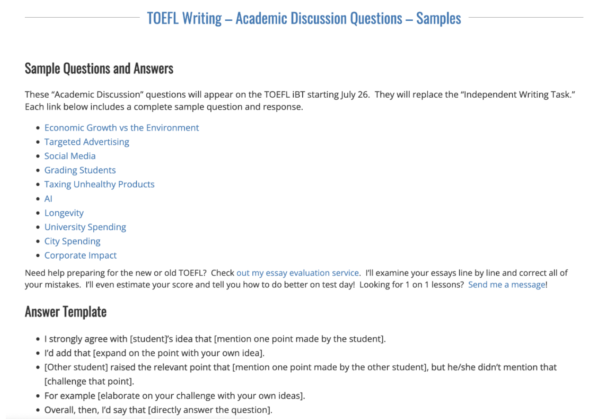

### 官方教程

#### [TOEFL阅读](阅读.html) 

#### [TOEFL听力](听力.html) 

#### [TOEFL口语](口语.html)

#### [TOEFL写作](写作.html)

### 时间规划

第1～3个月打好托福所需基础：对考试的整体了解

第3～6个月大量刷托福真题（TPO）：具体题型针对性练习

最后2～3个月用来熟悉机经和巩固：模考和查缺补漏

### 各个击破

**TOEFL阅读**

首先要提高单词量，不管什词汇书，一定要背熟，「短时高频重复」。

[:key:](https://www.zhihu.com/question/334907104/answer/1665802169)背单词4大原则

- 一次大量，多次重复
- 合理编码
- 复习更重要
- 由粗到细

APP：“考满分词汇”和“List记单词”。

其次多练长句。单词和长难句都是阅读的基本功了。

接下来多做托福阅读熟悉文章形式和题型。以TPO为主，1-20套掐时间做。

材料：gre红宝，长难句，tpo阅读，gre阅读36篇。

**TOEFL听力**

集中大量地精听，考前2个月一直听+跟读，并且隔几天做模拟题保持感觉。

材料：老托听力，tpo听力，科学美国人60秒

**TOEFL口语**

练习复述的能力，并和高分录音比较。

材料：口语真经3(12题)，tpo(3456题)，2012口语寂静(12题)，2013口语寂静(12题)，方法参考无 老师的30小时口语突破法。

**TOEFL写作**

先练习写作词汇和汉译英。后面每天写一篇综合（TPO上的）和一篇独立（2012机经上的）。

材料：    托福写作词汇小伴侣，十天突破新托福ESSAYS，Saavedro简谈如何有效提升TOEFL-IBT Writing写作语言表达，gre官方题库范文，2012机经。

### 考试时间

阅读考试时长54-72分钟；听力考试时长41-57分钟；口语考试时长17分钟；写作考试时长50分钟。

[托福考试的时间分配 | 托福考试流程介绍](https://www.eol.cn/waiyu/tuofu/98829.html)

> 托福考试按照阅读、听力、口语、写作四科的顺序进行，托福考试的形式是机考，其中，阅读、听力两科可能出现加试，口语、写作无加试。如整场无加试，托福考试总时长约3小时。如遇加试，考试总时长可达到3个半小时。

**托福考试第一个科目是阅读考试，**如无加试，阅读部分共3篇文章，每篇文章配有10个题目，三篇总共计时54分钟、每篇不单独计时。如果遇到托福阅读加试，则会增加一篇文章、10个题目，四篇总共计时72分钟。

> 3篇（加试则4篇）每篇18分钟

**托福阅读考试后会进入听力考试，**如无加试，听力部分共2个对话3个讲座、每个对话配5道题目、每篇讲座配6道题目，听力部分总时长约41分钟。如果遇到托福听力加试，则会增加1个对话和1个讲座，总时长约57分钟。

> 2个对话 + 3个讲座（加试则： 3个对话 + 4个讲座）

托福听力考试后有10分钟休息时间，考生可以离开座位、走出教室。休息期间系统会进入倒计时，10分钟内考生需要自行回到考位继续考试。

**第三项考试是托福口语，**口语共四个题目，一个独立题、三个综合题，总时长约17分钟，不设加试。

**最后一项考试是写作**。写作分两个题目，一道综合写作、先进行3分钟阅读、再进行3分钟左右听力，最后有20分钟写作时间；另一道是独立写作，有30分钟时间写作。写作部分总时长约1小时，不设加试。

> 写作第一题时记得戴耳机哦

### 考试改革

托福iBT®考试升级时间：自2023年7月26日起

考试内容：

| 考试部分 | 题目数量 | 预估时长  |
| -------- | -------- | --------- |
| 阅读     | 20道题   | 35分钟    |
| 听力     | 28道题   | 36分钟    |
| 口语     | 4道题    | 16分钟    |
| 写作     | 2道题    | 29分钟    |
| 总时长   |          | 2小时以内 |

不再加试，仍是30分*4 = 120分的总分。

仅改变了一种题型：更为简练的全新写作题型“学术讨论写作”代替原有的独立写作试题。

（图为新题型：话题包括不限于：经济增长与环境保护，定向广告，社交媒体，学生成绩评定，对不健康产品征税，人工智能，长寿，大学支出，城市支出，企业影响。这对大家知识的广度和宽度提出了更高的要求。）

学术讨论写作(Academic Discussion)来自TOEFL Essentials考试（如上图所示）。考生需要针对教授所提出的问题及其他学生的参考回答来表明自身立场并给出理由。

> 从TOEFL Essentials对学术讨论写作题型的评分标准来看，需要考生：
>
> - 回应题目中其他学生的提供的观点，并清楚地阐述立场；
> - 给出理由并清晰连贯的支持观点；
> - 准确使用合适的语法结构、词汇；
> - 准确使用英语拼写、标点和大写等

该试题将会模拟线上课堂讨论，要求考生针对指定话题阐述观点并提供论据。

在此题型中，考生应当：

The test taker is expected to：

对题目材料中的内容进行回应，或以此为基础表达观点;

respond to or build on ideas expressed in other text ;

明确陈述、阐述立场或论点 ;

clearly state or elaborate on a position or argument ;

在学术环境中，准确而有意义地使用一系列语法结构和词汇 ;

show accurate and meaningful use of a range of grammatical structures and vocabulary in the academic context ;

该题型将以同样的信度和效度，在短时间内测试出语言熟练程度。

> 新东方注释1：“学术讨论写作”（Discussion Board）题型源自TOEFL Essentials考试
>
> 新东方注释2：改革初期可能出现一段时间的评分红利期，学生拿到的分数有可能较改革前会更高。
>
> 新东方注释3：听力在托福考试中的核心地位不变。

参考资料[1](https://zhuanlan.zhihu.com/p/621136645), [2](https://www.ivyelite.net/blogs/69)

### 考试报名

托福一般提前3个月报名，这样有时间规划考试前的复习怎么安排，同时也有充足的考位可以去选择（你可以选择交通方便的或者环境好的等等），至少在一线城市或高峰期（8月）是这样。

> 我可以6月初的时候报名8月的考试。

中国大陆考生必须使用中华人民共和国第二代居民身份证报名。这是唯一接受的身份证件。

**考生在考试当天须出示与报名所用证件完全一致且有效的身份证件原件。**

### 分数换算表 & 评分标准

（改革后）

https://m.koolearn.com/toefl/20230411/854823.html

第一阶段保底分数 25*4

