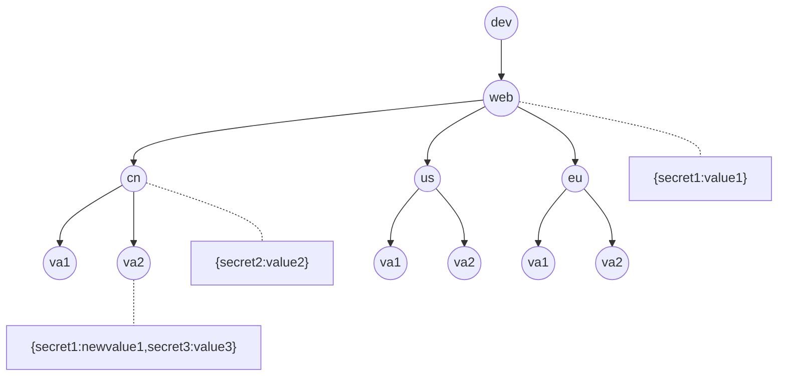

# CSMS

## 1. 介绍

概览：CSMS（云端密钥管理服务）是一个web服务，对组件或服务的配置文件中的secret提供管理，主要包括secret的创建，获取，启用，禁用，更迭，审计。CSMS 基于 AWS Secret Manager 和 Vault。

> 目前，企业经常把secret和代码放在一起。这是一种不安全的做法。代码库的泄露，会导致secret泄露。CSMS 服务将secret与源代码分开。在程序运行过程中，当应用程序需要secret时，可以从CSMS中获取。这样，代码只需要引用存放secret名字，而不是secret的具体值。

## 2. 数据模型

在CSMS（云端密钥管理服务）中,所有密钥都存放在相应的路径上。当应用程序根据路径请求获取密钥时,CSMS会返回该路径上的密钥,以及所有父级路径上的密钥。如果在子路径和父路径存在同名密钥,则返回子路径上的密钥,并忽略父路径上的密钥。



**eg:**

应用程序需要获取 `dev/web/cn/va2`的secret, CSMS将会返回:

```shell
secret1:newvalue1 # 同名按子路径
secret2:value2    # 父路径
secret3:value3    # 父路径
```

## 3. 工作流

