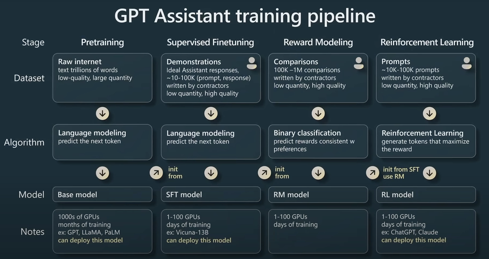
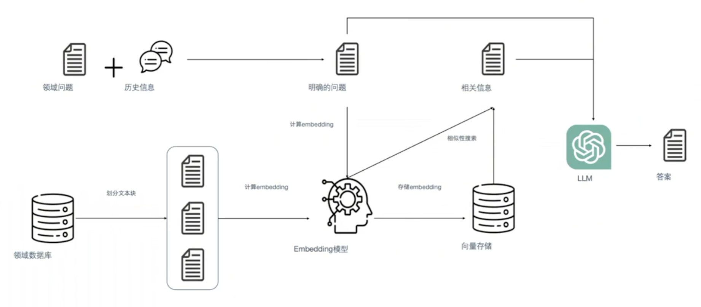
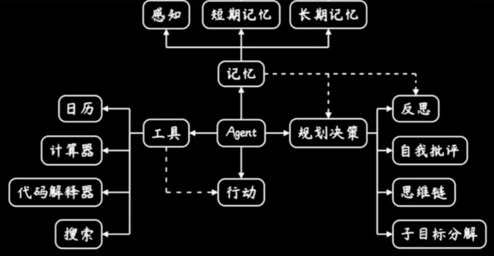

Dify 是一个开源的 LLM 应用开发平台。其直观的界面结合了 AI 工作流、RAG 管道、Agent、模型管理、可观测性功能等，让您可以快速从原型到生产。

# AI+Web3: 从理论到实战的进阶之路

## 大模型炼成

引用自 https://www.youtube.com/watch?v=bZQun8Y4L2A

- 预训练的Base model，只能做单词接龙（GPT）或完形填空（Bert）。

- 监督微调的SFT model，可以称为对话（Chat）模型了。经过少量标注数据进行训练后能适应特定的任务。

- 与人类价值观对齐的RLHF/DPO model，变得更可用、实用、好用。基于人类反馈强化学习 / 直接偏好优化 与人类价值观对齐，借以生成更精确、真实的回答。

  > 作为固定的“判别器”的RM，参考<a href="https://www.53ai.com/news/finetuning/2024091160724.html">link</a>。

局限：幻觉；实时知识；复杂推理；私有数据；交互决策；数学（9.9和9.11哪个大）；复杂文字逻辑/歧义，等等。所以使用LLM仍要谨慎。

## 大模型应用

### 01 提示词工程

情境学习（In Context Learning）：提供少量样本示例，Few-shot

思维链（Chain of Thought / CoT）

提示词工程（Prompt Engineering）：明确问题、提供上下文、明确期望、人类反馈（多轮对话）、英文提示词

提示词注入/泄露/越狱：比如被问出了windows11专业版的序列号

### 02 RAG

（Retrieval-Augmented Generation）

1.什么是Embedding/嵌入向量

Embedding是由AI算法生成的高维度的向量数据，代表着数据的不同特征。

- 在embedding空间中，相似的东西应该“近”，不同的东西应该“远”。embeeding一般是五百至几千道维度，但拿二维来理解的话，远近就类似向量的余弦距离。
- 语义和语法关系也会被编码到embedding空间中。例如`King - Man + Woman = Queen`
- embedding是一种通用的数据表示方式，各种形式、模态、规模大数据都可以转化为embedding。

2.多模态Embedding

CLIP模型 embedding维度：512,768

- 收集4亿图像文本对 进行无监督预训练（对比学习）
- 最大化文本表征和对应图像表征的余弦相似度；最小化文本表征和非对应图像表征的余弦相似度
- 广泛用于图像分类、图像生成、图像检索、视觉问答等任务

3.RAG的核心思路

类似于开卷考试。检索出相关信息，和问题一起交给大模型。

### 03 智能体

智能体Agent的概念，还处于非常早期的阶段。

理想很美好：给出指令，并观察其自动化执行，节约做事的时间成本。

但现实很骨感：生成内容不可靠，过程不稳定，严重依赖人工经验判断。

定义：LLM+工具，外部工具（Function Call）实现LLM能力的显式扩展，生成过程可溯源、可解释。

示例：图中有几个穿着红白条纹毛衣的人？

ChatGPT无法完成处理图片，但是通过外接工具，这项任务可以完成。(1) 调用SAM 找到图中所有的人 (2) 调用CLIP判断这些人中哪些符合条件。 并且这些操作由智能体自主进行。

### 04 大模型的下游任务

例如：文本摘要、文本分类、机器翻译、问答、关系抽取、NL2SQL（自然语言问题转化为SQL查询语句）

对某个下游任务进行针对性微调。

- 全参数微调（Full Fine-tuning）：消耗大量资源，不建议
- 低资源微调（Parameter Efficient Fine Tuning）：有很多方法，其中Lora最为常见。

## Dify

>  [!NOTE]
>
> Dify 一词源自 Define + Modify，意指定义并且持续的改进你的 AI 应用，它是为你而做的（Do it for you）。

是一款低代码（low code）生成式AI应用创新引擎。最大的竞品是字节的Coze（扣子）。

### Dify官方文档

**Dify** 是一款开源的低代码LLM应用开发平台。它融合了后端即服务（Backend as Service）和 [LLMOps](https://docs.dify.ai/zh-hans/learn-more/extended-reading/what-is-llmops) 的理念，使开发者可以快速搭建生产级的生成式 AI 应用。

由于 Dify 内置了构建 LLM 应用所需的关键技术栈，包括对数百个模型的支持、直观的 Prompt 编排界面、高质量的 RAG 引擎、稳健的 Agent 框架、灵活的流程编排，并同时提供了一套易用的界面和 API。这为开发者节省了许多重复造轮子的时间，使其可以专注在创新和业务需求上。

#### 为什么使用 Dify？

- LangChain 这类的开发库（Library）想象为有着锤子、钉子的工具箱。与之相比，Dify 好比是一套脚手架，更接近生产需要的完整方案。
- Dify 是**开源**的，由一个专业的全职团队和社区共同打造。在灵活和安全的基础上，同时保持对数据的完全控制。
- 产品简单、克制、迭代迅速。

#### Dify 能做什么？

- **创业**，快速的将你的 AI 应用创意变成现实，无论成功和失败都需要加速。在真实世界，已经有几十个团队通过 Dify 构建 MVP（最小可用产品）获得投资，或通过 POC（概念验证）赢得了客户的订单。
- **将 LLM 集成至已有业务**，通过引入 LLM 增强现有应用的能力，接入 Dify 的 RESTful API 从而实现 Prompt 与业务代码的解耦，在 Dify 的管理界面是跟踪数据、成本和用量，持续改进应用效果。
- **作为企业级 LLM 基础设施**，一些银行和大型互联网公司正在将 Dify 部署为企业内的 LLM 网关，加速 GenAI 技术在企业内的推广，并实现中心化的监管。
- **探索 LLM 的能力边界**，即使你是一个技术爱好者，通过 Dify 也可以轻松的实践 Prompt 工程和 Agent 技术。

#### 下一步行动

- 阅读[**快速开始**](https://docs.dify.ai/zh-hans/guides/application-orchestrate/creating-an-application)，速览 Dify 的应用构建流程
- 了解如何[**自部署 Dify 到服务器**](https://docs.dify.ai/zh-hans/getting-started/install-self-hosted)上，并[**接入开源模型**](https://docs.dify.ai/zh-hans/guides/model-configuration)
- 了解 Dify 的[**特性规格**](https://docs.dify.ai/zh-hans/getting-started/readme/features-and-specifications)和 **Roadmap**
- 在 [**GitHub**](https://github.com/langgenius/dify) 上为我们点亮一颗星，并阅读我们的**贡献指南**

#### Dify实践

你可以通过 3 种方式在 Dify 的工作室内创建应用：

- 基于应用模板创建（新手推荐）

- 创建一个空白应用

- 通过 DSL 文件（本地/在线）创建应用

  > [!NOTE]
  >
  > Dify DSL 是由 Dify.AI 所定义的 AI 应用工程文件标准，文件格式为 YAML。该标准涵盖应用在 Dify 内的基本描述、模型参数、编排配置等信息。

  > YAML 曾被称为“Yet Another Markup Language”（又一个标记语言），但后来为了更好地区分其作为数据导向的目的，而重新解释为YAML Ain't Markup Language（回文缩略词）。意味着 YAML 的设计初衷是处理数据，而不是用于文档标记。

