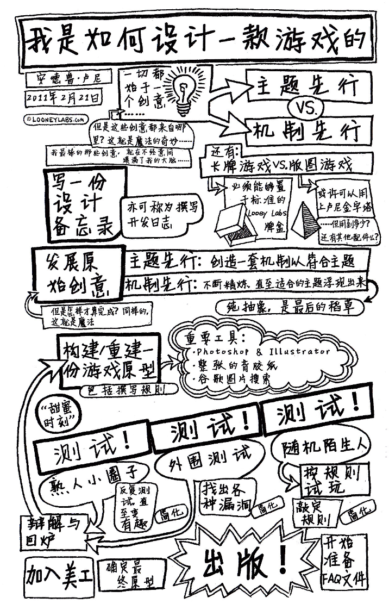

# 《狗头人之桌游设计指南》

“我真希望二十年前就能拥有这样一本书” —— Bruno Faidutti，“富饶之城”的设计师

## 概念

>  [!IMPORTANT]
>
> 理解我们要创作怎样的游戏、谁会玩那些游戏、以及我们将给玩家们留下怎样的印象

#### 1.1 游戏不等于规则

James Ernest

##### 1.1.1 游戏机制

​        游戏乃一个完整体，一款游戏可以包括有主题、机制、品牌，甚至是生活方式等元素。如果你想创作一款全新的游戏，需要从更高的层面去考虑一个问题：为什么玩家要选择这款游戏。

​        游戏机制就好像手表的零部件。对于手表的零件来说，有什么是令你觉得无与伦比的？我想我能讲出的关键词只有齿轮、发条和条轴等等。即便如此，你也无法通过我所讲的这些名词来真正理解如何制造一块品质上乘的手表。事实上，没有人会因为一块手表配有优质的零件而去购买它。

​       游戏机制相当于手表内部的机械零件。所谓优秀的游戏机制，只有置于特定的游戏之中才具有意义。若是硬将某一游戏机制移植到其它游戏，没人能保证这种机制还可以发挥作用，更别说保持其优秀的特性了。

​       当然，这并不意味着游戏不能从其它作品中借鉴游戏机制，恰恰相反，借鉴是完全可以的。但是盲目移植一种游戏机制的部分内容，是一种糟糕的设计方法。你必须要拥有自己的设计图纸，有全局观。

##### 1.1.2 评判法

​       如果仅仅具备对游戏的评判鉴赏能力，不可能成为一个创造者。这就是为什么评论家和创作者这两种职业极少有实质上的交集。也就是说，分析不能带来独创性，那什么能呢？

##### 1.1.3 你的两个大脑

​       你有两个大脑，孩子的大脑和成人的大脑。它们分别反映了你性格中的创造性和挑剔的部分。

​       孩子的大脑是一个充满了乐趣的大脑，他充满热情与信任，每件事看起来都那么神奇与新鲜。孩子大脑喜欢机器人、僵尸和海盗，他知道怎样的主意是非常棒的，你应该完全信任他的判断。但是他缺少纪律性，不太擅长去完完整整地做好一件事。

​       成人的大脑很无趣。她是那个挑剔的人，在你做每件事之前，她都会第一个跳出来。成人大脑会不停地唠叨，反复提醒儿童大脑：已经有数不清的僵尸游戏了，不管这个游戏有多酷，这个世界不需要它。

​       当你为一款新游戏构想创意时，你需要让你的成人大脑闭嘴。这很难做到，成人的声音听上去挺有道理的。但是她根本就不知道怎么区分一个主意是个好主意还是只是重蹈他人覆辙。

​       假设你参加了一个推介会，每次你抛出一个新想法都会被打击。如果有人听过类似的想法，他们会说：“我们不能用它，已经有人用过了。” 如果没人听过类似的想法，他们会说：“我不知道这东西是怎么运作的。”没有一个想法有哪怕一丁点的机会去实现，从而创造出新东西。

所以如果你是一名游戏设计师，你必须重新学习如何思考。让自己充满热情，不要给任何想法下断言，让自己成为一个孩子。

​       孩子总是充满热情。他们很天真，会想到一个主意就付诸实施，他们没有顾虑。他们确实不知道自己的想法是前人已经做过的，这种状态使他们能把某些熟悉的东西变成另外一个全新的东西。当你处在构思游戏的头脑风暴阶段时，成人大脑需要保持沉默。否则，你永远无法听到完整的思路。

​       一旦孩子大脑做了一个他非常喜欢的东西，成人大脑就可以回来了。她的工作是查看设计，并指出这个设计是否符合基本规范：范围、受众、市场——所有那些孩子大脑不关心的事情。

​       当创造性思维心满意足地完成工作之后，批判性思维就可以介入游戏设计环节了。写下目标。理清思路，严格执行。如果你的游戏设计进行得不太成功，这个时候才是用那些你熟悉的概念来分析它的时候：其它游戏、游戏理论、数学性、科学性和动机。

##### 1.1.4 动机

​       如果我要选一个游戏必须具备的因素，我会选“动机（玩游戏的理由）”。

​       很多理由会导致“动机”的出现，并且玩家常常不能解释其原因。如果你问一位万智牌玩家为什么喜欢这个游戏，他会和你谈游戏机制，列出他最喜欢的牌，最后用数不清的锦标赛见闻来把你逼疯。但是他大概不会告诉你的是：“万智牌让我觉得自己很聪明”。

​       直接用最简单的话来说明你想要让你的玩家有什么样的感觉。“我想让他们觉得有趣”可不算有效的答案。无数东西都能带来乐趣。作为一名设计者，你必须意识到吸引人们玩你的游戏的真正原因——尽管他们自己并没有察觉。

​       此后当有人称赞你无与伦比的游戏规则时，只需要微笑并且说“谢谢”就可以了。

#### 1.2 玩更多的游戏

Richard Garfield

> 按语：某个平行宇宙里，有一个叫Richard Garfield的人发明了万智牌，然后就去安度晚年了。但我认识的那个Richard Garfield在过去几十年里根本就不知道“安度晚年”是什么意思。他不断地以娴熟的手法挑逗这只被称为“游戏设计”的野兽。

​       任何想要设计游戏的人都应该玩游戏。很多很多游戏。

​       有些设计师说他们从来不玩其他人的游戏，因为他们怕别人的游戏概念会影响到他们自己的设计。他们相信设计需要“真空”。想象这样一个世界——斯皮尔伯格不看任何电影，斯蒂芬金不读任何小说，霍金不认同自己的理论以外的任何其它理论。你觉得他们会比现在做得更好吗？在那个世界里，我认为我都不会知道他们的名字。

​       牛顿曾说过，“如果说我比别人看得更远些，那是因为我站在了巨人的肩膀上。”事实上，闭门造车并没有什么优势可言——无论是在艺术还是在科学领域。

​       “好吧。”你会说，“我是设计桌游的，所以我会去玩桌游。” 而我会说，“还不够！” 你应该去玩各种类型的游戏，去看电竞节目、体育比赛。杰出的设计往往会从所有的游戏中汲取灵感。

​       那究竟在什么时候，你应该担心你的设计过于模仿他人的作品？这通常是一个很难回答的问题，但如果玩家从你的游戏中得到了一些其它游戏中没有的乐趣，你大概就不用担心这个问题了。如果你足够仔细地审视任何游戏的话，你会发现没有什么是原创的，但这并不意味着所有设计都不是原创的。就好像一锅炖肉可远不是肉加香料这么简单，一段旋律不仅仅是几个音符的列表。这才是设计师应有的、整合规划设计元素的重要能力。

​       事实上，新手设计师常常过度创新。游戏最棒的一点在于它可以给玩家带来多少东西——好的游戏为人生带来愉悦。但事实上学习新游戏很累人。创新是必要的——这会诱惑玩家——但太多改变会让游戏变得很难学会。设计师有责任确保每一项打破常规的改变都值得玩家花费时间去学习。

​       优秀的游戏常常使人感觉其中的创新成分比他们实际所做的要多。想想那些享誉全球的公司，比如：暴雪。他们做出来优秀的游戏，但比起他们在游戏形式上的创新，他们做得更多的是大大完善了现有的游戏形式。《星际争霸》和《魔兽世界》对于大多数读者来说是非常完美的游戏，但与相应类型的创始者相较而言，其创新程度完全不可比，比如首款即时战略游戏（RTS）《沙丘2》，或是更早的图形大型多人在线角色扮演游戏（MMORPG），如《网络创世纪》或《无尽的任务》。

​       作为一名设计师，我始终坚信，你应当 充分理解并且善用你所受到的“影响”。深入理解它们，可以使你成为一名更加优秀的游戏设计师。

​       这种“影响”如何显现作用的一个例子，就是我设计的《东京之王》。这款游戏的机制建立在《快艇骰子》的基础之上。我之所以想到《快艇骰子》是因为我以前玩过《卡坦骰子版》，那次的游戏经历令我印象深刻。游戏风格则是受了《吃了伊根的怪兽》和电子游戏《砸毁咬》的影响，肯定还有很多我没有意识到的影响因素没有算进去。如果我没有玩过大量的游戏，不论新旧，并且仔细地分析过它们，《东京之王》是不会存在的。不论是谁玩它，都不会认为这是哪款游戏的“双胞胎”，对此我很有信心。

​       和我一起站在巨人的肩膀上，这里风景很好——玩游戏、从游戏中学习、享受游戏，终有一天，设计师们会站在我们的肩膀上。

#### 1.3 游戏节奏

> 按语：虽然合作写这本书的每个人都知道怎么写文，但其中只有一个人是真正的科班出身。本文的作者Jeff Tidball曾求学于南加州大学的电影艺术专业，这或许也能解释为什么玩他设计的游戏总是让人感觉在经历一个个引人入胜的故事。当我第一次和我的伙伴们玩他所设计的《银币》时——这游戏的组件仅仅是一些只手可握的硬币——我就已经能感受到指尖跃动着的故事的分量。海盗船长和他的船在危机四伏的大洋上破浪前行，集结于船长手下的悍匪船员们和船长一起把对手们送去大洋深处长眠。仅仅是几枚硬币，他就能娓娓道来这样的一个故事。也正因为如此，我邀请他来给我们讲讲如何像故事一样设计游戏。

——像上帝和亚里士多德那样讲故事

Jeff Tidball

​       亚里士多德在一本叫做《诗学》的著作中阐述了戏剧的原理。他写到：对一段高质量的戏剧情节而言，包含完整的开场——发展——结尾三幕剧式结构（也称三一律），是最重要的因素之一。从三幕剧式结构的角度来对故事进行分析，可以帮助我们窥视故事运作的规律，看到故事发展的节奏。

​       我们的意识把生命中的每一件事情以故事的形式单独存放、回忆并理解。对于玩家来说，玩游戏也是他们所经历的故事。

​        对于每一幕应该发生什么，每个人都有不一样的想法。柏拉图的理想国并不包括一个圆满的开场，一个完美的发展以及一个理想的结尾。而为什么亚里士多德用三幕剧式架构来定义经典希腊悲剧故事，也只是因为他觉得俄狄浦斯王是一出最棒的戏剧。悉德・菲尔德用一个完全不同的架构来解释戏剧。无数的学院派人士曾经提出了各式各样的理论。

> 如果读者对多幕架构在戏剧中的作用有兴趣，推荐David Howard和Edward Mabley的《编剧工具》和Robert Mckee的《故事》，这个人相当有才。

​       游戏中的多幕架构：

​       玩游戏的第一幕——就和戏剧中的开场一样——就是游戏初始设定结束而冲突正在玩家之间慢慢孕育的阶段。战线逐渐明晰，而玩家们也开始对斗争在哪些维度展开有了明确的概念。新玩家们能在游戏机制的理解上和所有其他玩家站在同一水平线，只有这样他们才能满怀信心的进入第二幕。

​       玩游戏的第二幕——就和故事的发展一样——是为了获得胜利而不断拼搏的核心阶段。玩家们应该在第二幕的斗争中直面其他玩家。合作类型的游戏看上去是个例外，但其实并非如此，对这样的游戏我们仅仅需要理解为玩家们结成统一战线来对抗游戏本身就可以了。单人游戏也是一样的道理。

​       玩游戏的第三幕——就如同结尾——是达成胜利的过程。一个或多个玩家一个接一个，要么努力然后惜败，要么努力并最终以他自己的胜利结束游戏。对于一个情绪上最让人满意的第三幕，一个核心的特点就是领先者的胜利并不是不可阻挡的。所以在第三幕，除了领先者以外的其他任何一个玩家应当——虽然可能非常非常难——依然可以从失败的情况下逆转。当一个玩家发现自己不可能赢的时候，游戏对他来说就不再有趣了，因为他再也没有情绪上的紧张感了。而如果这个不可能胜利的玩家依然能够影响到最终胜利的玩家，那这就更糟糕了。出现这种拥王效应（Kingmaker effect）绝不是好的游戏设计。在第三幕的有些时候，必须要让玩家能够做到一击制胜。对于游戏设计者和发行者来说，游戏无止境的进行下去对游戏带来的伤害比想象中的还要可怕。因为这种冗长乏味会牢牢地占据玩家的大脑，让他们觉得游戏就是在冗长乏味中结束的。有些游戏你玩着玩着会变得不在乎是谁赢得了胜利。遇到这种情况，就是因为第三幕太冗长了！

> - 想法1: 游戏的幕间转换比起戏剧、故事和电影而言似乎具有更强的渐进性。一个值得思考的问题是：到底是快速切换还是缓慢转进有趣。
> - 想法2: 我所描述的是基于玩家游戏体验的框架，与任何游戏机制的装饰性设定无关。如一个美式桌游可能会用三幕来单纯描述故事，这个与我提出的基于游戏体验的三幕结构并无相关的部分。
> - 想法3: 对我来说“欧式游戏”的作品经常误入歧途，因为它们只有第二幕。注意：这仅仅是一个讨论话题罢了。

​       我希望游戏设计者能够思考三幕剧式架构，从而理解玩家对游戏的无意识期待，并且作为这种思考的收获，我希望游戏设计者能够避免盲目设计和不停试错，最终能够设计出更好的游戏。我猜测这套理论能够帮助设计师处理以下问题：

​       在游戏测试后发现游戏机制行得通，但是玩家并没有感受到乐趣，或者没有感受到足够的乐趣。

#### 1.4 游戏背景 vs. 游戏机制

Matt Forbeck

> 按语：Matt Forbeck可能会因为很多理由而对一个游戏设计项目说“不”——比如时间、收入，又或者因为要训练他家的四胞胎踢足球——但他绝对不会因为不熟悉某个游戏类型而拒绝游戏项目。或者应该这么说，Matt已经把所有你能想到的创作类型抖尝试过一遍了。而正因为他对事物应有的形态有着无可比拟的洞察力，他能令游戏里的每一个元素都恰如其分地在它应该出现的地方出现。这里，我让Matt给大家讲讲他是如何整合游戏里的元素，实现一加一大于二的效果的。

​       游戏机制是抽象出来的游戏的运作方式。游戏背景则是游戏给你带去的美丽谎言，是让游戏获得意义和更多价值的幻想。	

​       所以，哪一个更重要？如果我们想要设计一个好游戏的话，我们应该从何处开始？哪个回答都是错的。这完全取决于你，每个游戏的方式也可以不同。

​       让你的游戏更纯净。 游戏是许多元素的复杂聚合，包括美术、规则、组件、机制和背景。

##### 1.4.1 从机制入手的方法

​       有时候，你灵光一闪想到一个与众不同的游戏机制，或是可以发明一个游戏组件。你想基于这个灵感设计一个游戏。无论是哪种情况，一旦你拥有了这个基本元素，你就可以基于这个元素去设计一个游戏，但也请谨记，不要把这个游戏元素等同于游戏本身。即使是中等复杂度的游戏也需要一定数量的不同游戏机制如同交响曲一般协作。

​       当你完成了你的游戏机制时，你就拥有了游戏的基本骨架，你可以往这个骨架上添加血肉。一个好的游戏机制的组合可以用来与任何类型的游戏背景结合。一个健全的游戏机制时泛用的。在玩家心中，游戏体现的是对一种复杂情况的抽象表达。这意味着即使是泛用、可重复用的规则在使用的时候，依然需要被植入特定的游戏背景或设定中才能真正地成为一个游戏。

##### 1.4.2 从故事的角度来思考

​       要想确定游戏的故事背景，试试看把故事简化到最基本的层面上。花时间想想你的游戏是关于什么的，把它写下来，尽可能简化。如果能把游戏背景表述成一句话就最理想了，试试看如下的格式：

`[游戏名] 是一个 [游戏类型] 游戏，在这个游戏中，[玩家或玩家的化身] [使用游戏提供的什么东西] [相互竞争或做什么事情]`

​       比如：《强手棋》是一个桌面游戏，在这个游戏中，玩家扮演的资本家们通过购买、增加资产和索取他们所能索取的最高租金来迫使对手破产；《万智牌》是一个集换式卡牌游戏，在这个游戏中，强大的魔法师通过开发他们的“地”来获得魔法能量，并使用魔法驱使手下来进行不死不休的决斗。

​       当你完成了这个描述，你就至少拥有了一个关于你最终想要的游戏的基本轮廓。从这里起步，你只需要开始逐步填充线条就好了。

##### 1.4.3 游戏背景和授权

​       很多时候，基于一个已经存在的背景来设计游戏会更容易。但即使如此，你依然需要指出在原作故事中到底是什么如此吸引人，并且要能够将这最引入入胜的部分“翻译”成你设计的游戏。而关于游戏的最棒的事情也正在于此，相比于把整个宏大史诗完全收录，游戏的设计者可以选择只是专注于故事的一个角落。你当然可以用加粗的文字来描述那个宏大的故事背景，但你也总是可以挑选那些最适合桌面游戏的元素。你可以把那些最匹配你的游戏的部分着重推出到台前，而让其他的因素隐藏在幕后。

##### 1.4.4 找到融合点

>  [!TIP]
>
> ​       在最好的游戏中，游戏机制和游戏背景是相互支撑的。他们在每一个层面以直观的方式相辅相成。如果在开发游戏时在机制和背景中的某一个方面陷入了困境，你完全可以切换到另一个方面去获得灵感。如果你同等尊重游戏机制和游戏背景，这种不断切换和互相促进的工作模式会表现得很好。
>
> ​       当你创作自己的游戏时，你可以改变二者中的任意一个来适应另一个，但你需要确保他们总是无缝地结合的。对于那些已经存在的设定或是游戏背景，你往往并没有自由来改变背景的内容。这时候你就需要更改游戏机制来使其契合游戏背景。
>
> ​       游戏需要告诉玩家们他们能从游戏中期待什么。而作为一个设计师，只有你才能决定使用何种工具，特别是用何种游戏机制、用什么样的游戏背景来更清晰地将这种期待传递给玩家们。

##### 1.4.5 游戏的关键

​       任何一个要素，如果它不能支撑游戏，或是不能让游戏变得更好（无论是机制还是背景）都应该被从游戏中去除。无论这个特别的机制或是巧妙的故事是如何地让你着迷，如果它不够合适，就把它放在一边。

​       但同时有一件很棒的事情——这些你喜欢的要素并不会因为你把它们放在一边而被浪费。它们有无限的生命力。你总是可以之后再在其他地方使用它们，比如一个相比于目前的游戏更合适它的项目中。

​       最后我想说，让游戏中的每一个元素对游戏都有价值，同时让游戏中的每一个元素为那些将要玩这个游戏的人带去快乐。

#### 1.5 游戏究竟属于谁

Mike Selinker

>“Mike”，其实是个很没劲的常见名字。不过，当它印在游戏外包装上的时候，看起来就有那么一点酷了。对我来说，这个情景已经发生过好几十次。但每一次它都让我如初见般欣喜愉悦。你们应该也想要了解这种感觉吧。其实你们还应该了解的，是署名一款游戏真正意味着什么。

​       不像体育运动，音乐，舞蹈，还有科研，游戏设计通常是单枪匹马的，与艺术相类似，而操作起来，设计游戏的过程更像是写作。其中充满了灵感，挫折，和期待。它不太会给你寻找搭档的契机。在游戏设计时你没法玩挡拆配合，毕竟它和打篮球时的合作是完全两码事。

​       不过，这也正说明我们需要主动战胜单兵作战的惰性，找人合作完成共同设计，而它是如此的重要。的确，很多游戏你是可以独立设计完成的，但是如果你一时没法找到内在的灵感来呈现最好的效果，那么你的游戏将受限于你的才华和表现。回想一下，在你的生活中有多少事情你是因为自身的局限所以必须要与人合作的。不要觉得游戏设计会是与合作绝缘的特例。

​       我希望你能够清醒地知道你对这篇文章标题的答案。或者至少让我能欣慰地知道，你们能猜测到我希望你们的答案是什么。你的名字印在包装上，所以，这就是你的游戏。这是个很容易被轻松接受的观念。但是现实往往会更为复杂。一款游戏的真正所有人其实是全体为之付出过心血的参与者。让我们来看看那些可能同样有权利拥有一款游戏的其它人，以及这些人的贡献是如何融入到你的游戏中的。

##### 1.5.1 游戏属于合作设计师

​       Shannon Appelcline曾经在2006年做了一张表，名为Bruno Faidutti的六度人际关系。Bruno是名来自巴黎的设计师，他是游戏工业领域里的巨人。比如你们应该经常能玩到的《富饶之城》，就是他设计的。用Shannon的话来说，他还是“我们游戏工业领域里的奥斯卡最佳男配”。Bruno的合作名单绝对是人丁兴旺，其中包括美国、德国、意大利还有他家乡法国本土的诸多设计师。因为合作，这些游戏有了更加出色的基因组合。当然，找到与你合拍的设计师是个很大的挑战。不是所有人都可以一同完成设计。但是如果你不去尝试，你就永远不会知道结果。

​       没有合作，我无法做到现在这么出色。这并不意味着我无法独立完成游戏设计。了解到这一点能够让我没有牵绊地脱离独自作战。

##### 1.5.2 游戏属于后续开发者

​       为《万智牌》设计扩充系列的工作是个让人满怀谦卑的过程。在完成整个系列三百五十张卡牌的过程中，威世智（Wizards of the Coast）公司可能会有多达二十名研发部成员和编辑参与其中。这里没有脆弱自尊的立足之地。过分坚持你的创意可能意味着你将被工作中剥离。关键之处并不是在于让某个人的某个创意成为闪光点。关键是让整个游戏光彩耀人。

​       你可能并不愿意在这种流水线式的环境中工作。但是请至少把你的游戏递交给一位其他开发者，这将会是非常有益的。《山屋惊魂》就是一款不断从不同理念中收益的游戏。最初，这款鬼屋游戏是Bruce在1995年完成初始设计的。之后孩之宝的Rob在2001年进行了重新设计，它顺利衔接了之前的风格。2003年，效力于威世智的我和我的团队再次将其改变，让规则更精炼，让场景更庞大。最后，当2010年Bill的团队完成了它的二版设计后，它变得愈加平衡典雅。

​        设计师们对于后续开发的最大担心是，他们怕永远再也见不到他们原本设计的游戏了。但是，作为一名优秀的设计师，我们应该学会放手。

##### 1.5.3 游戏属于出版商

​       一个出版商的品牌认同，对于大多数设计者而言，都有一种罗赛塔石碑般的指引和向导作用。在相关研讨会上我被问及最多的问题就是“谁会出版这个游戏？”只要你花点时间去了解那些出版商曾经的产品，答案将不问自明。如果你真的很擅长此事，那么你甚至能有根据地猜测到一个出版社在各种不同选择里，最终将出版哪些它们还没涉足过的东西。

​       当你把游戏卖给出版商时，游戏中与出版商气质不符的那部分其实就已经开始消逝了。当你在合同签字栏上落笔之前，你就应该知道这一点。如果你想不通为什么出版商不把你的游戏照原样出版，原因其实就是因为他们不愿意。但是这些公司仍然可能想要你这个游戏，而你，也仍有可能会喜欢那个最终不一样的产品结果。

##### 1.5.4 游戏属于授权方

​       游戏出版商关心的是如何做出优秀的游戏，而授权方关心的是保护他们的品牌。这两个概念相关，但并不总是一致。

​       保护品牌意味着赶走任何想要对品牌内涵进行重新定义的企图。漫威关心的是蜘蛛侠具体做了什么（故事），而不关心我会让玩家做什么（游戏机制）。保护品牌同时还意味着在游戏外包装上印刷品牌商标。

​       当你从一个伟大的许可方那里得到了为一个伟大品牌工作的机会时，你可能会沿着这条星光大道做出你有史以来最棒的作品。

##### 1.5.5 游戏属于你

​       设计师特质有可能会造成局限，但是对于商业来讲说它们却是好东西。比如Lisa Steenson，她设计的产品都很低价宜人：《愤怒人生》、《房车营地战争》，还有关于花园侏儒的游戏《侏儒别动》等。如果你喜欢其中一款，那你就会喜欢其它所有。你甚至想都不想就会去买它们。

​       如果你具备某种设计师特质，你的游戏就会反映出这一点。就算你的名字没有被印在包装盒上，人们也同样会发觉它。这一点很棒。

##### 1.5.6 游戏属于每位工作人员

​       荣誉是最容易给予的东西。如果总是独揽荣誉，你就是在亲手将人们推开。只要可能，我同事们的名字都会和我的名字紧密相连地印在一起。当人们告诉你，你做了一个伟大的游戏时，你要为你的团队感到骄傲，然后回应道，“不，是我们做了一个伟大的游戏。”

## 2. 设计

>  [!IMPORTANT]
>
> 帮助我们确定，我们的游戏将如何运转、它们会是怎样的模样，以及它们是否有任何可取之处。

#### 2.1 我是怎样设计游戏的

Andrew Looney

> 按语：本书能让你们窥视众多游戏设计师的大脑深处。但我仍认为这其中没有一个头脑思路能与Andy Looney相比。Andy会仍自己和所有思路结合，骰子，卡牌，版图，甚至彩色金字塔等等。他会吸收所有内容，然后为世界奉献出像《万象无常牌》和《冰屋》这种杰作。

​       我不是来讲述其他人是如何设计游戏的——每位艺术家都有他们独特的创作理念，通常这是由他们各自的特殊经历所决定的。我只会简单解释我的创作流程，一套我经过几十年探索和试错所总结出的体系，我希望这套方法对于其他人来说会是有用的，或者至少会是有趣的。

##### 2.1.1 一切都起始于一个创意

​       经常有人问我，我的创意都来自哪里，而事实是我真的不知道——各种创意就是不经意间浮现在我脑海中了。（如果你不是那种拥有天马行空思路的人，那么设计游戏可能真的不适合你。）

##### 2.1.2 主题先行 vs. 机制先行

​       有时，找到一个符合设计机制的好主题实在是件很困难的事。纯抽象游戏固然有其存在价值，但是我总觉得这是一种偷懒。即使主题的存在感再差，它也能够以某种重要的方式改善游戏设计，比如用来为游戏命名。（为游戏命名通常是游戏设计中最困难的内容之一。）同时，即便游戏主题实在过于轻薄，这些主题本身也会激发出一两条相关规则来加强其自身存在感。

##### 2.1.3 卡牌游戏 vs. 版图游戏

​       桌面游戏通常会被分为卡牌游戏和版图游戏两类，其实有时实在很难界定。很多卡牌游戏本质上是带着一个无形的版图来进行游戏的；而在一款版图游戏中，其实版图可能是也可能不是最重要的组成元素。这也正是我更乐于笼统称我们的产品为“桌面游戏”的原因。

##### 2.1.4 可行性确认

​       在开发早期我们就应该审视产品的生产事宜。把设计中的配件控制在你能够生产的部品范围内。这种限制同时也会帮助你集中精力，大家如果尝试写过俳句或者微小说的话，相信一定会懂这个道理。同理，基于版权许可的设计也要尽量小心行事，毕竟如果版权方说不，那你将无法出版你的游戏。

##### 2.1.5 写一份设计备忘录

​       我会使用科学研究的方法来对待我的新创意。我保留有一套标准的工作记事本专门用来记录各种各样的创意。在所有糟糕创意和确实可行创意的区分方法中，没有什么比把它们写下来更有效的。

​       如果你写下某个创意的相关内容并且日后再回顾它们时，你还有可能会发觉，这个创意并不像你当初在下半夜3点从床上跳起匆忙记下它以免忘记时感觉的那么出色。不过，也有可能它就是那个险些让你在不经意间漏过的绝佳创意。

##### 2.1.6 发展这个原始创意

​       和解释创意来自何处一样，这里还有一个很难讲得清楚的开发阶段。用一个我乐意使用的类比来说，这就像做汤或炖菜。你有那么一锅酝酿中的原材料，你要把它们重复混合，再加一点这个调味品，撒一些那个佐料，在此过程中时不时尝一尝，最终试着把它烹饪成某种桌上的每个人都会喜爱的东西。

##### 2.1.7 定位你的受众

#### 2.2 让设计直观

#### 2.3 谈入门游戏设计

#### 2.4 最美的游戏机制

#### 2.5 策略即是运气

#### 2.6 让我们把它变得有趣一点

## 3.开发

>  [!IMPORTANT]
>
> 让我们平衡、测试、改写、再平衡、再测试、再改写，如此反复直至我们的游戏趋于完善。

#### 3.1 开发领土

#### 3.2 脑力爆炸

#### 3.3 被剥夺的游戏乐趣

#### 3.4 写准确的规则

#### 3.5 直到他们说好以前，都不算完成

## 4.呈现

>  [!IMPORTANT]
>
> 敲定我们的游戏，做好出版准备，并期待着它们带回更多的新朋友

#### 4.1 制作游戏原型的致命谬误

#### 4.2 一切在制作游戏原型时你想知道的事

#### 4.3 人生就是一次推销

#### 4.4 如何出版桌面游戏

## 5.后记

# 《游戏设计梦工厂》