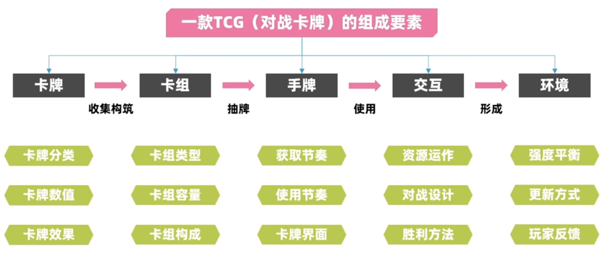
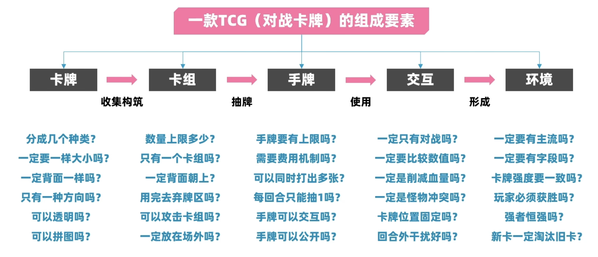
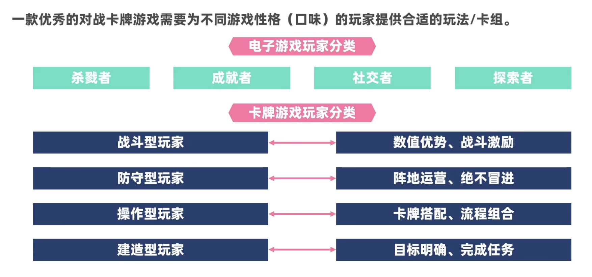
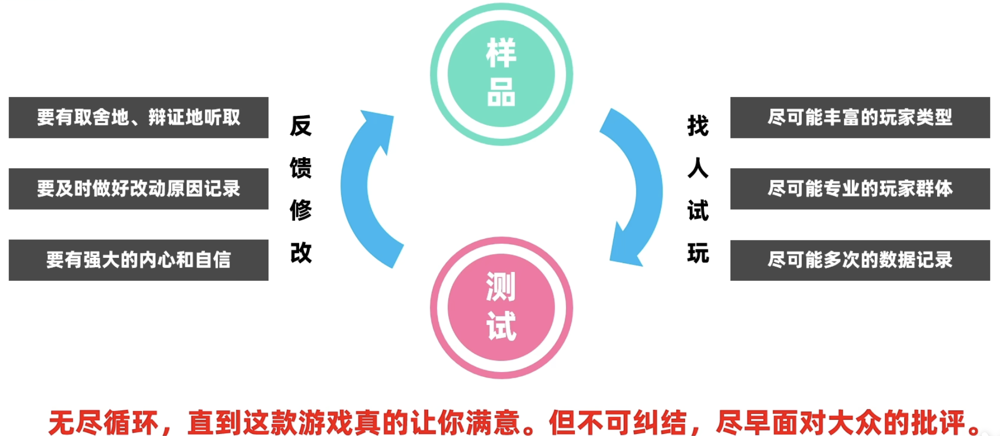
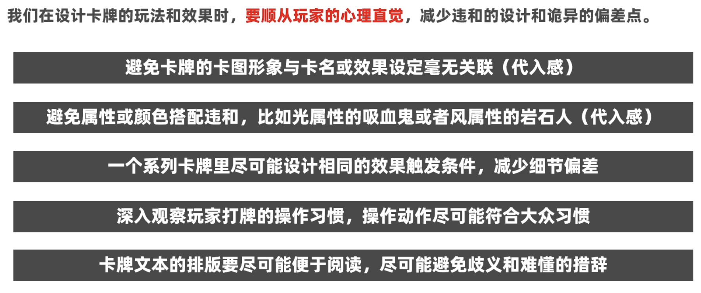

<iframe src="//player.bilibili.com/player.html?isOutside=true&aid=1156072948&bvid=BV16Z421K7TV&cid=1615881195&p=1" scrolling="no" border="0" frameborder="no" framespacing="0" allowfullscreen="true"></iframe>

# 从0开始的TCG设计指引

主讲人：社长LostenD

## Part.1 分毫析厘——什么是TCG

## Part.2 百里挑一——如何选择主题

1. 已有热门IP的周边化
2. 自研原创抽象IP

## Part.3 大浪淘沙——设计流程详解

3.1 如何开始设计

找到独属于你的核心亮点

3.2 如何创新玩法

3.3 创建集合

一般设计如下7大集合：

玩家化身、生物单位、建筑单位、武器装备、即时效果、持续效果、资源代表

3.4 设置技能元

每回合1次 / 同名每回合1次 / 整局游戏仅1次

抽牌，召唤，攻击，受伤，发动，离场，强化，弱化，移动，控制，干扰，辅助，弃牌，检索，抗性，回收，续航，变身，...

卡牌效果 = 条件（1～2个技能元）+ 作用（1～2个技能元）

:warning: 除了限制条件外，一句效果内的技能元不宜超过3个。

> - 可以排列组合出非常多的卡牌效果
> - 可以围绕一个技能元作为卡组的核心，之后我们去设计产生这个核心的方法，以及利用这个核心的方法。

3.5 设计卡牌 / 卡组特色

3.6 数值初步配置

建议使用excel表格工具录入卡牌数据，有助于对平衡的把控和调整。

3.7 对战规则设计

3.8 测试迭代

## Part.4 秉要执本——需要注意的要点

### 4.1 “3”的妙用

一旦有三个要素，就能形成简单的轮回克制关系与稳定性，而人类心理上对于陌生要素的认知上限一般正好在3种类。

所以，在设计一款卡牌游戏时，因为实体卡牌不同于电子游戏，很多效果的结算无法直接通过程序完成，往往是必须依靠人脑来结算的，尽可能简化玩家的认知和处理任务量。

### 4.2 从双方角度思考

我们在设计卡牌的玩法和效果时，不能只专注于“玩家单方操作起来好玩”，同时需要考虑对方在面对这样的卡牌时，体验如何。

### 4.3 符合玩家直觉与认知

我们在设计卡牌的玩法和效果时，要顺从玩家的心理直觉，减少违和的设计和诡异的偏差。

Part.5 君往何处——进阶拓展

5.1 学无止境

学会像个游戏设计师一样玩游戏：兴趣+目的

5.2 推荐书籍 / 视频
《游戏设计梦工厂》

视频：《【营地聊牌】游戏王实卡发展简史》、《【GDC演讲】【中文翻译】设计万智牌20年总结的20条经验》

5.3 其他技能

美术能力，表达能力，管理能力

