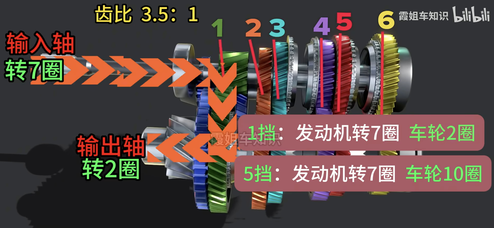

# 技术原理

## 内燃机

汽车内燃机拥有超过百年的历史，期间诞生了很多发动机技术，大致可以划分为三大类：燃烧控制技术、增压技术、气门控制技术。它们的目的只有一个，就是提升发动机的工作效率。

> [!NOTE]
>
> 汽油发动机工作原理：活塞下行之后，先吸入汽油和空气，形成可燃混合气，活塞上行压缩之后，再通过火花塞引燃。利用燃烧产生的能量再推动活塞下行，活塞再次上行会进行排气。
>
> 也就是，吸气↓ 、压缩↑ 、 做功↓、排气↑ 四个冲程。其中吸气和做功，活塞是向下运动，压缩和排气是向上运动。

### 燃烧控制技术

缸内直喷  vs. 歧管喷射 vs. 化油器

### 增压技术

自然吸气 vs. 机械增压 vs. 涡轮增压 vs. 电动增压

### 气门控制技术

凸轮轴、可变气门正时、可变气门升程、可变压缩比

传感器

## 底盘与操控系统

多连杆 vs. 双叉臂 vs. 麦弗逊 vs. 扭力梁

## 传动系统

四驱 vs. 后驱 vs. 前驱

MT vs. AT vs. DCT vs. CVT

变速箱的作用

1. 变速：通过改变齿比，使发动机的转速和车轮的转速之间的比例改变。

2. 变矩：通过改变使用不同半径的齿轮，影响扭矩（杠杆原理）。

所有档位的齿轮都在空转，但是只有一组齿轮会和同步器毂套上固定。手动挡就是档位杆直接连接同步器毂的拨叉。但是汽车行驶过程中内部所有齿轮其实在高速转动，如果直接换挡可能会导致同步器套不上换挡失败，还会导致齿轮打齿、变速箱磨损，所以换挡之前需要通过离合器中断变速箱的输入动力。

双离合：结构非常简单，就是两台手动变速箱组合到一起。两套离合器，偶数和奇数。换挡时方便衔接。控制奇数档档离合器分离的同时，控制偶数档的离合器马上就贴合。

干式双离合：传动效率高、省油、换挡速度快，但散热性差、耐久性差。

湿式双离合：散热性比较好、承载扭矩高、寿命相对更长，但成本贵、反应慢、传动效率比干式双离合低。

CVT：和两轮踏板车原理类似，只是皮带换成了钢带、钢链。推动主动&从动锥轮，来改变钢带的形状。比如主动锥轮变小变窄，那么从动锥轮就会变大变宽，从而转速变慢、扭矩变大。

优点是实现无级变速，加速减速非常平顺，除了起步可能会有顿挫，行驶中感受不到任何顿挫；市区省油，但高速不一定比双离合省油。缺点是承受扭矩低、扭矩高时钢带易打滑甚至崩断，但可以通过更好的钢带材质来避免。

AT：液力变矩器+行星齿轮组。依靠行星齿轮组的换挡机构，动力传递过程中不依赖任何摩擦。

行星齿轮组：太阳轮、环形齿圈、行星架组成。

优点是承受大扭矩（双离合会离合器摩擦、CVT会钢带摩擦），最早是用于坦克上，皮实耐用。缺点是液力变矩器在低速时依靠油液甩动，传动效率低 导致费油（高速还好，时速40以上会离合锁止，形成一个整体机械连接），换挡速度慢 导致 顿挫，专利的原因 导致 贵。

# 单点知识