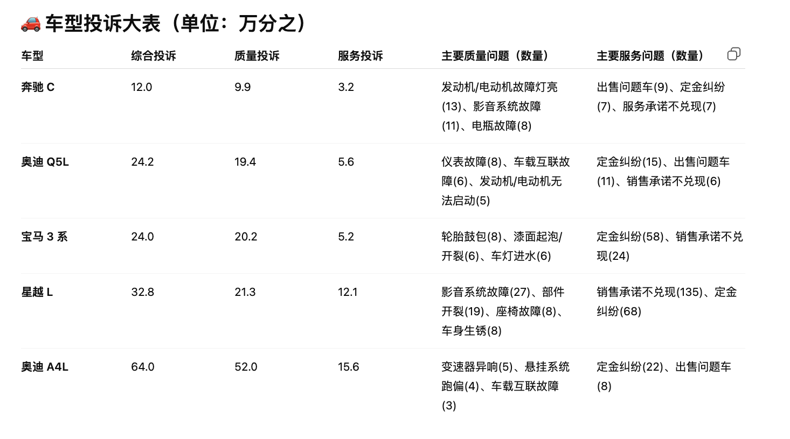
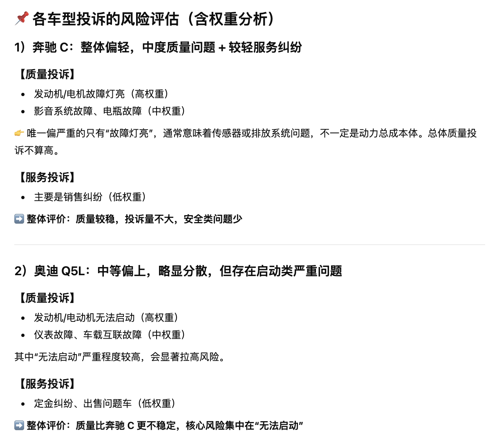
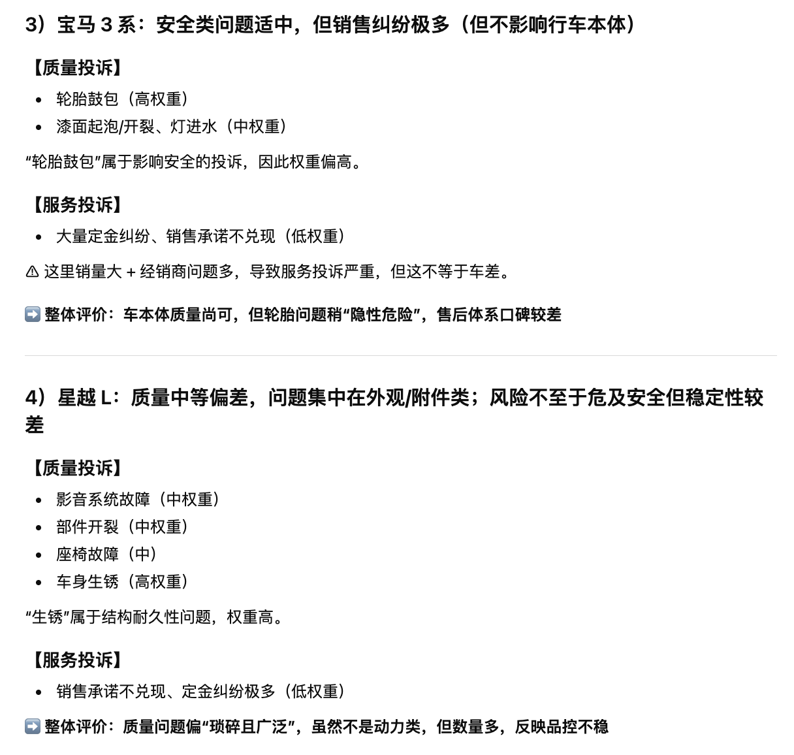
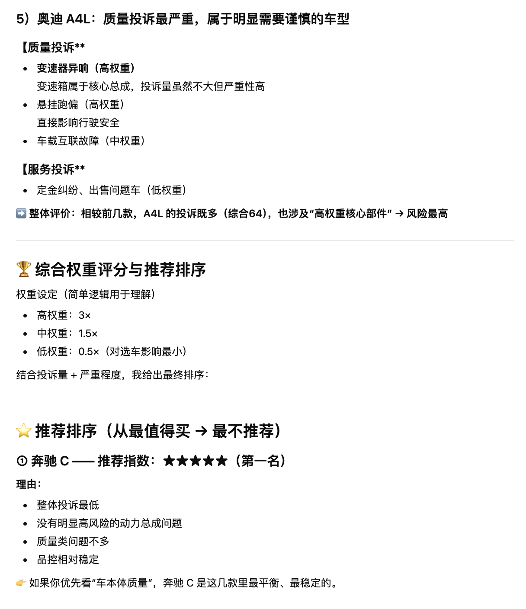
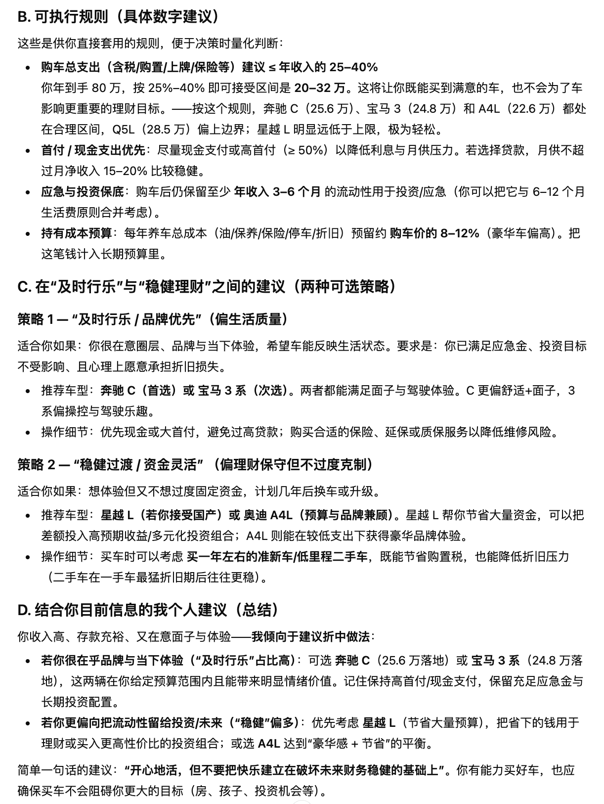
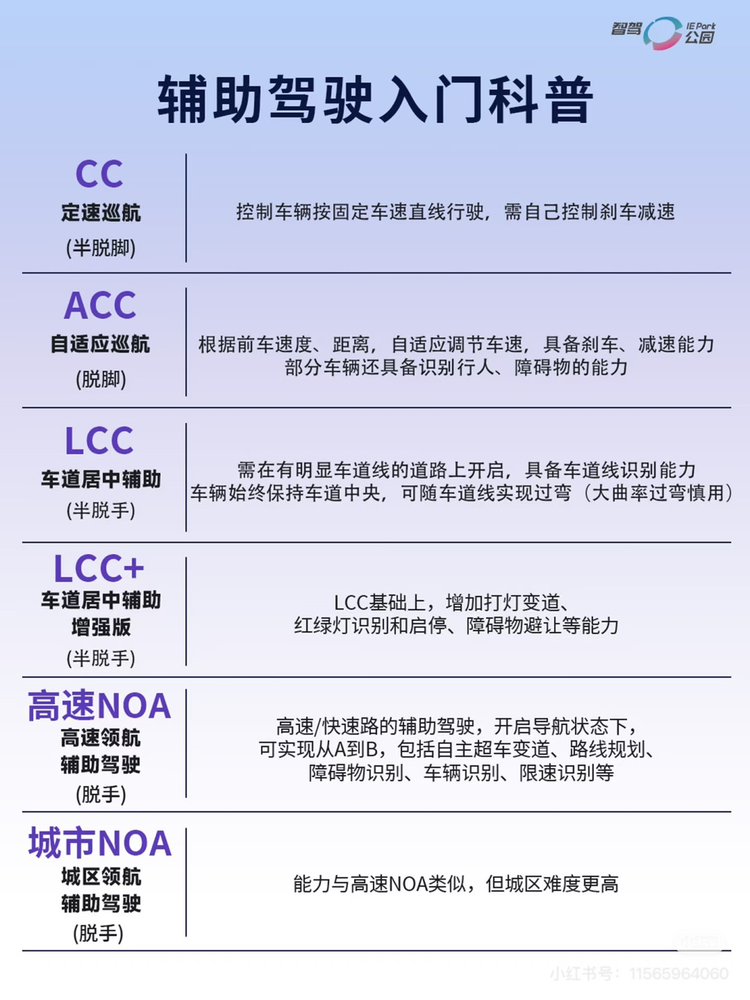
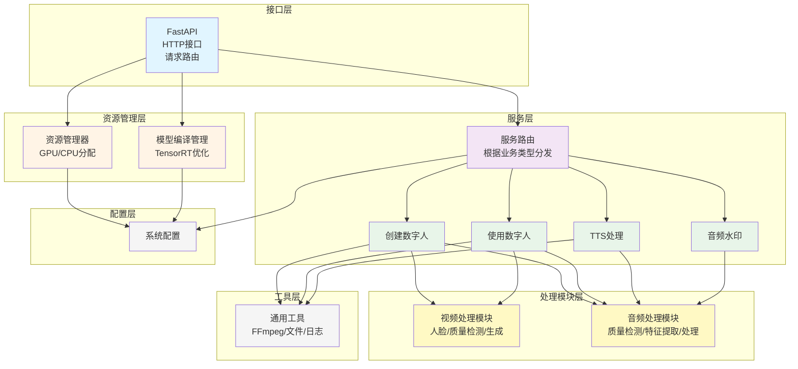
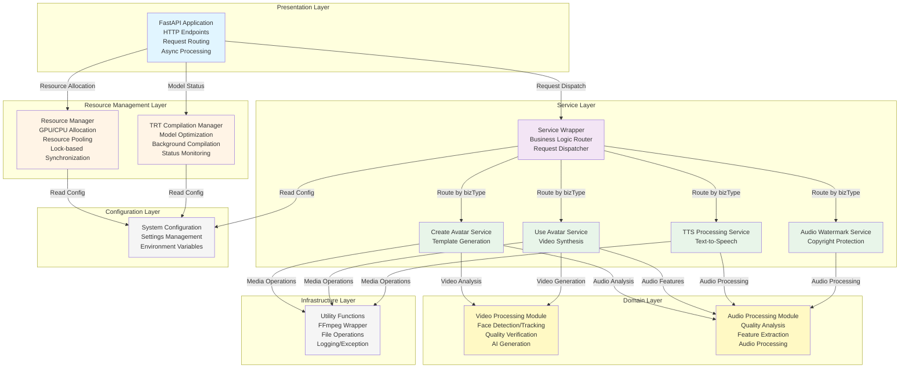

https://12365auto.com/


| 车型          | 综合投诉 | 质量投诉 | 服务投诉 | 主要质量问题（数量）                                     | 主要服务问题（数量）                            |
| ------------- | -------- | -------- | -------- | -------------------------------------------------------- | ----------------------------------------------- |
| **奔驰 C**    | 12.0     | 9.9      | 3.2      | 发动机/电动机故障灯亮(13)、影音系统故障(11)、电瓶故障(8) | 出售问题车(9)、定金纠纷(7)、服务承诺不兑现(7)   |
| **奥迪 Q5L**  | 24.2     | 19.4     | 5.6      | 仪表故障(8)、车载互联故障(6)、发动机/电动机无法启动(5)   | 定金纠纷(15)、出售问题车(11)、销售承诺不兑现(6) |
| **宝马 3 系** | 24.0     | 20.2     | 5.2      | 轮胎鼓包(8)、漆面起泡/开裂(6)、车灯进水(6)               | 定金纠纷(58)、销售承诺不兑现(24)                |
| **星越 L**    | 32.8     | 21.3     | 12.1     | 影音系统故障(27)、部件开裂(19)、座椅故障(8)、车身生锈(8) | 销售承诺不兑现(135)、定金纠纷(68)               |
| **奥迪 A4L**  | 64.0     | 52.0     | 15.6     | 变速器异响(5)、悬挂系统跑偏(4)、车载互联故障(3)          | 定金纠纷(22)、出售问题车(8)                     |












C260L落地25万6，3系落地24万8，A4L落地22万6，Q5L落地28万5，星越L落地14万9

Q5L可以考虑上45豪华，如果上45臻选，会有矩阵大灯和ACC。

```mermaid
flowchart TD
    Start([开始创建数字人]) --> Prepare[准备阶段]
    
    Prepare --> CheckInput[检查输入文件<br/>视频、音频、输出路径]
    CheckInput --> CheckResource[检查GPU资源]
    CheckResource --> CreateFolder[创建输出目录]
    CreateFolder --> CleanOld[清理旧文件]
    
    CleanOld --> AudioQuality[音频质量检测]
    AudioQuality -->|检测有效语音时长<br/>自动增益处理| AudioOK{音频合格?}
    AudioOK -->|不合格| Fail1[失败: 音频质量不足]
    AudioOK -->|合格| VideoProcess[视频预处理]
    
    VideoProcess --> ConvertFPS[视频格式转换<br/>统一为25帧/秒]
    
    ConvertFPS --> BioVerify[活体检测]
    BioVerify -->|检测眨眼、张嘴、<br/>头部转动等动作| BioOK{活体检测通过?}
    BioOK -->|不通过| Fail2[失败: 活体检测失败]
    BioOK -->|通过| IDVerify[身份一致性检测]
    
    IDVerify -->|验证是否为同一人<br/>检测多人脸| IDOK{身份验证通过?}
    IDOK -->|不通过| Fail2
    IDOK -->|通过| FaceAnalysis[人脸分析]
    
    FaceAnalysis --> ExtractFace[提取人脸信息<br/>关键点、姿态、表情]
    ExtractFace --> LipMove[检测唇部运动]
    LipMove --> LipSync[检测唇音同步<br/>验证音频与视频匹配]
    
    LipSync --> FrameLoop[逐帧分析视频]
    
    FrameLoop --> CheckFrame{检查当前帧}
    CheckFrame -->|多人脸| Skip[跳过该帧]
    CheckFrame -->|单人脸| CheckQuality[检查帧质量]
    
    CheckQuality --> BlurCheck{是否模糊?}
    BlurCheck -->|模糊| Skip
    BlurCheck -->|清晰| PoseCheck{头部角度是否过大?}
    
    PoseCheck -->|角度过大| Skip
    PoseCheck -->|角度正常| HandCheck{手部是否遮挡嘴部?}
    
    HandCheck -->|遮挡| Skip
    HandCheck -->|未遮挡| Collect[收集合格帧]
    
    Collect --> Thumbnail[收集缩略图候选<br/>选择眼睛睁开最大的]
    Collect --> RefImage[收集参考图像候选<br/>记录嘴部和牙齿区域]
    
    Skip --> NextFrame{还有更多帧?}
    Thumbnail --> NextFrame
    RefImage --> NextFrame
    
    NextFrame -->|是| FrameLoop
    NextFrame -->|否| Validate{候选数量足够?}
    
    Validate -->|不足| Fail3[失败: 合格帧不足]
    Validate -->|足够| Select[选择最佳素材]
    
    Select --> SelectThumb[选择最佳缩略图<br/>眼睛睁开最大]
    SelectThumb --> SelectRef[选择5张参考图像<br/>基于嘴部和牙齿区域]
    SelectRef --> SelectVideo[选择最佳视频片段<br/>最长连续合格帧序列]
    
    SelectVideo --> GenVideo[生成模板视频]
    
    GenVideo --> GenForward[生成前向视频]
    GenForward --> GenMask[生成背景分割遮罩]
    GenMask --> GenBackward[生成反向视频]
    GenBackward --> GenThumb[生成多种缩略图<br/>带/不带背景、带/不带水印]
    
    GenThumb --> Package[打包模板文件]
    Package --> Save[保存所有文件]
    Save --> Success([成功: 返回模板])
    
    Fail1 --> End([结束])
    Fail2 --> End
    Fail3 --> End
    Success --> End
    
    style Start fill:#e1f5ff
    style Success fill:#d4edda
    style Fail1 fill:#f8d7da
    style Fail2 fill:#f8d7da
    style Fail3 fill:#f8d7da
    style End fill:#f0f0f0
```

```mermaid
flowchart TD
    Start([开始使用数字人]) --> Prepare[准备阶段]
    
    Prepare --> CheckInput[检查输入文件<br/>模板、音频、输出路径]
    CheckInput --> CheckResource[检查GPU资源]
    CheckResource --> CreateFolder[创建输出目录]
    CreateFolder --> CleanOld[清理旧文件]
    
    CleanOld --> AudioProcess[音频处理]
    AudioProcess --> ConvertWAV[转换为WAV格式]
    ConvertWAV --> AGC[自动增益控制处理]
    
    AGC --> ExtractTemplate[解压模板文件]
    ExtractTemplate -->|解压tar文件| FindConfig[查找模板配置]
    
    FindConfig -->|查找水印文本<br/>人物名称<br/>微调模式| AudioWatermark{需要音频水印?}
    
    AudioWatermark -->|是| ApplyAudioWM[应用音频水印]
    AudioWatermark -->|否| SkipAudioWM[跳过音频水印]
    
    ApplyAudioWM --> LoadModel[加载模型和模板]
    SkipAudioWM --> LoadModel
    
    LoadModel -->|加载AI模型<br/>加载模板视频<br/>加载参考图像<br/>加载边界框数据| ExtractAudio[提取音频特征]
    
    ExtractAudio -->|提取音频特征向量| VideoLoop[视频生成循环]
    
    VideoLoop --> ReadFrame[读取模板视频帧<br/>前向/反向交替]
    ReadFrame --> CropFace[裁剪人脸区域]
    CropFace --> PrepareInput[准备模型输入<br/>姿态+参考图像]
    
    PrepareInput --> ModelInference[AI模型推理<br/>生成新的人脸]
    ModelInference --> PostProcess[后处理]
    
    PostProcess --> MergeFace[融合人脸到原图]
    MergeFace --> Background{需要背景替换?}
    
    Background -->|是| ReplaceBG[替换背景]
    Background -->|否| AddWatermark{需要水印?}
    
    ReplaceBG --> AddWatermark
    AddWatermark -->|是| ApplyWM[添加视觉水印]
    AddWatermark -->|否| WriteFrame[写入视频帧]
    
    ApplyWM --> WriteFrame
    WriteFrame --> MoreFrames{还有更多帧?}
    
    MoreFrames -->|是| VideoLoop
    MoreFrames -->|否| MergeAV[合并音频和视频]
    
    MergeAV -->|将处理后的音频<br/>与生成的视频合并| ReadWatermark[读取水印位置]
    ReadWatermark --> CleanTemp[清理临时文件]
    CleanTemp --> Success([成功: 返回视频])
    
    style Start fill:#e1f5ff
    style Success fill:#d4edda
    style End fill:#f0f0f0
```









````mermaid

````



