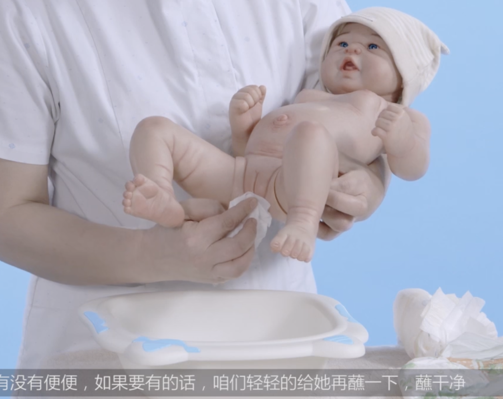
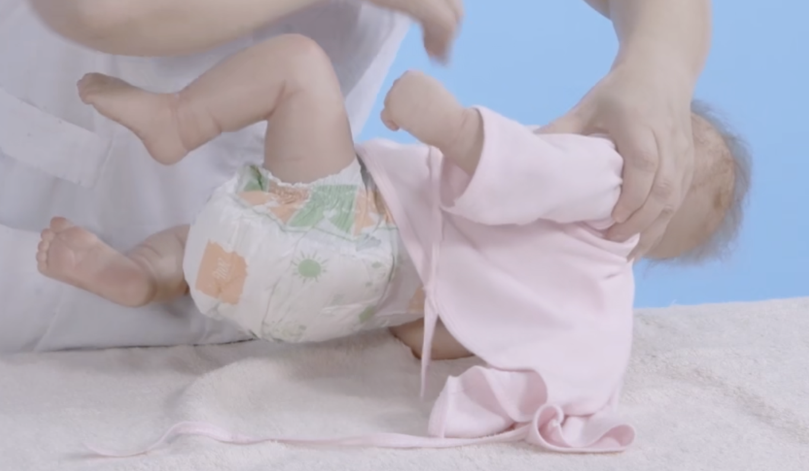

# 《妈妈宝典》

## 认识新生儿的特点

宝宝身长一般在50cm左右，肤色红润，哭声非常响亮。

新生儿头部在身体中占的比例会略大一些，头部有两个囟门，前囟和后囟。

一般，前囟在出生后一岁到一岁半会自然闭合。后囟在2～4个月时就会闭合了。

用手触摸宝宝的前囟时，会感受到脉搏一样的波动。新生儿的囟门非常娇嫩，清洁囟门时一定要注意，动作一定要轻。

宝宝出生后的一段时间，睡眠时间比较长，大概在20个小时左右。睡眠时间后均匀分布在几次哺乳之间。

我们抱着宝宝或者在给宝宝喂奶的时候，要做一些护理的时候，可以多和宝宝聊天，说说话，让宝宝熟悉爸爸和妈妈的声音。这也是神经系统刺激的一个部分，也是亲子关系建立的第一步。

## 如何正确的抱起宝宝

从床上抱起来，

- 第一步，我们要注意保护宝宝的头和颈部，一只手将宝宝轻轻的托起，另一只手插在头和颈部。然后手托住宝宝的臀部。

  

- 抱的过程中，我们一定要注意保护好，因为宝宝的头和颈还没有发育完善。

  

- 抱的过程中还有一点特别重要，就是要避免摇晃综合征。

  

  >  [!IMPORTANT]
  >
  > 保护头和颈，避免摇晃。

  

## 正确的抱姿

### 摇篮式

把宝宝的头放在你的胳膊的肘窝处，另一只手托住宝宝的臀部。

优点：可以用眼睛看着宝宝，和宝宝交流。

### 竖抱

从床上抱起，也是要注意宝宝的颈和头，一只手托住，另一手抱住宝宝臀部。这时咱们操作者的身体要尽量的前倾。双手将宝宝向上举，将宝宝的头部放在肩膀上。

当你的手摸到宝宝的耳朵在上方的时候，就可以，说明宝宝的脸已经让出来了，不会引起窒息。

可以把宝宝的小手放出来。

竖抱时，保护好宝宝的头颈部、腰部。不要随便的不托着头颈、来回摇晃，非常危险。

优点：可以拍嗝，非常常用

### 坐抱

手放到宝宝腋下，让宝宝身体靠着操作者的身体，这样颈部不会受力，是非常安全的。另一只手托住宝宝的腰部。

## 更换尿布湿

由于婴幼儿排便排尿非常的频繁。使用尿布的话，宝宝护理不到位会引起尿布疹。

所以怎么正确的给宝宝更换纸尿裤就显得特别的重要。

可以在每次喂奶前更换纸尿裤，但这也不是绝对的。家长可以根据宝宝的实际情况来确定是否更换纸尿裤。

> [!TIP]
>
> 每次喂奶前更换纸尿裤

此外，现在有些纸尿裤有的有显示条，有的没有显示条。

如上图，黄色的显示条，当宝宝尿了以后，它就会变成蓝色的。

> [!TIP]
>
> 指示线变色时更换

如果没有显示条，咱们可以勤着看一下，如果从侧边看一下里面湿的，或者用手轻轻的触碰一下，沉甸甸的感觉，说明宝宝就该换纸尿裤了。

> [!TIP]
>
> 侧边触摸手感湿、分量重，即可更换。

> [!NOTE]
>
> 只要是宝宝尿了，我们一定要勤换纸尿裤，避免宝宝有尿布疹的发生。

更换纸尿裤：

Step1：首先，把两边的粘扣打开。打开之后一定要反折一下，避免伤到宝宝的皮肤。—— `要点1：粘扣反折，避免伤及皮肤`

Step2：如果宝宝拉了大便，可以观察一下颜色是否正常，量多不多。

Step3：两只手把宝宝的脚一攥攥起来，要轻一点，把小屁屁抬起来。这个时候把纸尿裤轻轻的反折一下。——`动作要轻`

Step4：我们用湿纸巾蘸取刚才的尿液或者便便，但是一定要记住从上往下。特别是女宝宝更要注意这个卫生，不要把宝宝的屁股搞污染了。蘸一次换一个湿纸巾。

Step5：把这个污染的纸尿裤、湿纸巾折叠一下，放到边上。

Step6：把干净的纸尿裤垫在宝宝的屁股下面，这样避免咱们在换的时候TA又尿了。

正好这个时间咱们可以晾一下宝宝的小屁屁。

Step7：咱们可以用一下宝宝的护臀霜。一边抹一点。避开宝宝的生殖器和肛门，轻轻薄薄的不要抹太厚。

> [!NOTE]
>
> 护臀霜可起到“隔尿”的作用。对宝宝的皮肤是有好处的，用黄豆粒大小就可以。

Step8：把纸尿裤垫上，小粘扣粘好。

Step9：把纸尿裤的小花边往外掏一下，这样就把它整理好了。

> 不掏出来，宝宝有时侧着睡，可能尿液会从侧边流出。
>
> 有些妈妈疑问，宝宝穿着纸尿裤怎么床也湿了。就是要留意纸尿裤的这个小机关。

## 如何给宝宝清洗屁屁

> [!TIP]
>
> 什么是“胎便”：宝宝在子宫中积聚在肠道中的粪便。

胎便比较粘稠，一般呈黑色或者深绿色。

等胎便完全排空后，宝宝的便便就会变成黄绿色，如果是吃母乳的宝宝，便便很快会变成淡黄色粘稠糊状。正常情况下，开始吃辅食之前，宝宝便便一般是非常松软的，甚至有点稀。如果是吃配方奶的宝宝，便便可能是成型，颜色比较淡，有臭味。

> [!TIP]
>
> 母乳喂养的宝宝：添加辅食之前，便便一般非常松软，为淡黄色。
>
> 奶粉（配方奶）喂养的宝宝：便便成型，更为厚实。

可以通过便便的情况，来判断宝宝的身体状况。当宝宝排便后，我们需要及时给宝宝清理，避免发生红屁屁。

Step1：准备一盆温开水，湿纸巾，纸尿裤，护臀霜，还有柔软的干纸。

Step2：把宝宝的屁股抬起来，用湿纸巾，从前向后擦一下。折叠丢弃该湿纸巾。

Step3：抱着宝宝，试水温37度左右，给宝宝再用 一张干净的湿纸巾清洗阴部、屁屁。擦一次，用水蘸一下。尤其是女宝宝有的时候会阴部这个地方也会藏便便。一定各个地方擦干净，最后把宝宝的肛门擦一下。

Step4：拿一个软软的干纸巾，轻轻的蘸一下宝宝的屁股。蘸完前头了，到后面擦一下就可以了。

Step5：把盆放一边，给宝宝穿纸尿裤了。

## 怎么给新生儿选择衣物

宝宝衣服的选择非常有讲究：

- 应该选择一些纯棉的衣服，宽松的。
- 不要选择那些带一些装饰扣的小衣服
- 剪掉线头及商标
- 宝宝的衣服使用前一定要彻底的清洗
- 春秋季节出生的宝宝建议选择长袖，纯棉，宽松的衣服
- 夏天出生的小宝宝，由于天气比较闷热，宝宝容易出汗，身体也比较的湿热。建议选择纯棉的衣服，或者是纯棉的那种小肚兜。
- 冬天出生的宝宝建议贴身穿长袖的，纯棉或者是纯棉绒质的衣服。然后裹上一层小包被。
- 冬季不给宝宝穿单件的厚衣服，而应多加几层。这样衣服与衣服之间，会形成一层保护膜，隔绝冷空气，达到保暖的作用。加上一层小包被更好。
- 同等的温度下，婴儿的衣服应该比成人少一层。
- 早产儿需多加一件衣服，直到TA的体重达到足月婴儿的水平。
- 如果穿袜子，一定检查袜子有没有线头，袜口是不是过紧，避免影响宝宝的末梢循环。新生儿无需带手套，限制手部活动和触觉，不利于脑部发育，长时间会给宝宝造成一种心理障碍。

## 如何给宝宝穿衣服

穿脱衣服的动作一定要轻柔，不要生拉硬拽。

> 总之，耐心温柔就是最好的方法。

### 穿衣服

Step1：换衣服前，把干净的衣服准备好，然后检查一下，注意房间的室温（应在26～28度）。检查衣服有没有小线头、小商标，是否干爽。

Step2：操作者把手伸到宝宝的衣服的袖子里面，然后去摸宝宝的小手（跟宝宝做一个游戏，你的手在哪呢）。穿上一只手时，轻轻的把宝宝的肩膀抬起，护着点TA的头，把前身给TA遮一下，把衣服铺平，放下。再把另一边的肩轻轻的抬起，用同样的方法穿这边的小胳膊。

> [!TIP]
>
> 穿衣服时需跟宝宝交流互动

Step3：观察宝宝舒服没有。

### 脱衣服

Step1：先解开和服的绳子，可以稍微系一下以免影响操作。

Step2：依次脱去两只胳膊的衣服，把宝宝抬起来，衣服就可以拿出来。

>  [!NOTE]
>
> 新生儿应尽量避免选择套头衫
>
> 套头衫的穿脱（比较不方便）：
>
> 穿的时候先套头，因为避免宝宝窒息，完了再穿小肢体。但是脱的时候要先脱小肢体，然后再脱头。脱头的时候注意不要挡脸，宝宝会觉得不安全的。

## 如何给宝宝打襁褓

## 正确的睡姿很重要

## 如何给宝宝翻身

## 如何给宝宝洗脸

## 如何给宝宝擦浴

## 如何给宝宝洗澡

## 宝宝的皮肤护理

## 如何给宝宝拍嗝

## 如何识别宝宝的哭声

## 如何安抚哭闹的宝宝

## 如何给宝宝做抚触

## 新生儿护理
